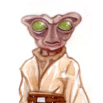
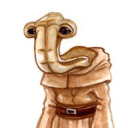
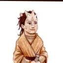

# Whispers in the Void • Ch1 Descending Into Darkness

## **Storyteller** (03/07/2025 15:51:44)  

*1347597597552021517*

### Chapter One: Descending Into Darkness ###
The vibrant, swirling colours of Bespin's atmosphere filled the viewport, a breathtaking panorama that failed to fully distract Wes Del-Fin from the burning ache in his muscles. One month. One month since he'd traded the harsh, unforgiving training grounds of his Mandalorian clan for the equally, if differently, challenging environment of the Chu'unthor II, the Altisian Jedi's praxeum ship. One month since he'd become the learner of Master Ruhk.
The past weeks had been a whirlwind of intense physical and mental conditioning. Wes, already accustomed to the rigorous demands of Mandalorian warrior training, found himself pushed to new limits. Days began before dawn with grueling calisthenics in the ship's expansive training dojo, followed by hours of lightsaber drills, focusing on the fundamentals of Form III, Soresu – a style Master Ruhk deemed essential for a warrior accustomed to blaster fire. The Feeorin Master was a relentless instructor, his critiques as sharp and unyielding as his own legendary physique. He'd bark corrections, demonstrate techniques with terrifying speed and precision, and offer only the sparest of praise, reserved for genuine improvement.
Beyond the physical, Wes had begun his exploration of the Force. Meditation sessions, often held in the Chu'unthor II's serene meditation gardens – surprisingly lush spaces tucked away within the metallic heart of the ship – were a constant struggle. Quieting the restless energy of his Mandalorian upbringing, the ingrained instinct to act rather than be, was proving a formidable challenge. Master Ruhk, however, was surprisingly patient in these sessions, guiding Wes through breathing exercises and visualizations, emphasizing the importance of finding inner stillness amidst the chaos of the galaxy.

---

## **Storyteller** (03/07/2025 15:51:59)  

*1347597660261060609*

Wes had also caught glimpses of the Altisian Jedi's unique philosophy. He'd sat in on lectures discussing the Order's less rigid interpretation of the Force, their acceptance of attachments, and their focus on community. He'd seen Jedi families training together, Masters taking on multiple learners, and a general atmosphere of camaraderie that contrasted starkly with the austere image he'd held of the Jedi Order. The echoes of his clan's values, centered on unity and loyalty, resonated strongly with the Altisian way.
But there were shadows too. He'd overheard hushed conversations about Master Ruhk's past, his disillusionment with the Republic, and the tragedy that had driven him to the Altisian fold. The weight of that past seemed to hang heavy on the Feeorin Master, a silent burden that fueled his relentless drive for excellence in his students.

---

## **Storyteller** (03/07/2025 16:30:33)  

*1347607365024874558*

Today, however, felt different. Though it was difficult for Wes to put a finger on how, some sort of foreboding rested in the pit of his stomach. Master Ruhk has summoned Wes to the training atrium. When he arrives, he sees the training atrium is a buzz of activity as a pair of Jedi trainees prepare themselves to spar at its center. One is a grey-eyed youth just entering his teen years wielding a blue-bladed lightsaber with a handle that is longer than his arm. The other is a red-haired young woman approaching her middle-teen years. In one hand she wields a green-bladed lightsaber, while her other hand is oddly missing all the way to her elbow joint. Several other initiates and padawans sit in a circle around the sandy dueling pit, varying degrees of perspiration coating their foreheads. A motley collection of Republic personnel and adherents of other Force-using paths also gather around the pit, credits changing hands in discreet, and not-so discreet, wagers on the sparring matches. Both of the trainees turn to bow and salute the massive Feeorin Jedi Master, who acknowledges them with nothing more than a simple nod before returning his attention to the maintenance of his meditation garden, a small Ithorian girl potting plants at his side.
Wes recognizes the pair as his fellow students of the Feeroin Master, Ash Peztar and Adalayn Pallax. Ash’s grey eyes watch the older girl warily and with grim purpose, their previous matches making it clear the youth is at a disadvantage in experience even with Adalyn’s apparent handicap. Ash had loudly one day declared the girl his rival, though it was apparent the older girl didn’t reciprocate. Around the ring, Wes sees the other three younglings of Ruhk’s Youngling Clan, the Charging Zakkeg, their heads coming together when they determine the Feeorin master isn’t looking in some attempt to conspire a plan for their next mischief.

---

## **Storyteller** (03/08/2025 00:36:34)  

*1347729677036552232*

---

## **Wes Del-Fin** (03/08/2025 01:36:57)  

*1347744871296925778*

Wes stood in front of the large exterior window.   Despite the eye-catching view of Bespin atmosphere the beauty couldn’t detract from the soreness of the muscles all over his body.  While the young Mandalorian had grown up and flourished in perhaps one of the most arduous and grueling training grounds in the galaxy he had found the training here on the praxeum ship just as challenging and intense.  

He smiled.  

He knew the Jedi trained hard.  That fact was known having fought alongside them for some time.  It was made even more relevant with the time he spent with Rin.  With the thought of her he found himself reaching out through the Force and their bond.  All he could sense was that she was very far away. 

His training wasn’t just physical.  If it had been it would be like back home.  Here training with the Force was just as much prioritized as the physical.  He found out quickly that he had so much to learn.

---

## **Wes Del-Fin** (03/08/2025 01:37:26)  

*1347744993451708508*

One thing he liked here was the difference it had with the Order.   Lax in some ways not in others.   Families trained together and physical attachments were allowed and accepted.  All of it was overshadowed by Master Ruhk.  Rumors about his past and why he came here.  The master was driven with a purpose to bring out the best in his students.  

As he stood there looking at the swirling clouds something gnawed at him.  Before meeting Rin and finally ending up here he would have called it a gut feeling.  Now he knew it wasn’t just his gut.  It was a feeling from the Force yet it had the same sense his gut would have told him.  Be vigilant.  

………

Walking into the training atrium Wes saw that the room was a flurry of activity.   What drew his eyes was the two facing off.   A young red haired girl who was close in age to him and a boy who was a few years younger.  Others were gathered around to watch Adalayn and Ash face off including the younglings.  Wes smiled as they talked in hushed tones.   Turning back towards the ring Wes shifted the helmet that was tucked under his left arm as he looked onward.

---

## **Master Rukh** (03/08/2025 02:40:50)  

*1347760951243571250*

The Jedi Master rises to his feet and dusts his massive hands on the hem of his robe. After giving a few instructions to the young Ithorian, the giant Feeorin moves over towards the sparring ring, the spectators gathered around the ring parting before him. When the Jedi Master comes to stand before the two duelists, he folds his arms over his chest and looks each of the fighters directly in the eyes before nodding to himself.
“**Begin,**” he commands in his gruff bravado.

---

## **Storyteller** (03/08/2025 02:40:51)  

*1347760952560324639*

The pair begin to circle each other around the ring, Adalyn watching her younger counterpart carefully and waiting for the inevitable moment when Ash’s patience would wear out. Then he breaks into a run, charging across the circle, bearing down on her to strike at her right. Only at the last second does he reveal the action as a feint, spinning on his heels and bringing the energy blade around to her left flank. 
Although Adalyn is the quicker and more experienced fighter, Ash has the reach and leverage advantage with his long-hafted lightsaber, and as he barrels forward his last minute feint strikes true, leaving a painful weal across Adalyn's left thigh. But the elation of striking the first blow is short lived, as the red-haired Padawan draws upon the Force and absorbs the energy of Ash's training saber and then dissipates it as a benign cloud of heat around her. Through some trick of the ambient light, and the evaporation of the sweat-heavy air around the two, the cloud of heat appears as a red-tinged shimmer that blows away in all directions around the two. Assuming a defensive posture, Adalyn licks a blow out at the retreating initiate, but it serves to do nothing more than ward Ash away as he resets his stance.

---

## **Storyteller** (03/08/2025 02:41:26)  

*1347761101038817340*

**"Didja see that?! He hit'er clean and she took it like a nerf-lick! She's cheating!"** 
**"Must not know many Jedi son; they all cheat! Now throttle-off and get your creds set for when Red here beats the runt and I win!"**
Many of the non-Jedi onlookers erupt a brief bout of applause at the display, but a glower from Master Ruhk quickly hushes them to low murmurs.

---

## **Master Rukh** (03/08/2025 02:41:27)  

*1347761102859014247*

The Jedi Master then returns his attention to the ensuing combat, his face as passive as a particularly austere purple slab of granite. When he speaks, the Feeorin's voice contains the steady rumble of an approaching thunderhead; low yet projecting power. 
**"You're not a bull bantha Ash, so don't charge like one; fight to your strengths. And don't look at me that way Padawan Pallax. Your comrades will test you more than any battlefield, and expose to you greater weaknesses. These practices will serve you well... If you should choose to learn from them. Continue!"** At Master Ruhk's sharp command all fringe conversation breaks off and the atrium is once again thrown into silence .

---

## **Storyteller** (03/08/2025 03:54:06)  

*1347779387092635659*

---

## **Wes Del-Fin** (03/08/2025 21:08:27)  

*1348039689545977939*

The silence was deafening.   The slight hum of the two blades was all that could be heard as Adalyn and Ash circled.  Wes smiled as he watched the red haired girl when he saw what she was doing.  She was patiently waiting for Ash to act rashly.  It happened quickly when Ash bolted.  He wasn’t sure if Adalyn was caught off guard but the young boys feint worked and he scored the first hit.  Ash had the advantage of reach.  If Adalyn wanted to negate that advantage she’d have to close in to turn the advantage back to her quicker strikes and reaction time.   

He watched with raised eyebrows at what happened after the successful strike.   He could feel the use of the Force and how she absorbed the energy of the blade and dissipated it away.  That was something he hadn’t seen before.   Though that wasn’t surprising as the extent of his Jedi training was only a month deep.   Talk erupted around the ring commenting on the duel and it was quickly silenced by a look from Master Rush.  With their Master giving the command to begin again Wes watched hoping that Adalyn would teach the young boy a lesson today.

---

## **Ash Peztar** (03/08/2025 22:18:52)  

*1348057409142132839*

A flicker of irritation dances across Ash's face. His brilliant maneuver, a moment of carefully calculated aggression, crumbles under Adalyn's effortless use of the Force. A silent plea hangs in the air, a desperate hope that Master Ruhk will call a foul. But Ash knows better. Rukh, ever the proponent of challenge, will let it slide. It's a bitter pill to swallow, especially when Ash's own Force abilities are barely a whisper, a nascent potential untouched by formal training.Their lightsabers clash, a blur of energy and steel. Ash allows himself to be pushed back, retreating strategically towards the gathered crowd, keeping just out of Adalyn's reach. A sly grin forms before he leaps into the throng in a sudden burst of speed, disappearing amongst the spectators. The sound of Ash's footsteps fades into the crowd as he beats a seeming retreat. Wexal and Depik roll to their sides to allow him to pass, Depik with an overly enthusiastic wave, and when he's fully amidst the throng, it's as if the crowd were some singular entity conspiring to keep the waspish youth concealed.

---

## **Storyteller** (03/08/2025 22:19:40)  

*1348057612134125690*

**"Hey, where's he going?! He can't do that! Can he do that?!?"**
**"Haha, the little exhaust port ran! Pay up Chapper!"** Here and there the wily initiate uses the force to goose and jostle the onlookers, hoping to divert Adalyn's attention, but he does not quite escape Adalyn's Force-honed perceptions. Wherever Ash moves, Adalyn follows, until the Padawan is at the edge of the dueling ring shadowing Ash's every step. The crowd edges warily away from the glow of her lightsaber.

---

## **Master Rukh** (03/08/2025 22:19:40)  

*1348057613878689793*

Master Ruhk watches the turn of events with the same implacable expression, although a slight quirk of his brow signals his surprise.

---

## **Adalyn Pallax** (03/08/2025 22:34:33)  

*1348061359459405944*

Moving towards him, she doesn’t intend on letting him near the crowd to hide again. “**Nice move, Peztar**,” she starts. “**The bystanders are lucky I’m not out to get you at any cost.**” With that, she raises her blade, back into a fighting stance.

---

## **Master Rukh** (03/08/2025 22:34:34)  

*1348061361183129761*

"**And if you were?**" Master Ruhk's voice cuts through the din of the crowd, causing more than a few heads to turn in his direction. Although the volume of his voice has not changed, his question is much sharper and challenging, demanding an answer. His eyes lock onto Adalyn as she continues to shadow Ash, his gaze deep and waiting. "**The Jedi's first duty is service to the Force. The Force is the essence of every living thing; so by extension the Jedi's first duty is to life itself. What would you do, Padawan Pallax, if 'bystanding' life comes between you, and your objective?**"

---

## **Storyteller** (03/08/2025 22:35:56)  

*1348061706387067002*

Ash chooses the exact moment that Master Ruhk completes his last question to spring into action, a halo lamp appearing in his hand at the flick of his wrist, which he then uses to flash a beam of bright white light directly into Adalyn's eyes. With little time to think, Adalyn seizes the Force and sweeps her hand toward Ash, and then back behind her towards the center of the ring in wild fashion. Several surprised exclamations erupt from the crowd as the dark-haired youth goes hurtling from their midst to skid across the sandy dueling pit to land unceremoniously in its center. Adalyn then staggers flat-footed towards the center of the ring, blinking and scrubbing feverishly to clear the bright, circular after-images from her vision.

Ash rolls onto his shoulders and plants his hands, using the momentum from the maneuver to hand-spring to his feet. As he does, a sensation warns Adalyn through the Force, and she spins with a rising cut that is meant to catch Ash through the collarbone. The dark-haired youth feels the muted heat of the plasma blade wash over his face as it blurs past, singing some hair from the top of his head but leaving his no worse for wear. The long-handled lightsaber hums to life as Ash pounces like an angry Bha'lir cub, his intent to sunder Adalyn's training saber.

---

## **Storyteller** (03/08/2025 22:36:17)  

*1348061792445792307*

Time seems to slow for the two, and all else fades to obscurity as the brilliant blue blade inches towards the hilt of its antagonist. At the last possible moment, Adalyn's vision seems to clear and with the threat looming she releases her grip on her lightsaber with a spinning flourish, and Ash's blade only manages to scourge a blackened furrow through it's metallic finish. 
As Ash goes lunging by, Adalyn collides with his shoulder and attains a grip at the base of his neck with her now-free hand and then uses his entire body like a springboard to push herself up and away from the Initiate in a spinning somersault. The momentum from Ash's attempt on her lightsaber causes the green-bladed saber to go tumbling backwards over the initiates head in the same arc, and when Adalyn lands the lightsaber falls into her outstretched hand. 
Spinning desperately, Ash brings his lightsaber around in a whistling two-handed slash, but he is off-balance and in a dire position. Adalyn neatly ducks under the offending swipe and comes up within Ash's guard with a slice that, if these lightsabers were fully focused, would have dissected him from right hip to left shoulder. Every nerve-ending in Ash's body becomes blazing torrent of pain and misfiring synaptic information, leaving him sizzling, slumping, and barely standing in the center of the dueling pit.

---

## **Master Rukh** (03/08/2025 22:36:38)  

*1348061880744284241*

”**Hold! This match is concluded.**" Master Ruhk trundles forward, his heavy footsteps leaving deep in impressions in the sandy dueling pit. From the surrounding throng comes a chorus of cheers, boos, and muttered curses as credits exchange hands. "**You showed impressive cunning, and improvisation against a more skilled opponent Ash. You played to your strengths and sought to disarm Adalyn; remove the threat, not the man. That was good thinking, and shows that you are progressing.**" The Jedi Master flashes a very rare grin, no more than a slight up-turning at the lips, and the corners of his deep, violet eyes crinkle with amusement. But even though he appears in good spirits, when next he speaks there is durasteel-hard sternness to his tone. "**But you showed cunning and ingenuity at the possible expense of those innocents surrounding you. Although this is practice, it is certainly not a game, and you risked bystanders for a slight advantage. For this, you will personally repair any damage you may have inflicted on Padawan Pallax's lightsaber, and the resources to do so will come from your own credits. Should you not have enough, you will work until you do.**" 
He then turns his gaze upon Adalyn. "**And I still await an answer from you Adalyn. Strength is meaningless without focus and care. I will give you some time to think upon it, but should your answer be unsatisfactory you will work penance until you achieve enlightenment.**" With his lecture complete, Master Ruhk turns and lumbers back over to his garden.

---

## **Wes Del-Fin** (03/09/2025 13:31:06)  

*1348286980915462176*

Wes watched in earnest as Adalyn and Ash continued the dual.  Despite the eagerness that Ash showed, Adalyn's patience won out as her training saber found its mark.  Master Ruhk was quick to stop the duel after that, giving praise and stern questions for both.   The young Mandalorian wasn’t sure how much actual combat experience either of them had.  Wes knew he had a different childhood than most here.   From the time he was a foundling combat was ingrained into him.  The fact that his father was the leader of Clan Del-Fin only made him train harder.   It was the same here.    Many of the younglings and older children here began their Jedi training much earlier in their life.   He knew he had a lot to learn about the Force.

Leaving the outside of the dueling ring Wes walked down to where both Ash and Adalyn stood.  He would see that both were still breathing hard from the exercition of the duel.   With a small smile he gave both a nod.  **”Well fought from both of you.”**

---

## **Storyteller** (03/09/2025 14:21:17)  

*1348299613186293761*

The crowd surrounding the dueling pit has begun to disperse, and the trio of Younglings of Zakkeg clan rush towards Ash and Adalyn, each youngling carrying a cup of cold water; Wexal and Jyzen offer theirs to Adalyn and Ash respectively. Jyzen takes a moment to fan away the curling tendrils of evaporated sweat rising off of Ash, Depik chatters excitedly about the match and anything else that comes across her mind, and in a few short moments the small group is standing in the center of the ring by themselves.

---

## **Ash Peztar** (03/09/2025 14:21:18)  

*1348299615660675103*

Ash accepts the glass of water from Jyzen and mumbles his thanks, but he doesn't meet the younger boy's eye. In fact he doesn't seem in the mood to mingle with the others and walks away, glass in hand. With a grim nod to Wes in acceptance of his praise, he otherwise doesn't stop. The youth is putting on a pretense of calm to conceal his impotent anger. He moves awkwardly, the shocks of pain as he takes his steps causing him to limp falteringly. Gritting his teeth he carries on, heading resolutely toward his room.

---

## **Adalyn Pallax** (03/09/2025 14:21:18)  

*1348299616592072736*

Adalyn remains in the center, her gaze following Ash with some concern before turning to Wes. She finishes her water and hands the cup back to Wexal, who disposes of it for her. She crosses her left arm over her chest while what's left of her right hangs limply at her side.
“**Thanks,**” her gaze flicks in the direction Ash has gone. Her eyes still seem to have issues focusing, Ash's trick with the lamp leaving bright halos in her vision. Troubled by the disparaging glare, she rubs at her eyes again hoping to clear her vision. 
The young woman speaks with a melodically inflected tone, not quite Coruscanti, but it's obvious she comes from an equally cultured background. “**Everytime the two of us duel, he always has something surprising up his sleeve. He takes his losses too personally.**”

---

## **Wes Del-Fin** (03/09/2025 15:58:52)  

*1348324169120747614*

Wes watched the young boy walk away.  Despite Ash’s apparent calm and now his own training Wes could feel the strong emotions coming off him after the well fought match.  He let him go without saying anything.   Sometimes one just needed some time to work things out.  

When Adalyn said thanks he turned his head towards her.  Her voice gave off what he thought was hints of Courscanti accent but he wasn’t sure.  One thing he did know is that she wasn’t from the outer rim.   

**”From my limited time here my guess is it’s his age and lack of real combat experience.  Training such as this is a good way to learn just what one does and does not know.  From what I’ve seen and heard he sees you as a competitor.   For what reason I don’t know.”**

---

## **'Charging' Zakkeg Clan** (03/09/2025 17:46:24)  

*1348351229960523897*

The small Youngling clan seems to grow bored and the apparent lack of interest from the older two and wander off to huddle on the far side of dueling ring.

---

## **Adalyn Pallax** (03/09/2025 17:46:24)  

*1348351231340580996*

With a shrug of her shoulder she indicates she's not entirely sure herself. "**Before we came he only had the Zakkeggs to compete with for Master Rukh's approval. He's on the edge of being caught up in their mischief and being held to the standards of a Padawan. I imagine it's a rather frustrating place to be.**" Again she shrugs and starts heading over to refreshement station to get another cup of water.

---

## **Wes Del-Fin** (03/09/2025 19:30:21)  

*1348377390191218810*

As Wes walked with Adalyn to the water station he smiled at her evaluation of Ash being caught between two expectations.  It was one he knew well from his own experience.  **”It's not unexpected.”**  He answered as he grabbed a cup and waited for her to fill her cup first.  **”It happens to us all at some point.  The time when one has to accept that they can’t always be a kid can come hard and fast.  He’s learning that now.  Better here than on the battlefield.  That training ring is forgiving.”**  He jerked a thumb and glanced in the direction of the ring they had just left.  **”The battlefield is not.”**  He added as he looked back at her.  It was then he realized he hadn't really spoken to her before.  He was still meeting new people aboard the paraxium ship. **”I’m Wes.”**  He offered his free hand.

---

## **Adalyn Pallax** (03/09/2025 20:10:56)  

*1348387603015139478*

An unreadable expression crosses her face as Wes speaks of battlefields and she turns away from him under the pretense of adding more to her cup from the automated dispenser. When she turns back, her usual poise has returned. There's a moment of awkwardness as he extends out his right hand for her to shake and Wes suddenly realizes why. Her left hand currently holds the full cup of water and has no free hand to return the gesture. 
Adalyn gives him a good natured smile, though he gets the sense she's being diplomatic and trying to make light of his faux pas. “**Adalyn,**” she responds in kind. She of course already knew who he was, just as Wes knew of her. “**Master Rukh has you on a fairly rigorous training schedule,**” she comments, reasoning why they hadn't had much of an opportunity to actually speak.

---

## **Wes Del-Fin** (03/09/2025 20:39:59)  

*1348394914588790794*

Wes closed his eyes for the briefest of seconds as he groaned inwardly.  Opening his eyes he could see her smile.  He was thankful that it looked genuine and not forced despite his faux pas.   He returned the smile as he took his offered hand back and made for the water dispenser as she talked.   Turning back around he took a quick sip of the water.   **”Rigorous, that’s a good way to put it.  I’m used to rigorous training.   The physical training I wouldn’t say is harder than my Mandalorian training but it is very different.   In a good way though.   It’s forcing me to do things differently.”**  Reflexively he rolled a shoulder that still felt somewhat sore.   **”What I’m still getting used to is training with the Force.  Master Ruhk says I’m restless.  I’m used to action and reaction.  That has been ingrained into me since I was old enough to walk.  It’s been difficult to find the balance between action and no action.  Master Ruhk says I’m getting better but I’m not sure I see it yet.”**

---

## **Adalyn Pallax** (03/09/2025 21:24:04)  

*1348406008610816031*

Adalyn nods appreciative to his challenges. “**Master Rukh is conservative with his praise. If he says you're improving then you must be doing remarkably well.**”  At the thought of the Feeorin Jedi Master she cringes. “**I should go and reflect on my answer to his question before he gives me ‘penance’ just for making him wait.**” Rukh's penance assignments are well known to Wes, having been on the receiving end of a few since his arrival. His most recent requiring him to balance a large pile of mismatched rocks into a formation within the confines of Rukh’s meditation garden.
Finishing her water, she returns the cup to be recycled and she flicks one of her long red tresses over her shoulder as she straightens. Adalyn gives him a small bow in farewell. “**I hope we get to speak again soon,**” she says genuinely.

---

## **Wes Del-Fin** (03/09/2025 22:07:46)  

*1348417004931125258*

Wes gave her a smile as she mentioned Master Rukh’s praise and how often he dispensed it.  **”You're not wrong there.   There have been times I thought I was doing well and nothing was said.”**  He didn’t need to say anymore on it as she knew just as well as he did.   Her evaluation on punishments did ring true as he remembered his last assignment.  

He tossed his cup following Adalyn’s lead.   **”Good luck with Master Ruhk.   And that would be nice.”** He added giving her a small smile as he turned away.  As he took a step something stopped him.  The feeling he had from before that rested in the pit of his stomach.  He turned half way around.  **”Hey Adalyn.”**  He said loud enough for her to hear.   **”I… something felt off earlier.  I can’t explain it.  I don’t know if you’ve felt it but,”**  He didn’t know how to express it.  **”It felt as if something was going to happen.”**  He let it go at that as he gave her a nod and turned towards the garden that Master Ruhk took care of.  

A moment later he stood by the garden where the Feeorin Master was tending to a grouping of plants.   **”Master, you summoned me earlier.”**  He took a breath and forced himself to relax as he waited.

---

## **Adalyn Pallax** (03/10/2025 00:10:14)  

*1348447824412409959*

The young Padawan had begun to turn away when Wes suddenly calls attention back to him. She frowns as she considers his question and then slowly shakes her head. “**You should speak to Master Rukh about it,**” she offers before they go their separate ways.

---

## **Master Rukh** (03/10/2025 00:10:14)  

*1348447826446647296*

Ruhk doesn’t acknowledge Wes at first, as he gives some final instructions to the Ithorian girl nicknamed Squeaks in a low, calming rumble. The girl nods enthusiastically as she takes one of the pots and heads off towards another part of the garden. The massive Feeorin stands, his form towering over even the young Mandalorian. “**Del Fin,**” he says in acknowledgment in his booming, even voice. “**We've been tasked a mission; escort duty for a Med-star squadron to New Holstice. The task force with the supplies will be arriving tonight in addition to personnel who will be going with us and remain stationed here. I'm placing you in charge of the transfers.**” From inside his robe he removes a data card. “**The Zakkegs, Padawan Pallax and Initiate Peztar will accompany us. We'll be leaving at 0500 Galactic Standard.**”

---

## **Wes Del-Fin** (03/10/2025 01:38:57)  

*1348470153213644862*

As Master Ruhk was busy with Squeaks, Wes waited for their master’s instructions to be given and Squeaks eagerly ran odd to another part of the garden and the Feeorin stood and Wes was still amazed at his size.  

They had a mission and he was sure Ruhk felt the initial excitement to be doing something other than training.   He was quick to fight the emotion down to what he thought was a tolerable level.   The fact that Ruhk was placing him in charge of the transfers meant something.  What that something was he wasn’t sure.  Maybe it was because he had done other transfers similar to this with Clan Del-Fin.   Either way it was something other than training.  

Tucking the data card into a pouch he gave Master Ruhk a nod.  **”0500 Galactic Standard. Understood Master.  I’ll contact Adalyn, Ash and the Zakkegs to gear up and be ready for departure.  I’ll keep you updated on the progress.”** 

He waited for the big Feeorin to dismiss him.  As soon as he was dismissed he turned.  He remembered the suggestion from Adalyn about what he was feeling.  He stopped quickly and turned back to Ruck.   The foreboding feeling he felt was running with his emotions.   It was one of the first ones he had since parting with Rin who had helped him discover his affinity with the Force.  

**”Master, may I ask a question?”**  Receiving nothing more than a small nod he continued.  **”Earlier today I had a strange feeling.  If I don’t know what I know now I would have shrugged it off but it’s as if the Force was warning me of something to come.  Have you felt anything in the Force?”**

---

## **Master Rukh** (03/10/2025 02:47:09)  

*1348487314703126552*

The Feeorin waits patiently as the young Mandalorian expresses his concerns. Crossing his arms over his chest he considers the young man in front of him. “**Our emotions can cloud our interpretation of such works and lead us astray.**” He watches Wes for a moment “**You have trained yourself to interpret your connection with the Force from a survivor's perspective. Your prior fore knowledge as a precursor to some event. While the Force may warn us of impending danger, it can also warn us of other momentous events.**” He indicates the training arena. “**You need to focus yourself and allow the Force to flow through you till your mind and body are in balance. Perhaps then you can better discern what the Force is trying to tell you.**”

---

## **Wes Del-Fin** (03/11/2025 10:42:21)  

*1348969291319480341*

Wes watched as Master Ruhk folded his arms and considered him for a moment before speaking.  While he knew more than one person could have the same sense or feeling from the force it wasn’t often.   Each had different experiences in life and with the Force.  Not to mention a different level of aptitude.   

He wasn’t surprised with the Feeorin’s answer.  It was very true that his lack of cForce training coupled with his aggressive combat focus could skew how he interpreted things.  Like usual, in the short time he had been here, Master Ruhk”s words rang true with what might be needed. 

Balance.   

Balance was something he had a hard time finding since coming here.   Many that begin this training start at a young age.  What some of the others could find somewhat easily, at least to him, he often had a harder time.   It often required more meditation and reflection.  It was frustrating as things often came easily to him.  He thought of Rin and how she had helped him focus in the warehouse.  Images of the young infant, her daughter, flashed in his mind.

Realizing his gaze had shifted he looked back to Master Ruhk and nodded.  **”Thank you Master.”**  He looked over at the training area knowing time was short with the mission that was going to start the next morning.   **”I’ll get the beginning preparations for the mission started and look to find that balance you mention.”**

---

## **Master Rukh** (03/11/2025 13:38:17)  

*1349013567332159498*

The Feeorin nods his approval before turning to lumber his way to where the young Ithorian girl is digging.

---

## **Storyteller** (03/11/2025 13:38:18)  

*1349013568649035797*

The datacard contains the roster of the individual members of the clone platoon arriving to reinforce the Altisian numbers as they begin to take a more active part as auxiliaries in the war. The Clones are a new addition sent by the Republic as Wes had yet to see any sign of the Republic Army on board the *Chu'unthor*. His eyes scan over the long list of designations for the forty-one troopers and assigned officers from the platoon being transferred and their berthing assignments. With limited space for the influx of personnel, an unused cargo hold has been converted into barracks for the Clones to occupy while they make use of the already extensive facilities available on the praxeum ship. 

In addition to the roster is an inventory of the equipment expected to be delivered for both the praxeum ship and to continue on to New Holstice. In Bay A42, the largest of the *Chu'unthor's* docking bays, the Consular ship *Aegis* has been designated for use and berths have been prepared for the personnel in preparation of the voyage to New Holstice. The ship has been notated as ready to accept the cargo when it arrives in just a couple hours with passengers expected to arrive prior to the 0600 Galactic Standard departure in the morning.

---

## **Wes Del-Fin** (03/12/2025 02:10:25)  

*1349202847681478697*

Sitting on his bunk Wes raised his eyebrows as he looked over the information in the datacard.   The main thing that stood out was the clone platoon was arriving.  Since the Praxeum ship and this sect of Jedi were loosely affiliated with the Order there had been no clones aboard when he arrived.  It made sense due to the separation between the two.   Now since Master Atlis and his council decided to take a more active role it somewhat made sense to the young Mandalorian that the clones should take part.   

He looked over the personal files for anything that would catch his eye and the equipment they were bringing.  It all looked pretty normal.   The Clone platoon was pretty well rounded and had seen its fair share of action.   Wes had fought alongside other Clone outfits and they were all top notch units.   This group would only add to the capability of the Altisian Jedi.  

He quickly sent out messages to Adalyn, Ash and Zekks.  The message contained that there was a mission and they all had been assigned by Master Rukh.  Wes added for them to gather gear and to meet in Hanger Bay A42 at 0400 with departure at 0500.  

Wes then set about to get personal and load haulers ready in Bay A42.  The window to move the equipment was tight but with enough personnel on hand it should go smoothly. 

Picking up his helmet and backpack Wes grabbed his gear and weapons.   He had learned to travel light.  It was something that had been ingrained at a young age.  Looking to. Are sure he had everything he made his way to the hanger bay.    Time was ticking

---

## **Storyteller** (03/12/2025 04:29:44)  

*1349237905125670994*

Bay A42 is the largest of the *Chu'unthor's* docking bays, cavernous enough to house multiple shuttles, fighters, and personal craft, as well as a pair of Consular-class cruisers. At the moment only one of the usual complement of Consular-class cruisers is present and Wes can see its usual place has been taken over by various transports and cargo freighters.
His list allows him to make quick work of identifying from which ship the new platoon arrives and is able to get them squared away with their assignments. With the help of one of the numerous service droids, Wes is able to avoid having to play tour guide. As he watches the platoon gather up their gear and leave, his sense of foreboding returns, but he can't see anything amiss regarding the platoon itself as the sergeants bark their orders to get the individual squads moving under the watchful eye of their lieutenant. 
The inventory he finds significantly more challenging as contents of the arriving supplies have been slated to either remain on the *Chu'unthor* or will be forwarded on to New Holstice on the *Aegis*. He finds himself referring to his list multiple times as he sends haulers one way or another. 
After a couple hours he manages to sort through the mess enough to feel confident the transfer could be managed without him now and he turns to leave. And then stops. The feeling from before has returned, stronger in its grip as his stomach suddenly tightens making him feel sick. His gaze is pulled to one of the arriving transports, its presence originally not requiring Wes’ attention as it wasn't on his list. 
Now though something else has drawn his notice; a strong pull requiring his attention. The shuttle itself is nothing out of the ordinary. As the ramp lowers and its passengers disembark he can't help but hold his breath in sudden anticipation.
He senses the familiar presence before he sees her. The bond serving as a magnet, ensuring they would be drawn together once more.

---

## **Marina** (03/12/2025 04:30:59)  

*1349238220486873164*

Marina pauses at the top of the ramp as her gaze sweeps the bay, searching for Wes and suddenly hesitant. Adjusting her satchel, she descends the ramp. Her pace is purposefully and soon the other passengers have left her behind.

---

## **Wes Del-Fin** (03/12/2025 12:02:04)  

*1349351740012625974*

Bay A42 was abuzz with activity. Transports and cargo freighters along with a slew of cargo pods containing gear and supplies were finally getting to where they needed to go.   He spotted a container that was going the wrong way.  It was slated to stay with the Clones but it was heading to the staging area for New Holstice.   He barked at the droid hauler and pointed the other way.   **”Hey.  That one goes over there.”**  The droid looked around as Wes pointed once again.  **”Over there.”**  He said one more time.  He watched as the droid slowly began to turn around and head in the proper direction.  As one of the first containers to be moved he hoped this would be the only misdirected piece.  

Moving to another section of the hanger he saw the clones breaking formation as the sergeants began giving out orders.  The same feeling settled into his gut as before.  Looking the group over all was in place and nothing looked out of place.  The feeling gave him pause.  He was still getting used to the Force giving him queues and figuring them out was even more difficult than he expected.  With a nod to their lieutenant, with his own helmeted head,  he moved past the clones on to other tasks.

---

## **Wes Del-Fin** (03/12/2025 12:02:27)  

*1349351836192079942*

Seeing the Zekks bound through the Bay getting up to what they had become known for, Wes looked at his chrono.   A couple hours had passed and had had things pretty well sorted out and on their way.  Standing near the flight area where shuttles would arrive a sudden tightness could be felt and he swallowed hard.   The appearance of another shuttle caught his attention.  Looking at the schedule there was no entry for the late arrival yet now another feeling was pulling at him strongly.  As the shuttle touched down the feeling became stronger.  As the ramp lowered, anticipation hung heavy in the air.   A smile appeared beneath his helmet as he felt her presence.  A moment later he saw her appear at the top of the ramp with others.

He watched from his vantage point as the other passengers descended the ramp.  His eyes never left her as he watched her adjust her satchel and begin a slower descent of the ramp allowing the others to pull ahead.  He found himself moving towards her, closing the distance between them.  He came to a stop near a large crate as her gaze shifted back and she could see him.  So locked in on Rin he missed the Zekks that were prowling around probably up to some sort of mischief.  As the other passengers moved away from the boarding ramp Wes placed his datapad on the crate and then removed his helmet taking a few more steps before coming to a stop.   The smile on his face said volumes.  The emotion of happiness along with nervousness in the Force was evident for anyone nearby who could sense it.   

It felt like time slowed and he gave her that smile he used only for her.  **”Welcome back Cyar’ika.”**  He said softly as he slowly stepped closer.  Silently hoping that this wasn’t some trick on his eyes and senses.

---

## **Marina** (03/12/2025 13:34:01)  

*1349374880323338272*

Marina pauses for a moment as Wes finally comes into view, standing to the side of the ramp and out of view of the majority of the bay. Their eyes meet for the first time in two long months and she too gives him a smile. For a long moment, her piercing blue gaze is only for him. Her attention shifts just long enough to navigate the bottom of the ramp and then she’s beside him. 
Not much about her has changed. She wears the same style robes he last saw her in, and her Padawan braid spilling over her shoulder. Instead of being kept short, she let her brown hair grow out some and she seems to have given up on keeping it mostly contained in a ponytail. Only half of it is pulled up, enough to keep it out of her way. Now up close, he notices the addition of form fitting gloves as she grabs hold of the strap of her satchel with one hand to keep it in place.
As he steps closer to her, closing the few steps between them she lets out a sigh as if she’d been holding her breath in anticipation. Her own feelings of happiness and nervousness combine with his. Now in his presence, she felt a part of herself that felt out of sorts finally snap into place. “**It does feel something of a homecoming,**” she admits slowly, her own special smile forming on her lips.  
“**You’re looking well…**” she starts, taking another step toward him; there is now only a single step between them. Her gaze shifts around, suddenly feeling exposed in the busy hanger bay. While she hadn’t known when she would finally encounter Wes on the *Chu’unthor*, she wasn’t quite ready for such a public display. “**I was afraid you wouldn’t be here,**" she admits in a low voice, near a whisper.

---

## **Wes Del-Fin** (03/12/2025 14:39:21)  

*1349391322414321736*

He’s watched her come closer.   The unforgettable piercing blue eyes he remembered locked on to him and he felt his own smile widen.  She looked almost the same from when they parted.  Even though it was only two months to the young Mandalorian, who had fallen for the woman in front of him, it felt like an eternity.   His eyes looked her over, noting that her hair was a bit longer and she sported a pair of gloves.   

Taking a deep breath his chest rose and fell as he looked into her eyes once more.   The feeling that part of himself was now back was forcing him to use all of his willpower to resist stepping forward and embracing her in a crushing hug.   He nodded at her comment of looking well.  Her smile was the same as he remembered. **”So are you.  A sight for sore eyes I would say.”**  He noticed movement behind her near one of the shuttles landing struts.   Jyzen and Wexal were peering at the two of them and Wes was sure that the other two were also nearby.  They had an audience and he didn’t care.   Wes enjoyed the four of them.  They reminded him of younger foundlings back home.  

She was only a single step away now and yet it felt like parsecs.  Her whisper in the loud hum of the hanger had him stepping closer to hear her.  Her comment about him not being here brought him back to the moment.  If she had been a few hours later he wouldn’t have been.  **”You’re cutting it close Rin.   I’m leaving for New Holstice in a few hours.  Master Rukh has me handling the transfers for the departure.”**  The level of his voice matched hers.  Now less than half an arms length from her he slowly reached out with both hands and took hers.  The instant they touched that electric tingle they both felt from physical contact with the other flared to life like a sun going supernova.  The feeling ran up his arms and traveled throughout his being.  

The chaoticness of the hanger seemed to dissipate and it was just them.   **”I’ve missed you.”**

---

## **Marina** (03/12/2025 15:11:08)  

*1349399319513661500*

Marina nods slowly at his revelation she had nearly missed him as he was about to leave for his mission. Whatever she was going to say goes unspoken as he takes her hands and her breath hitches. Their gloved hands do little to insulate the reaction their proximity to each other manifests. A shiver runs through her as the electric tingle runs its course up her arms and down her spine. 
Wes’ words bring her back to herself. “**I’ve missed you too,**” she affirms. Taking in a deep breath, she gives one of his hands a squeeze. “**We don’t seem to have a lot of time to catch up…**” Giggling from behind her forces her to turn and for the first time notices the two Younglings watching them. Finding themselves caught in the act, the pair run off. “**Friends of yours?**” she asks with amusement as her gaze comes back to him.
Marina’s tone grows more serious as she takes him in. “**I need to report in, but then… we should talk.**” Brightening once more she adds, “**I want to hear all about your training with Master Rukh and your time since we parted.**”

---

## **Wes Del-Fin** (03/12/2025 15:53:16)  

*1349409922223312938*

The giggling from behind Rin, as well as her affirmation of missing him too, kept the smile on his face.   **”Agreed.  Never enough time.”**  He said as they watched the two Younglings run off.   **”Yeah the Zekks.  The other two are probably close by.  The four of them are always together.”** 

When their gazes met again he could see the serious look on her face.  At her mentioning of reporting and then finding time to talk.   He gave her a nod as a small smile brightened her demeanor.   **”That works.  I have a little bit left here to do.  Check in on the Zekks, Ash and Adalyn and make sure they are all ready to go and I want to hear more about your mission and how that went.”**  Wes had gotten a short message saying that it had gone well but not much more than that.  

He gave her hands a squeeze sending more electric tingles up his arms.  **”I’ll see you soon Cyar’ika.”**

---

## **Marina** (03/12/2025 17:31:41)  

*1349434690658107393*

The names of Wes’ fellow students leave her momentarily confused as she tries to reconcile them with her memory. Other than the two younglings of the Zakkegs she had just seen, none of them were familiar to her. She returns the squeeze, reluctant to let go of him now that they were together. “**Yes, of course. Hopefully my introduction to Master Ta doesn’t take very long.**” There’s a pause as she considers. “**Where should we meet? My comm code still works if you need to reach me.**”

---

## **Storyteller** (03/12/2025 17:31:41)  

*1349434692583292990*

Wes looks at the chronometer and sees that it’s not even 1500 local time, but the Galactic Standard time shows it’s closer to 2000. Still, it was more time than they’d had together in two months since parting on Fakir.

---

## **Wes Del-Fin** (03/12/2025 18:07:36)  

*1349443728015622197*

Wes smiled when she mentioned having to check in with Master Ta.  He liked Master Ta a lot.  Initially he had been worried that all his former training would be put to the side but he found out that wasn’t the case.   As it turned out Master Ta was very receptive to different training ideas and real world experience.  If a bit of Mandalorian training made the collective here better Master Ta was happy to learn about it and possibly integrate it into the training regimen.  As a result Wes had several chats on the matter with the Jedi Master.   

When she asked about where to meet he thought about it.  **”That’s a good question.  Have you eaten, do you want to rest quietly somewhere for a bit?  There’s a couple of places where it would be quieter.  There’s an observation deck that has a nice view.”**  He looked at the new bracer computer on his left arm.  He had it installed just a few weeks ago.   A lesson in equipment he had learned from her.  He saw her look at his arm and he smiled as he spoke.  **”We have about seven hours until we leave at 0500 hours Galactic standard time.”**

---

## **Marina** (03/12/2025 21:45:44)  

*1349498623762628715*

The addition of the bracer computer doesn't escape her notice and she gives him a small smile. ”**Seven hours,**” Marina repeats as she contemplates her desire for a meeting place. “**Somewhere quiet where we won't be interrupted. Though no, I haven't eaten yet.**” Not knowing how long her meeting with Master Ta was going to be she then suggests, “**Why don't I message you when I'm done and you can tell me then.**”

---

## **Wes Del-Fin** (03/12/2025 22:56:52)  

*1349516525278728293*

**”Well seven hours until we’re required to meet before leaving.”**  He corrected his initial statement.  He looked up and back into Rin’s blue eyes.  Emotions ran hot and spilled over before he got them quickly under control.  **”Someplace quiet where we won’t be as you said, interrupted, may be hard to do.   I’m just an initiate.  I have a bunkmate who is a few years younger than I am.”** He said through an exasperated breath.  A smile quickly appeared as he had a thought remembering the last time they hosted visitors aboard.   **”About a week after I arrived some Jedi and their Palawan’s from the Order arrived for a visit.  They were all given their own rooms from what I heard.  They were only here for a couple days before leaving.   They may do that for you.”**  He looked at the nearest hauler knowing he had just a little bit more here to do.  He spoke again as he looked back at her.  **”My comms are the same.  Reach out when you're done with master Ta.  I’ll grab some food and bring it for you.   I need to check in with Master Rukh once I finish up and let him know how things are progressing.”**

---

## **Marina** (03/12/2025 23:26:54)  

*1349524082693242975*

With a bob of her head, she gives him a conciliatory smile. “**We were all there at one point. There were eight in my Initiate clan, though we were all the age of your Zakks.**” Then she shrugs. “**I guess we'll see what they assign me then… My stay is going to be longer than a few days. I talked Silas into allowing me to continue my studies here. Though… he knows very well why I want to be here.**” Her grin spreads wide on her face as she squeezes his hand. Once again she finds herself reluctant to let go. The strength she'd previously shown now wavers at the thought of separation. Even a brief parting feels like a significant loss.  This time, the familiar role of resilience is overshadowed by a deep-seated vulnerability. She struggles to reconcile her usual fortitude with this newfound hesitation.
As he looks over at the droids and his thoughts turn to the work left to do, she finally releases his hands. “**Of course. I'll find you later.**” With some reticence she turns and starts making her way towards the exit.

---

## **Wes Del-Fin** (03/13/2025 01:06:18)  

*1349549096691568681*

His smile rivaled hers as she squeezed his hand.  She revealed her conspiratory plan to train here knowing full well that Silas would know why.   Wes raised an eyebrow at the revelation remembering what Silas had told him when Rin and the others had left for the mission.    

It was then he felt her reluctance.  Two months ago they said their goodbys as they parted.   Neither knew if they would see each other again.  He understood the feelings she felt as the separation affected him as well.  

When he looked back at her he saw the look in her eyes.  When she released his hands he saw her hesitation.   It was then he stepped closer and raised his hand to her cheek  letting the back of his fingers gently caress the soft skin there.  As the electric tingle passed between them he gave her a small smile and nodded.  **”I will be here when you’re done with Master Ta.  I promise.”** He said barely above a whisper.  She gave him a nod and said  that she’d find him later.   He stepped back and watched her leave for her debrief with Master Ta.  Watching her walk away he felt the same feeling she had just felt even though they would see each other very soon.  

**”Snap to Del-Fin.  Get your work done.”** He said quietly to himself.  

Over the next 45 minutes he got the last few loads moved around and compiled a detailed report for Master Rukh.  Reaching out he could feel Rin off in the direction of Master Ta.  Being able to sense her brought a feeling of calm.   He smiled as he finished up.

---

## **Storyteller** (03/13/2025 01:16:05)  

*1349551560178274456*

The wait becomes nearly unbearable as Wes has nearly an hour after Rukh receives Wes’ brief  to occupy himself before his comm finally activates with a summons.

---

## **Wes Del-Fin** (03/13/2025 02:34:17)  

*1349571241018658876*

With the message sent to Master Rukh he was at a point where he had nothing to do.  That situation had happened only once since he arrived on the Chu’unthor.  He checked on two things in the hanger bay that he knew were already taken care of.  The attempt to waste time waiting for Rin’s comm message was beginning to drive him to find something else to keep him busy.  

Thinking of the others he decided to check in on the Zekks along with Ash and Adalyn.  He made his way towards the quarters for the Padawans and Initiates.  First stop was his and Ash’s quarters.   Upon entering there was no sign of Ash although it was evident that the young man had gotten his gear together for the upcoming mission.   Satisfied that Ash was at least somewhat ready to go he left the room.  

Next was the Zekks and he walked the short distance to the quarters the four of them shared.   Wes liked the Younglings.  The four of them together could easily cause some havoc but it also forged them into a cohesive unit.  It worked for them and he was always surprised at what the four of them could accomplish.   They reminded him of four Mandalorians employing small unit tactics to accomplish what was needed.   He was confident that the three older members were going to be ok with the mission so he wanted to make sure that Buthbo was doing alright.    He had a chance to sit down with her and settle a few fears that she and possibly the others also felt though they would never admit it.  While he was just an initiate like they were he was older with extensive combat experience.   He had answered more than one question from them about the battle scars that marked his Beskar.

---

## **Wes Del-Fin** (03/13/2025 02:34:41)  

*1349571341170245733*

Thirty minutes later after urging the Zekks to get some sleep he was heading towards the padawan section.  He shook his head as he left the four clan members knowing full well that they wouldn’t be getting any rest before they left.   A moment later he arrived at Adalyn’s door.   With a knock of his gloved and armored hand he knocked.

---

## **Adalyn Pallax** (03/13/2025 02:47:12)  

*1349574491025440850*

It takes a long moment, but Wes senses movement within as Adalyn moves to answer the door. The hatch moves out of the way revealing the red-headed Padawan. Wes gets the sense he's caught her off guard. Her lone hand rests on the controls she'd just used to open the door. "**Wes,**" she says with surprise, obviously not expecting to see the Mandalorian. "**I wasn't expecting to see you till our departure... Is everything alright?**" Her melodic, accented tone betrays her sudden wariness.

---

## **Wes Del-Fin** (03/13/2025 03:24:23)  

*1349583848366936064*

Seeing the sudden wariness Wes wondered if he had caught her by surprise.  He took a small step back from the door.  **”Sorry to bother you Adalyn. Everything is alright.  I just had a little bit of time so I was just checking in on the Zekks, Ash and you before it got too late.  If I woke you or it’s a bad time I won’t keep you.”**

---

## **Adalyn Pallax** (03/13/2025 10:31:57)  

*1349691449821630547*

Adalyn's expression softens as she accepts his explanation for his visit, her weariness beginning to ease. "**Nervous for your first mission with Master Rukh**, she feels a mix of excitement and apprehension. Her eyes, previously filled with uncertainty, now reflect a blend of curiosity and hope. The atmosphere is noticeably lighter, as her initial tension begins to dissipate.

---

## **Wes Del-Fin** (03/13/2025 10:53:52)  

*1349696964853502033*

When he say her features soften Wes relaxed some.   Her initial wariness had caught him off guard.  He hadn’t had much interaction with Adalyn since he arrived.  Despite having talked to her earlier in the day it was still pretty much still the same.  He reached up and removed his helmet.  He had found out that while his armored appearance can cause people caution, for good reason, it can also hinder a simple talk.  **”Am I nervous for the mission no.   Nervousness like that I’ve dealt with for a surprisingly long time.”**  He gave her a small smile.  **”However,”**  He paused for a quick second.  **”First mission in an official capacity as a Jedi Initiate,”**  He tilted his head to the side slightly.  **”Maybe a little.”**  He finished as his smile returned.  He knew Adalyn was observant and well trained from what he had heard.   It would have done any good to try and project false bravado.   **”How are you holding up?”**

---

## **Adalyn Pallax** (03/13/2025 13:30:47)  

*1349736455622099007*

Adalyn’s own smile is small and a bit strained as she listens to Wes admit to a touch of nerves. It is oddly reassuring to hear him acknowledge it, mirroring her own feelings.  She steps back slightly from the doorway, gesturing for him to enter.  **“Come in, Wes. It’s fine.”**  She pauses then takes a breath, her eyes flicking away for a moment before returning to his. **“Truthfully, I am a little nervous as well.”**  She confesses, her voice quiet. **“It’s… it’s been a while since I have been off-ship.”**

Her hand gestures vaguely towards the interior of her quarters. **“I have been finding it difficult to settle, to meditate properly. Restless, I suppose, is the word for it.”**  She glances back at the controls she had been using. **“Between finishing my recovery and then the preparations for this… it’s been hard to find my center again.”** Her brow furrows slightly, a hint of worry flickering in her eyes. **“I hope I am not… unprepared.”**

---

## **Wes Del-Fin** (03/13/2025 13:59:32)  

*1349743690007973949*

At Adalyn’s request he stepped into her quarters.  He could see that she had been preparing for the mission.  Her bag was in a chair on the other side of the door.  He was genuinely surprised she admitted to being nervous as well.  She always seemed calm and determined.  It just went to show him that despite all the training Jedi and people too.  

**”From what I saw in the training circle I would say you have your helmet on straight.”**  He smiled as he used a Mandalorian saying he had heard his father and others use when someone in the clans might be questioning something.  

**”I don’t know all the details but you've been through a lot.  Even the hardest Mandalorian warrior isn’t immune to battle fatigue.  I’ve seen you train Adalyn.  You're focused and you’ve had some of the best training anywhere in the Galaxy.”** He leaned against the frame of her door, tucking his helmet under his left arm.  **”Focus is something I can do easily.  It’s been a part of my life ever since I can remember.   Calm and finding my center on the other hand, I’m still working on that.  Besides, Master Rukh will be there as well.   We will be alright.”**

---

## **Adalyn Pallax** (03/13/2025 14:41:06)  

*1349754148832280647*

Adalyn breathes a small sigh of relief as Wes validates her feelings, offering his own brand of Mandalorian encouragement.. It is a simple thing, his words, but they settle some of the unease within her. A faint smile touches her lips. "**Thank you, Wes,**" she says quietly, the tension in her shoulders easing slightly. "**It… it helps to hear that.**" She shifts her weight slightly, and her gaze drifts towards the side. Unconsciously with her trail of thoughts, her left hand tugs on the rolled up sleeve just below where her elbow would be. 
Realizing suddenly what she’s doing her hand drops to her side and she fumbles for a change of topic. "Ash actually came by earlier. To return my lightsaber." She gestures to where it rests on her desk across the room. "He seemed… contrite," she observes, a hint of amusement coloring her tone despite the earlier sparring match and its chaotic conclusion. “**But I think it was more because he damaged my lightsaber than anything else.**” 
"**Have you seen him or the Zakkegs around?**" she asks, her curiosity piqued. "**I imagine they are buzzing with excitement for the mission. Or perhaps plotting some last minute mischief before Master Rukh can take them planetside,**" she adds with a small, knowing smile. The thought of the Zakkegs and their antics seems to lift her mood further, bringing a touch of genuine warmth to her expression. Her eyes meet Wes’s again, the earlier worry almost completely vanished, replaced by a softer, more relaxed demeanor. "**I suppose it is better to focus on them, and their boundless energy, than our own nerves.**"

---

## **Wes Del-Fin** (03/13/2025 16:00:27)  

*1349774120606240899*

**”You’re welcome Adalyn.  Being able to rely on the people next to you when it all hits the turbofan.  That's what’s important.  Knowing that the people to your sides are looking out for you just as you are for them.   Getting caught alone is a dangerous thing.”** 

Looking at her he could see that his words set her at ease somewhat.   He found it funny that he of all people would be one to dispense words of reassurance to Jedi.  Then again his working with Jedi has been limited and somewhat still new.  

His thoughts shifted to Rin hoping her meeting with Master Ta was going well along with wondering what might be taking them so long.  He was quickly brought out of his thoughts when he caught her dropping her hand from the rolled up sleeve.  They both seemed to have thoughts shifting around in their heads.  

Her mention of Ash and the Zekks had him smiling as he just had a run in with the four younglings.  **”I haven’t seen Ash. I checked our room as I share one with him but there was no sign of him.   He is packed and ready to go so that’s a good thing.  As for the Zekks.”** He smiled.  **”They are good.  I just came from seeing them in their room.  Before that Jyzen and Wexal were spying on me in hanger A42. I’m assuming the other two were nearby as well but I couldn’t see them.  They ran off in a giggling fit when I was talking to my friend who had just arrived.  I hadn’t seen her in a couple months.  As far as mischief goes, I’m sure they are plotting.”**  He smiled remembering their giggling when he was standing close to Rin.   It went without saying that one often met the Zekks for the first time due to some plot they schemed up. 

He saw her mood brighten further as they talked about the four younglings and she seemed more relaxed.  **”Focus on what gets you through.  Nerves can keep you honest and focused.”**

---

## **Adalyn Pallax** (03/13/2025 17:14:13)  

*1349792682486268008*

Adalyn nods in agreement with Wes’s sentiment. **”You are right,”** she says, her gaze thoughtful. **”Focus is key. It is what Master Rukh always emphasizes. Nerves… yes, they can sharpen the mind, keep us alert.”** She considers this for a moment, a small, knowing smile playing on her lips. **”Though I would prefer not to be *too* sharp with nervousness.”**

Her attention shifts as Wes mentions his friend who has just arrived. Her expression softens with understanding. **”Oh, you have a friend visiting?”** she asks, a genuine warmth in her tone. **”That is wonderful, Wes. You should not let me keep you then.”**

She gestures towards the door with her remaining hand. **”You should go and spend time with your friend. It sounds like you have not seen her in a while. I am sure she would appreciate it, and you as well.”** She offers him an encouraging smile.

**”We will see each other again soon enough when we depart,”** she adds, her earlier anxieties seemingly pushed to the side by the prospect of Wes reconnecting with his friend.

---

## **Marina** (03/13/2025 18:58:13)  

*1349818854913740821*

A ping sounds on Wes's personal comm, and a familiar voice fills his ears when he activates the message. **"Wes,"** Marina's voice says, a playful lilt to it. **"Finally managed to escape Master Ta's… enthusiastic assessment of my talents. He insisted on a full Teras Kasi exhibition before he would deem me fit to wander the halls."** There's a soft chuckle in her tone.

**"Good news though,"** she continues, her voice becoming a bit more clear now that the initial playful tone has subsided. **"I have been assigned quarters. They are right in the Padawan section. It's room P3-7."**

**”I know you are likely busy,”** she adds, her voice softening, **” I just wanted to let you know where I’ll be settling in. Come join me when you’re done…”** There is a clear invitation in her words, a longing to see him again after their separation. The communication ends with a soft click.

---

## **Wes Del-Fin** (03/13/2025 19:44:23)  

*1349830474935177298*

Wes gave her a thankful smile and nodded.  Friend was the easy way to describe Rin.   Yet the truth was much more complicated.  **”Yes.  It’s been a couple of months and we weren’t even sure if we’d meet up again.”**  His smile was surprisingly a bit shy and genuine as the memory of seeing her walk down the shuttles ramp.  He did well in tucking the emotion of seeing her down but it was so strong he didn’t quite clamp it down fully.   Her urging him to go be with Rin was met with sincere thanks and a sheepish smile.  

**”Thank you Adalyn.   She is currently meeting with Master Ta so the two of us are at her mercy and yes we will see each other again at the briefing. Which is,”**  He looked at his bracer computer.   **”Five hours from now.”** He took a breath and as he let it out his bracer computer notified him of a message.   With a tap he brought up the message and saw it was from Rin.   His smile returned as he looked up to Adalyn her smile was still there and she could see it in his eyes who the message was from.  **”I’ll see you at the briefing.  Remember nerves are ok.  Find your calm.”**  He was happy to feel that her anxieties had subsided.  Which was fitting as Rin’s message has upped his.   

A few seconds later the door to Adalyn’s room was closed and he settled his helmet back on and played the message.  The playfulness in her voice was evident as she gave him the room info she was in.  He also heard the softness and invitation she was giving him.    He activated the record option for the message and began talking.  Excitement evident in his voice.  **I'm on my way.   Be there shortly.”**  He ended the message and sent it off.

---

## **Wes Del-Fin** (03/13/2025 19:44:43)  

*1349830558859006014*

Fifteen minutes later he came to a stop outside P3-7.  He had made a quick stop to grab some food.   It was a few steps above field rations.  Nothing fancy but it worked in a pinch.  He could sense her just inside the door and he was sure she could sense him as well.  Removing his helmet, he reached up with his free right hand and gently rapped on the door.

---

## **Marina** (03/13/2025 20:04:29)  

*1349835533479837719*

Wes's knuckles barely graze the door when it opens, revealing Marina. She has, as he suspects, sensed his approach. His presence is as familiar to her as her own. With a gesture, she ushers him into the spartan room and closes the door behind him.

The room's layout mirrors Adalyn's quarters: a solitary bed, a desk with a chair, and a storage locker. A small refresher unit occupies the back corner, devoid of a shower. Unlike Adalyn's space, Marina's lacks the personal flourishes that come with long-term habitation, yet it is functional.

Marina's bright smile returns as she follows him into the cramped space. Her nose twitches appreciatively. **"Do I smell food?**" she inquires, her voice laced with a hint of playful anticipation. Wes holds up the bag, and her smile widens. "**Great! I'm famished,**" she exclaims, taking the bag from him with a grateful murmur.

She lays out the assortment of snacks and finger foods he has managed to gather onto the desk. Marina grabs a handful and settles onto the edge of her bed, her posture relaxed as she watches him. A shadow passes over her features, dimming her earlier exuberance. "**I'm sorry I took so long,**" she apologizes, her voice laced with regret as the reality of their limited time together settles upon her.

---

## **Wes Del-Fin** (03/13/2025 20:46:10)  

*1349846022490292224*

His knuckles had barely left the door after the first knock when Rin quickly opened the door.  Quickly ushering him in she closed the door.  The room was small and sparse but it made sense as it had been unused.   If he had to be honest his side of the quarters he shared was almost just as bare.   The best way he could describe it was that it worked.   

Seeing her look at what he was carrying he noticed her nose slightly rise as she sniffed.   At her question he raised the bag and offered its contents to her.  With it all laid out and a handful of snack and finger foods she sat upon the bed.  He simply stood there entranced at actually seeing her.  It was what he had wanted since the moment she had left. As she apologized for the length of her meeting with a master Ta he shook his head.    Grabbing one of the two chairs from the table he set it in front of her and sat down.  Reaching over he placed his helmet on the table next to the bag that contained the food he brought.   Sending her regret at the limited time they had he gave her a smile letting her know it was alright.   

**”It's okay.  I had about another hour's worth of work to do before sending the report to Master Rukh.  I then went to check on the other students that are also going to New Holstice.  I got your message just as I was finishing up with that.  I was almost running here at the end.”**  A small laugh escaped him as he took a bite of some of the food.   Swallowing slowly he looked into her eyes.  They were the perfect shade of blue.   He saw them every night before he succumbed to sleep.  **”I’m glad you're here.  Since I felt your presence things seem to have settled into place now.  It’s an odd feeling.  As if part of me has returned.”**  The smile he only used for her returned to his face.  **”I knew parting was going to be difficult. If I only knew how difficult it would be, I would have fought harder to stay together.”**  His voice was soft and just for her.

---

## **Marina** (03/13/2025 22:20:30)  

*1349869759675498570*

Marina forces herself to slow down as she finishes the snack bar she grabbed from the table. Their gazes meet as he sits down across from her. Her expression turns somber as she recalls when they had parted two months prior. 
“**Silas urged me to set aside my feelings, but nothing ever felt right after we parted. The mission on Tanis proved a temporary distraction, but when it was over…**” She gives him a small shrug not finishing the thought. A small smile forms as she continues. “**Ultimately, I think Silas preferred I found my place here with the Altisian sect,**” she pauses as her still gloved hand reaches out to grasp his, “**with you rather than being expelled from the Order.**”

---

## **Wes Del-Fin** (03/14/2025 02:22:11)  

*1349930585094881341*

Wes nodded, understanding exactly how she felt.  How nothing felt right after he watched her walk away.   **”Silas said pretty much the same thing to me.   How letting go would be the only way to find peace.”**  He shook his head.  **”I know he was just trying to help me, help you, us.  I just don’t think he understood the bond between us.”**  The feel of their hands together only solidified how he felt.  He wanted to explore this bond between them.  He wanted to be with her.  

He squeezed her hand and leaned forward towards her.   **”I’m thankful he thought about what you wanted and gave us this chance to explore the possibilities.”**

---

## **Marina** (03/14/2025 10:46:55)  

*1350057602247168031*

Marina nods slowly, her gaze softening as she listens to Wes. **”He does want what is best for us,”** she agrees quietly. **”He worries about my commitment to the Order, especially now, and about you finding your way with the Force. We have only just met, after all. He probably thought we needed time, space, to figure out who we are, what we want, separate from this…”** She gestures lightly between them, her fingers still intertwined with his.

She leans in closer, her voice barely a whisper. **”But I don’t think any of us really understands our bond… only that it draws us together.”** Her breath catches slightly as she closes the remaining distance between them, her forehead gently touching his. A wave of energy washes through her at the contact, a vibrant current that momentarily distracts her from her next thought, yet she pushes through it. **”I just cannot help believing that if we weren't meant to be together, then this bond would never have been made.”**

---

## **Wes Del-Fin** (03/14/2025 11:11:08)  

*1350063697225056286*

His eyes closed as she touched her forehead to his.  **”The will of the Force?”**  He said softly.  Repeating the words he had heard several times since arriving aboard the praxium ship.  

He took a steadying breath in an effort to calm the emotions and desires that were swirling inside him.  **”With the limited free time I’ve been able to get, I've spent it in the archives.   With some help from the librarian she spotted me in a direction to research the bond in the histories.  There’s very little to be found.  Maybe the Jedi archives on Courscant, which I hear are vast, may have more.   I don’t know.  What I do know is that you’re now here.  I feel as if a part of me has returned.”**  

He gently rubbed his forehead against hers.  The slight movement brought back the current of energy that had diminished to a slight tingle back to a raging river.   Reaching out he took her free hand within his and interlocked their fingers.   It felt like completing a circuit that had been turned off as he drew in a shuddering breath.  **”A handful of hours or a lifetime of them.   I’m just happy you're here.”**

---

## **Marina** (03/14/2025 11:32:03)  

*1350068962477608972*

Wes’s soft words resonate deeply within Marina. **”The will of the Force,”** she echoes, a sense of wonder in her voice. She feels the familiar pull of their connection intensify as he speaks of his research in the archives and the feeling of completeness he experiences with her presence.

A gentle smile touches her lips as he rubs his forehead against hers, the renewed surge of energy a tangible reminder of their bond. She tightens her grip on his hand as he interlocks their fingers, the feeling grounding and exhilarating all at once. **”We always seem to find ourselves with so very little time together,”** she murmurs, a hint of wistfulness in her tone as she finally pulls back slightly to look into his eyes.

Her gaze is filled with affection and a quiet determination. **”But I will be here when you get back,”** she promises, her voice firm. Then, her focus shifts as she reaches for his hand, her fingers beginning to methodically unfasten the clasps on his gloves and gauntlets. **”Until then, let’s waste no more of it. Tell me how things have been here.”**

---

## **Wes Del-Fin** (03/14/2025 13:13:51)  

*1350094578597761036*

He squeezed her hands tighter when she mentioned always having so little time together.  It was an attempt to stave off the progression of time.  An immeasurably valuable resource that for whatever reason they seemed to have so little of.  

When she pulled back her gaze drew him in and he found himself nodding when she promised to be here when he returned from the mission.   

He felt her hands move as they began the ritual of undoing the clasps to his gaultants prodding him to tell her of what had been happening.  The movement of her fingers as they moved sent waves of shivers along his skin.  **”I've been here for just over a month now.   Master Rukh wasted no time.  I’m no stranger to physical conditioning but I’m finally starting to get over the soreness from the training.”**  He saw her smile at his admission.  **”Not that it’s harder, it's just different.  Doing things I’ve never done before.”**  

When both of his gauntlets had finally come loose thanks to her deft fingers he took one of her hands in his and removed one of her gloves followed by the other.  Now free of any restriction the flow of sensation rippled up from his fingers and hands to the core of his being.    Finding his eyes were closed he opened them the see the fun yet serious expression on her face.   **”My Force training is coming along.  From what Master Rukh had said, focus isn’t my problem, it’s finding a calmness to quiet my mind.”** His eyes dropped as watched his fingers trail up over her wrist and up her arm a few inches.  **”Being here with you right now, I’ve never felt so calm.”**

---

## **Marina** (03/14/2025 15:50:33)  

*1350134014119510057*

Wes’s tighter grip on her hands mirrors her own feelings about their fleeting moments together. Marina watches him nod in agreement as she promises to be there upon his return, a wave of relief washing over her at his silent acceptance.
She feels the familiar tingle as she works the clasps of his gauntlets, her fingers brushing against his skin, sending shivers through her as well. His admission about the soreness from Master Rukh’s training brings a genuine smile to her face. ”**It sounds… intense,**” she comments softly, her eyes sparkling with amusement.
As he removes her gloves, the contact of their bare skin ignites a steady warmth within her. She focuses intently on his words, trying to ignore the growing desire that pulses between them. His admission about his Force training and the difficulty he has finding calmness resonates with her own struggles at times. When he says he has never felt so calm as he does with her, her breath hitches slightly. She watches his fingers trail up her arm, the sensation sending a wave of longing through her. She meets his gaze, her own eyes reflecting the same intense connection and burgeoning desire that she knows is mirrored in his.
”**I think I have met Master Rukh once,**” she whispers, her voice barely audible. ”**He and Master Ven were acquainted.**” Her brow furrows slightly as she reaches back into her memory. ”**I remember him being quite intimidating,**” she continues, a small, almost involuntary shiver running down her spine, whether from the memory or their continued touch is unclear. ”**I was just shy of fourteen, I think. Master Ven had taken me to a gathering of Jedi on Coruscant. Master Rukh was… imposing. His size, his presence… and there was a weariness about him, even then. He didn’t say much, but when he did, everyone seemed to listen.**” A faint smile touches her lips at the memory of her younger self’s apprehension. ”**He definitely left an impression.**”

---

## **Wes Del-Fin** (03/14/2025 16:55:15)  

*1350150298135429130*

He nodded when she commented about the intensity of his training.  **”He takes it very seriously.  He’s also open to hearing about other ways.  I may have mentioned how Mandalorians view training.  I think he may have liked a few of the ideas.”**  He said with a sheepish grin that fell away when the bare skin of their hands finally touched.  

Their hands and fingers continued to intertwine and trace patterns on each other's skin as they talked.  The continued contact only furthered the desire in each of them which was evident by the dancing light in their eyes.  When she spoke of meeting Master Rukh her words came out barely above a whisper.  Needing no urging he leaned in closer to hear.  The closeness caused him to fight the rising urges that were surging within him.

Apparently he left quite an impression of the younger Marina and Master Rukh still had that imposing presence. One thing she said caught his attention.  The weariness she felt from him to which he felt himself nodding in agreement.   **”The weariness is still there.  I’ve sensed it from him I think. I don’t know if it was from the Force or just a fleeting impression but it's there.”** His train of thought was cut short as her hands ran further up his arms further fanning the flames of desire.  **”I’ve missed you.”**  He echoed the same words he said just hours previous in the hanger.  

***’So much.’***  His thoughts went out to her as tendrils of electricity passed between them at the slightest, sensuous touch.

---

## **Marina** (03/14/2025 18:12:56)  

*1350169846960099392*

Marina’s fingers still trace patterns on his arm, her touch light and deliberate. She nods slowly as he speaks of Master Rukh’s weariness. **”It sounds like he has carried a great deal,”** she murmurs, her gaze softening with a hint of understanding for the formidable Feeorin.

She focuses on his words about his training, a genuine smile gracing her lips at his sheepish grin. **”I am glad you have found the training worthwhile,”** she says, her voice a little breathy as his fingers continue their slow exploration of her arm.

Her own hands now move from his arm to the edge of his chest plate, her fingers lingering there for a moment, the metal cool beneath her touch. She looks up into his eyes, a playful glint in her own. **”A month is not so long,”** she teases softly, her voice dropping even lower. **”Plenty of time for Master Rukh to continue… refining your physical conditioning.”**

Her fingers then begin to slowly unfasten the clasps of his chest plate, the subtle clicks echoing in the quiet room. She takes her time, her movements deliberate, drawing out the anticipation. Once the chest plate is loose, she helps to lift it up over his head, revealing the dark fabric of his body suite underneath. Her gaze lingers there for a moment, the heat in her eyes intensifying. **”And as for finding calmness…”** she whispers, her other hand now reaching for another set of clasps, her resolve beginning to waver. **”Perhaps some distractions are… unavoidable.”** The battle against their desire is clearly being lost, her own breath coming in shallow gasps as she continues her slow, tantalizing removal of his armor.

---

## **Wes Del-Fin** (03/14/2025 20:27:20)  

*1350203668775047303*

The continued assault, upon the calm he just proclaimed to have in her presence, was causing cracks to appear in his resolve.  His quickening breath was a tell tale sign.  Her playful comment about his training caused him to smile as he fingers began to loosen the clasps and straps that held the chest and back plates to his in place.  He leaned forward and stopped when his lips were dangerously close to her ear and neck.  **”I think you should confirm for yourself how my physical conditioning is progressing.”**  The warmth of his breath fell across the exposed skin there.   

With the armor pieces lifted off she began with a few more.  The desire he saw in her eyes he also felt through the Force.  He could sense that her resolve was crumbling just as fast as his.  Her comment about distractions caused his eyes to focus more intently on her as his defenses crumbled.  Gently reaching out, he raised her chin up and looked into her eyes.   Blue eyes that he fell for months ago locked on to his.  He felt her hands stop their mistrations as he slowly leaned forward towards her.  **”Distractions such as this?”**  He said softly as his lips gently brushed against hers.  

His defenses were no more.

---

## **Marina** (03/14/2025 21:05:23)  

*1350213247449698437*

His warm breath on her neck sends a shiver through Marina, and she feels her own resolve weaken further. His whispered invitation to confirm his conditioning sends a fresh wave of heat through her. Her hands pause on the clasps, her gaze locking with his.

When he gently raises her chin, her breath hitches in her throat. His gaze holds hold her captive. Her own hands, which had been so intent on removing his armor, now still completely. The world seems to narrow to just the two of them as he leans in, his lips brushing against hers.

A sigh escapes her as their lips finally meet fully. All thoughts of their limited time, of restraint, of anything other than the feel of him against her vanish. Her hands, no longer occupied with his armor, now reach up to cup his face, her fingers tangling in the short hair at the back of his neck. The kiss deepens, a silent testament to the longing they have both been carrying. Her methodical work is forgotten, the remaining pieces of his armor now irrelevant in the face of their undeniable connection.

---

## **Wes Del-Fin** (03/15/2025 02:11:53)  

*1350290378212769803*

Their kiss deepened.  Time seemed to slow down as their surroundings faded away.   His sole focus was the beautiful woman his arms encircled.  Muscles from a month of intense training held her tight against his body.   The burning in his lungs told him he needed air.  Yet he fought the urge to breathe as that meant he’d have to pull away.  

Breaking the kiss his breath came in gasps as his hands slowly roamed down her back.  All pretense of taking it slow had stopped as they could feel the emotions radiating off each other.   Hands pulled needily at her shirt and his hands felt the soft skin of her back.   The jolt of touching her skin sent tingling waves through their bodies.  **”Too many clothes.”** He uttered as his hands grabbed the bottom of her shirt and slowly raised it up.

---

## **Marina** (03/15/2025 02:49:35)  

*1350299866357829733*

Marina’s breath catches as Wes’s hands begin to lift her tunic. A playful smile touches her lips. ”**I would agree,**” she whispers, her own hands reaching for the belt at her waist, unfastening the clasp that holds her lightsaber and pouches. The belt falls to the floor with a soft thud. Next, she shrugs out of her outer robe, letting it slide down her arms and join the belt.
Her fingers then move to the front of her tunic, quickly undoing the fastenings. She helps Wes pull it over her head, her brown hair tumbling around her shoulders. Now, only a thin tank top separates them. Her gaze flickers down to the remaining pieces of Wes’s armor – the body suite still clinging to his form. ”**Far too many indeed,**” she murmurs, her eyes meeting his again, a spark of mischief dancing within them.
As Wes reaches for the hem of her tank top, a sudden wave of vulnerability washes over her. It is fleeting, however, disappearing as quickly as it came, replaced by a surge of warmth as his brown eyes meet hers, filled with an undeniable tenderness and desire. She raises her arms, allowing him to draw the tank top over her head, her gaze never leaving his.
Marina’s fingers, still nimble despite the rush of desire coursing through her, find the next set of fasteners on Wes’s body suit. They run along the side of his neck and down his chest. Her touch is light at first, tracing the contours of his collarbone before she begins to carefully work each closure. The dark fabric loosens, revealing glimpses of the skin beneath.

---

## **Marina** (03/15/2025 02:49:41)  

*1350299890634194964*

With each undone fastener, the tension in the small room seems to thicken. Marina’s breath hitches as the body suit finally parts, revealing the expanse of Wes’s chest. The muscles there are defined, a testament to his recent training. Her gaze lingers for a moment, taking in the sight before her own hands reach out, her palms pressing against his warm skin.

Wes mirrors her action, his hands finding her bare back, his thumbs tracing slow circles against her skin. With a soft sigh, they come together, their bare upper halves now pressed flush against each other. The feeling is electric, a culmination of their longing and the physical manifestation of the deep connection they share. A contented sigh escapes Marina as she rests her head against his chest, feeling the steady beat of his heart against her ear.

---

## **Wes Del-Fin** (03/15/2025 13:29:20)  

*1350460863567495230*

Soft sounds came as each of the fasteners to his under armor was undone.  As her hands worked with purpose he saw the look in her eyes.   Her need matched his own.  The small glimpse of vulnerability he felt from her a moment earlier had vanished just as quickly as it appeared.  It had been replaced with something else the more she worked at his bodysuit.   As her deft fingers danced across him his own hands felt the rising warmth of the bare skin of her hips.  He drew a breath at the sensation. A single hand began to slowly move up her side.   When his fingers crossed over to her ribs He felt her torso expand as she took in a breath.  His gaze never left hers as he gave her the small smile he used for her.   This time it was mixed with something else and she could feel that his own willpower to take it slow was succumbing to another animalistic need.  His hand slid slightly inward and steadily rose higher.   The palm of his hand and fingers cupped her left breast. The soft skin was delicate and smooth as his thumb gently moved across her hard pert.   The sudden gasp he heard from her widened his smile as he felt her own hands upon his chest.  Slowly they came closer as hands sought the others back.  

How long they simply stood there in the embrace he wasn’t sure.   He could feel her steady rhythmic breathing.  It worked to slow their progression but it did nothing to quell the longing to be with each other after being apart.  It was a testament to the bond they shared.  He was beginning to realize it wasn’t just physical.  It was rooted in the Force.  This was as much a part of them as breathing was.

---

## **Wes Del-Fin** (03/15/2025 13:29:36)  

*1350460929979973654*

His hands began roaming again.  From the soft smooth skin at the small of her back up to the muscles up hear her shoulders.  The movement sent electric signals through them.   Rin could feel his heart beat increase as his hands lowered once more coming around to her front.  The movement separated them slightly.  Now it was his fingers that deftly worked on the fastener there.   He looked into her eyes as he bent down and once again kissed her.

---

## **Marina** (03/15/2025 13:57:46)  

*1350468020119666760*

A soft gasp escapes Marina as Wes’s fingers find the delicate skin of her breast. Her own hands, which had been resting on his chest, instinctively tighten their grip. A wave of heat washes over her, and she leans into his touch, her eyes fluttering closed for a moment. As they press closer, her hands begin to make slow, gentle circles on his back, relishing the feel of his muscles beneath her fingertips.

When his lips meet hers again, a deep longing fills her. She melts into the kiss, her body softening against his, completely submitting to his touch. Her hands slide up his neck, pulling him closer until their kiss deepens, becoming more urgent and demanding. They break apart, both breathless, their eyes filled with a shared desire.

Her hands then begin to wander across his bare chest and shoulders, as if searching for a way for their bodies to become one. With a soft tug on his hand, she leads him towards the small, utilitarian bed. She turns him so he is sitting on the edge, and then, without breaking eye contact, she straddles his lap, their lower bodies still separated by their remaining clothing.

Marina leans forward, her hands sliding up from Wes’s chest to cup his face. Her intense blue eyes, filled with a mixture of tenderness and desire, lock with his. Without a word, she closes the remaining distance between them, her lips meeting his once more. This kiss is different from the others, softer and more intimate, a silent promise of deeper connection. Her fingers gently trace the line of his jaw as their lips move together, a slow, sensual exploration.

---

## **Wes Del-Fin** (03/15/2025 15:06:15)  

*1350485254280052918*

The feel of her straddling across his lap sent waves of excitement through him.   His strong hands pulled her hips closer before wandering around to her back once more.  Rin's Blue eyes kept him from looking anywhere else and her kiss kept him from wanting to be anywhere else in the galaxy.  They were together and in this moment it was all that mattered.  Two long months of wondering if they would see each other again was over.  The slow, tender and intimate kiss of two lovers started a new foundation for them.   What was unknown due to separation was now about the future they now shared.   It was a new reality that he wasn’t going to squander.  

Their deep kiss lingered as his strong hands continued to explore her back and sides sending tendrils of electric sensations wherever they moved.   Lost in the intimacy they were sharing he broke the kiss to take a deep breath of air he needed.  His lips brushed against hers as a hand rose up her back and became interwoven in her hair.  Pulling back slightly he looked into her eyes as he toyed with her soft brown hair.  **”Ni kar’tayl gar darasuum.”**  He said softly as the emotion in his voice not only spilled out through the Force but also through the bond they shared.  He cupped her face with his other hand as their lips once more began the slow sensuous dance between two lovers.

---

## **Storyteller** (03/15/2025 17:39:00)  

*1350523695348711505*

Marina’s heart swells at his words, even though the Mandalorian language is foreign to her. The raw emotion in his voice, the tenderness in his touch, and the undeniable pull of their connection speak volumes. She knows, with a certainty that settles deep within her, what he means. A warmth spreads through her chest, mirroring the heat that already courses through her veins from his touch.

Her hands, still cupping the back of his neck, tighten slightly. She leans her forehead against his, closing her eyes for a moment, savoring the closeness. The Jedi teachings echo in the back of her mind, a stern warning against attachment, but in this moment, with Wes, it feels impossible to deny the truth of her feelings. She opens her eyes, her blue gaze searching his brown ones. A soft smile graces her lips, a silent acknowledgment of the depth of their connection. She doesn't say the words aloud, the ingrained restraint of her training holding her back, but her eyes convey the depth of her affection as she leans in to kiss him again, a lingering, heartfelt expression of her unspoken love.

Her other hand, which had been resting on his chest, now slides down his torso, her fingers tracing the contours of his muscles. Reaching the band of his body suit at his hips, she slips her fingers underneath, her touch sending a fresh wave of shivers through Wes. Her gaze remains locked with his, a silent question in her blue eyes, a mixture of anticipation and burgeoning desire.

---

## **Wes Del-Fin** (03/15/2025 19:19:06)  

*1350548885419855892*

The soft smile she gave him, the silent acknowledgment of their feelings for the other, causes his heart to skip a beat in elation.  He knew that the Jedi teachings she had learned for most of her life forbid attachments but the look and acceptance in her eyes told him all he needed to know.  She felt the same.  The following kiss she gave him was one that needed no explanation.   If anyone had observed them the love and passion they shared for the other would have been evident for all to see not to mention feel.   

They loved one another.

His hands were once more upon her back pulling her towards him. Her breasts firmly against his chest as their hearts beat to a rhythm.   When Rin pulled away he felt her fingers slide down his chest and past his stomach tracing the lines his muscles made.   She held his gaze as he felt her fingers dip even lower into the waistband of his bodysuit.    The intimacy of her touch caused a physical shiver to run down his spine that caused him to close his eyes in anticipation of what was to come.  Opening his eyes a few seconds later he saw the silent question that her blue eyes conveyed.   He answered it with a nod and a gentle kiss.  

As the kiss deepened his hands slid down past the small of her back.   Each one firmly gripping each side of her ass holding her tight.   With minimal effort he stood up for the side of the bed holding her upright against him.   Rin giggled as her legs encircled him from the action of being picked up.   The kiss, now broken, trailed down to his neck which sent renewed shocks to his core.

---

## **Wes Del-Fin** (03/15/2025 19:19:31)  

*1350548991200202803*

Gently placing her on her feet his lips sought hers with a renewed hunger and need as his fingers found the fastener to her pants and quickly undid them.    Opening them up his hands gently pushed down revealing her underwear as they descended past the curve of her toned posterior.   It was then that his own utility belt hit the floor and he could see the devilish smile upon Rin’s face as they moved ever closer to what they both desired.

---

## **Marina** (03/15/2025 19:38:48)  

*1350553845566279792*

Marina giggles softly as Wes lifts her with ease, her legs instinctively wrapping around his waist. As he gently sets her back on her feet, the renewed hunger in his eyes mirrors her own. She watches, her breath catching in her throat, as his fingers deftly undo the fastenings of her pants and slide them down her legs. With a small step, she kicks them away, followed by her boots, leaving her clad only in her thin undergarment.

Her gaze then drops to Wes, a playful determination in her blue eyes. She reaches for the armored greaves on his legs, the metal cool beneath her touch. Working quickly, she unbuckles the straps and slides them off, placing them beside her discarded clothing. Next, she kneels slightly to remove his boots, tugging them off one by one. Now, the last barrier is his body suit. Her fingers find the remaining fasteners at his waist, and with a slow, deliberate motion, she begins to undo them, her eyes never leaving his. The fabric parts, revealing the skin beneath, and a shared sigh escapes their lips as they stand before each other, finally free of all constraints.

Marina takes a step forward, closing the small space that remains between them. Her bare skin presses against his, a sigh of contentment escaping her lips. The contact is immediate and electric, their bodies molding together as if they were always meant to fit this way. She wraps her arms around his waist, pulling him closer, relishing the feel of his bare chest against her own.

---

## **Wes Del-Fin** (03/15/2025 21:34:15)  

*1350582899963068517*

They stood there together barely a foot apart.  Completely ready to give the other everything that was possible.   Wes looked into her eyes unable to look away knowing that it wasn’t even possible.  The breath she took caused her chest to rise and the young Mandalorian knew she was the most beautiful woman he’d ever lay eyes upon.   

A seconds passed and he felt her step close wrapping arms around him.  Reflexively his arms encircled her drawing her closer as he held her tight.   Their bodies seemed to mesh together as the electrical impulses from their physical contact ran between them.  He let out a breath as his arms hugged her tighter.   He opened himself completely to her leaving nothing to question.  There was a building heat between them as bent his head down and once again left his lips gently brush against hers before deepening the kiss.   His breath hitched as desire once again took over.  Hands hungrily trailed down her body.

---

## **Marina** (03/15/2025 22:06:10)  

*1350590931178487818*

Marina leans into Wes, her bare breasts pressing against his chest, the contact sending a shiver of delight through her. She renews their kiss, her lips moving against his with a soft tenderness that quickly deepens with a surge of renewed desire. Her hands, which had been resting on his chest, now begin a slow exploration of his body. She trails kisses down his neck, savoring the taste and scent of his skin, before her lips move lower, tracing a path over the contours of his muscles. Her fingers follow the same route, lightly caressing his chest, his stomach, feeling the flexing of his muscles beneath her touch. Lower still, her fingers slip beneath the waistband of his underwear, a playful yet intimate gesture that makes her breath catch in anticipation.

---

## **Wes Del-Fin** (03/15/2025 23:44:31)  

*1350615681002901505*

He broke the kiss as the press of her body against his left him wanting more.  The sensuous feeling of her hard nipples across his skin felt like fire, causing his body to shudder slightly as a hungry groan escaped him.   As she renewed the kiss his hands ran up her sides and thumbs rubbed gently across the same nipples that had just drawn lines across his flesh.  

Rin surprised him as she broke the kiss.  Her lips trailed down his neck as her hand explored the defined contours of his chest.   Her kisses trailed lower followed by her hands.   As they moved past his stomach his muscles clenched, trembling at her touch.  Lower still she went.   She looked up at him with her brilliant blue eyes.   In her eyes he could see the playfulness as her fingers slipped inside the waistband of his underwear.  His eyes widened slightly as she playfully tugged at the causing the garment to slip lower almost exposing his manhood to her.  The right corner of his mouth turned up as he gave her an encouraging nod urging her onward.  There was no more hiding what he wanted as his hard member was already bursting out against the fabric.   He watched her lower her eyes to what she wanted.  With a gentle tug she pulled his underwear lower until the waistband finally cleared his member.  His breathing increased in pace as he felt Rin’s warm breath just inches from him.

---

## **Marina** (03/16/2025 00:21:04)  

*1350624879250247720*

Marina’s breath hitches as Wes’s underwear slips lower, revealing the head of his engorged penis. A playful smile touches her lips as she reaches out, her fingers gently tracing the length of him through the remaining fabric. She lowers her gaze, her blue eyes lingering for a moment before she looks back up at Wes to continue watching his reactions. With a final tug, she pulls his underwear down to his ankles, freeing him completely.

Kneeling before him, Marina reaches out, her hand gently cupping the weight of him. He is hot and hard in her hand, pulsing with desire. She leans forward, her lips brushing against his tip, teasing him with a soft kiss. A low groan rumbles in his chest, and she can feel the intensity of his need. Slowly, deliberately, she takes him into her mouth, her hands stroking the length of him as she begins to move her head up and down. The taste of him is intoxicating, and she revels in the sensations, the feel of him growing even harder in her mouth. She deepens her ministrations, her tongue dancing along his length, eliciting moans and gasps from Wes. The small room is filled with the sounds of their desire, the soft sounds of her mouth on him mingling with his ragged breathing. She continues her ministrations, her focus solely on bringing him pleasure.

---

## **Wes Del-Fin** (03/16/2025 12:33:05)  

*1350809098152837191*

He watched Rin’s eyes as they teased him.  She had him right where she wanted him.  Breathless and wanting.  When the touch of her hand was upon him it was electric and caused a sharp inhale of breath.   This smile he gave her was one born out of passion and need and it served to drive her onward with her ministrations.    

His breath was taken when the warmth of her mouth enveloped him.  The sensation coupled with the electrified contact of their physical touching shot through him like wildfire.  One hand reached out for the wall to steady himself as the other reached in front of him holding her hair back.   When she looked up she could easily see the effect she was having on him.  Between the irregularities with his breathing and the clenching and releasing of his hand in her hair he was completely at her mercy as she gave him pleasure like nothing he had felt before.   When she fully took him into her warm confines of her mouth he groaned.  Looking into her eyes he saw the playful light held within them and it matched his own.

---

## **Marina** (03/16/2025 13:03:26)  

*1350816736626086019*

Marina continues her ministrations, her mouth moving rhythmically, her hands gently stroking the length of Wes’s engorged penis. She can feel the tension building in his body, the increasing pace of his breathing, the involuntary clenching of his hands in her hair. She brings him right to the edge, feeling the moment he is about to climax, and then she pulls back, her lips leaving him wanting more.

She keeps her hand gently wrapped around him, her thumb lightly tracing the sensitive skin. Rising to her feet, she looks up at Wes, her intense blue eyes filled with a playful affection. He is so much taller than her, even when she is standing. She reaches up, her hand cupping his cheek, and gently tugs his head down towards her. 

Marina kisses Wes with a sudden fervor, her lips pressing against his, her tongue seeking his. The taste of him, the lingering sweetness from her mouth, intensifies the intimacy of the moment. She pours all her unspoken feelings into the kiss, a mixture of longing, affection, and desire.

---

## **Wes Del-Fin** (03/16/2025 14:14:28)  

*1350834609973235753*

**”Cyar’ika!”**  He exclaimed softly yet with urgency as he felt himself close to bursting.  His hand was clenched in her hair as she bobbed one last time before pulling back.  When she released him a shuddering breath escaped him as he fought for control.   

The following kiss she gave him was urgent with need.   His own hand, like hers, came up to her cheek as they shared in the intimacy of the moment.  He was momentarily overwhelmed by the food of emotions she released.  Affection and desire intermingled with his own feelings of longing for her.  It was starting to become where their emotions swirled.   The time apart only intensified what was occurring between them in the moment.  It was as if the Force, forever whatever reason,gave them this bond and knew what it meant to them.  

He removed his hand from the wall and pulled her tightly to him.  Deepening the kiss with his own need and urgency as his other hand was on the move.   Slowly and methodically he felt his way down from her cheek, over her breast and down over her stomach.  His lips and tongue intertwined with hers with increasing intensity as fingers slipped even lower.   When he lightly touched the outer folds of her sex he felt her breath hitch sharply as she broke the kiss.  As the urgent moan of need escaped her Rin could see the devilish glint in his eyes.

---

## **Marina** (03/16/2025 14:31:24)  

*1350838873323733074*

A sharp intake of breath escapes Marina as Wes’s fingers gently part the fabric of her underwear, his touch sending a jolt of pure sensation through her. Her eyes widen, meeting his, and she can see the playful glint that dances within their depths. A soft moan escapes her lips as his fingers begin to explore, igniting a fire that has been smoldering between them for far too long. Her own hands tighten on his shoulders, her body arching slightly towards his touch, a silent invitation for him to continue. The world around them fades away, and all that matters is the exquisite pleasure of their connection.

---

## **Wes Del-Fin** (03/16/2025 16:22:59)  

*1350866954121904129*

Removing his fingers from her sex he hooked the last stitch of clothing she wore with his thumbs.  Urgently he pushed the fabric down past the curve of her toned backside where it fell to the floor.   If there was any indication of taking his time there was no evidence.  Emotions from two months of separation had been building and now those same emotions were the driving force in their actions in the moment. 

Rin pressed her lithe, toned body against him further stoking the desire to become one with her in mind, body and the Force.   Like moments earlier he picked her up.   This time though there was no teasing.  There was a need emanating from both of them and that needed to be met.    As her legs once more wrapped around him he turned to the small bed and laid them down upon it.   

Wes kissed her.   Seeking her tongue the taste of himself was still present.  It only served to spur him on more as his hips ground against hers.   The movement caused the length of his engorged member to rub against her most sensitive organ.  As Rin’s head tilted back with a moan he started a trail of kisses down to her neck.  He was satisfied when her moan became more desperate and needy when his mouth found her breast.   Rin’s hard delicate nipple slipped between his lips as he sucked it into his mouth as his own moan matched hers.

---

## **Marina** (03/16/2025 16:43:56)  

*1350872224101302302*

Marina’s breath comes in short, sharp pants as Wes’s hips grind against hers, the feel of his arousal sending waves of heat through her. When his lips find hers again, electric shocks jolt through her body, each kiss more intense than the last. As he trails kisses down her neck, her head falls back against the soft material of the bed, a soft moan escaping her lips. The sensation intensifies as his mouth closes over her breast, her nipple hardening instantly beneath his touch. A matching moan escapes her lips, a mixture of pure pleasure and unadulterated desire. Her hands grip his hair, pulling him closer as she loses herself in the moment.

---

## **Wes Del-Fin** (03/16/2025 18:14:51)  

*1350895105225130155*

As Rin’s hands pulled him tighter to her breast his large hand also found the soft inviting mound.   As his grip was firm and gentle as her invitation to continue was given.   He sucked harder against the willing nub as the passing of sensations continued between them.   The surprise in pressure caused Rin’s back to arch further pushing her chest against his mouth.  Like his lover only seconds before Wes lost himself in the moment as he let his presence fully become intertwined with Rin’s.  

Pushing back against her enveloping legs he let go of the now sensitive nipple and let his teeth gently bite the soft breast as he felt the rising passion between them.    The two lovers moved as if they were somehow linked.  Each knew what the other wanted and both moved to make that need happen.  Wes felt her hand between them taking a hold of his manhood.  Raising his head from her breast he looked into her eyes as he felt her rub the tip against her aligning their two, aroused sexes together.  He felt her acknowledgment and wanting as it mirrored his own and with a steady push of his hips his rigid member pushed inside her.  The rest of his senses lot up.

---

## **Marina** (03/16/2025 18:46:00)  

*1350902944719048766*

Marina gasps as Wes enters her; a feeling of completion washing over her. Her legs tighten around his waist, pulling him deeper as she meets his thrusts with her own. Their movements become more urgent, a primal rhythm taking over as they move together in perfect harmony. The small bed creaks beneath them as their passion builds, each touch, each kiss, fueling the fire that consumes them.

She cries out as the intensity escalates, waves of pleasure washing over her as she feels herself reaching the precipice. Wes groans, his movements becoming more frantic as he follows her lead, his body shuddering with the force of his own impending climax. They cling to each other, their breaths coming in ragged gasps as they each reach the peak, an explosion of pure sensation that leaves them weak and trembling in each other's arms.

---

## **Wes Del-Fin** (03/16/2025 19:32:43)  

*1350914700371689552*

The only sound in the small room was the labored breathing that was coming from each of them.  His head was now buried into her neck.  The moisture from his warm breath added to the already glistening effort that was evident on her skin.   Opening his eyes he ever so gently kissed her neck noticing the slight teeth marks he left near her shoulder.  

As his senses came back under control he could still feel himself connected with her.  It wasn’t just physically but on a deeper level through their bond.   Almost the same as it was on Fakir but now it felt more complete.   Taking a deep shuddering breath he extracted his arms from her and felt his manhood slip away from her as he rose slightly.  Gently he settled on his side next to her on the very small bed his arm tucked beneath his head.   The bed, like his, was just big enough for him to lay on somewhat comfortably.   With the lithe form of Rin next to him there was no room for error.  He smiled when she also shifted to her side to face him.  The accommodation made it that both had just scant inches on either side.    

Reaching up with his free arm he gently used his fingers to manage her now tossed hair and ran the loose strands behind her ear.    He was lost in thought as his eyes took her in.   He was seeing her in two different ways.   Physically and through the Force and both were beautiful.  

His muscled chest rose as he took a deep shuddering breath and let it out slowly. Letting his fingers dance upon her shoulder he smiled for her.  **”If anyone had told me I could feel like this without having experienced it for myself.  I would have said they were lying.”**

---

## **Marina** (03/16/2025 19:47:18)  

*1350918372358881392*

Marina chuckles softly, the sound light and airy in the quiet room. Her fingers, still tingling from their shared intimacy, reach out to Wes, gently tracing light, abstract designs on his muscled chest. She cannot resist the urge to touch him, to feel the warmth of his skin beneath her fingertips. **”I doubt anyone would believe us anyway,”** she murmurs, her blue eyes twinkling as she looks at him. **”If they did, I imagine there would be far more in the Jedi archives about bonds like ours.”**

**"The only bonds the Order truly acknowledges are those between a Master and their Padawan,"** Marina continues, her fingers still tracing patterns on Wes's chest. **"And even those are meant to be… detached, focused on guidance and learning. Anything beyond that… love, attachment… it's forbidden. So perhaps,"** she pauses, her gaze thoughtful, **"perhaps any mention of a bond like ours has simply become taboo, something unspoken, unrecorded."**

---

## **Wes Del-Fin** (03/16/2025 20:15:36)  

*1350925494651981885*

His hand and fingers mimicked Rin’s.  Being so close, so intimate he didn’t fight the urge to touch her soft skin.  As she talked about the order he watched her.  He knew much of what she talked about having talked with other padawans before meeting Rin.  All had been trained the same way.  Strong emotions were controlled.  Suppressed even.  Perhaps that was why Silas sent him here to be with Master Altis and his branch of the Jedi Order.  Attachments were not frowned upon.  It was just the opposite.  Wes was starting to wonder I’d Silas had had a feeling.   That despite his urging for Rin to move on, the two of them would inevitably be drawn back to one another.  

**”Maybe that’s why Silas sent me here.  He knew that love and attachments weren’t forbidden here.  My age, previous training and beliefs were not intended for the main Order.  He may have also realized that no matter the distance we were still going to be drawn together.  At least here we could be together, continue to train and become Jedi.”**  He took a breath as he thought.   **”Possibly, like you said earlier, he was looking out for you.  Us.”**  He finished as he leaned closer and gently kissed her before pulling away to rest his head back on his arm.  

His head cocked slightly as he remembered something she said.  **”Should we keep this bond we share quiet?”**  He paused remembering what had just transpired between them aboard a ship full of people attuned to the Force.  **”That is if they don’t already know.”**  He gave her a small smile realizing that the cat may already be out of the bag.”**

---

## **Marina** (03/16/2025 20:44:14)  

*1350932700655124541*

Marina smiles softly at Wes's realization about Silas. **"Then we both owe him a debt of gratitude for seeing beyond the traditional constraints of the Order,"** she whispers, her fingers still gently tracing patterns on his arm. **"I had heard of the Altisian Sect, of course, but only in passing. Almost as if they were a footnote in Jedi history, a divergence that was… tolerated, but not truly acknowledged."**

She considers his question about their bond, her gaze thoughtful. **"If those around us are at all perceptive, I doubt we could keep this a secret for long,"** she says with a small shrug. **"Perhaps it is better to let things unfold naturally. You have been here longer, Wes. You would have a better sense of how the Altisians might react to something like this. I will leave that decision in your hands."**

---

## **Storyteller** (03/16/2025 22:36:35)  

*1350960971681890316*

---

## **Wes Del-Fin** (03/16/2025 23:27:49)  

*1350973865882423346*

His fingers stopped moving upon the soft skin of her shoulder.  Her question was enough to give him pause.  How would the Altisian Jedi view the connection they shared?  The young Mandalorian’s knowledge on what they shared was only from his own first hand knowledge.   Even with that he had no basis or reasoning as to how or why.  In reality it didn’t matter.   All that mattered was that it did happen.   Rin saw him smile at the thought.   

**”The Altisian view on things may be different than the Order but one thing they aren’t is oblivious.  The Jedi here are just as perceptive as any I’ve ever met.”**  Thinking it over once more he nodded when he had worked it through.   **”Lets not hide it but let’s also not draw attention to it.  I’m sure once they put it together there will be questions.   Who knows, maybe someone here will have some insight into it.”**

---

## **Marina** (03/16/2025 23:37:26)  

*1350976287849582646*

Marina waits patiently as Wes works through his thoughts, her fingers continuing their gentle caresses on his arm. She finds his comment about Jedi being perceptive rather amusing, a small smile playing on her lips. With a soft nod, she agrees with his assessment. **"Being discreet seems wise,"** she murmurs, **"but I agree, there is no need to actively hide it. If we are confronted, we will face it then."** She pauses, her blue eyes meeting his. **"Perhaps we should simply let the Force guide us,"** she suggests, a sense of trust in her voice.

---

## **Wes Del-Fin** (03/17/2025 00:17:34)  

*1350986386685034587*

Wes nodded at her suggestion and felt the trust in her voice.   Let the Force guide them.  He brought his hand up to her cheek letting the back of his fingers softly glide down it.  **”Let the Force guide us.   You realize several months ago I would have been saying ‘let’s just roll the dice.’  He gave her a crooked smile at the thought.  **”Knowing what I know now, this is the better choice.  After all, the Force managed to bring us together.”**

---

## **Storyteller** (03/17/2025 00:32:44)  

*1350990203661324358*

Marina smiles, her fingers still tracing gentle patterns on Wes's arm. **"Luck,"** she echoes with a soft chuckle. **"That was before the Force made its presence in your life quite so… undeniable. Though, in a way, it is the same thing, just viewed through a different lens. The Force, and perhaps the machinations of a certain Jedi Master, brought us together on Fakir. It was inevitable, I think, one way or another."**

Her expression grows more serious as she considers the immediate future. **"Now that we have found our way back to each other,"** she says quietly, her blue eyes meeting his, **"the thought of you leaving, even for this short mission, already feels… difficult."**

---

## **Wes Del-Fin** (03/17/2025 01:38:54)  

*1351006855601852426*

At the mention of Silas, Wes nodded.   **”Someday I’ll have to find him and thank him properly”**  He shuffled his body closer to her.  Despite his efforts he barely moved but he was able to intertwine a leg with hers.

Noticing Rin’s change in demeanor he propped his head up on his hand so he could look at her better.  He could see the emotion in her eyes at the thought of parting again after having just reunited.    He nodded slightly as he understood.  **”We won’t be gone very long.  Besides, I now have a very important reason to return quickly and it will give you time to settle in here.”**  He reached for her hand and took it within his as he had a thought.  **”It comes down to one of two things.   One, I have to go on this mission.  Which means we will have to seperate again for a short time.   Two, we get you assigned to the mission.”**  He raised an eyebrow at the suggestion.

---

## **Marina** (03/17/2025 02:09:04)  

*1351014446704758795*

Marina tries to shuffle closer to Wes as he shifts, but there's barely any room left on the small bed. **"Get me assigned to the mission?"** she asks, raising an eyebrow. **"How exactly do you propose to manage that? Last I checked, I am not under Master Rukh's supervision."**

---

## **Wes Del-Fin** (03/17/2025 10:48:26)  

*1351145150734270474*

He smiled when she tried to shuffle closer. Placing a warm hand at the small of her back he helped pull her closer.   It also served to help keep the contact between them.   The small bed doing much of that mission on its own.   He raised his own eyebrows in response to her question as he had no idea himself.   **”I’m not sure Rin.  You’re a very capable Palawan who has considerable field experience and probably close to your own trials.  Even though you’ve just arrived I’m sure that Master Ta already has plans.”** 

He touched his forehead gently against hers.  He was captivated by her intensely blue eyes.  Letting out a small sigh he pulled her tighter to him.  **”I don’t know but after being apart for two months I’m not excited to be away from you either.”**  Gently he placed a lingering kiss upon her lips.   **”We hold the course as we have already planned.   We trust in the Force.”**  He gave her a small smile.  **”And if an opportunity presents itself we help it along.  Besides, it’s already been proven that we work very very well together.”**  His smile grew bigger as he gave her a wink as he pulled her tight.

---

## **Marina** (03/17/2025 12:13:01)  

*1351166436344856628*

Marina still wears a slightly dubious expression, but Wes’s lingering kiss momentarily steals her focus. **"After months of separation,"** she murmurs once their lips part, a hint of wistfulness in her voice, **"what is a few more days, difficult as it may feel? It is inevitable, I suppose, with the paths we have chosen."** A small smile touches her lips. **"But now, there is hope to hold onto."** She nods slowly. **"We will wait for the opportunity, then."** Her eyes flicker with amusement as she recalls their mission on Fakir. **"Working together,"** she repeats, a playful glint in her blue eyes. **"That is certainly one way to describe what we get up to."**

---

## **Wes Del-Fin** (03/17/2025 16:32:56)  

*1351231846595166369*

Wes let out a small laugh at Rin’s comment about working together.  **”Well there are younglings around.  We should try and set a good example.”**  He said in a teacherly voice as he teased her.   

His demeanor changed and became a little serious.  **”As much as I’d like to stay and do a lot of catching up I should see to a few things.”**  

As Rin was between him and the floor he raised his head to look around.  Not seeing a chrono displayed he made a face.  All their gear, that could have told them the time, was on the floor out of reach.  He knew he’d have to crawl over her to find out.  He laid his head back atop his arm and sighed and pulled Rin close once more.   Despite the mission briefing that was now probably only several away, Wes was not ready to give up the warmth and physical sensation and comfort that being in her arms provided.  

 
**”I’m pretty certain Master Rukh would not approve of this being a valid excuse for slacking.”** He said with all seriousness as one finger drew a small circle upon the small of her back.

---

## **Marina** (03/17/2025 17:04:43)  

*1351239842142490636*

Marina laughs softly at Wes’s attempt at a stern tone regarding the younglings. **"Oh, yes, a shining example of Jedi restraint we are setting,"** she teases, her fingers playfully tracing the outline of his lips.

She feels him shift slightly, and guesses his intention. **"Worried about the time, love?"** she asks, her voice gentle. **"We still have a few hours before you need to go."** Leaning in, she presses a soft, lingering kiss to his lips, hoping to distract him from any thoughts of leaving just yet.

---

## **Wes Del-Fin** (03/17/2025 18:06:08)  

*1351255300979691521*

Ron’s voice was soft as she asked about the time.  Her lingering kiss from even softer lips elicited something between a moan and a groan from the Mandalorian.   His hand, at the small of her back, drifted lower over the swell of her firm cheek. Letting his hand slide lower down her leg he hooked his hand behind her knee drawing it up over his legs.  It was no small feat, on the small bed, but Wes had managed to roll Rin over onto him.  Her kiss and renewed contact was bringing his organ back to life beneath her.  Breaking the tender kiss that held a promise of more he took a deep breath.  **”Such a shining example of Jedi restraint we are setting.”**  He said exasperated.   Looking into her blue eyes as she could feel his approval and a renewed, rising need.

---

## **Marina** (03/17/2025 18:21:01)  

*1351259043209019434*

Marina laughs softly at Wes’s exasperated comment about their restraint. **"After two months apart, darling,"** she murmurs, her voice husky, **"I think we have earned a little lack of restraint."** Leaning down, she kisses him again, her hips gently grinding against his, feeling his immediate response beneath her. Her bare breasts glide across his chest with the movement, renewing the electric tingles that had earlier sparked between them. Breaking the kiss, she takes a deep breath, her blue eyes locking with his. **"But,"** she says, a hint of seriousness entering her tone, **"if we continue down this path, I fear neither of us will ever want to leave this bed."**

---

## **Storyteller** (03/17/2025 18:52:17)  

*1351266914869055628*

---

## **Wes Del-Fin** (03/17/2025 18:55:00)  

*1351267595843539045*

Wes groaned as Rin teased him.  As her hips slowly and tantalizingly moved against him Wes placed his hands on her hips helping her glide back and forth.   Her body lit him up with sensations that caused his breath to stop.   When she glided back he took a breath as she acknowledged her fear.   “**I know Cyra’ika.”** He said as his fingers squeezed a little harder as his hips moved with subtitle motion.  **”Believe me I know,”** He smiled at her as she continued to straddle him teasing him with a promise of what’s to come despite her serious tone.  “**but there’s no way we can stay here forever.   At some point we will need food or Masters Ta and Rukh will come looking.”**   He flashed her a big smile. **”And that’s some question we’d be best to avoid at the moment.”**

---

## **Marina** (03/17/2025 19:26:09)  

*1351275438043041875*

Marina instinctively begins to grind her hips against Wes once more, a low moan escaping her lips as she enjoys the feel of him beneath her. **"And drawing attention to ourselves by neglecting our duties would hardly be discreet, would it?"** she murmurs against his lips, her movements becoming more insistent as their excitement builds.

She continues to grind against him until she feels the full length of his arousal pressing against her. With a soft gasp, she reaches down, her hand finding his manhood between them. She guides him gently, aligning him perfectly with her own desire, and then, with a slow, deliberate movement, she presses down, taking him fully inside her. A sharp intake of breath escapes her as he fills her completely, the sensation both intense and incredibly satisfying. She arches her back, pulling him closer, reveling in the feeling of their bodies joined as one. A wave of warmth spreads through her, and she begins to move with him, their rhythm building with each passing moment.

---

## **Wes Del-Fin** (03/17/2025 19:45:06)  

*1351280204139724872*

Rin heard a sharp intake of breath and witnessed her lover's eyes widen as she took him inside her.   The feeling of completeness from joining washed over them both.   Wes watched as she arched her back witnessing her firm breasts point upward with her movements.   When she pulled him up hard nipples once again etched themselves across his chest as they began to move in unison.  Like practiced lovers, or two people on a different level of communication, they quickly found a rhythm that sent waves of pleasure through both of them.  Pleasure that only spurred the quickness of their rhythm as each second passed.

---

## **Marina** (03/17/2025 19:58:27)  

*1351283564666425457*

Marina leans down and kisses Wes deeply, her tongue tangling with his as she begins to bounce gently on his lap. The friction intensifies the pleasure, and she can feel him growing harder and deeper inside her with each movement. Her breath comes in short, sharp gasps as she increases the rhythm, her hands gripping his shoulders for support. She continues to kiss him, her lips never leaving his for long, savoring the taste of him and the feeling of their bodies moving together in perfect unison. Waves of pleasure wash over her with each bounce, building in intensity until she feels herself nearing the edge.

---

## **Wes Del-Fin** (03/17/2025 20:14:30)  

*1351287603088982127*

As Rin bounced and grinded against him it felt as if he had never been as deep within his lover.    Each time their hips connected another wave of pleasure washed over him like waves on a beach.  He could feel and sense the urgency in her movements.  This second dance was more about sexual need and urgency than the first.  The fury at which she moved against him was rapidly bringing him to climax.   Rin broke the kiss to sit up once again arching her back as she ground her hips into his.  As she leaned forward once more her hands landed on his shoulders and the Mandalorian warrior felt her nails dig in as the moment was close. Wes quickly grabbed her hips only to help her grind against him harder.  His own movement was urgent with his own need for release.

---

## **Marina** (03/17/2025 20:29:06)  

*1351291279194980454*

Marina throws her head back, a cry escaping her lips as the pleasure intensifies. Her movements become more frantic, her body instinctively seeking a deeper connection with Wes. She can feel the heat building within her, a tightening in her core as she nears the peak of her arousal. Her hands grip his shoulders tightly, her nails digging slightly into his skin as she rides him harder and faster. Waves of sensation wash over her, each one more intense than the last, until finally, with a shuddering gasp, she reaches her climax, her body convulsing around him.

---

## **Wes Del-Fin** (03/17/2025 20:47:56)  

*1351296018829938730*

**”Yes!”** Wes let escape a muffled groan as Rin began to lose herself in the moment.  As her fingers dug deeper into his shoulders strong fingers dug harder onto her hips.  His arms and hips moving in rhythm with hers.  Wes let his Force presence become one with hers as they reached the peak.  As he helped her crash against him he heard her gasp.  Her climax finally cut loose from deep within her being.  As Wes felt her sex contract around him he could no longer hold back.  His breath hitched into a groan as his hands held her tight against him in effort to push deeper as his own climax released.   Together the two reunited lovers rode the waves of sensuous release.

---

## **Marina** (03/17/2025 21:01:52)  

*1351299522902364172*

Marina lies on top of Wes, her body still humming with the aftershocks of their shared climax. A deep sense of peace washes over her, mingling with the lingering echoes of intense pleasure. Their breaths are still coming in soft pants, and she can feel the steady beat of his heart beneath her. Through the Force, their emotions are intertwined, a comforting blend of love, contentment, and a hint of lingering desire. She feels a profound sense of connection to Wes, a feeling of rightness that transcends the Jedi teachings she has always known. For now, in this small, shared space, nothing else matters.

Marina shifts slightly, her body still intimately connected with Wes's. She presses a gentle, lingering kiss to his lips, a soft expression of the profound intimacy they just shared. Her eyelids feel heavy, a comfortable exhaustion settling over her as she rests her head against his chest, savoring the closeness and the quiet aftermath of their passionate reunion.

---

## **Wes Del-Fin** (03/17/2025 23:49:10)  

*1351341626131349548*

Wes let out a big sigh of content as he held Rin who still laid atop him.   Fingers lightly trailed paths along sides.  Each one left a lingering sensation which was testament to the bond they have come to know.   How it came to be the Mandalorian had no idea but he considered himself to be the luckiest person in the galaxy.  Never before had he felt this close and connected to another being.    When they parted it was like having the wind knocked out of him.   When he felt her presence on the shuttle only hours earlier it was as if oxygen had returned to his lungs.   Lungs that were starved for air.  He let his feelings of happiness, contentment and closeness envelope her.    He wanted her to know above all else he loved her.  

He felt her move slightly before kissing him.  It was a kiss he would never tire of and he returned it with the same level of passion and intimacy.    As Rin’s head laid upon his chest he simply held her close.  Silently letting her know that he would always be here for her.

For a short time they simply laid there with her not wanting to move.   Finally when he knew he couldn’t wait any longer his arms encircled her squeezing her tight.   **”Rin.   I need to get moving.”**  He whispered quietly into her ear.  **”I have duties to take care of before the mission departs.”**  He gently stroked her back as he spoke.    *’Not to mention figure out a way to get you on the mission’* He thought to himself.

---

## **Storyteller** (03/18/2025 00:22:14)  

*1351349947102007388*

As Wes lies beside Marina, his Force senses drift and mingle with hers. He feels the comfortable exhaustion that radiates from her, the lingering contentment, and the deep connection they share. But beneath these familiar emotions, a subtle shift occurs as Marina lets down her guard. It's a faint tremor in the Force, a nuance in her energy signature that feels… different. He can't quite grasp it, like trying to catch a fleeting shadow. It's not negative, not alarming, just… something he hasn't sensed before. He focuses his awareness, trying to identify the unfamiliar element, but it remains elusive, a gentle whisper in the symphony of their joined presence.

---

## **Marina** (03/18/2025 00:30:03)  

*1351351913811279883*

Marina stirs as Wes’s arms tighten around her, gently waking her from a light doze. **"Hmm?"** she murmurs sleepily, acknowledging his words in a half-hearted way, still reluctant to fully emerge from the comfortable haze. Slowly, she rolls over, shifting in the small space between the wall and him, letting her hand remain resting on his chest, feeling the steady rhythm of his heart beneath her palm. Her eyes, still heavy with sleep, flutter open to meet his. **"How long do we have?"** she asks, her voice soft and a little hazy. **"I seem to have lost track of time."** Through the Force, Wes can sense her reluctance to part, a quiet sadness mingling with the lingering contentment of their time together.

---

## **Wes Del-Fin** (03/18/2025 02:29:20)  

*1351381931815866460*

In the comfort of Rin’s arms Wes drifted into a light undisturbed sleep.  His Force senses drifted meshing into one with Rin’s.  Smiling in his sleep he could feel how content she was along with happiness and exhaustion.   Whether it was intuition of the will of the Force he felt something else.   Only he had no idea what it was.   It was something so completely foreign to him that he didn’t understand the tiny shift in her force presence.  Despite continued efforts to seek it out it proved to be elusive.  With an unconscious sigh he let himself simply just be as they continued to be joined within the Force.   Happy and content with just being.   

Wes felt Rin stir and begin to move.   The gentle movements she was making were enough to wake him from his light slumber.   He remembered the feeling he had when sleeping but he still couldn’t place the elusive feeling he sensed earlier.  Pushing the feeling to the back of his mind he focused on what he did know and feel.   Rin was sitting up.  Her warm hand resting upon his chest.  He sensed her reluctance for what was going to happen but there was little they could do.  They both had to accept that it was now only for a few days, not indefinite like the last time they parted ways.  

His eyes opened quickly realizing that he didn’t know what time it was.   In a quick fluid motion that beguiled his size he sat up on the small bed.   **”I don’t know Rin.   I lost track of time.”** He said quickly reaching down for his forearm armor that contained the bracer computer.   Tapping the screen brought up the display.   He let out a small sigh of relief as it wasn’t as late as he thought, or early depending on how one looked at it.  **”A couple hours still.  I thought it was later and we slept longer than anticipated.”**

---

## **Wes Del-Fin** (03/18/2025 02:29:38)  

*1351382008676483165*

Knowing that he didn’t have to rush he turned towards her reaching for her hand.   She wasn’t hiding her emotions from him and he could easily sense how she was feeling and he understood completely.  Silently he let her know that he felt the same.   **”Rin, did Master Ta have any duties for you to do before I leave?  If not, would you keep me company?”**  His own feelings of sadness at their soon to be parting rose up.

---

## **Marina** (03/18/2025 02:48:39)  

*1351386793324580875*

Marina sighs softly, the moment of lazy contentment slowly fading as reality begins to set in. **"No,"** she says, pushing herself up to sit beside him on the small bed. **"Master Ta left me to get situated. He's not expecting me until the morning… local time."** She turns to Wes, a small smile gracing her lips as she takes his hand. **"Of course, I'll keep you company. Though,"** she adds teasingly, her blue eyes sparkling, **"are you sure my presence won't be a distraction?"**

---

## **Wes Del-Fin** (03/18/2025 10:43:01)  

*1351506172603011072*

Wes nodded, thankful that they still had a little time left.  At her question he turned to face her while returning her smile.  **”Maybe a little but it’s a welcome one.  Besides, you just arrived and the Chu’unthor is a very large ship.  I can at least point out the highlights.  There’s a few things I will need to check on and grab some gear.  I still travel light so it isn’t much.”**  He gave her hand a squeeze.  **”Besides, I'm still trying to figure out a way that you can join the mission.  Hey,”**  He said with a raised eyebrow as he had a thought.  **”Have you ever heard of or been to New Holstice?”**

---

## **Marina** (03/18/2025 12:20:08)  

*1351530611621363803*

Marina moves to sit next to Wes, leaning into him and resting her head on his shoulder, her hand finding his and intertwining their fingers. **"Yes, I have heard of New Holstice,"** she says softly. She pauses, recalling snippets from her studies. **"There's a memorial there, a place where they honor Jedi who have fallen in service to the Republic. I believe it's been there for as long as anyone can remember, a solemn place of remembrance."**  A warmth spreads through her as she snuggles closer to Wes, the simple touch sparking a familiar wave of affection and desire. "**I've never been there.**"

---

## **Wes Del-Fin** (03/18/2025 16:55:52)  

*1351600004233691147*

Wes put his arm around Rin as she moved to be closer.  The touch of their naked bodies lit up their senses as they talked.   What she told him of New Holstice was new information.   That she hadn’t been there wasn’t much of a surprise.  It sounded more like a place one only went to pay homage to those Jedi that had come and gone throughout the Order's existence.  

He ran the fingers of his free hand up her thigh.  The touch reignites the desire and need between them.  Despite what he wanted, to spend as much time with his love as possible, they both knew that wasn’t possible.   Letting his fingers trace back down the path they had just taken he sighed.  **”Rin,”** He said with an exasperated breath as he slowly stood.   Still holding her hand he gently pulled her up to a standing position.  **”As much as I want to stay here, in this room, with the woman I love.”**  He bent lower and let his lips gently brush against hers before pulling away slightly  **”We will have other opportunities.”** He said softly with a devilish smile as happiness, love and continued desire were evident in his feelings.

---

## **Marina** (03/18/2025 17:12:57)  

*1351604301927153675*

Marina nods slowly, a hint of sadness in her intense blue eyes but understanding in her expression. **"I know,"** she whispers, her fingers still intertwined with his. **"Duty calls."** The happiness and love she feels for him are mirrored in the Force between them, a comforting reassurance. She manages a small smile as he brushes his lips against hers. **"Yes,"** she agrees softly, her gaze lingering on his. **"We will have other opportunities. I will hold you to that, my love."** 

With a reluctant sigh, she carefully disentangles her hand from his and steps away from the warmth of his body. Her gaze drifts over the discarded clothing scattered on the floor. She begins to gather them, a soft smile touching her lips as she picks up the familiar pieces of Wes’s Mandalorian armor, stacking the chest plate, back plate, and shoulder pauldrons neatly on the edge of the small bed. **"It's a shame my refresher doesn't have a private shower,"** she adds teasingly, a playful glint returning to her eyes.

---

## **Wes Del-Fin** (03/18/2025 21:37:59)  

*1351670999506223187*

Rin’s promise of other ‘opportunities’ brought a shy smile to his face.  The shyness lasted only for a second before the sly smile appeared.  Being able to sense her feelings and that they matched his own gave him a sense of being in the moment.   On Fakir he knew there was a reason they came together.   Now they had the chance to find out what that was.  

Matching her sigh with a small one of his own he stepped back watching her lithe form move. As he started to gather her clothing and a few of his armor pieces he felt his heart skip a beat.  

With an inward groan of desire he stooped to grab the smaller bes’kar pieces that had been haphazardly tossed in the heat of the moment.   Standing upright with most of the rest of it he placed it next to the pile Rin had already made.  Her wishful comment about the refresher having a private shower caused him to turn his head quickly and look at her.  Seeing the playfulness in her eyes he raised an eyebrow.   **”I'm happy to see that you’re still hungry.  Stay that way and we can satisfy both our hunger next time.”**  He teased back.  **”But I agree it’s a shame there’s no private shower.”**  

With the clothing picked up Wes followed Rin to the refresher where they were able to clean themselves up.  Running through what he wanted to do in his head the thought of Rin joining the mission. Interjected several times.   First thing was to check the supplies and then on Adalyn, Ash and the Zella.  He let out a breath when Master Rukh also needed to be talked to.  There was much to do.  

The talk over the refresher was light as Rin filled him in on the highlights of the mission she was on when they left Fakir.  Wes had talked a bit about going home for a time before ending up aboard the ship.

---

## **Wes Del-Fin** (03/18/2025 21:38:14)  

*1351671062647013458*

It was maybe twenty minutes later that the two of them were both ready.   Standing before Rin he took her hand and smiled.  She could sense he was ready for whatever was ahead of them.   **”Are you ready to start our life Cyar'ika?”**

---

## **Marina** (03/18/2025 22:59:33)  

*1351691527327584337*

Sauntering around the confines of her small quarters as she goes about collecting their gear, Marina can not only sense the effect she's having on the Mandalorian but see it as she pushes the boundaries of his restraint. With all their gear now accounted for on her bed she looks up at him, her eyes widen playfully at Wes’s teasing remark. **"Oh, I intend to keep you very hungry, my love,"** she retorts with a sly smile.

As they walk towards the refresher, Wes asks about her mission after they parted on Fakir. **"Well,"** Marina begins, using the task of recalling the mission in her effort to practice her own restraint. 
 **"As you know Veva recruited me to join him and two squads of commandos on Tanis. The Separatists had taken over the planet, disrupting Republic trade routes in that sector."** She pauses as they step into the refresher. **"It was intense. We managed to disable their shield generator protecting a strategic bridge, which was our primary objective."** She continues while they clean up. **"Unfortunately, Veva and another commando were injured during the mission. Veva had to be recalled to the Temple to recover."** She sighs softly. **"Silas joined me on Tanis after the battle to oversee the Republic's efforts to secure the planet before we eventually returned to the *Providence*."**

Emerging from the refresher, clean and refreshed, Marina takes Wes's hand, her blue eyes filled with love and anticipation. **"Ready to start our life?"** she echoes his words, her smile radiant. **"More than ready."**

---

## **Wes Del-Fin** (03/19/2025 03:12:42)  

*1351755234585739357*

Wes listened to the details of the Tanis mission.   She added more detail than the short message he had received.   Hearing that Veva had been injured caught his attention.     He was happy to hear that he was recovering back at the temple where he was recovering.   

Standing in the small confines of the room he held her hand and smiled.  The last several hours had been a whirlwind and before him stood maybe the most important thing in the galaxy.  She was certainly the most beautiful thing.   The light in her eyes as she confirmed that this was a beginning for the two of them was radiant.   Hearing her proclaim that she was ready the young Mandalorian pulled her into an embrace savoring the moment.   He knew that outside this room they would have to act as the padawan and initiate that they were.   With responsibilities and duty that was expected of them.  He wasn’t sure how long their secret would last.   While they agreed to not reveal the nature of their relationship they also agreed to come clean if it was found out and questions were asked of them.  Since the main Order would not allow this relationship they both knew that this was where they belonged.   **”So am I.”**  He said with a newfound confidence.   “**Let’s head to the hanger and make sure things are in order there.  If it is, I'll contact Master Rukh and inform him.”**

---

## **Marina** (03/19/2025 10:59:39)  

*1351872746912612414*

Marina’s heart swells with a bittersweet emotion as Wes pulls her into a final embrace. She clings to him tightly, savoring the feel of his arms around her, the lingering scent of him, the echo of their shared intimacy. A wave of love washes over her, so strong it almost hurts to think of letting go. She closes her eyes, imprinting this moment in her memory, the warmth of his body against hers a comforting reassurance. When he finally releases her, a small sigh escapes her lips. She meets his gaze, her blue eyes filled with a love that needs no words. As they step out of the privacy of her quarters and into the corridor, she walks beside him, a respectful distance maintained, the Padawan and Initiate once more, but the invisible thread of their bond remains unbroken.

---

## **Storyteller** (03/19/2025 10:59:42)  

*1351872759650717716*

The walk to bay A42 is quiet, their footsteps echoing softly in the otherwise still corridors. The usual bustle of the Chu'unthor seems to have subsided in the late hours, and the hangar bay is holding its breath, a stark contrast to the earlier activity. Only a couple of ships arrive during their walk. The Aegis sits waiting in its designated berth. Wes performs his pre-flight checks, his movements efficient and practiced. Everything is in order. The chronometer on his wrist reads 0400 Galactic Standard, leaving them with a full hour before his scheduled meeting with Master Rukh.

---

## **Marina** (03/19/2025 10:59:43)  

*1351872764545339473*

Marina watches as Wes meticulously checks the cargo, her gaze drawn to the sleek lines of the Aegis. It’s a Consular-class ship, a vessel instantly recognizable for its elegant, elongated design. The striking red markings along its hull speak to its origins as a diplomatic cruiser, a symbol of the Republic’s earlier commitment to peaceful solutions. She traces the smooth curves of the hull with her eyes, noticing the powerful engine nacelles at the rear, promising speed and maneuverability. The command pod at the front, where the bridge would be located, juts out prominently, offering a wide field of view. Even in the stillness of the hangar bay, the Aegis exudes a sense of purpose, a silent promise of the journey to come.

---

## **Master Rukh** (03/19/2025 10:59:43)  

*1351872765489315871*

Master Rukh emerges from the *Aegis*, his presence immediately commanding the quiet bay. His eyes, sharp and perceptive, settle on Wes, a hint of a smile playing on his lips as he addresses him. **"Initiate Del-Fin."** His gaze then flickers towards Marina, who stands a short distance away, her attention fully absorbed by the Consular-class vessel. He observes her for a moment, his expression unreadable, before turning his attention back to Wes.

---

## **Wes Del-Fin** (03/19/2025 13:44:58)  

*1351914350901989396*

It was quiet.  Hanger bay A42, while bursting with activity near hours before, was now quiet.  Their footsteps, along with the scurrying of a couple maintenance droids, echoed in the cavernous bay.   

Giving Rin a nod he resisted the urge to reach out and give her hand a squeeze.  As they had just agreed to not bring undue attention he instead turned away towards the station, that was near the *Aegis*, he worked earlier.  Setting his helmet down he pulled up the files and equipment orders.  A quick run through he quickly saw that all was in order.  The hauler droids were able to get everything where it needed to be.   As he pulled up the manifest he took a glance in the direction Rin had walked off to.   He saw her looking at the *Aegis* as he thought that there were two beautiful things in the hanger this morning.  

Smiling to himself he looked back down to the screen.  And sent the load out info along to his bracer computer.  Preparing to send the same info along to Master Rukh, Wes was surprised to see him descending the ship's gangplank.  Rukh ever perceptive spotted Wes right away. 

Giving the screen a quick glance he sent the files off as Master Rukh stepped closer.  The Feeorin’s voice was low and gravely as he greeted Wes.  As Rukh looked over in Marina’s direction Wes held firm looking at the imposing Master not reading anything as he looked back.  **” Master Rukh.  I just sent you the manifest and files for the mission.  All looks in order. All that’s needed is a quick visual inspection.”**

---

## **Master Rukh** (03/19/2025 15:09:03)  

*1351935509114388490*

**"Indeed,"** Master Rukh responds, his gaze unwavering. **"The cargo was inspected and stowed during the transfer. Captain Yothku is quite efficient. Your diligence is commendable nonetheless."**

---

## **Wes Del-Fin** (03/19/2025 15:25:24)  

*1351939624389578844*

Wes raised a slight eyebrow in surprise at the seldom heard verbal praise from the Jedi Master.  **”Thanks Master.  Old habits and all that thanks to my father.   It does no one any good to find out the ship's hyperdrive is missing right before you need it.”**  He smiled at the use of ‘old habits’ considering his young age.  Despite that young age his father had instilled a level of preparedness when it came to mission prep. 

**”Is there anything that needs to be taken care of Master Rukh?”**  Wes asked as he picked up his helmet.

---

## **Master Rukh** (03/19/2025 15:34:12)  

*1351941838461730878*

**"No, Initiate,"** Master Rukh rumbles, his gaze steady. **"Ensure you are aboard the *Aegis* and prepared for the briefing at 0500. That will be all for now."** He gives a curt nod before turning and heading back towards the *Aegis*. The chronometer indicates Wes has about ***15*** ​ `minutes`.

---

## **Wes Del-Fin** (03/19/2025 17:43:02)  

*1351974262717681887*

Wes nodded as his Master turned back towards the Aegis.  Silently and inwardly he cursed.   He saw no way to interject Marina into the mission to New Holstice without something affecting the start of the mission.  As much as he wanted her to come along the prospect of that happening was beginning to diminish.  ***’Trust in the Force.’***  He thought. 

Wes quickly turned and walked towards Marina.  With his helmet back on his facial queues were hidden.  Despite that fact, Marina could still pick up irritation that they may be once again separated.   Even if it was only for a few days.   After two months the handful of hours wasn’t enough.   

**”I have to grab my bag.”**  He said coming to a stop beside her.   **”Up for a short walk.  My room isn’t far.  It will also let me check in on Ash and make sure the kid is ready to go.  Which he better be.”**

---

## **Marina** (03/19/2025 18:11:22)  

*1351981390421430385*

Marina turns from her contemplation of the *Aegis* as Wes approaches, a small, genuine smile gracing her lips. She can sense his underlying frustration, a familiar echo of her own reluctance at their impending separation, however brief. Her gaze sweeps around the hangar bay, noting the subtle shift in activity. More crew members are arriving, their movements purposeful as they begin the final preparations for the *Aegis*'s departure. **"A short walk sounds perfect,"** she replies softly, her eyes meeting his.

---

## **Storyteller** (03/19/2025 18:11:22)  

*1351981392371781748*

Wes’s attention is caught by the approach of a naval officer, Captain Yothku. The Kadas'sa'Nikto, with his distinctive green scaly skin and small facial horns, commands the *Chu'unthor*'s spacefaring operations and its seasoned Republic personnel, in addition to his role as captain of the *Aegis*. Captain Yothku offers a thin-lipped smile, his species' approximation of a warm greeting, as he notices the two young Jedi and heads towards the *Aegis*.

Wes and Marina leave the hangar bay, Marina following closely as they navigate the familiar corridors leading to the Initiate section. Reaching his quarters, Wes swipes his hand across the access panel, the door hissing open. He steps inside, expecting to see Ash’s meager belongings, but the room is empty. There is no sign of the Initiate’s gear.

---

## **Wes Del-Fin** (03/19/2025 19:07:44)  

*1351995578996752436*

Wes smiled at her acceptance to follow him back to his shared quarters with Ash.  If anything it was a few more minutes with her and he would accept what he could get.  

**”This way.”** He said with a jerk of his thumb.  Upon turning around Wes spotted Captain Yothku.   Wes hadn’t had much interaction with the Kadas’as’Nikto.  What he did know was that he was well respected by all.  Receiving what went for a smile from the Captain of the *Aegis* Wes gave him a smile and continued on towards his room.  

Stepping into his quarters he let out a contemplative “Hmmm” as he didn’t see Ash’s gear.   Which meant he was on the ball and probably on his way to the hanger if not already there.  **”Good he’s probably already there”**  He said as he quickly moved to where his bag was that he kept some extra gear in.  Normally he would have left it but the fleeting feeling from earlier was his reasoning for grabbing it.   Besides, it never hurts to be prepared.   

Seeing Marina look around he gave her a small shrug.  **”It’s not much but it’s been home and mostly a place to sleep.”**  He gave her a soft chuckle because after some of the training sessions he had in the last month almost all he did in here was sleep.  Sometimes still in his armor.  

**”We only have a moment before we have to head back.”**  He removed his helmet and stepped closer.  His free hand reached up and around her waist.  **”Just barely enough time for this.”** He stepped a half step closer and gently kissed her. Relishing the contact between them knowing that it was most likely going to be days until they could once more do it again.

---

## **Marina** (03/19/2025 20:21:38)  

*1352014174695456892*

Marina follows Wes into the room, her brow furrowing slightly at the absence of Ash and his belongings. A flicker of surprise crosses her face, but it quickly fades. She is not concerned. The door behind her closes with a soft hiss and they find themselves alone once more.
As Wes moves about, gathering his things, Marina watches him, a soft smile playing on her lips. Her gaze drifts around the room, taking in the space, but her attention keeps returning to Wes.
When he is finished, Marina steps closer, her hand reaching out to touch his arm. Her eyes meet his, a silent invitation passing between them. Wes has the same idea as his arms wrap around her waist and she gives a deep sigh of contentment, her hands coming to rest on the cold metal of his chestplate. Sparks fly between them as he leans down to gently kiss her, the pull of their bond threatening to undue what’s left of their restraint.

---

## **Ash Peztar** (03/19/2025 20:21:38)  

*1352014176691814474*

Suddenly, the door to the room hisses open again, and Ash Peztar, a young dark haired Initiate with wide, curious eyes, stands frozen in the doorway. He is clutching his bag of gear on his back, his brow furrowed in concentration.
“**Oh! Sorry, Wes! I just forgot my…**” Ash starts, his voice trailing off as his eyes widen. He blinks, his gaze darting between Wes and Marina, his face flushing a bright red.

Ash’s mind races, trying to process what he’s just witnessed. *Wes has a... girlfriend?* He’d never even considered the possibility. “**I’ll just… I’ll just grab this and go,**” Ash stammers, his eyes fixed on the datapad laying on his bed. He scurries over to his bed, snatches the datapad, and turns to flee, his face still burning.

---

## **Storyteller** (03/19/2025 23:53:44)  

*1352067551164629082*

---

## **Wes Del-Fin** (03/20/2025 01:02:09)  

*1352084769738854401*

Wes had intended for the stolen kiss to be light and quick but as soon as their lips touched it kickstarted the fire that burned within each of them.  He pulled her tighter as he felt her sigh.   For a few seconds it was only them.  As the kiss deepened the door to his quarters opened. So wrapped up in the moment it was a couple seconds before Wes realized that Ash stood there.  Red faced and frozen at the sight.  The young man’s startled voice rose up to meet the two lovers.  

Breaking the kiss, Wes looked at Ash.  The look on the young initiates face was one of shock and disbelief.   ***Stang!*** Wes thought as the initial shock wore off and Ash began to stammer some more.   It was then Wes noticed the data pad on the bed.   It belonged to Ash and apparently he had forgotten it.  

Having retrieved the data pad Ash quickly moved for the door.   Possibly with the thought that if he disappears quick enough no one would remember.   Wes separated slightly from Marina.  Realizing that their secret, that wasn’t a secret, was out.   **”Ash, it’s okay.”** He said, trying to get the young man to stop.  It did little to stop him other than to cause his step to hitch slightly.   **”Ash!”** He said a bit louder yet calmly.  Seeing his roommate slow and stop he reassured him once again as he stepped away and to the side from Marina his arm, still around her. **”Ash, it’s okay.  This is Marina,”** He paused for a second having never said this before.  **”My girlfriend.”**  He said with a smile.

---

## **Ash Peztar** (03/20/2025 01:34:11)  

*1352092831883464806*

Ash freezes at the doorway, his hand still on the frame, knuckles white. His eyes dart between Wes and Marina, his cheeks burning even hotter. He clutches the datapad to his chest like a shield. A jumbled mix of embarrassment, confusion, and something akin to awe swirls within him. He wants to disappear, to rewind the last minute and pretend he never saw anything. But Wes’s voice, calm yet firm, stops him in his tracks.
He hitches a step, then slowly turns back, his gaze fixed on the floor just past Wes’s feet. He can feel the heat radiating from Wes and Marina, even though they’ve separated slightly. When Wes introduces Marina as his girlfriend, Ash’s head snaps up, his eyes widening almost comically. He opens his mouth to say something, anything, but the words catch in his throat. He manages a jerky nod, still clutching the datapad tightly. He feels like he’s intruding on something incredibly private, something he shouldn’t have witnessed. He wants to apologize, to explain, but the stammering returns, and all he can manage is a mumbled, “**Sorry,**” before quickly shuffling out the door, his face still flushed.

---

## **Marina** (03/20/2025 01:34:12)  

*1352092834160967791*

Marina’s face flushes a deep crimson, mirroring Ash’s. She bites back a laugh, though, finding a sliver of amusement in their utterly failed attempt at being discreet. As Ash practically sprints out the door, she shakes her head, a wry smile playing on her lips. “**Well,**” she says, turning back to Wes, her voice laced with teasing, “**that went well.**”
She rises up on her toes, reaching to place a soft, fleeting kiss on his lips. “**You should go,**” she murmurs against his mouth, her eyes sparkling with a hint of mischief. She steps back, her gaze lingering on him, a silent promise in her eyes. “**I’ll see you when you get back,**” she adds, the words carrying a weight of anticipation that makes the simple statement feel like much more.

---

## **Wes Del-Fin** (03/20/2025 03:10:06)  

*1352116968538378280*

The heat in the Mandalorians' face dropped some as Ash left their room.  The younger boy had moved quickly in an attempt to put what he just witnessed behind him.   He could still picture the redness in Ash’s face and the surprise in his face with embarrassment being the top emotion he felt.   

When the door finally closed, the last few inches seemed to take forever to move, Wes shook his head and looked at Rin with a smile upon his face. Seeing her face and the reaction to their surprise guest cause his smile to widen.   Her comment brought forth a chuckle.  **”Oh yes, that went very well.  Scandalous even.”**  He teased her.  Her response to his jest was a soft gentle kiss reminding and urging him to go. The look in her eyes matched his own and he knew he’d see her soon when he returned.  He silently hoped that their secret, that wasn’t a secret, was still a secret.   Still Wes knew just as Rin did that it wasn’t going to be kept quiet forever.    **”When I get back”** he gave her a wink as he stepped back another step towards the door.   The movement caused their arms to raise since they still held each other's hand.  **”Cyar’ika, Ni kar’tayl gar garasuum.”**  He let his presence say what the words couldn’t.   Promises of the future and things to come.   Finally letting go of her hand he opened the door and she slipped out of sight.

Bag in hand he began to run for the hanger leaving Rin behind once again the words he said earlier repeated in his head.   ***Trust in the Force Wes.*** He thought.

---

## **Storyteller** (03/20/2025 10:38:12)  

*1352229736050327582*

Wes arrives at bay A42 to find the activity has indeed picked up. The sleek, elongated form of the Aegis, a Consular-class light cruiser known for its diplomatic origins and later use as a Republic frigate during the Clone Wars, dominates the center of the bay. Its red markings are still visible beneath newer, more utilitarian grey paint. Standing near the boarding ramp, Captain Yothku, his posture formal and alert, is engaged in conversation with Master Rukh.
Master Rukh is now clad in what appears to be ancient battle armor. The craftsmanship is evident, each plate seemingly hand-shaped, and the numerous nicks and blast marks tell a story of battles fought and survived. The armor has an archaic feel, a stark contrast to the more modern equipment typically seen.
Several paces away, Adalyn Pallax stands with a composed expression, observing the preparations. Ash, his earlier embarrassment seemingly fading, walks briskly towards the group, datapad in hand, his steps purposeful as he moves to stand next to Adalyn.
Captain Yothku spots the two remaining Iniaitates and offers a tight, thin-lipped approximation of a smile. Noticing the arrival of Wes and Ash, Master Ruhk opens his mouth to speak, but is interrupted by a sudden, loud banging echoing through the hangar. This is quickly followed by a rapid-fire string of curses in Dug.
Before anyone can react, Clan Zakkeg bursts into view, sprinting directly through Master Ruhk’s small gathering. Buthbo, tripping over his own feet, lets out a series of startled squeaks as he barrels forward. Wexal, close behind, emits a sharp shriek before they both disappear up the boarding ramp and into the depths of the Consular-class cruiser.

---

## **Storyteller** (03/20/2025 10:38:12)  

*1352229736948170813*

Ruk stares after the retreating younglings for a long moment, a slight frown creasing his features. He lets out a soft "hmph," shakes his head almost imperceptibly, and then smoothly redirects his attention back to Wes, Captain Yothku, Adalyn, and Ash, as if the chaotic interruption never occurred.

---

## **Wexal** (03/20/2025 10:38:16)  

*1352229753427595265*

"**We ain't do nothin', honest!**"

---

## **Master Rukh** (03/20/2025 10:38:16)  

*1352229755616755713*

Staring after the younglings for a long moment, Master Ruhk merely harumphs and shakes his head before returning his attention to the others. "**We'll take the *Aegis*, since we'll need the additional cargo space for the two Mobile Surgical Units we're picking up. When we arrive, I will deal with the paperwork while you,**" as he says this, the Jedi Master indicates Wes, Adalyn, then Ash, "**will go to meet with the commander of the Rimsoo unit, and then bring him and his personnel back to the ship. Questions?**”

---

## **Wes Del-Fin** (03/20/2025 17:25:12)  

*1352332160270598246*

Wes arrived just in time for the briefing.  Removing his helmet he slid into place next to Ash.  Looking down at the young man he gave him a smile.  The events of just moments ago are still fresh in his mind.   

Despite the chaotic appearance of Clan Zakkeg, Master Rukh was able to start the briefing.  It seemed pretty straightforward.  Pick up some equipment and personnel and take them somewhere.   The surgical units sounded pretty technical and Wes was beginning to wonder if they had the technical expertise.  When Master Rukh asked if there were any questions Wes nodded.   Wes looked at those assembled.  **”Do we have our own tech specialist or equivalent coming with us to help or are we relying only on the Rimsoo unit personnel?”**

---

## **Master Rukh** (03/20/2025 18:48:43)  

*1352353179882491905*

Master Rukh nods in response to Wes's question. "**The Rimsoo personnel will be handling the transfer of their equipment, Initiate Del-Fin.**" The Feeorin master scans the assembled group, his gaze lingering for a moment on each of his students. 
His gaze comes to rest on Ash. “**You are doing the talking. It seems these days that part of a Jedi's duty is knowing how to deal with people with a high sense of superiority, and it's about time you started learning firsthand. We'll use this as a test of how far you've come in your training- and how much further you may have to go.**" Master Ruhk's voice resonates with its usual rumbling baritone, yet the weight of his last sentence is palpable. From within his robes, he retrieves a datacard, a simple rectangular device, and drops it into Ash’s hands.

---

## **Ash Peztar** (03/20/2025 18:48:44)  

*1352353181929050154*

“**Adalyn and I are doing the talking?**” Ash asks, a mix of surprise and disbelief in his voice. Then, his tone shifting to pure astonishment, he adds, “***I* am doing the talking?**” He falls silent, his mind racing to process this unexpected responsibility. A smile slowly spreads across his lips, a mix of excitement and nervous energy bubbling within him. He isn't slow to note the significance of the phrase "*it's about time you started learning firsthand*". Ash also can’t fail to note the implication when Master Ruhk refrains from grouping him with the *other* younglings. He feels certain that what he had assumed was a blue milk run is actually the turning point which he has long hoped for. Providing he acquits himself well of course.

---

## **Captain Yothku** (03/20/2025 18:48:44)  

*1352353183233736724*

Captain Yothku offers the young Jedi a sympathetic smile for having to deal with Republic bureaucrats before he pulls an antique chronometer from a neatly-pressed pocket, and turns back to the Jedi Master. "**The fleet will be expecting us within the hour, Master Rukh.**"

---

## **Master Rukh** (03/20/2025 18:48:47)  

*1352353197884440710*

"**Good. Go and get situated, and make sure the younglings haven't broken anything- I'll deal with them in a moment. I have a few more things to discuss with the Captain, and then I will join you.**" After summarily dismissing the three, Master Ruhk turns and walks a few steps away with Captain Yothku where they converse in bowed silence.

---

## **Wes Del-Fin** (03/20/2025 19:26:19)  

*1352362640826957884*

Wes gave the Master a nod.  It was a long shot, his question about technical personnel, but it was the only way he could think of maybe getting Rin assigned to the crew.   He could have pressed but it wasn’t his place to question right then.  Like back home there was a structure in rank.   Right now he has none.   It had been some time since he had been in this position.   

He smiled at the genuine shock Ash suffered.   He had been given a big responsibility.  Wes knew he was smart and talented.  What Ash needed was some experience.  This was as good of a way to get it.  When they were dismissed Wes watched as the captain and Master Rukh stepped away, their voices low as they talked. Turning away from the pair he faced Adalyn and Ash.  Wes could still see the surprised look on the kids face.  He stood quietly as he waited for Ash.  **”Younglings?”**  He said after a couple heartbeats.

---

## **Ash Peztar** (03/20/2025 19:31:07)  

*1352363850858627163*

Ash stands frozen at the ramp's base, overwhelmed by the sudden pressure. His mind races, panic rising, yet a flicker of excitement ignites. Master Ruhk's words echo, a test, a chance to prove himself. He takes a deep breath, straightens his tunic, and clutches the datacard, a mix of fear and determination fueling him.

---

## **Adalyn Pallax** (03/20/2025 19:31:08)  

*1352363852729290803*

Adalyn steps closer to Ash, her expression softening with a hint of encouragement. “**Master Rukh, wouldn't have given you this responsibility if he didn't think you were ready,**” she says, her voice gentle yet firm." She offers a reassuring smile. "**Just remember your training, trust your instincts, and you'll do fine.**” Glancing over towards Wes she gives him a small nod. “**And if you need any help, Wes and I will be right there with you.**"

---

## **Storyteller** (03/20/2025 19:31:47)  

*1352364019150880903*

As the group boards the Aegis, the echoes of its past as a diplomatic courier are still present, though overshadowed by its current military refit. Wes, Adalyn, and Ash step into a space that subtly speaks of two purposes.
The main salon, likely once a place for dignitaries to dine and discuss treaties, is now dominated by a large holoboard. It's surrounded by charts and graphs, a silent testament to the war that rages across the galaxy. These displays track troop movements and detail battle reports, a stark contrast to the room's original function.
Further in, the corridor leading to the flight cabin is lined with passenger seats. These aren't the plush seats of a luxury liner, however. They're more akin to those found in a troop carrier, each equipped with a crash harness and a survival kit, a clear indication of the dangers this ship now faces.
The atmosphere shifts as they encounter the Zakkeg younglings. The four are already strapped into their seats, their chatter filling the space with an infectious energy. They're discussing their latest mischief, speculating on Master Ruhk's reaction, and, most of all, buzzing with excitement about the mission. This is a rare opportunity for them, a chance to leave the Chu'unthor on an actual mission, and their enthusiasm is palpable.

---

## **'Charging' Zakkeg Clan** (03/20/2025 19:31:48)  

*1352364021294043200*

Jyzen, Wexal, Depik, and Buthbo take a moment to acknowledge the others, a brief pause in their animated conversation. But it's only a fleeting moment before they're drawn back into their own world, their voices rising once more in a wave of youthful exuberance.

---

## **Wes Del-Fin** (03/20/2025 20:01:45)  

*1352371558865436722*

Wes nodded at Adalyn’s words of encouragement.  He gave Ash a pat on the shoulder with his gloved and armored hand.  **”Exactly as Adalyn said.  You can do this.”**  

The interior of the Aegis wasn’t what Wes had anticipated.   The large holoboard and troop details caught his eye.   He silently wondered if Clan Del-Fin was represented.  He knew they were expecting more orders after he left and now he wondered where they might be.   Pushing further back he smiled at the crash harnesses **” Now this is what I’m used to.”** He said to no one in particular.  The noise coming for the four Zekks was testament to the familiarity they shared.  

He turned to His two companions.  **”Have either of you to been to this New Holstice”**

---

## **Ash Peztar** (03/20/2025 20:38:07)  

*1352380710488506368*

Ash takes a seat and sits in silence, playing through hypothetical scenarios in his head and trying to work out the optimal responses for these fantasy situations. He also tries to remember every scrap of etiquette he ever had cause to learn, and it turns out that there hasn't been a lot. With his datapad in hand, he plugs in the datacard Maser Ruhk provided him and begins to look over the materials. At Wes’s  question, he glances up but he can't quite seem to meet the Mandalorian’s gaze before shaking his head and raising the datapad up to hide himself from view.

---

## **Adalyn Pallax** (03/20/2025 20:38:07)  

*1352380712505970800*

Adalyn takes a seat nearby to Ash, close enough to offer encouragement or advice if needed. She watches Ash intently study the datapad, a small, reassuring smile playing on her lips. Turning her gaze towards Wes, she offers what she recalls about their destination.
"**I've never been to New Holstice... if I remember correctly from my studies, it's a planet known for its rich history and strong connection to the Force,**" Adalyn begins, her voice thoughtful. "**It houses a significant Jedi Memorial. But my memory is a bit vague on the specifics.**"

---

## **Wes Del-Fin** (03/20/2025 20:53:49)  

*1352384662768586802*

Wes let out a small chuckle as Ash hid behind the data pad.  There was only a slight tinge of red to the boy's features unlike earlier.  He looked at Adalyn when she spoke.   What she had heard was along the same lines as the I for he had heard from Rin.  He nodded and sat across from the pair.   **”That's all that I’ve heard as well.  Looks like that will be a first for the three of us.”**

---

## **Storyteller** (03/20/2025 20:55:20)  

*1352385043753865257*

The crew of the *Aegis* boards the cruiser and makes their way into the flight cabin. More republic personnel, and even a few Jedi that will be transferring to New Holstice upon the ship's arrival, also board the ship, and then lastly Master Ruhk.

---

## **Master Rukh** (03/20/2025 20:55:21)  

*1352385045805010975*

He is truly an imposing figure, massive and clad in armor and billowing robes, and when he enters the cabin the younglings' excitable conversation immediately fades to guilty silence. The Feeorin master grunts quietly to himself as he notices how quiet his young wards have become, and as he lumbers through the aisles of seats he comes to sit quietly next to the youngling clan, causing their guilty fidgeting to increase.

---

## **Storyteller** (03/20/2025 20:57:19)  

*1352385541450236029*

Running lights blossom into illumination all around the *Aegis*, and with a lurch and the roaring sound of power thruster engines igniting, the Consular-cruiser takes off from the A42 flight deck. A slight tremor accompanied by the sudden feeling of a rapid acceleration is all the indication given that the Aegis is ascending through the pastel clouds of Bespin’s atmosphere and enters the inky loneliness of space. If looking out of a viewport from the *Aegis*, those onboard would see a scurrying swarm of escort fighters, personal transports, and support ships in orbit of the gas planet, while to the fore is the MedStar squadron that the Aegis was sent to defend. 

The medical squadron consists of five *MedStar*-class frigates, with two *Pelta*-class frigates and a half-dozen V-wing fighters for escort. Judging by the amount of blast scoring marking each frigate, the squadron had seen a heavy skirmish on their way to the jump point, and it is a likely bet that the squadron had started with more than just the six starfighters that patrols it now. 

As the Aegis moves into position at the point of the scrabbling fleet, a squadron of ARC-170 starfighters breaks off from the swarm surrounding Bespin, and assumes combat space patrol around the entirety of the newly formed fleet, bolstering its defenses further. "***We'll be travelling as fast as the slowest cruiser, so we will be adding an additional hour or two onto our travel time. Everyone get as comfortable as they can, and we will alert you when we are due for arrival, or if any trouble starts.***" The voice of the ship's captain blares around the small compartment, and then clicks off with a hiss from the intercom. The stars stretch and distend, then swirl together all around as the *Aegis* gracefully leaps into hyperspace, the rest of the squadron soon following suit.

---

## **Wes Del-Fin** (03/21/2025 01:36:46)  

*1352455868913811498*

Wes sat there and reached out with the force and through his bond with Rin.   ***Soon I’ll be back.***  He sent his thoughts off to her.  Reaching up he removed his helmet.  As it came off he released a sigh that could be heard by Adalyn and Ash as he looked out the viewport.   There was quite a collection of craft cycled up and ready to go.  Wes watched the ships from up and a moment later he watched the stars stretch and the *Aegis* made the jump to hyperspace.   

**”I’ll be back soon.”**  He said softly.  Looking up at Ash and Adalyn he gave each a small smile.  **”Looks like we will have some time to maybe rest.”**  He said with a surprise yawn as he settled comfortably into the seat.   What many would call uncomfortable the young Mandalorian found to be rather nice.

---

## **Marina** (03/21/2025 14:42:45)  

*1352653666628141076*

A gentle wave of warmth washes over Wes, a soft caress in the Force. It's Marina's presence, a comforting reassurance amidst the departure preparations. But beneath the surface lies a bittersweet ache. A tender fondness lingers, a reflection of their shared moments and deepening connection. Yet, a fragile thread of melancholy weaves through it. A whisper of longing, a quiet acknowledgment of the distance that will soon stretch between them. A hopeful anticipation for their reunion.

---

## **Storyteller** (03/21/2025 14:44:34)  

*1352654126466597037*

During the course of the trip, Clan Zakkeg's latest escapade comes to light after a bit of interrogation by Master Ruhk: 
They had played a prank on the Dug smuggler, Rongis. Rongis smuggles goods out of Separtist-controlled territories, and has a reputation for accepting the most dangerous of missions. It is also well known that Rongis charges exorbitant prices for his smuggled goods, but having little desire for money, many of those onboard the Chu'unthor grudgingly pay for the smuggler's exotic wares. But Clan Zakkeg had had enough, especially after Rongis cheated another youngling clan out of a box of candied Bofa fruit. Buthbo synthesized a stink bomb from several of the plants in her garden, Depik reprogrammed a pair of DUM-series pit droids to spray the Dug, and Jyzen and Wexal made off with the candies and distributed them to other younglings before high-tailing it through the launch bay and onto the *Aegis*. Even Master Ruhk has a difficult time containing his mirth at the story, but as penance the Jedi master apprehends all of the candied fruits, and promises that the younglings will work for Rongis until their debt is repaid.

---

## **Wes Del-Fin** (03/21/2025 15:27:58)  

*1352665046194327634*

Wes smiled when he felt the warm wave of Rin’s presence wash over him.   Reciprocating the effect he mirrored her feelings of longing for more.   The strong emotions emanated from him before he was able to bring them back in.  Sitting close to Adalyn and Ash he was sure they picked up on his emotions.  Seeing Ash look over at him, Wes smiled.   Being seen Ash was quick to go back to looking at the data pad.  ***Someday you’ll have the same feelings for someone Ash.***  the Mandalorian thought.   

He looked at Adalyn as she sat there.   She seemed lost in thought.  Not knowing exactly how to bring it up he decided to just ask.  **”Adalyn,”**  He said to grab her attention.  **”Is this your first mission since your injury?”**  He spoke low enough so that it was only the three of them who were privy to the chat.

---

## **Adalyn Pallax** (03/21/2025 16:10:16)  

*1352675692004905002*

Adalyn looks up, her eyes widening slightly in surprise at Wes's question. A flicker of vulnerability crosses her face before she schools her expression into a polite, if somewhat subdued, smile.
"**Yes, Wes,**" she replies, her voice soft. "**This is my first mission since... the incident.**"
A brief pause fills the air as she gathers her thoughts.
"**It's... been a while,**" she continues, a hint of uncertainty lacing her tone. "**I'm grateful for the opportunity, of course. Master Rukh has been very patient with me. But I'd be lying if I said I wasn't a little... apprehensive.**"
Her gaze drifts away for a moment, a shadow of pain passing over her features.

---

## **Wes Del-Fin** (03/21/2025 16:38:52)  

*1352682888126271569*

Wes saw the look in Adalyn’s eyes.  As he feared it was still something that was concerning for her and on her mind.   He watched her look away as if in thought.   **”Adalyn I’m sorry to bring up hard memories.  It wasn’t my intent.”**  When she looked back up at him he gave her a small smile and attempted to give her some reassuring words.  **”Remember what you said to Ash?   It goes for all of us. Remember your training and trust your instincts.”**  His smile grew slightly as he used her own words in an effort to bolster her confidence.  **”And Ash and I will be right here for you.”**

---

## **Adalyn Pallax** (03/21/2025 16:51:32)  

*1352686079177920685*

Adalyn's shoulders relax slightly at Wes's reassuring words. She offers him a small, genuine smile.
"**Thank you, Wes,**" she says, her voice gaining a touch more strength. "**I appreciate that. It's... it's good to have you and Ash here. It makes it easier.**"
She takes a deep breath, her gaze drifting towards the viewport for a moment before returning to meet Wes's eyes.
"**You're right,**" she continues, a hint of determination entering her voice. "**I need to focus on my training and trust myself. I wouldn't be here if Master Rukh didn't think I was ready.**"
A faint spark of her usual quiet confidence flickers within her.
"**Besides,**" she adds, a hint of a playful smirk tugging at the corner of her lips, "**I wouldn't want you two getting into too much trouble without me.**"

---

## **Wes Del-Fin** (03/21/2025 18:14:14)  

*1352706889510682695*

When Adalyn playfully suggested that he and Ash would get into too much trouble without her, Wes sat up a little straighter and pointed a gloved finger at himself as he smiled at her jest.  **”Just how much trouble could I get into?”**  He said with a small laugh, happy to see that she was feeling better.  **”Maybe that question shouldn’t be answered.”**  He said quickly before she could answer.

---

## **Adalyn Pallax** (03/21/2025 18:28:43)  

*1352710533022875691*

Adalyn's lips quirk up in a wry smile at Wes's playful defensiveness. Her eyes sparkle with amusement, but she refrains from adding fuel to his teasing. Instead, she lets the moment hang for a beat, her expression conveying a clear "we'll see about that" without a single word.

Then, she subtly shifts her gaze, her attention drifting towards the viewport. **"So,"** she says, her voice casual, **"New Holstice. What do you think it will be like?"**

---

## **Wes Del-Fin** (03/21/2025 20:19:35)  

*1352738434032210093*

His smile continued as Adalyn let the silence play out, enjoyment sparkled in her eyes.  Wes nodded in concession, enjoying that the three of them could have a bit of good natured fun.  When she shifted gears and asked about New Holstice he sat back.    **”I don’t know.  I didn’t even really know about it until Master Rukh put us on the mission.   I asked Marina about it.”**  He took a breath using her full name.  Saving the name Rin for just between them.   **”She mentioned it as a place that’s strong in the Force and that it’s home to a Jedi memorial but she herself hadn’t been there.  Hallowed ground I guess would also be a good description.”**

---

## **Adalyn Pallax** (03/21/2025 21:17:02)  

*1352752894423597128*

"**Marina?**" Adalyn's brow furrows slightly, a flicker of confusion in her eyes. It's clear the name is unfamiliar to her. She glances at Wes, a silent question in her expression.
Then, the mention of the Jedi memorial seems to shift her attention. A faint shadow crosses her face, her gaze becoming distant for a moment. The thought of a place dedicated to fallen Jedi seems to stir something within her, a quiet sadness settling over her features.
Her voice is softer when she speaks again, a hint of vulnerability beneath the surface.
"**A Jedi memorial…**" she murmurs, almost to herself.

---

## **Wes Del-Fin** (03/21/2025 22:03:34)  

*1352764602743521330*

Wes nodded slightly when Adalyn said Marina’s name.  There was an unasked question but she didn’t answer it since he had continued speaking about what he knew about New Holstice.  It was then he saw and felt the shift within her.  He let out a breath as he then remembered the story about her former Master and the mission they were last on.   It was very possible that there was a memorial there for the fallen Jedi Master.    

Several heartbeats later her voice was soft as she mentioned the memorial.   **”Yeah..”** He responded quietly.   **”Mandalorians don’t have a grand memorial as such but we do have a saying.”**. He paused for a moment as she looked back at him.  **”Nu kyr’adyc, shi taab’echaaj’la”** he paused for a second to let the words sink in.   **”It means ‘Not gone, merely marching far away’.  They may no longer be with us but they are never forever gone.  Not as long as we remember them”**

**”And Marina was the friend I mentioned that had arrived earlier.”**  He added with a small smile that contained just a small amount of apprehension.   Ash already knew so Wes took a chance.

---

## **Adalyn Pallax** (03/21/2025 22:29:07)  

*1352771031311323187*

"**Not gone, merely marching far away...**" Adalyn repeats the Mandalorian phrase softly, letting the unfamiliar words roll off her tongue. A small, thoughtful smile touches her lips as she considers the sentiment.
"**That's... a beautiful way to think of it,**" she says, her voice carrying a note of quiet appreciation. "**It's comforting. Different, but... comforting.**"
Her gaze shifts back to Wes, a hint of curiosity in her eyes.
"**Marina, huh?**" she says, a slight, almost teasing lilt in her voice. "**So, that's her name. I'm sure I'll get the chance to meet her properly sometime.**"

---

## **Wes Del-Fin** (03/22/2025 02:10:56)  

*1352826856218300458*

His words looked to have the desired effect.  Loss hurt but remembering those that were gone, the good times, could help.  It wasn’t much and not everyone understood the Mandalorian way of thinking but sometimes all it took was a different way of looking at things.  

When she looked back to him after he mentioned Rin he saw that look in his eys and heard the teasing inflection in her voice.   Much like earlier when he mentioned having a friend who had just arrived.   He matched her smile and nodded.  **”Yes, Marina.”**  He looked at Ash who was still looking at the datapad but seemed to be paying attention to the quiet conversation.  **”Ash met her very briefly.  Right Ash.”** He asked their companion.

---

## **Ash Peztar** (03/22/2025 03:20:48)  

*1352844436865810513*

Ash, who had been intently focused on his datapad, his fingers flying across the surface, pauses abruptly at Wes's question. A flush rises on his cheeks, his eyes darting nervously between Wes and Adalyn. He clears his throat, his voice slightly higher than usual.
"**Uh, yeah. Briefly,**" he stammers, avoiding eye contact. The memory of walking in on Wes and Marina is still fresh in his mind, the awkwardness of the situation lingering. He busies himself with the datapad again, hoping to deflect further attention.
"**I, uh, just said hello,**" he mumbles, his fingers resuming their tapping, though with less purpose this time.

---

## **Adalyn Pallax** (03/22/2025 03:20:48)  

*1352844439063760919*

Adalyn's lips quirk up in a knowing smile, her eyes sparkling with amusement as she watches Ash's reaction.
"**Oh, I'm sure it was,**" she teases Wes gently, her voice laced with playful innuendo. "**A reunion to remember, perhaps?**"
She lets the implication hang in the air for a moment, her gaze flickering between Wes and the still-flustered Ash. Then, she steers the conversation away from any potential awkwardness.
"**Well, I'm sure I'll get to meet this Marina properly sometime,**" she says, her tone light and friendly.

---

## **Wes Del-Fin** (03/22/2025 13:47:07)  

*1353002053454139514*

Wes smiled as Adalyn teased both him and Ash. This was really the first time he’s had a true talk and playful banter with other initiates and Padawans that was on a friendship basis.  Today was certainly turning out to be a good day and he was thankful that Adalyn turned the topic in a different direction.  **”I’d like that.  I think she would as well.”**

---

## **Storyteller** (03/22/2025 15:28:01)  

*1353027449381716019*

From there on, the journey through hyperspace is relatively serene, shared in companionable talks, training, and constant news streaming in from the various warfronts. Although several hours pass, to the passengers of the *Aegis* it is only a passing epoch in time, and before long a brief chiming sounds around the many halls of the cruiser to signal the emergence from hyperspace.

As the cruiser enters the system, they are welcomed by a Republic defense fleet. The MedStar frigates and the fighter cover break formation, each headed for their own destination on or around the planet, while the *Aegis* makes its way to the New Holstice capital of Memorial. The cruiser glides through opalescent cloud cover as it passes through the planet's atmosphere, and as the last cloud passes, the entirety of the world opens below the *Aegis*, and a flock of some colorful native bird honks by in startled greeting. New Holstice is the very model of picturesque tranquility, with rolling hills, grassy plains, and crystal-clear lakes fed by bountiful waterfalls. A slight bump rocks the *Aegis* as it makes its landing, and its passengers soon begin the disembarking process when given the all clear by the captain. 

First out of their seats are the Zakkeg's, but they are quickly corralled by Master Ruhk. After everyone has gathered their belongings and the flight crew completes their landing checkdown, the boarding ramp to the cruiser lowers, and a pleasant breeze of warm, moisture-heavy air enters the cabin and washes over the Jedi. The other passengers exit first.

---

## **Master Rukh** (03/22/2025 15:28:51)  

*1353027658891657229*

Folding his hands within the billows of his robes, Master Ruhk marches down the ramp, his heavy footfalls thudding with every step, while the Zakkeg's trail after him. Wes, Adalyn, and Ash bring up the rear, and as they all reach the bottom of the ramp, Master Ruhk turns to lock gazes with each of his students as he imparts his instructions. "**Youngling's stay with, and obey, Pallax and Del-Fin. I mean it Jyzen, *no* schemes or adventures,**" Master Ruhk speaks with steely authority, and Jyzen stands at full attention as his name is mentioned. The Feeorian stares at the younglings for a long moment, to make sure that his word sink in, before he turns his attention to the older three. "**I would recommend you take them to the memory moth crystal at the center of the city, that should keep them occupied and it is something that every Jedi should see. It is near to where you will meet with Captain Elarc Vel, the commander of the Rimsoo units we'll be taking with us.**" 
The Jedi Master then turns to focus solely on Ash, his violet-eyed gaze penetrating and bracing. "**Remember: Agile mind, peaceful hand, and above all else, trust in the Force. My comm channel will be open if need be.**" Master Ruhk then turns without another word and walks towards what appears to be the local command center.

---

## **Wes Del-Fin** (03/22/2025 18:35:52)  

*1353074722665005117*

Wes stepped down off the gangplank onto the beautiful planet.   The ride into Memorial, the capital of New Holstice was visually one to remember and one he was happy to have experienced.  

When Master Rukh gives the orders for the Zekks to listen to Adalyn and himself, Wes glanced at Adalyn.   The look he gave her was one that they were going to have their work cut out for them.  The look at Master Rukh was giving the younglings what was intended.  The four of them were quiet for the moment.   As master Rukh continued to talk, giving them a direction to go while also providing a distraction for the Zekks.  Wes took in the four.  They were going to be a handful.   Their master made sure to look at Ash at the end.   Imparting words of wisdom.   To be mindful.  

As Master Rukh turned to walk away, Wes was quick to speak up, getting the Zekks' attention.  **”Alright you four.   I don’t know about you but a Memory Moth Crystal sounds pretty neat.”**  Wes put an emphasis on the word Moth, because what younglings aren't interested in bugs.   **”Stick close to Adalyn and I and we will see if there’s anything else other than the Moth crystal that we can see.”**  He looked at Adalyn who was now his partner in wrangling what may be the four most troublesome kids in the galaxy.

---

## **Adalyn Pallax** (03/22/2025 21:23:27)  

*1353116895334764624*

Adalyn, having been given the "joyful" task of keeping the younglings from causing too much chaos, raises an eyebrow at Wes's attempt to engage them. A small smile plays on her lips as she observes the four Zekk younglings. They're a bundle of barely contained energy, their eyes wide with curiosity, and already bouncing on their heels.

**"The Memory Moth Crystal, huh?"** she echoes, her voice laced with amusement. **"Well, that does sound... fascinating. Considering it *is* the Jedi Memorial. That's the main reason we're here, remember?"**

She gives Wes a pointed look, a silent reminder of their mission's importance.

---

## **Ash Peztar** (03/22/2025 21:23:27)  

*1353116896769085573*

Then, Ash speaks up, a note of urgency in his voice. **"Actually,"** Ash interjects, his gaze shifting between the group, **"I need to head out. I have a meeting scheduled with the Commander of the Rimsoo unit. It's not far from the memorial, but it's in less than an hour. So, I won't have much time to... enjoy the sights."**

---

## **Adalyn Pallax** (03/22/2025 21:23:53)  

*1353117004172759070*

Adalyn turns her attention to Ash, her expression softening with understanding. **"Alright, Ash,"** she says, her tone supportive. **"Duty calls. We'll make sure these little... angels don't cause too much trouble while you're gone."**

She turns back to the Zakkegs, her tone firm but kind. **"Alright, you four. Wes and I are going to take you to see the Memorial. It's a very important place, so we need you to be respectful. No running off, no shouting, and definitely no trying to catch any local wildlife."** Her gaze sweeps over each of them, making sure her message is clear.

---

## **Wes Del-Fin** (03/23/2025 01:41:14)  

*1353181769003696231*

Wes gave Adalyn a slight shrug and a smile.  She was correct about the Morh crystal after all.   He was just hoping to maybe keep them attentive a bit longer.    **”Adalyn is correct.  The memorial is the main attraction.”**  He said with some excitement and clapped his gloved hands.  

When Ash said he was going off to meet the Rimsoo unit commander Wes gave him a quick nod as he herded one of the younglings back into the group.   **”You got our comms if you need us.”**

Wes further followed up Adalyn’s direction.  **”And if you do manage to catch something please let it go.”**  He also followed her direction and looked at each of them.  Hoping that with his helmet on he posed a bit more intimidating to the four younglings.   **”Alright then.   Let’s head out.”**

---

## **Storyteller** (03/23/2025 07:50:26)  

*1353274681846661130*

The mid-morning crowds thronged the streets of Memorial, a vibrant mix of various species going about their day. Despite the bustling atmosphere, the flow of foot traffic moved with a surprisingly smooth rhythm, allowing Wes, Adalyn, and the younglings to navigate the avenues with relative ease. The air hummed with the calls of street vendors, each peddling their unique wares - from exotic fruits and handcrafted trinkets to essential tech components and savory local delicacies. Adding to the organized chaos, sleek medical speeders zipped through the designated air corridors, their sirens occasionally piercing the din as they hurried to and from the numerous hospitals, research labs, and spaceports strategically integrated into the city's design.

The city's architecture was a blend of modest, functional styles, reflecting its history and various periods of development. Buildings of durable alloys and reinforced polymers stood alongside structures incorporating local crystalline materials, all meticulously maintained. Two features, however, dominated the cityscape. First, an almost obsessive cleanliness permeated every corner of Memorial. Not a stray piece of litter marred the polished streets, nor was there a hint of unchecked mold or grime on any surface. The city presented an image of clinical pristinity, a testament to the advanced sanitation and maintenance systems diligently at work.

Second, at the very heart of the city, a towering crystal spire pierced the sky. Even from their current vantage point, Wes and the group could catch glimpses of the spire's peak between the rooftops and eaves of nearby buildings. The crystal appeared to pulse with an inner light, its facets catching and refracting the ambient light in a dazzling display.

---

## **Storyteller** (03/23/2025 07:50:34)  

*1353274713572507730*

Beyond the immediate sensory details, a palpable presence washed over the group through the Force. It was a gentle yet profound melancholy, an uplifting undercurrent of wistful remembrance, like the lingering echo of a departed friend or the quiet yearning for bygone days. This pervasive atmosphere hinted at the deep history and significance of this location, a place imbued with both beauty and a sense of reflective solemnity.

---

## **Wes Del-Fin** (03/23/2025 14:03:48)  

*1353368640778403940*

Wes could feel the presence of the area.  There was an ever present sense of peace and calm in the area.   It even seemed to keep the younglings in line somewhat.  There was an effort of corralling being done by Adalyn and himself but it could have been much worse.  

Moving through the busy streets one of the street vendors caught his eye.  They were selling baubles and trinkets to travelers.  He caught Adalyn’s attention and indicated he was looking at something.  Looking back to the table he looked over the assembled wares.  His eyes landed on an item.  It Was a necklace with a simple leather rope and a clasp.  What hung from it was a small teardrop stone. The silver looking setting was nondescript as it held on to the blue colored stone.  Picking it up the stone felt smooth to the touch.  Holding it up to the sun he could see light pass through it.  The color reminded him of Rin and the color of her eyes.   It was then he knew he wanted it for her.   When he looked at the vendor he saw that the attractive middle aged woman was already looking at him.  Her smile was appealing as she stepped closer.   **”How much for this?”** He asked, holding up the necklace.  The impassiveness of his helmet was his only face as he felt Adalyn and the Zekks moving closer.  The throng of visitors and shoppers mingled about as the negotiating started.

---

## **Storyteller** (03/23/2025 15:12:32)  

*1353385939069567036*

The middle-aged woman's smile widened, revealing a hint of gold in her otherwise pearly white teeth. Her skin, a warm tan hue, was accentuated by the vibrant blue and green patterns adorning her lekku, which swayed gently as she moved. Her eyes, a striking emerald green, sparkled with shrewdness and a playful glint. She wore simple, yet elegant robes of spun silk, the color of desert sand, cinched at the waist with a belt of polished wood. The air around her carried a subtle fragrance of exotic spices and polished stone.

"**Ah, a fine choice, young sir,**" she purred, her voice a melodious contralto, laced with a Ryl accent. "**This is no mere trinket, you see. This is a *Tears of Tellaan* necklace.**" She gestured with a slender hand, her long, manicured nails glinting. "**The stone, as you observed, is remarkably clear, catching the light like a captured star. It's said that these stones are found only in the deepest, most serene pools of Tellaan, a moon known for its tranquil beauty and the legendary tears of its moon goddess. The blue of the stone... it's not just a color. It resonates with the heart, they say. It soothes troubled minds, encourages honesty, and strengthens bonds of affection. A perfect gift, wouldn't you agree? Especially for someone with eyes the color of a Tellaan sky at dawn.**"

She stepped back, her eyes twinkling. "**A necklace such as this... it's not something you find every day. It's an investment, young sir. An investment in beauty, in connection, in... love.**" She let the word hang in the air, then named her price. "**For you, and for such a discerning eye, I'd say... 250 credits.**" She paused, then added with a wink, "**A fair price, for a piece of the heavens, wouldn't you agree?**"

---

## **Wes Del-Fin** (03/23/2025 16:37:40)  

*1353407364740677704*

Wes looked into the stunning green eyes of the Twi’lek woman.   He had a thing for eyes.  He was also suddenly grateful that he was hopelessly in love with Rin.  For as the young Mandalorian listened to her spin the tail of the stone and he had a feeling that the lady often got what she wanted.  And it was a beautiful story whether it was accurate or not.  Yet pieces of her tail hit close to home.  How she surmised that the stone matched the color of Rin’s eyes and how he was buying it for a loved one.  It made him wonder if it was just guesswork or she had other help.  Maybe a minor connection to the Force that allowed her to see things.   

He was about to speak when he felt Buthbo standing next to his leg.  The young Ithorian was looking up at the necklace he held.   **”What do you think Buthbo?”**  Wes looked down as he asked his question.   The small nod of approval had him smiling.  **”It is beautiful but it’s a bit more than I can afford.”**  He said as he looked back up and into the emerald green eyes of the vendor as the haggling began.  **”150 credits for this beautiful piece.  And the knowledge that it would make a beautiful woman smile to receive such a piece of beauty.  How did you know that the color perfectly matches her eyes?”**

---

## **Storyteller** (03/23/2025 19:20:24)  

*1353448315974586379*

The Twi'lek's smile softened, becoming almost maternal. **"Young sir, the heart sees what the eye cannot. It is a gift, perhaps, or simply years of observing the dance of emotions that pass through this very spot. Love, you see, has a way of painting itself in the eyes of those who carry it."**

She paused, her gaze drifting to the shimmering crystal spire. **"And as for the price... perhaps we can find a middle ground. 200 credits. A fair compromise, for a piece that speaks to the heart and the heavens, wouldn't you agree?"** Her eyes twinkled with a hint of mischief, her lekku swaying gently as she awaited his answer.

---

## **Wes Del-Fin** (03/23/2025 20:46:19)  

*1353469939020992572*

Wes smiled at her words.  Looking at the necklace once more he took in the color of the crystal.  The way it caught the light it reminded him of her.  He looked back at her when she mentioned the price.  He raised a hidden eyebrow at the mention of heart and heavens.  How he wished she was here with him now.  **”200 credits.”** He paused for a second before nodding in agreement to her counter offer.   **”That’s an offer I can say yes to.   It was certainly the will of the Force that I happened to walk by today.”**  Wes reached up and removed his helmet.  Tucking it under his left arm he reached for some of his credits in one of his secure pouches.  Removing the required amount he placed it the Twi'leks hand.  **”Thank you.  I wish she had been able to be here.   I can’t wait to give it to her.”**   The smile on his face lit up his brown eyes.   **”What do you think Buthbo?  Do you think she will like it?”**  He asked the younglings as he opened up another secure pouch and placed the gift for his love in its empty confines and then secured it.

---

## **Buthbo 'Squeaks' Boban** (03/23/2025 21:16:39)  

*1353477571798634526*

Buthbo, the young Ithorian, tilts her head slightly, her large, hammerhead-like head moving with a gentle grace. Her twin throats emit a soft, rumbling hum of contentment, a nonverbal expression of her approval. Her large, expressive eyes, a deep brown, sparkle as she gazes at the necklace, a clear indication that she shares Wes's enthusiasm for the gift.

---

## **Adalyn Pallax** (03/23/2025 21:16:40)  

*1353477573962764289*

Wes turns back to join Adalyn and the others, he finds Adalyn standing with her arms crossed, a wry smile playing on her lips. She focuses her attention on the two Zekk younglings, Jyzen and Depik. The two stand off to the side, whispering to each other, their eyes darting around mischievously. Adalyn's sharp gaze snaps over to the boys and she claps her hands together sharply.

**"Alright, you two. Whatever scheme you're cooking up, I suggest you drop it. Now."** Adalyn says, her tone leaving no room for argument.

---

## **Jyzen Reus** (03/23/2025 21:16:40)  

*1353477574931648512*

Jyzen and Depik visibly deflate, their shoulders slumping as their mischievous grins fade. **"Aww, Adalyn,"** Jyzen whines, **"it is just a little prank."**

---

## **Adalyn Pallax** (03/23/2025 21:16:40)  

*1353477575682293780*

**"A little prank that probably involves those poor vendors and their wares,"** Adalyn counters, her eyebrow raised. **"Remember what Master Ruhk says. No schemes, Jyzen."**

---

## **Wes Del-Fin** (03/23/2025 21:44:01)  

*1353484459474817064*

With his helmet back on, Wes guided Buthbo back to the group.   He could see Adalyn standing with arms crossed.  A mild sense of amusement was radiating from her as Jyzen and Depik were in cahoots about something as Wexal stood near Adalyn watching it unfold.  Wes heard the word prank mentioned and was happy to hear his wrangling partner shut it down as he stepped up and stood beside the red haired padawan.   **”Yes please, no pranks.  Back home is one thing.  This is people’s livelihoods and businesses.   To do anything to harm either would be looked upon quite unfavorably by Master Rukh.  I could only imagine the consequences.”**  He looked off in the distance of the crystal spire.  Putting his hands together he rubbed them gently.  **”Let's head off to the memorial.  What do you think?”**

---

## **Ash Peztar** (03/24/2025 08:57:13)  

*1353653875311378546*

Ash, who has been quietly observing the exchange, shifts slightly, a faint blush rising on his cheeks. He clears his throat, his tone laced with a hint of awkwardness. **"I'm sure she'll appreciate it,"** he says, his gaze momentarily flickering towards the ground before returning to meet Wes's.  There's a brief pause, then he adds, almost as an afterthought, **"It's... it's a lovely necklace."**

---

## **Jyzen Reus** (03/24/2025 08:57:14)  

*1353653877211398184*

Jyzen and Depik, momentarily subdued by Adalyn's warning, exchange glances. A mischievous glint returns to their eyes. Jyzen speaks up, his voice dripping with exaggerated sweetness. **"Ooooh, a gift for a *girlfriend*? Does she know you're gonna give it to her? Is it a surprise?"**

---

## **Depik 'Fixit' Ool** (03/24/2025 08:57:14)  

*1353653878029160518*

The young female Rodian chimes in, her large multifaceted eyes blinking in curiosity. **"Is she pretty? Prettier than Adalyn?"**

---

## **Adalyn Pallax** (03/24/2025 08:57:14)  

*1353653878926606406*

Adalyn rolls her eyes, a small smile tugging at the corner of her lips despite her earlier sternness. She elbows Jyzen gently with her one hand. **"Alright, you two, that's enough,"** she says, her voice laced with amusement. **"Let's not embarrass Wes too much, shall we? He's just trying to be nice."** She turns to Wes, her expression softening. **"It was a good choice, Wes. I'm sure she'll love it."**

---

## **Wes Del-Fin** (03/24/2025 10:53:04)  

*1353683028156878849*

Standing still the young Mandalorian’s eyes went to each one when he realized that his purchase of the necklace for Marina had been on display.  Not normally one to be shy, this caught him a little off guard.  Especially Depik’s question.  He knelt down to be on par with her.  **”Yes she’s very pretty.”**  He nodded as he smiled beneath his helmet. **”Just like Adalyn.”**  He then shifted and looked at Jyzen.  **”Yes Jyzen, it's a surprise.  Do you think you can help me keep it a surprise for her?”**  His question seemed to catch the young Zabrak by surprise.  When he received a simple nod Wes patted his shoulder and stood.  **”Good I knew I could count on you all to help me.”**   

Standing he took a step towards Adalyn, his presence softening as she chided the younglings to behave.  When she added her own thoughts about the gift for Marina his confidence was bolstered.   His voice was lowered so the younglings couldn’t hear as well.  **”Thanks Adalyn,  I hope so.  My last gift, if one could consider it a gift, was more of a ‘use this if anything bad happens’ sort of thing.  I just want her to have something nice from me.”**  

He looked back the the assembled group.  **”Shall we get back on track?”**

---

## **Storyteller** (03/24/2025 13:32:36)  

*1353723177393459211*

As the group draws closer to the city's center, the feelings emanating from the crystal spire grow stronger, until at last they are standing before the tall structure and enveloped completely in an aura of gentle tranquility. The crystal spans over ten meters in height and appears to twist and undulate towards the New Holstice sky all on its own, but upon closer inspection the spire is in a solid state and the warping sensation is an optical illusion of the light within the crystal. A low hum permeates the area surrounding the crystal, like the low whisper of countless songs being sung in concert, and a deeper look at the crystal reveals that its light is not intrinsic but rather the byproduct of thousands upon thousands of colorful butterflies fluttering within its depths. 

The butterflies shine with their own luminescence, and as they fly their light refracts around the crystal and upwards, blending together in a pure white light. An ever-changing crowd of onlookers surrounds the memory moth spire. Most stand at a comfortable distance gazing at the spire, or basking in its presence while amicably chatting to one another. But several groups idle much closer to the spire, mostly consisting of Jedi or other traditions, either sitting on the well-manicured lawn surrounding the crystal or even directly touching it. Jedi stand at four evenly-spaced crystal podiums surrounding the spire, and each wears the Ansata-marked robes of a Jedi Historian. Within each podium are more of the colorful butterflies perched upon curling tree branches, but these butterflies do not appear to be as brilliant as those within the crystal.

---

## **Jedi Docent** (03/24/2025 13:33:30)  

*1353723405186371596*

Approaching from the south, the crystal podium nearest to the young group of Jedi is manned by a matronly-looking Twi'lek of advancing years. Adalyn leads everyone through the crowd to the base of a stairway as it winds past the historian and up to the crystal. As the Twi'lek spies them she gives all of the group a grandmotherly smile before she continues her lecture. **"The memory moth crystal stands as a memorial for every Jedi that has ever been slain since the inception of the Order. Once a name is whispered to a memory moth, and a memory dwelt upon while holding one, that moth will sing that one name for the rest of eternity."** The Twi'lek historian looks around the assembled gathering, and when her gaze sweeps over Wes, Adalyn, Ash and the Zakkkegs, she smiles again and her next words seem to be particularly for them. **"When those sensitive to the Force touch the spire, they may clearly hear the song of any name that they focus upon and access the moth's shared memory. Upon touching the spire, if you should not hear the name that you seek, come to me and I shall provide you with memory moth's so that you may honor those that have been lost."**

---

## **Storyteller** (03/24/2025 13:33:54)  

*1353723503307788360*

---

## **Wes Del-Fin** (03/24/2025 19:02:10)  

*1353806114172702853*

Wes slowly walked closer with the others.  He didn’t have anyone to remember.  Jedi at least.   Instead he stood by as others stood in the shadow of the spire's tranquil emanations.   Looking at other individuals and groups he could sense the calm and reassurance they felt as they interacted with one or several of the thousands of memory moths the crystalline structure. 

Despite the calmness Wes felt a longing for his mother.  Kiera had fallen in battle and he silently wished there was something like this among the clans.   As it was there was no one, no name he could think of that he knew that would have fallen.  He thought of Rin and who’s name she may have remembered.  Her first master's name came to mind, Firith Ven. 

With the younglings surprisingly quiet he stepped forward towards the imposing formation.  The display of the moths was hypnotizing as he reached out his hand.  Not exactly sure on what to do he simply did as the historian told them.   Slowly he reached out, placing his gloved hand upon the cool crystal.  He was surprised to find calmness so quickly.  The young Mandalorian chalked it up to the serenity of the memorial.  Closing his eyes he sought focus and thought of the name.  Everything around him quieted.  ***Firith Ven.***  He thought.

---

## **Storyteller** (03/24/2025 22:04:22)  

*1353851968753369149*

"**The nature of the memory moth's immortality is a tightly guarded secret of the force. For countless millennia, scientists have studied memory moth biology in hopes of finding the key to the memory moth's eternal life, but the more that is found the more questions remain. It is known that so long as a single cell of a memory moth exists, an entire memory moth can be reconstituted from it. And each moth born in this manner has carries with it the genetic memory of it's predecessor. Some think that…**" The Jedi Historian drones on in the background, getting into the meat of her well-practiced lecture, as Wes stands touching the crystal spire.

---

## **Storyteller** (03/24/2025 22:04:54)  

*1353852103516229703*

Wes found himself in a dream.
He was crouched at the edge of a cliff, the sheer drop revealing a large basin where a nearby waterfall runs its course.

A figure stood at an overlook high above a cliff. He was an older Twi'lek, his skin a weathered brown, lekku hanging down to his shoulders, marked with age. His eyes, though stern, held a hint of warmth. He wore simple Jedi robes, but beneath, muscles hinted at a life of discipline. "**You have the potential, young one,**" Firith said, his voice gruff but kind. "**But potential is like a muscle, it must be trained, or it atrophies.**"

Wes nodded, his youthful face earnest. "**I understand, Master.**"

Firith chuckled, a low rumble in his chest. "**Then show me. Let's see if you truly grasp the lesson.**"

He gestured, and Wes mirrored his stance, a familiar weight settling in his core. Firith moved with a speed that belied his age, a blur of motion.
Wes met him, blow for blow, a dance of strength and precision. He felt a surge of adrenaline, a thrill coursing through him.
Firith pressed him, a relentless barrage, testing his defenses.
Wes felt his muscles burn, his breath ragged, but he held his ground. He saw an opening, a flicker of movement, and he lunged. His fist connected, a solid thud, and Firith stumbled back.
A grunt escaped him as he felt a sharp pain in his ribs. Firith's eyes widened in surprise, a flicker of pain crossing his face. He staggered back, his hand flying to his chest.

"**Good,**" Firith said, his voice a rasp. "**You have strength, and speed. But strength without control is a danger to yourself and others.**"
He straightened, his gaze intense. "**Remember that.**"

---

## **Wes Del-Fin** (03/25/2025 03:01:47)  

*1353926815520919573*

Winds blew past carrying the spray from the waterfall.  The mist, carried gently by the wind, blew past the Master and the apprentice.  *’Lets see if you truly grasp the lesson.’*  His Master's voice was clear.   

Squaring off with Firith, Wes mirrored the stance he faced off against.  In an instant he was on the defensive.  Despite his age it had not slowed the Jedi Master.   It was a testament to the training the Jedi had seen over his lifetime.  It was a dance.  Not one of tempo and measure but one of brutal strikes, timed blocking but above all, precision.  

Adrenaline surged.  Eagerness to prove himself and thrill hammered to be released.    As quickly as it started it was over.  An opening was presented and the opportunity was taken.   Master Firith stepped back.  Hands upon his chest from where Wes had scored a hit.   In his eagerness Wes was too zealous and lost control.  He knew it.  Master Firith knew it.   Praise and caution to be mindful and always in control. 

**”Yes Master.  Without control there is only chaos.”**  Slowly he faced Firith and bowed in respect.   **”Thank you.  You have shown me that I have so much to learn.”**

---

## **Storyteller** (03/25/2025 08:28:32)  

*1354009044926464051*

Firith's stern expression softened slightly at Wes's response. A hint of pride flickered in his eyes. "Indeed, young one," Firith says, his voice losing some of its harshness. "Control is the cornerstone of a Jedi. It is what separates us from the chaos, from the darkness."

He steps closer, placing a hand on Wes's shoulder. The touch is firm, supportive. "But do not mistake caution for weakness. There will be times when swift action is necessary. When hesitation will cost you dearly."

Firith releases Wes's shoulder and turns, his gaze sweeping over the cliff and the waterfall. "The Force is a river, ever-flowing, ever-changing. Learn to flow with it, to guide its currents, not to fight against it." He pauses, his gaze returning to Wes. "You have potential, Del-Fin. But potential is merely a beginning. It is the path you choose, the actions you take, that will define you."

The image of Firith begins to waver, the edges of the cliff dissolving into a soft, swirling mist. The roar of the waterfall fades into a gentle hum, the wind carrying its spray now a distant memory. The weight of Firith's hand on Wes's shoulder dissipates, leaving only a lingering warmth.

Wes blinks, his vision clearing. He finds himself kneeling before the crystal spire, his hand outstretched. A memory moth, its wings shimmering with iridescent light, rests delicately on his palm. Its presence is ephemeral, a fleeting reminder of the vision's clarity. The moth takes flight, its movements graceful and silent. It circles Wes once before flitting away, disappearing into the soft light of the spire.

---

## **Wes Del-Fin** (03/25/2025 13:52:06)  

*1354090471865192480*

Slowly Wes stood as the memory moth took flight.   He watched it flutter and dance as if the wind carried it higher.  As it joined the others he lost track of it despite the effort to keep it in sight.  Taking a deep breath he felt the comforting warmth of a hand upon his shoulder.  Its fleeting sensation was a reminder of the vision and the story he would have to tell Rin when he next saw her.   

He took in the sight of fluttering wings.  The vision was right.   Caution and action required a balance.  Since he arrived with the Jedi he perhaps used more caution than needed.  Being so used to action he overdid it at first and cut back some.   Master Ven was right.   Action was required at times when caution needed to be set aside.   It was a delicate balance he needed to be more mindful of.   There was always a lesson in something.  

He looked around for the group and saw that they were all close by.  Some were still deep within the vision that the memory moth was giving them.  He moved closer to Adalyn and the younglings.   Hearing the young padawan sigh he placed a hand on her shoulder.    **”Who did you see?”**

---

## **Adalyn Pallax** (03/25/2025 16:05:07)  

*1354123945539928115*

Adalyn's brow furrows slightly as Wes approaches, her attention flickering briefly from Jyzen and Wexal's hushed conversation. The two younglings seem engrossed in some shared secret, their heads bent together, while Depik chatters animatedly to Buthbo, who sits contentedly amidst a patch of soft grass listening to her companion's talk.
"**It was… complicated,**" Adalyn admits, her voice carrying a hint of frustration. She glances towards the spire, a thoughtful expression crossing her face. "**I tried reaching out to my master, but there was no response.**"
She pauses, a small sigh escaping her lips. "**What about you, Wes? What did you see? You were kneeling there for almost an hour.**"

---

## **Wes Del-Fin** (03/25/2025 19:33:58)  

*1354176507718795506*

**”An hour?”** He said with surprise as he looked at the HUD on his helmet.  **”It felt like seconds.”**  He followed up with a sigh.   

**”I didn’t really have anyone to recall.  Initially I was stumped.  Then I thought about Marina.   Her first master was killed.   When she and I parted she gave me the holocron he had made.   He had imbued it with a good deal of knowledge of the Force and some hand-to-hand fighting techniques.  He was the only Jedi I could think of.”**  He looked back at the spire remembering the vision.  **”I just had a training session and some insight passed along.  Always have control but be ready to act when the need arises.”**    He shrugged.   **”I feel like he was telling me something.”**  He said with a shrug of his armored shoulders.  

Seeing the frustration her face still carried he had an idea.  **”Adalyn,”**  He said her name to grab her attention.  **”The historian said if the name doesn’t register you could impart what you have for your master with one of the moths.  It sounds like a great way to honor him.”**

---

## **Adalyn Pallax** (03/25/2025 19:44:38)  

*1354179189359640576*

Adalyn listens intently as Wes recounts his vision, her expression thoughtful. When he finishes, she nods slowly, a hint of understanding flickering in her eyes. "**That's... a powerful lesson, Wes,**" she says softly. "**And I think you're right. It sounds like something you needed to hear.**"

She pauses, a small smile gracing her lips. "**Actually, I was waiting for you to be done so I could go talk to the docent about the moths. I'm glad you brought it up. It feels like the right thing to do, doesn't it?**"

Her gaze drifts towards the crystal spire, a mixture of hope and sadness swirling within her. "**Will you be ok watching the younglings?**”

---

## **Wes Del-Fin** (03/26/2025 02:32:19)  

*1354281787387416769*

**”I think I needed to hear it as well.”**  Wes didn’t elaborate but the feeling was sticking with him.   **”I think it’s a lesson we all need to learn.”**

He was still thinking about what Master Ven had said when he heard Adalyn direct a question to him about the younglings.   He shook his head once.   **”Yes of course.  I can watch them.   Go and honor your fallen Master.”**  He let his confidence and friendship be felt in the Force urging her to go to the historian.   Removing his helmet he sat down with the four younglings who, for the moment, were content.  **”Is there anything you four would like to do or see when Adalyn is finished at the spire?”**

---

## **Adalyn Pallax** (03/26/2025 08:09:48)  

*1354366716565786634*

Adalyn watches Wes settle with the younglings, a grateful smile touching her lips. She turns and walks towards the matronly Twi'lek historian, her steps measured and respectful. The historian, her blue skin wizened with age and experience, finishes her lecture, her voice carrying the weight of countless stories and memories.

When she's done, she turns to Adalyn, her gaze gentle and understanding. A few quiet words pass between them, a soft exchange of shared grief and hope. The historian reaches out and carefully hands Adalyn a butterfly. Its wings are a deep saffron, the color of a dusk-shrouded sun, and they seem to pulse with a soft, inner light.

Adalyn carefully walks towards a quiet patch of grass near the spire, her movements deliberate and reverent. She sits, her gaze fixed on the delicate creature in her hand. The memory moth whispers the name of the slain Jedi Master, "Fillin Ta," the sound soft and mournful.

Adalyn extends her hand, and as she releases the butterfly, it flares with a brilliant light, the color of a dusk-shrouded sun fading behind gossamer clouds. It continues to sing the name, each trill fading on a gentle breeze, only to be added to the eternal song serenading the memorial.

Before long, the memory moth flutters through the crystal and perches on a curling tree contained within. No matter where Adalyn looks, Master Fillin Ta's memory seems to shine brightest.

Adalyn feels a comforting pat on her shoulder. Looking up, she finds the Historian's hand on her shoulder, a lifetime of selfless compassion reflected in the Twi'lek's wizened, blue face. The elderly Jedi senses Adalyn is sufficiently comforted, and she turns back to her podium to start her lecture anew, as more spectators come in and the clone trooper guard rotation changes.

Even as many sit dwelling upon the past, life on New Holstice continues to march towards its inevitable horizon...

---

## **'Charging' Zakkeg Clan** (03/26/2025 08:14:26)  

*1354367885409259652*

The younglings, momentarily distracted from their earlier chatter, turn their attention to Wes.

---

## **Jyzen Reus** (03/26/2025 08:14:27)  

*1354367886755500143*

Jyzen, ever curious, tilts his head. "**Are we going to see more moths? Big ones?**"

---

## **Wexal** (03/26/2025 08:14:27)  

*1354367887976042618*

Wexal, his eyes wide with a mix of excitement and apprehension, asks, "**Will they... will they tell us stories too?**"

---

## **Depik 'Fixit' Ool** (03/26/2025 08:14:27)  

*1354367889594908694*

Depik, still bubbling with energy, chimes in, "**Can we go to the gardens? I want to see the glow-flowers again!**"

---

## **Buthbo 'Squeaks' Boban** (03/26/2025 08:14:28)  

*1354367890635096074*

Buthbo, ever content, looks up at Wes with her large, innocent eyes, a soft chirp escaping her.

---

## **Wes Del-Fin** (03/26/2025 17:17:49)  

*1354504629416886485*

After his question to the younglings Wes had removed his helmet.   His question seemed to catch them off guard but after a few seconds they all asked questions one after another.  

**”Maybe Jyzen.  Not sure if they will be big ones but we can look.”**

**”I would think so Wexal, if they are like the other ones.”**

**”Depik we have to walk past the gardens again on the way out.  So I’m pretty sure we can walk through again one more time.”** yeah there’s cable in there OK

Buthbo, who was sitting next to him, looked up.  Her large eyes were full of life and innocence.   She was quiet but her eyes spoke volumes.  The young Mandalorian had a particular soft spot for her.  He gave her a big smile.  **”If there’s anything you can’t see, let me know.  I’ll hoist you up on my shoulders.  Okay?”**  He watched as her big eyes blinked and a louder chirp followed.  

He looked at the four of them.  **”As soon as Adalynnis finished at the spire we’ll find Ash and check on those things.”**

---

## **Storyteller** (03/26/2025 19:24:27)  

*1354536498262970623*

"***Citizens of the civilized galaxy, on this day we mark a transition. For a thousand years, the Republic stood as the crowning achievement of civilized beings. But there were those who would set us against one another, and we took up arms to defend our way of life against the Separatists. In so doing, we never suspected that the greatest threat came from within…***" Chancellor Palaptine's shrill voice echoes around the city's center from a multitude of holoprojectors, and it booms from loudspeakers strategically placed around the medical facility's courtyard. Every eye and ear turns towards the Chancellor's cloaked, holographic form, and with his every word it is as if a second ticks away from some unseen clock, each moment in time striking a resonant note in the hearts and souls of sentients the galaxy-over.

The air in the courtyard thickens with a palpable tension, Palpatine's voice a cold, invasive presence. Wes's smile fades as the Chancellor's declaration fills the space, the words a chilling counterpoint to the innocent chatter of the younglings. The clone guards, previously a sparse presence, now stand in rigid formations, their numbers noticeably increased. Their white armor seems to gleam with an unsettling intensity, reflecting the flickering blue light of the holoprojectors.

A cold dread settles in the pit of Wes's stomach, an unwelcome, familiar sensation. The Force whispers warnings, a subtle shift in the atmosphere that only he seems to perceive. He scans the courtyard, his eyes tracing the lines of the clone troopers, their posture now more alert, more...predatory. The playful energy of the children, moments before a comforting hum, is now a fragile melody against the stark backdrop of the Chancellor's pronouncements. The weight of an unseen threat presses down, a silent alarm that resonates deep within his being. Something is terribly wrong.

---

## **Adalyn Pallax 65/65 CT 0 | FP 6 DP 5** (03/26/2025 19:24:34)  

*1354536528197718046*

Adalyn approaches, her usual composed demeanor fractured. Her face, normally flushed with youthful energy, is now pale, her eyes wide with a dawning horror. She's clearly sensed the shift in the Force, the same chilling undercurrent that has Wes on edge. Her gaze is fixed on the increased number of clone troopers, their rigid stance and the unsettling glint of their helmets. "**We should go,**" she urges, her voice barely a whisper. The urgency in her tone is unmistakable, a stark contrast to her usual calm.

---

## **Wes Del-Fin 80/80 CT 0 | FP 5 DP 5** (03/26/2025 21:35:49)  

*1354569557116977244*

Wes saw the visage of the chancellor projected in the square.   When the booming sound of his voice sounded a subtle chill ran down his back.  It was a familiar feeling that had served him well since he had become an active combatant.  

Up until a few months ago he would have called it a sixth sense about things.  Since his perspective on the galaxy shifted after meeting Rin he would now call it something else.  A shift in the Force alerting him.  It wasn’t always a warning of danger but as the chancellor's words droned on there was a growing sensation in the pit of his stomach.  

Wes looked around taking in the immediate area.   Other visitors of the memorial were looking around but most were looking at the image of Chancellor Palpatine as he continued to drone on.   With each word the sensation in his stomach was tightening into a knot.   The clones did not go unnoticed.  Their number seemed to have increased and n stead of being dispersed they were in formation.  The chill ran once more down his back as he had seen that formation before having worked closely with the clone army.   The uneasy sensation in the pit of his stomach was becoming harder as whispers of the Force ushered an urgent warning.

---

## **Wes Del-Fin 80/80 CT 0 | FP 5 DP 5** (03/26/2025 21:36:12)  

*1354569653963456603*

Slowly he rose to one knee as he donned his helmet.  It was a move that was smooth and precise.   He was poised to move quickly to act as Master Ven had just told him.   **”Clan Zakkeg quiet!  Eyes on me.”**  The light conversation between the four younglings died off immediately.  Whether it was the urgent tone he used or they were beginning to feel the shift in the Force like he did.   They all quieted down in an instant and looked at him as he looked at the line of clone troopers.  Something was different.  He could sense the shift as the feeling in his abdomen solidified and turned ice cold.  **”Everyone up now.  Come on, quickly!”**  Standing he used the voice he hadn’t used in some time.  One that was reserved for the battlefield.  It was as if he was willing the younglings to heed the seriousness of his words. 

Looking up from his four charges he saw Adalyn walking urgently towards him.  The look on her face told him he wasn’t the only one who sensed the shift.   As she came to a stop next to him he followed her gaze to the line of Clone troopers.  There they stood menacingly as the light from the projections casted an eerie glow over them.   At Adalyn’s urgency to go he simply nodded.  **”Agreed.  Urgently but not in haste.   It will draw their attention even quicker.”**  His hand fell to the butt of his blaster pistol where it rested, waiting to be called to duty.  

**”Jyzen, Wexal stay close to Adalyn.   Depik, Buthbo with me.   Stay close and stay together as we go back to the ship.  Keep a look out for Master Rukh.”**  He looked at all of them, not really sure of what was about to happen.  **”Let's move out.”**

---

## **Storyteller** (03/26/2025 21:58:39)  

*1354575303485165820*

Chancellor Palpatine's voice, amplified and distorted, cuts through the air like a poisoned blade. "***The Jedi, and some within our own Senate, had conspired to create the shadow of Separatism using one of their own as the enemy's leader. They had hoped to grind the Republic into ruin. But the hatred in their hearts could not be hidden forever. At last, there came a day when our enemies showed their true natures…***" His words, a venomous accusation, hang in the charged atmosphere, twisting the very fabric of reality.

The Jedi Historian, her face etched with the wisdom of centuries, raises a trembling hand to her mouth, a silent gasp escaping her lips. The horror of Palpatine's proclamation is a physical blow, a betrayal that shatters her understanding of the Republic. As Wes moves past her, she turns, her eyes filled with a desperate urgency, a silent plea to heed her unspoken warning. But her words are lost, forever trapped in the moment, as a searing blaster bolt rips through her Ansata robes, extinguishing her life in a flash of crimson.

The gentle hum of the memory moths, a constant, soothing presence, erupts into a cacophony of discord. The air vibrates with their frantic, chaotic song, rising to an almost unbearable pitch. But beneath the chaotic symphony, a darker, more horrifying sound emerges – the screams of the betrayed, the dying. The screams are not of the physical world but of the force. Across the galaxy, the Jedi are being slaughtered, their lives extinguished in a coordinated, brutal purge. Each death sends a shockwave through the Force, a ripple of agony that echoes through the very essence of existence.

---

## **Storyteller** (03/26/2025 21:59:39)  

*1354575555391131739*

Wexal, Jyzen, and Buthbo, their young faces contorted in confusion and pain, raise their hands to their ears, desperate to block out the psychic screams that assault their minds. Depik, overwhelmed by the sheer terror of the moment, collapses to her knees, tears streaming down her cheeks. Her small frame trembles with the weight of the unimaginable horror. Adalyn, her hand pressed tightly against her chest, over her heart, feels the agonizing reverberations of the Jedi's demise, a searing pain that pierces her soul. The betrayal is a wound that cuts deep, a shattering of the very foundation of their world.

More blaster fire screeches through the park, and the shouts that fill the area surrounding the crystal memorial are all too real. The blaster shot that silences the ancient Historian punctures a neat hole through the crystal spire, striking the nesting tree within it and starting a small fire. Several other wayward bolts join it, and soon the crystal memorial is alight with a wholly different kind of fire, smoke billowing through the multiple holes now perforating it. The brilliant lights of the memory moths flare and then are consumed in flame or drowned in dark grey smoke, and only a small handful of the butterflies manage to escape.

---

## **Clone Trooper** (03/26/2025 21:59:39)  

*1354575557496406066*

"**By order of the Supreme Chancellor you Jedi are under arrest for treason and conspiracy to overthrow the Republic! Failure to submit to arrest will be met with lethal force!**" A squad of six clone troopers begin to surround Adalyn and the younglings, three in front of Adalyn and three behind, all with their blaster rifles trained. Wes seems to have been spared for the moment as not being immediately identifiable as affiliated with the Jedi. The terror and fury in the city is almost tangible, but from the clone troopers the only feelings Wes can sense is the cold, incomparable certainty that comes from following orders without question.

---

## **Wes Del-Fin 80/80 CT 0 | FP 5 DP 5** (03/27/2025 04:09:38)  

*1354668667568394333*

The Chancellor’s voice continued to blare in the background and Wes wished that the projection would just end.  He reached out to Adalyn and the younglings through the Force encouraging them to move just a little faster.  Looking to his left Wes could see the image of the Chancellor and the voice he would now never forget.  No matter how long he lived from this point.  

Tensions and emotions were rising the more the voice spoke.  Fear was palpable in the air as their small group moved past the Jedi Historian they saw when they first arrived at the spire.   Their group kept moving past.  

The quiet eerie stillness was shattered as blaster fire erupted.   The Historian they had just passed was no more.  That was when it hit all of them.  The voices of thousands of Jedi dying.   The sudden violence, the feeling of betrayal through the Force staggered the young Mandalorian as he looked to make sure the others were still with him.  The agonizing pain and anguish that he felt rising up from the galaxy.   Wes fought to keep control in a galaxy that was falling apart.  All he could do was watch as more blaster fire erupted.   Burning down what a thousand generations had built up.  The six of them had stopped as a small group of butterflies fluttered past.  Seeking refuge on multicolored wings.

---

## **Wes Del-Fin 80/80 CT 0 | FP 5 DP 5** (03/27/2025 04:10:02)  

*1354668764565606483*

Wes was jolted back onto the present by the squad of clone troopers.  It seemed to be good fortune that they didn’t initially pay him any attention as they surrounded Adalyn and the younglings.  He could only deduce that his appearance had, for the moment, not affiliated him with the Jedi.  As more blaster fire and screams could be heard in the distance the squad commander gave orders.    Wes focused on the troopers.   As terror and fear took hold across the city before him stood the troopers.  These weren’t the troopers he had fought alongside with.  He could remember the camaraderie and friendship.  That was gone.  Wiped clean.   All that remained was a cold unfeeling husk of a being following orders to an unjustifiable end.  As blaster fire in the distance erupted again The young Mandalorian realized that what happened to the historian was going to happen again.     

Master Ven’s words came back to him.  *’There will be times when swift action is necessary.  When hesitation will cost you dearly.”*  The words reverberated within him.  It was as if the lesson Rin’s Master had given him was just for this instant in time.  

In the blink of an eye his blaster was in his hand and his finger was pulling the trigger.  A dark burning hole appeared on the lead trooper's chest.  **”Move!”** He yelled using the Force to amplify his voice.  They needed to get out of here and if they had to fight their way out, so be it.  

He moved to protect the younglings hoping Adalyn was brought out of her shock.

---

## **Storyteller** (03/27/2025 06:31:09)  

*1354704278136029224*

The tranquil memorial garden erupts in chaos. Wes's blaster pistol cracks, the sharp report echoing through the once-peaceful space. A clean, smoking hole blossoms in the lead clone trooper's chest, the white armor offering no resistance. The two troopers closest to Adalyn, their blank visors turning towards Wes, unleash a storm of blaster fire. Their carbines, spitting crimson bolts, strike with deadly accuracy, a coordinated assault that leaves no room for error.

Simultaneously, the three troopers behind Adalyn open fire. The combined barrage slams into her, the energy bolts searing through her robes and into her flesh. She grits her teeth, fighting through the agonizing pain, yet her hand remains firmly at her side, her lightsaber still sheathed. Instead, a strange stillness descends, a sharpening of Wes's senses, as if a veil has been lifted. He suddenly understands Adalyn’s intentions, her unspoken plan, as a bubble of energy seems to envelop them both.

With a swift, almost casual flick of her hand, Adalyn unleashes the Force. One of the troopers behind her is lifted from his feet, his armored form twisting in the air. He is hurled into another trooper, the impact a sickening crunch of bone and metal. Both clones crumple to the ground, their white armor dented and broken, their forms still and lifeless. The garden, once a place of remembrance, is now stained with the harsh reality of war.

---

## **Wes Del-Fin 56/80 CT -1 | FP 5 DP 5** (03/27/2025 13:06:44)  

*1354803831908602006*

Pain!.  The battle was on.  Strikes on both sides had taken place.    While both he and Adalyn had been hit with blaster fire half of the trooper squad was down.  Once again in his relatively short life he was thankful to have his Mandalorian armor.  He had taken several hits to the chest that simply deflected off.  However others had found a way to the unarmored parts of his body.   He felt a newfound focus.  It was only a second until he realized it was emanating from Adalyn.  Turning his focused attention to the lone trooper behind Adalyn he raised his blaster.  The rapport from his weapon was added to the chaos mingling with the sounds of the battlefield.  The trooper was struck just below the helmet where the armor provided no protection.   His blaster bolt passed clean through the back of the trooper's neck.   Wes was already turning back around as the last of the three behind Adalyn crumpled to the ground leaving two left.  His mind was still reeling from the unprovoked aggression of clones.  He quickly pushed the thought to the back of his mind until later.    If there was a later.  

**”Stay down Younglings.”** He said through gritted teeth pain evident in his voice.

---

## **Storyteller** (03/27/2025 16:39:02)  

*1354857258902749214*

Wes's blaster roars again, the point-blank shot finding its mark. Another clone trooper falls, his white armor smoking, his lifeless form collapsing onto the garden's stone pathway. The remaining two troopers in front of Adalyn, their focus unwavering, unleash a relentless barrage of blaster fire. They see her as a vulnerable target, a Jedi Padawan without her weapon drawn.

Adalyn, however, proves to be anything but defenseless. She moves with a surprising agility, her body twisting and weaving, dodging the crimson bolts that streak towards her. The air crackles with the energy of the blaster fire, the smell of ozone and burnt metal filling the garden. Finally, she ignites her lightsaber, the brilliant green blade humming to life. But the onslaught of blaster fire has thrown her off balance. Her first swing, meant to cleave through the closest trooper, misses its mark, the green blade whistling harmlessly through the air. The clone trooper, his visor reflecting the verdant glow, raises his carbine, ready to capitalize on her momentary lapse.

The younglings, their eyes wide with fear and confusion, heed Wes's command. They huddle together, their small forms pressed against the cool stone of the garden pathway, doing their best to stay down. The sounds of blaster fire and the harsh, metallic clang of falling armor fill their ears, a terrifying symphony of violence that shatters the tranquility of their surroundings. They remain still, their breaths shallow and rapid, trusting in Wes and Adalyn to protect them from the chaos that has erupted around them.

---

## **Storyteller** (03/27/2025 16:41:07)  

*1354857783509520485*

"***The remaining Jedi will be hunted down and defeated! Any collaborators will suffer the same fate. These have been trying times, but we have passed the test. The attempt on my life has left me scarred and deformed, but I assure you my resolve has never been stronger. The war is over. The Separatists have been defeated, and the Jedi rebellion has been foiled. We stand on the threshold of a new beginning. In order to ensure our security and continuing stability, the Republic will be reorganized into the first Galactic Empire, for a safe and secure society, which I assure you will last for ten thousand years!***”

---

## **Wes Del-Fin 56/80 CT 0 | FP 5 DP 5** (03/27/2025 18:12:21)  

*1354880741158420492*

As the voice of the Chancellor continued Wes tuned it out as pain and emotions from everywhere assaulted him.   Blaster fire could be heard all around with the occasional hum of a lightsaber.   He had knelt down next to Buthbo.  Placing his hand on the young Ithorian Wes felt her  shaking with fear.  His anger rose within him as he did his best to hold it down.  He took a breath calming himself as well as attempting to reassure the four he covered.  He didn’t know why this was happening but it was real and it was occuring everywhere.   

He saw that the two remaining troopers were faced off against Adalyn who now had her weapon drawn.  Both sides had missed their strikes at each other.  With their attention on her they weren’t looking at him.  Shifting his aim he took a bead on the closest trooper. The business end of his blaser unleashed upon what was now his enemy.    

Wes cursed as his shot went wide.

---

## **Storyteller** (03/27/2025 19:42:58)  

*1354903548839592117*

The two remaining clone troopers, their white armor marred by soot and blaster burns, maintain their relentless assault on Adalyn. Their carbines spit crimson bolts, the energy searing through the air, their focus unwavering. Adalyn, her green lightsaber a vibrant arc of light against the chaos, weaves between their attacks. She moves with a fluid grace, deflecting the combined barrage of blaster fire, the green blade flashing and humming as it intercepts the crimson bolts.

The air crackles with energy, the garden a whirlwind of light and sound. Adalyn's movements are precise, her deflections calculated, but the sheer volume of blaster fire makes it difficult to press an attack. Despite her skill, she fails to connect with either of the troopers, the green blade whistling harmlessly through the air as she focuses on defense. The two clone troopers press their advantage, their coordinated fire pinning her down, their visors unwavering.

---

## **Wes Del-Fin 56/80 CT 0 | FP 5 DP 5** (03/27/2025 20:11:11)  

*1354910649276174386*

The air was filled with blaster fire and the eerie glow of Adalyn’s green blade as it varied in pitch as she deflected their coordinated attack.  While her lightsaber was her defense it was also a beacon to all troopers as to where their quarry was.  He knew they needed to end this fight quickly and then relocate away from the now burning spire.  

With his blaster still aimed at the trooper he fired once more.  This time his aim was true as a crimson bolt lanced out and struck the distracted trooper in the side.  The heavy blaster pistol devastating at close range.   Smoke rose from the blackened crater in the troopers armor knocking him to the side before falling over.

---

## **Storyteller** (03/27/2025 20:23:09)  

*1354913661377843362*

Wes's blaster pistol cracks again, the sharp report cutting through the din of blaster fire. His aim is true, the crimson bolt finding its mark, and another clone trooper falls, his white armor now a smoking ruin. Only one trooper remains, his focus solely on Adalyn.

The lone trooper, his carbine raised, fires a volley of blaster bolts at the Jedi Padawan. The crimson energy streaks towards her, but this time, the trooper's aim falters, and the bolts miss their mark. Adalyn, seizing the opportunity, presses her attack. Her green lightsaber flashes, a swift, precise movement, and this time, she connects. The green blade scores a glancing blow against the trooper's armor, a searing line etched across his chest plate.

---

## **Wes Del-Fin 56/80 CT 0 | FP 5 DP 5** (03/28/2025 10:34:47)  

*1355127979235213347*

Adalyn was now fully engaged with the last trooper and the Mandalorian knew from experience that firing into the fray was dangerous for his ally.  Quickly he holstered his blaster and unhooked the saber he had been given.   He was surprised when Master Rukh had given him a fully functional weapon and not a training one.   In the moment he was thankful.  **Don't move, I promise I’ll be back.”**  He gave Buthbo a gentle squeeze as he rose and charged the remaining trooper.  As he neared the unsuspecting enemy he roared. raising the weapon over his head.  Activating the weapon a blue blade sprang forth as he struck a downward blow.   The slash bit deep into the armor and the vulnerable flesh of the trooper's shoulder.

---

## **Storyteller** (03/28/2025 13:44:21)  

*1355175686117003568*

"***Under the Empire's New Order, our most cherished beliefs will be safeguarded. We will defend our ideals by force of arms. We will give no ground to our enemies and will stand together against attacks from within or without. Let the enemies of the Empire take heed: those who challenge Imperial resolve will be crushed!***” The Chancellor's words, a chilling promise, echo through the air.

Wes, his blue lightsaber flashing, dispatches the last clone trooper with a swift, decisive slice at the shoulder. The trooper falls, his armor clattering against the stone, the finality of the act settling heavily in the air. Adalyn, her green lightsaber extinguished, clips it back to her belt. The refined focus that had guided her movements moments before dissipates, replaced by a deep concern for the younglings and Wes. She bends over the clone trooper, rumaging frugally through their gear and pulling out a pair of medpacs which she promptly stores. They are alone in the garden, for now, but the sounds of battle fill the surrounding streets, a constant reminder of the chaos engulfing the city.

---

## **'Charging' Zakkeg Clan** (03/28/2025 13:44:44)  

*1355175784079429686*

The younglings, their faces pale and drawn, stare at the fallen troopers, their eyes wide with a mix of fear and confusion. Depik weeps openly, her small frame shaking with sobs, while Wexal and Buthbo try to comfort her, their own emotions barely contained.

---

## **Jyzen Reus** (03/28/2025 13:44:45)  

*1355175787627810866*

Jyzen, his sandy-haired face etched with worry, steps towards Wes and Adalyn. **"Wes, what... What are we going to do?"** He asks, his voice trembling slightly. He grips his training saber, caught between a desire to flee and a burning need for vengeance.

---

## **Adalyn Pallax 47/65 CT 0 | FP 6 DP 5** (03/28/2025 13:45:34)  

*1355175990699233472*

The young, red headed Padawn, her gaze soft, approaches the distraught younglings. She places a calming hand on Depik's shoulder, her Force presence a soothing balm against their fear. **"We need to be strong and not give into the despair,"** she says, her voice gentle but firm. **"We should keep moving, find some place safe to rest and regroup before we make our way onwards."** A wave of sorrow washes over her as she wonders if their master still lives, the loss of so many Jedi a heavy weight on her soul.

---

## **Ash Peztar** (03/28/2025 13:45:48)  

*1355176048907780117*

Suddenly, Wes's commlink crackles to life. Ash's voice, strained and hushed, fills the air. **"Wes, I'm okay,"** he says, **"but there are soldiers everywhere. I can't talk long. Captain Vel knows an escape route but she's barely conscious. Don't come for me, you understand? It's not worth risking everyone else's lives for. Get the younglings and Adalyn to safety, Captain and Vel and I will get out another way. We can find each other later. And Wes? If I... If I don't find you again for a while, tell Adalyn I'm sorry for the way I treated her. I think that's important."** The commlink clicks off, leaving a heavy silence in its wake.

---

## **Wes Del-Fin 56/80 CT 0 | FP 5 DP 5** (03/28/2025 15:27:36)  

*1355201670321274971*

Wes closed his own saber down right after Adalyn.  Attaching to his belt he stopped for a second.   Having it in the open would identify him but he had no other place to keep it.  It was something to worry about later.   As Adalyn secured some gear from the fallen trooper Wes reached down and grabbed the blaster rifle that was no longer needed.    He also grabbed the bandolier and slung it over his shoulders.   They were on the run behind enemy lines.  Adrenaline was still pumping from the battle and he needed to find some calm.  He took a deep breath.  **”Grab what you can.   We’re effectively behind enemy lines now with no support and on our own.”**  He said quietly.  The thought unnerved him slightly.   This wasn’t an unknown situation to the young Mandalorian but this time it was his own allies looking to destroy them.   

When they both arrived back at the younglings, Wes knelt down near Buthbo.  Adalyn answered Jyzen’s question.  Wes nodded in agreement.  **”Listen to Adi.  We need to get some cover and figure a way out of here.”** He could sense the feelings coming off the young one and Wes understood exactly how he felt.  He pointed at the training saber Juzen held.  **”Put it away for now but be ready.  Keep your focus.  Most importantly don’t act against the troopers in haste.  Adi and I will take care of that.   You protect yourself and Clan Zakkeg okay. The four of you are stronger together?”** Before turning to Adalyn, Wes made sure Jyzen nodded.  Just as he was about to point towards where to go his comm activated.  Wes tapped his helmet to indicate to Adalyn he had a message.  The call was short and Ash sounded stressed through his low tone.  **”Ash, wait where…”**  He stopped when the line died away.  **”He and Captain Vel are safe for now.  We need cover.”** He said as he looked for a place to get them out of the open.

---

## **Storyteller** (03/28/2025 17:57:48)  

*1355239470227521798*

The weight of Ash's message hangs heavy in the air, a stark reminder of the escalating danger. The sounds of battle intensify, a chaotic symphony of blaster fire and explosions echoing through the city. Wes surveys their surroundings, his eyes scanning the streets and buildings for any sign of movement. The paths before them offer varying degrees of risk.

Heading south, the most direct route to the *Aegis*, would take them back through the heart of the conflict. The heavy fighting visible in that direction makes it a perilous choice. The roads east and west offer alternative routes, longer and potentially requiring detours, but perhaps safer. Heading north, towards the medical facility where Ash is trapped, means confronting the largest concentration of clone troopers, a risky move that could jeopardize their escape.

The fighting intensifies, a rising tide of violence that threatens to engulf them. Patrols become more frequent, their presence a constant reminder of the encroaching danger. Despite the growing chaos, they remain undetected, a fragile advantage in the midst of the storm. The decision weighs heavily on Wes and Adalyn, the safety of the younglings paramount. Each path presents its own set of dangers, and the wrong choice could have dire consequences.

---

## **Wes Del-Fin 56/80 CT 0 | FP 5 DP 5** (03/28/2025 19:22:39)  

*1355260822732931333*

After looking around quickly he looked back at Adalyn.  **”Ok.  Primary mission is to escape and protect the younglings.  North and South have the heaviest fighting. South would take us farther from the *Aegis.* while north is the most direct route.   East and west will take up more time but the fighting, for the time being, looks to be less.”**  He spotted a building that wasn’t on fire and looked like it had more than one way in and out.   **”I’m thinking of two options.  East and we make our way to the *Aegis* but it will take longer.  Second is North.  The fighting may die down and we might come in contact with others.  I can try to reach Master Rukh.  My comlink is encrypted but it could still be compromised.  Most important thing is to keep moving.”**

---

## **Adalyn Pallax 47/65 CT 0 | FP 6 DP 5** (03/28/2025 19:35:04)  

*1355263946763800597*

Adalyn closes her eyes, her brow furrowed in concentration as she reaches out with the Force. The weight of the surrounding chaos presses down on her, a suffocating blanket of pain, hatred, and fear. When she opens her eyes, her face is pale, etched with the strain of what she has sensed.

**"I can also see a light at the end, at the space port. Master Ruhk is waiting for us,"** she says, her voice soft but firm. A thin smile graces her lips, a flicker of hope in the midst of despair. She points towards the eastern route. **"South is too dangerous."** Her words carry a sense of certainty, a conviction born from her connection to the Force. The eastern route, though longer, offers a path towards safety, a beacon of hope in the encroaching darkness. The space port, and Master Ruhk, represent a chance for survival, a fragile promise of escape.

---

## **Wes Del-Fin 56/80 CT 0 | FP 5 DP 5** (03/29/2025 01:14:47)  

*1355349438004199485*

Wes could still feel the pain, loss and sorrow through the Force.   It was overwhelming.  He could sense the same feeling from Adalyn.  As he looked at the younglings he couldn’t imagine what they were feeling.  Their whole galaxy was just turned upside down.   As he felt Adalyn reaching out he got the attention of the four little ones.  **”I know you four are scared but that’s ok.  Remember what Master Rukh has said.  ‘Don’t let fear guide your decisions and act on the knowledge that you have.’  We should have a way to get to the *Aegis.* It will be difficult but we will be together.  We will be moving very soon.  Jyzen, Wexal stay close to Adalyn,  Depik, Buthbo stay close to me.  You all understand?”**  He saw that he had the attention of all four.  **”Good.   When we get back to Master Rukh I’ll see about making all of you honorary Mandalorians.”**  

Adalyn’s assessment of what lay ahead had him nodding.  **”East it is then.  I’ll take point.”** He said as he handed her one of the two stun grenades.  With a nod he hefted the blaster rifle checked it and started heading East and a way back to then*Aegis*.

---

## **Storyteller** (03/29/2025 07:01:43)  

*1355436746350788729*

The pristine serenity of Memorial has quickly deteriorated into a blaster-scorched war zone. Landspeeders lay burning and twister along side of the roads, and inert bodies sprawl everywhere, like carelessly-flung ragdolls. Not all of the bodies in the streets belong to Jedi, though; it would appear that some of the Republic's citizens have not fully invested in the Chancellor's, now Emperor's, rhetoric, and have paid the ultimate price for their compassion. With Adalyn's senses and Wes's defensive acumen, the two are able to avoid stumbling upon a pair of patrols, while also deflecting any stray blaster fire. The road that Adalyn has selected appears to curve further eastward before eventually drifting back south, and as the family of Jedi continue, they find themselves traveling through a residential area. Most of the buildings in this area appear to be cheap prefabrication, although well maintained, and likely belong to Memorial's more working-class citizens. An eerie calm cloaks this area, although blaster fire still rings in the near distance, and it would appear that the fighting was lightest in this part of the city. The Younglings have mostly managed to compose themselves. 
Thirty meters ahead of the group, the road bends into a blind turn and as they pass the opening an alley, a series of faint clicks and buzzes echo from within the alley's depths.

---

## **Wexal** (03/29/2025 07:01:43)  

*1355436748397871115*

Wexal startles at the sound and pauses, and when the youngling turns toward the alley the sounds grow slightly louder and more distinct. Not too long after a female Arconan appears from the shadows enveloping the alley, and she beckons quickly for the Jedi to follow her. "**She says that we are friend of the Jedi, and wants us to follow them. She says there are many soldiers around, and more will return any moment.**"

---

## **Storyteller** (03/29/2025 07:01:51)  

*1355436781356581086*

A deeper look into the alley shows that the Arconan is not alone; several other Arconan men and women also linger in the shadows away from the entrance. They all wear the heavy duty clothing of laborers, and by the few beams of sunlight that manage to pierce the darkness in the alley, it is apparent that more than one of the Arconan have the gold-tinted eyes of salt addicts. The eyes of the female that first beckoned to the Jedi are flecked with gold, although they mostly retain their verdant coloring. She beckons once more rapidly and then disappears back into the alley, and judging by the posture of the other Arconans it would appear that they are all extremely nervous. Wexal looks to Wes and Adalyn for guidance. As of the moment, there are no signs of any advancing patrols, and the streets remain deserted.

---

## **Wes Del-Fin 56/80 CT 0 | FP 5 DP 5** (03/29/2025 13:31:07)  

*1355534741981630665*

Wes looked at Adalyn as the female Arconan disappeared back into the alley.   The other Arconans, from the Mandalorians perspective, were very anxious.  He looked around as he reached out with his senses taking in the group.  **”I don’t know who or what to trust right now other than the five of you.  Everything is a gamble and Master Rukh is waiting.”**  He looked back down the alley at the Arconans.

---

## **Storyteller** (03/29/2025 14:21:09)  

*1355547336272773313*

Through his Force-honed perception, Wes detects that several of the Arconans gathered in the alley bear blaster pistols, while the others wield makeshift weapons. Except for the lead female, each of the Arconans appears intensely nervous, and as Wes approaches a whispered murmur of clicks and chitters passes amongst the laborers. Adalyn allows Wes to take the lead into the alley, but when the Arconans fail to leap in ambush she quickly checks the road once more and then ushers the younglings into the alleyway behind him. As Wes draws closer, his senses expand to further encompass the buildings standing to either side of the alley, and a series of life forms garners his attention just on the other side of the door that the Arconans stand gathered around. The life forms are very similar to the Arconans, but much smaller, and a brief scrutinizing glance through the Force reveals to the Mandalorian that the lifeforms are indeed Arconan children; the adults must be gathered outside in the alley as protection against the fierce conflict plaguing the city. The lead female Arconan beckons rapidly one more time, and then she produces a keycard from within her heavy overcoat and uses it to unlock the door and motions for everyone to get inside. Half of the other Arconans file in ahead of the group with little prompting, while the other half bracket them with the lead female locking the door behind them all. The interior of the small room in which Adalyn, Wes, and the younglings find themselves is dark, except for several sets of blinking, green-tinted eyes staring back at them, and the lack of light makes it difficult to gather numbers or to become oriented with direction. "**Jedi save us. Save us from *salt*,**" the words rolls clumsily off of the tongue of the lead female from somewhere behind the Jedi, and as she continues it is apparent that she is moving around the group and deeper into their location. "**Nest R'hshal remembers! *Jedi* save us, we save *Jedi,*!**”

---

## **Wes Del-Fin 56/80 CT 0 | FP 5 DP 5** (03/29/2025 15:22:13)  

*1355562701715407060*

Cautiously Wes followed the Arconan into the alley.  With his Force senses not picking up any danger from them he slowly followed.   Not hearing any or feeling any opposition from Adi he waved then on and followed them past a lock door.   He sensed others and upon entering he realized it was children.  The adults were acting as guards.  Inside the small room there was an absence of light save the eyes that looked upon them.   It was then he heard the voice of who he believed ushered them into the building.   He let out a sigh of relief at what he had heard.  They were returning a debt.  He reached out to Adalyn and the younglings.  A small feeling of safety even if it was only for a short time 

Removing a hand from his rifle he reached into his utility belt and removed the glow rod.  He set the intensity to 25% before activating it.  It cast a soft glow around the small room lighting it up for him and Adalyn to see easier.  He turned off his vision enhancements letting his eyes adjust so his eyes could see normally.  He looked around before speaking.    

**”I am Wes and we thank you for your help.  Can you tell us anything about the trooper patrols and where they are?”**

---

## **Storyteller** (03/29/2025 17:34:04)  

*1355595882451697684*

A light blossoms from somewhere in the cramped room combining with the dim light Wes activates, and then another, and soon dim illumination reveals the rough details of a wide basement that has been converted into a living area for the fair-sized Arconan nest. At least eight Arconan children come into view, most of an age with Wexal and the other younglings, although a few look like they may be as old as Ash judging by height and development. 
Several cots, beds, and sleeping palettes line the far walls, and from their current vantage point Wes can see that a few are occupied by the slumbering wounded. Judging by freshness of the bandages, most of the injuries are new and were likely caused in the initial ambush of the Jedi. 

When Wes begins to speak, the lead female and several of the other Arconans focus their attention on him, but it is obvious that they have some difficulty with Galactic Basic. After the Mandalorian completes his question, the lead female turns her attention on Wexal and after a brief exchange in their native tongue the lead female Arconan nods, and Wexal translates for everyone's benefit. "**She says that we do not know what is going on, or why, but we know that the Jedi are good and we owe them much. You may rest, and we will keep watch. When all are ready, we will find a way to make sense of what has happened here.**" Perhaps it is nerves or the familiarity of his native tongue, but it would appear that Wexal has fallen back into the Arconan speaking convention of referring to himself as 'we', and he doesn't seem to notice it.

---

## **Storyteller** (03/29/2025 17:34:09)  

*1355595905469780001*

The head Arconan nods appreciatively of the youngling's skill with Basic, and most of the other Arconans nod in agreement, although there are a few dissenting frowns and stares. It would seem that not all are happy about this arrangement and the possible added danger of harboring Jedi, but for the moment all appear to be following the females lead, and if there are any Arconans more vehemently opposed they have yet to fully display it in front of Adalyn, Wes, and the younglings.

---

## **Wes Del-Fin 56/80 CT 0 | FP 5 DP 5** (03/29/2025 18:40:52)  

*1355612696145432790*

As light began to illuminate the small area Wes and the others could see the situation the Arconans were in.   There were some recent blaster wounds suffered from the initial attack from the clone troopers.   Seeing the injured Wes could understand some of the wary feelings he was picking up with his eyes not to mention through the Force.   

Motioning for Wexal to come closer Wes knelt down to be on the same level as the youngling.   **”Thank you for translating.  Please tell them again thanks and that we understand they are helping us despite the danger in doing so.   Ask if we can help their wounded.”**  Wes stood and turned to Adalyn as Wexal translated.   

**”Your robes may have given us away as Jedi.   I didn’t even think of it.  You’re going to have to ditch it.   It may give us valuable seconds if we run into more troopers.  That goes for you younglings as well.  Ditch your robes if you have them with you.”**  He looked at the wounded.  **”Break out a couple of those medkits we picked up.  We can use those to help treat wounds.  Maybe you can help with the Force.  They look like that could use those rations as well.  It’s not much but it will help them some.”**

---

## **Adalyn Pallax 47/65 CT 0 | FP 6 DP 5** (03/29/2025 19:24:58)  

*1355623791220490300*

Adalyn's gaze drops to the brown cloak draped over her form. A slow nod acknowledges Wes's words, and she begins to carefully remove it. Beneath the cloak, a muted outfit, subtly inspired by Tapani fashions, is revealed. It's practical and unassuming, a far cry from the distinctive Jedi robes.

She considers the younglings. Their clothing is simpler, more akin to the working-class attire of Memorial's residents, even with their cloaks. They wouldn't stand out as much.

**"You are right, Wes,"** she says, her voice thoughtful. **"We will need some way to conceal our lightsabers. The weapons will be more of a giveaway than our clothing, upon closer inspection."**

Turning to Buthbo, her expression softens. **"Buthbo, could you help me?"** she asks gently. **"Perhaps you could look at our injuries first, Wes's and mine, and then we will use our remaining supplies to help the Arconans."** Her eyes scan the wounded, a mixture of compassion and determination in her gaze. She is ready to tend to both her companions and their unexpected saviors.

---

## **Buthbo 'Squeaks' Boban** (03/29/2025 19:25:41)  

*1355623975077675019*

Buthbo nods eagerly, her large eyes bright with determination. When Adalyn turns back to Wes, he finds no room for argument in the youngling's unwavering gaze. It's clear that Buthbo is intent on fulfilling her task, and Adalyn's expression mirrors that resolve. Wes will be looked over and treated, whether he likes it or not. There's a gentle firmness in the air, a silent agreement that their well-being is paramount, especially in their current precarious situation.

---

## **Wes Del-Fin 56/80 CT 0 | FP 5 DP 5** (03/29/2025 22:55:38)  

*1355676808774811810*

Wes started to protest at Adalyn’s urging Buthbo to tend to their injuries first.   When he saw the look upon both of their faces he simply nodded in acceptance.  Wes took a seat and let Buthbo treat him.   He had to remove a few pieces of his Besker armor to allow treatment but it wasn’t long and he was ready to go.   **”Thanks Buthbo.  Would you like some help in treating their injuries?”**  Wes watched as her eyes blinked followed by a small nod and squeak.   

With her approval Wes grabbed one of the med kits and they set about helping their injured.  He made sure that they looked at serious wounds first.  Treating wounds was one of the first things he learned as a Foundling.  Following the way of Mandalore was one of trials and combat.   It wasn’t if someone was going to get hurt it was always a matter of when.  Which is why almost all who follow that path are capable combat medics.

---

## **Storyteller** (03/30/2025 07:51:51)  

*1355811750733418608*

Buthbo and Adalyn diligently tend to Wes's injuries, their movements careful and precise. Once Wes is cared for, Buthbo turns her attention to Adalyn, ensuring the Jedi Padawan receives the same thorough treatment. With both their immediate needs addressed, Wes and Buthbo join the effort to treat the wounded Arconans, working under the watchful eyes of their hosts. The Arconans, though grateful, remain cautious, their gazes lingering on the strangers in their midst.

Meanwhile, Adalyn and Wexal engage in a quiet conversation with the lead female. The young Arconan's ability to translate bridges the communication gap, allowing for a tentative exchange of information. Adalyn's gentle demeanor and genuine concern begin to ease the tension, fostering a fragile trust in the confined space.

A bright blinking light at her hip catches her attention. Adalyn snatches the commlink from her belt and flips the channel open, although she does not speak she merely listens for a response. Static fills the air, but enough audio gets through the interference to make out the voice of Captain Yothku. "***Direct link online, sir! ***bbbrrzzttt*** Commander, can you hear me? Pl- ***bbrrzzttt*** -spond if you copy, over!***"

---

## **Adalyn Pallax 62/65 CT 0 | FP 6 DP 5** (03/30/2025 07:51:51)  

*1355811752578646077*

Vaulting to her feet, Adalyn ignores the sharp throbbing from her wounds. She gathers the younglings and Wes around and then motions everyone in the cramped room to silence as he responds. "**Pallax here Captain, although you're starting to breakup? What's your status, does Master Ruhk have any idea what in the Force is going on?**"

---

## **Storyteller** (03/30/2025 07:51:51)  

*1355811753707045026*

"***Order came down from the chancellor himself! Our troops started firin' on the Gen ***bbbrrzzttt*** -and others, started to cut them down. -tried to stop them, but ***bbbrrzzttt*** -on us too!***" The com-feed is briefly disrupted as the sounds of explosions and blaster fire sound through the link.

---

## **Adalyn Pallax 62/65 CT 0 | FP 6 DP 5** (03/30/2025 07:52:03)  

*1355811800679059496*

Adalyn's eyes shut tightly, and pained expression creases her forehead as she waits in agonized patience, but soon the link splutters and resumes transmission. "**What about Master Ruhk; where is he? Did you all make it back to the ship in time?**"

---

## **Storyteller** (03/30/2025 07:52:03)  

*1355811802067239025*

"***Genral Ruhk- ***bbbrrrzzzttt*** -holding the docking bay. Handful of other Jedi are- ***bbbrrrzzztttt*** -in’, but fadin' fast. General said hold for survivors; hold for you, but- ***bbbrrrzzzttt*** -much longer. Wait... Are those?! Focus on the heavy squad! Focus on the- ***bbbrrrzzztttt*** ***" Another explosion sounds through the commlink, but this time the communication feed terminates with an air of finality.

---

## **Wes Del-Fin 56/80 CT 0 | FP 5 DP 5** (03/30/2025 11:58:51)  

*1355873911992221806*

Wes patted the shoulder of the patient he had just finished with as he saw movement from Adalyn.   Standing off to his side he saw her snatch her comlink, opening the channel.   **”You’re all set.”**  He said calmly before picking up his blaster rifle and moving quickly to Adalyn’s side.   He listened in disbelief as he heard that it was the Chancellor himself who sent the order down to attack the Jedi.  He couldn’t believe it.   If the Jedi and supporters were being targeted that meant the Clan Del-Fin and the Praxium ship Chu’unthor were also going to be targets.  

***Rin.*** He thought as he remembered the recent addition of the clone trooper unit that was brought aboard the Chu’unthor.   Worry radiated off him as the comlink squawked again.   Wes fought to push his worry aside as Rin and the other Jedi on the Praxium ship were capable.  Besides, they had their own problems here.   

When the comlink went dead Wes looked from the comlink to Adalyn.  It had sounded like clone reinforcements had arrived at the docking bay.  **”We have to move.  If clone reinforcements are arriving at the hanger bay to deal with Master Rukh and any other Jedi that are coming in the path between there and here may be less patrolled.”**  He looked at Wexal.  **”Ask if there is a more direct way to the hangar bay. One where we can come in from the side and,”**  He paused for a second.  **”Tell them thank you.”**  He looked back at Adalyn.   **”If we can angle in we may be able to surprise the attacking forces and provide some relief while allowing us to meet up and reinforce our people.”**

---

## **Adalyn Pallax 62/65 CT 0 | FP 6 DP 5** (03/30/2025 14:46:57)  

*1355916214714503268*

Adalyn blinks, her attention momentarily drawn away by the comm's sudden burst of static. Wes's voice pulls her back to the present, and she focuses on him, her expression thoughtful.

**"I've been speaking with the matron, with Wexal's help,"** she explains, her voice calm. **"There are underground service tunnels for the thermal transfer pipes the Arconans maintain for the Republic. She's offered to take us through the tunnels to the spaceport."**

Her words offer a glimmer of hope, a potential escape route through the labyrinthine underbelly of the city. The tunnels, though likely cramped and dark, offer a chance to bypass the heavily patrolled streets and reach their destination.

---

## **Wes Del-Fin 56/80 CT 0 | FP 5 DP 5** (03/30/2025 15:51:18)  

*1355932408741892279*

As Adalyn explained what she had been talking to the matron about he nodded his head.    Underground service tunnels would be safer and quicker.  It was very doubtful the troopers knew about them but with what just happened anything was possible.   **”Underground tunnels, good.  We can’t waste time.”**   He looked at the matron and gave her a nod of thanks.   **”Wexal, tell them thank you and that we will not forget Nest R’hshal.”**

---

## **Storyteller** (03/30/2025 16:51:00)  

*1355947432898199582*

With a silent understanding passing between them, the group signals their readiness. The Arconan matron, her eyes filled with a quiet determination, leads them back into the alley, accompanied by six Arconans armed with blasters and heavy maintenance tools. A brief, cautious survey of the area precedes the opening of a service grate, a dark and narrow portal into the city's underbelly.

The descent into the service tunnels is a claustrophobic experience. Cramped, dark, and sweltering, the tunnels snake beneath the city, a hidden network unknown to most. The Arconans, however, navigate the labyrinthine passages with practiced ease, their familiarity with the tunnels a testament to their resourcefulness. A service ladder, slick with grime, leads them upwards, and they emerge into the blinding sunlight of another alleyway.

The sudden shift from darkness to light is disorienting. The sounds of an intense firefight and the roar of repulsorlift engines echo nearby, a stark reminder of the ongoing conflict. The Arconan matron signals for her companions to retreat into the service grate, and once they are safely inside, she turns to the group.

**"You follow path,"** she says, pointing north and then west. **"It will take you to starport. We can go no further; we remember all that Jedi have done for us, but we must protect nest first."** Her gaze sweeps over each Jedi, searching for understanding and acceptance. A sad bow follows, and a few parting words for Wexal, before she disappears into the service grate, the heavy metal slamming shut behind her.

The group is once again alone, the sounds of battle a constant, ominous presence. The path to the starport, their beacon of hope, lies before them, but the journey promises to be fraught with danger.

---

## **Wes Del-Fin 69/80 CT 0 | FP 5 DP 5** (03/30/2025 17:40:18)  

*1355959838777282601*

It took a few seconds for his eyes to adjust to the bright light despite the help his helmet package provided.   The sounds of battle told him they were close to the hangar bay and their ship.   Wes looked off northward as the Matron pointed.   When she said this was as far as they would go he turned to face her.  **”Thank you.  May you and your nest be safe.”**  He gave her a nod as he looked northward again.   A moment later it was just the six of them again.

**”We’re not far but the fighting is heavy.”**  As if to prove the validity of his words there was a loud explosion followed by blaster fire some blocks away directly west of their position.  While this wasn’t a new experience to him and probably Adalyn, the younglings were another matter.   He could sense the feelings coming from them.   And it was a wide array from fear and uncertainty to a surprisingly amount of resolve.  He looked at the younglings.  **”Stay with us.  Together as a unit we’ll reach the *Aegis* and Master Rukh.  Do as we say alright?”**  He watched as all four gave him and Adalyn a small nervous nod.  He was proud of them and he let them know his feelings through the Force.   

He looked at Adalyn.   **”See if you can raise the Captain.   Or anyone for that matter.  Let them know we’re coming in from the east.  Eyes open everyone.  Clan Zakkeg if you spot troopers quietly call them out to Adalyn and I.  Let’s go, we don't want to miss our ride.”**  Wes brought the rifle up to a ready position and led the way northward.

---

## **Storyteller** (03/30/2025 18:01:07)  

*1355965079241232685*

A fragile sense of security settles over the group as they navigate the ravaged city. Caution, subterfuge, and a touch of luck guide them, allowing them to evade patrols and navigate the treacherous streets. The Force, it seems, is offering a temporary reprieve. But as they approach the landing pad, the illusion of safety shatters.
A chaotic firefight erupts at their destination. Master Rukh and a small contingent of Jedi are pinned down, besieged by heavy blaster fire. They are desperately holding the landing pad, a beacon of hope for other survivors. The road to their Master, surprisingly clear, is a deadly gauntlet.
Hiding behind a battered truck, they observe the scene. Snipers, perched atop the port authority buildings surrounding the pad, rain down blaster fire with deadly accuracy. A young Nautolan padawan, his lightsaber a blur of motion, is struck, falling to the ground. A cry of anguish echoes through the air as a Cerean Knight, presumably his Master, leaps over the fallen padawan, shielding him from further attacks. Another padawan struggles to drag the body towards the shuttle, their movements frantic and desperate.
The younglings, huddled behind the crate laden truck, are terrified, their faces pale and drawn. They look to Wes and Adalyn, their eyes pleading for guidance, for protection from the horror unfolding before them. The relative safety of their hiding place behind the truck is a thin veil, easily pierced by the snipers' deadly aim. Any attempt to advance would expose them to the relentless barrage of blaster fire, a perilous gamble with their lives.

---

## **Wes Del-Fin 69/80 CT 0 | FP 5 DP 5** (03/30/2025 18:46:01)  

*1355976379426148572*

Wes and the others huddled behind the battered truck taking a look that had a significant amount of open ground to cover to get to Master Rukh and the others.   What they needed was a diversion and quicker way than running to there.  He held a steady hand for the younglings to stay still and as calm as possible.   **”Adalyn.  Is there anything we can blow up with the frag grenade to cause a distraction.  Anything will do?”** Wes secretly hoped for a fuel truck to be close by as he activated his comm. **” Captain Yothku, anyone.  This is Del-Fin and Pallax. We’re on your flank but unable to advance.  We’re trying to see if we can cause a distraction.”**  He spoke urgently as he kept his weapon ready

---

## **Storyteller** (03/30/2025 20:03:00)  

*1355995753222504589*

Wes's attempt to contact Captain Yothku or anyone at the *Aegis* meets with silence, the commlink returning only static. Adalyn, her eyes scanning the battlefield, turns to Wes, her expression thoughtful. She then focuses on the battered truck, a potential tool in their desperate situation.

---

## **Adalyn Pallax 62/65 CT 0 | FP 6 DP 5** (03/30/2025 20:03:01)  

*1355995755072192792*

**"Perhaps we can hot-wire the truck,"** she suggests, her voice calm despite the urgency of the moment. **"You and Depik could manage that, I believe. Then, we could hide the younglings and myself in one of the oversized crates, and you could pilot it towards the *Aegis*."**

---

## **Storyteller** (03/30/2025 20:03:01)  

*1355995756384747692*

Her plan, though risky, offers a potential solution. The truck, a moving shield, could provide cover as they traverse the deadly open ground. The crates, large and sturdy, could conceal them from the snipers' watchful eyes. It's a gamble, but with Master Rukh and the other Jedi pinned down, and time running out, it might be their only chance.

---

## **Wes Del-Fin 69/80 CT 0 | FP 5 DP 5** (03/30/2025 21:20:31)  

*1356015261089534173*

Wes looked once again at the truck.  It was battered and looked like it wouldn’t run, yet it was the only thing they had at their disposal.  He nodded, it was a crazy plan but it was the only one they had.  **”Depik,”** He looked at the young Rodian.   **”Like Adalyn said, you're helping me hotwire the truck.”**  He rested a hand on the youngling's shoulder as he looked at the crates.  **”Get the rest in a crate and get down.  This could be a quick stop when we get there.  Be ready.”**  He gave her a nod.  **”Keep your heads down.”** He said softly.  

Turning around he opened the door to the driver’s compartment.   Taking Depik’s hand he hoisted him up and quickly followed him in closing the door.  **”Keep your head down.”**  Wes quickly reached into a pouch and pulled the small tool kit out.  **”Here.”**  Wes looked out at the battlefield.   The snipers were still trained on the hangar bay.  So far they were clear.  He knew though that as soon as they started moving that would all change.

---

## **Depik 'Fixit' Ool** (03/31/2025 00:57:10)  

*1356069782763602053*

The resourceful Rodian youngling, instinctively understands the task at hand, clambering into the truck's cab without hesitation. She accepts the toolkit from Wes and drops down into one of the wells and begins pulling our various wires at the controls.

---

## **Adalyn Pallax 62/65 CT 0 | FP 6 DP 5** (03/31/2025 00:57:11)  

*1356069785137582162*

Adalyn, battling to maintain composure, centers herself in the Force, seeking clarity amidst the chaos. Her gaze falls upon the large storage crates on the flatbed, potential shelters for herself and the younglings. A feeling draws her to the rear crate, and upon inspection, she finds it empty and unlocked, a fortunate turn of events.
Retrieving a glow rod from her belt, Adalyn illuminates the crate's interior. "**Alright, come on now. This is going to be our ride home,**" she says, her voice a reassuring beacon amidst the turmoil. Helping the younglings inside, she silently counts the passing seconds, each one a potential loss for the besieged Jedi. *Too long... Not much longer. Hold on*, she pleads inwardly. "**Get as close to the back as you can. That’s it, you’re doing great!**" she encourages, masking her growing anxiety. With the younglings safely inside, she calls up to Wes, signaling their readiness.

---

## **Depik 'Fixit' Ool** (03/31/2025 00:57:11)  

*1356069786148278364*

Depik, with a triumphant squeak, bypasses the truck's ignition safeties.

---

## **Storyteller** (03/31/2025 00:57:14)  

*1356069798462619709*

Without much more wanting and wasting no more time Wes accelerates, the truck lurching forward. Inside the crate, the younglings huddle together, the dim glow of the rod casting long shadows. Despite the rough ride, the crates remain secure, preventing them from being thrown about.
As they approach the landing pad, a storm of blaster fire erupts, the truck becoming a target for both sides of the conflict. A moment of tense silence follows, as soldiers struggle to discern the truck's allegiance. Master Rukh's eyes widen in recognition, and he shouts a warning to his allies. The allied troops respond, unleashing a barrage of blaster fire, strafing the surrounding buildings to suppress the enemy.
Taking advantage of the distraction, the Cerean Jedi pulls her fallen padawan into cover, clearing a path for the speeding truck. Wes brakes hard, yanking the wheel to the left. The truck skids, coming to an abrupt sideways halt, its bulk now serving as a makeshift barricade. The impact throws Adalyn and the younglings against the crate's side, the force of the collision causing the crate's door to burst open. They tumble out onto the flatbed, landing on the side closest to the shuttle, a precarious but advantageous position amidst the ongoing chaos.

---

## **Wes Del-Fin 69/80 CT 0 | FP 5 DP 5** (03/31/2025 02:03:53)  

*1356086570662232074*

As Depik went to work on the control harness wires Wes made sure all was set and ready to go.   His gaze kept shifting between the snipers on the buildings to his little helper that was hunched under the dash.  **”How's it going?”**  He was trying the keep the anxiety out of his voice as nimble fingers worked on twisting two sets of wires together.    Wes heard the excited squeak as the truck's engine turned over and it rumbled to life.   It wasn’t a moment too soon as he heard the call from Adalyn that they were all set.   Without a moment of wasted time Wes floored the accelerator as the truck lurched into action straight towards the hangar bay and the *Aegis*.  **”Keep your head down little one and hold on.”**

It only took a few seconds for the now moving truck to draw fire from both sides.   Wes didnt let it slow him as he pushed the accelerator to the floor causing the engine to roar.   As he turned the controls to avoid a burning cargo hauler he reached out to Master Rukh with the Force thus letting his presence be known to the Jedi Master.  Almost immediately incoming fire from the hangar was redirected to the buildings.   The suppressive fire effectively cut the incoming fire down.  When he saw the Cerean Jedi rush out to grab a fallen comrade Wes had an idea.   He kept the truck at speed until the last moment when he cranked the wheel to the left.  The maneuver caused the truck to skid to a sideways halt.   It also acted as a barricade and cover.   He yelled out for Adalyn of the sounds of blasterfire as he threw open the door.   Quickly hopping out he reached for his little helper and set him down on the duracrete floor of the hanger.  Grabbing the rifle he took a sigh of relief as he watched Master deflect several baster bolts.  **”Sorry we took so long.”**

---

## **Storyteller** (03/31/2025 06:31:50)  

*1356154003741872211*

Trapped within the metal confines of the crate, Adalyn and the younglings braced for impact, their lives hanging precariously in the balance. The violent jolt of Wes's maneuver sent them crashing against the crate's interior, and Adalyn, positioned near the entrance, was the first to be ejected.

---

## **Adalyn Pallax 62/65 CT 0 | FP 6 DP 5** (03/31/2025 06:31:51)  

*1356154006380216363*

Dazed but determined, she quickly assessed her injuries, finding only bruises. She rose to her feet, helping the younglings up and checking them for serious harm. "Come on now, to your feet. Almost there!" she urged, her voice barely audible over the deafening roar of blaster fire. Wes joined her, assisting in gathering the Zakkegs. Only the final stretch remained, the perilous dash to the shuttle.

---

## **Storyteller** (03/31/2025 06:31:51)  

*1356154007214882877*

The younglings continue to show nerve beyond their years, though they are anything but calm. They take their cues from Adalyn and Wes, striving to emulate the outer poise of the older padawans who are right now their very real heroes. Now outside the relative safety of the truck, the padawans quickly realise despite the cover of the vehicle their position is not particularly safe. Fire is coming at the defenders from all sides. The Jedi rush forward to block incoming fire, deflecting it away from the new arrivals, while a singular clone trooper squad on their side continues to hunker down behind crates and barrels, sporadically popping up from behind cover to pepper enemy positions with suppression fire.

---

## **Master Rukh** (03/31/2025 06:32:46)  

*1356154236257439784*

Master Ruhk joins them by the truck, and his relief to see them all well is palpable. "**Hurry,**" he insists while gesturing behind him at the open door of the shuttle, "**get the younglings on board.**" The Feeorin catches Wes's gaze, and his padawan sees the deep despair and fatigue he feels mirrored in the Jedi Master's expression. Ruhk doesn\'t ask after Ash. He knows why the youth is absent, and that there is nothing to be done. He also knows who is responsible. Ushered along by their Master, Adalyn, Wes, and the younglings rush across the distance toward the shuttle. The other Jedi fall back around them.

---

## **Storyteller** (03/31/2025 06:33:06)  

*1356154321611259986*

Suddenly Adalyn and Wes pause in her retreat, experiencing a certain sense of impending danger. Spinning around, their gaze is drawn instinctively to a rooftop behind them. They're not the only one. Behind them, Ruhk has also turned to face the threat. A squad of clone troopers rises from cover behind the rooftop\'s parapet, bringing rocket launchers to bear. They fire almost in unison, a salvo of the missiles shrieking towards the Jedi. Adalyn's reaction is immediate and instinctive, reaching out with the Force to turn the deadly incendiaries aside. Between her and Ruhk, almost every rocket is redirected, and the first everyone who wasn't so quick to react knows about them is a series of explosions coming from the surrounding buildings. Yet one rocket finds a target on the landing pad: it rips into the cab of the flatbed, and the truck is thrown into the air, billowing flames. 

The force of the explosion knocks Adalyn from her feet, and everyone shields their eyes against the sudden flare. There is an almighty crash and screech as the truck hits the ground and skids across the stone, followed by the sound of several smaller explosions as various of its advanced systems are consumed. Even as their sight and hearing are overwhelmed by the adjacent explosion, Ruhk's padawans hear his voice in their mind, relaying a message both rushed and pained. ***Get to Bespin! The encl-*** His message is cut off in the middle, and it is soon clear why. Master Ruhk sprawls on the ground, legs crushed under the overturned flatbed, flesh burnt and his clothes still on fire. His lightsaber has fallen a few metres away, switched off automatically by the dead man's switch.

---

## **Wes Del-Fin 69/80 CT 0 | FP 5 DP 5** (03/31/2025 11:06:29)  

*1356223122373873806*

At Master Rukh’s urgency to get the younglings to safety Wes simply gave a quick nod as he moved to Adalyn’s side.  **”Quickly get on board.   Run younglings.”**  Under the cover of Rukh and other Jedi their small battered group cross the opening to the shuttle.   They were almost aboard when they all felt the impending danger.   Before any warning could be uttered a Clone heavy weapon squad fired down on them.  Turning Wes could see the trails the rockets left.   Knowing there was little he could do to turn them he kept the younglings moving and ushered them up the ramp.  **”Get inside and strap in.  hurr-!”**  His command was cut off as something exploded behind them.  The force of the explosion knocked him towards the ship.     The sound of crunching metal crashed down.  Fire and smoke billowed out where the truck they commandeered now lay in a twisted heap.  The smoke added to the cover but it wouldn’t last.  

He yelled and waved his arm for others to get aboard as he heard what would be Master Rukh’s last command in his mind.   His pain was evident.   As a gust of wind blew a bit of smoke swirled and cleared.   It was then Wes could see his Master.  His body was half crushed and burning.  Anger and sadness welled up inside of him as he raised his rifle and fired off blindly at where the rockets had come from wanting to end the traitorous clones that were trying to kill them.   It was then he felt Adalyn’s presence.  Her effort to calm him somewhat successfully had him backing up the ramp to the shuttle.  Tossing the rifle aside he made his way to the cockpit.   Either to help the crew to get them to safety or pilot them out himself.

---

## **Adalyn Pallax 62/65 CT 0 | FP 6 DP 5** (03/31/2025 11:31:01)  

*1356229295932051677*

Disoriented by the explosion, Adalyn scrambles to her feet, her heart pounding. The sight of Master Ruhk's mangled form fuels her urgency. Without hesitation, she rushes towards him, her movements driven by a desperate need to help. Another Jedi, their face grim, joins her. Together, they strain against the twisted wreckage of the truck, their combined strength fueled by adrenaline and grief. With a final, agonizing heave, they manage to shift the debris, freeing Master Ruhk's broken body.

They carefully lift him, their movements gentle despite the urgency, and carry him towards the waiting Aegis, the Consular-class cruiser. The air is thick with smoke and the acrid smell of burning metal, a stark reminder of the violence they have just witnessed. They carry him onboard, their faces etched with grief and determination.

---

## **Storyteller** (03/31/2025 11:31:45)  

*1356229478933856316*

A Twi'lek padawan, their face etched with concern, assists Wes in herding the Zakkeg younglings onto the *Aegis*. The younglings, still shaken from their ordeal, move with a quiet obedience, their eyes wide with a mixture of fear and awe.

Wes, his mind reeling from the recent events, heads towards the cockpit. Inside, Captain Yothku, a Kadas'sa'Nikto Republic Captain, is a whirlwind of activity, barking orders to the two pilots. His voice is sharp, his movements decisive, and he clearly has no patience for Wes's attempts to assist. **"Go man the guns if you want to help!"** he shouts, pointing towards an empty gunnery station.

---

## **Adalyn Pallax 62/65 CT 0 | FP 6 DP 5** (03/31/2025 11:31:45)  

*1356229480502268098*

Adalyn, her face pale and grief-stricken, carries Master Ruhk's broken body onto the *Aegis*. No sooner does she step onto the ramp than it closes behind them, sealing them inside the vessel. The *Aegis* shudders, its repulsorlifts engaging, and the cruiser begins its ascent, lifting them away from the ravaged landing pad and the chaos below. The escape is hasty, a desperate flight from the unfolding nightmare.

---

## **Wes Del-Fin 69/80 CT 0 | FP 5 DP 5** (03/31/2025 13:17:02)  

*1356255974628790423*

Wes looked at the gunnery station.  The captain had all the help he needed at the controls.  All he would do was be in the way.   Yet at the gunnery station he could be of help.   Continuing his fight to keep control he nodded.  **”Yes Captain.”**  He said with a measured calm mixed with anger.  His hand went out to the bullhead as the *Aegis* lifted off with a lurch.  Quickly he sat at the station strapping in.  Flicking switches he brought the gun station online.  As the last system came online and showed green, Wes called out.  **”Guns are hot Captain.”**  He was calmer at having direction.  The gun station was what he needed to distract himself from the horrors he had just witnessed.  

The momentary break of climbing through the atmosphere, even if it was just for a few seconds allowed him to think as a pit, unlike any he had ever known before, formed in his stomach.   

***Rin!*** His thought, practically a scream, went out through the Force and the bond they shared as emotions welled out of him for the woman he loved.   Unsure if the nightmarish events were happening for her as well.

---

## **Storyteller** (03/31/2025 16:07:07)  

*1356298776276500510*

His heart heavy with grief and a desperate need for connection, Wes reaches out through the Force to Marina, his love. The bond, usually a clear and comforting presence, is now distorted, the emotions swirling and muddied by the recent turmoil. He can still sense her, though, a faint light in the encroaching darkness that has engulfed the galaxy.

The *Aegis* launches into the sky, a whirlwind of repulsorlift energy, bypassing all standard departure protocols. Captain Yothku, his face grim, prioritizes escape over procedure. A squadron of starfighters, alerted to their unauthorized departure, scrambles to intercept. Their intent is clear: prevent the *Aegis* from leaving, or, failing that, destroy it.

The young Mandalorian’s hands steady despite the chaos, mans the gunnery station. He fires, the energy bolts streaking towards the pursuing fighters. His first shot misses, but it forces the lead fighter to veer off course, disrupting its targeting. His second shot finds its mark, the energy bolt striking the fighter's wing. The stricken starfighter careens towards the surface of New Holstice, a fiery trail marking its descent.

As soon as they clear the atmosphere, the *Aegis* jumps into hyperspace, the stars stretching into long, luminous streaks as they vanish from the New Holstice system. The sudden transition leaves a ringing silence in its wake, a stark contrast to the cacophony of battle moments before.

---

## **Wes Del-Fin 69/80 CT 0 | FP 5 DP 5** (03/31/2025 16:32:07)  

*1356305070240694272*

A small amount of relief found him as faint tremors of her presence could still be felt.  It gave him something to hold onto knowing she was still alive.  It was difficult but he attempted to let his own presence reach out to her.  Just enough for her to know he was still alive.

Looking at the controls Wes sees the alarm that they are being targeted by pursuing fighters.   With a new found sense of calm he manned the gunnery station.  Hands that were too young to be dispensing death deftly, deftly manipulated the controls to compensate for the first volley that missed.  The second volley found its mark causing the fighter to go careening off towards the surface of the planet.   Moments later Captain Yothku made the jump to hyperspace.  Wes felt the ship lurch and they were away.  

Leaning back in the chair Wes closed his eyes.  He could hear the cockpit crew talking but he blocked it.  He took a shuddering breath and held onto the fact that Rin was still alive.  Most likely aboard the Chu’unthor.  At least that was what he had hoped.   They did just take on a small contingent of troopers.    Surely they weren’t enough for the ships Jedi and Palawan.  He shook his head at the thought of that even happening.   If it hadn’t been for the events they had all just gone through he would have been hard pressed to believe any of it.  Yet here they were.  

With a few tap at the gunnery station Wes shut it down and unhooked himself.  **”Captain, I'm going to go help with the wounded.  If anything is needed let me know.”**  Standing Wes turned and headed for the common area where Adi and the younglings were.   As well as many others including Master Rulh.  Leaving the cockpit Wes went to see the others.

---

## **Storyteller** (03/31/2025 16:45:34)  

*1356308452871241839*

Wes moves through the *Aegis*, passing the Zakkeg younglings. They are secured in the passenger seats, their small heads close together, whispering in somber, frightened tones. The weight of the day's events hangs heavy in the air, a palpable sense of loss and fear.

He enters the main salon, now transformed into a makeshift triage room. Injured Jedi lie scattered across the floor, their forms bearing the marks of battle. Some are still, their cloaks pulled over their faces, while others are tended to by companions, their faces grim and determined. A somber silence pervades the room, broken only by the soft beeping of medical equipment.

---

## **Adalyn Pallax 62/65 CT 0 | FP 6 DP 5** (03/31/2025 16:45:34)  

*1356308454960267278*

Adalyn remains by Master Rukh's side, her posture rigid, her gaze fixed on the medic tending to their fallen Master. The medic works with a focused intensity, stabilizing Ruhk's injuries under Adalyn's watchful eye. When Adalyn looks up at Wes, her expression is unreadable, a mask of grief and resolve. Streaks of red blood fall down her face where she'd taken shards of shrapnel from the explosion, but she doesn't seem to noitce.

---

## **Wes Del-Fin 69/80 CT 0 | FP 5 DP 5** (03/31/2025 17:31:08)  

*1356319920497098873*

Slowly he moved through the *Aegis.*  He spotted the Zakkeg younglings huddled and quiet.   He could sense the recent events were weighing upon them and they were doing their best to make sense of it all.   He was proud of them and they were helping each other through all of this.  

Taking several more steps Wes entered what was now a trauma bay.  It was quiet.  The somber silence was broken by the beeping of medical equipment that had been set up to save the lives of those Jedi that still lived.  

Seeing Adalyn he moved closer.   He hadn’t known her well before this nightmare started but he now considered her a friend.  One forged in fire.  He knew he could count on her as she could him.   When she looked up he immediately saw the streaks of blood that had run down her face.    Wes assumed it was from the explosion of the truck.  Either she forgot about the shrapnel or was simply numb to it he wasn’t sure.  Spotting a med kit he grabbed one and sat next to her.   He looked at Master Rukh and the medic who tended him.  Adalyn was for all intent and purposes, standing guard.  

**”Hey Adi.”**. He placed his hand gently on the back of her shoulder.  **”Lets get your face looked at.   You took some small pieces of shrapnel.  You’re bleeding.  You can stay there. No need to get up.”**  He made sure she knew she didn’t need to move as he opened up the med kit.  Grabbing some clean gauss he wet it down with some antiseptic.   He waited for her to give him a nod to proceed.  He tried to let a calming presence out for her to use but he was only half way successful and some uncertainty and worry also crept in.  **”I’m sorry.”** He said softly

---

## **Adalyn Pallax 62/65 CT 0 | FP 6 DP 5** (03/31/2025 19:09:39)  

*1356344714147921975*

Adalyn, her attention finally drawn to Wes's words, gives a slow, deliberate nod, granting him permission to tend to the cut on her head. The medic, having completed his work on Master Ruhk, moves on to the next injured Jedi, leaving Adalyn and Wes alone with their fallen Master.

Master Ruhk lies still, his massive form laboring for breath, his lower half concealed by his bloodied cloak. Adalyn's voice, barely a whisper, breaks the silence. **"He saved me..."** she says, her gaze fixed on Ruhk's still form. **"Again... the truck would have crushed me, but he moved into its path."**

A distant look enters her eyes, and she recounts, in a hushed tone, the events of months past. The memory, though painful, is vivid. Master Ruhk, faced with a terrible choice, had chosen to save her over her own Master, Fillin Ta. The decision, a sacrifice born of compassion, had forged a bond between them, a debt that Adalyn now felt she could never repay. The weight of his sacrifice, both then and now, presses down on her, a heavy burden of grief and gratitude.

---

## **Wes Del-Fin 69/80 CT 0 | FP 5 DP 5** (03/31/2025 19:55:55)  

*1356356356155900034*

Wes worked at cleaning the cut on her forehead and the drying blood that had run down her face as she talked.  He saw her wince as the antiseptic stung.   Thankfully the wound wasn’t deep.  I was mostly superficial but the head was very vascular and even the smallest of cuts just simply wanted to bleed.  He understood now why she sat with him.  He had saved her for a second time.  

Wes looked over at their master.  His large chest rose and fell with a ragged breath.  Wes wasn’t sure how he was hanging on.  It was a testament to the Feeorin’s strength and force of will.   **”He had his reasons for saving you, Adalyn.  One thing I’ve found out in my short time among the Jedi, they all do things for a reason.   Never on a whim.   For Master Rukh to save you a second time I’m sure there was a very good reason.”**   

He ran another treated piece of gauze over her forehead followed by a cauterizing agent to stop the flow of blood.  A moment later the bleeding had stopped.  After a small fight with some rogue locks of her red hair he finally put a butterfly bandage over it to keep it closed.  With his hands now free he reached up and removed his helmet, setting it down next to him.  Sweat still beaded up on his brow and there was a tired look in his eyes despite a small smile.  **”That should heal well.  It wasn’t deep.”** 

When she looked away from him to once more look at their Master he followed her gaze.   **”Has anything been said?   Why did this happen?   How could this happen?”**

---

## **Adalyn Pallax 62/65 CT 0 | FP 6 DP 5** (03/31/2025 20:13:46)  

*1356360851162005665*

Adalyn remains unresponsive to Wes's attempts at consolation, her mind still replaying the events, the weight of Rukh's sacrifice pressing down on her. The reasons behind his actions, both recent and past, remain a raw wound, a constant reminder of the trauma she's endured.

When Wes asks about the reasons behind Order 66, the sudden betrayal that turned the clone troopers against the Jedi, she finally focuses on him, her gaze meeting his. The question seems to pierce through her grief, forcing her to confront the larger tragedy unfolding around them. She shakes her head, a silent acknowledgment of her ignorance. **"No,"** she whispers, her voice barely audible. **"I haven't heard anything more."** The mystery surrounding the clones' sudden turn, the coordinated attack that decimated the Jedi Order, remains unanswered, a dark and unsettling enigma.

Adalyn's gaze drifts across the makeshift triage, taking in the other survivors. Only a handful of Jedi, barely a dozen, had managed to reach the transport, their faces etched with exhaustion and grief. Many bore the marks of the frantic escape, their wounds a testament to the brutal efficiency of the purge.

**"Master Rukh told us to go to Bespin,"** she reiterates, her voice laced with uncertainty. The command, given in his final moments, hangs heavy in the air, a fragile thread of hope in the face of overwhelming loss. **"I hope Ash will find his way there,"** she adds, her voice barely a whisper, a silent prayer for their missing comrade. The vastness of the galaxy, the chaos that now reigned, made the prospect of finding him seem impossibly remote.

---

## **Wes Del-Fin 69/80 CT 0 | FP 5 DP 5** (03/31/2025 21:07:42)  

*1356374424152182924*

Wes took a deep breath.  His own mind was still trying to wrap itself around what had befallen today.  **”I think Captain Yothku has us heading to Bespin.  Whether or not that’s the best place to go right now I don’t know.   The Chu’unthor is there I imagine.  Maybe.  I don’t know.  Right now there aren’t many places we’re a Jedi will be safe.  There’s so many unanswered questions I don’t know where to start.”**  He let his breath fully expel from his lungs before taking in a breath.   **”I do know this.  Marina is alive.  She should be on the Chu’unthor.  If that’s the case it could be a safe haven for us for the moment at least.”** 

He saw her face as he mentioned knowing that Rin was alive.  It was a look of uncertainty as his statement.  **”Marina and I share a bond.  Her master had never heard of anything like it.  It was the reason the main Order saw fit to separate us.  My understanding is that they felt that a relationship such as ours was dangerous in their eyes.  Love, companionship.  The feeling of wanting to be together.  Everything the Order stood for we embodied.”**   He was getting off track and brought his focus back around.  **”I mentioned a bond.  We can sense each other across half the galaxy at least.   Maybe more if it ever comes down to it.  Right as we lifted off I reached out to her. Normally it is a clear and comforting presence for both of us.  Today it was anything but.  So many emotions combined with a staggering loss we all felt.  She’s still alive.  Presumably still aboard the Chu’unthor.”**

---

## **Adalyn Pallax 62/65 CT 0 | FP 6 DP 5** (03/31/2025 21:24:30)  

*1356378649393369270*

Adalyn listens patiently as Wes speaks of the Force bond that binds him to Marina, the challenges they've faced navigating the Order's restrictions on attachments. Though she has never experienced such a connection herself, she offers him a sympathetic ear, understanding the depth of his feelings.

**"If we're going to Bespin, then you'll be reunited with her soon,"** she says gently, offering a small measure of comfort.

Then, her voice takes on a somber tone, and she adds, **"The Force... it feels... muddled, doesn't it? Like static, overwhelming my senses. It's as if the sheer magnitude of the loss... the pain... has overloaded everything. I can barely feel the light anymore, and the darkness... it presses in, a suffocating weight."** She gestures vaguely, as if trying to grasp the intangible chaos that has enveloped them. **"It's hard to find clarity, to discern anything through the noise. It's like... like the Force itself is screaming in agony."**

---

## **Wes Del-Fin 69/80 CT 0 | FP 5 DP 5** (03/31/2025 22:28:55)  

*1356394860004769812*

Wes smiled silently hoping what Adalyn said about reuniting with Rin soon.  He gave her a small nod of agreement despite the staggering loss they both felt.   

He listened as she changed gears talking about the Force.  How it feels now.  Where it was once a feeling of peace and light it now felt distorted and dark.   Wes wasn’t sure how many Jedi of the order fell in the initial attack but the numbers had to be staggering.   He had never felt loss like that before and he silently hoped that he never would again.  **”It feels like the Force suffered a grave wound.  I only hope it will recover.   I’ve only felt the Force for a short time and I can’t imagine it feeling like this for the rest of my life.   It has to change back.”**  The volume of his voice dropped as he spoke as if speaking it aloud gave his feelings a voice to what had happened.   **”It has to change back.”**  He said once more.   **”Won’t it?”**

---

## **Adalyn Pallax 62/65 CT 0 | FP 6 DP 5** (04/01/2025 00:11:38)  

*1356420708967649361*

Adalyn shakes her head, her expression mirroring Wes's confusion and despair. The enormity of the situation, the sudden and brutal decimation of their Order, leaves her feeling adrift, lost in a sea of uncertainty.

Her gaze sweeps across the fragmented beings scattered throughout the ship, the survivors of a once-great Order now reduced to a handful of wounded and grieving individuals. The sight is a stark reminder of the devastation they have suffered.

**"I don't know,"** she repeats, her voice barely a whisper, the words heavy with the weight of their shared ignorance. **"I don't know what to do, where to go, or what will happen next."** The future, once a path illuminated by the Force, is now shrouded in darkness, a terrifying unknown.

---

## **Wes Del-Fin 69/80 CT 0 | FP 5 DP 5** (04/01/2025 02:30:26)  

*1356455639882141807*

Even though her words were just a whisper, Wes could feel the despair in her voice.  If he had to compare what happened to the outcome of a fight he would say they were beaten, bruised and bloodied but they were not down and out.   Despite the optimism in his own thoughts he was at a loss.   

Slowly he leaned forward and took his friend's hand.  **”Adalyn we go forward.  I don’t know what happens next or how it will happen but we can’t quit.  If we do the Chancellor wins and whatever scheme he has started comes to fruition and the sacrifices our fiends have made will have been for nothing.”** He gave her a small smile.  **”We don’t stop.  We won't quit.  The Jedi still have friends out in the galaxy.”**  There was no hiding that his own confidence had been shaken but he was sure of one thing.  He wouldn’t give up.

---

## **Adalyn Pallax 62/65 CT 0 | FP 6 DP 5** (04/01/2025 07:28:20)  

*1356530610616668260*

Even through the hushed tones, Wes's words carry a weight of determination that Adalyn struggles to match. She nods slowly, acknowledging his resolve, but the despair that clings to her spirit remains too strong to be easily dispelled. She gently withdraws her hand from his, placing it on Master Rukh's chest, seeking the faint pulse of life that still flickers within him. The reassurance, though small, is a fragile anchor in the storm of grief.

---

## **Storyteller** (04/01/2025 07:28:40)  

*1356530693315891301*

The journey to Bespin stretches out, an agonizing crawl through hyperspace. The *Aegis*, though pushing its engines to their limits for the sake of the wounded, makes an additional, precautionary jump, adding to the already drawn-out voyage. The silence within the ship is heavy, punctuated only by the soft beeping of medical equipment and the hushed whispers of the survivors.

The Zakkeg younglings, drawn to Adalyn's quiet strength, gather around her and Master Rukh. Depik, seeking comfort, scrambles onto Adalyn's lap, her small form pressed close. For now, Master Rukh remains stable, his labored breathing a fragile rhythm against the backdrop of their shared anxiety.

Finally, Bespin looms into view, a swirling canvas of gas and clouds. Those who are able, drawn by a desperate need for hope, gather around the meager viewports. The sight that greets them is unsettling. The *Chu'unthor*, their sanctuary, orbits the planet, rather than hovering within the atmospheric layers. Only a few other ships remain, their presence a stark contrast to the usual bustling traffic. Floating debris, remnants of a recent battle, drifts in the void, a silent testament to the violence that has reached even this remote haven.

As they draw closer, the *Chu'unthor* reveals no visible damage to its hull, a small victory amidst the surrounding chaos. However, the signs of at least one hull breach, a jagged scar against the ship's pristine surface, hints at the struggle it has endured.

---

## **Storyteller** (04/01/2025 07:45:17)  

*1356534877192982638*

The *Aegis* approaches the *Chu'unthor*, maneuvering into position to land within the massive hanger bay from which they had departed. The journey's end brings a sense of fragile relief, a temporary respite from the relentless chaos.

The medic, his movements efficient and practiced, returns to the salon, checking on his patients in preparation for their transfer to the *Chu'unthor's* more extensive medical facilities. During the journey, those who had not survived had been moved to the cargo hold, a somber task carried out in hushed silence.

Captain Yothku emerges from the cockpit, his expression grave. He directs those who do not require immediate medical attention to gather in the passenger area, clearing the salon for the incoming medical staff. Adalyn, her gaze lingering on Master Rukh's still form, reluctantly leads the Zakkeg younglings towards the designated area. The separation, though necessary, feels like a cruel parting.

The transfer occurs swiftly, the wounded being carefully moved onto medical gurneys and transported to the *Chu'unthor's* infirmary. The remaining survivors are ushered out of the *Aegis*, led to a staging area where their needs can be assessed and addressed.

Though no formal news is provided, the staff's hushed conversations reveal that the *Chu'unthor* and its accompanying ships were not spared the sudden betrayal. A platoon of clone troopers, outnumbered and unable to act immediately, had attempted to sabotage critical systems before turning on the Jedi. Their efforts, though damaging, were ultimately thwarted, and the troopers were dealt with.

---

## **Wes Del-Fin 69/80 CT 0 | FP 5 DP 5** (04/01/2025 11:05:25)  

*1356585238721069118*

As Adalyn sat up her hand slipped from his and was placed on their Masters chest.    Wes watched as the Feeroin’s chest rose and fell slowly.  Slowly he stood.  **”I’m going to go see what the sit rep is.  Maybe some news through channels is coming in.  Adalyn,”**  She looked up at him and he offered a small smile.  **”If you need some rest let me know.  I’ll come sit with him.  I don’t want him to be alone either.”**  He placed a hand on the slowly moving chest wishing he could help heal the imposing master Jedi. 

Wes was in the cockpit when it was time to drop out of hyperspace at Bespin.  He had resumed his post at the gunnery station.  The ship was ready for whatever lay in wait for them.  Wes felt the hyperdrive spool down as the stars elongated and then they were in real space.   There was a collective sigh of relief at the sight of the *Chu’unthor*.  He reached out to Rin letting her know that he was back.  Expressing relief and hope that he’d see her soon.

Wes stood in the staging area with Adalyn and the younglings along with various others.  The *Chu’unthor’s* medical teams were looking over the new arrivals.  Wes grumbled when asked to be checked out.  He pointed to others that also needed attention but the doctor and nurse pair gave him a look that he knew not to fight.  It wasn’t long before he had several pieces of armor that covered his arms and chest and back.  Allowing the medical team to assess the wounds that Adalyn had already treated.  The whole time Wes was on the lookout for Marina while answering questions.

---

## **Storyteller** (04/01/2025 11:25:36)  

*1356590318119551038*

The medical staff quickly finish their assessment and bandaging of Wes's wounds, and he begins to reassemble his armor. Adalyn and the younglings, having sustained no further injuries, are cleared to leave. Adalyn, her expression weary but resolute, ushers them towards their quarters, seeking a moment of respite from the chaos.

Despite the close proximity, there's still no sign of Marina. However, the Force bond assures Wes that she is nearby, a faint but steady presence amidst the turmoil. The knowledge that she is within reach fuels his determination, a beacon of hope in the encroaching darkness.

---

## **Storyteller** (04/01/2025 11:26:21)  

*1356590508989747403*

With his armor reassembled, Wes sets off to find Marina, his heart pounding with anticipation. He moves through the bustling corridors of the *Chu'unthor*, his senses heightened, searching for her familiar presence. The Force bond between them tugs him in a specific direction, a comforting pull amidst the ship's unfamiliar surroundings.

As he navigates the ship, he comes across Master Ta, who is engaged in conversation with a group of weary-looking Jedi, survivors newly arrived from the *Aegis*. Master Ta, energetic and innovative, is trying to offer words of comfort and reassurance, his passion for the Jedi way evident even in this moment of crisis.

---

## **Wes Del-Fin 69/80 CT 0 | FP 5 DP 5** (04/01/2025 14:27:12)  

*1356636019788615811*

Wes thanked the medic before stepping away.   As he walked he adjusted his armor chest and back Besker plates to allow them to settle a little more comfortably.  With his armor sitting properly he began walking with purpose, helmet in one hand his acquired blaster in the other, letting the bond he shared with Marina guide him. 

Arriving at a corridor with a cross section he turned right.  After several steps he felt the comforting pull in the opposite direction.  Turning back his determined foot falls preceded him down the hallway.  Several moments later he can across Master Ta who was engaged in conversation with several others that arrived on the *Aegis* from New Holstice.  Wes remembered that Marina had first reported to Master Ta when she arrived.   Not breaking stride he approached the group.  Coming to a stop several steps away he waited for a chance to talk while bringing his rising emotions under a more manageable control as worry started to eat away at him.

---

## **Master Rennak Ta** (04/01/2025 14:56:00)  

*1356643269110661241*

Master Ta finishes his conversation with the weary Jedi, offering a final word of encouragement before turning his attention to Wes. A friendly smile spreads across his face. **"Initiate Del-Fin. I'm pleased to see you've returned safely,"** he says, his voice warm and welcoming. **"I heard some of what happened on New Holstice."**

---

## **Wes Del-Fin 69/80 CT 0 | FP 5 DP 5** (04/01/2025 15:41:50)  

*1356654805044433090*

Wes waited patiently despite wanting to just interrupt and ask away.   Thankfully the training he had in the clans had taught him to wait to talk to superiors.   Wes nodded and exchanged a few words with the others as they turned to leave.   Looking back to Master Ta he saw that the Jedi Master was waiting to greet him.  Wes nodded.  **”Yes thank you Master Ta.  We all played a role in the escape from New Holstice.  I’m still trying to figure out why this all happened.  Hopefully that will be figured out soon.”**  He paused for a second.  **”There’s a reason I stopped to talk with you.  A new padawan recently arrived and  she reported to you when she came aboard.”** Some anxiety rose within him as he prepared to ask the next question.  **”Marina Cloudspinner is her name.  I’m trying to find her and I was led this way in my search.  Would you know where she is?”**  He waited in anticipation.  Normally he would have had his helmet on.  His eyes hidden from others hiding emotions.  This was not one of those times.  Besides hiding emotions from a Master Jedi generally proved pointless.

---

## **Master Rennak Ta** (04/01/2025 16:08:12)  

*1356661440576098495*

Master Ta nods, his expression softening with understanding. **"Yes, Initiate Del-Fin, I know of whom you speak,"** he replies. **"Marina Cloudspinner."**

A shadow crosses Master Ta's face as he continues. **"She was among the first to discover the sabotage when the clones turned on us. She was... involved in a near miss while working to diffuse the demolitions they used."** He looks at Wes, his voice gentle. **"She's currently in the medical bay, under observation. But she will be alright."**

---

## **Wes Del-Fin 69/80 CT 0 | FP 5 DP 5** (04/01/2025 16:39:55)  

*1356669421640220855*

Wes found himself holding his breath as Master Ta spoke.  He noticed the change in the man’s facial expression and he began to fear the worst.  Upon hearing that she was working on removing demolitions the clones had used, a small smile appeared.  That sounded like Rin.  At the mention that she was alright but currently in the medical bay under watch his eyes widened.   Taking a breath he relaxed.  Having just been reunited with her, after thinking they would never be together, the thought of losing her was upsetting.  He smiled at Master Ta and nodded his head with profound thanks for the good news.   **”Thank you Master Ta.”** He said quickly as he started to move off but stopped quickly.  **”I’m sorry, do you have any questions about the events on New Holstice that I can answer.”**  It was clear that Wes was about to make a beeline for the medical bay but quickly remembered who he was talking to as he started to move.

---

## **Master Rennak Ta** (04/01/2025 17:14:25)  

*1356678100682801224*

Master Ta senses Wes's eagerness to be on his way, his anxiety barely concealed despite his attempts at Jedi composure. A knowing smile touches the Master's lips. **"No, Initiate Del-Fin, I have no immediate need of further details at this moment,"** he says kindly. **"But I appreciate your offer. I will reach out to you later, once things have settled down and we have a clearer understanding of the situation."** He gives Wes a nod, a silent dismissal that grants him permission to depart.

---

## **Storyteller** (04/01/2025 17:14:25)  

*1356678102779953203*

Wes navigates the corridors of the *Chu'unthor*, his pace quickening with each step. Sections of the ship bear the scars of the recent conflict; blaster marks mar the walls, and he's forced to take a detour around a section sealed off due to a hull breach, the flashing emergency lights casting eerie shadows.

Finally, he reaches the medical bay. The atmosphere within is a stark contrast to the quiet tension of the corridors. It's a hive of activity, with medical personnel rushing between patients, their voices a mix of calm efficiency and hushed urgency. Many of the injured from the *Aegis* are being attended to, their faces pale and drawn.

Wes scans the room, his eyes searching for Marina. He spots her lying on a med bed, her brow furrowed slightly in sleep. A medical monitor beside her bed displays a series of fluctuating readouts. 

Marina appears to be resting, but there are signs that she sustained some injuries. There are small, superficial burns on her hands and face, and her arm is held in a sling. An IV with bacta infused medications drips steadily.

---

## **Marina** (04/01/2025 17:14:25)  

*1356678103757488278*

As he approaches,  her eyes flutter open and she looks up at him with a mixture of relief and happiness. "**You're back,**" she says simply, almost as a sigh.

---

## **Wes Del-Fin 69/80 CT 0 | FP 5 DP 5** (04/01/2025 18:13:17)  

*1356692917611270227*

**”Of Course.  I’m available anytime you need.  Thank you.”**  With a nod. Wes moved to the side and was quickly past the Jedi Master and on his way to the Medbay and Marina.  

Signs of the recent battle with the clone troopers was evident.  Blaster marks scored the walls where the battles were fiercest.  Wes had always liked fighting alongside the Clones.  They were efficient and good at what they did. He was also thankful that the complement of troopers that arrived with Marina was a relatively small one.  

Reaching the medical bay a sense of relief settled upon the Mandalorian.   It was abuzz with activity and he noticed that many of the wounded that came in on the *Aegis* had already arrived here to be tended to in the more advanced facility.  He didn’t see Master Rukh but figured he was in the ICU or a surgical suite.   One thing was certain.  The feeling of the unknown and the senselessness of the recent events hung in the air.  

Letting his senses guide him he spotted her resting on the bed with an IV.  He slowly walked closer as his eyes scanned for any other injuries.  He was relieved to see that her arm was perhaps the most pressing injury.  Still several paces away he saw her eyes open and lock onto him.  He could feel her relief and happiness as she welcomed him back.  He simply nodded an affirmative.  **”Yeah, not long ago.  They made us get checked out by the medical teams when we disembarked the *Aegis*  I was lucky.  Just some blaster burns.  Nothing major.”**  He set the blaster down and took her free hand within his. He looked into her eyes and she could see and feel what the last hours were like for him.  He shook his head.  **”I don’t know what the hell is going on or why.  We couldn’t get everyone back.  Adalyn and I barely got the younglings back to the *Aegis* in time.”**  He gave her hand a gentle squeeze.  **”You have no idea how happy I am that you’re ok.”**  He added with a smile as he leaned down to give her a gentle kiss.

---

## **Marina** (04/01/2025 18:37:40)  

*1356699053487951872*

Marina's thoughts are a bit hazy, the medication dulling the sharp edges of her mind. She's been drifting in and out of consciousness, the events of the sabotage and the near-miss playing on repeat in her memory. When Wes leans in to kiss her, it's like a jolt of electricity, snapping her back to full awareness.

Her eyes widen slightly, and she pulls back just a fraction. **"Wes!"** she murmurs, her voice a little too loud for the setting. A blush warms her cheeks. **"We agreed on discretion. Remember?"** She glances around the busy medical bay to see if they'd drawn any attention.

But then his words sink in, and the urgency in his voice overrides her caution. She reaches up, her uninjured hand cupping his cheek. **"Oh, Wes,"** she breathes, her own relief mirroring his. **"I'm so glad you're here. I'm okay. We're okay."**

She sobers slightly, her gaze searching his. **"It was... it was chaos. The clones... they turned. I barely..."** She trails off, the memory still too raw and her own thoughts becoming incoherent. **"But we're safe now. That's all that matters."**

---

## **Wes Del-Fin 69/80 CT 0 | FP 5 DP 5** (04/01/2025 19:19:06)  

*1356709478057382159*

The tingling shock seemed to surprise her as she became aware.  He was smiling as she said his name rather loudly.  In the moment he didn’t care if anyone saw.  The recent betrayal of the clones and the Chancellor had made Wes realize what was truly important.   He followed her gaze about the medbay.  If anyone had seen them it wasn’t obvious as there was more than enough going on to hopefully hide the quick kiss.   He pulled back some as her hand cupped his cheek.   As she ran through what had happened with the clones he nodded.   **”I know.   The Chancellor's address to the senate cut in and was being broadcasted at the memorial.   As he spoke the clones all of a sudden appeared.  We weren’t prepared for what they did.”** He didn’t go into detail of what happened next.  He took a breath remembering the eruption of blaster fire cutting through the serene silence at the memorial.   Finally he echoed her words **”We’re safe now.”**  He brought his hand up to hers that still cupped his cheek.   **”We’re safe now.”**  He reassured her.   **”Do You need anything?  Did the docs say how long they will keep you?”**

---

## **Marina Cloudspinner** (04/01/2025 19:41:15)  

*1356715055382528171*

Marina glances down at the IV in her arm. **"They want me to finish the bacta treatment,"** she says, a hint of impatience in her voice. **"But I feel fine, honestly. Just a few burns and a bit shaken up."** She rolls her eyes slightly. **"They're being overly cautious, I think."**

She shifts slightly on the bed, wincing a little. **"The explosion threw me pretty good. Guess they want to make sure everything's... stable."** There's a flicker of something in her eyes, a secret she's not quite ready to share. **"It was close,"** she continues, her voice softer now. **"Too close. But... it's over. We're together now."**

---

## **Wes Del-Fin 69/80 CT 0 | FP 5 DP 5** (04/01/2025 20:03:03)  

*1356720540492234862*

Wes turned his head slightly as he looked her over.  A single eyebrow raised slightly for a second.   There was something going on he wasn’t sure about.   Perhaps the docs just wanted to make sure she didn’t have a concussion from the explosion.  **”Stable is good.”** He gave her a smile.  **As long as the docs say things are alright I’m relieved and happy Cyar’ika.”** He reached out with the Force letting his presence assure her all was okay.

---

## **Marina Cloudspinner** (04/01/2025 20:40:03)  

*1356729853096890498*

Marina smiles softly at Wes's reassurance. **"Stable is definitely good,"** she echoes, her voice laced with affection.

---

## **Storyteller** (04/01/2025 20:40:04)  

*1356729855181328614*

As they talk, a sleek med droid approaches, its optical sensors whirring softly. It extends a manipulator arm to check the IV, confirming that the bacta treatment is complete. The droid then efficiently disconnects the IV and begins a routine scan of Marina's vitals, its movements precise and clinical.

The droid's monotone voice fills the air as it reports its findings. **"Patient's vital signs are within acceptable parameters. Minor dermal burns are healing as expected. No signs of internal trauma detected."** The droid pauses, its sensors whirring again. **"Patient's condition stable. Clearance for release pending Healer's evaluation."**

---

## **Marina Cloudspinner** (04/01/2025 20:40:04)  

*1356729856041287844*

The droid's departure leaves Marina visibly agitated. She shifts restlessly on the med bed, her brow furrowed in frustration. **"A healer's evaluation? Seriously?"** she mutters under her breath. Now that the IV is disconnected, the urge to get up and leave is almost overwhelming. She swings her legs over the side of the bed, her gaze darting around the medical bay as if searching for an escape route. The lingering effects of the medication war with her desire for action, creating a palpable tension within her.

---

## **Wes Del-Fin 69/80 CT 0 | FP 5 DP 5** (04/01/2025 21:24:00)  

*1356740910867546132*

As the medical droid mentioned ran down her condition Wes nodded.  It sounds like she was cleared to go.  When the droid mentioned the healers evaluation was all that was needed he gave Marina a smile.   **”Shouldn't be long then.”**  He said quietly as the droid moved on to another patient.  

Instead of being happy to be leaving soon Wes picked up on her agitation of needing a healer's eval.   He laid a hand on her shoulder.  He wasn’t sure if she was unsteady from the meds or if she was still sore from getting knocked around from the explosion.  Then again it could just have been that she wanted out of the medbay.    Wes noticed her looking around.  Taking note of where the staff was and the exit.  **”Are you that anxious to get out of here?  They just want to make sure you’re good to go.”**

---

## **Marina Cloudspinner** (04/01/2025 21:52:11)  

*1356748006841384991*

Marina takes a deep breath, consciously trying to quell her restlessness. Wes's hand on her shoulder is grounding, but the confines of the medical bay still feel oppressive. **"You're right,"** she concedes, her voice softer now. **"They just want to be thorough."**

---

## **Storyteller** (04/01/2025 21:52:13)  

*1356748013065732117*

As if on cue, a new figure approaches. This Jedi Healer, Master Elara, exudes a calming presence. Her movements are fluid and graceful, her eyes radiating a gentle wisdom. She carries herself with an air of quiet confidence, and a soothing aura seems to emanate from her. 

**"Padawan Cloudspinner,"** Master Elara says, her voice melodic and reassuring. **"I understand you are eager to be released, but I need to conduct a brief evaluation before you can go."** Her gaze sweeps over Marina, her Force sensitivity allowing her to perceive the subtle nuances of her patient's condition.

---

## **Marina Cloudspinner** (04/01/2025 21:52:13)  

*1356748014772949223*

Marina sighs softly, resigning herself to the inevitable. Master Elara's presence is indeed calming, and she can sense the healer's focused intent. She allows Master Elara to approach, her earlier agitation subsiding as the healer's gentle touch and probing Force presence wash over her.

---

## **Storyteller** (04/01/2025 21:53:45)  

*1356748398266548516*

Master Elara's examination is thorough yet gentle. She uses the Force to probe Marina's energy flow, sensing for any subtle imbalances or lingering effects from the explosion. Her touch is light, her presence reassuring. She asks a series of questions, her voice calm and attentive, ensuring Marina is clear-headed and free from any hidden injuries.

After a few moments, a soft smile graces Master Elara's lips. **"You seem to be recovering well, Padawan Cloudspinner,"** she announces. **"The bacta treatment has done its work, and I detect no significant trauma."** She pauses, her gaze lingering on Marina for a moment longer. **"However, I would advise you to take it easy for the next few hours. Rest and avoid strenuous activity. We don't want to risk any complications."**

She turns to Wes, her expression warm. **"You are welcome to escort her back to her quarters. But please, ensure she follows my instructions."** With a final, reassuring nod, Master Elara moves on to attend to other patients, her presence leaving behind a sense of peace and healing.

---

## **Wes Del-Fin 69/80 CT 0 | FP 5 DP 5** (04/02/2025 01:41:22)  

*1356805681344282694*

It was just a moment later that the Jedi Hesler stepped up.  It was an odd feeling as her calming presence seemed to reach him before she even stepped up.  Wes watched as Jedi Master Elara checked Marina over.  It was interesting to see her weave the Force in an investigative fashion making sure that all was well with the Padawan.  

Wes felt a satisfied feeling as Master Elara finished her exam.   A nearby conversation, between a Jedi Knight and nurse, caught his attention as Elara began giving Marina some directions she wanted the padawan to follow.   Wes quickly turned his head back to better listen to the details. Rest and relaxation for the next several hours was laid out.   As it was important to avoid any complications.   Wes tilted his head at the word.  He thought it odd as Master Elara had just, for all intents and purposes, given her a clean bill of health.   

When the healer turned to face him saying it was alright to take her back to her quarters.  Again he was surprised at how firm she was that her instructions were followed.  He was taken slightly aback wondering if there was something else going on.   He was going to say something but Elara was already moving away to the next patient.   The serene sense of peace and healing followed.   

Wes raised an eyebrow as he watched her walk away.  The raised eyebrow and confused look on his face greeted Marina when he turned back to her.  **”I…did you.”**  He paused.   **”What complications?   Concussion?”**. He asked her slightly confused.   **Did the blast cause you to hit your head?”**  stepping closer his dark eyes began to look at her head. Looking for evidence of a head wound.  He reached as if to tuck some loose strands of hair behind her ear but he caught himself, before actually doing it, remembering the word discretion.   There was obvious concern in his voice and his eyes as he waited for her to answer.  He needed her to be okay.”**

---

## **Marina Cloudspinner** (04/02/2025 08:08:16)  

*1356903046650789888*

Marina, having already started to slide off the bed, pauses, taking a slow, steadying breath. She meets Wes's concerned gaze, offering him a reassuring smile. "**They just want to be extra careful,**" she reiterates, her movements deliberate as she sits up. "**It was an explosion, after all. They have to rule out any potential issues.**" She finally stands up and takes a few steps to test her balance and strength.

Marina reaches out to grasp Wes's arm, seeking the familiar reassurance of their connection. The tingling warmth that flows between them is a comforting anchor in the midst of the lingering tension.

**"Come on,"** she says, her voice regaining its usual strength. **"Let's get out of here. I'm sure there's somewhere quieter we can talk."** She glances around the busy med bay, her expression conveying her desire for privacy. The events of the day, the loss and confusion, weigh heavily on her, and she longs for the solace of Wes's company.

---

## **Wes Del-Fin 69/80 CT 0 | FP 5 DP 5** (04/02/2025 10:34:49)  

*1356939928918818847*

Wes held out an arm as she slid off the medical bed.  He saw her reassuring smile as she took his arm.  The familiarity of her touch and the resulting tingling warmth seemed to settle them both.  His worry began to slip away.  He gave her a nod as he stepped closer giving her the opportunity, if she wanted it, to put an arm around him.   

**”Someplace quiet you say.  Well I believe the doc said to take it easy and rest.  Best place for that would be your quarters.  Let’s get you situated and I can see about getting something for you to eat.  Master Elara’s orders will not be ignored.”**  Wes spoke with a certain amount of no nonsense in his tone.    He still felt as if there was something he wasn’t tracking but he knew that She would tell him when she was ready.  It just meant that he was going to dote on her until he knew she was alright.  

He gave her a reassuring smile as they began to walk out of the medbay.  **”Lets go Cyar’ika.”**  He stepped a little closer placing his hand on the small of her back letting his own assurance that all was okay flow through their bond.

---

## **Marina Cloudspinner** (04/02/2025 12:17:45)  

*1356965831191429160*

Marina finds her footing, taking a deep breath to steady herself. She's aware of the need for discretion, even in her current state, and maintains a small but noticeable distance between herself and Wes as they begin to walk.

**"My quarters is as good a place as any,"** she agrees, her voice calm and even. She appreciates Wes's concern, but the protective edge in his tone makes her want to assert her independence. She's not fragile, even if the healers are treating her as such.

As they walk, she subtly leans into Wes, her shoulder brushing against his. The shared warmth is reassuring, a silent acknowledgment of their bond. She glances around, ensuring no one is paying them undue attention. The med bay is still bustling, and most are preoccupied with their duties.

The journey to Marina's quarters is a stark reminder of the violence the *Chu'unthor* endured. They are forced to navigate damaged corridors, bypassing sections sealed off due to hull breaches. The air is thick with a metallic tang, and the flickering emergency lights cast long, distorted shadows.

Finally, they reach the relative safety of the residential section. Marina swipes her hand across the door panel, granting them entry to her quarters. Once inside, she removes her outer tunic and tosses it onto the bed, the weariness of the day finally catching up to her. With a sigh, she collapses onto the soft surface, her body sinking into the welcome embrace of the mattress.

---

## **Wes Del-Fin 69/80 CT 0 | FP 5 DP 5** (04/02/2025 13:44:56)  

*1356987772132655185*

As they began to walk, Wes led the way.  It quickly became clear that Marina was alright and steady on her feet as her confidence showed through.  Wes picked up on it, albeit a bit slow.   He gave her a bit more space so he didn’t crowd her.  Surprisingly before they had left the medbay he felt her gently lean into him.  Her shoulder gently brushed against his.  With a small smile he kept moving forward, ever at her side, letting her lead the way.  

It took longer than it would have to reach her quarters.  Evidence of the recent battle had forced them to bypass the most direct route.   The walk was quiet as neither of them needed to say much.  They could easily read and feel the emotions from each other.  

Her room was much the same as he last saw it.   A recent memory of the last time they were here flashed in his memory brought some color to his cheeks as Marina quickly found the welcome respite of her bed.  Seeing her lay down reminded him that it had indeed been a very long day.   **”What do you need Rin?”** He said softly as he watched her make herself comfortable.   **”I’ll get it for you if you don’t have it here.”**  He knew she was tough.  Probably tougher than he was but he still remembered the words of Master Alara and her condition.  Of which he still wasn’t sure what exactly it was.

---

## **Marina Cloudspinner** (04/02/2025 14:05:23)  

*1356992918531080324*

Marina looks up at Wes, her gaze softening as she pushes herself up into a sitting position. The idea of him leaving so soon after they've reunited doesn't sit well with her.

**"I don't need anything,"** she says, her voice firm, her eyes conveying a silent plea for him to stay. She reaches out to take his hand, her fingers intertwining with his. The warmth of his touch is a comforting presence, a stark contrast to the sterile environment of the med bay and the lingering chill of fear from the battle.

Marina tugs gently on Wes's hand, urging him to sit beside her on the bed. Her gaze is insistent, her touch possessive. She doesn't want him to leave, not after everything that's happened.

With a soft sigh, she reaches up and begins to unbuckle the straps of his chest plate, her fingers deft and familiar. Her intent is clear: she's going to keep him here, close and safe. The armor, a symbol of his warrior persona, clatters softly as she removes each piece, her actions a silent promise of intimacy and connection.

"**What happened on New Holstice?**" she asks slowly as she works on his armor, coming across the bandages from his wounds taken during the first encounter with the clones in the Memorial Memory garden.

---

## **Wes Del-Fin 69/80 CT 0 | FP 5 DP 5** (04/02/2025 16:06:17)  

*1357023342548484125*

As she tugged on his hand he knew all he needed to.   She didn’t want to be alone and the stark reality of it neither did he.  Seeing the look in her eyes he understood the need to be together in this moment of stillness.  When she tugged once more he gave her a small smile and nodded.  He placed his helmet and blaster rifle on the small table before turning to sit gently upon the mattress. 

As she worked on the straps of his chest plate he began removing the armor that covered his arms.  With deliberate and unconscious movements,born out of repetition, pieces of his armor began to fall to the floor at the edge of his bed. 

As she removed the armor from his torso her question wasn’t unexpected.   The bandages made it obvious that he didn’t come through the battle unscathed.  Marina sensed a wave of sadness wash over him as he took a breath.  He knew she understood the feelings having lived through the betrayal herself. 

**”Everything was normal.  I had taken a turn at the memorial.   I had no one to remember until I thought of you and called forth for Master Ven.”**  He nodded remembering the advice Marina’s former master had given him.    **”After that Adalyn went up and I watched the younglings to make sure they didn’t get into too much trouble.”**  He let out a soft laugh remembering the effort to keep them under control.  Though he had to admit they were on their best behavior.

---

## **Wes Del-Fin 69/80 CT 0 | FP 5 DP 5** (04/02/2025 16:13:08)  

*1357025068642730014*

**”It was then that the Chancellor’s speech started to be broadcast.”**  He paused remembering the pain, horror and sorrow that followed.   **”We heard blaster fire nearby.  We saw the troopers cut down the Historians.   I can still see, still feel the cold, almost no emotion from the clones as a squad of 6 troopers surrounded Adalyn, the younglings and myself.  They were focused on her and paid me no attention.  I guess I don’t fit the mold of what a Jedi looks like.”**. His voice softened.  **”I could feel what was going to happen.  It was then the words of master Ven came back to me. *‘There will be times when swift action is necessary.  When hesitation will cost you dearly’*.”** The rest of his breath left him as he remembered what happened next.  

**”I drew my blaster and I burned down the lead trooper without any warning.  It all went to shit after that.”**   As more armor pieces fell away he continued to recount the events.  This low voice intermingled with the sounds of his armor being removed.  He continued with the encounter of the Arconan nest.   Who despite wrath from the troopers, gave them refuge helping them get back to the hanger bay and Master Rukh quickly through the underground tunnels they serviced.   Hotwiring the truck and the mad drive to the *Aegis*.  To the rocket attack that almost killed Adalyn and the sacrifice of Master Rukh to save her.     

**”Why?”**  He asked, looking at the floor.  Not expecting an answer to the not so simple question.  There was a harsh edge in his voice as he let the last piece of his armor fall to the floor with a metallic clank.

---

## **Marina Cloudspinner** (04/02/2025 16:39:56)  

*1357031812907532318*

Marina listens intently as Wes recounts the harrowing events of New Holstice. Her fingers work methodically, helping him remove his chest and back pieces, her movements gentle and deliberate. The weight of his words settles heavily in the room, painting a vivid picture of the chaos and betrayal they both experienced.

When he finally asks the unanswerable question, "Why?", Marina's own grief overwhelms her. She has no solace to offer, no explanation for the senseless violence. Instead, she reaches out, her hands finding his shoulders, and she lets her forehead rest against his, sharing the burden of sorrow in a silent embrace. The closeness is a fragile comfort, a shared moment of stillness in the storm of their emotions.

After a moment of shared grief and silent understanding, Marina pulls back slightly, shifting to sit on the edge of the bed next to Wes. She intertwines her fingers with his, seeking comfort in their familiar connection, and rests her head on his shoulder.

From this position of closeness, she begins to recount her own experiences aboard the *Chu'unthor*. **"I had gone to the lower levels,"** she explains, her voice low and steady, **"trying to find some space to... process everything."** She pauses, a shiver running through her. **"I saw a pair of clone troopers moving suspiciously. They were planting explosives, setting them to detonate in sequence."**

Her voice gains urgency as she continues. **"I did what I could to disarm them, but there were so many. I managed to disable a number of them, then immediately reported the sabotage to Master Ta."** A dark look crosses her face. **"That's when it all started. The clones just... turned."**

 **"With my... prior experience,"** she continues. **"I was sent to assess other critical systems, to try and secure them. While I was disarming another set of charges, the final one was set off. I barely managed to get away and seal off the section before it blew."**

---

## **Wes Del-Fin 69/80 CT 0 | FP 5 DP 5** (04/02/2025 18:10:09)  

*1357054515580240063*

As she rested her forehead against his he felt the tenseness in his muscles relax.  He didn't realize as he recounted his experience on New Holstice that he had become tense.  He let a calming breath out as they simply sat there comforting each other.  Wes couldn't imagine sharing this intimacy with anyone else.  

Shifting positions they continued to sit close as her head now rested on his shoulder.  Softly and slowly she began her tale aboard the *Chu’unthor.*  It seemed to be a case of luck that she had been where she was.  If she hadn't the result would have been catastrophic for the Praxeum ship.  **”Right place right time Rin.”**  He gave her hand a squeeze.  The softness of her skin was a reassuring reminder that they were both alright.  **”I’m thankful you weren’t seriously hurt.  I don’t know what…”**  He stopped not finishing the sentence.    

Taking a breath he saw his utility belt and the pouch that held the gift he bought for her.  Letting go of her hand he leaned forward picking up the belt.  **”Before it all…”**  he paused to start over.  **”At the Memorial Memory Garden I saw something that caught my eye,”**  He opened the secure pouch and grabbed the leather rope that held the stone.   Slowly he pulled the leather rope higher until the stone, which was the same color as her eyes, slipped free from the pouch. **”It reminded me of your eyes.”**  He twisted the rope gently letting the light catch it as he rested his cheek atop her head.  The quietness and intimacy of the moment was a welcome distraction from the days earlier events.

---

## **Marina Cloudspinner** (04/02/2025 18:48:59)  

*1357064290196131930*

Marina's eyes widen in surprise as Wes presents the necklace. A genuine look of astonishment crosses her face. She's never received a proper gift before, not in her memory. The last item Wes gave her was more of a tool than a present. A way for her to navigate through the clans.

She reaches out a hesitant hand, her fingers tracing the smooth surface of the stone. It's a beautiful, vibrant hue, mirroring the striking color of her eyes. The craftsmanship is intricate, the leather rope soft and supple.

Marina's fingers tighten around Wes's, her gaze fixed on the necklace. A soft smile graces her lips as she looks up at him, her eyes shining with a mixture of surprise and gratitude.

**"It's beautiful, Wes,"** she whispers, her voice filled with genuine emotion. **"I... I can't believe you got me something so thoughtful."** She pauses, her fingers gently tracing the stone again. **"Thank you."**

Marina allows Wes to gently place the cord over her head, the cool touch of the stone settling against her skin. She lifts the necklace, admiring its beauty and the unexpected gesture behind it. A wave of affection washes over her, pushing aside the lingering shadows of the day's horrors.

Turning her attention back to Wes, her gaze softens, and she leans in, closing the remaining distance between them. This time, there's no hesitation, no thought of discretion. She finally gives him the kiss she's been longing for since he found her in the med bay, a kiss filled with relief, gratitude, and a fierce, unwavering love.

---

## **Wes Del-Fin 69/80 CT 0 | FP 5 DP 5** (04/02/2025 20:01:05)  

*1357082434197520535*

He saw her smile and felt her happiness and astonishment radiate from her.  He smiled as she mentioned its beauty and her thanks.  

**”There’s a story behind the stone.”** He said lightly.  Her happiness having caused an uptick in his.  He went on to retell the story of the *Tears of Tellaan* as he remembered how the Twi’lek vendor told it.  

**”She called it an investment in beauty, in connection and in… love.”**  He smiled as he recanted the words.  **”Little did she know she didn’t have to work that hard.  I was going to buy it anyway”** He said with a small laugh.  

Gently he placed it over her head and guided it down.  He let the clear blue crystal settle against her soft skin. He watched her lift the necklace.  Her smile was beautiful and she was happy in the moment despite the horrors of the day.  He nodded slightly happy that he had made a good decision to give it to her now.  They needed something to feel good about.  Their love for each other was that something.   

When she kissed him the emotion behind it was powerful.   Stunned only for a second he returned her kiss with a level of love and emotion to match her own.   The initial fury of the kiss subsided as the passion remained.  He held her close with the intent of never letting go again.   While he knew that wasn’t actually possible, it was at this moment.  It was simply just them.  He opened himself up to her leaving nothing to hide.  For if they learned anything today it was that life could be cut short.  Best to live it while alive.  Even better if it’s with the one you love.

---

## **Marina Cloudspinner** (04/02/2025 20:34:20)  

*1357090799787184140*

The world around them seems to fade away, the sounds of the ship and the lingering tension of the day dissolving into a private haven within the confines of Marina's quarters. Her one good hand entwines in Wes's hair, her grip almost possessive, reluctant to relinquish the connection they've forged.

As Wes's arms come to wrap tightly around her, a small, involuntary moan escapes Marina's lips. The pressure, though comforting, aggravates the minor burns she sustained earlier, and a sharp throb pulses through her sprained arm.

Marina winces slightly, her breath catching for a moment, but she quickly masks the discomfort. **"It's nothing, Wes,"** she says, her voice a little too bright. **"Just a little sore. I'm fine, really."** She tries to downplay the pain, not wanting to distract from the intimacy of the moment or cause him unnecessary worry.

However, a wave of weariness washes over her, a lingering aftereffect of the medication she received in the med bay. Her eyelids feel heavy, and a gentle pull of exhaustion tugs at her. The adrenaline that had sustained her through the chaos of the day is beginning to fade, leaving her feeling drained and vulnerable. Her eyelids flutter, and she leans heavily against Wes, her body seeking his warmth and strength. The room seems to sway slightly, and the sounds of the ship fade into a distant hum.

---

## **Wes Del-Fin 69/80 CT 0 | FP 5 DP 5** (04/02/2025 21:24:58)  

*1357103544968151131*

**”I’m sorry Rin!”**  Wes exclaimed quickly as she winced and said it was alright.  His embrace loosened considerably making sure to avoid the burn marks from earlier in the day.  **”I know you’re ok but this has been one hell of a day for both of us.”**  

He felt the weariness envelope her.   It was as if the meds from earlier combined with adrenaline that was finally fading had found a foothold on her consciousness and it wasn’t letting go.  **”It's time to rest Rin.  Tomorrow is a new day.”**  He kissed her cheek softly.   **”Maybe the masters will be able to make some sort of sense out of what has happened.’”**  He said softly to no one but himself.  He could already feel that she was just about asleep and leaning heavily against him.  **”Lie down with me Cyar’ika.  Rest and let me keep the universe from bothering you for a short time.”**  as he spoke he gently shifted them on the small bed.  He managed to get them comfortable enough on the small bed.  As they lay beside each other he gently kissed her one last time.  He could feel his own exhaustion creeping up on him.  The gentle rise and fall of her chest told him she had succumbed to the exhaustion.  He snuggled in close allowing each to share the warmth of their bodies with each other.   As he began to drift off he held her hand.  Their hands drifted down farther until they rested atop her stomach.  As her hand flattened out his hand did the same.  Covering it.  Unconsciously providing another layer of protection for the growing life inside her.
