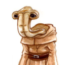
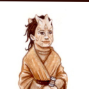
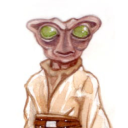
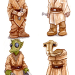
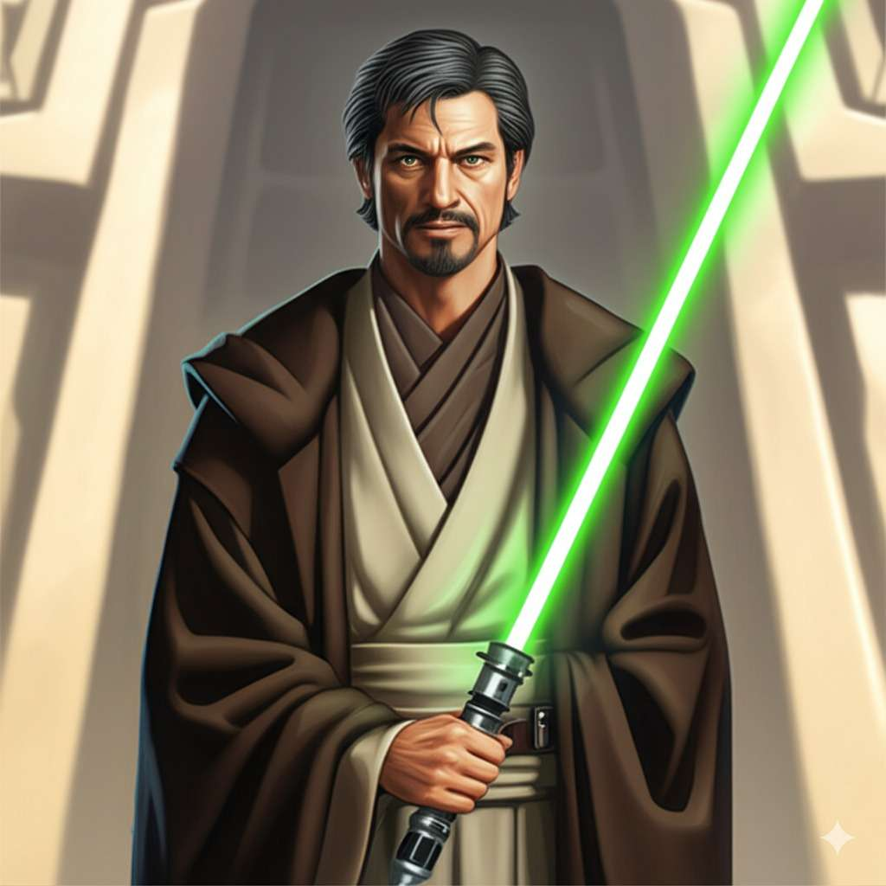
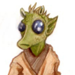

# Whispers in the Void • Ch2 Amidst The Ashes

## **Storyteller** (04/02/2025 21:40:51)  

*1357107539724210369*

**Galactic News Network: Special Broadcast**
**A New Era of Peace and Order Declared by Emperor Palpatine**
Citizens of the Galactic Empire, today marks a pivotal moment in our history. After years of turmoil and conflict, a new era of peace and order has dawned upon the galaxy. Our wise and benevolent Emperor Palpatine has, through decisive action, restored stability to our once fractured Republic.

Recent events have revealed a shocking and treacherous conspiracy within the very heart of the Jedi Order. These so-called guardians of peace, long revered by the Republic, were in fact plotting to seize power, aiming to plunge the galaxy into further chaos.

"The Jedi, and some within our own Senate, had conspired to create the shadow of Separatism using one of their own as the enemy's leader. They had hoped to grind the Republic into ruin. But the hatred in their hearts could not be hidden forever. At last, there came a day when our enemies showed their true natures…" these were the words of Emporer Palpatine, in his recent address to the senate.

Thanks to the swift and courageous actions of our clone troopers, acting under the Emperor's direct command, this insidious plot has been exposed and neutralized. These loyal soldiers, the backbone of our Republic's defense, have once again proven their unwavering dedication to the preservation of peace and security.

It is now clear that the Separatist conflict, which has plagued our galaxy for so long, was orchestrated by these rogue Jedi, who sought to exploit the chaos for their own nefarious purposes. The Emperor's decisive actions have not only prevented a Jedi coup but have also brought an end to the Separatist threat, ushering in a new era of unity and prosperity.

---

## **Storyteller** (04/02/2025 21:40:56)  

*1357107559974047774*

The Galactic Senate, recognizing the Emperor's wisdom and foresight, has granted him emergency powers, allowing him to reorganize the Republic into the glorious Galactic Empire. This transition will ensure that the stability we now enjoy will be maintained, and that the threats that once endangered our way of life will be forever eradicated.

Let it be known that the Galactic Empire will not tolerate any dissent or rebellion. Those who seek to disrupt the peace will be met with the full force of Imperial might. Under the Emperor's guidance, we will forge a stronger, more secure galaxy for all citizens.

We at the Galactic News Network stand in unwavering support of our Emperor and the Galactic Empire. We urge all citizens to embrace this new era of peace and order, and to work together to build a brighter future for all.

May the Emperor's wisdom guide us all.

---

## **Marina Cloudspinner** (04/02/2025 21:51:02)  

*1357110103118971011*

Several hours pass as they sleep, their bodies intertwined in Marina's small bed, seeking solace and recovery from the day's harrowing events. They barely move, their closeness a silent testament to the comfort they find in each other's presence.

Marina begins to stir, a gentle awareness returning to her senses. As she awakens, she becomes aware of their hands resting on her stomach, a natural, unconscious gesture of protection. A wave of warmth and tenderness washes over her as she realizes the significance of this instinctive action. The child she carries, a secret she has yet to share with Wes, lies safe within her.

A flicker of anxiety crosses her face as she recognizes the potential slip-up. Slowly, carefully, she begins to disentangle her hand, mindful not to disturb Wes's peaceful slumber or draw attention to the protective gesture.

---

## **Wes Del-Fin 69/80 CT 0 | FP 5 DP 5** (04/02/2025 23:15:51)  

*1357131447579971605*

Wes dreamed.  It was a swirling mess of devastating loss paired with joyous highs.  Yet all he would remember would be the feelings, not the reasons for them.  Perhaps it was the Force protecting him until the time was right.  Either way the young Mandalorian would wake up feeling better than he had when he went to sleep.

*****

Warmth and closeness flooded his senses.  It was perhaps the most relaxed feeling he had ever felt.  It was a profound statement proclaiming what they    meant to each other.  He didn’t fully wake.  It was only enough for him to shift and resettle alongside her.  His hand, which had been resting on her stomach, searched for a hand to hold tightly.  The events of the previous day still weighed heavily.  Sleep provided a fleeting escape.

---

## **Marina Cloudspinner** (04/03/2025 05:49:35)  

*1357230533108699199*

Marina lies still beside Wes, sensing his restless sleep. She feels him shift and reach for her hand, his grip tightening as if seeking reassurance. The lingering tension from the previous day still clings to him, even in slumber.

Unfortunately, the fragile peace of their sleep is shattered. A wave of nausea washes over Marina, a familiar yet unwelcome sensation. While morning sickness hasn't plagued her much during this pregnancy, the stress of the previous day, coupled with a lack of proper nourishment, has taken its toll. The feeling intensifies, forcing her to gently extricate herself from Wes's embrace.

She moves with caution, trying not to disturb him, but the urgency of her situation overrides her care. She barely manages to stifle a groan, her hand flying to her mouth. In her haste to reach the small refresher, she stumbles, her foot catching on the pile of Wes's discarded armor. The metallic clatter echoes through the room, a sharp contrast to the quiet intimacy of their shared sleep.

---

## **Wes Del-Fin 69/80 CT 0 | FP 5 DP 5** (04/03/2025 10:47:39)  

*1357305543173079234*

Having finally fallen into a dreamless sleep Wes settled into the comforting presence that lay beside him.  Feeling her begin to move he groaned but still moved enough allowing her to extricate herself from the small bed.  Having more room he proceeded to roll over and he now faced the majority of the small room.   

The quietness of the moment was shattered as a metallic clash resounded followed by a muffled curse from Marina.  Eyes opened quickly due to recent events.  Wes quickly swung his feet to the floor as his eyes looked for the cause of the commotion.  There was no other presence in the room.  The source of the noise was several pieces of his armor.  It was looking like they may have been kicked in haste.  He saw the light peeking through the cracked door of the refresher.  It sounded like she was sick.  Instantly he thought of the medication that was given to her earlier.  

**”Rin.”**  He said, somewhat calmly, as he stood picking up two pieces of his armor that had been kicked towards the refresher.  **”Are you alright Cyar’ika?”**  He set the pieces down on the small table that already held his blaster rifle further crowding the small surface.  Marina could feel a small amount of worry that maybe there were some internal injuries that worsened in the short time they left the Medbay.  He remembered the slight irritation she felt yesterday and decided to stand his ground where he was and not rush in.  There was no alert of immediate danger and attempted the calmer approach.  **”Do you need anything?”**  He said with obvious concern mixed with some confusion and wonder.

---

## **Marina Cloudspinner** (04/03/2025 11:49:01)  

*1357320988999553095*

Marina's stomach lurches again, eliciting another frustrated curse. The sound of running water fills the refresher before the door finally slides open, revealing her pale face.

**"I'm fine..."** she says, her voice slightly hoarse, **"...it's passed."**

She leans against the doorframe, taking deep breaths to settle her roiling stomach. The events of the past day, the lingering effects of the medication, and the lack of proper food have clearly combined to make her feel unwell.

**"Sorry I woke you,"** she murmurs, her gaze softening as she meets Wes's concerned eyes. She reaches for her utility belt, her fingers fumbling slightly before extracting a small chew.

---

## **Wes Del-Fin 69/80 CT 0 | FP 5 DP 5** (04/03/2025 15:57:21)  

*1357383483349139599*

Wes could see the pale look on her face as she leaned against the doorframe.. Despite what he could see he gave her a nod.   She knew herself and body better than anyone.   He also knew that if there was a problem she would let him in on it.  He gave her a smile and an understanding nod when she apologised for waking him.

**”It’s alright, take your time.”**  He said softly as he moved to grab the armor pieces he had set on the table.  After having put them down with the others he turned around to see her grabbing a chew from her own utility belt.  He eyed the chew as she popped it in her mouth.  **”I know your stomach is not happy with you but some real food might be better.  There could also be some intel on just what the hell is going on.”**  He looked over his armor and himself as he spoke.  He realized both needed cleaning.  

Turning back around he looked at her.  Her face was still pale but she was now standing straight.  He sighed as he thought about Ash and how he didnt make it out with them.  He wondered if the young man managed to get out.  **”I don’t know how you feel about this.  I know there’s no shower here but there's one in my quarters.  It’s barely big enough for one but the water is hot.  Then we could maybe eat.”**  He raised his eyebrows as he saw her considering his words.

---

## **Marina Cloudspinner** (04/03/2025 16:31:47)  

*1357392148000932122*

Marina watches Wes as he fusses over his armor, a small, amused smile playing on her lips. Her coloring has returned to normal as her stomach settles, and she feels a bit more like herself.

His suggestion of going to his quarters for a shower is not lost on her. The memory of their last encounter there, interrupted by Ash's unexpected arrival, flickers in her mind. A wave of sadness washes over her as she thinks of the young Fallanassi and the uncertainty of his fate.

The idea of getting cleaned up is appealing, but she isn't quite ready to face the world outside her room. **"I think I'll rest a bit longer,"** she says softly. **"Why don't you go and I'll join you in a bit?"**

---

## **Wes Del-Fin 69/80 CT 0 | FP 5 DP 5** (04/03/2025 17:56:11)  

*1357413391253242200*

Wes nodded at her reasoning.  **”Take your time.  I’ll grab some food on the way.  I’ll make sure to grab some bland items as well in case your stomach hasn’t fully settled yet.”**  Looking at a piece of leg armor he grabbed one.  Ever the Mandalorian he began to put the pieces on.   

When he was ready to go he stepped close to and hugged her.  Even though she looked better and the color had returned to her cheeks he didn't squeeze her quite as hard as he would normally have.  **”Take the time you need.  I’ll grab some food, clean up and see what I can find out.”**  Giving her a nod and a quick kiss he stepped back  grabbing the blaster rifle he set down earlier.  Opening the door he stepped halfway out but stopped and turned.  **”There’s no way to express how happy I am that you’re here Cyar’ika.”**  He paused for a second as he looked up and down the hallway of padawan quarters.  The hallway was clear and he stepped a bit closer to the door frame.  **”But I can say this with all certainty.  I love you.  No matter what, we are in this together.”**  He gave her the private smile he only used for her before donning his helmet and turning away. Despite the uncertainty the future held he knew that together they could face anything.    

Wes made a stop to grab some food before heading back to his quarters.   He didn't get much but made sure there was something that might suit an upset stomach.   Whatever the bug was he hoped it passed quickly for Rin.  

A short time later after a hot shower and going over his armor he was ready to go and find out some information on exactly what was going on.   He sent a message to Rin.  *There’s some food in my quarters and plenty in the mess hall.  Going to try and get some info about what happened.*   

With Master Rukh still in the Medbay he went searching for any of the other Masters.

---

## **Marina Cloudspinner** (04/03/2025 19:04:12)  

*1357430505716449473*

Marina watches Wes as he finishes donning his armor, a soft smile gracing her lips as he approaches to kiss and embrace her. She lingers in his warmth for a moment, then steps back to give him space to move. As he leaves, she remains in the spot where he left her, her gaze following him until he disappears through the doorway. A wave of conflicting emotions washes over her. While she cherishes the quiet time to gather her thoughts and energy, a pang of loneliness tugs at her, a reluctance to be separated from him so soon after their reunion.

---

## **Storyteller** (04/03/2025 19:04:12)  

*1357430507897491606*

Wes passes through the mess hall, his senses alert. The atmosphere is thick with tension and confusion. Holo-screens flicker with the relentless broadcast of the Galactic News Network. The reports are heavily skewed, a barrage of propaganda painting a distorted picture of recent events. Emperor Palpatine's pronouncements echo through the hall, proclaiming the Jedi's treachery and justifying the clone troopers' actions. Tales of alleged Jedi atrocities fill the air, each one a fabricated lie designed to turn public opinion against the fallen Order.

Jedi and non-Jedi alike watch the screens with disbelief and horror. The blatant manipulation of information is sickening, a stark contrast to the values they hold dear. A heavy silence hangs in the air, punctuated only by the newscaster's voice and the occasional choked sob.

The Altisian Masters are conspicuously absent from the mess hall. The weight of their decision presses down on everyone, fueling a flurry of speculation. Rumors spread like wildfire, each one more uncertain than the last: Will the Altisians wait for more survivors? Will they abandon the *Chu'unthor* and go into hiding? Or will they actively seek out other Jedi scattered across the galaxy? No one knows which path the Council will choose.

---

## **Wes Del-Fin 69/80 CT 0 | FP 5 DP 5** (04/03/2025 20:38:32)  

*1357454245821026608*

Wes could feel his ire rise as he watched the feed from the GNN on the holo screen screens in the mess hall.  What was being said and portrayed was outright lies.    The news cast was using footage and skewing it to make their propaganda work.  

The next feed that came up caused an uptick in his anger and it radiated off him like a sun.  **Jedi attack on New Holstice.  Hundreds murdered.**  He stood motionless as images of the burning memorial played.   The voice track continued on about how the clone defenders were cut down by the Jedi as the clones simply tried to peacefully arrest them.  Images of deceased clones were shown on a loop with various lightsaber wounds.   The last one in the series of pictures was a trooper dead from a close range blaster strike.   Wes clenched his fist as he recognized the wound and the rank insignia on the armor.  It was the squad leader, the first trooper he shot in the battle.

**”Nothing but lies.”** He said calmly but the anger in his voice was clear.   **”It's all lies!”** He said louder as he backed up a step. His Jedi training was showing cracks as his emotions leaked ebbed out.

---

## **Storyteller** (04/03/2025 20:56:27)  

*1357458753754239229*

The other occupants of the mess hall react in various ways to Wes's outburst. Some, fellow Jedi, nod in grim agreement, their faces mirroring his anger and disbelief. Others, non-Force sensitives, shrink away, intimidated by the raw emotion emanating from the Mandalorian. A few attempt to offer words of comfort, but their voices are drowned out by the continued drone of the news report.

The images on the screen continue to cycle, each one a fresh wound to the already fragile peace of the room. The idyllic scenes of the Jedi monument on New Holstice, once a symbol of remembrance and respect, are juxtaposed with the horrifying aftermath of the attack.

Some Jedi, their hands trembling, reach out to touch the walls, as if seeking a connection with the Force to ground them in the face of such overwhelming darkness. Others clench their fists, their faces hardening with a resolve that hints at a desire for vengeance. The air crackles with a mix of grief, rage, and confusion, a palpable manifestation of the trauma they have all endured.

---

## **Marina Cloudspinner** (04/03/2025 20:58:09)  

*1357459184534294570*

Marina enters the mess hall, drawn by Wes's presence and the need for sustenance. The atmosphere hits her like a physical blow – a palpable wave of anger, fear, and confusion. Her gaze sweeps across the room, taking in the various reactions to the holo-feeds.

She spots Wes, his posture rigid, his anger radiating outwards as the GNN broadcasts its distorted account of the events. Without hesitation, she steps up beside him, her movements fluid and purposeful. Casually, she slips her hand into his, offering a reassuring squeeze. It's a silent promise: they'll face this together. **"Let's go,"** she suggests quietly, her voice barely audible above the din of the news reports. **"We don't need to see this."**

---

## **Storyteller** (04/03/2025 20:58:10)  

*1357459187235553290*

Before they can turn away, however, the image on the screens shifts. The GNN broadcast is interrupted, replaced by the likeness of Djinn Altis. The mess hall falls into a hushed silence, all eyes turning to the screens as the Altisian Master begins to speak.

---

## **Master Djinn Altis** (04/03/2025 21:01:04)  

*1357459915576316115*

His expression is grave, but his voice remains calm and steady.

"***My brothers and sisters, fellow Jedi, and all who seek refuge with us. We have endured a tragedy, a betrayal that has shaken the foundations of our Order and the Republic itself. The darkness that has swept across the galaxy has touched us even here, aboard the Chu'unthor and within our enclave.***"

"***Many brave Jedi have fallen, and the Jedi Order as we knew it is no more. Our hearts are heavy with grief for those we have lost, and our thoughts are with all who suffer in this time of chaos.***"

"***In response to these events, the Masters Council has decided on a course of action. We will abandon our enclave on Bespin. While this place has been a sanctuary for us, we can no longer risk remaining stationary. The *Chu'unthor*, our mobile academy and sanctuary, will become our sole base of operations for the immediate future***".

"***All Jedi, Padawans, and any others seeking shelter are welcome to join us aboard the *Chu'unthor*, as well as any other ships in the Bespin system who wish to accompany us. However, I understand that some may feel called to other paths. The decision to stay or leave will be left to each individual. We honor your choices, and we offer our blessings to those who choose to depart.***"

"***The *Chu'unthor* will depart for a system yet to be disclosed. This decision is born of necessity, to protect ourselves from the dangers that now hunt us. Once we reach our destination, we will regroup, tend to our wounded, and seek guidance from the Force to determine our next steps.***"

"***Let us remember the core tenets of the Altisian way: compassion, community, and unwavering faith in the light. Let us offer solace to one another, honor the memory of those who have fallen, and face the future with courage and determination.***"

He raises a hand in a gesture of blessing. "***May the Force be with you, always.***" The holo recording ends.

---

## **Wes Del-Fin 69/80 CT 0 | FP 5 DP 5** (04/03/2025 22:28:45)  

*1357481984900862132*

Wes felt a hand slip into his.   He instantly recognized it as Marina’s.  The simple act of her touch took the anger that filled his sails and dissipated it into nothingness.   His chest rose as it filled with a breath.   As he exhaled he felt a calm return to smother the anger that had quickly taken hold.  He returned the gentle squeeze she gave his hand, grateful that she was there.  

He nodded at her suggestion and started to back up.   The change of feed on the holo screens stopped him.  When Master Altis’s visage appeared Wes held firm.   He hoped that Master Altis would speak and now was the chance to hear what the council had come up with.  He gave Marina’s hand a squeeze as the Master Jedi spoke outlining the coming events.  It wasn’t quite what he had hoped for as he had hoped for a more definitive reaction.   He also knew that intel was lacking and that simply led to the loss of life in war and that’s what they were in.   

He turned to the woman at his side and squeezed her hand.  **”I’m sorry.  I let what I saw on the GNN feed get to me.  What they were saying.  The lies, the disinformation.  The video of the trooper, the first one that I killed.”**  He shook his head at the utter chaos that has been unleashed upon the galaxy.   **”How many are going to suffer because of what he’s started?”**  Together they stood in the mess hall.  Hand in hand and they would face the evils of this Galactic Empire and its Emperor together.

---

## **Marina Cloudspinner** (04/04/2025 07:24:52)  

*1357616899965325342*

Marina nods, her hand tightening around Wes's in silent understanding. She surveys the mess hall, observing the reactions of those present to Master Altis's address. Some Jedi stand in quiet contemplation, their faces etched with grief and determination. Others whisper amongst themselves, their expressions a mix of fear and uncertainty. A few non-Force sensitives look on with confusion, struggling to grasp the full implications of what has transpired.

The news feed on the holo-screens remains off, a small mercy in the face of the earlier propaganda barrage. The silence is heavy, broken only by the occasional murmur of voices.

Remembering her initial purpose in coming to the mess hall, Marina gently disengages her hand from Wes's. **"I should grab something to eat,"** she says softly, her gaze flickering towards the food dispensers. **"I'll take it back to the quarters."** She gives Wes a reassuring smile, indicating she won't be long.

---

## **Wes Del-Fin 69/80 CT 0 | FP 5 DP 5** (04/04/2025 13:01:12)  

*1357701543654068244*

With the screens now off all who were in the mess hall were now quiet talking amongst themselves.  With Marina excusing herself for some food he nodded happy she was feeling better.  **”I’ll wait for you Rin.  There’s a former padawan of Master Rukh’s I want to talk to.  .”**  He said as he pointed in the direction of a female Twi’lek, a Jedi knight.  Wes had recognized her after the GNN feeds were turned off.   Wes was hoping she might have some info on Master Rukh and how he was doing. 

Rin gave him a nod and turned to go get some food.   He watched her walk away for a second.  He was grateful that she had appeared when she did.  With a smile he turned and walked towards the purple skinned Jedi.   She was talking to another that Wes wasn’t familiar with so he waited until recognized.  When she turned towards him he gave her a nod. **”I’m Initiate Wes Del-Fin.  Have you heard anything about Master Rukh?  I ask because I remember seeing you during one of his lessons.  You were one of his Padawans weren’t you?”**

---

## **Storyteller** (04/04/2025 14:43:20)  

*1357727244411338782*

The Twi'lek Jedi Knight, her lekku swaying gently as she turns to acknowledge Wes, gives him a respectful nod. Her name is Lila Fane, and her expression is weary, a reflection of the collective grief and confusion that hangs heavy in the air.

**"Initiate Del-Fin,"** she says, her voice soft but clear. **"Yes, I was Padawan to Master Ruhk."** A hint of sadness flickers in her eyes.

**"I... I only know what the healers have said,"** she continues, her gaze drifting away for a moment. **"He's stabilized, thankfully. They managed to treat his immediate injuries."** She pauses, her voice dropping slightly. **"But he sustained extensive wounds, particularly to his lower body."**

---

## **Wes Del-Fin 69/80 CT 0 | FP 5 DP 5** (04/04/2025 16:44:54)  

*1357757836267880562*

Wes nodded, thankful to hear that he was at least stable.  He had known that his injuries were severe if not life threatening.  **”I was part of the crew on New Holstice.  None of us would have made it back if it hadn’t been for his actions. I hadn’t heard any update on his status.  When I was last down in the Medbay it was too busy to inquire.”**   He looked at the now dark holoscreen.  **”I have a sinking feeling that things will become much worse before they get better.  They way they are broadcasting the misinformation it won't take long before the Galaxy starts to believe it.”**

---

## **Lila Fane** (04/04/2025 18:45:43)  

*1357788243768377495*

**"The Force is still with us, Initiate Del-Fin,"** she says, her voice firm. **"Even in this darkness, there is still light. We must trust in the Force, and we must trust in each other."** She pauses, her gaze sweeping across the room, taking in the faces of her fellow Jedi. **"We will endure this. We will find a way."**

---

## **Marina Cloudspinner** (04/04/2025 18:45:44)  

*1357788245601161357*

Marina approaches Wes and Lila, a tray of food tucked under her arm. She offers Lila a small, respectful bow, her demeanor polite but reserved. She remains silent, allowing Wes and Lila to continue their conversation. Lila acknowledges Marina's presence with a brief nod before turning her attention back to Wes.

---

## **Lila Fane** (04/04/2025 18:45:44)  

*1357788246595338270*

Lila Fane turns her attention back to Wes, her expression thoughtful. **"Initiate Del-Fin,"** she begins, her voice imbued with a quiet strength, **"what you experienced on New Holstice... the betrayal, the loss... it is a heavy burden to bear."**

She pauses, her gaze meeting his with a steady intensity. **"But remember, even in the darkest night, there is always a flicker of light. The Force is not diminished by these events. It flows through us, connects us, and guides us."**

Her hand gently rests on his arm. **"Do not let anger consume you, Initiate. Do not let fear cloud your judgment. Instead, let compassion guide your actions, and let hope be your anchor."** She offers him a small, reassuring smile. **"Master Ruhk would want you to remember that. We all must."**

---

## **Wes Del-Fin 69/80 CT 0 | FP 5 DP 5** (04/04/2025 19:54:57)  

*1357805664331894946*

Wes listened as Jedi Fane spoke.   Several other Jedi in ear shot paused to also listen.   The small nods from all of them showed that they also believed what she said.  While Wes believed and trusted in the Force this was all still new to him and it was a hard pill to swallow.   

He nodded at her word as he felt Marina come to a stop.  Her presence, a welcome and reassuring hope for the future.  

**”Thank you.  I can see much of Master Rukh's lessons in your words.”**  He looked over at Marina, his smile hidden by his helmet.  **”I have much to hope for and to look forward to.”**   He looked back at Knight Fane.   **”We all do.”

---

## **Lila Fane** (04/04/2025 20:15:18)  

*1357810786352893984*

The Twi'lek Jedi Knight gives Wes a reassuring smile, her gaze lingering on him for a moment before shifting to acknowledge Marina with a nod. She then turns and moves gracefully through the mess hall, offering words of comfort and guidance to others in need.

---

## **Marina Cloudspinner** (04/04/2025 20:15:18)  

*1357810788475339015*

Marina looks up at Wes, her gaze searching his for a moment, a silent question passing between them before her eyes sweep the mess hall once more, taking in the lingering tension and uncertainty.

She nods to Wes, a subtle inclination of her head, and falls into step beside him as they leave the mess hall. The walk to Wes's quarters is quiet, a shared understanding passing between them. Wes's quarters, conveniently located nearby, become their immediate destination.

As they walk, Marina breaks the silence, her voice soft. **"I don't know how long I'll be able to stay,"** she says, a hint of regret in her tone. **"There was a summons for me earlier, to assist the mechanics with repairing the *Chu'unthor*."**

---

## **Wes Del-Fin 69/80 CT 0 | FP 5 DP 5** (04/04/2025 20:40:38)  

*1357817163150397643*

Walking alongside Marina subtle looks and feelings passed between them.   If anyone was to look closely it would just seem like they were walking along.  Yet there was always a quiet understanding that they both felt.  It was a feeling he would never tire of.  

Her voice soft told him what was transpiring soon.   Like on Fakir they both knew they would be pulled in different directions.   At least for now they were together.  They both knew they would be needed.  Now more than ever. She could sense a feeling of understanding from him.  **”Makes sense.  You’re probably one of the best mechanics aboard.  It would be foolish to not put your expertise to use.”**  They took several more steps and turned the corner.  **”I’m not sure what they will have me doing but until they decide we can at least eat.”**  In the quiet hallway he let his free hand gently brush against hers.  The familiar sensation of her touch was welcomed and served as an anchor grounding him to the here and now.

---

## **Marina Cloudspinner** (04/05/2025 02:52:37)  

*1357910775435493527*

Marina feels a small smile touch her lips at Wes’s compliment. While she appreciates his confidence in her abilities, she knows the *Chu'unthor* hosts engineers with far more experience than she possesses. Still, his faith in her is a warmth she welcomes, especially now. “**One of the best might be stretching it,**” she replies softly, a hint of amusement in her voice, “**but I’ll certainly do what I can. The ship needs everyone pitching in.**”

His hand brushes against hers in the quiet corridor, a simple gesture that sends a familiar ripple of comfort through her. It’s a grounding touch, a reminder of their connection in the midst of the surrounding turmoil and the uncertainty of what comes next. She lets her fingers linger against his for a brief moment, drawing strength from the contact.

They reach the door to the small bunk room Wes shares with Ash. The absence of the younger Initiate hangs unspoken in the air. Marina glances at the empty bunk as they enter, a pang of worry for the boy briefly surfacing before she pushes it down, focusing on the present, on Wes, on the few moments they have before duty calls them apart once more.

---

## **Wes Del-Fin 69/80 CT 0 | FP 5 DP 5** (04/05/2025 12:53:01)  

*1358061872045097183*

After passing the threshold to his shared quarters Wes closed the door and secured it before removing his helmet.   When he turned to set his helmet and rifle down he saw where she was looking.    He nodded when he saw the twinge of worry he saw in her eyes.  He was worried for the young man as well.  He still held out hope that Ash had made it off New Holstice.  He was with others.  So there was a chance for his friend.  

**”Let's eat.”**  He said as he moved to get the food he had picked up earlier.   A few moments later after removing the container from the small rehearing unit he sat at the table with her.  Seeing her eating he smiled as he pointed with the utensil he just picked up.  **”Nausea from the medication has subsided hasn’t it?”** Plunging the fork into the noodles he twirled it to capture a bite.

---

## **Marina Cloudspinner** (04/05/2025 14:44:22)  

*1358089892382642438*

Marina follows Wes into the small room, the door clicking shut behind them, sealing them momentarily from the ship's anxieties. The space feels quieter, emptier, without Ash's presence. Her gaze naturally drifts to the neatly made bunk, a silent testament to the young Fallanassi’s absence. She sees Wes notice her look, his nod a shared acknowledgment of their worry for the boy. Hope flickers, fragile but persistent; Ash wasn't alone when they were separated.

Wes’s suggestion to eat pulls her back to the present. As he moves to retrieve the food he brought, Marina settles at the small table, pulling out the container she’d picked up from the mess hall – some sort of vegetable stew, simple and nourishing. The familiar routine of preparing to eat feels strangely grounding amidst the chaos.

She’s already taken a tentative bite when Wes sits opposite her, his question about her nausea catching her slightly off guard. Marina pauses, spoon halfway to her mouth. Right, the medication. She had felt unwell earlier, he was attributing it to the after-effects of the explosion and the pain relievers. The *real* reason stirs within her, a secret held close. She forces a small, hopefully convincing, smile. "**Yes,**" she confirms, lowering her spoon slightly. "**Much better now, thank you.**" She takes another bite of her stew, the warm food offering a small comfort. Despite the lingering ache in her arm and the worry gnawing at the edges of her mind, sharing this simple meal with Wes feels like a brief, necessary anchor in a sea of uncertainty.

---

## **Marina Cloudspinner** (04/05/2025 14:45:17)  

*1358090124813930716*

Marina continues to eat, the rhythm of scooping stew and bringing it to her lips mechanical. The warmth of the food contrasts with the nervous chill coiling in her stomach. Each quiet moment that passes feels heavier, laden with the unspoken secret she carries. She watches Wes across the small table, his familiar presence usually a source of calm, now highlighting the magnitude of what she needs to say. His focus is on his noodles, seemingly relaxed, but she knows the weight of the past day rests heavily on him too. The worry for Ash, the attack on the *Chu'unthor*, the uncertainty of their future – it all swirls around them.

She swallows a mouthful of stew, the taste barely registering. How does she even begin? The Altisians are more accepting of attachments, yes, but this… this is different. A child, conceived amidst war and uncertainty, raises questions and challenges neither of them could have anticipated. She thinks back to the healers, their confirmation echoing in her mind, a truth she's held close for weeks now, wrestling with its implications alone. But she can't keep it from Wes any longer. He deserves to know. Their connection, the deep bond they share, demands this honesty, no matter how difficult.

Setting her utensil down beside her bowl, Marina takes a deep, steadying breath, her hand unconsciously drifting towards her lower abdomen before she pulls it back, resting it in her lap. Her heart pounds against her ribs. "**Wes**," she begins, her voice barely above a whisper, softer than intended. She clears her throat slightly. "**Wes, the... the healers, when I was in the medbay...**" She pauses, meeting his gaze, her blue eyes searching his, filled with a mixture of apprehension and hope. "**It wasn't just the burns or the sprain. And it wasn't the medication making me feel sick earlier.**" Another breath. "**Wes... I'm pregnant.**”

---

## **Wes Del-Fin 69/80 CT 0 | FP 5 DP 5** (04/05/2025 17:52:46)  

*1358137303863791729*

Sitting across from his love felt right.  Her affirmation that she was feeling better raised a weight off his mind.  Smiling he let his relief be felt that she was feeling better.   It was one less thing to contemplate along with Master Rukh’s injuries and Ash missing.   There was one feeling within himself that he couldn’t ignore.   He was happy she was here.   The last couple months had felt like part of himself was missing.  That missing piece now sat across from him.   He knew that there would be times when they were apart.  It was inevitable due to the lives they led.   It was different now.   Where as before when Silas and the Order saw fit to seperate them they were now together with Altisians who’s thoughts on family and attachment were very different.  

Wes smiled inwardly as he thought about that.  The idea of not being with Marina was foreign to him.   Since they met on Fakir he had a feeling that their fates were intertwined.  He now knew it wasn’t luck that they had met.  It was the will of the Force that had drawn them together.  

Looking at Marina he could see and feel that she had a lot on her mind.  She had just arrived on the Chu’unthor just days before the betrayal of the Chancellor.   Who has now renamed himself Emperor.   It was true that a shadow had descended upon the Galaxy but there were still bright points to be found.   Those bright points needed to be held on to and cherished for they would carry them out of the darkness and to the brighter future that he knew lay ahead of them.

---

## **Wes Del-Fin 69/80 CT 0 | FP 5 DP 5** (04/05/2025 17:54:03)  

*1358137626292518942*

When she said his name he swallowed looking up from his food.  Her voice was soft.  If it hadn’t been so quiet he might not have heard her.  He looked into her blue eyes.  They matched the stone that now hung from the soft leather rope around her neck.   His head tilted slightly as he heard her search for words explaining her sickness earlier.   He felt her apprehension mixed with hope as she started to talk again.  ***’Wes… I’m pregnant.”** 

Wes sat still as the words sank in.  *Pregnant?* He repeated silently as confusion followed by surprise.  *Pregnant.*   He said to himself once more as things began to fall into place.  Her recent sickness after the Medbay which he attributed to the medications used.    The use of the word ‘condition’ by the healer before they left.   And what maybe was the most telling that he didn’t pick up on earlier.  After their love making Marina had let her guard down and he felt a faint tremor in the Force.  He had felt a subtle shift in her Force presence.  The energy within her signature was slightly different.  As if there was a second signature that was intricately mingled with hers.  He didn’t understand then as he had never sensed something like that before..

It was then, like a bantha running full out, it hit him.  ***Pregnant!***  He shouted to himself as he smiled. A river of emotions poured out of him.  Surprise, uncertainty, responsibility and several others he couldn’t name.   The emotions that stood out the most were the love and happiness he had, not just for her, but their child as well.

---

## **Wes Del-Fin 69/80 CT 0 | FP 5 DP 5** (04/05/2025 17:54:41)  

*1358137787861307400*

As calmly as he could he set the fork down as he slowly stood.  Knowing she could sense the bristling emotions coming from him he reached for her hand and gently pulled her from the chair.   He smiled as the look in his eyes was electric.   Taking a steady breath he stepped closer.  **”I think you mean we’re pregnant Cyar’ika.”**  He said with a happiness in his voice as he let go of her hands letting his strong arms encircle her and his child she was carrying.  With an ease of effort born out of excitement and happiness.  He picked her up off her feet, hugging her tightly, spinning her around before gently setting her back down.

---

## **Marina Cloudspinner** (04/05/2025 18:24:13)  

*1358145218787938304*

Marina watches Wes, her breath caught in her throat, heart hammering against her ribs. She feels the subtle shifts in his Force presence as her words sink in – the initial stillness, the ripple of confusion giving way to surprise. 

A wave of apprehension washes over her as he remains silent for a long moment, his dark eyes fixed on hers. What if this is too much? Too soon? The weight of responsibility, the danger of their world – it all presses down. But then, the confusion melts away, replaced by something else entirely. She feels it before she sees it – a surge of emotion rolling off him, powerful and undeniable. Surprise, yes, but underneath it, a current of something warm, something akin to joy.

A slow smile spreads across his face, mirroring the growing relief blooming in her chest. He sets his fork down deliberately, the clink loud in the sudden silence. When he stands and reaches for her hand, his touch is gentle but firm. She allows him to pull her up from the chair, her functioning hand finding his automatically. The look in his eyes is incandescent, chasing away the last shadows of her fear.

Before she can fully react, his strong arms encircle her, mindful of her injured arm, pulling her close. The sheer, unadulterated joy radiating from him is overwhelming. Then, with an ease that belies his strength, he lifts her clear off the ground, spinning her in a giddy circle. A startled laugh escapes her lips, mingling with tears of relief that prickle at her eyes. He sets her down gently, his hands lingering protectively on her waist, his forehead resting against hers. In this small room, amidst the chaos of their galaxy, they are anchored together, a shared secret now a shared joy, the faint, mingling Force signature of their child a promise of a future they will face together.

---

## **Marina Cloudspinner** (04/05/2025 18:24:50)  

*1358145376426922236*

Marina clings to Wes, her good arm wrapped around his neck, burying her face momentarily against his shoulder. The solid feel of him, the unrestrained happiness pouring through their bond, is an intoxicating relief. For a moment, the fear that had gripped her so tightly loosens its hold, replaced by the simple, profound joy of being held, of being accepted, of not facing this alone. His words, "we're pregnant," echo in her mind, a correction that settles deep in her soul, knitting them even closer. She laughs again, a watery sound filled with relief and a touch of disbelief that this moment, amidst so much loss and uncertainty, could feel so right.

But as the initial rush subsides and she stands firmly on the floor again, still held loosely in his embrace, the wider reality begins to creep back in. The relief is real, immense, but it doesn't erase the fear entirely. It merely shares the burden. Looking up at Wes's beaming face, a new layer of worry settles over her. How can they bring a child into this? A galaxy where the Jedi are hunted, where the Force itself marks one as a target for the ruthless efficiency of the new Empire? Their child, undoubtedly Force-sensitive, would be born into hiding, forever looking over their shoulder. The *Chu'unthor*, their mobile sanctuary, feels less secure than ever after the clone troopers' sabotage and the recent attack. The future, which had seemed uncertain before, now stretches before her fraught with terrifying new dangers, not just for them, but for the tiny life growing within her. This private joy feels fragile, a flickering candle flame vulnerable to the storm raging outside the small cabin door. "**What are we going to do...?**" she asks, the words epitomize every worry burdening her thoughts.

---

## **Wes Del-Fin 69/80 CT 0 | FP 5 DP 5** (04/05/2025 19:30:31)  

*1358161906623578173*

Wes felt the wide range of emotions run through her.   All born out of anxiety and the unknown.   And health dose of fear also mingled.   He did his best to smooth the fears and worries she was experiencing.  The state of the galaxy, the concern he felt most strongly from her also concerned him.  Despite the dangers that were now more evident than ever he knew that they would protect their child with their lives if need be.  They were safe here and he hoped that the Chu’unthor would continue to be a safe haven for them all.  If it didn’t they would figure something out.   They both had skills that were valuable.   It wouldn’t be safe but they would be together.  He quickly pushed that thought out of his mind as he was getting very ahead of the situation.   Things needed to play out.   

Her question was a single one but there were hundreds of possible answers.  He felt the enormity of the future.  He knew of two for certain.   **”We take this a day at a time and we do it together as a family.  Everything else that’s heading our way we will deal with it as it arises.”**  He pulled her close once more, holding her gently yet firm enough to combat the uncertainty of the future.  He pulled back slightly to look into her eyes.  They still held the same sparkle he fell in love with months ago. **”I know this isn’t what we planned.  Certainly not into a galaxy that has just transformed so.  I do know this.  There is no one I’d rather be with.  You’re going to be the mother of our child and I will fight to the very end to protect both of you just as I know you would do the same.  Yes, the future is even more uncertain than just days ago but it doesn’t change how I feel about us,”**  He paused as his hand slowly moved from her hip and settled above her stomach.  **”Or about how I feel about our child.”**  He finished.

---

## **Wes Del-Fin 69/80 CT 0 | FP 5 DP 5** (04/05/2025 19:30:55)  

*1358162004950388797*

He rested his hand there for a moment as he reached out with the Force to the life still hidden and unknown to anyone else.  He could now easily sense the subtle difference within her now that he knew.    A sudden realization came to mind and he looked at her.   There wasn’t any fear in his emotions, just an unknown sensation on what to do.  Master Rukh was still in the medical bay unable to do anything.   There was Master Ta though and the council.

**”Who do we tell?  Master Ta?  The Council?  And when?”** He said softly as the weight of his words took hold.

---

## **Marina Cloudspinner** (04/05/2025 20:16:03)  

*1358173365050937551*

Marina listens, her breath catching slightly as Wes speaks. His words, firm and gentle, wrap around her fears, soothing the sharp edges of panic that had threatened to overwhelm her moments ago. The feel of his hand resting protectively over her stomach is both terrifying and incredibly grounding. A family. It’s a concept so foreign to her upbringing, a path she’d believed forever closed off after the heart-wrenching choice she made nearly a year ago. The Jedi Order, with its rules and structure, had been her family, her world. Attachments were forbidden, a lesson ingrained since childhood, a rule she'd already broken once with devastating personal cost.

Yet, here, with Wes, with the undeniable proof of a new life growing within her, the old rules feel distant, almost irrelevant compared to the fierce love and protectiveness blooming in her chest. His commitment, his unwavering declaration that they will face this together, chips away at the wall she’d built around her heart. He sees a future for them, *as a family*, even amidst the chaos engulfing the galaxy. Hope, fragile but persistent, flickers within her.

His practical question snaps her back to the immediate concerns. Who to tell? The implications swirl in her mind. “**Master Ta…**” Marina murmurs, her voice still soft, tinged with a complex mix of apprehension and resignation. “**The Healers will have reported it to him. He… he likely already knows.**” The thought sends a fresh wave of anxiety through her. She'd come here under the pretense of completing her training, but it would soon become apparent she'd really come here to find Wes.

---

## **Marina Cloudspinner** (04/05/2025 20:16:15)  

*1358173415806079086*

She considers the Council. The Altisians are different, yes. They embrace connections the old Order condemned. But this… this is still uncharted territory, especially now, with the Empire rising and Jedi hunted. Bringing a child into this world, under these circumstances… it feels like painting a target on all their backs.

“**The Council…**” she repeats, her gaze drifting towards the closed door, as if the Masters might be listening. “**I… I don’t know, Wes. It feels too soon. Too much. Maybe… maybe just Master Ta for now? Until we know more? Until things are… steadier?**” The uncertainty is clear in her voice, the ingrained caution of her Jedi training battling with the fierce desire to protect this fragile new beginning with the man she loves. She looks back at him, her blue eyes searching his, needing his strength, his certainty, to anchor her once more.

---

## **Wes Del-Fin 69/80 CT 0 | FP 5 DP 5** (04/05/2025 21:25:26)  

*1358190824575205387*

Wes could feel her emotions rising and falling.   Each new thought or possibly bringing a new fear and a question with an unknown answer.  He was just as anxious as she was.   Just and unsure.  She needed to know.   **”Come here.”**  He said gently as he pulled her but her good hand towards the bed.   He let her sit first and then sat beside her, never letting go of her hand.  

.
**”Remember Fakir?  In the warehouse you helped me to find my calm.  Take a breath.  Let the anxiety out”**   He reached out to her.   His own presence, which was figuratively bouncing off the walls of his small quarters, attempted to reassure her all was okay.   **”I know you're unsure and anxious, maybe even a little fearful.”**  He stopped for a second as his next revelation wasn’t easy for him.   **”So am I.  I also know that I have you to hold on too to keep me grounded.   Let me do the same for you.”**  He let his words sink in before continuing.   **”Do you know what the first thing I learned about you was?”**  He held her gaze.   Locking onto her blue eyes with his own dark ones.   He saw her wondering what his answer would be.  **”I saw a woman who is strong and the more I learned about you the stronger you became.  If you weren't, the pressures you had to endure would have taken a much larger toll.  Only now there’s a difference.”**  He gave her hand a squeeze.   **”We have each other.”**   

He took a deep breath letting his presence reinforce hers.  It was so easy now.   To open himself and share with her.     He smiled when he felt her do the same for him.

---

## **Wes Del-Fin 69/80 CT 0 | FP 5 DP 5** (04/05/2025 21:25:48)  

*1358190917974102209*

**”I think you’re right about the council.  Too soon for them but I’m sure they will find out in time but I think Master Ta is a good idea.  I agree that the healers would report back to him and if anyone knows I think he’s a safe bet.  That is if he didn’t already sense it when you first came aboard and sparred with him.”**  He saw her eyes widen.  He quickly reassured her it was ok with a squeeze of her hand.  **”When I got back from New Holstice I came across Master Ta and inquired as to where you might be.  He could sense my anxiety and the urgency to find you.  Maybe he put two and two together?”**  He said questioningly.

---

## **Marina Cloudspinner** (04/06/2025 00:35:24)  

*1358238631747256562*

Marina leans into Wes’s gentle pull, sinking onto the edge of the bunk beside him. His hand holding hers is a solid, warm presence against the swirling anxieties within her. His reminder of Fakir, of that tense moment in the dusty warehouse where she’d guided him through the Force, brings a faint echo of calm. She takes a deep breath, consciously trying to follow his lead, releasing the tension knotting her shoulders.

His description of her strength makes her look away for a moment, a flicker of self-doubt crossing her features. Strong? After everything? After the choices she’s made, the secrets she’s kept? But then he squeezes her hand, reminding her, “**We have each other.**” That simple truth anchors her more effectively than any Jedi meditation technique could right now. She meets his gaze again, a fragile smile touching her lips. “**Yes. We do.**”

She takes another breath, feeling his calming presence through the Force, a familiar warmth spreading through her, intertwining with her own turbulent emotions. It’s easier now, this sharing, this vulnerability.

When he mentions Master Ta potentially already knowing, her eyes widen slightly, a fresh wave of nervousness washing over her. The sparring session, Wes’s urgency to find her… it all paints a plausible picture. A sigh escapes her. “**You might be right,**” she concedes reluctantly. “**Master Ta… he sees more than most. And our… connection… it isn’t exactly subtle, is it?**” A small, wry smile plays on her lips. The idea is unnerving, but if anyone had to know, Master Ta felt safer than the full Council. “**Okay. Master Ta. We’ll… figure out how to approach him. Together.**”

---

## **Wes Del-Fin 69/80 CT 0 | FP 5 DP 5** (04/06/2025 03:25:40)  

*1358281481146994810*

Wes nodded.  **”Together.  We trust in the Force.”**  He knew this wasn’t easy for her.   Her entire life had been following the edicts of the Order.    The Altisian branch of the Order had some very different views.   He knew that the transitioning of beliefs from one side to the other wasn’t going to happen over night.  

He leaned towards her letting his shoulder gently touch hers.   It was a simple gesture of affection.  **”We will have to figure it out sooner than later.   It won’t be long until it’s obvious we’re having a baby.”**  He smiled as he said it.  The thought of having a baby, a symbol of the love they have for each other, brought forth happiness and nervousness from the Mandalorian.   A baby in the best of times was stressful.  The current state of the galaxy was anything but the best of times. 

He looked from her belly where their child was growing up to her blue eyes.   He smiled at her.  **”I love you Cyar’ika.   And I love our baby that you carry.  Those two things will never change.”**

---

## **Marina Cloudspinner** (04/06/2025 07:14:39)  

*1358339105888407693*

Marina nods softly at his words, “**Together. Trust in the Force.**” The mantra feels both familiar and newly significant. She leans into the gentle pressure of his shoulder against hers, a small comfort in the vastness of their situation.

His reminder that time is limited, that their secret won't stay hidden forever, brings a fresh wave of reality. A small sigh escapes her. “**I know.**” The thought is daunting, adding another layer of urgency to their already precarious existence.

When he looks into her eyes, his own dark gaze filled with such open affection, and speaks the Mando’a endearment, her heart clenches. His declaration of love, for her and for their unborn child, is a powerful anchor. She can’t quite bring herself to echo the words aloud, but she squeezes his hand tightly with her good one, pouring her own unspoken feelings into the gesture.

A faint, wry smile touches her lips as she looks back at him. “**You might want to reserve judgment on loving me through *all* of it,**” she teases gently, her voice soft. “**If memory serves, I wasn’t exactly the galaxy’s most pleasant person to be around last time.**” The attempt at humor is fragile, but it's there, a sign that beneath the worry, she's still his Marina, finding moments of light even in the encroaching darkness.

---

## **Wes Del-Fin 69/80 CT 0 | FP 5 DP 5** (04/06/2025 13:43:43)  

*1358437016144056451*

The unspoken feelings that she sends him filled him with joy.  Together and with the Force as their ally he knew that could make it through anything the Galaxy had in store for them.   Then the woman he was in love with showed him she was still herself.  She joked with him about her temperament during her last pregnancy.  The fierce Mandalorian’s eyes widened in feigned shock and horror.    **”What!”**  He said excitedly as he stood and faced her.  Amusement brightening his face.  **”You couldn’t have told me this before?”**   He reached down and gently took her uninjured hand and pulled her up to him.   Bringing her close, careful of her injured arm he held her and whispered into her ear.  **”Because,”** He paused only for an instant.  **”It would not have changed a thing.”**  The electrified sensation of their cheeks touching shot through him.   It was still a sensation that relished.   A physical manifestation of their bond and love.  When his lips brushed across hers he held her just a bit tighter.   Despite what was ending across the galaxy a new beginning was starting, right here, for the two of them. 

Breaking the kiss he pulled back slightly to catch his breath.  He was truly lucky and his emotions said as much.   He looked at the table and their forgotten food.  **”Let's finish our meal and then we can get started on how we’re going to talk to Master Ta.”**

---

## **Marina Cloudspinner** (04/06/2025 14:15:10)  

*1358444930757820506*

Marina laughs softly as Wes feigns dramatic shock, the sound light and genuine despite the underlying tension. His playful reaction is a welcome reprieve. “**Hey! Fair warning is fair warning,**” she replies, a grin spreading across her face as he pulls her gently to her feet.

She melts into his embrace, careful of her injured arm, letting his closeness wash over her. When he whispers his reassurance, that her past moods wouldn’t have mattered, a warmth spreads through her chest, chasing away some of the lingering shadows. The familiar spark as their cheeks brush, the electricity of his lips meeting hers – it's a powerful reminder of their connection, a brief, perfect moment stolen from the chaos. It feels like coming home, like the only truly safe harbor in a galaxy suddenly turned hostile.

As he pulls back, breathless and beaming, she mirrors his smile, her own eyes shining with affection. The future is terrifying, but with him, it feels possible.

“**Okay,**” she agrees, turning back towards the small table as he gestures to their half-eaten meals. She picks up her utensil, looking down at the now-cold vegetable stew with significantly less enthusiasm than before. She takes a bite, the texture slightly gummy. “**We should eat,**” she confirms, swallowing. “**But remember, I have that summons. I’ll likely be called down to the engine decks or wherever the repair crews need me soon. We might need to plan our talk with Master Ta for later.**” She glances at him, hoping he understands the necessity, even as she wishes they had more time just for themselves.

---

## **Wes Del-Fin 69/80 CT 0 | FP 5 DP 5** (04/06/2025 15:38:35)  

*1358465925090771106*

Seeing her make a face after taking a bite of the now cold stew he gave her a half smile.  **”Yes, eat but after I warm this up for you.”**  Reaching over he picked up the container and put it in the rooms small reheating unit.  When it dinged he swapped her contained for his and started it again.   Setting her food back before her he should see small tendrils of steam rising from the soup.   **”As far as our time table, I think that the next time we have the chance we should arrange to meet with Master Ta.”**  When his food was reheated he sat back at the table with her. **”I’d say we talk to Master Rukh as well but I don’t know how long he will be in the Medbay or if he will be able to return to duty so to speak.”**  The thought of Master Rukh not being capable of returning saddened him.  The Feeorin was a Jedi through and through.  Wes also thought that he would have been an excellent Mandalorian.  

**”I hope I’m not left sitting around.  I don’t sit still all that well.”**  He said as he took a bit of his noodles.

---

## **Marina Cloudspinner** (04/06/2025 16:24:42)  

*1358477529228247150*

Marina watches Wes reheat her stew, a soft smile touching her lips at his thoughtfulness. “**Thank you, Wes,**” she says sincerely as he places the now steaming container back in front of her. The warmth rising from it is almost as comforting as his gesture.

She nods in agreement regarding Master Ta. “**Yes, as soon as we can manage it.**” The uncertainty surrounding Master Rukh weighs on her too. “**I hope Master Rukh recovers quickly,**” she says, her voice quiet. “**Adalyn needs him. And the Zakeggs… Jyzen, Wexal, Depik, little Buthbo… they must be so lost without him right now, especially after… after New Holstice and losing Ash.**” The reminder of the young Initiate’s unknown fate casts a brief shadow over the small cabin. The Feeorin Master, despite his gruff exterior, is the bedrock for so many of the younger ones. His absence is keenly felt.

She takes another bite of her warmed stew, savoring the simple comfort. Hearing Wes admit his restlessness draws a sympathetic look from her. “**I know you don’t,**” she says, a hint of gentle teasing in her tone. “**Maybe the Council will find something suitably… active… for a Mandalorian to do. Probably keep you busy running drills for the other Initiates.**” She manages a small smile. “**Better than waiting for a comm signal down in the greasy engine pits, anyway.**”

---

## **Wes Del-Fin 69/80 CT 0 | FP 5 DP 5** (04/06/2025 17:49:42)  

*1358498919260094735*

Wes nodded as she mentioned Adalyn and the Zakkegs he thought about how they were doing.  When she mentioned running drills he gave her a small smile.    **That's a great idea.”**  He said after he swallowed a bite of his food.  Bringing his arm up he began tapping on his bracer computer.   He sent a message out to Adalyn and the Zakkegs.  ***’Meet me in the training atrium in 10 minutes if you’re able to. -Wes.’*** 

He looked back up at Marina.  **”What would I do without you?”**  He said with a wink.  Her idea was practical.  Some training would keep them busy and he had a feeling that they were going to need all the training they could get in the coming months.   When he saw the questioning looks he explained.  **”I asked Adalyn and the Zakkegs to me in the training atrium in 30 minutes. It will take maybe ten minutes to get there with the damaged corridors. So we have about twenty minutes before I head there.  I figure doing something is better than just sitting.  Might as well train.”** He smiled softly.  **”If the maintenance crews haven’t called you by then would you like to meet them?  They all know about you. They were all nearby when I purchased the necklace.”**  He shrugged his shoulders sheepishly.   **”They just may know a little bit about you.”**

---

## **Marina Cloudspinner** (04/06/2025 20:15:43)  

*1358535665918152867*

Marina raises an eyebrow slightly as Wes taps away at his bracer, sending the message. That was fast. But the idea is sound; keeping the younger ones occupied and focused on training is likely exactly what they need right now.

“**That’s… actually a really good idea, Wes,**” she concedes, watching him. “**Giving them something familiar to do will help.**”

Her expression shifts to one of mild surprise mixed with curiosity when he invites her along. Meet Master Rukh’s other students? She knows *of* Adalyn and the chaotic reputation of the Zakegg Clan, but she hasn’t properly met them.

“**Meet them?**” she repeats softly. Then his sheepish admission about the necklace purchase and having spoken about her brings a playful, questioning look to her face. She tilts her head slightly. “**Oh? And just *what* have you been telling Master Rukh’s Padawan and Initiates about me? Especially near jewelry vendors?**” Despite the teasing tone, there’s a warmth in her eyes. The thought of Wes, the stoic Mandalorian, sharing details about her with a group of younglings is unexpectedly endearing.

She takes another bite of her stew, considering his invitation. “**If the repair crews haven’t commed me by then, yes, I’d like that.**” She finishes her mouthful.

---

## **Wes Del-Fin 69/80 CT 0 | FP 5 DP 5** (04/06/2025 20:54:09)  

*1358545338041893015*

He gave her a small smile as she teased him about mentioning her and agreeing to meet his friends.    **”Good.  As far as talking about you… well when I was waiting for you to finish your meeting with Master Ta, I was talking with Adalyn for a bit.  Her previous Master died two or three months back.   She was nervous about the mission to New Holstice as it was her first one since then.  When I mentioned to her that I was waiting for my friend who had just arrived, my emotions must have been on display after seeing you.  I’m pretty sure she put two and two together right then.  She told me to go spend time with you.”**  He gave her a small shrug.     **”As for the younglings you saw two of them when you arrived and we stood there gawking at each other.   They may be young but they are perceptive and smart for their age.”**  He closed his eyes as he thought about the four of them and how chatty they were.   It could be possible that the two of them could be the scuttlebutt of the ship.   With what happened though he doubted it.

---

## **Marina Cloudspinner** (04/06/2025 21:47:31)  

*1358558771068014713*

Marina listens intently as Wes recounts his conversation with Adalyn. Her expression softens considerably, empathy washing over her features. The mention of Adalyn losing her first master resonates deeply, stirring echoes of her own past grief. The chaos of Geonosis, the searing loss of her own first mentor – it's a pain she wouldn't wish on anyone, let alone someone so young who might now be facing it a second time.

“**Oh, Wes,**” she murmurs, her gaze distant for a moment as old wounds ache faintly. “**Poor Adalyn. To lose one Master is devastating… but after what happened on New Holstice… and with Master Rukh hurt…**” She shakes her head slowly, her heart going out to the younger Padawan. The unique bond between Master and Padawan is foundational; losing it twice in such a short time must be incredibly destabilizing.

She manages a small, tired smile when he mentions the perceptive younglings. “**Perceptive indeed. I suppose being the subject of Initiate gossip is the least of our worries right now, isn't it?**” Her tone is wry, but the underlying sentiment is serious. Gossip feels trivial compared to the Empire and the fractured state of their lives.

“**I’m glad you invited me,**” she says, her voice firmer now. “**Meeting them feels right. Especially Adalyn. Maybe… maybe just seeing a friendly face will help her, even a little.**” The desire to offer some small comfort to the younger girl, someone walking a path shadowed by similar loss, feels suddenly important.

---

## **Wes Del-Fin 69/80 CT 0 | FP 5 DP 5** (04/07/2025 01:41:33)  

*1358617665966706833*

Wes saw her face soften as he talked about Adalyn and her last master.   He knew that detail would hit home with her as Rin had lost her first master as well.  If anyone could connect with Adalyn he knew it would be Marina.   He smiled when she accepted the invite.  **”Thank you.   I can relate with the loss of my mother but that’s a little different than a Master.”**  What he said was true.  While the loss of a parent was traumatic the closeness of a Master and Padawan was on a different level.  Much of that was due to the Force and the bond between a master and an apprentice.   The bond between them was on an even different level.  As soon as the thought of losing her crept up he quickly put down.   They lived dangerous lives and now it was even more so.   It just meant that they needed to live life to its fullest.  

He gave her her smile.  **”I can’t remember if I’ve said this yet but I’m happy you’re here.”**

---

## **Marina Cloudspinner** (04/07/2025 06:50:16)  

*1358695359274025083*

Marina meets Wes's smile with one of her own, a warmth spreading through her despite the somber topic. His understanding of the unique pain of losing a Master, distinct even from the loss of family, is comforting. She appreciates his vulnerability in mentioning his mother, recognizing the different, yet equally profound, impacts loss can have.

“**It’s… different, yes,**” she agrees softly, her gaze holding his. “**But loss is loss. It leaves scars.**” She pauses, the unspoken fear of losing him, or him losing her, hanging heavy in the air between them, a fear neither dares to voice aloud in this fragile moment. They both understand the heightened risks now.

His simple, heartfelt statement cuts through the heavier thoughts, bringing a genuine brightness back to her eyes. She reaches across the small table with her good hand, resting it over his.

“**Me too, Wes,**” she replies, her voice sincere. “**More than I can say. There’s nowhere else I’d rather be right now.**”

---

## **Wes Del-Fin 69/80 CT 0 | FP 5 DP 5** (04/07/2025 16:33:13)  

*1358842061213794556*

Wes smiled as he felt the warmth of her hand over his.  They were lucky.  How many others in the galaxy were now separated from a loved one with no idea on how they were going to get back to one another.  He thought about that for a moment.  If they were still on opposite sides of the galaxy when the Emperor's orders came down would they have been able to reunite?  Would he even have known that he was going to be a father to the tiny life that grew inside her.  Those thoughts hit home hard as that could have been a very real possibility for them and their child.  As he thought about their child another realization came to him.   Her other daughter.  

His look became serious as he looked at her.  **“Rin, is she safe?  Where you have her hidden, is she safe from the Empire?”**

---

## **Marina Cloudspinner** (04/07/2025 18:26:25)  

*1358870549987856624*

Marina pauses mid-bite, her fork hovering over the stew. Wes’s sudden shift in tone and the intensity in his eyes catch her off guard. The question hangs in the air, pulling her abruptly from their present worries back to the carefully guarded secret of her past. For a fraction of a second, her mind goes blank, processing the name, the implication. *Nadia*. Her daughter.

She senses the sharp spike of concern radiating from him through the Force, genuine fear for a child he’s never met other than through thr faint impressions through the Lifestone. Setting her spoon down slowly, she meets his serious gaze.

“**She…**” Marina begins, her voice quiet but steady. She takes a shallow breath, collecting her thoughts. “**Yes, Wes. She’s safe.**” She offers him a small, reassuring nod. “**The family I left her with… they live on a world outside of the Republic... Empire. It's remote and mostly forgotten.**” She hopes the details are enough to ease his worry. “**She’s… she’s safe there.**” The confirmation brings a familiar ache to her chest, but also a profound sense of relief that, in this one aspect, she made a choice that provided security.

---

## **Marina Cloudspinner** (04/07/2025 18:26:33)  

*1358870583533764741*

As Marina assures Wes of her daughter's safety, the weight of that long-held secret shifts subtly within her. The remote, forgotten world, chosen precisely for its isolation and neutrality, suddenly appears in a new light. It's not just a place where *Nadia* is safe; it could be a place where *they* are safe.

Her eyes widen slightly, a new thought taking root, pushing aside the immediate anxieties about the *Chu'unthor* and the Council. A place outside the Empire's reach. A place where Jedi weren't hunted. A place where a family – a Jedi Padawan, a Mandalorian warrior, and their children – wouldn't have to constantly look over their shoulders. Where she could know *both* her children.

The possibility blooms with startling speed, a beacon of hope in the overwhelming darkness. She looks at Wes, her expression shifting from reassurance to something brighter, more urgent.

“**Wes…**” she starts, her voice barely above a whisper, leaning forward slightly across the small table. “**That planet… where she is… It’s peaceful. Quiet. Far removed from… all of this.**” She gestures vaguely, encompassing the damaged ship, the galactic war, the rising Empire. “**They wouldn’t be looking for Jedi there. We… we could go there.**” The idea hangs in the air, tentative yet filled with sudden, breathtaking potential. “**We could be safe. *All* of us. Together. We wouldn’t have to hide.**”

---

## **Wes Del-Fin 69/80 CT 0 | FP 5 DP 5** (04/08/2025 16:06:46)  

*1359197792811090041*

He was relieved that her daughter was safe.   Removed from the ensuing chaos that was about to engulf the Galaxy.  He could see Rin relax as she spoke.  Her daughter is safe with a family and allowed to grow. 

He nodded at the news.  He was about to say as he was happy to hear that when he saw the look on her eyes.    She was running things through her head. Thoughts and possibilities caused feelings of hope and opportunity to rise up within her.   He tilted his head as those feelings hit him.  He began to wonder what she was thinking.  When he saw her face brighten he didn’t have to wait long until she laid out her thoughts.  

It was something he wasn’t expecting.   

A place to be safe as a family and they wouldn’t have to hide.  He could see the excitement and possibilities in her face and emotions.  The implications of them all being together and safe weren’t lost on him.   His own feelings rose about them being safe.   With the few hours they had before the fall of the Order he had hoped that maybe her other daughter could have come here to be with them and the Altisian Jedi.  

The Empire certainly threw a wrench into that plan.   Could they be safe there?  Anything was possible.  Thoughts about the Jedi, Chu’unthor and Clan Del-Fin ran through his mind as did  the two most important things to him as well.  His love who sat before him and their unborn daughter.  

The two paths before them were very different and very important.  **”How would we even get there?  What about here?”** He paused as his tone became very serious.   **”I want nothing more than for us to be safe and I’ll do what is necessary to ensure that.”**

---

## **Marina Cloudspinner** (04/08/2025 18:15:01)  

*1359230069096321204*

Marina's hopeful expression falters slightly as Wes voices the stark realities. The questions land heavily, grounding her sudden surge of optimism. How *would* they get there? What about their duties here, the damaged ship, the other Jedi relying on them?

She takes a long moment, her gaze dropping to her lap as she processes his words. The image of a peaceful, hidden sanctuary clashes sharply with their current predicament. She looks back up at him, her blue eyes reflecting the renewed weight of their circumstances.

“**You’re right,**” she concedes softly, a sigh escaping her lips. “**I… I got ahead of myself.**” She gestures vaguely around the small cabin. “**Neither of us has a ship. Certainly not one capable of that kind of journey undetected. And the *Chu’unthor*… it needs repairs. People here need us.**” Master Ta, Adalyn, the Zakeggs, the repair crews expecting her help... leaving now isn't feasible, perhaps not even right.

“**It would be… a long and dangerous trip, even if we could leave,**” she continues, acknowledging the immense difficulty. The hopeful spark hasn’t entirely vanished, but it’s tempered now by pragmatism. “**It was just… the thought of it. A place where we didn’t have to fight, or hide. Where we could just *be*…**” She trails off, the longing evident in her voice.

She meets his serious gaze, appreciating his unwavering commitment. “**I know you will, Wes. And I know we’ll face whatever comes, together.**” The distant planet might remain a dream for now, a potential future to strive for, but their present reality is here, aboard this damaged ship, facing an uncertain path side-by-side.

---

## **Wes Del-Fin 69/80 CT 0 | FP 5 DP 5** (04/08/2025 19:04:08)  

*1359242427310805187*

**”Where we could just… be.”**  The want in his voice matched hers.  He looked at her.  The excitement in her eyes at being a family where it was safe was still there but it was subdued by the stark reality of the present situation.  **”I think that’s a goal we should never put aside.   One that, from here on out, we can work towards, together.”** 

He gave her a small smile.  He hated to be the one to voice the reality.   Her vision was a worthy one.  Seeing the look in her eyes and her emotions he knew he would do what he could to make it happen.  

He reached out and took her good hand in his.   **”Not today, not tomorrow but someday we will be safe.  We will work towards it.”**  He gave her hand a gentle squeeze. His voice was low.  There was a matter of factness in his tone elevating the seriousness to his words **”I do know this though.  We will always be a family.  No matter where we are.  May the Force have mercy on any that wish harm to this family.”**

---

## **Marina Cloudspinner** (04/08/2025 19:10:43)  

*1359244085918961675*

Marina nods slowly, her gaze locked with his. The distant dream solidifies into a shared goal, a future beacon to navigate towards. “**Work towards it. Together,**” she echoes softly, finding strength in the shared purpose. It makes the present dangers seem slightly less insurmountable, knowing there's something beyond mere survival they're aiming for.

She holds his hand tightly, feeling the warmth and conviction flowing from him. His promise – *not today, not tomorrow, but someday* – resonates deep within her, a vow she clings to. The fierce protectiveness in his final words, the low, almost menacing tone directed at any potential threat to their family, sends a shiver down her spine – not of fear, but of awe and a fierce answering loyalty.

“**Always a family,**” she affirms, her voice thick with emotion. She squeezes his hand back, pouring her own silent vow into the pressure. The path ahead is fraught with peril, but facing it with him, with this unwavering commitment between them, makes all the difference. The fear hasn't vanished, but it's now overshadowed by a profound sense of belonging and shared resolve.

The intimate intensity of the moment shatters abruptly as Marina’s comm unit chimes insistently from her utility belt. Simultaneously, her bracer computer lights up, displaying an incoming data packet. A small sigh escapes her lips as she glances down at the summons notification and the dense lines of technical specifications scrolling across the small screen. Reality, cold and demanding, reasserts itself.

She pulls her hand gently from Wes’s, her gaze briefly meeting his with a look of mingled regret and resignation. “**That’s them,**” she murmurs, tapping her bracer to acknowledge receipt of the repair orders. She quickly scans the preliminary details – coolant system diagnostics, power coupling reinforcements, structural integrity checks near the breached section. It looks like a long shift.

---

## **Marina Cloudspinner** (04/08/2025 19:10:49)  

*1359244109201539282*

“**Hull breach stabilization and secondary power relays,**” she reports absently, already mentally shifting gears into mechanic mode. The quiet solace of the cabin evaporates, replaced by the urgent needs of the damaged ship. She looks back at Wes, the promise of ‘someday’ still warm in her heart, but the demands of ‘now’ pressing heavily. “**Looks like our time’s up.**”

---

## **Wes Del-Fin 69/80 CT 0 | FP 5 DP 5** (04/08/2025 23:31:13)  

*1359309643981000795*

The emotion in her voice coupled with the squeeze of her hand affirms the words they spoke.  *Together as a family.*  the commitment between them was as solid as the Besker armor he wore; he gave her a smaller and a nod.  He felt he was truly a lucky man to have her at his side.   Together they sat in the calm intimate silence.  

A moment later the chimes of her comm unit coupled with the ding on her bracer computer broke the silence.   She was getting her repair orders.   **”Right on time”** He said dryly with a smile.   He watched as she looked over the reports and gave him an idea of what was on the docket for her repair schedule.   Standing up from the table with her he stopped her as she mentioned that their time was up.  **”No Rin.  We may be off to a rough start but our time is just beginning.”**  He said with a small smile as he bent down to give her a kiss.   **”I’ll check in with you later.  Sooner if things change.  I have a feeling that some hand to hand training is in order when I get to the training atrium.”**  He said as he moved to open the door to his quarters.  **”Maybe even some Teras Kai basics that I’ve learned from Master Ven’s holocron.”**

---

## **Marina Cloudspinner** (04/09/2025 02:30:19)  

*1359354714180816906*

Marina pauses as Wes stops her, his words reframing the interruption not as an end, but a beginning. A small smile touches her lips. “**You’re right,**” she murmurs, appreciating his perspective. His optimism, even now, is infectious.

She leans into his kiss, savoring the brief moment of connection, the warmth grounding her before the demanding tasks ahead. It lingers even after he pulls away.

“**Check in when you can,**” she replies softly. The mention of Teras Kasi training catches her attention. “**Hand-to-hand sounds good for them, Wes,**” she says, her expression becoming a little more serious, her tone gentle but firm. “**But maybe… go easy with the Teras Kasi for now? Especially with Adalyn, and the Zakeggs are still just younglings. Those forms… they require a certain focus, and after everything…**” She doesn't need to elaborate. Pushing them too hard, especially with something as physically and mentally demanding as Teras Kasi, might do more harm than good right now.

She gives his arm a quick squeeze with her good hand. “**Just… be patient with them. And be safe.**” With a final nod, she turns towards the door, ready to face the engine grease and damaged circuits, carrying his kiss and their shared promise with her.

---

## **Wes Del-Fin 69/80 CT 0 | FP 5 DP 5** (04/09/2025 14:45:38)  

*1359539761857167373*

When she expressed her concern about the Teras Kai training he nodded in understanding.   **”You’re right. Just want them all to be as prepared as they can.  Something to think about for the future.  No advanced training.   Start with the basics.”**   He smiled when she said to just have patience and be safe.  **”The first person to guide me with the Force helped me with my patience.  I will eternally be grateful to her.”**  He gave her a wink.   **”You be safe too Cyar’ika.”**  

They had just shared a profound secret with each other.   Thoughts and ideas about the future were talked about.  Some decided upon though many, if not most,  were still up in the air.  All they needed was time.  He smiled thinking that the precious life growing inside her would speed up that time frame.   

Outside his room they parted and went in different directions.   Marina for the repair teams deep within the Chu’unthor as Wes headed for the training atrium.   Looking at his chrono he knew he was going to be a couple minutes late.   He picked up the pace in an effort to cut it down a little bit.

---

## **Storyteller** (04/09/2025 15:52:40)  

*1359556632274800792*

Wes watches Marina turn and head towards the lifts that will take her down into the bowels of the damaged *Chu’unthor*. His hand instinctively goes to where his heart beats beneath the beskar plate, a silent promise passing between them even as the distance grows. The weight of their shared secret, the fragile hope for a future ‘somewhere safe’, settles heavily upon him. His mind races with anxieties – Marina working near unstable systems, the child growing within her, the overwhelming responsibility he now feels not just for her, but for the life they created. He thinks of Ash, lost somewhere on New Holstice, and the image of Master Rukh falling, grievously injured, flashes through his mind. He pushes it down. Focus.

He checks his chrono again – definitely late. Picking up his pace, Wes navigates the corridors of the massive starcruiser. The journey to Master Ruhk’s preferred training atrium, a space that incorporates both open mat areas and sections of cultivated gardens mimicking natural environments, is slower than usual. Emergency lighting casts long, dancing shadows, intermittently plunging sections into near darkness before flickering back to life. Exposed conduits spark sporadically along the bulkheads, evidence of the clones’ sabotage and the ongoing struggle to maintain ship integrity. Several junctions are sealed off by heavy emergency blast doors, forcing detours through less-traveled service ways that smell faintly of ozone and hydraulic fluid. The ship groans around him, a wounded giant struggling to stay alive.

---

## **Storyteller** (04/09/2025 15:52:50)  

*1359556675388051598*

Finally, he reaches the atrium. The doors hiss open, revealing a space that usually feels serene, though demanding under Ruhk's tutelage. Now, a palpable tension hangs in the air. Adalyn Pallax stands near a rock garden feature, her left hand gripping her lightsaber hilt. She moves through basic defensive stances, her movements stiff, lacking the fluidity he’d seen in other Jedi. The absence of her right arm is stark, a constant reminder of her trauma.

Across the room, huddled near a weeping willow imported from some tranquil world, are the Zakeggs. Jyzen Reus, the young Zabrak leader, attempts an air of detached confidence, arms crossed, but the anxious tapping of his foot betrays him. Wexal, the Arconan, shifts restlessly from foot to foot, his large eyes darting around the atrium as if expecting danger at any moment. Depik Ool, the Rodian gadgeteer, is hunched over a small, sputtering training remote, poking at its innards with a hydrospanner seemingly produced from nowhere. And Buthbo, the young Ithorian, looks utterly lost, her large, gentle eyes wide with fear as she stands slightly apart, her small hands twisting the fabric of her tunic.

They all look up as Wes enters, the quiet hum of the atrium broken only by Depik’s tinkering and the gentle rustle of leaves. An awkward silence descends. Adalyn nods stiffly in greeting, her practice halting. Jyzen offers a curt nod, Wexal shrinks back slightly, Depik glances up briefly before returning to her remote, and Buthbo just stares.

---

## **Wes Del-Fin 80/80 CT 0 | FP 5 DP 5** (04/09/2025 21:35:30)  

*1359642907824619682*

With a multitude of things weighing upon his mind he quickly made his way to the training atrium.   He was late.  The required detours added more time than he had anticipated.   The good thing was that they were all there.   With his helmet under his arm he walked in taking in all that had gathered.  His smile was small seeing Adalyn and the entirety of Clan Zakkeg.   Tension hung in the air where it would normally be a free feeling zone of calm and tranquility.  Recent events showed them all that the galaxy had changed and they were going to have to find that calm and tranquility whenever and wherever they could.  

**”Adalyn, Clan Zakkeg I’m glad you could come.   Marina really wanted to come meet you all but the damage control crews have found out about her mechanical affinity and have just called her down to wor on critical systems.  Otherwise she would have come.  She wants to meet you all.”**  He looked down at Buthbo who had walked a bit closer as he talked about Rin.  He knelt down and smiled at his little friend.  **”She really liked the necklace.”**  It seemed trivial to share it but they were all together when he bought it.  If it brought a little bit of happiness then it was worth letting them know.  

He stood up as he gestured for them to gather around.  It took a moment for all the Zakkegs to migrate closer.   Wes shared a smile with Adalyn as they waited for Jyzen and the others to come closer.   **”I know this may seem odd.  Training right now but we all need to focus on something other than the current state of crap the galaxy is in.”**  He hoped his good mood was shining through.

---

## **Adalyn Pallax 62/65 CT 0 | FP 6 DP 5** (04/10/2025 01:54:09)  

*1359707999161024572*

The training atrium, usually a place of focused calm under Master Ruhk's stern but steady guidance, feels different today. The gentle rustling of the imported willow leaves and the quiet trickle of water over the rock garden usually soothe Adalyn, but now they seem to echo the unsettling silence left by Order 66 and Master Ruhk's absence. She lowers her lightsabe, her practice faltering as Wes Del-Fin enters. His presence is… different. Not Jedi, not quite, but something else. Strong, but raw, like unpolished stone.

Adalyn watches him, noting the Mandalorian armor, the helmet tucked under his arm. She offers a stiff nod as he approaches, relieved he didn’t bring the other Padawan – she isn't sure she has the energy for pleasantries right now.

---

## **Buthbo 'Squeaks' Boban** (04/10/2025 01:54:09)  

*1359708001052917942*

Little Buthbo, who had been nervously pleating her tunic near the willow, takes a tentative step closer when Wes mentions Marina and the necklace. A soft, almost inaudible chirp escapes her, her large eyes blinking slowly. She remembers the bright bauble Wes had bought, the excitement of being included in something secret.

---

## **Jyzen Reus** (04/10/2025 01:54:09)  

*1359708001799504073*

Jyzen, leaning against a sculpted bonsai tree trying to look nonchalant, pushes himself upright. He shares a quick, uncertain glance with Wexal, who nervously adjusts the hydrospanner tucked into his belt. Depik finally looks up from the sputtering training remote, her large eyes blinking behind protective goggles she probably didn't need indoors.

"**Training? Now?**" Jyzen asks, his voice attempting its usual confident swagger, but falling a little flat. "**Master Ruhk is... well, you know. And Master Ta hasn't said anything.**" He glances towards Adalyn, as if seeking confirmation or backup.

---

## **Adalyn Pallax 62/65 CT 0 | FP 6 DP 5** (04/10/2025 01:54:15)  

*1359708023878189078*

Adalyn meets Jyzen's gaze, then looks back at Wes. Training *does* seem odd, almost disrespectful with Master Ruhk lying injured in the medbay and Ash... gone. But the alternative is sitting, waiting, drowning in fear and uncertainty. Master Ruhk always said action focused the mind. Maybe the Mandalorian has the right idea, even if he isn't a Master. "**He’s right, Jyzen,**" Adalyn says quietly, her voice raspy. "**Focus is… good. Better than waiting.**"

She gestures subtly with her head, and slowly, hesitantly, the four members of Clan Zakegg shuffle closer, forming a loose semi-circle around Wes. Depik tucks her hydrospanner away, Wexal avoids direct eye contact, and Buthbo stays near the back, peering out from behind Jyzen’s shoulder. The usual boisterous energy of the "Charging" Zakeggs is noticeably absent, replaced by a fragile combination of weariness and apprehension.

---

## **Wes Del-Fin 80/80 CT 0 | FP 5 DP 5** (04/10/2025 10:46:48)  

*1359842046873042994*

Wes read the room and it was a daunting read.   Fear and uncertainty mixed with an overwhelming loss.   There wasn’t a single one of them gathered that would ever forget the events of Order 66.   The events would be carried with them for the entirety of their lives.   The small group that was before him was normally happy and calm.  It was the opposite as they stood before them uncertain that this was the right thing to do.  

As Jyzen and Adalyn spoke, Wes gave both a subdued nod in understanding.  **”Look I know this is unorthodox and very out of the normalcy of what Master Rukh would do.   I am not Master Rukh and I would never claim to take his place.  There’s no way that I could.”**  He gave them a small closed lipped smile.  He felt like he wasn’t reaching them and that perhaps this was too soon.   **”I’m not proposing that I be the one solely teaching.  We are a team.  We all bring something here that can be learned.  Adalyn,”**  He paused as she heard her name and brought her gaze upon him.    **”I saw your lightsaber skills and your ability to manipulate the force that the rest of us probably don’t have.   You could help us learn them.  Jyzen you have an ability to keep your Clan focused you have a natural ability to lead.   Wexal, you're resourceful and can see ways to get into places others can’t.  Depik, I’ve seen your technical skills first hand. You lept in feet first and your mechanical skills helped save all of us.”**  His gaze fell on little Buthbo and smiled.   **”Buthbo, you have a quiet watchfulness and your affinity for healing is something we could all do well to learn.”** 

He looked up from Buthbo to encompass them all, letting his gaze drift to each of them as he spoke.  **”I’m the newest initiate here.  While I have things I can teach you I have so much more to learn from you all than you do from me.”**

---

## **Adalyn Pallax 62/65 CT 0 | FP 6 DP 5** (04/10/2025 14:49:29)  

*1359903121677095073*

Adalyn listens, surprised by Wes's approach. He isn't trying to *be* Master Ruhk. He's acknowledging their individual strengths, even hers, despite the tremor she feels in her left hand just holding the saber hilt. He saw her skills? Before… before everything fell apart? The thought is a tiny ember of warmth in the cold dread that has filled her since New Holstice. The idea of teaching, of sharing what she knows instead of just being told what to do, feels… less impossible than following drills right now. Maybe focusing on what she *can* do is better than dwelling on what she's lost.

---

## **Jyzen Reus** (04/10/2025 14:49:30)  

*1359903123329515744*

Jyzen blinks, momentarily taken aback by the direct praise for his leadership. He instinctively straightens up, a flicker of his usual confidence returning, before the weight of their situation presses down again. Leader? But Wes isn't ordering him; he's… asking? He glances at Wexal, who shuffles his feet.

---

## **Wexal** (04/10/2025 14:49:30)  

*1359903124445204530*

"**We... we just find things,**" Wexal mutters, looking down at his boots when Wes calls him resourceful. He fiddles with the clasp on a pouch at his belt, uncomfortable being the center of attention but slightly intrigued by the Mandalorian's assessment.

---

## **Depik 'Fixit' Ool** (04/10/2025 14:49:30)  

*1359903125728792769*

Depik pushes her goggles up onto her forehead, her large Rodian eyes scrutinizing Wes. Technical skills? Helping save them? A series of rapid, clicking sounds escapes her, a Rodian expression of contemplation.

---

## **Buthbo 'Squeaks' Boban** (04/10/2025 14:49:31)  

*1359903126718517388*

Buthbo peeks out from behind Jyzen again as Wes addresses her. The gentleness in his tone makes her feel… seen. Not just the quiet, scared one. A soft, low hum vibrates in her chest, a sound less fearful than before.

---

## **Adalyn Pallax 62/65 CT 0 | FP 6 DP 5** (04/10/2025 14:49:35)  

*1359903145689612543*

The charged tension in the atrium doesn't disappear, but it shifts. The raw fear is still present, but now it’s mingled with a hesitant curiosity, a shared flicker of uncertainty. Adalyn takes a slow breath, feeling the collective gaze shift subtly towards her, the Padawan, the senior student present. She gives Wes a small, almost imperceptible nod. "**Alright, Wes,**" she says, her voice still quiet but clearer now. "**Where do we start?**"

---

## **Wes Del-Fin 80/80 CT 0 | FP 5 DP 5** (04/11/2025 12:25:08)  

*1360229181300150434*

The tension shifted in the atrium.  There was still the underlying sense of uncertainty, confusion and fear. Now that they have found out it wasn’t what they were expecting, the hope it gave them for something different increased.   

With an acknowledgment from Adalyn he nodded, relieved that he had managed to get this far.  **”Well since I’ve been here and probably you as well,  I’ve often been told what is going to be taught to me.  Today we’re going to change that. What do you want to learn?”**  His gaze moved from Adalyn to the Zakkegs.   **”This session and future ones, if you want to continue this, will be informal so to speak.   If you want to work hand-to-hand or shoot a blaster better we can do that.   Want to work to have a better understanding and develop Force abilities, which I would like to do.  If it’s just meditation and finding the calm that has recently escaped us,”**  His gaze encompassed all of them.  **”We will do that.”**

---

## **Storyteller** (04/11/2025 14:05:23)  

*1360254410986487818*

The question hangs in the air, thick with unspoken anxieties. Used to the rigid structure of Master Ruhk's lessons, the open-ended invitation leaves the young Jedi momentarily adrift. They exchange uncertain glances. What *do* they want to learn? The immediate, overwhelming answer is *how to survive*, how to make the fear stop, how to bring back Master Ruhk and Ash. But those aren't lessons Wes can teach.

---

## **Jyzen Reus** (04/11/2025 14:05:24)  

*1360254412702093383*

Jyzen clears his throat, breaking the silence. He looks around at his clanmates, then at Adalyn, before focusing on Wes. "**Defense,**" he states, his voice gaining a little of its usual firmness. "**Like, practical stuff. What happened on New Holstice… we need to know how to protect ourselves better. Maybe blaster deflection? Or… or knowing how to get away faster?**" The bravado is thin, revealing the raw fear underneath. He saw Jedi fall. He doesn't want that to happen to them.

---

## **Depik 'Fixit' Ool** (04/11/2025 14:05:24)  

*1360254413989613640*

Depik nods vigorously, her antennae twitching. "**And fixing things!**" she chirps, her energy returning slightly. "**The ship… things are broken. Knowing how systems work, how to bypass damage, maybe even set up sensors… useful! Very useful! Like the remote,**" she adds, patting the device she’d been tinkering with. "**Needs better targeting.**"

---

## **Adalyn Pallax 62/65 CT 0 | FP 6 DP 5** (04/11/2025 14:05:24)  

*1360254415130333316*

Adalyn draws a slow, shaky breath. Defense is important, yes. But her immediate struggle feels more internal. She looks down at her left hand, then towards the empty space where her right arm used to be. "**Adapting,**" she says, her voice barely above a whisper, yet cutting through the others' suggestions. "**Learning to fight… differently. With one hand. And…**" she hesitates, glancing at Wes, vulnerability flickering in her eyes, "**…finding calm. Like you said. Everything feels… loud. In my head. In the Force.**" The confession leaves her feeling exposed, but the shared trauma in the room makes it feel slightly less terrifying to admit.

---

## **'Charging' Zakkeg Clan** (04/11/2025 14:05:26)  

*1360254420021153832*

Wexal nods quickly in agreement with Adalyn's last point, though he doesn't speak. Buthbo lets out a soft, resonant hum, shifting slightly closer to Adalyn, her large eyes conveying a similar yearning for peace amidst the internal noise.

---

## **Wes Del-Fin 80/80 CT 0 | FP 5 DP 5** (04/11/2025 20:33:01)  

*1360351960598843462*

Wes nodded as they all voiced some input.  All were very good ideas.    Some of which he also wanted to learn.  He looked at Jyzen who was first to speak up.  **”Defense.   Good.  Defense as we have learned is a very important part of Jedi training.   And I agree that blaster deflection would be a good thing to learn as most troopers all will be using some sort of blaster.   I need to learn that as well, Jyzen.”**

Looking at Depik he smiled.  **”Fixing things indeed.  There are many here on the Chu’unthor that could help you.   I know of one in particular who is very good at fixing things.  I’m pretty sure I could get her to help and teach you.  Sounds good?”**  He gave the little Rodian an approving nod.   

Adalyn was next to speak and her voice was almost a whisper.   Adapting to circumstances.   He noticed the lack of fluidity in her motions when he had entered the atrium.   He didn’t remember seeing the unease in her movements on New Holstice when they were attacked by the Clones.  

Calm or finding calm seemed to be an underlying want.   They all needed it.  It was something all Jedi sought to achieve.  With the current situation it was severely lacking for them all.  

**”Adapting is something we all need to be able to do.  We may lose something that will require us to do something or use something differently.  Adaptation would help overcome what we may lose or have lost.   I’m sure there’s a different way of fighting.  One that’s more adaptable to a single handed approach.  Quicker and shorter strikes to wear an opponent down and keep them off balance alliance versus overpowering strikes meant outright knock them out of the fight.   We can investigate and see what is found.”**

---

## **Wes Del-Fin 80/80 CT 0 | FP 5 DP 5** (04/11/2025 20:33:21)  

*1360352043725881405*

Wes came to the last thing.   Finding calm.  It was in short supply at the moment with all the unknown that they were facing.   He was certainly the last one to be teaching on how to find one’s calm.  Even though now with Marina here he’s been the calmest he ever felt.  **”I’m maybe the last one to be talking about calm and how to find it.   I’ve been restless ever since I came here.”**   He offered a small smile at that.  It was something Master Rukh always mentioned to him in private.  **”Maybe together we can find that calm by helping each other instead of relying on our own.   It would help us for the times when we are on our own because as long as we have the Force as an ally we are never truly alone.”**   He shook his head at his own words as he felt they didn’t quite come out like he wanted them to.

---

## **Jyzen Reus** (04/11/2025 21:15:57)  

*1360362763469455440*

Jyzen nods firmly as Wes confirms the importance of defense and his own need to learn blaster deflection. Good. Practical. Makes sense. It feels less like being told what to do and more like they're all figuring out what's necessary together.

---

## **Depik 'Fixit' Ool** (04/11/2025 21:15:57)  

*1360362765197508618*

Depik practically vibrates with excitement when Wes suggests finding someone skilled to teach her about fixing things. "**Yes! Yes! Learn more! Who? Is she good? Very good? Can fix hyperdrive motivators? Maybe improve sensor relays?**" she rattles off in rapid clicks and enthusiastic Basic, bouncing slightly on the balls of her feet.

---

## **Adalyn Pallax 62/65 CT 0 | FP 6 DP 5** (04/11/2025 21:16:04)  

*1360362792686846172*

Adalyn listens intently as Wes addresses each suggestion. When he speaks of adapting, acknowledging the need to fight differently, she feels a flicker of validation. She *has* been working tirelessly, pushing through the frustration and phantom limb pain to retrain her left hand, adapting forms, strengthening muscles that were never meant for this role. The idea of focusing on quicker, shorter strikes, maximizing agility over brute force – it aligns with some of the avenues she's already been exploring mentally, trying to find a style that complements her new reality rather than just mimicking her old one. His honesty about his own restlessness also strikes a chord, making her own internal 'loudness' feel less like a personal failure. The concept of finding calm *together*, sharing the burden, feels more achievable than solitary meditation right now.

Adalyn straightens slightly, the fatigue in her posture lessening. The path forward is still terrifyingly unclear, but this collaborative approach feels productive. "**Alright,**" she says, her voice steady, meeting Wes's gaze with a newfound determination. "**Defense is a logical starting point. Blaster deflection. Practical, necessary.**" She gives a curt nod, ready to focus on regaining solid ground, one practiced block at a time.

"**Blaster deflection drills. We can adapt the standard sequences. Focus on agility and predicting angles, compensate for reduced reach with anticipation.**" She glances at the others, then back at Wes. "**It addresses the immediate threat, like Jyzen said, and it’s something we can all work on, regardless of style or… current limitations.**"

---

## **Wes Del-Fin 80/80 CT 0 | FP 5 DP 5** (04/12/2025 11:35:34)  

*1360579094458138665*

Wes smiled at Depik’s enthusiasm at learning more about fixing things.  He nodded at the young one.   **”When she’s back from working with the maintenance teams I’ll talk and ask her.”**

He looked up and over to Adalyn.  He felt that she stood a little taller.  Possibly even a little more confident.  He wasn’t sure if this was the right thing to do but for some reason it seemed for the moment to be working.  As she began to talk about deflection he nodded and motioned for the Zakkegs to come closer to him so they could all see Adalyn the five of them formed a loose semicircle around their red haired friend and current instructor.   Grabbing his helmet with his other hand he reached up with both hands and secured it into place the helmet's HUD and electronics came active immediately.

**”Something we can all work on together sounds like a good start.  How do you want to handle this?  I don’t think you want me shooting at you all so we need training remotes.”**  He said with a bit of humor as he went to section where the training gear was stored to gather a handful of remotes for them all to use.

---

## **Adalyn Pallax 62/65 CT 0 | FP 6 DP 5** (04/12/2025 19:32:00)  

*1360698991871787199*

Adalyn watches Wes retrieve the training remotes, a small sense of purpose settling over her. It's been a long time since she felt like she was contributing rather than just reacting or surviving. She takes a centering breath, pushing down the phantom ache in her right arm. "**Alright, Clan Zakegg, gather around,**" she calls out, her voice clearer now, projecting slightly more than before. "**Wes is right, no live fire today.**" A ghost of a smile touches her lips.

---

## **'Charging' Zakkeg Clan** (04/12/2025 19:32:00)  

*1360698994610798765*

Jyzen straightens up, nodding curtly as Adalyn takes charge for the drill. This feels more familiar – taking instruction, even if it's from a fellow Padawan. Wexal shuffles closer, glancing nervously between Adalyn and the approaching Mandalorian. Depik's eyes light up as Wes returns with the spherical remotes, her fingers already twitching with the urge to see their internal mechanisms. Buthbo remains near the back but watches Adalyn with wide, attentive eyes.

---

## **Adalyn Pallax 62/65 CT 0 | FP 6 DP 5** (04/12/2025 19:32:02)  

*1360698999874523250*

"**The principle is anticipation,**" Adalyn begins, her left hand gesturing as she speaks, falling back on the familiar cadence of instruction. "**You can't always meet the bolt with pure strength, especially not multiple bolts. You need to feel where it's *going* to be, move *with* the Force, not against it. Small, controlled movements. Deflect, don't just block. Redirect the energy.**" She demonstrates a basic ready stance, adjusting her balance carefully. "**We'll start slow. One remote each. Focus on sensing the targeting laser, feeling the intent behind the shot *before* it fires.**"

As Wes hands out the remotes, activating their low-power training settings, Adalyn scans the atrium, checking the Zakeggs' tentative positions. Her gaze sweeps past the weeping willow near the edge of the training floor, and she freezes internally for a fraction of a second. Adalyn's breath catches, a flicker of surprise and self-consciousness running through her. She pushes the thought down, forcing her focus back to the task at hand, back to the younglings looking expectantly at her. She gives a curt nod to Wes as he activates the last remote. "**Ready positions. One remote at a time. We begin.**"

---

## **Wes Del-Fin 80/80 CT 0 | FP 5 DP 5** (04/12/2025 20:02:25)  

*1360706649320456233*

Wes returned quickly with six remotes.  Slowly and methodically he activated each remote and made sure it was set to the lowest training setting.  He gave each of the Zakkegs a reassuring nod as each remote lifted up from his hand and took a ready position.   It hovered waiting to sense the activation of a lightsaber.   All four were eager to learn something new.   With his the last one to be set up his fingers were on the controls when he felt a spoke in Adalyn’s emotions.  A small sense of surprise.   Looking up he looked off into the general direction she was looking at.  The weeping willow lomed large but he didn’t see anything.   Seeing her look back to him he saw her give him a nod.  Taking several steps back for room he hit the activation button and his remote lifted up from his hand and hovered before him.    Removing his lightsaber from the clip at his belt he stood ready waiting for Adalyn to continue.

---

## **Storyteller** (04/12/2025 22:02:21)  

*1360736828650426489*

Adalyn ignites her lightsaber, the familiar green blade humming to life in her left hand. The Zakeggs follow suit, a quartet of slightly less steady blue and green blades appearing around Wes. Six training remotes simultaneously hum, their targeting lasers flickering to life, painting small red dots on their respective targets.

For a moment, the atrium is filled only with the low thrum of lightsabers and the electronic whine of the hovering remotes. The air crackles faintly. Six low-power bolts fire almost in unison.

---

## **Adalyn Pallax 62/65 CT 0 | FP 6 DP 5** (04/12/2025 22:02:21)  

*1360736830991110356*

Adalyn reacts, bringing her blade up in a sharp, quick arc. It's not as smooth as it would have been with her right hand; the angle is slightly off, and the impact jars her arm more than it should, but she manages to deflect the bolt into the floor padding with a sharp *hiss*.

---

## **Storyteller** (04/12/2025 22:02:21)  

*1360736831804543166*

Across from her, Wes moves with surprising efficiency, his blade meeting the incoming bolt with a crisp *snap*, sending it harmlessly aside.

---

## **'Charging' Zakkeg Clan** (04/12/2025 22:02:22)  

*1360736832593330347*

The Zakeggs, however, are not so fortunate. Distracted by the suddenness, the lingering fear, and their own unsteady stances, they react a fraction too late.

---

## **Jyzen Reus** (04/12/2025 22:02:22)  

*1360736833331396709*

Jyzen yelps as the weak stun bolt hits his shoulder, making him stumble back, his lightsaber wavering. "**Hey!**"

---

## **Wexal** (04/12/2025 22:02:22)  

*1360736834455601354*

Wexal flinches violently, trying to block but mostly just batting at the air as the shot catches him on the leg, causing him to hiss and drop into a crouch. "**Kriff! We weren't ready!**"

---

## **Depik 'Fixit' Ool** (04/12/2025 22:02:22)  

*1360736835378348134*

Depik, perhaps too focused on analyzing the remote's firing pattern instead of reacting, squeals as a bolt grazes her side, making her jump and nearly drop her saber.

---

## **Buthbo 'Squeaks' Boban** (04/12/2025 22:02:23)  

*1360736836460482610*

Buthbo, startled by the sudden sounds and flashes, freezes entirely, the bolt hitting her squarely in the chest. She lets out a choked gasp and stumbles backwards, falling onto the soft floor padding, her lightsaber deactivating with a *thwip*.

---

## **Storyteller** (04/12/2025 22:21:30)  

*1360741648585461870*

Wes's gaze sweeps the atrium, checking for any other disruptions, and then it catches. Near the base of the large weeping willow, partially obscured by the drooping foliage and the flickering emergency lights, stands a figure he hadn't noticed before.

The man is human, lean, clad in Jedi-style robes that look practical, maybe even a bit worn, rather than ceremonial. His dark hair shows streaks of grey at the temples. He stands perfectly still, arms perhaps loosely clasped or resting at his sides, his posture relaxed yet attentive. He isn't interfering, merely observing. But it's the eyes that capture Wes's attention – keen, hazel eyes that seem to absorb every detail of the scene, every clumsy deflection, every startled reaction, with a quiet, unnerving intensity. There's no judgment radiating from him, only a deep, calm perception. He seems almost like a part of the atrium's shadows, a silent witness to their chaotic first attempt at finding normalcy.

---

## **Wes Del-Fin 80/80 CT 0 | FP 5 DP 5** (04/13/2025 00:23:49)  

*1360772430234128585*

There was a flurry of activity.  The hum of a half dozen lightsabers and the *zap* of the training remotes letting off stun bolts at the defenders.  Calm and focused he instinctively flicked his wrist.  Surprise radiated off him as the bolt was redirected harmlessly off to the side.   Around him almost simultaneously he heard several surprised exclamations.   Looking at the others they were all in various states.  Buthbo, who he heard last, was sitting on her butt.  The dropped lightsaber lay several feet from her.  

Deactivating his weapon the blue blade shrank as power to the emitter was cut off.   Traversing the few steps to the young Ithorian Wes knelt down and picked up her lightsaber hilt.   He held it out for her to take.   **”It caught you by surprise.   It’s going to happen.  This is why we train.   Instinct and muscle memory.   Trust your senses and in the Force.”**  He stood up and went back to his remote.  **”When you are all ready we can try again.  One more time.  Remember don’t just use your eyes to see it.  Use the Force to feel when it will attack.”**  He said calmly using different words than Master Rukh but imparting the same jist.   

Once more he looked off to where Adalyn had.  This time he picked up what he had missed before.   A human male he hadn't seen before.  Wes gathered he was maybe middle aged.  He simply stood by quietly watching the makeshift training session they were running through.  The man’s eyes looked as if they didn’t miss much.  There was no alarm to his senses as the man in the Jedi robes simply watched them not missing a beat.

---

## **Wes Del-Fin 80/80 CT 0 | FP 5 DP 5** (04/13/2025 00:24:14)  

*1360772537931534477*

Turning away he looked at Adalyn who saw him looking over at the tree.  Giving her a simple nod he faced off with his remote once more.  Looking around the younglings were all back on their feet with their lightsabers in hand.  **”Focus and calm.   When you're ready.”**  He hit the activation stud on the hilt of his lightsaber bringing it to life with the familiar *snap-hiss* as the blade elongated out.

---

## **Storyteller** (04/13/2025 00:45:48)  

*1360777962122776606*

Once more, the six lightsabers ignite, casting shifting patterns of blue and green light across the tense faces of the young Jedi and the Mandalorian. The remotes hum, their targeting lasers dancing across chests and shoulders before locking on. The air stills for a pregnant second.

Wes reacts smoothly this time, confidence bolstered by his earlier success. His blade meets the incoming bolt with a precise twist of the wrist, sending it sizzling into the absorbent floor panels. He immediately shifts his stance, ready for a follow-up that doesn't come from the training setting.

---

## **Buthbo 'Squeaks' Boban** (04/13/2025 00:45:48)  

*1360777964408803439*

Beside him, Buthbo lets out a soft, determined hum. Remembering Wes's words, she doesn't flinch. Her blade comes up, maybe a little shakily, but meets the low-power bolt. It’s not a clean deflection – the bolt skitters off her blade at an odd angle, scoring a faint scorch mark on a nearby decorative planter – but she isn't hit. A small, proud chirp escapes her.

---

## **Adalyn Pallax 62/65 CT 0 | FP 6 DP 5** (04/13/2025 00:45:48)  

*1360777965331419187*

Adalyn's form is tighter this time. She anticipates the shot, moving her saber to intercept. It’s a solid block, absorbing the bolt's energy rather than redirecting it cleanly, but far more controlled than her first attempt. Progress.

---

## **'Charging' Zakkeg Clan** (04/13/2025 00:45:49)  

*1360777965830410383*

Wexal manages a clumsy parry that sends the bolt ricocheting wildly towards the ceiling, while Depik ducks just in time, the bolt zipping over her head where her antennae had been a moment before. Improvement, albeit reactive.

---

## **Jyzen Reus** (04/13/2025 00:45:52)  

*1360777981965897880*

Jyzen, however, overcompensates. Trying too hard to be ready, to prove his capability, he tenses up. As the bolt flies towards him, he lunges forward aggressively to meet it, misjudging the angle completely. Instead of a clean deflection, his blade barely grazes the energy projectile. The remote seems to momentarily glitch, perhaps sensing the erratic movement, and unleashes a rapid, concentrated burst – a fluke of the low setting mimicking a critical hit. The multiple stun bolts slam into Jyzen's chest and shoulder with surprising force. He cries out, stumbling backward several steps before collapsing onto the floor, his lightsaber clattering from his numb fingers. He lies there, groaning, momentarily winded and blinking away spots from his vision.

---

## **Wes Del-Fin 80/80 CT 0 | FP 5 DP 5** (04/13/2025 14:03:30)  

*1360978709187924079*

Wes focused on the remote.  He wasn’t tracking it with his eyes this time.  Following each and every movement as it shifted back and forth while changing elevation.  This time he sensed the area around him and the remote.  The remote fired and as a reaction his wrist flicked and the bolt sizzled into the floor quickly bringing his blade back up for another he settled into a defensive stance prepared for the second attack that didn’t come.  What did come his way was a sudden cry out from Jyzen.   

Closing down his lightsaber he looked around over to the youngling.   He watched as he rolled over onto his back stunned by the remote.  **”Jyzen!”**  He said as he hurried over.   He knew that the young Zabrek was only stunned but there was still concern.   **”It’s okay Jyzen.  It will pass quickly.”**  He placed his hand on the youngling's shoulder gently giving him a squeeze.   He looked up at Adalyn raising his eyebrows.   **”That may be enough deflection training for today.  Perhaps something more calming is next.”**  He finished as he looked down at his little friend.

---

## **Adalyn Pallax 62/65 CT 0 | FP 6 DP 5** (04/13/2025 14:36:12)  

*1360986942254219324*

Adalyn deactivates her saber as Jyzen goes down, wincing sympathetically. That looked more intense than a standard training stun. She watches Wes rush over, his concern immediate and genuine. He handles the situation calmly, reassuring the winded Zabrak. When Wes looks up at her, suggesting a halt to the deflection drills, Adalyn nods readily. "**Agreed,**" she says, her voice quiet but firm. The brief session highlighted their weaknesses more than their strengths right now. Pushing harder wouldn't help. "**Something calmer sounds… wise.**"

---

## **Wexal** (04/13/2025 14:36:13)  

*1360986944179409028*

Wexal lets out a breath he didn't realize he was holding, lowering his own lightsaber with relief. He hurries over towards Jyzen, peering down with wide, worried eyes. "**Jyzen? You alright? That looked like it stung more than usual.**"

---

## **Depik 'Fixit' Ool** (04/13/2025 14:36:13)  

*1360986945408335993*

Depik rushes over too, deactivating her saber and kneeling beside Wes. Her initial technical curiosity about the stun intensity is quickly replaced by concern for her friend. She pats Jyzen's arm reassuringly. "**Maybe remote malfunctioned? Overload? Need to check circuitry later.**"

---

## **Buthbo 'Squeaks' Boban** (04/13/2025 14:36:13)  

*1360986946289012746*

Buthbo lets out a series of soft, concerned hums, stepping closer to the fallen Jyzen, her earlier success forgotten in her worry for her clan leader. She reaches out a tentative hand towards him but pulls back, unsure what to do.

---

## **Jyzen Reus** (04/13/2025 14:36:14)  

*1360986947119747164*

Jyzen groans, pushing himself up onto his elbows, shaking his head to clear the lingering spots in his vision. "**Yeah, yeah, I'm fine,**" he grumbles, though his voice lacks its usual conviction. He glances up at Wes and Adalyn, a touch embarrassed but mostly just relieved the drill is over. "**Kriffer hit hard.**" He gratefully accepts the implied shift to something less demanding.

---

## **Storyteller** (04/13/2025 14:36:48)  

*1360987091617714348*

As Wes helps Jyzen sit up and the other younglings gather around, the quiet observer by the weeping willow finally moves. The man approaches the group with unhurried steps, his worn boots making almost no sound on the atrium floor. He stops a respectful distance away, his calm hazel eyes surveying the scene – Jyzen rubbing his shoulder, the deactivated sabers, the hovering remotes now silent, the palpable mix of relief and lingering anxiety among the students.

His presence isn't imposing like Master Ruhk's, nor radiating the urgent energy Wes often feels from Master Ta. Instead, it's a quiet, steadying influence, like a deep pool amidst the rapids of their fear.

---

## **Master Chase Davion** (04/13/2025 14:36:48)  

*1360987093106692099*

He offers a slight inclination of his head, a gesture encompassing the entire group. "**A difficult session, it seems,**" he remarks softly, his voice measured and gentle, holding no trace of criticism. His gaze lingers briefly on Jyzen, then shifts to Adalyn, and finally settles on Wes. "**Force requires focus, but focus is hard won when the heart is troubled.**" He lets the observation hang for a moment before offering a simple introduction. "**My name is Chase Davion. I hope I am not intruding.**" He doesn't elaborate further, simply standing patiently, observing, allowing them to react.

---

## **Wes Del-Fin 80/80 CT 0 | FP 5 DP 5** (04/13/2025 23:44:14)  

*1361124856791564593*

Wes nodded when Adalyn also agreed that something calmer was indeed in order after the remote training.   As the rest of Clan Zakkeg gathered around Jyzen, Wes helped the young Zabrek sit up.   His hand rested on Jyzen’s back to steady him for a moment.  Looking up and over to the willow tree that their silent observer was watching from, Wes was surprised to see the man slowly heading their way.

There was a quiet and calming presence to the man.  Much the opposite of Masters Rukh and Ta.   It was a reassuring feeling amidst the turbulent last few days.   Wes could feel his own calm being enhanced in the unnamed Jedi’s presence.   As he spoke Wes wasn’t surprised to hear the same calm measured tone that matched his presence.   

Wes nodded to the wise words.   **”It's been rather trying to find the calm that was only days ago easier to locate.”**  He looked down to Jyzen who was now attempting to stand.  With a little help and a wobbly step Jyzen was able to stay standing with a bit of help from his clan mates.   

Wes stood and removed his helmet.  Stepping closer to Chase he held out his hand in greeting.   **”Wes Del-Fin and no you are not intruding.   The Six of us were on New Holstice when it all happened.   Since we’d been back there’s been so much going on training has all but stopped.   I just wanted to get us all together for a bit.”**

---

## **Master Chase Davion** (04/14/2025 01:01:39)  

*1361144337957785681*

Master Davion accepts the offered hand, his grip firm but gentle, his hazel eyes holding Wes’s gaze with quiet understanding. He releases the handshake but maintains his focus on the young Mandalorian.

"**Wes Del-Fin,**" he repeats softly, acknowledging the introduction. "**I understand. Master Ta briefed me on the situation regarding New Holstice. A harrowing experience, I imagine, for all of you.**" His gaze sweeps briefly over Adalyn and the Zakeggs, taking in their subdued states – Jyzen still rubbing his shoulder where the stun blast hit, Wexal fidgeting, Depik watching intently, and Buthbo partially hidden behind the others.

---

## **Adalyn Pallax 62/65 CT 0 | FP 6 DP 5** (04/14/2025 01:01:39)  

*1361144339820052510*

Adalyn subtly shifts her weight, finding Davion's calm presence less jarring than the abruptness of the failed drill. She watches the exchange, curious about this unfamiliar Master.

---

## **Master Chase Davion** (04/14/2025 01:01:39)  

*1361144341036531762*

Davion turns his attention fully back to Wes. "**Wanting to provide focus and structure in such times is commendable.**" He gestures slightly towards the deactivated remotes. "**And what were you hoping to achieve with the deflection drill just now, Wes?**" His tone is genuinely inquisitive, not accusatory. Before Wes can fully answer, Davion adds, "**Perhaps more importantly, how is everyone *feeling* right now, truly? After that last exchange?**" He looks expectantly at the group, inviting honesty, his calm demeanor creating a space where vulnerability feels slightly less dangerous.

---

## **Wes Del-Fin 80/80 CT 0 | FP 5 DP 5** (04/14/2025 01:45:46)  

*1361155441475850433*

Wes looked at the others after Chase asked his questions.  He thought about it for a moment as they all looked at each other.  Wes decided to be the first to speak as it was his idea to meet her to train.    **”My thought on the training remote drill was that the troopers mostly use blasters.  Learning to deflect would help us in a small way.   Looking back on it I feel that with the absence of Master Rukh we need someone with more experience to help train us.  I only started my Jedi training a few months ago.  You want to learn about assaulting a position, blasters blazing, I can teach that.   The ways of the Force and its subtitles not so much.”**.

---

## **Adalyn Pallax 62/65 CT 0 | FP 6 DP 5** (04/14/2025 02:47:54)  

*1361171079854555268*

Adalyn lowers her saber slightly, her knuckles white on the hilt where her left hand grips it. She looks towards the remotes, then back at Master Davion, her expression tense. "**Master Ruhk's drills push us hard,**" she begins, her voice tight but steady, echoing the discipline hammered into her. "**They demand focus, *control*, even under pressure. This felt… chaotic. Random.**" She glances down at her left hand, flexing her fingers – a subconscious reminder of the adaptation she's constantly working on. "**I couldn't adapt my stance quickly enough.**" There's frustration in her tone, not just fear. "**It felt… dangerously close to losing control.**" The admission is quiet but significant, highlighting the difference between Ruhk's brutal but *structured* training (designed to build control through stress) and the unsettling nature of the recent, uncontrolled events that led to Jyzen being hit unexpectedly hard. It implies a failure on her part to maintain the expected standard, even under difficult circumstances.

---

## **Jyzen Reus** (04/14/2025 02:47:55)  

*1361171081322303628*

Jyzen pushes himself fully upright, rubbing his shoulder gingerly where the stun barrage hit him. He scowls, looking more annoyed than scared now that the initial shock has passed. "**Yeah, *unsettled* because that kriffing remote malfunctioned!**" he blurts out, gesturing towards the hovering spheres. "**What we *hoped* to achieve was practice, Master, not getting blasted unfairly.**" He crosses his arms, trying to project confidence, but the slight tremble in his hands gives away his lingering unease.

---

## **Wexal** (04/14/2025 02:48:02)  

*1361171112221737053*

Wexal shrinks back a little further as Davion's gaze sweeps over them. He mumbles something mostly unintelligible, twisting the edge of his tunic. When Davion's eyes move on, he adds in a slightly clearer whisper, mostly to himself, "**We feel… scared.**"

---

## **Depik 'Fixit' Ool** (04/14/2025 02:48:03)  

*1361171114654437406*

Depik pushes her goggles back down onto her nose, her large eyes wide with concern as she looks between Jyzen and the remote that hit him. "**That zapper hit Jyzen way too hard!**" she exclaims, her voice a mix of worry and technical indignation. "**It shouldn't do that on the training setting! Something's probably loose inside it… or maybe it overloaded?**" She glances quickly at Davion, then back at the remote. "**Maybe I could check it later? See if it's broken?**"

---

## **Buthbo 'Squeaks' Boban** (04/14/2025 02:48:03)  

*1361171115631972423*

Buthbo, still partially hiding behind Jyzen, lets out a soft, low whimper, clutching her hands together tightly. She doesn't speak, but the fear radiating from her is palpable, a silent answer to Davion's question.

---

## **Master Chase Davion** (04/14/2025 02:49:59)  

*1361171601957195989*

Master Davion listens patiently to each response, his calm gaze moving thoughtfully between the speakers. He gives Wes a slight nod as he finishes, acknowledging his self-awareness.

"**Thank you, Wes, for your honesty about your intentions and your experience. The desire to prepare is understandable, especially now,**" Davion says, his voice maintaining its gentle cadence. "**And learning blaster deflection is indeed a vital skill.**"

He turns his attention slightly towards Adalyn. "**And Adalyn, your assessment is astute. When training feels chaotic rather than focused, it often reflects an internal imbalance as much as an external one. Adapting requires a calm center, especially when forging new paths.**"

His gaze shifts to Jyzen and Depik. "**Jyzen, your frustration is palpable, and Depik, your concern for the equipment's function is noted. Perhaps we can examine the remote later.**" He subtly steers the conversation away from purely external blame. "**However,**" he continues, his gaze encompassing the whole group, including the fearful Wexal and Buthbo, "**I sense the malfunction may lie less within the remote's circuits and more within the understandable turmoil you are all experiencing. Feeling unsettled, even scared,**" he adds, his eyes softening slightly as he glances towards Wexal and Buthbo, "**is a natural response to the extreme events you've endured. It is not a failing.**"

He clasps his hands loosely behind his back. "**Master Rukh's methods forge resilience through facing hardship directly, pushing outwards against adversity. A valid path. But sometimes, especially after profound disruption, the first step is not to push outwards, but to steady inwards.**"

---

## **Master Chase Davion** (04/14/2025 02:50:06)  

*1361171632864886855*

He gestures towards the center of the atrium mat. "**Perhaps, before we consider deflecting external bolts, we should spend a few moments learning to center ourselves amidst the internal storm? Let us try something different. A simple awareness exercise, together.**" He doesn't command, but invites, his calm presence offering a different kind of strength than the raw power they might associate with combat readiness.

---

## **Wes Del-Fin 80/80 CT 0 | FP 5 DP 5** (04/14/2025 14:46:50)  

*1361352005314154629*

The calming voice of Master Davion was having an effect on Wes.   While different from what he was used to he felt like perhaps this different way to look at things was worthwhile in the moment.    With a nod he walked over with the others to the mat.   Sitting next to Buthbo and Adalyn, Wes made himself comfortable as he set his helmet down in front of him.

---

## **Master Chase Davion** (04/14/2025 15:59:58)  

*1361370409663987824*

Master Davion observes as the students settle onto the mat, noting Wes positioning himself between Adalyn and Buthbo – a protective instinct still evident. He gives them a moment to find their positions before speaking, his voice remaining soft and even.

"**Good. Let us begin simply,**" Davion says, taking a relaxed stance nearby rather than towering over them. "**Close your eyes, if you are comfortable doing so. If not, simply lower your gaze.**"

He waits a beat. "**Now, bring your awareness to your breath. Don't try to change it. Just notice the rise and fall. Feel the air as it enters, as it leaves.**" He speaks slowly, calmly. "**Feel the mat beneath you, supporting you. Hear the quiet sounds of the atrium – the leaves, the water, the hum of the ship beyond these walls.**"

"**Acknowledge the feelings within you – the fear, the uncertainty, the restlessness. See them, but do not cling to them. Like clouds passing in the sky, simply let them be.**" His instruction is gentle, guiding them inwards. "**Just breathe. Be present, right here, right now.**"

---

## **Adalyn Pallax 62/65 CT 0 | FP 6 DP 5** (04/14/2025 16:00:12)  

*1361370466249474219*

Adalyn closes her eyes, trying to follow Master Davion's instructions. The command to simply be feels alien after Master Ruhk's relentless focus on doing. She feels the cool mat beneath her, hears the trickle of water, but the 'loudness' she spoke of earlier persists – a background hum of grief, fear, and the sharp phantom itch where her arm used to be. She takes a shaky breath, her jaw tight, consciously trying to let the chaotic feelings drift like clouds, but they feel more like a persistent fog.

---

## **Jyzen Reus** (04/14/2025 16:00:12)  

*1361370468824780992*

Jyzen closes his eyes reluctantly, crossing his legs with a huff. His shoulder still throbs where the stun bolts hit. Focus on breath? Just sit here? It feels useless. His mind races, replaying the sparring session, Ash’s retreat, Adalyn’s strange Force trick, the unfairness of the remote. He shifts restlessly, the urge to do something – complain, demand answers, practice a real combat move – itching under his skin. This quiet stillness feels like waiting for another blow to fall.

---

## **Wexal** (04/14/2025 16:00:13)  

*1361370469986467880*

Wexal keeps his eyes lowered, not quite daring to close them fully. He focuses intently on Davion's calming voice, clinging to it like a lifeline. He tries to notice his breath, but it feels shallow, caught high in his chest. The sounds of the atrium, usually ignored, now seem amplified – a leaf rustling sounds like footsteps, the ship's hum feels ominous. He fidgets, pulling at a loose thread on his tunic, desperately wanting the calm Davion speaks of but finding only amplified anxiety.

---

## **Depik 'Fixit' Ool** (04/14/2025 16:00:22)  

*1361370508553097276*

Depik shuts her eyes tightly, trying to concentrate. Breath, yes. Mat, yes. Sounds… her ears perk up. Was that a new harmonic resonance in the ship's hum? Could it be related to the recent damage? Her mind immediately starts troubleshooting, analyzing the frequency shifts, momentarily forgetting the instruction to just observe. She mentally reaches for a hydrospanner, then catches herself, forcing her attention back to her breathing with a small, frustrated sigh.

---

## **Buthbo 'Squeaks' Boban** (04/14/2025 16:00:22)  

*1361370511115817232*

Buthbo closes her large eyes, the immediate sounds of blaster fire replaced by Davion's gentle tone. She focuses on the feeling of the mat, the solid ground beneath her. She feels the presence of the others nearby – Wes's surprising steadiness, Adalyn's tightly controlled pain, the Zakeggs' buzzing anxieties. She takes a deep, slow breath, mimicking the sound Davion described, and the frantic flutter in her chest slows fractionally. It’s not peace, not yet, but the overwhelming terror recedes just a tiny bit, replaced by a fragile, shared quiet.

---

## **Wes Del-Fin 80/80 CT 0 | FP 5 DP 5** (04/14/2025 18:14:25)  

*1361404245458288940*

Wes focused on Chase’s voice.  Then his breath.  How he was seated.  The soft sounds of the atrium filtered in as well as the slower measured breaths of his companions who sat nearby. 

As he began to find his calm, recent events rose up.  Rin’s arrival aboard the Chu’unthor and their time together.  New Holstice, Order 66 and the resulting chaos and loss that followed.  The trip back and facing the unknown that now looked large before them.  His incomplete training and that he had so much to learn.     

Other feelings rapidly approached. Stronger, more defined.  They radiated outward slightly encompassing the small area the group was in.  A quiet talk with Rin. The discovery of her secret that he was going to be a father to their unborn child.  Happiness, responsibility, uncertainty rolled into a small sense of fear that they were bringing a child into this new uncertain Galaxy.  Together they promised to be there for each other and their child no matter what lay ahead.   Slowly the fear subsided knowing that they would not be alone.  

His breath hitched as he realized that his thoughts and feelings weren’t held in as close as he had wished.  That he may have just given up the knowledge of the most important thing in his life to those gathered around.    Opening his eyes he looked around at the others as he fought to get his emotions under control and back under wraps.   Letting his breath out he reigned in his emotions letting his chin fall to his chest.

---

## **Storyteller** (04/14/2025 21:19:07)  

*1361450724805836800*

The quiet rhythm of the atrium settles around the group as they follow Master Davion's guidance. For a moment, there's a semblance of shared calm, a fragile stillness woven from focused breathing and the ambient sounds of the ship.

Then, a powerful wave ripples outwards from Wes. It's not a deliberate projection, but an involuntary surge as his carefully controlled thoughts touch upon Marina, their bond, the life growing within her. Intense emotions – a fierce, bright joy intertwined with profound responsibility, a deep current of love edged with sharp uncertainty and a protective fear for the future – flood the space around him, potent and raw.

---

## **Master Chase Davion** (04/14/2025 21:19:07)  

*1361450727112839432*

Master Davion's calm expression doesn't change, but his eyes sharpen slightly, his Force senses easily picking up the complex, deeply personal torrent radiating from the young Mandalorian. He recognizes the signature of a life-altering revelation, a joy profound enough to carry its own weight of fear. He subtly deepens his own grounding presence, offering a quiet anchor in the Force without drawing attention.

---

## **Adalyn Pallax 62/65 CT 0 | FP 6 DP 5** (04/14/2025 21:19:08)  

*1361450728480182572*

Beside Wes, Adalyn flinches as if physically touched. The unexpected intensity slams into her senses – joy so potent it almost hurts, shadowed by a fear that feels different, heavier than the battle-fear she understands. She feels the overwhelming protectiveness, the weight of a future suddenly made real. Her eyes snap open, wide with surprise and confusion, her gaze immediately drawn to Wes, whose head is now bowed.

---

## **'Charging' Zakkeg Clan** (04/14/2025 21:19:12)  

*1361450745387286589*

Wexal jumps, letting out a tiny gasp, his own anxieties latching onto the fear embedded in Wes's broadcast. He doesn't understand the joy, only the sudden, powerful surge of *feeling* that washes over him, amplifying his own nervousness. He shrinks further into himself, eyes darting towards Wes with renewed apprehension. Buthbo emits a low, fluttering hum, her small body trembling slightly. The wave of love feels warm, but the intertwined fear and uncertainty stir her own latent anxieties, bringing a fresh prickle of tears to her large eyes. Even Jyzen, still stewing in his own annoyance, shifts uncomfortably, sensing the abrupt, powerful shift in the Force nearby, though its specifics elude him. Depik looks up from her mental schematics, blinking, sensing the energetic spike but unable to classify it.

---

## **Storyteller** (04/14/2025 21:19:26)  

*1361450805567160490*

Wes realizes his slip instantly. The hitch in his breath, the sudden intensity returning to the Force around him – he knows the dam has broken. He opens his eyes to see Adalyn staring at him, Wexal looking terrified, and Buthbo trembling. Humiliation and frustration war within him. He clamps down hard, pulling the feelings back, smothering them under layers of ingrained Mandalorian discipline. Letting his breath out slowly, keeping his chin pressed to his chest, he fights to regain his equilibrium.

---

## **Master Chase Davion** (04/14/2025 21:19:27)  

*1361450807450665020*

"**Breathe,**" Master Davion says softly, his voice a calming balm washing over the entire group, not singling anyone out. "**Distractions arise. Thoughts wander. Feelings surface. Simply acknowledge them, and gently return your focus to your breath. Return to the present moment.**" He offers no judgment, only guidance back towards stillness, allowing Wes the space to recover without scrutiny, though the echo of that powerful emotional broadcast lingers palpably in the atrium air.

---

## **Master Chase Davion** (04/14/2025 21:24:30)  

*1361452078354010163*

Master Davion maintains the calming cadence for several more slow breaths, allowing the heightened emotions in the atrium to settle, the ripples from Wes's unintended broadcast gradually smoothing out under his gentle guidance. He observes the subtle shifts in the students – Adalyn regaining her composure, Jyzen’s scowl softening slightly, Wexal and Buthbo’s trembling subsiding, Depik blinking back to the present. Wes remains with his head bowed, but the rigid tension in his shoulders lessens marginally.

"**Very well,**" Davion says softly, letting his voice signal a gentle transition. "**Slowly now, when you are ready, bring your awareness back to the room around you. Wiggle your fingers, your toes. Feel the air on your skin.**"

He waits patiently as eyes gradually open, some still hazy, others blinking against the ambient light.

"**Meditation, finding that center, is a practice,**" he continues, his tone reassuring. "**It is not always easy, especially when carrying heavy burdens or facing great uncertainty, as you all are now. It is enough, for today, to have simply sat, to have simply tried to find a moment of stillness amidst the storm. Do not judge your efforts.**"

He offers a small, encouraging smile that includes everyone. "**That is sufficient for now. Thank you for sharing this space.**" He subtly shifts his posture, signaling the end of the exercise.

---

## **Wes Del-Fin 80/80 CT 0 | FP 5 DP 5** (04/15/2025 03:30:43)  

*1361544243608420412*

His head bowed, chin resting against the Besker plate that was his chest armor he silently chastised himself for not keeping control of his emotions.  He then felt the presence of Master Davion.  Clam, collected and grounded.  Wes sought all three as he sat there trying to find the balance once again.   Since he had come to the Altisian Sect of Jedi he had always had a difficult time at finding a clam center.  This time though he found it.   Easier than times past.  Later when Wes would look back on this moment he would attribute it to the calming presence of Master Davion.    

Upon the instruction to breath he did.   A deep breath that caused his chest and chin to rise from the effort.  In the moment he felt a calm once again wash over him.   His emotions from just moments ago went in two directions.   The happiness, comfort and calm remained as the fear, uncertainty and anxiety found a way out through his extremities and dissipated.  The reassuring voice of Master Davion continued to keep them all grounded.  

When the ok was given to halt the exercise Wes didn’t move.   He sat wondering how he was going to explain this to Rin.  They had plans to talk to Master Ta at the soonest possible moment when the were next together.  Yet just now he had let the proverbial Loth-cat out of the bag.  

Taking a breath he opened his eyes and looked up.  His gaze encompassed the group before falling upon Master Davion.   **”I apologize for the lack of control.  I thought I had all that locked down.  We had just decided were going to talk to Master Ta when we were together again.   She’s with the maintenance crews right now helping tend to some repairs.”**  Reaching for his helmet he stood up after grabbing it.   He gave them all a small nod surprised that he still felt the level of calmness he dint normally find.

---

## **Master Chase Davion** (04/15/2025 08:33:02)  

*1361620322062958734*

Master Davion meets Wes's gaze as he stands, offering a calm, steady presence. He inclines his head slightly, acknowledging the apology without judgment. "**Control is a journey, Wes, not always a destination easily reached, especially when emotions run deep or the unexpected arises,**" he replies, his voice maintaining its gentle tone. "**There is no need for apology. It is good that you recognize the need to speak with someone when the time is right.**" He offers a subtle, reassuring smile, indicating understanding without prying into the specifics Wes alluded to.

---

## **Adalyn Pallax 62/65 CT 0 | FP 6 DP 5** (04/15/2025 08:33:03)  

*1361620324893987006*

Adalyn looks up as Wes speaks, her earlier confusion now replaced by a quiet empathy. Having felt the power of his emotions, his struggle resonates with her own efforts to maintain composure. She gives a small, understanding nod, acknowledging his words without comment, respecting his vulnerability.

---

## **Jyzen Reus** (04/15/2025 08:33:03)  

*1361620325976244324*

Jyzen, still rubbing his shoulder, glances over at Wes, a flicker of impatience crossing his features. He seems less interested in Wes's emotional state and more concerned with the abrupt end to the (in his view, unfair) physical training. He shifts his weight, looking restless.

---

## **Wexal** (04/15/2025 08:33:03)  

*1361620326726897687*

Wexal risks a quick glance at Wes, then immediately looks down at his own feet, nervously tracing patterns on the mat with his boot. He gives a quick, almost imperceptible nod, clearly uncomfortable with the emotional undercurrents.

---

## **Depik 'Fixit' Ool** (04/15/2025 08:33:03)  

*1361620327628804240*

Depik observes Wes with wide, curious eyes, processing his words. She gives a short, factual nod, perhaps mentally cataloging 'emotional control difficulties' as another variable in the current situation, before her attention drifts back towards the training remotes.

---

## **Buthbo 'Squeaks' Boban** (04/15/2025 08:33:04)  

*1361620328937295944*

Buthbo looks up at Wes, her large eyes holding a soft, shy sympathy. She emits a low, gentle hum, a quiet sound of understanding, before lowering her gaze back to her own hands clasped in her lap.

---

## **Master Chase Davion** (04/15/2025 08:33:08)  

*1361620346620350616*

"**Rest is needed now, I believe,**" Master Davion says, his calm gaze encompassing the entire group. "**Take the remainder of the day to reflect, find some quiet, and allow yourselves to process. We will gather here again in the morning after the first meal.**" He gives a final, gentle nod, signaling the dismissal. "**Until then, may the Force offer you some peace.**"

---

## **Wes Del-Fin 80/80 CT 0 | FP 5 DP 5** (04/16/2025 00:47:03)  

*1361865441026248875*

Wes gave Master Davion a silent nod.  Thankful that the Jedi Master was calm and not passing judgment.  Thankfully he was approving of their plan to talk to Master Ta soon.   Now he had bigger issues.  His friends all now know.  The younglings maybe didn’t quite understand but Adalyn surely did.  The question that sat forefront in his mind, how does he explain to Marina what happened.   Master Davion, having given them time to rest, had begun to walk off to the side giving the group some space.   

As the younglings were gathering and beginning to move off Wes gathered the training remotes.  They were another reminder that despite being a good idea it wasn’t the best idea for the day.  As he grabbed the remote that Adalyn was using he stopped.  **”This didn’t quite go exactly as planned.”**  He grabbed the remote.  Despite it looking like he was talking about the training it was only half true.

---

## **Adalyn Pallax 62/65 CT 0 | FP 6 DP 5** (04/16/2025 03:18:14)  

*1361903486048014447*

Adalyn stops beside Wes as he collects the remotes, watching him for a moment. She understands his comment runs deeper than just the deflection drill. She felt the raw power of his emotions, the joy and fear tangled together. It was… intense, and clearly unexpected for him. She offers a small, sympathetic smile. "**No,**" she agrees softly, picking up one of the remotes near her feet and handing it to him. "**Things rarely do, these days.**" Her voice is quiet, acknowledging the shared weight of recent events and unspoken burdens. "**But we adapt. We endure. Master Ruhk taught us that much.**" She pauses, her gaze thoughtful. "**Don't worry too much about… earlier. We all have moments where control slips, especially now.**"

---

## **'Charging' Zakkeg Clan** (04/16/2025 03:18:14)  

*1361903488124321823*

The Zakeggs, needing no further encouragement, quickly make their exit from the training mat. Jyzen grumbles something under his breath about faulty equipment as he leads the way, rubbing his shoulder again. Wexal scurries after him, casting a nervous glance back towards Wes and Adalyn. Depik eyes the remotes Wes is gathering with lingering technical curiosity before skipping to catch up, while Buthbo trails slightly behind, relieved to be leaving the tense atmosphere. Their youthful energy, though subdued, propels them quickly out of the atrium.

---

## **Master Chase Davion** (04/16/2025 03:18:14)  

*1361903489256657047*

Master Davion remains near the edge of the atrium by the rock garden, seemingly observing the plants, but his calm presence is still felt. He gives the two older students space, allowing them their quiet moment.

---

## **Wes Del-Fin 80/80 CT 0 | FP 5 DP 5** (04/16/2025 10:47:21)  

*1362016512365428918*

Wes accepted the offered training remote and the thoughtful words from Adalyn whom he considered a friend.   **”I don’t know what happened.”**  He walked the short distance to the storage area where he returned the remotes from where he took them earlier.  Her words did strike a cord within him.  He turned around looking at Adalyn.   **”Adapt, endure, and overcome.”**  He gave her a small smile as he added a word from his own upbringing.   **”I will and so will you.  I remember how you reacted on New Holstice when it happened.  There was no hesitation and you reacted as if there was no injury.  When the chips were down you came through for us.  Don’t forget that.”**   He looked over to where Master Davion was overlooking the rock garden.   **”I think it was a good thing that he came in when he did.   I’ve never seen him before.  Have you?  You’ve been here longer.”**

---

## **Adalyn Pallax 62/65 CT 0 | FP 6 DP 5** (04/16/2025 12:07:15)  

*1362036620458721292*

Adalyn nods slowly, accepting his words. "**Adapt, endure, overcome,**" she repeats softly, the mantra a familiar echo of Master Ruhk's relentless training. Wes's praise about New Holstice catches her slightly off guard. She remembers the chaos, the fear, reacting mostly on instinct honed by countless drills, the loss of her arm momentarily forgotten in the desperate need to protect the younglings. "**I… did what was necessary,**" she says, her voice quiet, looking down for a moment. "**As did you, Wes.**"

She doesn't need to follow Wes's gaze towards Master Davion, who seems absorbed by the rock garden, to know whom Wes referred to. "**Master Davion…**" Adalyn considers. "**I have seen him aboard the *Chu'unthor* before, yes. Usually near the archives or sometimes observing sparring sessions from a distance.**" She frowns slightly, searching her memory. "**But I haven't spoken with him until today; he kept to himself. He is... different from Master Ruhk.**" She looks back at Wes, a thoughtful expression on her face. "**Quieter. More observant, perhaps? His presence is... calming, though. I agree, it was good he intervened.**"

---

## **Wes Del-Fin 80/80 CT 0 | FP 5 DP 5** (04/16/2025 18:59:15)  

*1362140302802030712*

Wes nodded.   **”Remember that Adalyn.   I’m not saying don’t think but sometimes overthinking things could unjustly burden ourselves.  I would gladly fight by your side again.”**  With a small smile he spoke again.  **”With that said I need to take my own advice.   I have to explain to Marina what happened during the meditation.  We wanted to keep it quiet for a little bit but that may be unavoidable now.”**

He looked over at Master Davion.    Who was still looking over the rock garden.  She was right in that he was different from Master Rukh.  Where The Feeorin was always intense Wes always seemed to feel an overwhelming sense of calm and peace from this one.   **”Two sides of the same coin maybe.”**  He looked back at Adalyn, giving the young woman a small nod.    **”I’ll see you in the morning.  I’m going to talk to Master Davion for a moment.  If you or the younglings need anything.”**  He didn’t finish as she knew they would all be there if needed. 

He took a few steps to where his helmet still sat on the mat.  Picking it up he turned it over in his hands a couple of times before looking back at where the Jedi Master was now looking at a budding plant amid the garden.  Wes walked over standing g outside the rock garden waiting for Master Davion to acknowledge him.

---

## **Adalyn Pallax 62/65 CT 0 | FP 6 DP 5** (04/16/2025 19:24:01)  

*1362146537362297063*

Adalyn nods, accepting Wes's words about overthinking and his trust in her skills. A small, genuine smile touches her lips. "**I will try to remember that, Wes. Thank you.**" She watches him glance towards Master Davion, understanding his need to speak with the Master, perhaps about the earlier emotional surge. "**Go,**" she says softly, offering a gesture of encouragement. "**I understand. Marina… she will understand too. And we will be alright until morning.**" She gives him a final, supportive nod before turning and leaving Wes to approach the calm Master alone.

---

## **Master Chase Davion** (04/16/2025 19:24:02)  

*1362146539904041131*

Master Davion straightens up from examining the delicate bud on the rock garden plant as Wes approaches. He turns slowly, his movements unhurried, his calm hazel eyes meeting Wes's. He offers a slight, knowing smile, acknowledging the unspoken request for a moment of his time. "**Initiate Del-Fin,**" he says, his voice quiet and steady, inviting Wes to speak. "**Is there something on your mind?**"

---

## **Wes Del-Fin 80/80 CT 0 | FP 5 DP 5** (04/17/2025 10:48:42)  

*1362379237973164042*

Wes smiled as Adalyn said all was okay and that she and the younglings would be good until morning.  With a and and a wave the two friends turned and went in opposite directions.  

As he waited for Master Davion, Wes wondered what he was going to say.   He didn’t have long to ponder as it was almost immediately that the Jedi straightened and turned.   The calm aura that seemed to follow the man seemed even more effective in the moment as Wes found himself exhaling and drawing in a slow breath.   Wes nodded standing tall when he was spoken to.    **”Yes master Davion.  I just once again wanted to say thank you.   We needed some guidance today.”**  He paused.  **”Not just today but going forward as well.  The noticeable and missing presence of Master Rukh has us all somewhat casted adrift.   With everything going on and the council trying to make sure we’re safe, we need to stay busy too.”**  Looking at Chase he could see the calm in the Jedi’s face and movements.  He felt the need to be truthful.  **”I don’t sit still well.  I never have.  Then again that’s just how I am and how I grew up.”**

---

## **Master Chase Davion** (04/17/2025 12:25:26)  

*1362403584687476859*

Master Davion listens attentively, his expression unchanging, absorbing Wes’s words and the undercurrent of worry beneath them. He offers a slow, understanding nod. "**It is natural to feel adrift when a strong anchor like Master Rukh is absent,**" he acknowledges, his voice retaining its quiet calm. "**And your desire for action, for busyness in the face of uncertainty, is understandable, especially given your Mandalorian upbringing. Action provides a sense of control, a focus when the path ahead is unclear.**"

He takes a step closer, his gaze thoughtful. "**However, true balance, the kind Master Ruhk was guiding you towards, is often found not just in action, but in the stillness *between* actions. Learning to quiet the storm within allows for clearer perception when the time for action *does* arrive.**"

He gestures subtly towards the atrium. "**Restlessness is not inherently a flaw, Wes. It is energy seeking direction. My role here, for now, is to help guide that energy, for you and the others. Tomorrow morning, we will explore ways to find focus not just through exertion, but through awareness.**" He offers a small, reassuring smile. "**It is a different path than Master Ruhk's immediate forge, perhaps, but one that can also build resilience.**"

---

## **Wes Del-Fin 80/80 CT 0 | FP 5 DP 5** (04/17/2025 19:39:44)  

*1362512877625544817*

Wes listened as Master Davion spoke to him.    It was a different kind of talk than Master Rukh.  It wasn’t bad in any way, it was just different.  Wes felt like he had something in common with the Feeroin Jedi master.  The need to be active and doing something. Master Chase made him look at Master Rukh in a different way.  What he had missed was that there was always a need for a balance between action and the ability to not act.   

Wes smiled at the thought provoking words.  Perhaps Master Davion’s different outlook and way of doing things was what they needed.   With a small quick nod he spoke.  **”Tomorrow morning.  We will all be here.  Ready to learn about a different way to look at things.”**

---

## **Master Chase Davion** (04/17/2025 19:47:58)  

*1362514952434483220*

Master Davion returns Wes's nod, his calm eyes reflecting approval of the young Mandalorian's willingness to explore a different approach. "**Good, Wes,**" he says softly. "**Different paths can lead to the same peak. Resilience can be forged in stillness as well as in storm. I look forward to exploring that with you and the others.**" He gives a final, gentle smile before turning his attention back towards the tranquil rock garden, allowing Wes to depart.

---

## **Wes Del-Fin 80/80 CT 0 | FP 5 DP 5** (04/18/2025 10:51:22)  

*1362742298902925393*

**”Thanks Master Davion.  See you in the morning.”**  With a nod he put his helmet on and turned, walking for the exit.  Bringing his arm up he tapped on his bracer computer.   Opening up messages he quickly composed a message for Rin.  *’Training is over for the day.   Let me know when you’re done.  Meet at my quarters?’*  Sending the message off as he reached the corridor he turned towards his quarters.   Today's training had bothered him.   While it was good in the sense that the work with the training remote went reasonably well, as did the calmness training with Master Davion, it was the second part that still concerned him.  He was calm but as he worked through his thoughts and fears he was inadvertently letting his feelings out.  The guarded secret, maybe the most important secret he had, slipped out.  

The walk back was longer as he wasn’t rushing.  He needed to clear his head and get his emotions in order.   If he were to slip up like that where he didn’t trust those around him.  An unseen shudder ran through his body.  

Entering the code he hit the open button to his quarters.   Stepping inside it looked the same as when he left.  Marina was still working with the maintenance crews as he expected.  Removing his helmet he began the methodical process of removing his armor and placing it neatly near his other gear.   The thought of a hot shower quickened his pace.   Within moments the hot water was hitting his head and shoulders as he grappled with todays events.

---

## **Storyteller** (04/18/2025 17:25:21)  

*1362841449019736085*

Several minutes after Wes sends his message, his bracer pings with a reply from Marina. The text is short, practical: *'Still elbows-deep in conduits. Hull integrity near breach section is priority. Long job. Will comm when finished. Later.'*

The hours tick by aboard the *Chu'unthor*. The ambient hum of the ship's systems is punctuated by the distant clang of repair work and the occasional intercom announcement.

Five hours later, the door chime to Wes's quarters sounds. Standing in the corridor is Marina. She looks utterly drained, leaning heavily against the doorframe. Her usual Padawan tunic and trousers are smudged with grease, grime, and streaks of what might be hydraulic fluid. Dark circles are visible under her eyes, stark against the paler skin where goggles have clearly been resting for hours. A faint outline around her nose and mouth suggests a respirator, which now hangs clipped to her utility belt amongst her tools. Her hair is pulled back severely, escaping in damp, grimy strands around her face. Exhaustion radiates from her, the toll of demanding physical labor and intense technical focus evident in her weary posture.

---

## **Marina Cloudspinner** (04/18/2025 17:25:22)  

*1362841450886332687*

Marina looks up as the door opens, managing a faint, tired smile that doesn't quite reach her exhausted blue eyes. "**Hey,**" she murmurs, her voice raspy with fatigue. "**Finally done.**" She pushes herself wearily off the doorframe.

---

## **Wes Del-Fin 80/80 CT 0 | FP 5 DP 5** (04/19/2025 13:23:21)  

*1363142932911231318*

Time passed by slowly for Wes.   In the time he waited he had managed to take care of several things.  Maintenance on his armor and weapons.  While it was mundane and routine the steps taken were reassuring in that he had a little bit of control.   It was also a good distraction from the events of training.   It still hung heavy upon him what had happened.  How he let the biggest secret he’d ever had slip.  Thankfully it was in the safety of friends and Master Davion but if it had been an adversary or an enemy.   He sighed and shook his head.  He wouldn’t let that happen again. 

With the time passing on he was getting hungry.  Looking at his neatly piled armor he decided to just go to the mess hall with what he had on.  Loose fitting pants and a shirt.  It certainly wasn’t his normal attire but it would do for now.  As he started to move for the door the chime went off signifying someone was there.  Reaching out he felt Marina’s presence outside the door.   Stepping to the door he hit the activation button letting the door slide to the side and recess into the wall.   His eyes took her in and he could see the worn and weary look in her eyes.   She was dirty from head to toe as she leaned against the doorframe.  It looked as if the technical crews really put her through her paces.  Her voice was even weary.  He imagined it was loud down in the areas she was working requiring her to yell to be heard.   **”Come on in.”**  He urged reaching out for her hand.  She let him gently pull her into his small quarters.  **”Looks like you had a rough time down there.”**

---

## **Marina Cloudspinner** (04/19/2025 14:01:24)  

*1363152510268866611*

Marina nods wearily, the effort of maintaining composure visible on her grease-smudged face. "**Thanks, Wes,**" she murmurs, her voice raspy with fatigue. She leans slightly against the doorframe for a moment longer before accepting his offered hand. The familiar warmth spreads up her arm as he gently pulls her inside the relative quiet of his quarters, a stark contrast to the noisy, demanding environment of the engine decks she just left.
The door hisses shut behind them. Marina lets go of his hand, her own falling limply to her side – the arm previously in a sling now hangs free, though she moves it stiffly. "**Rough doesn't quite cover it,**" she admits with a tired sigh, her gaze sweeping over his quarters before settling back on him. "**Long hours. Everything's jury-rigged down there, trying to keep critical systems stable after...**" She trails off, not needing to finish the sentence. The memory of the sabotage attempt flickers briefly in her eyes.
She manages a faint smile, though it doesn't quite reach her exhausted blue eyes. "**But it's done for now. Just needed... this.**" Her gaze lingers on him, the relief and simple need to be in his presence overriding her exhaustion for a moment. She doesn't move immediately, seemingly content just to stand near him in the quiet, absorbing his presence after the long shift and the tumultuous days preceding it.

---

## **Wes Del-Fin 80/80 CT 0 | FP 5 DP 5** (04/19/2025 14:20:42)  

*1363157365033271436*

Wes smiled as she let his hand go.  The weariness in her appearance didn’t just stop there.   He could see it and feel it though the Force.  Her injured arm hung at her side, the sling long forgotten.   The quick update of how things were going let him know that it was still bad down there.  It was a harrowing reality at how close the clones came to destroying the Chu’unthor.  Her words about just needing to see him brought a flush of red to his cheeks as he stepped closer.   He didn’t care if she was dirty from engine grease and components grime.  He was happy she was here.  Gently he pulled her close into an embrace and he simply held her.   **”I'm glad you’re here.  I need this too.”**  His hands gently rubbed the sore muscles on her back.   **”You can clean up here if you want.   Only problem is a clean change of clothes. But that can be remedied.”**

---

## **Marina Cloudspinner** (04/19/2025 14:44:29)  

*1363163350912991273*

Marina melts into Wes's embrace, letting out a long, weary sigh that seems to carry away some of the tension from her shoulders. The simple act of being held by him, the solid warmth of his chest against her cheek, feels incredibly grounding after the long, dirty hours spent wrestling with damaged ship systems. She leans into him, her good arm coming up to wrap around his waist, holding him close. The slight ache in her injured arm is a dull throb compared to the overwhelming relief of being here, with him.
"**Mmm,**" she murmurs against his shirt, the sound muffled but content. "**Feels good... needed this more than I realized.**"
When he mentions cleaning up, she lifts her head slightly, managing a tired but genuine smile. "**A shower sounds like absolute heaven right now. Thank you.**" Her gaze drops to her own grime-streaked tunic and trousers. "**Clothes... yeah, that's a problem.**" She gives a small, rueful shrug. "**Mine are... well, these,**" she gestures vaguely at her dirty attire, "**and the rest are back in my quarters. Definitely not up for that walk right now.**"
She doesn't pull away, instead resting her cheek against his chest again, closing her eyes for just a moment, soaking in the comfort and safety of his presence. "**Just... let me stay here for a minute?**" she asks softly, the question conveying her need for this simple closeness more than any explanation could.

---

## **yogi_001** (04/19/2025 15:52:13)  

*1363180396069523669*

He chuckled as she laid her head back against his chest once more.   His head nodded as her desire to not walk back to her quarters for clothes just now.  He squeezed her just a little tighter as she made her wish to simply stay for a moment.    **”That can be arranged Cyar’ika.”**  He said quietly, holding  her close.  The feeling of their touch grounded him making the day's events seem less impactful.  Knowing that they would face things together seemed to somehow make them less daunting.  **”You can stay as long as you wish to.”**  He closed his eyes and let his cheek rest atop her head.  **”Or until they call you back for another shift.”**  He joked.  

Together they stood in the stillness of the quarters.  Supporting each other in ways neither knew they needed or comprehended.  Simply being there was enough.  After drawing strength from each other for a few moments he spoke softly.  **”There is some food left in the refrigeration unit. Or after you clean up we can go get some.”**

---

## **Marina Cloudspinner** (04/19/2025 17:24:35)  

*1363203644450668757*

Marina chuckles softly against Wes's chest, the sound slightly muffled. "**Don't *even* joke about being called back,**" she murmurs, though there's a hint of amusement in her tired voice. She relaxes further into his hold, appreciating his reassurance and the simple comfort of his arms around her. The tension from the repair work and the general anxiety permeating the ship eases slightly in his presence. "**Thank you, Wes. Staying sounds... perfect.**"
She considers his offer of food and the shower. "**Food... maybe later. But that shower...**" She sighs wistfully. "**That sounds like the best idea in the galaxy right now.**" She shifts slightly, looking up at him, a practical frown creasing her brow despite the comfortable closeness. "**Right. Clothes.**" She glances down at her grimy tunic again, then around his slightly larger, but still compact, quarters. "**My stuff is definitely too far away right now.**"
She hesitates for a moment, considering. "**Suppose I could borrow something of yours? Might be a bit big, but better than putting these back on after a shower.**" A faint blush touches her cheeks at the suggestion, but the exhaustion and the sheer relief of being with him seem to outweigh any awkwardness. Alternatively, she adds, "**Or I could just... wrap up in a blanket for a bit?**" She leans her head back against his shoulder, clearly favoring the path of least resistance that allows her to stay close.

---

## **Wes Del-Fin 80/80 CT 0 | FP 5 DP 5** (04/19/2025 17:59:52)  

*1363212519925350490*

He shared her smile when she mentioned that the sound of a shower was the best idea in the galaxy.   He nodded as she ran though some thoughts.  The quick look down to her dirtied clothes and the slight blush as she suggested she could wear something of his.  His smile widened at the thought.   **”I’m pretty sure I can find something for you to wear.  Although wrapped up in a blanket with you after a shower sounds too good to pass up.”**   When she placed her head against his shoulder he took a deep breath.   Upon letting it out they could both feel the stress of the day's events slowly ebb away.   **”Lets not keep you from that shower any longer than necessary.”**  His words were gently wanting her to know that she and the baby were safe.   **”Come on.”**  He urged as he slowly walked them towards the refresher and the shower that was inside it.   **”You’re going to have to get rid of these.”**  He said with a smile as he stepped back a half pace letting his hands fall to her waist where they grabbed the fabric of her top and gently pulled it free from being tucked in.  **”Just toss the clothes here.”**

---

## **Marina Cloudspinner** (04/19/2025 18:16:54)  

*1363216809746235573*

Marina laughs softly, the sound husky with fatigue, as Wes suggests the blanket option. "**Tempting, very tempting,**" she admits, leaning into his guidance as he steers her gently towards the refresher. "**But functional clothes might be slightly more practical afterwards, don't you think?**"
She stops just outside the refresher door as he steps back. When his hands gently grasp the hem of her outer tunic, pulling it free, a slight shiver runs through her despite the lingering warmth from their embrace. It's partly the cool air on her skin, partly the anticipation, and partly just the comforting intimacy of his touch. "**Alright, alright, they're coming off,**" she murmurs, managing another tired smile.
Her movements are slow, heavy with exhaustion. She reaches down first, her fingers fumbling slightly with the buckle of her utility belt. It clatters softly as she unclips it, the weight of her tools and lightsaber feeling significant after the long hours. She holds it out wordlessly towards him for a moment, trusting him to take it or set it aside, before turning her attention to the fastenings of her dirt-and-grease-stained outer Jedi tunic. Her fingers work at the closures, slower than usual, the simple task feeling like more effort than it should after the physically and emotionally draining day.

---

## **Wes Del-Fin 80/80 CT 0 | FP 5 DP 5** (04/19/2025 18:37:01)  

*1363221870098383123*

Taking the offered utility belt that held her tools and her Jedi weapon he nodded.  **”I’ll put this right here.”**  He said as he took a couple steps to where his was hanging and hung it beside his own.   He cocked his head as he looked at the two of them hanging side by side.  Silently he admitted he liked the look of their things hanging together.  With a slight blush of that thought decorating his cheeks he turned back towards his love who was slowly working at the fasteners on her tunic.   **”Here let me help.”**  He saw the look in her eyes and he flashed her an innocent smile.  **”Believe me the thought of helping you out of your clothes is a very nice one but you're tired and the hot water will do you wonders.”**  He quickly worked on loosening the fasteners up her tunic until their hands met.  Smiling once more he reached up and pushed the tunic off her shoulders letting it fall to the floor behind her.  **”There that’s off.   Next.”** He said with a small chuckle.

---

## **Marina Cloudspinner** (04/19/2025 19:01:14)  

*1363227964048937011*

A faint warmth spreads across Marina's own cheeks as she watches Wes hang her utility belt beside his. The simple domesticity of the act, their gear side-by-side, feels unexpectedly significant, a small anchor in the surrounding chaos. She offers a soft, genuine smile when he turns back.

She doesn't protest his offer to help, too weary to manage all the fastenings easily herself. His gentle hands are surprisingly efficient, and his explanation, acknowledging both her fatigue and his own thoughts, makes her feel cared for rather than simply undressed. **"Thanks, Wes,"** she murmurs as he pushes the heavy outer tunic from her shoulders. It lands with a soft thump on the deck plating.

His playful "Next?" earns him a slight roll of her eyes, though the smile lingers. **"Okay, okay... patience, Del-Fin,"** she teases softly.

Deciding footwear is the next logical step, she leans slightly against the doorframe for balance, her movements deliberate. **"Boots, I think,"** she murmurs, more to herself than him, reaching down to work at the fastenings of her soft leather boots, clearly needing to concentrate on the task in her tired state.

Marina manages to work the fastenings on her boots loose, sighing softly with relief as she kicks first one, then the other, off her feet. They land with soft thuds beside the discarded outer tunic. She straightens up slowly, bracing a hand briefly against the wall.

Next is the inner tunic. Grasping the hem, she gathers the fabric and pulls it upwards. It catches slightly, tangled with sweat and grime, requiring a bit more effort than usual. With a final tug, she pulls it over her head, her messy hair escaping its confines even further. She tosses the inner tunic onto the growing pile of discarded clothing, leaving her standing in her simple, sweat-dampened tank top and trousers. She takes a deeper breath, rubbing absently at her still-sore arm, the anticipation of the hot shower almost palpable now.

---

## **Wes Del-Fin 80/80 CT 0 | FP 5 DP 5** (04/19/2025 19:24:17)  

*1363233767879213460*

As her second boot thudded to the floor Wes gathered up the discarded footwear.  He placed them next to his in a similar fashion as her utility belt.   With a small smile he turned back to see her standing there next to the pile of clothes that had slightly grown.   She now stood there in her remaining clothes.   Her dirtied tank top, trousers and socks.   He gave her a wry grin as he pointed to her pants.   “**Get the rest of that off and in the shower.   I’ll grab you a towel.  Unless you want help and I’ll grab the towel after.”**  Seeing her hands reach for the fastener for her pants he nods.   **”There’s already soap in there.”**  He turned away to grab the towel, giving her a chance to finish shedding the dirty clothes.  **”How bad was it down there.  Did the clones almost succeed?”**  He asked as he picked up the towel and slowly turned around.

---

## **Marina Cloudspinner** (04/19/2025 20:03:03)  

*1363243520042733661*

Marina nods gratefully as Wes turns to get the towel, appreciating the offered privacy. She wastes no time, quickly unfastening her trousers and stepping out of them, peeling off her socks afterwards. The worn, dirty clothes join the small pile on the floor near the refresher door. She stands for a moment, clad only in her simple undergarments, a tank top and panties, rubbing her arms against a slight chill or perhaps just the lingering tension.
His question about the clone attack causes her brief moment of anticipation for the shower to pause. Her expression sobers slightly, the weariness deepening in her eyes as the memory surfaces. "**It was... close,**" she answers, her voice losing its earlier softness, taking on a more serious, tired edge. "**Too close.**" She wraps her arms around herself loosely. "**They knew exactly where to hit critical systems – shield relays, primary conduit junctions... It felt coordinated, targeted. Not just random damage. They knew the only way to defeat us was by destroying the ship.**" She shakes her head slightly, the memory clearly grim. "**We were lucky. Very lucky.**"
As Wes turns back with the towel, she meets his gaze, the seriousness lingering but overlaid with the simple, urgent need for the cleansing warmth of the shower. She gives a small nod towards the refresher, ready to finally wash away the grime and tension of the day.

---

## **Wes Del-Fin 80/80 CT 0 | FP 5 DP 5** (04/19/2025 21:09:58)  

*1363260361704214868*

The realization of how close their home had come to being destroyed was a sobering thought.   If the clones had been just a bit more effective or if the ship's inhabitants had been a bit more lax they wouldn’t be her and he would have lost her again.  Permanently.  A cold chill ran down his back.  

Looking up she saw her form disappear into the refresher.   Grabbing a chair from the table he turned it around.   Placing the towel on the table he sat as he heard the water turn on.  And the resulting groan of relief from the shower brought a smile to his face.   **”The hot water should last for a while.”**  spotting her pile of clothes she got up and grabbed them including the undergarments she removed last.  He placed them all in a pile before grabbing a shirt and a snugger pair of athletic pants he seldom wore.  He had grown a bit since he had gotten them.  **”I’ve got some clothes for you.”**  He said as stepped into the refreshed briefly laying the clothes and towel within easy reach for her.  **”Take your time Rin.  Enjoy it.”**  

Sitting back in the chair he brought up the news feed on the small screen that was in the quarters.   Across the screen it just so happened that a run down of the repairs that has been worked on were scrolling by.   The list was long and detailed and it simply reinforced the update she gave him just moments ago.

---

## **Marina Cloudspinner** (04/19/2025 23:27:51)  

*1363295061626064976*

The sound of the shower intensifies slightly as Marina likely adjusts the temperature or pressure. A few moments after Wes steps back out of the refresher, her voice, muffled but audible over the hiss of the water, calls out.

**"Thanks, Wes!"** There's a clear note of relief and gratitude in her tone. **"This feels... amazing."**

Another contented sigh, louder this time and carrying clearly over the shower's hum, echoes from within the small refresher, confirming Wes's earlier assessment that the hot water is doing wonders for her weary body and frayed nerves. For now, the outside galaxy, the ship's damage, and even the immediate future seem to fade away, replaced by the simple, decadent pleasure of hot water and cleansing steam.

The hiss of the shower cuts off abruptly, replaced by the sounds of muffled movement within the refresher. A few moments later, Marina steps out, wrapped loosely in the towel Wes provided, vigorously rubbing another towel over her damp, dark hair. The steam clinging to her skin quickly dissipates in the slightly cooler air of the main quarters.

She looks significantly better, the grime washed away, some colour returned to her face, and the lines of exhaustion around her eyes softened, though not entirely gone. She moves with less stiffness, the heat having clearly eased her sore muscles. After another moment, she drops the towel from her hair and begins to dress in the clothes Wes left – his shirt hangs loosely on her smaller frame, the sleeves rolled up multiple times, and the snug athletic pants fit reasonably well but are clearly not tailored for her.

Finished dressing, she continues toweling her hair, trying to tame the damp tangles. She glances over at Wes, who is seated watching the news feed. **"Wes?"** she asks, her voice clearer now, less strained. **"Do you happen to have a comb I could borrow? Mine's... elsewhere."** She gestures vaguely in the direction of her own quarters, miles away it feels like, on another deck.

---

## **Wes Del-Fin 80/80 CT 0 | FP 5 DP 5** (04/20/2025 02:25:30)  

*1363339769001545819*

As he dialed in the news he foresaw lots of doom and gloom. But for the moment it was the only way to find out what was going on in the galaxy even if it was skewed one way.    When he heard Marina’s exclamation of thanks he smiled.   **”Good, take your time Cyar’ika.”**  He said loud enough for his voice to carry into the shower.  

The news wasn’t good.   More propaganda like when he was in the mess hall.  This time he was ready for it and he was able to keep his calm.   When he heard the water cut off he turned down the volume.  It was another story about a traitorous Jedi that was being hunted down on Coruscant.  Apparently he had gone to ground in the sublevels of the planet where anything went down there.  Seldom did the Republic's laws hold any weight as it simply wasn’t patrolled.   There were different laws beneath the surface and the young Mandalorian doubted it would be any different with the Empire now in charge.  

He heard her step out.   Looking over his shoulder he saw her step out of the refresher.   One towel was wrapped around while another was being tousled through her hair.  He turned back around to give her a chance to put on the clothes he left her.  She didn’t need him eyeing her down.   When she called his name he turned and stood.   His eyes lit up when he saw her.  She looked better.  The light had returned to eyes and some color to her face.   She still looked tired but the hot shower certainly did wonders for how she felt.  Despite being tired she still had a beauty about her and he was happy he was the one who got to see it.  **”Comb… yes.  I have one somewhere.”**  He said as he shook his head to get oriented.  Moving to where he kept his own stuff he reached into a small bag and removed a comb.   **”Got it!”**  He exclaimed as if he had found a treasure and quickly handed it over.

---

## **Wes Del-Fin 80/80 CT 0 | FP 5 DP 5** (04/20/2025 02:25:41)  

*1363339815138889949*

He watched her run the comb through her hair.  Being wet it was a few shades darker than if it was dry.  **”You look more relaxed.  That shower did wonders for you didn’t it?”**  Atop his bed she could see some clean bedding and a folded blanket.

---

## **Marina Cloudspinner** (04/20/2025 03:55:25)  

*1363362395573063700*

Marina accepts the offered comb with genuine gratitude. "**Oh, perfect, thank you**." She immediately starts working it carefully through her damp, tangled hair, beginning at the ends and patiently working her way up. The simple, mundane task feels restorative in its own way.
She meets his gaze, noticing the warmth in his eyes. A small, tired smile touches her lips. "**Immensely,**" she confirms, nodding as she continues combing. "**I feel almost human again. That hot water worked miracles. You have no idea.**"
As she works a particularly stubborn knot free near the nape of her neck, a low rumble sounds from her stomach. Now that the immediate exhaustion and grime are dealt with, hunger makes itself known. She lowers the comb slightly, looking at Wes with a more practical concern in her eyes.
"**Speaking of miracles,**" she says, her tone shifting slightly, "**I'm suddenly starving. After this morning…**" She pauses, a flicker of memory crossing her face – recalling the intense nausea that hit her when her stomach was empty. "**...I really don't want a repeat of that. Anything left in your refrigeration unit? Or any snacks?**" She glances down briefly at the oversized shirt she's wearing. "**Going all the way to the mess hall means getting properly dressed again, and honestly, the thought of trekking back to my quarters for my own clothes right now…**" She trails off with a slight shake of her head, clearly indicating her preference to stay put if possible. She finishes combing through the last few strands of hair, setting the comb down on the small table nearby.

---

## **Wes Del-Fin 80/80 CT 0 | FP 5 DP 5** (04/20/2025 06:12:47)  

*1363396967719375008*

Wes smiled when she confessed to feeling human again.  He watched her run the comb through her hair.   Each pass left perfectly straight lines.  When she moved the comb to a different part he heard the low rumble from her.   Turning his head he raised a surprised eyebrow.  He gave her a grin and a nod when she asked about food and her wish to not go traipsing across the ship if it wasn’t needed.  **”Yes I do.  I was trying to plan ahead for something like that.  I have some hard rolls, a couple pieces of fruit and some nerf jerky.”**  He walked to where the items were stored.    **”It’s not much but I wasn’t sure what might be best for,”**  He turned around and grinned at her.  **”Mission critical food urges.”**  He grabbed a roll and gently tossed it to her.   Picking up the fruit and nerf jerky he set them on the table.

---

## **Marina Cloudspinner** (04/20/2025 08:04:23)  

*1363425050660835430*

Marina's hand snaps up, fingers outstretched, catching the roll effortlessly mid-air with Force-honed reflexes that surprise even herself slightly in her tired state. She looks at the roll in her hand, then back at Wes, a wry smile touching her lips at his "mission critical food urges" comment.
 "**Something like that,**" she agrees, her stomach giving another, quieter rumble in anticipation. "**Thanks, Wes. This looks perfect.**"
 Not wasting any time, she immediately tears off a piece of the hard roll and begins chewing, the simple carbohydrates exactly what she needs to settle her stomach and ward off the lingering memory of the morning's nausea. Seeing the fruit and jerky now sitting directly in front of her on the small table/desk, she sinks gratefully into the chair there. She continues eating the roll, her movements still showing a hint of weariness, but her focus clearly on satisfying her hunger. The borrowed shirt's loose fabric shifts around her as she eats.

Marina finishes the roll quickly, the simple food doing its job of settling her stomach and taking the edge off her hunger. She eyes the piece of fruit and the nerf jerky Wes left on the table, picking up the fruit and taking a thoughtful bite. She leans back slightly in the chair, the borrowed clothes comfortable, if oversized. The combination of the hot shower and the food has clearly restored some of her energy, though a bone-deep weariness remains visible in her posture.

She finishes the fruit, setting the core aside, and looks over at Wes, her expression shifting from focused relief to gentle curiosity. "**So,**" she begins, wiping her fingers clean on a corner of the towel still draped over the chair back. "**How did the training go? With Adalyn and the Younglings?**" She holds his gaze, genuinely interested in hearing about his day now that her own immediate needs have been met.

---

## **Wes Del-Fin 80/80 CT 0 | FP 5 DP 5** (04/20/2025 14:01:52)  

*1363515013142151291*

He smiled when she caught the roll and started eating it.  **”Good.  I’m glad this works.   Maybe you can give me some sort of idea what kind of out of the ordinary food cravings we may be in for.”**  His tone was serious yet there was a heavy tilt of humor and curiosity of what he was in for.   Her earlier warning of mood swings had him cautious.   Grabbing some water containers he turned around with a smile on his face thanks to his thoughts.  He worked to keep his emotions close but not so much that she couldn’t pick up on them.

---

## **Wes Del-Fin 80/80 CT 0 | FP 5 DP 5** (04/20/2025 14:03:02)  

*1363515307846799370*

When she asked about his training session she could feel a shift in his emotions.  He had been keeping that close.   His failure during training.  Their secret that they were going to be the ones to control and decide when and who to tell was out.   He knew what he needed to do yet he didn't want to let her down.   As he set the water bottles down he let out a hesitant sigh.   **”It was interesting.   I had the thought that some blaster deflection.  Would be good to learn.   I need help and practice with it so I thought it was a good idea.  The younglings weren’t ready for that or maybe I should say they aren’t old enough for that.”**  He opened the bottle in front of him and took a drink and started again as he set it down.   **”We had a visitor.  Master Chase Davion.  I  hadn’t seen him before but Adalyn had.   If there was an opposite side of the coin to Master Rukh, it’s Master Davion.  There’s a calming presence about him that’s impossible to ignore.  He was watching us work with the training remotes.  After Jyzen took a rather hard stun he came over to help.  I suggested that the defense training should be paused and it was suggested itthat we try something more calming.”**  He looked at her as she listened to him get closer to what was bothering him.

---

## **Wes Del-Fin 80/80 CT 0 | FP 5 DP 5** (04/20/2025 14:03:24)  

*1363515399882412123*

**”So we started a calming and focusing exercise.  The exercise was to acknowledge our feelings.  The fear, the uncertainty, the restlessness we were all feeling.  It started out well. But then I started thinking about,”**  He took a breath and steadied his resolve to be truthful with her.  **”About you, us and our baby.  All happening in this now uncertain galaxy.   I wasn’t keeping it in.  What I was feeling was so strong I wasn’t prepared and they all felt my emotions.   I’m not sure the younglings understood but Adalyn and Master Davion did.”**  He shook his head.  **”I’m sorry Marina.”**  The use of her actual name spoke as to how much this was nbothering him.   Finally getting it out and telling her lifted the weight of it from his shoulders.

---

## **Marina Cloudspinner** (04/20/2025 14:22:56)  

*1363520317385085173*

Marina manages a small smile at his joke about cravings, taking a sip from the water container he sets down. "**We'll see about that,**" she replies, her tone lighter for a moment.
However, her expression quickly sobers as she senses the shift in his demeanor, the hesitation before he speaks about the training. She puts the water down, giving him her full attention, her blue eyes watching him closely as he recounts the events. She nods slightly, understanding the difficulty with the younglings and the stark contrast between Master Rukh and this new Master.
When he gets to the calming exercise and the subsequent emotional broadcast, her eyes widen almost imperceptibly. A flicker of alarm crosses her face – the instinctive fear of their most precious secret being exposed. But as he clarifies who perceived it – Adalyn, his friend, and the seemingly understanding Master Davion – and why it happened – the sheer, uncontrollable strength of his feelings for her and their child – the alarm softens into a deep understanding, mixed with a wave of affection for his raw honesty.
She sees the weight lift from him as he finishes, the apology hanging heavy in the air, underscored by the rare use of her full first name. She reaches across the small table, her hand gently covering his where it rests near the water bottle.
"**Wes...**" she says softly, her voice calm and reassuring, holding his gaze steadily. "**Hey... look at me. It's okay.**" She squeezes his hand gently. "**It happened. You didn't intend for it... It was just the strength of it, of us.**"

---

## **Marina Cloudspinner** (04/20/2025 14:23:08)  

*1363520368987340860*

She considers for a moment. "**Adalyn... she knows what pressure feels like, how things can slip. And Master Davion,**" she continues thoughtfully, recalling Wes's description, "**he sounds... perceptive, yes, but maybe also understanding? Not like someone who would judge harshly, especially not now.**"
She leans forward slightly, her expression earnest. "**You don't need to apologize to me, Wes. Not for feeling things so strongly. Not for caring about us, about our baby.**" Her thumb rubs gently across the back of his hand. "**The important thing is... it wasn't broadcast to the whole ship. It was Adalyn, and Davion. We can handle that. You didn't fail.**"

---

## **Wes Del-Fin 80/80 CT 0 | FP 5 DP 5** (04/20/2025 15:51:08)  

*1363542511968063528*

Wes nodded as she spoke.  The remaining weight that he felt lifted at her understanding.  Things were complicated enough that he didn’t want to add to them.  The gentle stroking of her thumb on the back of his hand was the reassurance he needed from her.   **”No it was just the small group there in the training atrium.   Like I said I’m not sure that the younglings understood.  Adalyn did and was supportive.    I spoke with Master Davion and mentioned that we had planned on talking to Master Ta soon.  He agreed that was a good course of action.   It sounded and felt like he was accepting of us taking care of it as we saw fit but he agreed that speaking with Ta sooner than later would probably be the best course.”**  He let out a sigh as he looked at his small quarters.  They were going to need something bigger.   He brought his gaze back to her.

**”Thank you Cyar’ika.  For understanding.  A lack of control like that will not happen again.”**  He said confidently as the strength and confidence she had come to expect from him returned.

---

## **Marina Cloudspinner** (04/20/2025 16:11:36)  

*1363547661726253357*

Marina nods slowly as Wes elaborates, the remaining tension easing from her shoulders as he confirms the limited scope of the incident and Master Davion's surprisingly understanding reaction. The gentle stroking of her thumb ceases as she simply rests her hand over his, offering silent support.
"**Good,**" she murmurs, relief evident in her voice. "**That's... manageable then. Adalyn is supportive, and Master Davion sounds reasonable.**" She considers his words about speaking to Master Ta. "**Master Ta will understand too, when we talk to her. He knows... things aren't always simple.**"
She sees the confidence return to his eyes, the familiar Mandalorian strength settling back into his posture. A soft, genuine smile touches her lips as he assures her it won't happen again. She gives his hand a gentle squeeze. "**I know you won't, Wes. It was... a unique situation. Intense feelings, stressful times.**"
Her gaze follows his briefly as he glances around the compact quarters, perhaps sensing the unspoken thought about future needs, but she brings her focus back to him. "**Thank you for telling me,**" she says sincerely. "**We'll figure it out. All of it. Together.**" Her tone is quiet but firm, reinforcing their bond and shared path forward, no matter how uncertain it seems.

---

## **Wes Del-Fin 80/80 CT 0 | FP 5 DP 5** (04/20/2025 20:22:26)  

*1363610789788913794*

**”Together.”** He nodded.  They had used that word a few times since reuniting.   It was a shared outlook they had.  Together they could manage and overcome things much easier than if they were alone.   Together they were stronger.  Together they would forge ahead in these turbulent times, side by side.   Giving her hand a reassuring squeeze, like she had just done for him, he reached out to her with the Force reinforcing their shared bond and feelings. 

**”When do you want to go see Master Ta?*””  His voice was low and inquisitive.  **”I have a feeling that they could unknowingly keep us busy.  Inadvertently impacting the plan of telling him.”**  They both knew sooner was better.  Looking into her eyes he could hear the weariness from the day's efforts down in the bowels of the Chu’unthor.  The emotional stress he had been carrying, while now lifted, had proved surprisingly heavy.  It just exemplified the importance of the new life she carried.

---

## **Marina Cloudspinner** (04/20/2025 22:39:05)  

*1363645178149343476*

Marina nods, her expression softening as she feels the familiar, comforting touch of his presence brushing against hers in the Force, reinforcing his words. She sips her water thoughtfully as he asks about timing their talk with Master Ta. The question hangs in the air, practical and necessary, yet daunting amidst her fatigue and the ship's precarious situation. For a moment, the desire to just rest, to put off the potentially difficult conversation, wars with the knowledge that delay carries its own risks.

Setting the water container down, she meets Wes's gaze again, her decision made despite the weariness still evident in her eyes. "**You're right,**" she says quietly but firmly. "**Things are too chaotic right now. Waiting might just make it harder, or... complications could arise before we're ready to deal with them openly.**"

She considers the logistics, rubbing her temple briefly. "**Tomorrow morning, then?**" she suggests. "**We should try and find Master Ta as soon as we reasonably can? Before the day gets completely swallowed by... whatever happens next?**" She looks to him for agreement, seeking reassurance that facing this sooner rather than later is the right course, even though the thought adds another layer of complexity to their already overwhelming reality.

---

## **Wes Del-Fin 80/80 CT 0 | FP 5 DP 5** (04/21/2025 17:30:40)  

*1363929947822882816*

Wes could see the fatigue in Rin’s eyes.  Between the trip to the Chu’unthor, Order 66, the attempted sabotage by the clones and the long hours she just spent deep in the belly of their home trying to put it back together, she was tired.   After she had weighed several options she had suggested that in the morning they seek out Master Ta.  

Wes nodded. That was what he had been hoping for and would have suggested it otherwise.   **”Tomorrow morning. Sounds good.  That’s what I was thinking.  I know it may make things more complicated but together we can handle it.  Relationships and family aren’t looked down upon here.”**  He gave her hand a squeeze.  **”I have to meet Master Davion in the training atrium in the morning.  Let’s attempt to find Master Ta early.  Maybe arrange a meeting. I can reach out to him.”**  He looked over to the bed he had made up earlier.  **”Until then we’re both tired and we have a warm blanket.”**

---

## **Marina Cloudspinner** (04/21/2025 18:18:14)  

*1363941919465668839*

Marina listens, nodding almost absently as Wes confirms the plan for tomorrow. Her mind seems to momentarily brush past the logistics of contacting Master Ta, her focus shifting elsewhere now that the immediate tension of the secret being revealed has eased. The gentle squeeze of his hand, his quiet confidence, draws her attention fully back to him, here, now.

Her gaze lingers on his face for a beat, then drifts pointedly towards the waiting bunk with its clean bedding and folded blanket. A different kind of warmth sparks in her eyes, mingling with the undeniable fatigue. She looks back at Wes, a soft, intimate smile playing on her lips.

**"Tomorrow..."** she murmurs, the word trailing off dismissively, pushing the complexities of the coming day aside for the moment. **"Right now..."** She takes a small step closer, her hand still resting over his. **"...that warm blanket looks very inviting."** Her voice is soft, slightly husky, carrying a clear invitation that goes beyond just the need for sleep. The weariness is still there, etched around her eyes, but layered underneath is a profound need for connection, for the simple, grounding comfort of being close to him after the long, harrowing day.

---

## **Wes Del-Fin 80/80 CT 0 | FP 5 DP 5** (04/21/2025 20:18:26)  

*1363972169318666280*

Wes saw her look at the bed when he mentioned it.  When Marina looked back at him he also saw a look on her eyes that matched the small intimate smile she used only for him.   As she stepped closer he looked up at her from where he sat.  Looking up into her blue eyes he could see the same desire he felt.   He wanted to be close.   To feel the connection that was made when they were together.    They were both tired yet they both needed one another.   Standing he stepped closer letting her hand go as his hands found their way to her hips and pulled her gently against him.  He looked over at their bunk.  It was small but it was also perfect.  He smiled as he looked back at her, one hand running up to the soft skin at the small of her back.    **Agreed.  That blanket looks like the perfect remedy to a long day.”**  He leaned in the direction on the bunk and in unison as if they had been doing this for decades they took a step edging closer to the blanket and connection they both wanted.

---

## **Marina Cloudspinner** (04/21/2025 20:30:10)  

*1363975121387393055*

A soft sigh escapes Marina's lips as Wes pulls her close, the warmth of his body radiating through the thin borrowed clothes. She melts against him, her own hands coming up to rest on his chest – one settling near his shoulder, the other finding a place over his heart where she can feel the steady, reassuring beat beneath her palm. The weariness seems to recede further, overshadowed by the potent connection between them, amplified by the shared relief and the quiet intimacy of the moment.

When he murmurs his agreement about the blanket and leans towards the bunk, she moves with him instantly, their steps falling into a natural, unspoken rhythm. There's no hesitation, only a shared understanding and a mutual pull towards the comfort and closeness awaiting them. Her blue eyes meet his, holding a depth of affection, desire, and profound relief that mirrors his own, wordlessly conveying everything that both exhaustion and the ingrained habits of her Jedi training prevent her from easily saying aloud.

---

## **Wes Del-Fin 80/80 CT 0 | FP 5 DP 5** (04/21/2025 22:55:57)  

*1364011810008727583*

The touch of her hands on his chest and shoulder caused his breath to hitch slightly.  The physical sensation of simply touching sent waves of sensations through him as the warmth of the skin underneath his hand at the small of her back seems to intensify.  

He could feel the heat of her body through the thin clothes they wore.  There was no armor, no jedi robes and tunics getting in the way.  As he held her just a little tighter the thin fabric did little to diminish the feel of her body against his.  The sensation caused him to let out a breath at the sensation.  Leaning back slightly he saw the emotions in her eyes and felt her desire to express them aloud.  He knew that she fought with a lifetime of training from the Order.  Even though it was difficult for her to say what she felt, he had no trouble feeling how she felt.  Letting his presence join with hers he moved them closer to the bunk with the promise of closeness, intimacy and unlimited love for her.

---

## **Marina Cloudspinner** (04/21/2025 23:22:59)  

*1364018612238553250*

Marina responds instantly to the shift in his touch, the gentle guidance becoming a shared momentum. The exhaustion that had clung to her moments ago seems to burn away, replaced by a different kind of heat – the intensity of their bond, the raw need for connection after facing down death and despair. Her hand tightens slightly over his heart, feeling the strong, rapid beat beneath her palm mirroring her own.
As they reach the edge of the bunk, she turns slightly within his embrace, breaking the simple forward movement to face him more fully. Her blue eyes, dark with emotion and desire, lock onto his. The hand that was near his shoulder slides up, fingers tangling gently in the short hair at the nape of his neck, pulling him fractionally closer.
"**Wes...**" she breathes, his name a soft murmur against his skin. The usual Jedi restraint melts away, consumed by the overwhelming need for him, for this moment of fierce, undeniable life amidst so much loss. Her other hand slides from his chest up his shoulder and around his neck, drawing their bodies flush together. The thin barrier of the borrowed clothes is insignificant against the energy crackling between them, the potent blend of their Force signatures intertwining.
She initiates the kiss this time, deep and searching, pouring all the fear, relief, love, and desperate need of the past days into it. It's a reclaiming, a reaffirmation of them against the darkness pressing in from the galaxy outside. Her lips move against his, seeking solace and offering strength in equal measure, conveying everything words fail to capture. She shifts her weight, guiding them both backwards the final step until the backs of her legs meet the edge of the bunk, pulling him down with her towards the waiting blanket and the promise of forgetting everything but each other, if only for a little while.

---

## **Wes Del-Fin 80/80 CT 0 | FP 5 DP 5** (04/22/2025 02:00:04)  

*1364058145986445343*

The soft whisper of his name from her lips carried up to his ears.  He felt her defenses slipping away.  That coupled with the closeness of their bodies only quickened the desire that was rising within him.   His hand slid further up the loose fitting shirt of his she wore.  The movement causes the shirt to rise up even farther exposing even more skin for his hands to find and caress.     

Her kiss left him breathless.  There was such need and emotion that he held her tighter as he succumbed to his desires.   He kissed her back with an intensity born of need.   The need to simply be with her.   The comfort she offered him he offered back as he poured all his love for her into the kiss.   It was just them.  The galaxy, which was on the brink of collapse, could survive without them for the rest of the night.  Tonight was about sharing the love and commitment they shared for each other.  He felt the intensity of the kiss become greater as his hands sought more than the warm, smooth skin of her back.   Their movement stopped as they reached the small bunk.  His kiss deepened as she pulled him down onto the bed.  Memories of the last few days faded as this moment between them was all that mattered.

---

## **Marina Cloudspinner** (04/22/2025 10:49:57)  

*1364191494486888542*

The world outside the circle of Wes's arms vanishes completely as they tumble onto the softness of the bunk, the waiting blanket a welcome cushion. Marina clings to him, the kiss deepening, becoming a desperate, consuming expression of everything they are to each other. His touch, exploring beneath the loose fabric of the borrowed shirt, sends shivers down her spine, erasing the last vestiges of the day's chill and fatigue, replacing it with a rising heat.
She meets his intensity without reservation, her hands tangling in his hair, pulling him closer still. It's a raw, fervent connection, fueled by the relief of survival, the joy of reunion, and the fierce, protective love that binds them. The Force surges between them, no longer just a gentle presence but a blazing current, mirroring the pounding of their hearts and the shared rhythm of their breathing. Time dissolves; there is only the warmth of his skin beneath her fingertips, the pressure of his body against hers, the taste of his kiss, and the overwhelming sense of finally, truly being home in his arms. Thoughts of tomorrow, of Masters and repairs and the looming Empire, are utterly eclipsed by the undeniable reality of this moment, this connection, this shared sanctuary they create together.

---

## **Storyteller** (04/22/2025 10:53:27)  

*1364192373139050506*

The dim, standard night-cycle illumination casts long, soft shadows across Wes Del-Fin's small quarters aboard the Chu'unthor II. The only sounds are the low, omnipresent hum of the ship's life support and the quiet, even breathing of the two figures tangled together on the narrow bunk. Hours have passed since the intensity of their reunion gave way to utter exhaustion, pulling them both into a deep, blissful slumber.
Wrapped in the warmth of the lone blanket and each other's arms, they lie close, skin against skin. The stresses of the previous day – the chaotic training, the frightening revelation of the clone attack's severity, the weight of their secrets – seem miles away, held at bay by the simple, profound comfort of their shared presence. Wes's arm is draped protectively around Marina, her head pillowed on his chest, her brown hair fanned out against his skin. Her breathing is deep and even, lost in a sleep far more restful than any she's likely had since the escape from New Holstice. The air in the cabin feels still and peaceful, a fragile bubble of intimacy against the backdrop of a galaxy consumed by fear and uncertainty.

---

## **Marina Cloudspinner** (04/22/2025 10:53:27)  

*1364192375349448774*

Slowly, subtly, Marina begins to stir. Perhaps it's a slight shift in the ship's ambient systems, a change in the dim lighting as the internal chronometers tick towards the standard 'morning' cycle, or simply her body's own rhythm reclaiming consciousness. Her eyelids flutter, then open slowly, adjusting to the low light. For a moment, there's only the awareness of warmth, the steady rise and fall of Wes's chest beneath her cheek, the secure weight of his arm around her, and the lingering echo of their deep connection from the night before. She lies still, savoring the peace, the feeling of safety, before the memories and realities of their situation inevitably begin to filter back in.

---

## **Wes Del-Fin 80/80 CT 0 | FP 5 DP 5** (04/22/2025 20:22:35)  

*1364335602216075365*

This moment they shared was important and needed.   It served as the continuing catalyst and basis of their ever deepening feelings and love for one another.  At that moment there was only Marina.  The intertwining of their presences within the Force was forming an unbreakable bond.   The most simplistic way he could explain it was that he felt whole when he was with her.  He loved her and their unborn baby with all that he was.   In the final throes of their lovemaking he reached out to her with his thoughts.   Three simple words that carried untold meaning.  ***’I love you.’***  Little did he realize she “heard” his thoughts. 

Warmth.   The warmth Wes felt against his body was the first thing he felt as he began to stir.  Marina’s presence was profound as he could feel her body as it meshed against his.   Her head upon his chest and one leg protectively thrown over one of his.  Taking a deep breath squeezed her gently with the one arm that was around her.    He marveled at the way her body felt against his.   It felt right and meaningful that they were able to share such closeness.  He could still feel the closeness that they shared from the evening before.  It hung over them as a reminder of shared intimacy and a promise for the future.  As he stretched her felt her leg tighten around his in an effort to keep him from moving, preserving this intimate, quiet time for as long as possible.  His free hand sought hers where it rested against his chest.  He interlaced his fingers with hers and simply held it there.   He feared that if he moved any more the spell of silence would be broken and the realities of the day would begin.

---

## **Marina Cloudspinner** (04/22/2025 21:22:06)  

*1364350580654342144*

As Wes gently squeezes Marina and his fingers intertwine with hers, a soft, contented sigh escapes her lips, whispering against his skin. She responds instinctively to his touch, her own fingers curling slightly around his, returning the gentle pressure in a silent affirmation. She doesn't pull away or speak immediately, seemingly content to follow his lead in preserving this quiet bubble against the looming, chaotic day. Nuzzling just slightly closer into the warmth of his chest, she closes her eyes again for a brief moment, focusing on the steady, reassuring beat of his heart beneath her ear and the profound sense of *presence*—his, hers, their essences intertwined—that resonates through their unique Force Bond, a comforting anchor in the turbulent sea of their reality.

The dim cabin lights cast long, soft shadows, barely illuminating the utilitarian space, creating an isolated world just for them. The ever-present low hum of the *Chu'unthor*'s life support seems to fade into the background, replaced by the near-silent rhythm of their mingled breathing. The shared intimacy of the previous night hangs palpably in the air, a warmth that goes beyond mere body heat, woven with the exhaustion and relief of their survived ordeals and confessed secrets. A faint, sleepy smile touches Marina’s lips as she feels the depth of his affection flow through their linked hands and the bond connecting them, a current of calm that momentarily pushes back the gnawing anxieties about their future, the fate of the Altisians, and the impossible challenge of the child growing within her. This fragile peace, this shared stillness, feels incredibly precious. 

The silence stretches, comfortable and profound, until Marina finally breaks it, her voice barely more than a whisper against his chest, heavy with sleep but clear with emotion. **"Mmm... It's nice... just this."**

---

## **Wes Del-Fin 80/80 CT 0 | FP 5 DP 5** (04/22/2025 22:13:54)  

*1364363613560635414*

A smile crosses his face when he senses and feels a smile from Marina as her cheek moves ever so gently against his chest.   He could feel the calm radiating off her.  The previous evening and the sound, restful sleep they've been sharing was sorely needed and neither knew just how much.   Her words, more of a statement as to how she felt, echoed deeply within him.   **”It’s more than nice.  It’s what was needed on so many levels.”**  He said softly as his fingers tightened gently with hers.  **”If only… we didn’t have to get up… soon.”**  Despite wishing they could spend the day, further exploring each other he knew they needed to get up soon.   He stretched his legs despite having one wrapped up with one of hers.   The movement of his warm skin against hers sent waves through them.   **”I haven’t slept so soundly since possibly the last time we were on Fakir.”**  He said with a small groan as he relaxed and snuggled tighter into her.    The feeling of her skin against his was reassuring in more ways than he could explain.

---

## **Marina Cloudspinner** (04/22/2025 23:11:52)  

*1364378202465767547*

Marina relaxes further into Wes's embrace as he tightens his grip and snuggles closer. His words echo her own feelings perfectly, a sentiment that resonates deeply through the quiet connection of their Force Bond. A soft, almost inaudible hum vibrates in her chest in response to his agreement. When he mentions Fakir, a faint, nostalgic smile touches her lips, her eyes perhaps clouding momentarily with the distant, bittersweet memory of that different time – before the Order fell, before everything changed, when their bond was just beginning to truly blossom. The warmth spreading through her from his touch and the deep sense of 'rightness' their closeness provides makes the thought of leaving this sanctuary almost unbearable.

She shifts slightly, adjusting to his movement, the contact of their skin sending comforting waves through her, amplified by the bond. She takes a slow, deep breath, savoring the peace and the feeling of his presence.

**"Me too,"** she whispers, her voice thick with sleep and emotion. **"Everything's... easier... when you're here."** A pause follows, filled only by the ship's low thrum, before she adds with a soft sigh of reluctance, acknowledging his unspoken point, **"...But you're right. Soon."**

Marina lets out another soft sigh, the brief comfort of the moment already starting to fray as the reality of their situation presses in again. Her brow furrows slightly, her gaze becoming distant as she considers the implications of 'soon'.

---

## **Marina Cloudspinner** (04/22/2025 23:11:57)  

*1364378224381132865*

**"Soon... but *when*, Wes?"** she murmurs, her voice still quiet but laced with a thread of worry. She shifts slightly, propping herself up just enough to look at him more directly, though her hand remains firmly clasped in his. **"And how? Master Ta... he must be... overwhelmed. We saw the damage, the casualties... The entire council will be managing... everything."** She shakes her head slightly, the practical challenge overlaying the emotional weight. **"How do we even find a moment to approach him with... with *this*, right now? Interrupting him feels... wrong. But waiting..."** She leaves the thought unfinished, the implication hanging in the air between them.

---

## **Wes Del-Fin 80/80 CT 0 | FP 5 DP 5** (04/23/2025 00:52:06)  

*1364403426749972631*

Despite how they felt in the moment, the cold reality of how things were outside the room they shared was still there.  There was no doubt that it was daunting but Wes knew they could handle what lay before them.   Even if Marina wasn’t quite so sure he knew how strong she was.   As she talked about *when* they would be able to speak with Master Ta he looked up into her eyes.   He took a breath as he picked up her head and gently kissed her.   The feel of her lips upon his sent a spark right to his core.   He pulled back only to prop himself up like she was so he could face her. **”Not when Rin… now.”**  There was certainty and conviction in his voice.   **”We don’t wait.  We face it head on like we’ve been trained to our whole lives.  We didn’t wait on Fakir, we handled and dealt with what faced us.   Now is no different.  Just like then we face it together.”**  He looked into her blue eyes, remembering the first time he saw them.   He nodded slowly as he reached up, fingers catching stray strands of her hair and tucked them behind her ear.

---

## **Marina Cloudspinner** (04/23/2025 01:31:33)  

*1364413356324163605*

Marina meets Wes's kiss, a brief, grounding spark that cuts through her anxious thoughts. When he pulls back to face her, propping himself up, she holds his gaze, absorbing the sudden shift in his demeanor – the weariness replaced by a firm resolve that resonates through their bond. His words, invoking their shared past on Fakir and the strength they find together, land with purpose. The certainty in his voice is almost startling, a stark contrast to her own hesitant worries, but it's also undeniably *Wes*.

She watches him, listening intently as he speaks, his conviction a tangible force between them. When he reaches out and gently tucks the stray strands of hair behind her ear, the simple, intimate gesture anchors her. A slow nod escapes her, barely perceptible. The anxieties about Master Ta's reaction and the sheer logistical difficulty haven't vanished, but Wes's determination, his unwavering belief in *them*, pushes those fears back. He's right. Waiting felt like hiding, and that wasn't who they were, especially not together.

A deep breath steadies her, though her eyes still hold a hint of the daunting task ahead. She leans slightly into his touch, finding strength in his certainty.

**"Okay..."** she whispers, the word soft but firm, a decision made. **"Okay, Wes. Now. Together."**

---

## **Wes Del-Fin 80/80 CT 0 | FP 5 DP 5** (04/23/2025 03:05:07)  

*1364436900168994827*

He gave her a smile when she agreed.  He saw her confidence rise but still felt a small twinge of doubt.  While he could sense her emotions he didn’t know what it felt like to be carrying their baby or the enormous weight of responsibility she must be feeling he was here for her.  He always would be.    **”It will be alright.  You’re not the only one who’s nervous.”** 

As much as it pained him to leave the warmth and security of her body he rolled and swung his legs to the floor sitting upright.   The movement pulled the blanket down from her.   **”Want to wash up first or do you think we can manage to fit in there together for a quick shower?”**  

********

Fifty minutes later they were both cleaned up and heading towards Master Ta’s Lyceum.  They drew strength from each other as they neared the Master Ta’s training atrium.   It was similar in a sense to Master Rukh’s as it acted as a central location where he could often be found.   Wes was hoping that this morning that held true.   He wanted them to be together.   Their quarters were too small and before they knew it they would be needing even more room.

---

## **Marina Cloudspinner** (04/23/2025 06:14:12)  

*1364484488083668993*

A small smile touches Wes’s face at Marina’s agreement, a warmth she feels mirrored through their bond, momentarily steadying her. His gentle reassurance about her nervousness helps, a shared vulnerability that strengthens their resolve. But as he rolls out of the bunk, swinging his legs to the cool deck plating, the blanket pulls away, leaving Marina suddenly feeling exposed in the dim light. A faint blush rises on her cheeks, and she instinctively pulls the edge of the remaining sheet partially over herself.
His question about showering together hangs in the air, and she feels a conflicting flutter of desire and practicality. The idea of sharing the small refresher, another few moments of warmth and closeness before facing the harsh realities outside, is incredibly appealing. Yet, the image of standing before Master Ta, especially *now*, demanding focus and respect, while wearing borrowed clothes is unthinkable.
She meets his gaze, biting her lip slightly. **"Mmm, a shower together does sound... really good right now, Wes,"** she admits softly, the lure of his presence strong. **"But..."** She glances down at the discarded pile of her own soiled clothes and the borrowed outfit she wore after her last shower. **"I absolutely cannot go see Master Ta in those."** She gestures towards his clothes she'd worn. **"I need my own clothing, something proper."**
She looks back at him, a hopeful, slightly pleading look in her eyes as she proposes a compromise. **"How about... a *very* quick shower here, together? Then I can dash back to my cabin and change while you get ready? We could meet by the turbolift down the corridor in, say, twenty minutes?"** She waits for his nod, trusting his understanding of both her desire for closeness and the necessary decorum.

---

## **Storyteller** (04/23/2025 06:14:37)  

*1364484592714645525*

Agreeing to the plan, they share a brief, stolen intimacy in the refresher before parting ways temporarily for Marina to retrieve and change into her own appropriate attire. Twenty minutes later, they reconvene near the turbolift, both looking composed and ready, the shared resolve hardening their expressions as they head towards the Lyceum.
Wes and Marina walk side-by-side through the corridors of the *Chu'unthor II*'s instructional section. The low lighting casts stark, flickering shadows, highlighting blast marks on bulkheads and hastily patched conduits. The ship's strained hum is punctuated by the distant sounds of repair work and the subdued movements of other survivors navigating the damaged hallways, their faces often etched with fatigue or fear. The air carries the faint, acrid scent of ozone and burnt wiring.
Drawing strength from each other's presence, their shared Force Bond a silent current between them, they approach the area known as Master Ta's Lyceum. This section includes his personal instruction chamber, meditation rooms, and a larger central atrium often used for group exercises. It functions similarly to how Master Rukh utilized his own spaces, acting as a central hub. The immediate area here is quieter than the main thoroughfares, though the underlying tension remains palpable.
Reaching the entrance to the main atrium, Wes pauses, extending his senses towards the familiar space.

---

## **Storyteller** (04/23/2025 06:14:48)  

*1364484637577187358*

The atrium itself shows signs of the recent conflict: training mats are askew, one corner wall is scorched, and a deactivated training droid lies slumped near a pillar. Two Padawans, looking to be in their mid-teens, go through fighting forms with hesitant, unfocused movements. Nearby, a weary-looking Twi'lek Jedi Knight, one of Ta's assistants, watches them with a distracted air, occasionally offering a quiet correction before her gaze drifts towards a datapad displaying what look like damage reports. The atmosphere is one of disrupted routine and anxiety. Master Ta himself is not present.

---

## **Wes Del-Fin 80/80 CT 0 | FP 5 DP 5** (04/23/2025 10:52:40)  

*1364554564811882506*

Wes nodded at the plan. There was no way she could go before Master Ta in his borrowed clothes and be taken with any amount of seriousness.   He silently chastised himself for not thinking of that himself. This was a serious situation for them and the sooner it was handled the better off they would be.   

After a brief stolen moment of intimacy in the small shower Wes gave her a quick kiss as she reached for the door controls.  **”Cyar’ika, Ni kar’tayl gar darasuum.”**  He said softly as the door opened.   **”Twenty minutes.”**  

——-

Reunited at the turbolift he gave her a small controlled smile as he saw her turn the corner.  Truth be told he had felt her presence as she came closer.   Their bond was strengthening.  He saw the resolve in her features and in her gait as she walked.   He knew she felt as he did.   The importance of this and the need for it to be handled as soon as they could.  His smile shifted to match hers.   His own resolve coming forward as they drew strength from each other for what lies ahead.  

The recent damage from the clones' treachery was ever present as they walked the corridors.  A reminder at how close things had been to losing their home.  Arriving at Master Ta’s Lyceum, Wes saw that it was much like Master Rukh’s.   It showed signs of recent use.   Two students were being overseen by a Twi’lek Jedi Knight whose attention was divided between the training of two teenaged Padawans and the datapad that was being held.  It looked to be damage reports but Wes wasn’t completely certain.  He turned his helmeted head slightly towards Rin.  She could also see that Master Ta wasn’t present.  Reaching out to her they each shared each other’s strength.   When the Twi’lek looked up to greet them Wes gave her a nod taking in the space and its current state.   The two of them stood there ever professional in appearance and demeanor as he spoke.   **”Is Master Ta present?”**

---

## **Instructor** (04/23/2025 12:02:22)  

*1364572107144695849*

The Twi'lek Knight glances up as Wes and Marina approach, the movement slightly delayed as she pulls her focus from the glowing datapad. Her blue lekku give a faint, almost imperceptible twitch, a subtle sign of fatigue. Her eyes, shadowed with weariness, assess them for a moment – recognizing them, perhaps, but seeing them primarily as another interruption in a day already stretched too thin. She offers a minimal, professional nod in return to Wes's greeting.

When Wes asks about Master Ta, she sighs softly, the sound barely audible over the atrium's low hum.

**"He's not here, Initiate,"** she replies, her voice carrying the same weariness evident in her posture. **"The Council's been in session almost constantly since the... incident."** She gestures vaguely with the datapad, indicating the damaged surroundings and the larger crisis. **"Is there something I can help you with directly? Or... is it something that absolutely requires the Master right now?"** Her tone isn't unkind, but it clearly implies that unless their need is critical, her time – and presumably the Council's – is extremely limited.

---

## **Wes Del-Fin 80/80 CT 0 | FP 5 DP 5** (04/23/2025 13:17:28)  

*1364591006108090391*

Wes could see the weariness in the Twi’leks actions.  He knew her indifference or perturbed emotion wasn’t necessarily directed at him.  Taking that into consideration he measured his response.  **”We understand that he is busy due to the current crisis.  We took a chance that he may be here with it being early in the day.”**  He glanced at  Marina for a quick second as he remained calm keeping his emotions in close.  Despite that Marina could feel his frustration rise through their connection.  **”While it is important, it doesn’t eclipse the security matters that the Council is dealing with.”**  He had tossed around an idea as they walked here but he was hoping that Master Ta would be available.  Yet as with any action plan things happened and course corrections needed to happen.   **”With that said we were hoping he could help us but maybe another master not on the council could also provide some guidance.”**   

He gave the tired Jedi a nod before turning to Marina.  He reassured her through the bond that they would figure something out.   **”Master Davion?  Unless we agree it’s absolutely necessary to interrupt Master Ta.”** He asked quietly.   **”We know where he will be shortly.  Maybe we could catch him beforehand.”**  They both knew he would be in the training atrium soon for the planned training session.

---

## **Instructor** (04/23/2025 15:17:35)  

*1364621234805149767*

The Twi'lek Knight gives a single, sharp nod as Wes acknowledges the severity of the Council's concerns, appreciating his understanding. When he suggests seeking out another Master and turns to confer quietly with Marina, the Knight takes it as her cue. Her duty done and the interruption seemingly resolved without needing further escalation, she turns her attention back to the flickering datapad and the hesitant Padawans, the brief interaction already fading as she refocuses on her immediate, pressing tasks.

---

## **Marina Cloudspinner** (04/23/2025 15:19:07)  

*1364621618869047468*

Marina feels the frustration ebb slightly from Wes through their bond, replaced by his familiar reassurance and determination. She looks at him as he speaks Master Davion's name, recognition flickering in her eyes – that was the Master Wes had mentioned speaking with yesterday, the one he'd described as understanding, perhaps more grounded than some. She hadn't known Master Davion well herself, but hearing Wes suggest him now, based on that interaction, felt like a viable alternative to forcing their way before the Council.

She processes Wes's quiet words, his belief that Davion might guide them, coupled with his certainty about finding him soon. It's a concrete plan, offered with Wes's typical conviction, and right now, that feels like solid ground.

"**Master Davion?**" she confirms softly, meeting his gaze. "**Yes... from what you told me, he sounds... reasonable.**" A small measure of hope returns to her voice. "**Maybe he can offer some guidance, or at least point us in the right direction without needing to interrupt the Council right now.**" Trusting his lead, she gives a firmer nod. "**Alright, Wes. Let's try to find him. Where did you say he might be?**"

---

## **Wes Del-Fin 80/80 CT 0 | FP 5 DP 5** (04/23/2025 16:48:59)  

*1364644233922744473*

Wes watched as Marina nodded at the revision to the plan.  Talking to Master Davion was sound.  Instead of Master Ta who Marina was appointed to they would seek out Master Davion who currently has taken over Master Rukh’s students which included Wes.  As she came to a reasonable conclusion that he should be able to help them  he smiled.  Together they would figure it out. 

He inclined his head to the side and started walking to the exit.  **”We’re supposed to conviene in the training area in forty minutes or so.  It’s possible that he could be there early.  I can message him like I should have done with Master Ta.  I’ll do that on the way.’**  Wes led the way out of the Lyceum as he prepared a message to Master Davion.  *’Master Davion Is it possible to meet with you before training?  It is important. We can meet wherever is easiest.’*  With a tap he sent the message off to the Master Jedi.  

He let out the breath he was holding as they turned onto the hallway towards the training area he was familiar with.  He resisted the urge to hold her hand as they walked.  Instead he used his presence to let her know things would be ok.  **”We will get this settled one way or another.”**

---

## **Marina Cloudspinner** (04/23/2025 17:15:18)  

*1364650856561246228*

Marina nods as Wes outlines the revised plan, appreciating his quick thinking and the fact that he's already taking action by messaging Master Davion. His quiet confidence as they walk, the reassurance flowing steadily through their bond, settles the last of her immediate anxieties about how to proceed. She feels the weight of their secret, but facing it together, with a plan, makes it bearable. She offers Wes a small, grateful smile as they turn into the corridor, matching his determined stride.

As Wes focuses briefly on his comm device, composing and sending the message, Marina scans the corridor, observing the ongoing signs of damage and the weary diligence of the few crew members they pass. The ship feels wounded but resilient, much like its inhabitants.

---

## **Storyteller** (04/23/2025 17:15:18)  

*1364650858159276084*

A short time later, Wes's commlink likely chimes softly with an incoming message. Master Davion, perhaps reviewing training schedules or preparing materials in a quiet office or empty classroom elsewhere on the instructional decks, receives Wes's request. His response is prompt, reflecting his usual steady and accommodating nature, even amidst the chaos:

<Comm Message: Master Chase Davion>
Acknowledged, Initiate Del-Fin. Meet me in Meditation Chamber 3B - adjacent to Training Atrium Gamma - in fifteen minutes.
</Comm Message>

---

## **Wes Del-Fin 80/80 CT 0 | FP 5 DP 5** (04/23/2025 18:58:23)  

*1364676800474517555*

Waiting for the turbolift Wes saw the message notification from Master Davion come across the HUD in his helmet.  Looking at his bracer he saw the blinking indicator of the message.  Bringing it up he read silently.  **”Master Davion is available.  Fifteen minutes in meditation chamber 3B near Training Atrium Gamma.”**  He said as the doors to the lift opened.  Stepping inside he hit the controls for the proper deck.  Thankfully this was one of the operational lifts.  With a few taps he sent an acknowledgement back.  

As the lift began to move he reached out and brushed his hand against her.   The feeling of connectivity and assurance passed between them.  With the lift working they should make it to the atrium in plenty of time.  He removed his helmet so she could see his eyes.  Not that she couldn’t feel how he felt but without the helmet she could also see his eyes.  **”If I had known about Chase before we made plans to talk to Master Ta I would have made a different suggestion.  I know you’re nervous.  Me too Cyar’ika but we have each other.”**  He said quietly reassuring her.  Before he could say anything else the lift stopped and opened on the correct deck.  With his helmet tucked under his arm he walked by Marina’s side towards the training atrium with a small smile upon his face.

---

## **Marina Cloudspinner** (04/23/2025 19:41:57)  

*1364687761533308970*

Marina listens as Wes relays the specific time and place, the confirmation settling things further. Inside the turbolift's confined space, the brief brush of his hand against hers sends a familiar, comforting current through their bond. When he removes his helmet, she meets his gaze directly, appreciating the open connection, seeing the reassurance in his eyes that mirrors the warmth she feels flowing from him through the Force. His quiet words, acknowledging his own nerves while emphasizing their unity with the intimate endearment, brings a small, genuine smile to her lips. **"Nervous, yes..."** she admits softly, her eyes holding his, **"...but you're right. We have each other. That's what matters."** She feels steadier, his resolve a tangible presence beside her.

---

## **Storyteller** (04/23/2025 19:41:57)  

*1364687763093459008*

The turbolift doors hiss open onto the designated deck. Helmet now tucked under his arm, Wes steps out, Marina close by his side. They walk the final stretch towards Training Atrium Gamma and the adjacent meditation chambers. The corridor here feels slightly less damaged, perhaps prioritized for instructor use, but the underlying tension of the ship's precarious situation remains. They move with shared purpose, their earlier anxieties channeled into a focused anticipation for the meeting ahead. Reaching Meditation Chamber 3B, they pause before the closed door, ready to face Master Davion.

---

## **Marina Cloudspinner** (04/23/2025 19:41:57)  

*1364687764360265818*

Marina gives Wes a quick, affirming glance, drawing strength from his presence beside her. Taking a steadying breath, she reaches out and presses the simple chime control set into the panel beside the door to Meditation Chamber 3B, signaling their arrival.

---

## **Storyteller** (04/23/2025 19:42:02)  

*1364687784060915836*

A soft, barely audible tone echoes faintly from within. Moments later, the door slides open with a quiet hiss, revealing the chamber beyond. The interior is a stark contrast to the damaged corridor. Soft, indirect lighting illuminates a space designed for calm and focus. Simple, sand-colored mats are arranged neatly on the floor. The air feels still and clean, the ever-present hum of the ship muted here. There are no viewports, only plain walls, perhaps with subtle textural patterns designed to avoid distraction.

---

## **Master Chase Davion** (04/23/2025 19:42:02)  

*1364687785864462556*

Standing near the center of the room, having apparently just risen from one of the mats, is Master Chase Davion. He turns towards the entrance as the door opens, his calm hazel eyes meeting theirs. A gentle, welcoming expression rests on his face as he recognizes the initiate who messaged him. **"Initiate Del-Fin,"** he greets Wes softly, his gaze briefly flickering to the unfamiliar young woman beside him before returning to Wes. **"Please, come in."** He gestures invitingly towards the open space within the chamber, implicitly waiting for Wes to introduce his companion.

---

## **Wes Del-Fin 80/80 CT 0 | FP 5 DP 5** (04/23/2025 20:46:10)  

*1364703924388499467*

Wes smiled when she glanced over at him.  Her hand was just an inch from the chime control.  With a nod to him she pressed a finger to the control pad.   They both heard the soft chime from behind the door.  Wes looked over at Marina.  She was strong but he also knew that she was raised within the strict edicts of the main Jedi Order.  The loving relationship that had blossomed between them was almost nonexistent among the Jedi.   Yet here they were standing side by side about to formally tell a Jedi master about their relationship.   He took a breath to steady his own nerves not just for himself but for Marina as well.   

Wes turned his head back to the door when he heard the quiet kiss as it opened.   The interior that he could see looked still and neatly arranged as his calm presence ebbed out toward them.   The effect like yesterday has a calming effect.  The Jedi Master's voice was soft as he invited him inside.   With a small nod Wes turned to allow Marina to enter first.   She felt calmer. He could sense the calming effect was affecting her as well.  Wes followed her inside and then stood next to her as the door closed.   Wes had seen Master Davion look at Marina as he entered yet he waited and didn’t assume anything despite what had happened yesterday.

---

## **Wes Del-Fin 80/80 CT 0 | FP 5 DP 5** (04/23/2025 20:46:28)  

*1364704001324617848*

**”Thank you Master Davion for seeing us.  I know my message to meet seemed hasty but we didn’t want to wait any longer than necessary given recent events.”**  He didn’t mention anything specific as so much had happened over the last several days.  He could have meant the current state of the galaxy or what happened during the meditation yesterday.  He looked at Marina and smiled.   **”This is Padawan Marina Cloudspinner”**  He said her name with a certain happiness in his voice.  **”She is the one I mentioned to you yesterday when my control slipped and emotions that I wanted to keep close slipped out.”**  He looked at her once more and gave a soft smile.   He looked back to Chase as he started talking again.  **”Our original plan was to speak with Master Ta.   Unfortunately the council is busy behind closed doors at this moment.   I ran the idea of talking to you by Rin…Marina”**  He corrected himself.  **”She agreed that it was a good idea to let someone know of our relationship and,”**  He paused as he looked at her.  His feeling were evident in his eyes **”Our expected baby.”**

---

## **Master Chase Davion** (04/23/2025 21:18:51)  

*1364712150093795468*

Master Davion listens patiently as Wes explains, his calm hazel eyes shifting thoughtfully between the young Mandalorian Initiate and the Padawan beside him. He gives a slight, almost imperceptible nod when Wes introduces Marina by name and rank, his expression remaining serene. He registers the slip of the tongue from "Rin" to "Marina" without comment, filing it away. As Wes speaks of their relationship and, finally, the expected child, Davion's outward composure remains, but a deep stillness settles over him. There's no flicker of anger or shock, only quiet absorption of the gravity of the revelation. He senses the powerful bond connecting the two, the mix of love, anxiety, and determination radiating from them. After Wes finishes, a moment of silence hangs in the calm air of the meditation chamber before Davion speaks, his voice still soft and measured. **"A relationship... and a child. During these times."** He acknowledges the core facts without inflection, his gaze holding theirs steadily. **"This requires careful consideration. Please, sit."** He gestures again towards the meditation mats, inviting them to settle before continuing the conversation.

---

## **Marina Cloudspinner** (04/23/2025 21:18:52)  

*1364712152052793375*

Standing beside Wes, Marina watches Master Davion's face intently throughout Wes's explanation, her own nerves coiled tightly within her. Hearing Wes speak the words aloud – mentioning her alias, their relationship, the *baby* – is both terrifying and a profound relief. She feels Wes's resolve through their bond, a steady anchor, but her gaze remains fixed on the Jedi Master, searching for any hint of condemnation. Davion's utter calmness is almost unnerving, offering no immediate clue to his thoughts, yet it is preferable to outright rejection. When he invites them to sit, she takes a small, steadying breath, grateful for the moment to collect herself before the conversation truly begins.

---

## **Storyteller** (04/23/2025 21:20:32)  

*1364712573852848212*

Following Master Davion's gesture, Wes and Marina move further into the quiet chamber and take seats on two of the simple meditation mats facing the Jedi Master. The brief moments it takes to settle provide a pocket of silence, thick with unspoken questions and anxieties.

---

## **Master Chase Davion** (04/23/2025 21:20:33)  

*1364712575941476444*

Master Davion seats himself opposite them, his posture relaxed but attentive. He allows the silence to stretch for another moment, giving them space, before speaking again, his voice retaining its calm, gentle cadence. **"It takes courage to bring this forward, especially now."** He acknowledges their situation without judgment, his gaze steady. **"You mentioned seeking guidance. Tell me, what is most pressing on your minds? What counsel do you seek from me today?"** He leaves the question open, inviting them to articulate their specific needs and concerns.

---

## **Wes Del-Fin 80/80 CT 0 | FP 5 DP 5** (04/23/2025 23:18:23)  

*1364742231348482102*

The silence hung between the three of them after he finished speaking.    He watched the Jedi Master for anything, some sort of tell as to what the man might be thinking.  He hoped that all he had heard and seen of the families aboard the Chu’unthor wasn’t just window dressing.    Wes had nothing as Master Davion gave nothing up.   Finally with the silence broken and Wwasn’t any more relieved or anxious.  Thankfully though the sense of calm remained as he bid them to sit so that they could talk.   With the initial greeting now over Wes looked at Marina and gave her a small smile of reassurance.   He could sense the nervousness through their bond despite her great effort to keep that close.  His own nerves had lessened some as he moved farther into the room.  

Making himself comfortable on the mat he sat next to Marina, his helmet placed to the opposite side.   The silence hung in the air once again for a moment.  The calm of the meditation chamber was welcome as the young Mandalorian was fighting to keep things that way.   Master Davion’s acknowledgement of their courage to bring this news forward was unexpected and it caught him off guard.   His other question about what they sought made home think.   **”I can’t speak for Marina; her thoughts and worries while they run the same lines are different from my own.   I know that relationships here are allowed, encouraged even.  I came here only a couple months ago having just learned about my abilities.  I just want to make sure that we have a safe haven here for us and our baby.”**  Saying it out loud to Master Davion made Wes realize that if they weren’t safe and welcomed here they would have to leave.  It was a sobering thought   **”This is all I have really known about the Jedi order.   I know it’s different here.  It’s not the same for Marina.”**

---

## **Marina Cloudspinner** (04/24/2025 00:07:05)  

*1364754488451141735*

Marina nods almost imperceptibly as Wes speaks, grateful for his directness and honesty. She draws strength from his presence beside her on the mat, their knees almost touching. When he finishes, she takes a breath, her gaze meeting Master Davion’s steady hazel eyes. **"He's right, Master Davion,"** she affirms, her voice quiet but clear, echoing Wes's sentiment while adding her own layer of concern. **"My... previous instruction... was very clear about attachments. About the risks, the potential consequences."** She chooses her words carefully. **"We know the Altisians view things differently, theoretically, but... with everything happening... the galaxy falling apart... we needed to know if... if there is truly a place for *us*, for a family, here. Especially now."**

---

## **Master Chase Davion** (04/24/2025 00:07:10)  

*1364754505538732093*

Master Davion listens patiently, his calm gaze shifting between Wes and Marina as they speak. He offers a slow, thoughtful nod when Marina finishes, his expression remaining serene, betraying no judgment, only attentive consideration. **"Thank you both for your candor,"** he says, his voice maintaining its gentle, measured tone. **"It requires significant courage to bring such personal matters forward, particularly in times as uncertain as these."**

He leans forward slightly, his focus encompassing them both. **"Wes, your desire for sanctuary, for a safe place for your family to grow, is entirely understandable. And you are correct, the Altisian path differs from the orthodoxy. We believe relationships, attachments, can be sources of profound strength and insight if approached with awareness, responsibility, and balance. They are not, in themselves, forbidden."**

His gaze shifts slightly to Marina, acknowledging her distinct perspective. **"Padawan Cloudspinner,"** he addresses her formally yet kindly, the Padawan braid she still wears an indicator of her rank withing thr Jedi Order, **"your concern, given perhaps a more orthodox instruction in your past, is equally understandable. The warnings against attachment were severe."** 

He pauses, letting his words settle before posing a gentle, guiding question to them both. **"Tell me... what outcome do you specifically seek from this conversation today? Is it assurance? Practical guidance? Or simply a confirmation that sanctuary exists here for you both, and for the life you carry?"**

---

## **Wes Del-Fin 80/80 CT 0 | FP 5 DP 5** (04/24/2025 02:20:35)  

*1364788084285112382*

Wes nodded as Marina finished speaking.    It was true.  Knowing that there was a place for them here, aboard the Chu’unthor was what they both needed to know.  He knew the effort it took to expose her fears and wants.   To do so before would have been frowned upon.   He imagined the consequences severe as well.   

He addressed their concerns and then asked a few questions.   What were they looking for?  Assurance, guidance, and or sanctuary for them and their child.  **”Yes.”**  Wes said honestly and without hesitation.  **”Despite the current state of the Galaxy at large.  I want to know that we have somewhere safe to call home.   Someplace that I know I can fight for and defend with all that I am to protect friends, family and the order.   A place to raise our son or daughter and a place to make sure the Jedi survive this new Empire that wants us dead.”**  He looked at master Davion.  Confidence and assurance radiated from him.  **”I may only be an initiate here, training in the Jedi arts, but I was born and raised a Mandalorian.  Family is important.”**

---

## **Storyteller** (04/24/2025 10:05:26)  

*1364905067634753599*

The quiet of the meditation chamber settles again after Wes finishes speaking, his heartfelt declaration hanging in the still air. Marina subtly shifts closer to him on the mat, drawing strength from his conviction. Master Davion's calm gaze remains fixed on Wes for a long moment, absorbing the weight of the young Mandalorian's words – the blend of Jedi aspiration, fierce familial loyalty, and the raw plea for a safe future.

---

## **Master Chase Davion** (04/24/2025 10:05:45)  

*1364905144164024380*

Finally, Master Davion gives a slow, deliberate nod, his expression softening with understanding. **"Your commitment is clear, Wes,"** he says, his voice retaining its gentle cadence. **"Both to your family, present and future, and to the path you now walk among us. The Mandalorian value placed on family... it is deeply felt, I see. Perhaps not so different, at its heart, from the compassion and connection the Force encourages, though expressed through distinct traditions."**

He meets Wes's confident gaze directly. **"You ask for sanctuary, assurance, *and* guidance. A home. These are not small requests, especially now, when our own survival hangs in the balance. But they are fundamental needs."** He pauses, letting the weight of the moment settle. **"Know this: The Altisian path does not cast out its own for forging bonds or starting families. You *are* welcome here, Wes, Marina. You *are* part of this community, and so is the life you bring into it."**

He offers this assurance sincerely, but his expression remains thoughtful, indicating this is just the beginning. **"However,"** he continues gently, **"integrating these deep personal commitments with the demands of our calling, particularly during this crisis, requires careful navigation, awareness, and open communication. That is where the true work, the guidance you also seek, begins."** He shifts his gaze slightly towards Marina first. **"Perhaps we can start with the immediate practicalities? Marina, are there pressing concerns regarding your well-being or the pregnancy that need addressing by our healers or require accommodation now?"** Then, his gaze moves to include Wes again. **"And Wes, what support do *you* feel Marina needs, or that *you* need from the community, as you both prepare for this change?"**

---

## **Marina Cloudspinner** (04/24/2025 10:13:00)  

*1364906970888273977*

Marina visibly relaxes at Master Davion's explicit words of welcome, the profound relief washing over her almost palpable through the Force bond she shares with Wes. A shaky breath escapes her, and tears may well momentarily in her eyes before she quickly blinks them away, meeting Davion's gaze with deep gratitude. **"Thank you, Master Davion,"** she manages, her voice thick with emotion. **"That... assurance... it means more than I can say right now."**

She takes another moment to compose herself, considering his practical question. **"As for immediate concerns..."** She gestures briefly towards herself. **"I was seen by a healer briefly, after the... explosion... but things were chaotic then."** She looks back at Davion, her underlying worry still present. **"There hasn't been a chance for anyone to check specifically on the baby since then, with everything that's happened following the attack. Just... knowing things are still alright, when the healers have a moment... it would ease my mind considerably."** She pauses again, then adds, **"And... my current assignment involves assisting with some of the heavy repairs down in Engineering. I wasn't certain if... if that level of physical work is still advisable?"**

---

## **Wes Del-Fin 80/80 CT 0 | FP 5 DP 5** (04/24/2025 19:58:07)  

*1365054221287948350*

The palatable anxiety dropped several degrees when they heard Master Davion say that they were part of this community.   An audible and visible sigh escaped the young Mandalorian.   Wes could also feel the reduction in anxiety followed by relief.   Wes knew that everything they were doing, a relationship, falling in love and a baby were all strictly forbidden in the main order.   It spoke volumes about the chance she took and the level of love and commitment she had for him.  A small smile came across his face.   

He asked them both direct questions.   As he thought Marina started to speak about things that were on her mind.   He found himself nodding as she mentioned having the healers check her and the baby out.   There wasn’t time for that earlier and it explained her wanting to get out of the med bay so quickly.  She hadn’t told him yet and that wasn’t the best place to let him know.   

When Master Davion looked back to him he continued to think for a moment.   **”My biggest concern you have already addressed.  That we have a safe and secure home.   That she and the baby are cared for and that we can still be assigned as needed to help keep this home we all share safe.”**  He looked over to Marina and smiled.   Despite being in front of Master Davion he reached out and proudly took her hand gently squeezing it.   **”And maybe bigger quarters.”** He said with a bit of humor despite being serious.

---

## **Master Chase Davion** (04/24/2025 20:22:56)  

*1365060463645298790*

Master Davion's expression remains calm, but softens further with understanding as Wes speaks, openly taking Marina's hand. He gives a slow nod, acknowledging the depth of feeling. "**Wes, your conviction is clear, and understandable,**" he says, his tone gentle and now using their given names more freely. "**The desire to protect family runs deep, whether one is Mandalorian or Jedi. It's a powerful connection.**" A faint, knowing smile touches his lips regarding the practical aside. "**As for larger quarters... space is indeed... constrained for everyone aboard currently But your need for stability is certainly noted. I will see what can be arranged.**"

He brings his focus back to the actionable points, looking between them. "**I will contact Chief Healer Vokara immediately after this to arrange a check-up for you and the baby. And yes, we will find you a duty assignment more suitable than heavy engineering work right now.**" He confirms these actions with a reassuring nod.

"**With those concerns addressed for the moment,**" he continues, his gaze inviting and thoughtful, "**what other immediate, practical support do either of you feel is necessary right at this moment? Or, perhaps, putting it another way: now that the fundamental question of sanctuary is settled, what is the next most pressing question or concern on your minds?**" Master Davion awaits their response, his calm demeanor creating a safe space for them to voice their immediate needs or remaining concerns.

---

## **Wes Del-Fin 80/80 CT 0 | FP 5 DP 5** (04/24/2025 23:19:29)  

*1365104897372196897*

Wes nodded and looked at Marina.  He was happy that Master Davion was taking them seriously.   A new calm fell over him and he could feel it in Marina as well.   They were safe and had a place they could call home.  Not just for them but for their baby as well.   He squeezed her hand once more as Master Davion spoke once again.   His calm voice, an ever present equalizer to the chaos that currently engulfs the galaxy.   He asked what else they needed.  

What else did they need?  How could they ask for more?  Should they ask for more?   There was something that’s been on his mind.   Maybe Master Davion could help with that.  **”I do have something if it can be looked into.   Clan Del-Fin.   We were fighting for the Republic.   My father leads the clan and I’m not sure where or what they were doing since I came here.  With the Emperor and the Empire going after all allies of the Republic and the Jedi it makes sense that they would be targeted by the Empire.  The clans have ways to contact each other if they have to go to ground.  I’d like to try and reach out.   Let them know I’m ok and or hear that they are alright.   My father may have already reached out.  One just has to know where to look.”**  With a small nod he finished and looked at Marina.  He had an idea but this was not one for him to mention.

---

## **Master Chase Davion** (04/24/2025 23:50:53)  

*1365112798971039746*

Master Davion listens intently as Wes shifts from immediate needs to his concern for his family. He nods slowly, understanding the weight behind the request. **"It is entirely natural, Wes, that your thoughts turn now to your clan's safety. That loyalty, that connection to family, is a powerful force, and understandable given the circumstances engulfing the galaxy."**

He considers the request for communication, his expression thoughtful. **"Contacting anyone externally right now carries significant risk, not just for the sender but for everyone aboard the *Chu'unthor*. Our position must remain hidden. However,"** he leans forward slightly, genuinely interested, **"you mentioned Clan Del-Fin has... particular ways of communicating when needing to operate covertly? Tell me more about these methods. What do they entail? How secure are they believed to be? Understanding the risks is crucial."**

He pauses, considering alternatives. **"Before attempting any direct outreach, perhaps a wiser first step would be to consult what little intelligence Master Altis or our communications specialists may have managed to gather? News from the Outer Rim territories is fragmented at best, but we might learn something of the major clans' situations indirectly, without exposing ourselves unnecessarily. Would that be a possibility you'd consider?"** He holds Wes's gaze, his question inviting discussion rather than demanding compliance. **"This desire to act, to ensure your family's safety... it touches upon the guidance we spoke of. Balancing such deeply personal responsibilities with the security of our community is a difficult path, especially now."**

---

## **Marina Cloudspinner** (04/24/2025 23:57:43)  

*1365114517012480123*

Marina listens intently as Wes voices his concern for his clan, squeezing his hand gently in silent support. She nods slightly when he finishes, agreeing with the sentiment even as she absorbs Master Davion's cautious response about the risks of communication.

---

## **Wes Del-Fin 80/80 CT 0 | FP 5 DP 5** (04/25/2025 16:56:05)  

*1365370797618892862*

Wes listened as Master Davion spoke.   His mentioning the security and safety of the Chu’unthor and the community it contained was now of a top concern.  He did understand that.   He also knew that he wasn’t the only one that had concerns for family outside the Jedi Praxeum ship.  The idea he had about consulting with the council and the ship's intelligence community was sound.  **”It wouldn’t be a direct outreach to Clan Del-Fin.  A series of messages left on various boards with key words or numbers.  It can take up to several messages to get to where you want to go.  It’s not fast as responses have to be received in the same fashion.  It’s seldom used.  It’s really only for a situation that has become dire which we have found ourselves in.”**  He nodded as he continued.  **”As for your suggestion, in seeing what news has sprinkled in, that works.  It may not be much but the clans that fought with the Republic will be going to ground.  I know that I just joined the order but I’m sure the Jedi had recordes about me.  Those records are now in the hands of the Empire.   They could use those to root out my clan.   I just want them to know I’m alright and to not come looking for me.  If anyone says they are me without the proper codes and procedures they need to stay away.”**  Saying this he knew it could be a long time before he saw his father and clan mates again.  **”Lets see what we can find out before putting things out there.  The safety of all aboard the Chu’unthor is paramount.”**

---

## **Master Chase Davion** (04/25/2025 17:46:38)  

*1365383519706026074*

Master Davion nods, processing the details Wes provided about the communication method. "**Thanks for explaining that, Wes. Clever system, built for staying hidden under pressure,**" he acknowledges, appreciating the nuance. "**Still,**" he adds gently, "**any signal going out, even indirectly like that, could carry risks we can't afford right now.**"
His expression clearly shows approval of Wes's decision as he outlines the next step. "**Alright. I'll ask around discreetly – check with Master Altis, see if our comms specialists have picked up anything at all about major Mandalorian clan movements or specific Imperial actions targeting known Republic allies. Like I said, news is thin, but I'll let you know if we hear anything useful.**" He meets Wes's gaze again. "**I'll also inform them of your method of communication to come up with a solution. Does that help settle this particular worry for now?**"

---

## **Wes Del-Fin 80/80 CT 0 | FP 5 DP 5** (04/26/2025 12:33:51)  

*1365667191705436200*

Wes nodded as Master Davion once again expressed how critical it was that no communications go out.  He looked at the master Jedi.  His features and emotions were calm.  **”I understand I really do.  This is how I grew up.   My age doesn’t necessarily reflect my experience.  Especially now we need to stay off the radar.**   He paused for a second.  **”Thank you for having them look into things.  I know they will do what they can.  Any allies we can potentially secure will only help us all in the long run.”**

He looked at Marina and nodded.  Being satisfied for the time being he waited to see if she had anything else to add.   There was still a lot to digest and figure out for everyone.

---

## **Marina Cloudspinner** (04/26/2025 12:51:55)  

*1365671738158878840*

Marina offers Wes a small, reassuring smile and gives his hand another gentle squeeze, silently conveying her support for his decision and her acceptance of Master Davion's guidance. She feels a sense of fragile hope now that their immediate situation has been addressed with such understanding.

---

## **Master Chase Davion** (04/26/2025 12:51:55)  

*1365671740214345758*

Master Davion nods, accepting Wes's confirmation and responsible stance. **"Understood, Wes. Your caution is well-placed, and your priority for the community's safety is commendable, especially given the personal stakes involved with your clan."** He turns slightly, including Marina in his final summary. **"Very well. It seems we have a clear path for the immediate concerns."**

He looks directly at Marina first. **"Marina, expect word from Chief Healer Vokara soon regarding an appointment. In the meantime, consider yourself relieved from Engineering duties; I will ensure a more suitable assignment is arranged shortly."**

Then, his gaze shifts back to Wes. **"Wes, I will make those discreet inquiries regarding any intelligence on the Mandalorian clans and will inform you if anything of significance surfaces. We will also schedule that follow-up conversation to discuss guidance regarding the bond and other matters, likely for tomorrow."**

He glances mentally at the time. **"For now, however, our time is nearly up before the next scheduled activity. Wes, your training session with myself, Padawan Pallax, and the Zakeggs will commence in Training Atrium Gamma shortly. You should head there now."** He offers Marina a kind look. **"Marina, perhaps heading towards the Medbay vicinity, or finding a quiet place to rest until the healer contacts you, would be advisable."**

He offers them both a final, encouraging nod. **"You have both shown courage today. Go well. May the Force be with you."** He gestures towards the door, signaling the end of their meeting.

---

## **Wes Del-Fin 80/80 CT 0 | FP 5 DP 5** (04/27/2025 12:55:38)  

*1366035060637044846*

With time becoming a factor Master Davion began to wrap this impromptu meeting.  With their immediate concerns acknowledged, Wes stood reaching out for Marina’s uninjured arm.  **”Thank you Master Davion.   I know this adds more difficulty to what’s going on.   I’ll see you shortly in the training atrium.  May the Force be with you.”**  With a grateful nod he turned and left the meditation room.  

——

Wes walked with Marina a short distance towards the training atrium where his morning session was to begin soon.   Stopping before they got to close he turned towards her.   Taking one of her hands he looked into her eyes.   **”Thoughts.   Do you think that went alright?”**  He was happy that Chief Healer Vokara would tend to Marina and their unborn child.  He also had a better understanding that this was probably completely different than the last time.   This time her pregnancy was accepted and probably cheered by the Altisians.   Wes had a feeling that it was the complete opposite from the first time.  He stepped a bit closer letting his feelings mingle with hers.   Happiness and confidence that they were on the right track.

---

## **Marina Cloudspinner** (04/27/2025 13:38:40)  

*1366045891135537286*

Stepping out of the quiet meditation chamber and back into the slightly tense corridor, Marina walks beside Wes, her mind still processing the encounter. The relief is immense, a heavy weight lifting that she hadn't fully realized she was still carrying until it was gone. When Wes stops her, takes her hand, and asks for her thoughts, the dam of carefully controlled emotion nearly breaks.

Tears well up in her eyes – tears of relief this time, not fear. She squeezes his hand tightly, needing the anchor. **"Alright?"** she echoes, her voice thick and slightly shaky. **"Wes, it... it went better than I ever could have imagined possible."** She meets his gaze, needing him to understand the depth of what just happened for her. **"Master Davion... he just... accepted it. Accepted *us*. Accepted the *baby*."** The words themselves feel monumental. **"Do you understand...? After... before... having to hide, the fear... and now..."** She shakes her head, overwhelmed by the contrast. **"Being told we're welcome? That they'll *help*? That I don't have to choose between this life and... and our family?"**

She leans in slightly resting her forehead against his shoulder for just a second, drawing strength from his happiness and confidence that flows through their bond. **"Yes, Wes,"** she whispers, finally answering his question directly, her voice filled with profound gratitude. **"It went more than alright. It feels like... maybe... maybe we really *can* have a future here."**

---

## **Wes Del-Fin 80/80 CT 0 | FP 5 DP 5** (04/27/2025 14:41:36)  

*1366061729922158714*

He nodded slowly as she began to talk.  When he felt the wellspring of happy emotions including relief and acceptance he smiled.  The squeeze she gave his hand told him the physical relief was immeasurable.   With her words and emotions and the wetness in her eyes, he now had a better idea of what she went through before.   From the fear of discovery and rejection to celebration and acceptance.   A complete turnaround from what she knew.   

When she came closer letting her head rest against his shoulder he felt her genuine relief through their bond.  Throwing all caution to the wind his arms came up and held her to him.   It was just a simple hug but what it meant and showed, not just to her but to anyone who may be seeing them, was that he was standing by her.  **”Ni kar’tayl gar darasuum, Cyar’ika.”**  He softly said the Mandalorian words expressing his love for her.   **”I don’t care who knows it.  We have a home here.  Let’s make it everything it can be.”**  He tightened his hug for a brief moment.  **”We have a home.”**  He said through a smile.  **”For our family.”**  He added softly.

---

## **Marina Cloudspinner** (04/27/2025 15:27:38)  

*1366073314757316609*

Marina throws caution aside and steps fully into Wes's embrace, clinging tightly. The hard, cool metal of his beskar'gam chestplate is a surprisingly solid comfort against her cheek, a tangible symbol of the protection he offers, mirroring the emotional safety she feels flooding through their bond. Tears of sheer relief still track down her face, but they feel cleansing now, washing away years of held-back fear.

She feels the deep resonance of his Mando'a words vibrate through the armor and echo directly in her heart via their connection. Pulling back just enough to look up into his unhelmeted face, her eyes shining, she nods emphatically. **"Yes..."** she breathes, answering the unspoken question and affirming his assessment of the meeting. Her voice is thick with emotion. **"He *sees* us, Wes. Not just... rules and complications. He sees *us*. And you're right..."** A watery, relieved smile finally breaks through. **"A home. Here. Something I didn't dare let myself truly believe was possible anymore."** She reaches up, her fingers tracing the edge of his chestplate near his heart. **"I feel it too. What you said. Always."** She leans back into the solidity of his armored hug for another moment. **"Whatever comes next... we meet it like this. Together."**

---

## **Wes Del-Fin 80/80 CT 0 | FP 5 DP 5** (04/27/2025 18:04:49)  

*1366112870433292288*

**”Yes we will.”**  He assured her.  Together they stood in the corridor tightly holding each other in an embrace.  Neither caring about secrecy or if anyone saw them.  How things have changed from Fakir.  From forbidden feelings to openly holding each other after revealing the secret of their pregnancy.    With a firm squeeze he hugged Marina tight as he placed a kiss on her forehead.   Despite the wanted closeness he knew, as did she, they had things to do.  **”Training will start soon.”**  He said as he took a small step back.   He took both her hands as he smiled.   **”Training that I should be on time for.   By the time that is over I hope that your appointment with Master Healer Vokara will be over.   Either way let’s meet at my quarters.**  Wes let go of her hands and looked at his bracer computer.    With a few taps he gave her the access codes to his quarters.   **”I have a feeling that will be home,”**  He smiled as he said the word.  **”for a little bit until they can arrange something different for us.”**

---

## **Marina Cloudspinner** (04/27/2025 19:01:15)  

*1366127072363151513*

Marina’s breath catches slightly at the word “home.” A small, genuine smile touches her lips, softening the weariness in her eyes. She leans into his embrace for another moment, drawing strength from his solid presence and the unwavering certainty she feels radiating from him through their bond. The kiss to her forehead feels like a benediction.

When he steps back, taking her hands, the practicality of their situation reasserts itself, but the warmth remains. “**Home,**” she repeats softly, the single word carrying a wealth of relief and newfound hope. “**I like the sound of that, Wes.**” Her grip tightens on his hands for a second before she gently withdraws one, giving his hand a final squeeze. “**Go. Train well. Be careful.**” Her eyes flick towards the turbolift, then back to him, a silent acknowledgment of her own next step. “**I’ll… see you after the healer. In your… in our quarters.**” She offers another small, slightly watery smile, touches his cheek briefly, then turns and heads towards the medbay, her shoulders a little less slumped than when she arrived.

---

## **Storyteller** (04/27/2025 19:01:32)  

*1366127142106042558*

Wes strides down the familiar corridor leading to the main training atrium Master Ruhk favored – Training Atrium Gamma on Deck 11. The massive archway looms ahead, usually bustling with activity, but now strangely quiet. As he steps through, the sheer scale of the atrium seems amplified by the emptiness.

The high ceilings echo faintly with the hum of the ship's stressed systems, a counterpoint to the silence where the clash of training sabers or Ruhk’s booming voice should be. Damage is evident – scorch marks mar the energy-dampening material on one wall, remnants of the clone attack hastily cleaned but still visible. Sections of the cultivated rock garden look disturbed, pebbles scattered across the sandy floor of the main sparring pit. Temporary emergency lighting casts long, unsteady shadows.

Near the center of the vast space, Adalyn Pallax stands alone, going through slow, deliberate katas with her lightsaber. She pauses as Wes enters, her head turning, offering him a quiet, acknowledging nod before resuming her measured movements.

Further off, huddled together on a low bench near the weapon racks, sit the Zakegg Clan, their usual boisterous energy extinguished. Jyzen watches Wes approach with wide, uncertain eyes, his usual self-assurance dimmed as he keeps Buthbo close. Beside him, Wexal fiddles with a loose strap on his boot, his large eyes darting around the damaged atrium. Depik stares blankly at the floor, her nimble fingers restlessly tracing patterns on the metal bench as if itching to tinker. Buthbo makes herself as small as possible, tucked tightly against Jyzen’s side, a faint, distressed buzzing sound barely audible. The weight of the changed galaxy hangs heavy over the young initiates. They are all waiting. Master Davion has yet to arrive.

---

## **Wes Del-Fin 80/80 CT 0 | FP 5 DP 5** (04/27/2025 23:36:24)  

*1366196316618887249*

Wes nodded and smiled when caught what she had said and corrected herself.  The correction also applied to him when he said his quarters.   Her correction to ‘our’ quarters had a much better sound to it.   **”I’ll see you in a little while Rin.”**   With the soft touch of her hand upon his cheek he sighed.  The feeling of her touch was simply love and caring.   In a second she was turning away heading for the medical bay.   He watched her for a second before turning and heading for the training atrium.

——

Entering the atrium Wes noticed that it was still in disarray.  It was to be expected as all repair teams were busy in critical systems across the Chu’unthor.   The uneven lighting casted shadows across the space.    From the center Adalyn stood practicing with her lightsaber.  Her blade added to the shadows as she moved methodically through the form.  He returned her nod as she went back to her practice.  

A little further in Clan Zakkeg was huddled near a bench.   The four of them drawing on their closeness.   They all felt anxious and the undertone of fear was evident.   The absence of Master Rukh was having a profound effect upon them.   Turning slowly he walked calmly towards them.   Making sure to keel his own emotions calm yet confident.  His own confidence in the recent meeting with Master Davion was evident.   Wes looked around for Master Davion wondering where he was.   Maybe dealing with what he had just been told.   With a small nod as he came closer to Jyzen and sat on the bench as he held his helmet with one hand.   **”Master Davion may be a few minutes late but how are you four?”**

---

## **Adalyn Pallax 62/65 CT 0 | FP 6 DP 5** (04/28/2025 00:21:01)  

*1366207542644051969*

Adalyn pauses her kata again as Wes approaches the younglings. She watches him sit down with them, offering his calm presence, and a small, approving nod flickers across her features before she turns her attention back to the precise movements of her lightsaber, letting him connect with the initiates.

---

## **'Charging' Zakkeg Clan** (04/28/2025 00:21:01)  

*1366207545273745459*

Jyzen looks up as Wes sits, the faint patterns on his face seeming less pronounced under the harsh emergency lighting. He meets Wes’s gaze briefly, straightening his posture slightly as the designated leader, though the uncertainty doesn't leave his eyes. **"We're... okay, Wes,"** he replies, his voice lacking its usual forcefulness. **"Just... waiting. It's quiet without Master Rukh."**

Wexal stops fiddling with his boot strap for a moment, large eyes flicking up towards Wes before quickly looking away again, back to the perceived safety of his nervous habit. Depik doesn't look up, but her fingers pause their restless tracing on the bench for a second before resuming. Buthbo, seeming to draw a little comfort from Wes's familiar presence nearby, shifts slightly, her soft, questioning buzz perhaps a touch less distressed before she instinctively snuggles closer against Jyzen’s side. They clearly appreciate Wes’s calm presence, a small island of reassurance in their sea of anxiety.

---

## **Storyteller** (04/28/2025 00:21:28)  

*1366207655630213313*

Just as Jyzen finishes speaking, the soft hiss of the main atrium entrance cycling open on the Deck 11 level draws all eyes. Adalyn brings her lightsaber down, finishing her kata with a controlled breath, and turns towards the entrance, moving across the floor to stand near Wes and the bench as Master Chase Davion steps onto the platform. His calm, hazel eyes sweep across the large, damaged space, taking in the now assembled group – Adalyn standing respectfully nearby, Wes seated patiently with the huddled Zakegg Clan. His expression is thoughtful, perhaps noting the contrast between Wes’s composed exterior and the palpable anxiety radiating from the younger initiates. With quiet confidence, he descends the short ramp onto the main floor of the atrium, his worn Jedi robes making little sound as he approaches the group.

---

## **Master Chase Davion** (04/28/2025 00:22:15)  

*1366207853265686538*

Master Davion stops a comfortable distance away, his gaze moving over each member of the group. He offers a slight, reassuring nod that encompasses them all.

**"Good morning, Initiates, Padawan Pallax,"** his voice is low and steady, a calm anchor in the large, echoing space. He pauses, letting his gaze linger for a moment on the huddled younglings. **"It seems quiet here today. Understandably so."**

Another brief pause allows the weight of his words, acknowledging their shared reality, to settle. **"As you know, I will be guiding your training while Master Rukh recovers. Before we begin any strenuous activity today, and given... recent events,"** he gestures subtly, encompassing the damaged atrium and their collective situation, **"I believe it would be beneficial for us all to take a few moments to find our center. To connect with the Force, and with ourselves, right here, right now."**

He gestures towards the clearer section of the sandy floor nearby. **"Let us begin with simple awareness. Find a comfortable position – you may sit or stand, whichever helps you feel grounded."**

---

## **Wes Del-Fin 80/80 CT 0 | FP 5 DP 5** (04/28/2025 01:56:13)  

*1366231501087309856*

Before Wes could answer Jyzen the door to the atrium opened and in walked Master Davion.  Wes looked back to the younglings and gave them all a nod before turning his attention back to the newly arrived Jedi Master.   Wes stood as Adalyn walked closer and stood next to him.  Together they waited for Master Davion to address them with today's training.   Wes nodded when it was laid out that they would begin with a calming practice.   His calm words and a gesture for them to come into the center he beckoned them all to come forward.   

With both hands he pulled his helmet over his head and claimed a spot in the circle.   He remained standing arms at his side.   With the personal matters that had been bothering him he was calmer than the day before.  Knowing that he, Marina and their baby were safe was a relief.   Taking a calming breath Wes was able to find his center rather quickly.   He focused on it and held it letting the calm wash over him encompassing his presence.

---

## **Adalyn Pallax 62/65 CT 0 | FP 6 DP 5** (04/28/2025 05:32:38)  

*1366285966658113568*

Adalyn follows Master Davion's instruction, finding a clear spot on the sandy floor not far from where Wes stands. She remains standing, holding her deactivated lightsaber loosely in her left hand, her posture attentive as she turns her focus inward, awaiting the Master's guidance.

---

## **'Charging' Zakkeg Clan** (04/28/2025 05:32:39)  

*1366285968654598166*

The four Zakeggs exchange uncertain glances before shuffling hesitantly towards the open space. Jyzen gestures for them to sit, and they settle onto the sand in a tight, protective cluster. Wexal pulls his knees up to his chest, Depik picks nervously at a grain of sand, and Buthbo glances quickly between Jyzen and Wes before focusing on Master Davion, her earlier distressed buzzing quieting into watchful silence.

---

## **Master Chase Davion** (04/28/2025 05:33:01)  

*1366286062040645663*

Master Davion observes as everyone finds their place, noting Wes's quick centering and the unusual choice to don his helmet. He doesn't comment on it, his expression remaining calm and patient as he waits for the shuffling to cease.

**"Good,"** his voice is quiet, yet easily cuts through the low hum of the ship, creating a bubble of focused calm. **"Begin by simply becoming aware of your physical presence here in the atrium. Feel the ground beneath your feet... or the texture of the sand supporting you if you are seated. Notice the temperature of the air on your skin... the faint, steady vibration of the deck plates beneath us... perhaps the lingering scent of ozone from damaged systems, or the dryness of the dust."**

He pauses, allowing them a moment to connect with their physical surroundings.

**"Do not judge these sensations,"** he continues softly. **"Do not dwell on them. Simply acknowledge their presence. They are part of this moment."**

Another gentle pause.

**"Now, bring your awareness gently to your breath. Follow the air as it enters your body... and as it leaves. Feel the rise and fall of your chest or abdomen. Let each breath, in and out, anchor you firmly to the here and now. Just breathe... and be aware."**

Master Davion falls silent again, allowing the group to follow his instructions, his own posture relaxed but attentive as he observes them.

---

## **Wes Del-Fin 80/80 CT 0 | FP 5 DP 5** (04/28/2025 14:27:42)  

*1366420617829548078*

Standing still, Wes listened to Master Davion’s voice.  Letting his senses drift out he took in the immediate senses.  Like the sand beneath his boots.  How each one had sunk in slightly and the vibrations of the ship as they passed from the sand to his boots.    

He relaxed more, taking in all the sensations that were around him.   He closed his eyes letting his other senses take the lead.   Ears picking up sounds within the atrium.  His body felt the vibrations of the wounded ship as they moved past, as if they were alive.    

The sound of his breathing within his helmet sounded clear. Each breath in and out had a specific sound.  It was another sensation and feeling added to all the others.

---

## **Master Chase Davion** (04/28/2025 14:53:03)  

*1366426998221705299*

Master Davion allows the quiet to settle over the group for several long moments, letting them steep in the simple awareness of breath and physical sensation. He subtly observes the shifts in posture – Wes standing centered and still within his helmet, Adalyn maintaining her poised focus, the Zakeggs settling slightly, their earlier tension easing fractionally, though not entirely disappearing.

After a time, his calm voice gently guides them further. **"Now, allow your awareness to drift gently inward. Notice any thoughts that arise, any feelings present within you in this moment – perhaps worry, perhaps calm, perhaps exhaustion. Do not engage with them, do not analyze them, and do not judge them. Simply observe their presence, like watching leaves float down a stream. Acknowledge them, and then gently, without frustration, return your focus to the simple rhythm of your breath."**

He falls silent again, giving them space for this internal observation. The air in the atrium feels a little less heavy, the shared focus creating a fragile sense of shared stillness amidst the ship's low thrumming.

Finally, after another period of quiet meditation, Davion speaks again, his tone shifting slightly, drawing them back. **"This practice – the ability to be aware, to observe our internal state without being carried away by it – is a foundation. It allows us to act with intention, even when faced with difficulty or uncertainty. Remember this calm center is always within you, accessible through awareness."**

**"Now,"** he says gently, **"when you feel ready, slowly bring your awareness back to the feel of the air in the atrium, the sounds around you. Wiggle your fingers, perhaps shift your weight slightly. And when you are prepared, gently open your eyes."**

---

## **Master Chase Davion** (04/28/2025 14:53:24)  

*1366427086730035233*

He waits patiently, giving everyone the time they need to transition back to full external awareness. Adalyn opens her eyes first, blinking slowly. Wes remains still for another moment behind his visor before visibly relaxing his stance. The Zakeggs stir more noticeably, looking around as if waking from a brief nap, though their expressions remain subdued compared to their usual energy.

Davion lets the silence hang for another beat as everyone reorients. **"Take a moment,"** he advises quietly, his gaze moving across each of them. **"Simply notice how you feel now, compared to when we began."** He leaves the observation open, not demanding an answer but inviting internal reflection.

---

## **Wes Del-Fin 80/80 CT 0 | FP 5 DP 5** (04/28/2025 19:21:14)  

*1366494490008883210*

Wes focused on Master Davions voice once again as he spoke.  As instructed he focused inward.  Feelings that he had guarded were there.  Several were recently let out.  His relationship and emotional entanglement with Marina.  Their baby and their future here with the Altisian Jedi.   With a deep breath he let them all drift on by as if carried away by a swift moving current.  

He continued to focus on this state of being.  It was a different place than with Master Rukh.   He always felt the need to be ready.  To spring into action.  That may have been the reason he had trouble finding that inner peace and calm.  Yet even now the Mandalorian felt that if trouble was to strike he could instantly react.  With measured restraint he brought his awareness back.  Once again the methodical hum the the ship droned on in the background mingled in with the other noises nearby either from his fellow students or environmental conditions.   Master Davion’s voice asking them to relax and reflect.  Wes relaxed, opening his eyes while letting his shoulders shrug.  His boots twisted slowly in the sand.  

The calm he had found just moments earlier had stayed allowing him to work on the sensation and what he did to find it.   With practice it would happen quicker.   After the meeting with Master Davion earlier he was feeling better.   Now with the added calm he could look at things with different eyes.  Trust in the Force.

---

## **Adalyn Pallax 62/65 CT 0 | FP 6 DP 5** (04/28/2025 20:03:16)  

*1366505069222170635*

Adalyn straightens as she fully returns her awareness to the atrium, giving her head a small shake as if clearing away lingering thoughts. She glances towards Wes, then the Zakeggs, her expression composed but observant.

---

## **'Charging' Zakkeg Clan** (04/28/2025 20:03:17)  

*1366505071059144785*

The Zakegg Clan members blink and look around, the immediate tension slightly eased by the focused exercise, though exhaustion still weighs on their young faces. Jyzen helps Buthbo gently to her feet, while Wexal climbs up from his seated position, brushing sand off his trousers. They look towards Master Davion, awaiting his next word.

---

## **Master Chase Davion** (04/28/2025 20:04:07)  

*1366505283064692857*

Master Davion observes the group reorient themselves, noting the subtle shifts in demeanor – Wes's maintained calm, Adalyn's composure, the slight easing of tension in the younglings. He offers a brief, affirming nod.

**"It is good to find that stillness, even if only for a moment,"** he says, his voice retaining its calming quality but taking on a slightly more practical edge. **"Remember that centered awareness. It will serve you well as we navigate the challenges ahead, both large and small."**

He takes a step back, implicitly concluding the formal exercise. **"We will have practical matters to attend to this afternoon, requiring clear perception and collaborative effort. For now,"** he continues, **"take the next couple of hours for yourselves. Attend to personal needs, rest, or perhaps reflect further on finding your center. If you have access and inclination, reviewing basic schematics for standard environmental control units might prove useful later. We will gather again here after the midday meal cycle concludes, prepared for our afternoon task."**

With that, he gives the group another nod, indicating they are dismissed for this interlude, before turning his attention momentarily to a datapad he produces from within his robes.

---

## **Wes Del-Fin 80/80 CT 0 | FP 5 DP 5** (04/29/2025 10:45:19)  

*1366727041545670667*

Wes nodded as Master Davion concluded the training session.   Looking around he felt a higher level of calmness among the six of them.   Removing his helmet he gave the older Jedi a nod as he concluded the current session.  He tilted his head slightly and looked at Adalyn when it was schematics for standard environmental units might be useful later in the day.   He raised an eyebrow. 

With Master Davion taking a step back Wes stepped closer to Adalyn.  She, like the rest of them, had a different level of calm.   **”Schematics for environmental units?   Think we’re doing some repairs.?”**  He said as he looked around their damaged atrium.    He tucked his helmet under his arm as the calm he reached stayed with him.

---

## **Adalyn Pallax 62/65 CT 0 | FP 6 DP 5** (04/29/2025 12:04:14)  

*1366746904100081685*

Adalyn meets Wes's inquisitive gaze, her expression thoughtful as she considers his question and Davion's earlier hint. She shifts her stance slightly, bringing her attention fully to Wes.

**"Environmental units?"** she echoes his thought, her brow furrowing slightly. **"I suppose repairs are always needed somewhere on a ship this old... but why have *us* review schematics?"** She shakes her head slightly, looking as uncertain as Wes feels. **"Perhaps Master Davion intends some kind of practical exercise using the Force for perception? Or maybe he just wants us familiar with basic ship systems for emergencies? I'm not sure, Wes. Your guess is as good as mine right now."**

She glances towards Davion, who is still focused on his datapad, then back at Wes. **"Still... he suggested it, so maybe reviewing them isn't the worst way to spend the break, if we can find an open terminal somewhere."** She then glances briefly towards the atrium exit where the Zakegg Clan had departed. **"It was good to see them find a little calm, at least. They needed that."**

---

## **'Charging' Zakkeg Clan** (04/29/2025 12:06:24)  

*1366747445999964280*

Taking Master Davion's dismissal to heart, Jyzen nudges the others gently, and the four younglings begin moving as a unit towards the exit, their steps lacking their usual boisterous energy but seeming less burdened than when they arrived. They disappear down the corridor, likely heading towards the mess hall or their quarters for the midday meal and the break period.

---

## **Storyteller** (04/29/2025 12:06:24)  

*1366747448780918794*

The vast atrium feels even emptier now with just Wes, Adalyn, and the quietly working Master Davion remaining after the meditation exercise, which lasted just over an hour. The low hum of the ship and the faint scent of ozone hang in the air. The next couple of hours stretch before them until they are due to reconvene after the midday meal.

---

## **Wes Del-Fin 80/80 CT 0 | FP 5 DP 5** (04/29/2025 14:43:08)  

*1366786891885711451*

Wes looked around as Adalyn talked.   It made sense.  He wasn’t inexperienced when it came to fixing things but he was no expert.  **”With what got damaged from the attack there’s no shortage of things to fix.   Environmental units would seem to be the least complicated.”**  He saw her nod and mention a terminal.  It was a coincidence that his stomach protested its current state of emptiness.   As the Zakkegs filed out their posture and exuberance were a little better.   The calming meditation seemed to help them somewhat.   **”Yeah. What happened has been hard for everyone.   For the younglings it must be twice as hard.”**  The thought of bringing a child into all this made him realize the childhood their child would have would be far from what would be normal.  He pushed the rising concern back into the calmness he had currently found.   Surprisingly it worked as he knew they wouldn’t be alone in the matter.  

He looked back at Adalyn.  **”The mess hall has several terminals.   We could try there.  Besides, I need some food.  There wasn’t a lot of time this morning for that.”**

---

## **Adalyn Pallax 62/65 CT 0 | FP 6 DP 5** (04/29/2025 16:13:51)  

*1366809722430291969*

Adalyn nods as Wes talks about the likely necessity of repairs, accepting his assessment about the environmental units. She listens attentively, her gaze softening with empathy as he speaks about the Zakeggs and pushes back his own concerns.

**"You're right, Wes,"** she agrees quietly, her voice gentle. **"What they went through... seeing Master Rukh injured like that after everything else... it's unimaginable for ones so young. This quiet... it's better than the fear, but..."** she trails off for a moment, perhaps reflecting on her own experiences before refocusing. **"We just have to be there for them."**

She seems to appreciate his openness, even the concerns he quickly suppresses. When he suggests the mess hall, her focus shifts back to the practical matter at hand, a slight, agreeable smile returning.

**"The mess hall sounds good,"** she confirms. **"Terminals, food... I could definitely use something to eat too. It feels like a long time since breakfast."** She meets his gaze directly, ready to follow his lead. **"Lead the way?"**

---

## **Wes Del-Fin 80/80 CT 0 | FP 5 DP 5** (04/29/2025 18:31:38)  

*1366844396024365087*

Wes nodded as Adalyn expressed being there for the Zakkegs.  **”We will be.  We'll all be there for each other.”**  They may not have been part of his Mandalorian clan but they were becoming a second family.  One born out of events, familiarity and direction.   His family was getting bigger.  

With the mess hall idea agreed upon he led the way out of the atrium.  They walked quietly for a while until they reached the turbo lift.  Hitting the call pad he turned slightly.  **”Earlier in the atrium when you were running through that practice drill, it looked smoother.”**

---

## **Adalyn Pallax 62/65 CT 0 | FP 6 DP 5** (04/29/2025 19:22:29)  

*1366857190870351893*

Adalyn nods at Wes's affirmation about being there for each other, her expression sincere. **"Yes. We have to be,"** she agrees softly, the sentiment seeming to resonate deeply given their circumstances. She walks alongside him in comfortable silence for a few moments as they head out of the large atrium and down the quieter service corridor towards the nearest turbolift bank.

As they wait for the lift after Wes hits the call button, she considers his observation about her practice drill. A faint hint of surprise, maybe pleasure, touches her features. **"Smoother? Thank you, Wes."** Her gaze might briefly flick towards her empty right sleeve, a fleeting, almost unconscious gesture, before meeting his eyes again, her gaze thoughtful. **"Perhaps Master Davion's centering exercise helped more than I realized. Or maybe,"** she adds with a touch of dry self-awareness, **"I'm just finally getting used to relying solely on my left again. It takes... constant adjustment."**

The turbolift arrives with a soft chime, the doors sliding open to reveal an empty car.

---

## **Wes Del-Fin 80/80 CT 0 | FP 5 DP 5** (04/30/2025 10:36:27)  

*1367087197987278913*

Wes was nodding as the turbo lift door opened.    Seeing it was empty he inclined his head to the car and stepped in.   When Adalyn was inside he hit the controls for the correct deck letting the doors close.    **”His exercise did something for me.   I’ve always had trouble finding that center.   That calmness.  Even before recent events.”**  He didn’t elaborate on which events but Adalyn knew of two major ones he was dealing with.  Order 66 and finding out he was going to be a father.   **”Thankfully before this morning’s training Marina and I were able to get some of our fears and questions dealt with.   I have a feeling that may have been a big factor.”**  Adalyn could sense the relief in him as he thought about the earlier meeting with Master Davion.  The turbo lift made a groaning noise as it came to a stop.  A second later the doors opened and Wes motioned for Adalyn to take the lead.

---

## **Adalyn Pallax 62/65 CT 0 | FP 6 DP 5** (04/30/2025 11:50:25)  

*1367105814631940106*

Adalyn steps into the turbolift after Wes, the doors sliding shut behind them, enclosing them in the slightly humming privacy of the lift car. She listens quietly as Wes speaks, her gaze steady and understanding. She nods slightly when he mentions his difficulty finding calm.

**"It's not always easy,"** she agrees softly, her voice barely above the lift's hum. **"Especially... now. Master Rukh's methods were... direct. Master Davion's approach is different."** When he links his current state to resolving things with Marina, she offers a small, understanding smile, not probing but acknowledging the palpable relief emanating from him. **"It helps, having things settled,"** she affirms quietly. **"Finding clarity, whatever the source."**

The turbolift groans slightly as it decelerates and comes to a smooth stop. The doors slide open onto a different deck level. Adalyn meets Wes's gesture with a nod. **"Thank you, Wes."** She steps out into the corridor, taking a moment to orient herself.

---

## **Storyteller** (04/30/2025 11:50:26)  

*1367105816519507980*

The corridor here is wider and significantly busier than the ones nearer the training areas. The low thrum of the ship is overlaid with the sounds of movement, distant clatter, and the murmur of multiple conversations drifting from further down the passageway, clearly indicating the direction of one of the main Mess Halls on Deck 12. The flow of beings increases noticeably as they walk – weary-looking crew members in utilitarian jumpsuits nod curtly as they pass, other Jedi Initiates and Padawans move with purpose, and a few beings who look like civilian refugees move more slowly, their faces etched with worry. The entrance to the Mess Hall, a wide archway designed for heavy traffic, is visible just ahead.

---

## **Wes Del-Fin 80/80 CT 0 | FP 5 DP 5** (05/01/2025 10:49:27)  

*1367452858428948505*

**”Settled.  That’s a good way to put it.  To be accepted and welcomed here even after finding out that Marina is pregnant and that we’re deeply involved. Her worries are seriously diminished.   Coming from the main order it was a worrying concern for her.  We can relax, so to speak, here.”**

With the opening of the lift doors Wes followed Adalyn out into the much busier corridor.  Jedi and techs alike walk past in both directions.  All in various states of fatigue due to tending to repairs on the Chu’unthor.  With a tilt of his head in the direction of the mess hall he turned towards the mess hall and the waiting food and terminals that awaited them.  Weaving in and out of the increased throng of people they made their way to the wide arch of the mess hall.  

Looking around it was only beginning to thin out.   Ships standard time was just near the end of traditional breakfast time.  People had places and duties to attend to.  The mess hall. Was never really empty as the ship ran 24 hours but there were slower times.   **”Lets grab something to eat first and then get a terminal or two.”**

---

## **Adalyn Pallax 62/65 CT 0 | FP 6 DP 5** (05/01/2025 11:43:11)  

*1367466381938921564*

Adalyn walks beside Wes through the bustling corridor, listening intently as he shares more about the relief he and Marina feel regarding their acceptance. She nods slowly, her expression understanding as he contrasts the Altisian way with the main Jedi Order.

**"That... that is good, Wes,"** she says softly, her voice conveying genuine empathy. **"To be accepted for who you are, especially now... it matters."** She glances briefly at a passing family – parents trying to guide a small, tired-looking child – before her gaze returns to Wes. **"Master Altis's teachings... they offer a different perspective. A necessary one, perhaps, in times like these. Knowing you have a place, that you don't have to hide..."** She lets the thought hang for a moment before refocusing on his practical suggestion as they reach the archway. **"Food first sounds wise. Let's see what the dispensers have to offer today."**

---

## **Storyteller** (05/01/2025 11:43:50)  

*1367466542765183027*

They step through the wide archway into the main mess hall. The large chamber echoes with the clatter of trays and the murmur of dozens of conversations in Basic and other languages, though the overall volume seems lower than usual, subdued by the shared stress and exhaustion. Several lines have formed at the automated food dispensers and nutrient paste stations along one wall, manned by a few weary-looking galley droids and organic attendants.

Tables throughout the room are occupied by a diverse mix reflecting the *Chu'unthor II*'s unique community: Jedi in robes discussing matters in low tones; engineering crew still smudged with grease grabbing a quick meal; established shipboard families sharing tables, parents trying to keep young children occupied or sharing quiet words; and newer faces, likely recent refugees, looking somewhat lost amidst the routine. Many eat in tired silence, while others converse quietly. The large public view screens that usually display news or ship announcements are currently dark. Near the entrance, along one bulkhead, a row of public computer terminals sits ready, most currently unoccupied as people focus on the midday meal.

---

## **Wes Del-Fin 80/80 CT 0 | FP 5 DP 5** (05/02/2025 10:38:58)  

*1367812606953259070*

**”Food it is.”**  He readily agreed as they made their way to the lines.  There wasn’t a lot of small talk.  Many were tired looking, busy or just simply didn’t want to talk.     What they did hear was mostly scuttlebutt and guesses and most led back to, what were they going to do?   Wes wished he knew himself.

After getting a small portion of real food supplemented with some nutrient paste Wes waited a moment for Adalyn before heading towards the service terminals.  Setting his tray down he sat and sent a message off to Marina.  *’Adalyn and I are in the main mess hall.  Training was short this morning.   It was suggested we look at some schematics for enviro units.  Will be here for a while if you free up with the healers.’*  Sending the message off he started eating as he brought up the screen on the terminal and started looking for what they needed.    After swallowing a hit he looked over at Adalyn as she was also firing up the terminal.  **”Do you have any family Adalyn other than what’s here on the Chu’unthor.”**

---

## **Storyteller** (05/02/2025 13:33:45)  

*1367856594783699064*

Wes easily finds an unoccupied terminal along the bulkhead near where they entered, setting his tray down beside it. Adalyn follows suit, claiming the adjacent terminal and placing her own tray – containing similarly modest portions – beside it. As Wes sends off his message to Marina and begins to eat while accessing the terminal, Adalyn starts navigating the basic interface on her own screen, likely preparing to search for the environmental unit schematics Master Davion mentioned.

---

## **Adalyn Pallax 62/65 CT 0 | FP 6 DP 5** (05/02/2025 13:33:46)  

*1367856596637712406*

Adalyn looks up from her terminal screen as Wes asks his question, her fingers hovering momentarily over the display controls. There's a brief pause as she considers the distinction he made – family *other* than what's here.

**"Family off-ship?"** she repeats softly, processing the question. **"My birth family is... from the Tapani sector, yes."** She hesitates for a fraction of a second, a shadow crossing her features before her composure returns. **"But the Order... now the Altisians here aboard the *Chu'unthor*... they have been my family since I was very young."** Her gaze meets his directly, a quiet conviction in her eyes. **"We are all the family we have left now."**

She holds his gaze for another second before turning her attention back to the terminal screen, the slight shift in focus subtly indicating the topic is addressed, though not necessarily closed if he wished to press further. She begins typing keywords into the schematic search function.

---

## **Wes Del-Fin 80/80 CT 0 | FP 5 DP 5** (05/02/2025 23:38:39)  

*1368008823478026273*

If he hadn’t been looking at her Wes would have missed the slight hesitation.   As she spoke she saw the look in her eyes.   He realized that asking without thinking he asked a difficult question.   His eyes softened.  Once again he was reminded that his events that led him here were quite different then most.   It was almost unheard of for someone his age to be trained.  He did learn one thing.   Like Marina she also came from the main order and was brought in at a very young age. 

He watched her turn towards the terminal.  **”I didn’t mean to pry.  I should know better that families can be a touchy subject.  It doesn’t help that I forgot that most Jedi start out very young.”**  He looked back at his terminal and started searching for what he wanted.

---

## **Adalyn Pallax 62/65 CT 0 | FP 6 DP 5** (05/03/2025 00:08:17)  

*1368016279037804656*

Adalyn acknowledges Wes's apology with a slight inclination of her head, her expression easing slightly. "**Thank you, Wes,**" she replies quietly, her thoughts drifting for a moment as if recalling something from a long time ago. "**There wasn't much choice involved when I came to the Order; it was deemed necessary for our safety.**"

Her gaze sweeps briefly around the relative normalcy of the mess hall – the various beings eating, conversing, existing together despite the damaged ship and the galaxy outside. "**This life... this community…**" she gestures subtly with her left hand, encompassing the people around them and the ship itself, "**...it is the only family I truly know. We have to protect it.**"

---

## **Wes Del-Fin 80/80 CT 0 | FP 5 DP 5** (05/03/2025 03:06:13)  

*1368061057284833362*

Wes continued to look for the environmental blueprints they could work with.  He looked over at Adalyn when she started speaking again, accepting his apology.   Something she said caught his attention.  That it was deemed necessary for *their* safety that she joined the order.   As she looked around he could feel the drive she had to protect what she called home.   This ship and its inhabitants had become family.  He gave her a small nod.  **”Absolutely Adalyn.   This is home for all of us.  Everyone here will fight to protect it.”**  He gave her a small reassuring smile.  Looking back to his terminal he saw that his query had produced results.   There were several entries for environmental units.   Each one related to a unit of a different size.   From small ones that would serve a few rooms to large industrial units.   **”Here we go. Found some technical manuals on a wide array of environmental units in the database.”**  He sent the indexes he found over to Adalyn.

---

## **Adalyn Pallax 62/65 CT 0 | FP 6 DP 5** (05/03/2025 03:42:45)  

*1368070250129526964*

Adalyn meets Wes's gaze and his reassuring smile, offering a small, genuine smile in return. She gives a firm nod at his declaration about protecting their home. "**We will,**" she echoes his conviction, her quiet tone firm.
As he turns back to the terminal and announces his findings, her attention snaps back to her own screen. A soft chime confirms the file transfer. "**Got it. Thank you, Wes.**" She immediately opens the index, her brow furrowing slightly in concentration as her left hand navigates the controls, scrolling through the list of environmental unit manuals.

---

## **Storyteller** (05/03/2025 03:42:45)  

*1368070251656511591*

A comfortable working silence settles between them at the terminals. They both begin to eat their meals while simultaneously scrolling through the index of schematics Wes found, the mundane task providing a temporary, focused respite. A few moments after Wes sent his own message, his wrist comm emits another soft chime, indicating an incoming reply. A quick glance at the display confirms it's from Marina. The message reads:

---

## **Marina Cloudspinner** (05/03/2025 03:42:45)  

*1368070252960682066*

(Via Commlink Message) ***Got your message. Resting now per healer's advice. Check-up is scheduled for early afternoon, after the meal shift. Will find you then. Stay safe.***

---

## **Wes Del-Fin 80/80 CT 0 | FP 5 DP 5** (05/03/2025 13:33:04)  

*1368218807721791580*

Just as Wes started to get into the manual his comm alerted him he had a message.   Looking at his bracer computer he saw it was from Marina.  Reading the message he smiled.   Knowing that she was safe and in good hands with the healers removed another worry.    Instead of sending a message he closed his eyes and focused.  Reaching out with his senses he sought her out.   Through their bond he found her.  He gently let his presence brush against hers.  His happiness was overwhelming for her and their baby.    *’Be safe Rin.’*  He thought.  Letting his words go out to her.  Pulling his presence back he opened his vision talking in the printout out on the screen.   The blueprints of a small enviro unit were displayed.   

They sat there after their food was gone, the mess hall getting quieter after the busy morning rush.    Going over the schematics of various enviro units.  For the most part they were quiet exchanging questions back and forth.  Time slipped by and they realized how much when it started to get busier with the midday busy time.  He sat back in his chair letting his legs stretch out.   **”I think I’m about done”**  He said as he leaned forward to send the manuals to his bracer computer so he could reference them later if needed.

---

## **Storyteller** (05/03/2025 16:39:01)  

*1368265603747545189*

As Wes opens his eyes after reaching out through the Force, a faint, echoing warmth touches his own mind – Marina's acknowledgment, a silent wave of affection and reassurance washing back through their unique connection before receding, leaving him with the lingering sense of her presence and well-being. He turns his attention fully back to the blueprints of the small environmental unit displayed on the terminal.

Time passes companionably as he and Adalyn continue their work. The mess hall enters a lull after the morning rush, the relative quiet punctuated only by their occasional questions to each other and the soft tapping on the terminal controls. They finish their meals while scrolling through schematics, absorbing technical details. Gradually, the ambient noise level begins to rise again as the midday meal cycle gets underway, bringing a fresh influx of crew, families, and Jedi seeking sustenance and filling the large room once more.

---

## **Adalyn Pallax 62/65 CT 0 | FP 6 DP 5** (05/03/2025 16:39:01)  

*1368265606343688193*

Adalyn looks up from her own terminal, having been similarly engrossed in comparing different large-scale atmospheric processor schematics. She mirrors his stretch, albeit using only her left arm. She glances towards a chronometer display set into the nearby bulkhead.

**"Alright,"** she agrees, nodding. **"I believe I have the main variants saved as well. It is... a lot of potential points of failure on a ship this old."** She follows his gaze to the chronometer. **"We likely have about thirty minutes, perhaps slightly more, before Master Davion expects us back in the atrium."** She begins closing the programs on her terminal screen with efficient taps of her left hand. **"Just enough time to clear these trays and head back up."**

---

## **Wes Del-Fin 80/80 CT 0 | FP 5 DP 5** (05/03/2025 20:31:23)  

*1368324080960274452*

**”Thirty minutes.”**  He looked at his own chrono.  **”Should give us a few minutes to spare so we don’t have to rush.”**  He said as he started closing down the programs he had open and finally logging out.   Standing up he stretched once more before picking up his helmet and tray.   **”Shall we?”**  He said with a smile and started for the tray return area that was near the large arch that served as the entrance and exit of the mess hall.   

Together they walked back to the corridors back to the turbolift that would take them back to the training atrium they had left only a few hours before.   Wes thought about the talk about family before.   He remembered the hesitation Adalyn had and the adamant protection she felt for her “family” here aboard the Chu’unthor.  **”May I ask you a question?”**  He saw her think about it for a moment.   When he saw her give him a small nod he was happy to see she gave him the go ahead.  **”Earlier you said there wasn’t much choice involved when you came to the order and that it was for “our” safety”**  He put a slight emphasis on the word ‘our’.  **”Were there others?”**  As he finished asking, the turbo lift arrived.  Its opening doors allowed a group of individuals to exit.  Wes figured they were probably on their way to the mess hall.    With the lift now empty Wes stepped inside along with Adalyn and set the controls to the deck they wanted.

---

## **Storyteller** (05/03/2025 21:09:08)  

*1368333581545635901*

A comfortable  silence settles between them again for a short while before Wes speaks up, asking about the "others" sent away for safety just as the turbolift arrives with a chime. The doors slide open, revealing a handful of beings – a couple of junior technicians discussing diagnostics and a weary-looking family group – exiting the car, likely heading towards the mess hall they just left. Wes and Adalyn step aside briefly to let them pass.

Once the lift car is empty, Wes gestures for Adalyn to enter, following her in and selecting the controls for Deck 11. The doors close, bathing them in the lift's neutral lighting and the low hum of its mechanism.

---

## **Adalyn Pallax 62/65 CT 0 | FP 6 DP 5** (05/03/2025 21:09:08)  

*1368333583697313793*

Adalyn stands beside Wes in the relative quiet of the ascending turbolift. Wes's question about "others" lingers in the air from just before the doors opened. She remains silent for the first few moments of the lift's travel, perhaps watching the floor indicator lights change, seemingly considering his inquiry and weighing her response. Finally, settling slightly against the lift wall, she turns her head to meet his gaze, her expression composed but open.

**"Yes,"** she confirms quietly, her voice steady and clear in the confined space. **"There were three of us sent to the Temple originally. My sisters... they were deemed too old by the time they arrived to begin the traditional path towards becoming Knights."** She pauses briefly. **"They joined the Corps instead. One in the Medical Corps, the other in the EduCorps."**

---

## **Wes Del-Fin 80/80 CT 0 | FP 5 DP 5** (05/04/2025 13:42:47)  

*1368583641323798662*

Wes saw her lean slightly against the lift's walls.  The low hum of the moving lift droned on as it moved.  Her look was one of remembrance.  Memories of when she was just a little girl.   He listened as he told him of her and her two sisters.   How they went to the order but her sisters were two young and sent off to the corps.   He nodded knowing that would have happened to him as well if he hadn’t been sent here to the Altisian Jedi.   

He let a breath out and it blew out his cheeks.  Her sisters were out there somewhere.   **”Do you know if they are safe?   Can you still feel them out there?”**

---

## **Adalyn Pallax 62/65 CT 0 | FP 6 DP 5** (05/04/2025 14:32:46)  

*1368596220011876402*

Adalyn remains leaning slightly against the lift wall, listening as Wes digests the information. She watches his expression soften with understanding. When he asks about her sisters' safety and his ability to sense them, her own expression becomes carefully neutral, though perhaps a flicker of pain or deep worry touches her eyes before being smoothed away by practiced composure.

She takes a slow, quiet breath before answering, her voice very soft in the enclosed space. **"Safe?"** she repeats the word, letting it hang for a second. **"I truly don't know, Wes."** She shakes her head slightly, her gaze distant. **"We... we were never truly close, not after I left home so young. Aside from some time I spent learning about my heritage before the war began, they are almost like figures from another life to me."**

She meets his gaze directly then, her own steady despite the difficult topic. **"I cannot 'feel' them through the Force, not in the way you seem to imply. That kind of intense connection... a true Force Bond between individuals... it is exceptionally rare. Even Masters and Padawans rarely share something so profound."** Her gaze drifts towards the floor indicator lights. **"And especially now... with communications disrupted since... since everything changed... I have had no contact. No way of knowing their status for certain."** She finishes quietly, **"I can only hope they found safety somewhere."**

She turns her head to face the lift doors again, the slight movement clearly signaling an end to this painful line of questioning. The lift continues its smooth ascent towards Deck 11.

---

## **Wes Del-Fin 80/80 CT 0 | FP 5 DP 5** (05/04/2025 15:14:26)  

*1368606707869159505*

Wes listened quietly as Adalyn spoke. It made sense when she explained.  Leaving for the Order at such a young age she never really got to know her sisters as well as siblings normally would.   What really surprised him was when she said she could not ‘feel’ her sisters out there and how rare that was.   Marina had explained to him how rare the bond between them was.  He had taken it for granted.  A realization that just found its way home.  He realized how truly lucky they were.   It wasn't something he would take for granted ever again.   

His face softened with the acknowledgment that she was in the dark about her sister's welfare and safety.  Not knowing and the uncertainty if they were alive was surely weighing upon her greatly.   **”I hope they are as well”**  He said quietly.  As he shifted his weight he turned slightly more to the lift's door sensing that the topic was closed.

He thought of Marina and the time they were apart after being seperated by the Order.   Despite the half galaxy between them they could still sense and feel the other.   Share feelings and know that the other was alright.   Hearing again from another that a bond like that, how exceptionally rare it was, was a gift.   It was a sobering thought wondering what it would be like to lose this connection they share.  To not sense her or feel the current between them when they touched.  

He was brought out of his thoughts as the lift slowed and came to a stop.  The mechanical whirring of the door opening was the signal for them to depart.   Stepping out alongside Adalyn they made their way quietly towards the atrium as they both thought about family.

---

## **Adalyn Pallax 62/65 CT 0 | FP 6 DP 5** (05/04/2025 16:25:34)  

*1368624608093409414*

Adalyn hears Wes's quiet words of hope for her sisters' safety. She gives a small, tight nod, her gaze fixed on the turbolift doors, unable to offer a verbal reply but acknowledging his sentiment. The journey back to Deck 11 passes in a contemplative silence, both seemingly lost in their own reflections triggered by the conversation about family, connection, and the uncertain future they all faced.

---

## **Storyteller** (05/04/2025 16:25:34)  

*1368624610039304223*

The turbolift doors chime softly and slide open onto the corridor leading back to Training Atrium Gamma. The relative quiet on this deck level is a noticeable contrast to the noise and activity near the mess hall they just left. They walk the short distance back to the massive archway entrance.

Stepping back inside, the vast, damaged atrium feels quiet and expectant. The temporary lighting continues to cast long shadows, and the lingering scent of ozone seems a permanent fixture now. There is no sign of the Zakegg Clan having returned from their break yet. Wes and Adalyn come to a stop near the clearer section of the sandy floor where they had meditated earlier. Just moments after they arrive, the hiss of the atrium blast doors signal a new arrival, and Master Chase Davion steps out from the corridor into the atrium. His expression is calm and observant as usual as he walks towards them, stopping a respectful distance away.

---

## **Wes Del-Fin 80/80 CT 0 | FP 5 DP 5** (05/04/2025 19:34:06)  

*1368672053078786100*

The only sound of their arrival into the atrium was the sound of Wes’s heavy boots.  The quiet was overwhelming as they stepped in further.   The uneven lighting continued to cast odd shadows about.  

Wes looked around as they advanced on the sandy area from earlier this morning.  There was no sign of the Zakkegs.  Either they forgot or they were running late.     Just as he was about to say something, which would have broken the silence from the lift, but the atrium door opened and Master Davion was stepping in.  He decided to not ask and wait.  He watched as the Jedi Master came to a stop a modest distance away.  We could see the man’s eyes as they moved throughout the atrium.   Most likely noting that it was only the three of them.   He gave the Master Jedi a nod. **”Good timing Master Davion.   We just arrived.”**

---

## **Master Chase Davion** (05/04/2025 20:50:58)  

*1368691400551563505*

Master Davion returns Wes's nod, his calm gaze resting on him and Adalyn. He glances briefly towards the empty space where the Zakegg Clan might be expected before looking back at the pair.

**"Indeed. Welcome back,"** he replies evenly. **"Our younger members should be joining us momentarily, I expect."**

He then gestures towards the large, dark display panel mounted on the nearby wall. **"As I alluded to before the break, this afternoon's session will involve a practical application of awareness and collaborative problem-solving. Many of the ship's systems sustained damage during the recent conflict, or are simply under considerable strain due to our current operational status. Engineering has flagged several secondary Environmental Control Units for priority diagnostic checks."**

He pauses, letting the information sink in, his observant eyes gauging their reactions. **"We will be assisting their efforts by performing a detailed diagnostic assessment on one such unit – ECU-7G, which services a section of Habitation Deck 14. Familiarity with standard ECU schematics, such as those I suggested reviewing earlier, will certainly be beneficial for this task."**

---

## **Wes Del-Fin 80/80 CT 0 | FP 5 DP 5** (05/04/2025 23:11:56)  

*1368726872044601468*

Wes nodded as the plan was laid out and it was indeed good that they decided to spend the time wisely looking over the schematics for the environmental units Master Davion suggested.  Hearing that they were going to habitation deck 14 he looked over to Adalyn.   He gave her a small smile and a small nod before looking back at the Jedi Master.  

**”Sounds good.”**  He raised his hand up and wagged his thumb back and forth between Adalyn and himself.  **”After this morning training we got some food and used the terminals in the mess hall to look up the ECU’s used here on the Chu’unthor.   It’s pretty dry reading.  With that said, we're ready to get to work.”**  He looked over to the space where the Zakkegs normally landed in the atrium.   **”Will we wait for the Zakkegs then?”**

---

## **Master Chase Davion** (05/05/2025 00:26:55)  

*1368745744743403651*

Master Davion returns Wes's nod, his gaze briefly noting the confidence in the Initiate's stance. **"Excellent that you took the initiative to familiarize yourselves with the material, Initiate Del-Fin. That proactive approach will serve you well."** He starts to turn back towards the display panel, perhaps to elaborate further on the task, just as he addresses Wes's final question. **"Regarding Clan Zakegg, I expect them..."**

---

## **Storyteller** (05/05/2025 00:26:55)  

*1368745745900900364*

Right on cue, the hiss of the atrium's blast doors echoes through the quiet space. All four members of the Zakegg Clan spill into the atrium, looking slightly breathless and attempting, mostly unsuccessfully, to appear nonchalant. Jyzen marches forward with an air of forced casualness, Wexal’s large eyes dart nervously between Master Davion and the slight scorch mark now visible on Jyzen’s tunic sleeve, Buthbo looks wide-eyed and worried, clutching her hands together. Depik shuffles slightly behind the others, trying to keep a small, cylindrical metallic object mostly hidden behind her back – an object which emits a faint but distinct *fzzzzt* sound and lets off a tiny, suspicious-looking wisp of blue smoke.

---

## **Master Chase Davion** (05/05/2025 00:26:56)  

*1368745746685235262*

Master Davion pauses, his calm gaze shifting to the newly arrived, slightly disheveled initiates. He takes in their appearances without immediate comment, his expression unreadable. He waits a beat as they shuffle to a stop near Wes and Adalyn. **"Ah, Clan Zakegg. Welcome,"** he greets them, his voice even. His eyes, however, linger pointedly on Depik and the partially hidden, smoking cylinder. **"Is there something contributing to your slight delay this afternoon, perhaps, Initiate Ool? Or something you wish to share with the group?"**

---

## **Wes Del-Fin 80/80 CT 0 | FP 5 DP 5** (05/05/2025 22:37:36)  

*1369080622273921065*

Wes smiled when Clan Zakkeg walked in.  It was apparent that the four of them had been up to something in the time since training this morning.   They strode up next to him and Adalyn Wes caught the wisp of smoke coming from behind Depik.   Wes looked up at Adalyn with a smile on his face.   Wondering if she can see what the youngling was holding.  Wes followed up Master Dacion’s question.   **”Whatever it is, it's smoking there a little bit.   You may want to be careful.”**

---

## **Adalyn Pallax 62/65 CT 0 | FP 6 DP 5** (05/06/2025 00:29:02)  

*1369108663180071056*

Adalyn catches Wes's smiling glance towards her and follows his gaze to Depik's poorly hidden, smoking object. A faint smile touches her own lips, quickly smoothed away as she maintains a respectful focus towards Master Davion, though a spark of amusement lingers in her eyes. She has seen the Zakeggs' antics before.
dep:: Depik visibly flinches when Wes points out the smoke, trying awkwardly to shift the fizzing metal cylinder further behind her back. This movement dislodges it slightly, making the faint blue smoke curling from its top slightly more obvious before she clamps it tight again. She stares fixedly at her boots.
jyz:: Jyzen puffs his chest out slightly and takes half a step forward, attempting to intercept Master Davion's questioning gaze before it fully lands on Depik. "**It is nothing, Master Davion, Initiate Del-Fin,**" he declares, trying for a confident tone that doesn't quite mask his nervousness. "**Just a... faulty power cell Depik found near the refuse chutes. Overcharged, perhaps. We were bringing it immediately for proper disposal, as regulations require!**" The explanation sounds slightly rushed and perhaps a little too formal.

---

## **Master Chase Davion** (05/06/2025 00:29:02)  

*1369108665478414466*

Master Davion watches the exchange unfold, his expression remaining calm and unreadable. He listens patiently to Jyzen's explanation but his gaze drifts back towards Depik and the object she is still attempting to conceal. He doesn't respond immediately, letting a moment of silence hang in the air, his quiet observation perhaps more unnerving to the younglings than an immediate reprimand would be.

---

## **Depik 'Fixit' Ool** (05/06/2025 00:29:02)  

*1369108666552418435*

Depik shrinks back further behind Jyzen, pulling the fizzing cylinder tighter against her leg and shaking her head mutely. The smoke seems to briefly increase with the movement.

---

## **Jyzen Reus** (05/06/2025 00:29:06)  

*1369108682171748494*

Jyzen shifts uncomfortably but holds his ground. **"Like I said, Master Davion,"** he insists, though his voice wavers slightly under the Master's steady gaze. **"Just a faulty power cell we found. We were being responsible bringing it here."** He avoids looking directly at Depik.

---

## **Master Chase Davion** (05/06/2025 00:29:07)  

*1369108684512428114*

Master Davion's gaze does not leave Depik. He takes one slow, deliberate step closer to the cluster of younglings, clasping his hands loosely behind his back. He offers no verbal response to Jyzen, simply waiting with unwavering patience.

---

## **Storyteller** (05/06/2025 00:29:43)  

*1369108838136942643*

The low fizzing sound from behind Depik becomes slightly louder, punctuated by a brighter blue spark that momentarily illuminates her robes from behind. Buthbo lets out a tiny, almost inaudible whimper and takes a step closer to Jyzen. Wexal looks like he wants to disappear into the floor.

---

## **Depik 'Fixit' Ool** (05/06/2025 00:29:44)  

*1369108839823052892*

After another long, heavy moment under Master Davion's quiet, unwavering scrutiny, Depik seems to visibly deflate. The bravado drains away, replaced by apprehension. With a final, unhappy glance towards Jyzen, she slowly and reluctantly brings the smoking, sparking cylinder out from behind her back. Holding it carefully in both hands, she extends it tentatively towards Master Davion, her head bowed.

**"I... I found this old archive cylinder near reclamation,"** she mumbles, her voice barely audible, directed towards the sandy floor. **"I tried to bypass the security encryption... but I think I overloaded the power coupling when I rerouted my datapad connector."** The cylinder gives another unhappy *fzzzzt* in her hands.

---

## **Wes Del-Fin 80/80 CT 0 | FP 5 DP 5** (05/06/2025 10:35:36)  

*1369261311732482073*

**”Well it’s a good thing you all found it. Someone could have been hurt if they had come across it unexpectedly.”**  He said as he slowly walked closer towards Depik as the gave another *buzzzt* followers by another small puff of blue smoke.  He knelt down to look at the archive cylinder.  **”Why were you trying to bypass the security on it?”**

---

## **Depik 'Fixit' Ool** (05/06/2025 14:04:23)  

*1369313854198386718*

Depik flinches slightly at the renewed fizzing sound, her grip tightening on the warm metal casing. Wes kneeling down brings his focused attention directly onto her, and she shifts her weight nervously, her antennae drooping slightly. She risks a quick glance up at him, then back down at the problematic cylinder. **"It... it looked like an old maintenance log cylinder,"** she explains, her voice still quiet and hesitant. **"From *before*. Before the refit, maybe even older. I thought... I thought maybe it had schematics or repair notes for systems that aren't in the main archive anymore. Stuff that might help... with fixing things now."** Her technical curiosity momentarily overrides her nervousness. **"The encryption was unusual, though. Old Republic standard, but layered. I just wanted to see..."** She trails off, the implication that she simply *had* to know what was inside hanging in the air.

---

## **Adalyn Pallax 62/65 CT 0 | FP 6 DP 5** (05/06/2025 14:04:23)  

*1369313855901007966*

Adalyn watches the exchange, her expression shifting from faint amusement to a more thoughtful understanding. Depik's explanation, rooted in a desire to help with repairs, resonates with her own sense of duty, even if the method was reckless.

---

## **Jyzen Reus** (05/06/2025 14:04:24)  

*1369313856614170708*

Jyzen lets out a quiet sigh, relieved the focus is entirely on Depik's motives now, though he still looks annoyed about the earlier training remote incident.

---

## **Wexal** (05/06/2025 14:04:24)  

*1369313857474007111*

Wexal continues to look anxious, glancing between Depik, Wes, and the still-observant Master Davion.

---

## **Buthbo 'Squeaks' Boban** (05/06/2025 14:04:24)  

*1369313858564395048*

Buthbo watches Depik explain, her large eyes wide with a mixture of sympathy for her friend and apprehension about the consequences.

---

## **Master Chase Davion** (05/06/2025 14:04:24)  

*1369313859470622790*

Master Davion remains silent, his calm gaze fixed on Depik and the sparking cylinder in her hands. He allows Wes to continue the questioning, observing the interaction and Depik's justification with patient attention. The faint blue smoke continues to curl from the device.

---

## **Wes Del-Fin 80/80 CT 0 | FP 5 DP 5** (05/06/2025 16:37:54)  

*1369352486460063776*

Wes looked at the Cylinder.  His eyes search for markings or anything that may give an age to the cylinder.   **”It does look old.”**  He said as he looked at it.  Depik thankfully turned it over and around so Wes could see it a little more clearly.  **”Where did you all find it?  It’s ok to tell us.  It may help us unravel the mystery.   I would also suggest not trying to bypass the security on it anymore for the moment.  That could cause it to data wipe itself.  We wouldn’t want that.”**

---

## **Storyteller** (05/06/2025 17:52:28)  

*1369371254951514183*

The cylinder continues to give off an occasional soft *bzzzt* and a wisp of acrid blue smoke as Depik dutifully turns it for Wes's inspection. His keen eyes, sharpened by both Mandalorian training and his developing Force senses, pick up subtle details. The casing, though standard archive cylinder form, bears faint micro-scratching consistent with long-term storage in a less-than-ideal environment, perhaps a forgotten crate or a dusty, unused access panel. More significantly, he spots a barely visible, partially scuffed insignia near one end – it’s not a standard Republic or even common Old Republic Jedi sigil he immediately recognizes. It’s older, perhaps a very early Republic Exploration Corps or a long-defunct Jedi sect’s emblem, almost faded beyond recognition. The metal itself feels unusually dense for a simple data cylinder.

---

## **Depik 'Fixit' Ool** (05/06/2025 17:52:29)  

*1369371257203589243*

Depik looks relieved at Wes's more understanding tone, though she still appears worried about the cylinder’s continued misbehavior. **"We... we found it in a storage locker down on Deck 26,"** she says, her voice a little stronger now. **"Near the auxiliary cargo bays. It was… tucked away behind some old emergency ration crates. Looked like no one had touched it in ages."** She nods quickly at his suggestion about not trying to bypass the security further. **"Right! Yes! No more… uh… enthusiastic decryption. Don't want to lose what's on it. If anything is still *on* it, after all this."** She looks down at the sparking device with a mixture of proprietary pride and fresh concern.

---

## **Wexal** (05/06/2025 17:52:29)  

*1369371258172735569*

Wexal nods vigorously in agreement with Depik’s account of finding it, adding in a slightly shaky voice, **"Yeah, way back. Dusty. Real dusty."** He shuffles his feet, clearly still uncomfortable.

---

## **Jyzen Reus** (05/06/2025 17:52:29)  

*1369371259137167371*

Jyzen uncrosses his arms, a flicker of curiosity now mingling with his earlier annoyance. An old, hidden cylinder sounds more interesting than malfunctioning training remotes. He leans in slightly to get a better look as Wes examines it.

---

## **Buthbo 'Squeaks' Boban** (05/06/2025 17:52:34)  

*1369371278250741792*

Buthbo lets out a soft, almost inaudible hum, her gaze fixed on the cylinder. The mention of a mystery seems to have captured her attention, though she remains close to Jyzen for reassurance.

---

## **Adalyn Pallax 62/65 CT 0 | FP 6 DP 5** (05/06/2025 17:52:34)  

*1369371280083521658*

Adalyn listens, her gaze thoughtful. Deck 26, near auxiliary cargo… that was an older section of the *Chu'unthor*, less frequented. The idea of an old, forgotten archive cylinder appearing now, especially one Depik found noteworthy enough to try and crack, is intriguing. She glances at Master Davion, wondering what he makes of this.

---

## **Master Chase Davion** (05/06/2025 17:52:35)  

*1369371280993812585*

Master Davion’s expression remains unchanged, his calm, hazel eyes observing Wes’s examination and the younglings' responses with patient attentiveness. He offers no interruption, allowing the initiates to share their discovery. The gentle plume of smoke continues to rise from the cylinder intermittently.

---

## **Wes Del-Fin 80/80 CT 0 | FP 5 DP 5** (05/06/2025 23:48:22)  

*1369460820060274690*

Wes looked at the old mostly faded sigil as Depik and Wexal talked about where they had found the cylinder.   Deck 26 was not a deck he had been to.  The sigil, taking another look, looked like it was really old.  Thanks to having just come to the Chu’unthor for training and having gone through some recent instruction on Jedi, Republic and Old Republic sigil this seemed even olded.  Using his bracer computer he captured a complete picture of the cylinder and the sigil from different angles.  **”Maybe we can use the images to find out the make of the cylinder, how old it is and what the sigil upon it stands for.  Whatever it is, both are really old and,”**  He tapped on the metal of the cylinder.   The metallic clang it made even sounded different from what they would use for a current cylinder. **”It's very dense.”**  He looked back at Depik and smiled.   **”Were there any others like this one down there?”**

---

## **Storyteller** (05/07/2025 00:21:56)  

*1369469267711492107*

The cylinder in Depik's hands emits another, slightly louder *fizzPOP* and a more prominent puff of blue smoke that smells distinctly of ozone.

---

## **Depik 'Fixit' Ool** (05/07/2025 00:21:57)  

*1369469269670367295*

Depik's eyes light up at Wes’s methodical approach and his comments about the cylinder's age and density. She leans in closer, her earlier nervousness about getting into trouble momentarily forgotten in the face of a good technical puzzle. **"Dense, yes! I noticed that too! Much heavier than a standard archive rod for its size. And you're right about the sound, it's different, isn't it? Like… older metal?"**
When Wes asks if there were more, she shakes her head, her antennae drooping slightly in disappointment. **"No, just this one. It was all by itself, pushed way to the back. Almost like someone *really* didn't want it found... or just forgot about it for a very, very long time."**
Her gaze brightens again at the mention of using the bracer. **"Oh! Using the bracer to identify it! That’s a great idea, Wes! Cross-referencing the sigil against historical databases? We could maybe even run a metallurgical scan analysis later if Master Davion says it's safe enough to handle more? Or if *I* can fix whatever’s making it… sparky."** She looks hopefully towards Master Davion for a brief moment before her attention snaps back to the misbehaving cylinder.

---

## **Adalyn Pallax 62/65 CT 0 | FP 6 DP 5** (05/07/2025 00:21:57)  

*1369469270941110282*

Adalyn’s brow furrows slightly as Wes notes the density and the unusual clang. She’s seen many data cylinders in the archives, but this description sounds… atypical. The old, unrecognized sigil combined with its unique physical properties piques her scholarly interest, overriding some of her earlier detachment.

---

## **Jyzen Reus** (05/07/2025 00:21:57)  

*1369469271976968302*

Jyzen shifts his weight, intrigued. A hidden, ancient, and possibly valuable artifact? That sounds far more exciting than the initial assumption of a broken piece of junk. He watches Wes’s examination with renewed interest, the earlier sting from the training remote temporarily forgotten.

---

## **Wexal** (05/07/2025 00:21:59)  

*1369469277509517505*

Wexal visibly flinches at the louder *fizzPOP* and the stronger smell of ozone, taking a small, involuntary step back from Depik and the cylinder. He glances nervously at Master Davion, then back at the smoking device, clearly uneasy.

---

## **Buthbo 'Squeaks' Boban** (05/07/2025 00:21:59)  

*1369469279384371230*

Buthbo lets out a soft, worried hum at the cylinder's increased activity, her large eyes fixed on the blue smoke. She edges slightly closer to Jyzen, seeking the comfort of her clan leader.

---

## **Master Chase Davion** (05/07/2025 00:21:59)  

*1369469280571232358*

Master Davion observes the exchange with his customary calm, though his gaze sharpens slightly at the cylinder's more pronounced malfunction. He notes Wes's practical approach and Depik's technical enthusiasm. He remains silent for now, allowing Wes to continue guiding the initial inquiry and assessing the younglings' reactions.

---

## **Wes Del-Fin 80/80 CT 0 | FP 5 DP 5** (05/07/2025 00:40:41)  

*1369473983585583136*

Wes smiled when Depik became really excited.  The thought of finding out what the cylinder may hold and how old it may be was almost more than she could handle.  When it emitted and even louder *fizzPOP* the Mandalorians' eyes widened.   It looked as if it was becoming even more unstable as time went on.   **”Ok, set it down.”**  He asked Depik as he reached for his toolkit that resided in his utility belt.   **”It's becoming more unstable.  We need to stop or reverse what you started.  It could malfunction, lose its data or possibly worse.”**  He rolled open the tool kit as he looked at Depik and then back down at the seemingly ancient cylinder.  **”What was it that you did to it?”** He asked as he leaned in closer, grabbing a couple tools that he thought he may need.   With another closer look and along with the Force, he reached out with his senses encompassing the cylinder.  As Depik told him when she did earlier.

---

## **Storyteller** (05/07/2025 00:58:27)  

*1369478456622190592*

The information floods his senses. The sigil, as he suspected, is incredibly ancient, predating most known Republic or Jedi emblems he's studied. The cylinder’s casing is confirmed to be unusually dense, and through the Force, he feels a potent, agitated energy source thrumming within – far more than a simple data storage device would possess. It’s a contained power, currently volatile. He perceives intricate internal mechanisms, stressed and humming erratically. The sparking isn't random; it follows faint energy pathways within the casing that seem to connect to the ancient sigil, which feels less like decoration and more like a key or a seal. A profound, lingering Force imprint, an echo of immense age and power, clings to the object. Critically, he senses that Depik’s attempts to bypass the encryption, like forcing a complex lock, have directly disturbed this internal power source, and it's building towards an overload.

---

## **Depik 'Fixit' Ool** (05/07/2025 00:58:38)  

*1369478501266231367*

Depik flinches visibly at the louder pop and Wes’s urgent tone, carefully placing the sparking cylinder on the training mat between them. Her earlier excitement is now tinged with distinct worry. **“I… I isolated the primary encryption layer,”** she explains quickly, her technical focus returning despite her nervousness. **“It was old, like I said, but very… stubborn. Multiple cascading authentications. I tried to reroute the query path around what looked like a logic bomb sub-routine – to access the data directly without triggering a wipe – by sending a buffered bypass sequence… I think… I think the buffer might have overloaded a primary capacitor or an energy conduit linked to the core memory. It wasn’t supposed to do *that*!”** She gestures at the smoking cylinder with a worried frown.

---

## **Adalyn Pallax 62/65 CT 0 | FP 6 DP 5** (05/07/2025 00:58:38)  

*1369478503589871670*

Adalyn takes a half-step back as the cylinder’s activity increases, her hand instinctively going to her lightsaber hilt, though she doesn't draw it. She watches Wes work with focused intensity, recognizing the shift from curious investigation to urgent problem-solving.

---

## **Jyzen Reus** (05/07/2025 00:58:39)  

*1369478504722202695*

Jyzen, who had been inching closer, quickly recoils at the sharper *fizzPOP* and the more ominous smoke. The thrill of a mysterious artifact is rapidly being replaced by a more primal concern for safety. He glances nervously between Wes and the cylinder.

---

## **Wexal** (05/07/2025 00:58:39)  

*1369478505401946113*

Wexal whimpers softly and takes several quick steps backward, bumping into Buthbo. **“Sparks are bad! Bad sparks!”** he mutters, his eyes wide with fright.

---

## **Buthbo 'Squeaks' Boban** (05/07/2025 00:58:39)  

*1369478506685267999*

Buthbo, startled by Wexal bumping into her and the cylinder's worsening state, lets out a series of low, anxious hums. She clutches her hands together, her earlier curiosity entirely extinguished by fear.

---

## **Master Chase Davion** (05/07/2025 00:58:42)  

*1369478518953738391*

Master Davion’s calm demeanor remains, but his observation intensifies, his gaze fixed on Wes and the cylinder. He notes Wes’s quick assessment, his use of the Force, and the deployment of his tools. He offers no interruption, allowing Wes to take the lead in this immediate, localized crisis, his presence a silent, steadying anchor.

---

## **Wes Del-Fin 80/80 CT 0 | FP 5 DP 5** (05/07/2025 02:14:06)  

*1369497493100040223*

As his Force senses took in the cylinder he had a better sense that it was really old.  Old didn’t sound right. Ancient was a better description.  As Depik explained what she did he delved more into the cylinder with the Force and his senses.  It seemed when Depik tried to physically access the cylinder it didn’t like it.  He placed both hands upon the cylinder and that was when he felt it.  A lingering Force imprint.  It drove him to discover what was causing it.  Intricate internal mechanisms felt stressed.   His hands moved over the dense metal.   His right hand moved and came to a stop over the faded sigil.  He could feel an imprint on or coming from within it.  With closed eyes and his right hands atop the sigil his left kept moving.  **”There’s a Force imprint on it or within it.  It’s ancient.”**  He said softly with concentration etched upon his face.  **”I’m not sure opening it by mechanical means is the way to open it.”**  

Taking a deep breath he settled in letting his presence brush against the imprint that was left behind.  He wasn’t exactly sure what he was doing and he was running on instinct.   As he did all this he sought for a way to access the internal power source.  Searching for a way to dial it down and keep it from going critical.

---

## **Storyteller** (05/07/2025 13:39:59)  

*1369670100734705725*

The cylinder *hums* beneath Wes's hands, a low, resonant thrumming replacing the erratic *fizzPOP* sounds. The blue smoke diminishes, though the sharp scent of ozone lingers. As Wes focuses his senses, centering himself and gently probing the Force imprint associated with the sigil, he feels a subtle shift within the device. The volatile energy doesn't vanish, but its frantic build-up seems to pause, held in a tense equilibrium by his focused intent. It feels like holding back a powerful current with sheer will. He doesn't gain clear insight into *how* the mechanism works, but he feels a distinct sense of *resistance* – not hostile, but ancient, complex, and guarded. The sigil feels like more than just a key; it's a focal point, a nexus of the energy contained within.

---

## **Depik 'Fixit' Ool** (05/07/2025 13:39:59)  

*1369670102571810817*

Depik watches, mesmerized, her technical mind struggling to grasp what Wes is doing. The sparking has stopped, replaced by that deep hum. She leans closer, eyes wide behind her goggles, her earlier worry now replaced by intense, almost reverent curiosity. **"The Force...? You can... feel it? Inside the metal?"** she whispers, awestruck.

---

## **Adalyn Pallax 62/65 CT 0 | FP 6 DP 5** (05/07/2025 13:39:59)  

*1369670103167402076*

Adalyn observes Wes, her own Force senses tingling in response to the ancient imprint and the focused energy Wes is now channeling. She recognizes the depth of concentration required, the subtle push-and-pull as he interacts with the volatile device. Her expression is a mixture of concern and respect for his intuitive approach.

---

## **Jyzen Reus** (05/07/2025 13:40:00)  

*1369670104526225498*

Jyzen stares, forgetting his bruised shoulder. He'd seen Force powers, of course, but this quiet, intense interaction with an inanimate object is different, more subtle than the combat applications he's used to. He exchanges a confused but intrigued look with Wexal.

---

## **Wexal** (05/07/2025 13:40:09)  

*1369670144468451380*

Wexal stops fidgeting, his fear momentarily replaced by wide-eyed wonder as the sparking ceases and the cylinder just... hums. He looks from Wes's focused face to the cylinder and back, completely bewildered but no longer actively scared of an imminent explosion.

---

## **Buthbo 'Squeaks' Boban** (05/07/2025 13:40:10)  

*1369670148423942239*

Buthbo lets out a soft, inquisitive hum, tilting her head. The intense fear has lessened, replaced by a gentle curiosity as the immediate danger seems to have subsided under Wes's touch.

---

## **Master Chase Davion** (05/07/2025 13:40:10)  

*1369670149577375817*

Master Davion watches Wes intently, his calm expression holding a flicker of deep interest. He recognizes the innate, untrained sensitivity Wes is displaying, the intuitive connection he's forging with the ancient artifact. He remains silent, allowing Wes the space to continue his exploration, his own Force presence a subtle, supportive field around the group, ready to intervene if necessary but trusting Wes's instincts for now. The deep hum of the cylinder continues under Wes's hands.

---

## **Wes Del-Fin 80/80 CT 0 | FP 5 DP 5** (05/07/2025 15:52:28)  

*1369703440980119652*

Wes relaxed slightly, a subtle shift within him, as the volatile energy that was building stopped.  While it had stopped the potent build up was still present within the cylinder.  His presence seemed to quell the build up.  At least for the moment.  The internal mechanism was still unknown.   His senses and the Force didn’t reveal anything other than it wasn’t hostile.   The ancient sense he had from it still remained yet now it also felt guarded.  The sigil beneath his hands seemed to throb as if it was the centerpoint of what was contained within the cylinder.   Subconsciously if he knew what he was doing he probably would have been more careful instead of jumping right into this with both feet.  

Depik’s question has him opening his eyes.   Turning his head in her direction he nodded.  **”Yes.”**  He uttered as he took a breath.  **”It’s complex, ancient,”**  He said the word again.   **”Guarded with some resistance but it’s not hostile.”**

Having opened himself fully to the Force the Mandalorian warrior could feel the presence of the others around him.   A wide range of emotions swirled in the atrium the most prominent among them was the calm supporting presence of Master Davion.   The Jedi Master stood there watching and supportive.  

He looked down at the cylinder turning it over as he did so the sigil was facing up at him.   The palm of his hand rose up onto its fingertips.    He could feel the focal point pass through to his fingers.  It wasn't a Jedi or Republic symbol.  If it was as old as the presence felt he wasn’t sure if anyone would know what it was.  He ran the image through his own knowledge base leaving out anything Jedi and Republic based.

---

## **Wes Del-Fin 80/80 CT 0 | FP 5 DP 5** (05/07/2025 15:52:45)  

*1369703514837876858*

**”What are you?”** He said inquisitively as he focused his open Force presence on the symbol.  It was then he thought about the presence he felt.  Maybe it wasn’t a thing.  Perhaps it was a who.   Taking in a breath he focused.  He could feel the presence of the others and he used them to bolster his own.   As he focused his will down upon and through the sigil **”Who are you?”**  He said softly with the determination of not just a Jedi  but a Mandalorian as well

---

## **Master Chase Davion** (05/07/2025 20:14:17)  

*1369769332065960047*

Master Davion observes Wes's focused effort and listens to the exchange, noting the Mandalorian's inability to identify the ancient sigil from his own knowledge base. The continuing hum and the palpable energy radiating from the cylinder confirm this is no ordinary datapad. He steps forward slightly as Wes looks up, his calm gaze acknowledging the shift in the situation. **"Indeed,"** Master Davion says, his voice cutting gently through Depik's excited technical speculation. **"This artifact clearly presents complexities beyond a simple data retrieval task. Its age, its unique construction, the Force imprint you sense, Wes, and its volatile reaction to conventional access attempts... this changes our focus for this afternoon."**

He gestures subtly towards the now-forgotten access panel for the ECU diagnostics. **"While understanding our ship's systems is vital, the Force has presented us with a more immediate, and perhaps more instructive, challenge right here."** He turns his attention to the group, his expression thoughtful but firm. **"This cylinder is unknown, potentially dangerous, yet stabilized for the moment by Wes's intervention. Our task now shifts from diagnostics to careful assessment and containment. This requires precisely the skills we aimed to practice: focused observation, collaborative communication, discipline, and using the Force not just as a tool, but as a sense."**

**"Wes,"** he says, his gaze steady on the Initiate, **"your connection seems to have stabilized the device. Maintain that focus. Feel its energy, note any changes, any feedback it gives you through the Force, but do *not* attempt to probe deeper or force access. Your role is stability and sensory feedback. Can you do that?"**

---

## **Master Chase Davion** (05/07/2025 20:15:16)  

*1369769577730281472*

He then looks at Depik. **"Depik, your technical skills are valuable, but as we've seen, conventional methods are ill-suited, perhaps even hazardous, here. Your task now is *pure observation*. Watch the cylinder's physical state – the hum, any light fluctuations, temperature changes, the quality of the casing. Report *only* what you physically see and hear. No scans, no tools, not yet. Restrain that urge to tinker."**

His attention moves to Adalyn. **"Adalyn, you also possess sensitivity to the Force. From a slight distance, attempt to perceive the *nature* of the energy Wes is interacting with. Is it structured? Chaotic? Does it possess any familiar resonance, even if the source is ancient? Observe its aura, its texture in the Force, but do not directly engage or interfere with Wes's stabilization effort. Subtle perception is key."**

Finally, he addresses the remaining Zakeggs. **"Jyzen, Wexal, Buthbo – your role is awareness of our surroundings. This atrium, this ship, is still under strain. While we focus on the artifact, maintain vigilance. Observe the environment around us – any changes in the ship's hum, lighting fluctuations, unusual energy readings nearby. Report anything anomalous. You three work together as a team to ensure our immediate vicinity remains secure."**

He surveys the group, letting the assignments sink in. **"Our goal is not to unlock its secrets immediately, but to understand what we are dealing with safely. Proceed with caution, communicate clearly and quietly. Begin."** He steps back slightly, resuming his role as observer, his calm presence a tangible field in the quiet atrium, ready to guide or intervene as needed. The ancient cylinder continues its deep, resonant hum under Wes's fingertips.

---

## **Wes Del-Fin 80/80 CT 0 | FP 5 DP 5** (05/08/2025 10:48:53)  

*1369989430038757457*

Wes nodded when Master Davion intervened.   There was more going on with this ancient device than any had initially thought.  Wes listened with the others as a plan was laid out.  He gave a slow nod that he understood his role in the current operation.  Stabilization of the cylinder.   Keep contact and maintain its current state.   Making himself as comfortable as possible he settled into place.  With hands and fingers still in contact Wes pulled back his probing senses and shifted to a more watch and observe role.   He was going to be the one to sense and feel any immediate changes within the cylinder.  As assignments were given they all had something to do.   Each role was just as important as the other.  **”Ready here.  The build up has stopped and it’s currently stable.”**  He said clearly for all to hear.

---

## **Storyteller** (05/08/2025 13:33:01)  

*1370030735766982697*

The atrium settles into a tense quiet, punctuated only by the deep, resonant hum of the ancient cylinder beneath Wes’s hands. Master Davion stands back, a silent observer, while his young charges focus on their assigned tasks. Wes maintains his connection, feeling the contained energy thrumming, stable for the moment. Adalyn extends her own senses cautiously towards the artifact. Depik squints, watching the cylinder's surface intently. Jyzen, Wexal, and Buthbo shift their attention outwards, scanning the surrounding atrium.
Despite Wes's focus, the Force imprint within the cylinder seems to resist the external stabilization slightly. The deep hum fluctuates for a moment, pitching slightly higher, and a faint blue light pulses visibly along the nearly faded sigil beneath Wes's fingertips before subsiding back to the steady hum.

---

## **Adalyn Pallax 62/65 CT 0 | FP 6 DP 5** (05/08/2025 13:33:01)  

*1370030738019319970*

Adalyn senses the fluctuation immediately – a momentary disharmony in the energy signature Wes is containing. It feels less like active resistance and more like... an ancient mechanism settling, or perhaps reacting instinctively to the prolonged external contact. **"Energy signature shifted,"** she murmurs quietly, relaying her observation. **"Briefly unstable, but it settled again. Felt... reactive."**

---

## **Depik 'Fixit' Ool** (05/08/2025 13:33:02)  

*1370030739114033193*

Depik leans forward, her eyes wide behind her goggles, tracking the brief pulse of blue light along the sigil. **"Light! Along the symbol! It pulsed blue – brighter than before!"** she reports, pointing a finger towards the cylinder, her voice sharp with excited observation.

---

## **'Charging' Zakkeg Clan** (05/08/2025 13:33:02)  

*1370030740406009929*

Wexal jumps slightly at Depik's exclamation. Jyzen scans the ceiling lights, frowning. **"Lights flickered,"** Jyzen reports, glancing at his clanmates. **"Just for a second, when the cylinder pulsed."** Buthbo confirms with a soft hum.

---

## **Wes Del-Fin 80/80 CT 0 | FP 5 DP 5** (05/09/2025 10:28:59)  

*1370346809515577465*

He became frustrated and the result showed instantly.   The resistance for the cylinder ticked up and prevented him from going any farther with it.  Beneath his fingers he noticed the faint blue light pulsed along the faded sigil.  He let out a frustrated breath. **”It’s fighting me.  Let me try something.”**  He said aloud as he let his shoulders relax.   He remembered the feeling of calm and peace from the earlier training lesson.   He backed off the forceful effort of pushing his presence onto the cylinder once again seeking a balance with it.   Letting it know, as if it was alive, that they were friendly.  Once again he reached out to it.   This time instead of forcing his way he let himself simply tried to find a balance between himself and whatever the presence was within the cylinder.

---

## **Storyteller** (05/09/2025 11:52:46)  

*1370367896026480734*

As Wes shifts his approach, the erratic sparking ceases almost immediately. The insistent hum of the cylinder softens, becoming less a thrum of contained power and more a deep, resonant tone, like an ancient instrument responding to a delicate touch. The blue light in the sigil steadies, glowing with a soft, consistent luminescence. The tension in the artifact palpably eases.

---

## **Adalyn Pallax 62/65 CT 0 | FP 6 DP 5** (05/09/2025 11:52:47)  

*1370367898312507563*

Adalyn carefully observes the shift. **"The energy is... calming,"** she reports, her voice low and focused. **"The agitation has lessened. It feels less like a contained storm and more like... a deep, dormant power, more receptive now. Your change in approach seems to have resonated with it, Wes."**

---

## **Depik 'Fixit' Ool** (05/09/2025 11:52:47)  

*1370367898996047904*

Depik, who had flinched at the sparks, peers closer as they die down. **"Sparking stopped! The blue light is steady now, not flickering. And the hum... it's smoother. Quieter, almost."** She scribbles a quick note on a datapad she seems to have produced from a pocket.

---

## **'Charging' Zakkeg Clan** (05/09/2025 11:52:47)  

*1370367900304543965*

Jyzen, watching the lights in the atrium, reports, **"No flicker in the main lights this time. Everything seems normal out here."** Wexal and Buthbo nod in agreement, their earlier anxiety lessening slightly as the immediate threat from the cylinder seems to diminish.

---

## **Storyteller** (05/09/2025 11:52:47)  

*1370367901420359762*

The second round concludes. Wes's change in approach proves successful, significantly calming the artifact. Adalyn, Depik, and the Zakeggs all successfully observe and report the positive changes.

---

## **Master Chase Davion** (05/09/2025 11:52:50)  

*1370367913542029412*

Master Davion gives a slow, almost imperceptible nod of approval as the cylinder calms under Wes's refined approach. He waits a moment, allowing the group to register the change, before speaking, his voice still gentle.

**"Well done, Wes. And all of you,"** he says, his gaze sweeping across the young Jedi. **"You've demonstrated that even an unknown and potentially volatile situation can be managed with focus, collaboration, and a willingness to adapt your approach. The artifact appears stable for now."**

He steps a little closer, his eyes fixed on the softly glowing sigil. **"Wes, your intuitive connection to this device is... noteworthy. It seems to respond to a direct, empathetic engagement with the Force rather than aggressive control or purely technical probing."**

He then addresses the group. **"From your observations, we can surmise this is an artifact of considerable age and unusual power, its mechanisms intertwined with the Force itself. Depik's initial assessment of it being a data cylinder may be only partially correct, or perhaps it is something more. What are your collective thoughts on its immediate risk, now that it has stabilized?"**

---

## **Wes Del-Fin 80/80 CT 0 | FP 5 DP 5** (05/10/2025 11:14:30)  

*1370720654856421427*

Wes felt his change in tactics had the desired effect he was going for.   The cylinder “calmed” in his hands and senses.   Reports from the others all confirmed what he was feeling beneath his fingers and with his senses.  The calm presence of Master Davion kept them all focused with his reassuring words.  When asked what he felt Wes started with a nod.  **”It’s the calmest it’s felt since I placed my hands on it.  Forcing my way in is not the way to go. All it seems to do is throw up its defenses to prevent that.  As for an immediate risk it’s been drastically reduced for the moment.  I think if we continue with a Force connection versus physical it results would be positive.”** 

In his limited, fly by the seat of his pants approach, to the Force Wes had never felt energies like he was experiencing.   It was subtle yet they all could feel the potent power waiting to be released.

---

## **Master Chase Davion** (05/10/2025 13:24:39)  

*1370753404745285702*

Master Davion nods thoughtfully at Wes's assessment, acknowledging his intuitive understanding of the artifact's nature. **"A sound analysis, Wes. Your connection through the Force clearly has a mitigating effect. The path of direct engagement, rather than forceful intrusion, seems to be the key here."**

He turns his gaze to Adalyn. **"Adalyn, your perceptions of the energy shifts were astute. Now that it has stabilized under Wes's influence, what is your sense of its current state? Does it feel... merely dormant, or actively receptive? What is the texture of its energy now?"**

---

## **Adalyn Pallax 62/65 CT 0 | FP 6 DP 5** (05/10/2025 13:24:39)  

*1370753406557491371*

Adalyn considers for a moment, her eyes still focused on the softly glowing cylinder. **"It feels... quieter, Master Davion,"** she says slowly, choosing her words with care. **"The agitation is gone. Before, it was like listening to a storm contained in a small space. Now... it's more like feeling the presence of a very deep, still ocean. There's immense power there, certainly, but it's... resting. Not aggressive. Almost... listening."** She hesitates, then adds, **"When Wes shifted his approach, it felt as if the artifact *yielded* slightly, or perhaps... recognized a compatible resonance. It feels less 'guarded' now and more... expectant, if that makes sense."**

---

## **Master Chase Davion** (05/10/2025 13:25:01)  

*1370753498198839457*

Master Davion absorbs Adalyn's description. **"Expectant,"** he repeats softly, a flicker of deep contemplation in his eyes. He then looks to Depik. **"Depik, from your purely physical observations, now that the sparking has ceased and the light has steadied, are there any subtle changes in the cylinder's casing? Any temperature fluctuations you can perceive without touching it, or changes in the quality of the hum?"**

---

## **Depik 'Fixit' Ool** (05/10/2025 13:25:01)  

*1370753500472147999*

Depik, who had been watching Adalyn with fascination, snaps her attention back to the cylinder. She leans forward, tilting her head, her large Rodian eyes scanning its surface meticulously. **"The hum is definitely smoother, Master,"** she confirms. **"Lower pitch too, I think. Less... frantic. The blue light in the sigil is very steady now, no more flickering. As for temperature..."** She squints, her antennae twitching slightly as if trying to sense minute changes in the air around the device. **"It *feels* cooler than when it was sparking, but that might just be because it's not actively discharging energy. No visible heat haze. The metal casing looks… unchanged. Still very old."**

---

## **Master Chase Davion** (05/10/2025 13:25:02)  

*1370753501516398633*

**"Good. Clear observations,"** Master Davion commends them. He then turns to the other Zakeggs. **"Jyzen, Wexal, Buthbo, what of the atrium? Has the ship's environment remained stable since the cylinder calmed? Any further fluctuations in the lighting or ambient systems?"**

---

## **Jyzen Reus** (05/10/2025 13:25:13)  

*1370753549268549693*

Jyzen, still a little subdued but more focused now, shakes his head. **"No, Master. Everything's been normal since those first flickers. Ship sounds the same. Lights are steady."** Wexal and Buthbo murmur their agreement.

---

## **Master Chase Davion** (05/10/2025 13:25:14)  

*1370753551403581470*

Master Davion nods slowly, taking in all the reports. **"So, we have an ancient artifact, powerfully Force-resonant, that reacts poorly to direct technical interference but responds positively to a calm, empathetic Force connection. It is currently stable, and its immediate risk appears low, provided Wes maintains his current approach."**

He looks back at Wes. **"This presents us with a unique opportunity for learning, and a significant responsibility. Wes, continue to maintain that gentle, stabilizing connection. Our next step will be to very carefully attempt to understand more about the sigil itself, as it seems to be the primary interface."**

He then addresses the group more broadly. **"This will require even greater focus and shared awareness. We do not wish to disturb its equilibrium again."** He pauses, his gaze thoughtful. **"Perhaps... a different kind of 'technical' approach is now warranted, one guided by the Force."**

---

## **Wes Del-Fin 80/80 CT 0 | FP 5 DP 5** (05/10/2025 18:49:44)  

*1370835214674300968*

Wes nodded when Master Davion mentioned ‘A different kind of technical approach’ was needed.  **”Different.”**  He said in agreement.  Slowly he moved his hands to either side of the faint blue glowing sigil. Looking down at it he still had no idea what the sigil belonged to other than it was old.   Something forgotten in the annals of time.   **”I’ll try and use the Sigil as a focal point.”**  This time he looked at the sigil letting his eyes be another factor in seeing what was going on.   Slowly he reached out again with the Force.   He continued like before calmly, gently probing without being too intrusive and forcefull.   Looking at the sigil he used it as a focal point to bridge the gap between himself and his Force presence and the presence within the cylinder.  ***”I’m Wes Del-Fin.  Who are you?”***  He let his thoughts drift down within his presence into the metal housing.

---

## **Storyteller** (05/10/2025 19:34:03)  

*1370846368662425792*

The ancient cylinder beneath Wes’s hands remains stable, the soft blue glow of the sigil unwavering as he shifts his approach. As he focuses his intent through the sigil, sending out his gentle, inquisitive thought – *"I’m Wes Del-Fin. Who are you?"* – there's no immediate, overt response like a voice or a sudden vision.

However, through the Force, Wes feels a subtle but distinct *shift* in the quality of the presence within. The previous feeling of a deep, dormant power, merely 'listening' or 'expectant,' now seems to stir with a faint, nascent awareness. It's not hostile, not even truly conscious in a way he recognizes, but there's a flicker, an echo, as if his focused thought has brushed against something incredibly ancient and just barely sentient, like disturbing the surface of a vastly deep, dark pool.

Simultaneously, his keen eyes catch an almost imperceptible change in the sigil itself. The soft blue light within its intricate lines seems to *deepen* in hue for a fraction of a second, becoming a richer, more sapphire blue, before returning to its steady, softer glow. It's a visual correlation to the subtle shift he felt in the Force, as if the sigil itself is reacting to his direct, Force-projected address. The hum of the cylinder remains low and steady, but the *quality* of the Force presence within now feels… minutely more focused, as if his introduction has drawn its ancient attention, however abstract that attention might be.

---

## **Depik 'Fixit' Ool** (05/10/2025 19:34:03)  

*1370846370713436241*

Depik, her own senses less attuned to the Force but sharp for physical detail, gasps softly. **"Did you see that?"** she whispers, pointing a cautious finger. **"The light! In the symbol! It got… bluer! Just for a heartbeat!"** Her technical mind is clearly racing, trying to correlate the visual change with Wes's actions.

---

## **Adalyn Pallax 62/65 CT 0 | FP 6 DP 5** (05/10/2025 19:34:24)  

*1370846456239493261*

Adalyn, her Force senses more developed, nods slowly, her eyes wide with a mixture of awe and apprehension. **"I felt it too,"** she confirms, her voice hushed. **"The presence within… it… *responded*. Not with words, but… it acknowledged you, Wes. It’s… aware, on some level."** She looks from the cylinder to Wes, then to Master Davion, clearly understanding the significance of this interaction.

---

## **'Charging' Zakkeg Clan** (05/10/2025 19:34:24)  

*1370846458206617812*

Jyzen and Wexal exchange bewildered glances. They didn't see or feel anything specific, but the sudden intensity from Depik and Adalyn, combined with Wes's deep concentration, makes them lean forward with renewed curiosity, their earlier impatience forgotten. Buthbo lets out a soft, questioning hum, sensing the subtle shift in the room's energy.

---

## **Master Chase Davion** (05/10/2025 19:34:24)  

*1370846459238420492*

Master Davion observes with profound stillness. His calm hazel eyes are fixed on the cylinder, then briefly on Wes's face, then back to the sigil. He notes the deepening of the light Depik observed and the subtle shift in the Force presence that Adalyn confirmed. He gives a single, slow nod, acknowledging the success of Wes's incredibly delicate and intuitive approach. The ancient device is responding. He remains silent, allowing Wes to continue leading this extraordinary interaction.

---

## **Wes Del-Fin 80/80 CT 0 | FP 5 DP 5** (05/10/2025 20:38:02)  

*1370862472965128302*

Wes took a deep breath as he felt the subtle change within the cylinder.   It felt as if the Force presence “heard” him.  An amazing thought flashed in his mind.    Could there actually be a presence contained within?   Whatever it was it was hard to conceive just what it could be.   To say it felt vast felt as if that descriptor seemed insignificant.   

**”I introduced myself telling *’It’* my name.   It seemed like it was the right thing to do.  The presence seems more focused.   Maybe.  Like I got its attention.  Whether that’s good or bad I don’t know yet.”**

He bowed his head, eyes still on the glowing sigil.  He wasn’t sure how to proceed but continuing to introduce himself felt right.  That continuing on the same path was the right path to take.  He focused himself again as his breath became calm and centered.  Once again spoke to the presence.  This time verbally and through the Force so the others could also hear at least one side.  **”I am from a clan called Del-Fin.  I am Mandalorian,”**  He paused for a moment as he quickly thought about whether to add something else.   **”And a Jedi initiate.”**

---

## **Storyteller** (05/11/2025 10:32:06)  

*1371072371636572261*

The ancient cylinder remains stable under Wes's touch, its sapphire-blue light now holding that deeper hue from his first successful interaction. As Wes speaks his identity aloud – Mandalorian, Jedi initiate, Clan Del-Fin – while simultaneously projecting these concepts through the Force via the sigil, the response from the artifact is more pronounced this time.

Through the Force, Wes feels a distinct *thrum* of resonance from the presence within. It's not a thought or an emotion in any conventional sense, but rather a wave of complex, layered impressions. He gets a fleeting sense of immense distances, of star-forged nebulae, of pathways unseen by mortal eyes. Intermingled with this is a faint, archaic echo of *purpose*, of *seeking*, and a profound, almost geological sense of *waiting*. There's no malice, no judgment, just an ancient, impersonal awareness reacting to the focused energy of his introduction.

Visually, the sapphire light within the sigil intensifies again, but this time it doesn't just deepen; it seems to *swirl* subtly within the ancient lines for a few moments, like a captive galaxy, before settling back into its steady, deeper blue glow. The resonant hum of the cylinder also deepens in pitch for a moment, a sound that vibrates faintly through the deck plating beneath them.

---

## **Depik 'Fixit' Ool** (05/11/2025 10:32:07)  

*1371072374124056627*

Depik leans even closer, her breath fogging a small patch on her goggles. **"The light… it *moved*! Inside the lines! And the hum got deeper!"** she whispers urgently, scribbling furiously on her datapad. **"Definite internal reaction to vocal and… Force stimulus! Correlated energy signature modulation!"**

---

## **Adalyn Pallax 62/65 CT 0 | FP 6 DP 5** (05/11/2025 10:32:10)  

*1371072386664763423*

Adalyn nods, her eyes closed in concentration as she feels the resonating wave from the cylinder. **"It's more than just focused, Wes,"** she says, her voice filled with a quiet awe. **"It's… responding to the concepts. 'Mandalorian.' 'Jedi.' These are ancient archetypes, even if the words themselves are newer. The presence within... it resonates with the *idea* of them. The Force is strong with this device. It feels like... a conduit, or a key, attuned to something vast."**

---

## **'Charging' Zakkeg Clan** (05/11/2025 10:32:10)  

*1371072388330029108*

Jyzen, Wexal, and Buthbo look at each other, completely out of their depth but clearly sensing the increased gravity of the situation from the reactions of the older students and the tangible shift in the cylinder's hum. Jyzen opens his mouth as if to ask a question, then thinks better of it, awed into silence by the unseen forces at play.

---

## **Master Chase Davion** (05/11/2025 10:32:10)  

*1371072389395382292*

Master Davion’s expression remains one of intense, calm observation. He notes the swirling light, the deepening hum, and Adalyn's interpretation of the artifact's resonance. His gaze is fixed on Wes and the cylinder, recognizing that the Initiate is navigating truly uncharted territory. He offers no verbal guidance, trusting Wes’s intuitive, respectful approach, but his Force presence remains a subtle, grounding influence in the chamber.

---

## **Wes Del-Fin 80/80 CT 0 | FP 5 DP 5** (05/11/2025 16:56:16)  

*1371169049916215420*

Wes felt the resonance within the object pulse when he imparted the ideals of Mandalorian and Jedi.   It felt as if the presence within actually responded to him with waves of impressions.   A distant nebula and an unseen path.   A sense of purpose, waiting.   The observations of the others all coincide with what he’s experiencing from interacting with the presence within the cylinder.  The insignia draws his eyes as he notices the faint blue flow begging to swirl around the faded lines.   **”This is more complex than anything I’ve come across.   That’s not saying much though with my limited experience.   There’s a purpose.   It feels like the presence is waiting.   There’s no judgement, no malice, just an ancient awareness waiting for something ”**   

Feeling the calm, peaked interest of all around Wes felt confident with continuing.   Master Davion stood close by, reassuring and steadfast.   Once more he brought his focus to the cylinder he held.   His connection with the presence was still in place as he once again attempted to communicate, verbally so the others could hear, and with the Force.  **”You’ve just been found.   It feels like it’s been like it’s been… many millennia.  Are you able to tell us  who you are?   Are you Jedi or another tradition?”**  He asked, letting his presence swirl into the blue light that danced upon the faded sigil.

---

## **Storyteller** (05/11/2025 17:27:37)  

*1371176938902650911*

The ancient cylinder, its sigil now a steady, deeper sapphire, thrums in response to Wes’s focused inquiry. As his thoughts and Force presence gently probe, the artifact answers not with words, but with a cascade of sensation, clearer and more defined than before.

Through the Force, Wes is enveloped by the chilling immensity of vast, starless voids, a cold emptiness that stretches beyond comprehension. Yet, piercing this desolation are singular, incredibly specific pathways – threads of energy, stable routes like hidden rivers coursing through an impossibly large cosmic ocean. With this vision comes a profound sense of belonging, not to the Jedi or the Sith he knows, but to an older, different tradition. It’s an echo of disciplined purpose, perhaps focused on exploration, on charting these secret stellar currents, or on guardianship of the ways themselves. Faintly, like ancient dust motes stirred by a passing breath, he feels the layered imprint of its *Makers* – not one mind, but many, their shared intent and meticulous, Force-guided craftsmanship lingering across millennia. The strongest sensation is that of a key, or a beacon; an instrument designed not to hold knowledge, but to *resonate* with something external, to unlock, reveal, or guide along those hidden paths. Critically, there is no "I," no trapped consciousness, only the potent readiness of an ancient, Force-attuned instrument awaiting the correct activation.

---

## **Storyteller** (05/11/2025 17:27:43)  

*1371176964949282837*

As these impressions flood Wes's senses, the sapphire light within the sigil intensifies. For a breathtaking instant, it ceases its gentle swirl and coalesces into an incredibly fine, interwoven lacework of lines – a complex, almost map-like pattern that flares too quickly to memorize, evoking star charts, forgotten hyperspace routes, or intricate energy conduits. Then, as swiftly as it appeared, the pattern dissolves back into the steady, deep blue glow. The cylinder’s resonant hum shifts, deepening for a few heartbeats into a multi-toned, harmonic chord, like distant, ancient music, before settling once more into its quiet thrum.

---

## **Depik 'Fixit' Ool** (05/11/2025 17:28:53)  

*1371177257447723130*

Depik gasps again, clutching her datapad so tightly her knuckles are white. **"The light! It made... patterns! Like a... a star map? Or circuitry? It was too fast! Did anyone else see?"** She looks around wildly at the others, her technical curiosity now at a fever pitch.

---

## **Adalyn Pallax 62/65 CT 0 | FP 6 DP 5** (05/11/2025 17:28:53)  

*1371177259100143668*

Adalyn nods slowly, her eyes wide and unfocused for a moment as she processes the impressions. **"More than patterns, Depik,"** she says, her voice hushed with awe. **"I felt... direction. Pathways. It's not just old, Wes, it's a… a guide. Or a key to a guide. And it’s not… it’s not Jedi, not as we know it. It feels… different. Older. More… elemental, somehow."**

---

## **'Charging' Zakkeg Clan** (05/11/2025 17:28:54)  

*1371177260282806273*

Jyzen, Wexal, and Buthbo look utterly mystified by the descriptions from Depik and Adalyn, having perceived none of the intricate details. Jyzen just shakes his head. **"All I saw was it got brighter and made a weird noise,"** he admits, though the awe in the older students' voices keeps his usual dismissiveness in check. Wexal just nods, eyes wide. Buthbo hums softly, a note of wonder in the sound.

---

## **Master Chase Davion** (05/11/2025 17:28:54)  

*1371177261641891873*

Master Davion’s gaze is intensely focused on the cylinder, then on Wes, then on Adalyn as she speaks. A profound stillness has settled over him, the look of a scholar who has just stumbled upon a truly significant, unknown piece of history. He says nothing for a long moment, allowing the weight of the discovery to settle. When he finally speaks, his voice is very soft, filled with a deep, almost reverent contemplation. **"A Wayfinder, then,"** he murmurs, almost to himself. **"But of a kind I have never encountered, not even in the deepest archives... It responds to your attunement, Wes. It seems to be showing us its *purpose*, if not its origin or its destination."** He looks directly at Wes, his expression one of deep thought. **"Remarkable."**

---

## **Wes Del-Fin 80/80 CT 0 | FP 5 DP 5** (05/11/2025 23:37:23)  

*1371269993731461131*

Wes delved once more, letting his presence and question mingle with the Force presence, something fell into place as Wes was made to feel insignificantly small as the vastness of the galaxy seemed to open up.  It was simply immeasurable in scope and size.  What seemed to be pathways through the cosmic map.  In his attempt to find out who or what he was left with a sense of not Jedi or Sith but something different, older.   Perhaps long lost and forgotten to the galaxy at large.        

As he shifted focus he felt something stand out an imprint.   Not one presence but many with an intent spanning millennia. When the star chart appeared he almost pleaded for it to stay visible but as quickly as it appeared it faded from sight.  

Wes looked at the others as they spoke.   As Adalyn mentioned the word key his eyebrows raised and he nodded at her in agreement.  As not all the Zakkegs saw the same thing, Wes looked at Master Davion.   The older Jedi stood still and quiet for a. Long moment.  Finally he spoke and called it a *’Wayfinder.’*  mentioning that it seemed attuned to the young Mandalorian.

With his hands still touching the cylinder he looked form Adalyn to Master Chase.  **”A Wayfinder?  I’ve never heard of that.   What Adalyn said about a key is on point.  The cylinder, while it’s in tune with the force isn’t just a single presence there’s multiple that feel like they span an untold amount of time.  This could be a key like Adalyn said or maybe a beacon.   Something to reveal or maybe to guide us on the map that appeared.”**  He paused as he thought of the words to say.  **”It feels like it’s awaiting the correct activation.  Maybe,”**  He looked between all who were there.  **”Maybe it can lead us somewhere safe like on that map we saw.  It looked like star charts.”**  He was silent for a moment before looking at Master Davion as he thought about what he said.  **”Why me?   Why is it responding to me?”**

---

## **Master Chase Davion** (05/11/2025 23:51:45)  

*1371273611041833023*

Master Davion listens intently as Wes articulates his profound experience with the Wayfinder, nodding slowly as the young Initiate pieces together the impressions of ancient pathways, a guiding purpose, and the collective imprint of its makers. He notes Wes's natural grasp of the artifact's potential function, even without prior knowledge of such devices.

When Wes asks, *"Why me? Why is it responding to me?"* a faint, thoughtful smile touches Davion's lips.

**"That, Wes,"** he says, his voice still soft but carrying a gentle authority, **"is a question the Force often asks us to discover for ourselves, rather than providing a simple answer. Perhaps it is the unique blend of your Mandalorian heritage – that inherent connection to paths and guidance – and your nascent, untrained Force sensitivity. Perhaps it is simply the will of the Force, presenting an opportunity, or a responsibility, to you at this specific moment."**

He gestures towards the cylinder. **"You have done remarkably well in stabilizing its energies and gleaning these initial impressions. You've confirmed it is not immediately hostile, but an instrument of great antiquity and specific purpose, likely tied to navigation or discovery on a grand, perhaps forgotten, scale."**

Master Davion steps a little closer, his gaze respectful of the connection Wes maintains. **"For now, our primary goal was assessment and containment. You have achieved that. The immediate risk seems mitigated by your attunement. The deeper secrets of this Wayfinder – its precise origins, its intended destination, the exact method of its activation – these are matters for more careful, prolonged study, likely by the Council and our most experienced archivists, once they are less consumed by the immediate crisis."**

---

## **Master Chase Davion** (05/11/2025 23:51:55)  

*1371273649792745513*

He meets Wes's eyes directly. **"The question now is, can you safely... disengage? Can you withdraw your Force presence in such a way that the artifact remains stable, rather than reverting to the volatility Depik inadvertently triggered? The ideal outcome would be for it to return to a dormant, quiescent state, allowing us to secure it safely until it can be properly examined."**

He pauses, letting the new challenge settle. **"This will require a different kind of control, Wes. Not just maintaining a connection, but gently releasing it, like easing a powerful spring rather than letting it snap back. Focus on gradually withdrawing your influence, encouraging the energies within to settle into a natural, dormant equilibrium. Trust your instincts, as you have done so far."**

---

## **Storyteller** (05/11/2025 23:51:55)  

*1371273651864735806*

Master Davion gives Wes an encouraging nod, ready to observe this final, crucial step in their immediate interaction with the ancient Wayfinder. The sapphire glow within the sigil remains steady, awaiting Wes's next move.

---

## **Wes Del-Fin 80/80 CT 0 | FP 5 DP 5** (05/12/2025 10:42:46)  

*1371437444011921468*

Wes nodded at Master Davion’s assessment of ‘Why him.’   He could have just said ‘because’ and it would have made the same sense.   For whatever reason he was chosen to be the intermediary with the cylinder or key they may have come to know its actual purpose.   

He gave the Jedi master a small smile when his ability and perseverance were acknowledged.   When it was asked if he could disconnect from the key his head tilted to the right slightly as he looked around.  **”That’s a very good question.  Since I’ve been making this up as I go along,”**  He gave those assembled a smile.  **”Why stop now.”**  He said with a surprising amount of confidence. 

Letting the smile drop form his face he looked back down at the deep blue glow that encompassed the sigil.  One more time his focus bore down on the cylinder or key as they’ve begun to learn about it.  He could sense the mirad of presences within wanting to guide him.   He let his presence remain calm and reassuring.  Slowly he removed both thumbs from the cylinder.  **”You want to guide us somewhere.   Along safe but long forgotten routes.  We aren’t ready to do that, yet.”**  Slowly he removed the next two fingers as he slowly pulled his intertwined presence away.  **”I will come back there’s more we want to learn.  About you and where you come from and why I’m attuned to you.”**  Again he slowly pulled his presence away as he removed his middle fingers from the dense metal.  He focused on removing more of his presence as his breathing became slow and controlled.  He could sense as if they wanted to reveal more but he reassured the multiple presences he felt that he would return.  The next two fingers slowly pulled away as he pulled away even more leaving just a fraction of himself connected.    He passed along feelings of friendship and camaraderie and the willingness to return.  With has presence still joined at the smallest possible point he withdrew it completely while removing his last two fingers.

---

## **Storyteller** (05/12/2025 11:58:44)  

*1371456560273817702*

As Wes carefully, methodically, and respectfully withdraws his Force presence from the ancient Wayfinder, speaking his intentions both aloud and through their shared connection, the deep sapphire glow within the sigil responds in kind. With each finger lifted, each gentle step back in the Force, the intense luminescence softens, the vibrant blue receding like a tide. The resonant hum that had filled the atrium lowers in pitch, becoming a barely audible murmur, then fading into silence.

When Wes finally removes his last two fingers, the last vestiges of his direct Force connection severing, the sigil gives one final, soft pulse of pale blue light, like a gentle acknowledgment, before it goes completely dark. The intricate lines of the ancient emblem are once again just faint etchings on the dense, dark metal. The Wayfinder lies inert on the mat, cool to the touch, its powerful energies seemingly settled back into a deep, dormant state. The air in the atrium, while still tinged with the faint scent of ozone from its earlier volatility, feels significantly calmer, the oppressive weight of the ancient power lifted.

---

## **Adalyn Pallax 62/65 CT 0 | FP 6 DP 5** (05/12/2025 11:58:44)  

*1371456561624645754*

Adalyn nods slowly, her own senses confirming the cessation of the powerful Force emanations. **"The presence has withdrawn,"** she confirms, her voice still hushed. **"It feels... asleep now. Dormant. You did it, Wes. You eased it back without… a backlash."** There's a clear note of respect in her tone.

---

## **Master Chase Davion** (05/12/2025 11:59:08)  

*1371456661037912085*

Master Davion observes the entire process with keen, unwavering attention. As the Wayfinder returns to inertness, a slow, approving smile touches his lips. He waits a moment, ensuring the artifact remains stable, before speaking.

**"Excellent, Wes,"** he says, his voice calm but imbued with clear commendation. **"A truly masterful display of intuitive Force control and empathy. You engaged with an unknown, ancient power, stabilized it, and then guided it back to dormancy with remarkable finesse, especially given your recent introduction to these abilities."**

He steps forward and carefully kneels beside the inert cylinder, examining it visually without touching it. **"It appears to be safely quiescent for now. We will have it carefully secured and stored. Its secrets, it seems, will wait for a time when we are better equipped – and the galaxy perhaps a little less chaotic – to explore them."**

He looks up at Wes, then includes the other students with his gaze. **"You have all conducted yourselves well in an unexpected and potentially perilous situation. You worked together, communicated effectively, and adapted to a challenge far removed from any standard training exercise. There are valuable lessons in what transpired here today, for all of us."**

He rises, a thoughtful expression on his face. **"This… Wayfinder… is a significant discovery. But for now, our focus must return to the immediate needs of the *Chu'unthor* and our community."** He gives a nod, signaling the true end of this impromptu encounter. **"Well done, everyone. You may be dismissed until your next scheduled duties or training."**

---

## **Wes Del-Fin 80/80 CT 0 | FP 5 DP 5** (05/13/2025 14:49:23)  

*1371861895241269340*

Removing the last two fingers from the cylinder was a breath holding event.  As the gentle blue light faded from the sigil and all looked to be normal Wes finally let the breath out and relaxed.  He felt tired.  Only after the fact did he realize how much effort he had put forward into connecting with the presences contained within.    Slowly he stood getting his feet underneath him.   Taking a steadying breath he centered himself drawing upon reserves to stand steadily.  When Master Davion said that further exploration may have to wait for a time due to the current events of the galaxy, Wes stopped and looked at the Jedi Master then at Adalyn to see her reaction.  He didn’t say anything as he listened to the high marks he was giving them all.  Indeed they day was remarkable but there were now so many unanswered questions. When they were dismissed for the rest of the day Wes hung back as the Zakkegs started to quickly depart. 

**”Master Davion, will you take this up with the Council soon?  I know I’m an initiate and my thoughts may not carry much weight but shouldn’t we be finding out as much as possible about this.   It could help all of us?”**

---

## **'Charging' Zakkeg Clan** (05/13/2025 20:05:55)  

*1371941552217260084*

Jyzen, clearly eager to put the unsettling experience behind him, is the first of the Zakeggs to scramble to his feet. **"Right! Dismissed! Good!"** he mutters, already heading for the atrium exit without a backward glance at the inert cylinder. Wexal scurries after him, casting one last nervous look at the artifact before disappearing. Depik hesitates, her gaze lingering on the Wayfinder with a mixture of awe and intense technical curiosity, clearly itching to examine it further, but a sharp, impatient click from Jyzen further down the corridor has her reluctantly turning to follow. Buthbo offers a small, shy nod towards Wes and Adalyn, then hurries to catch up with her clanmates, the group's usual boisterous energy still notably subdued as they depart.

---

## **Adalyn Pallax 62/65 CT 0 | FP 6 DP 5** (05/13/2025 20:05:55)  

*1371941553727213730*

Adalyn pushes herself up from the mat, her movements still careful but less strained than before. She watches the Zakeggs retreat, a flicker of understanding in her eyes for their haste. She then turns her attention to Wes as he addresses Master Davion, her expression thoughtful. She listens to his question about the Council and the Wayfinder's potential, but offers no immediate comment, her gaze shifting between Wes and the Jedi Master, observing.

---

## **Master Chase Davion** (05/13/2025 20:06:04)  

*1371941589097910344*

Master Davion waits patiently until the Zakegg Clan has fully exited the training atrium, the sound of their departing footsteps fading down the corridor. He then turns his full attention to Wes, his calm hazel eyes acknowledging the Initiate's lingering concerns.

**"An understandable question, Wes,"** Davion replies, his voice maintaining its gentle, measured tone. **"And your perspective, regardless of rank, is valued, especially given your unique connection to this... Wayfinder."**

He considers for a moment, his gaze drifting to the inert cylinder resting on the mat. **"Yes, I will certainly bring this discovery to the attention of the Masters Council at the earliest appropriate opportunity. An artifact of this nature, with such palpable Force resonance and unknown capabilities, warrants their awareness."**

He looks back at Wes, his expression thoughtful. **"However, you must also understand the Council's current priorities. The *Chu'unthor* is damaged, our people are displaced and traumatized, and the Empire's shadow looms large. Their immediate focus is, rightly, on survival, security, and assessing the full extent of the catastrophe that has befallen the Jedi Order. Investigating an ancient, unknown artifact, however intriguing, will likely be secondary to these pressing concerns for some time."**

He offers a reassuring smile. **"That does not mean it will be forgotten, nor its potential dismissed. Your successful stabilization of the device is a crucial first step. For now, it will be secured. When the time is right, and when we have the resources and the relative stability to do so safely, its study will undoubtedly be undertaken. Your insights, given your connection to it, will be invaluable then."**

---

## **Master Chase Davion** (05/13/2025 20:06:08)  

*1371941607858897057*

He pauses, allowing his words to settle. **"Patience, Wes, will be required. And trust – trust that the Force has revealed this to us now for a reason, even if that reason is not yet clear. For today, you have done more than enough. Rest. Reflect. We will speak more on this, and your training, tomorrow."** He gives a slight nod, indicating the conversation on this specific topic is concluded for now, though he remains, ready to collect the artifact once Wes and Adalyn have departed.

---

## **Wes Del-Fin 80/80 CT 0 | FP 5 DP 5** (05/17/2025 12:09:52)  

*1373271302730813692*

As Master Davion spoke, Wes bent down to pick up his helmet.   Standing tall he worked out the slight stiffness in his back from being seated with the artifact.   To say he wasn’t disappointed that this would be back burnered would have been a lie.   This was an important discovery to find out more and unlock what was inside for everyone.   What Master Davion’s spoke about, the safety and security of the Chu’unthor and all it seeked to protect was the main priority.   He nodded as he placed the helmet securely beneath his left arm and body.    Priorities of the Clan were always drilled into him.   It was okay to have wants and a desire to do something but the safety and well-being of the clan was always put first.   **”I understand Master Davion, I do.  Much of what you have just said I learned at a young age.  The well being of the clan, so to speak, is put first.   I do trust that the right thing will be done in regards to the artifact.   I hope that at some time that it can be used to help us.”**  

Seeing that Master Davion was finished talking, Wes looked over at Adalyn and tilted his head towards the atrium's exit.  Receiving a nod in return Wes fell in step with her and together they headed for the exit.   Passing through the archway they turned for the turbolift.   **”I can’t even begin to explain what just happened.  You’ve been at this longer than I have.  Have you experienced anything like this before?”**

---

## **Adalyn Pallax 62/65 CT 0 | FP 6 DP 5** (05/17/2025 13:35:33)  

*1373292863840059443*

Adalyn matches Wes's pace as they exit the quiet, charged atmosphere of the training atrium and step back into the dimly lit, utilitarian corridor of the *Chu'unthor*. The distant hum of the ship and the faint scent of ozone feel more pronounced after the stillness of their encounter with the Wayfinder. She walks beside him in comfortable silence for a few moments, processing the extraordinary events.

When Wes finally speaks, his question hangs in the air, heavy with the shared experience. Adalyn turns her head slightly to look at him, her expression thoughtful and a little awed.

**"No, Wes,"** she replies, her voice quiet but firm, a hint of wonder still coloring her tone. **"Nothing like that. I've felt strong Force presences before – in ancient places, from powerful Masters, even from certain artifacts in the Archives, though none that reacted so... personally. But what happened with that cylinder, with *you* and that cylinder... that was different."**

She considers for another moment, her gaze distant. **"The way it responded to you, the impressions it gave... it was more than just sensing history or residual Force energy. It was like... a dialogue, almost. An ancient, sleeping power briefly awakened by your connection."** She shakes her head slightly, still trying to quantify the experience. **"I've read about unique Force-attuned devices, of course – holocrons that respond only to specific individuals, relics that resonate with particular bloodlines or Force traditions. But to witness something so old, so unknown, *interact* like that... No. That was a first for me too."**

She offers him a small, almost rueful smile. **"It seems your path into the Force, Wes, is going to be anything but ordinary."**

---

## **Master Chase Davion** (05/17/2025 13:35:38)  

*1373292884316393604*

Master Davion watches them depart, a thoughtful expression on his face. Once they are gone, he turns his attention back to the inert Wayfinder resting on the mat. With careful, deliberate movements, he kneels, and without directly touching the artifact itself, he gently folds the edges of the training mat around it, creating a makeshift, protective wrap. He then rises, cradling the bundled Wayfinder securely, and makes his way out of the atrium, presumably to find a secure location for this unexpected and potent discovery.

---

## **Wes Del-Fin 80/80 CT 0 | FP 5 DP 5** (05/18/2025 13:53:39)  

*1373659806585323540*

Wes shook his head as her last comment.   He saw the smile she gave him and he could see that she was serious.   What she said was correct, he did have some sort of connections to the artifact.   As if something had been written or set into motion long before he was born.  The question he had was what tradition or more likely, bloodline was it that allowed this to happen.   

**”Adalyn if what you’re saying is accurate I have no Force tradition other than this one.  Which would mean that any of you could have done what just happened.  If it’s tied to bloodline that would explain why it interacted with me the way it did but,”**  He stopped talking for a moment as he thought it over.  It frustrated him a little.  **”What bloodline?   I know of no direct descendants in my bloodline.   There has been one Mandalorian force user that I know of but he was of a different clan and family.   No relation to my family.   It makes no sense.”**

---

## **Adalyn Pallax 62/65 CT 0 | FP 6 DP 5** (05/18/2025 14:26:47)  

*1373668147974111354*

Adalyn matches Wes's pace as they walk down the dimly lit corridor, the hum of the *Chu'unthor's* strained systems a constant backdrop. She listens patiently as Wes voices his confusion and frustration regarding the Wayfinder, her head tilted slightly as she considers his words. When he finishes, she offers a gentle counterpoint, her voice soft but clear in the relative quiet of the passage.

**"Perhaps, Wes,"** she begins, **"it's not about a known Force tradition *as you currently understand it*, or even a singular, famous Mandalorian Force-user from history."** She glances at him, her expression thoughtful. **"The Force works in… unexpected ways. Its currents run deep, through bloodlines and across generations, sometimes lying dormant, sometimes manifesting where it's least anticipated."**

She meets his gaze directly, her own steady as they continue to walk. **"You say you know of no direct Force-using descendants in your bloodline, and only one famed Mandalorian from another clan. But Mandalorian history is vast. Just because few are *recorded* doesn't mean there were no others. It's like looking at a crowd and saying there are no left-handed people simply because most are using their right."**

She pauses, allowing him to absorb the analogy. **"Your connection to this Wayfinder was… immediate, intuitive. You stabilized it when others might have only aggravated it. That suggests a resonance, a compatibility. It might not be a 'tradition' you were taught, but an affinity you *possess*. Perhaps the Force recognized something in your spirit, Wes – your Mandalorian heritage of navigating, of finding ways, combined with your own innate sensitivity – that aligned with the Wayfinder's ancient purpose. Or perhaps,"** she adds, a hint of a gentle smile touching her lips as they approach the turbolift, **"the Force simply enjoys a good puzzle, and you, my friend, are certainly becoming one."**

---

## **Wes Del-Fin 80/80 CT 0 | FP 5 DP 5** (05/18/2025 19:33:04)  

*1373745225998143498*

**”A puzzle.”**  A genuine laugh escaped him as he reached for the lifts controls.  **”Mandalorians are very rarely puzzling.  What one sees when they look at us is most often the case.  Armored warriors from a long standing tradition not understood by those who do not follow it.   I wouldn’t call that or myself puzzling.”**   He hit the call button and then looked at Adalyn.   **”Odd maybe but certainly not puzzling.”**  He said with a slight bit of humor that his small smile acknowledged.  

As the lift was summoned he stood there quietly as he thought about the most recent event with the cylinder.   He wondered if Marina’s ability to gain insights off objects would work on the cylinder.   It would be comerhing he would ask her about and then follow up with Master Davion.   Maybe between the group of them they could figure this puzzle out.    That unfortunately was going to have to wait.    **”Either way it looks like finding more out about it is going to have to wait.”**  He looked at the chrono on his bracer computer.   Noting the time it was getting to be mid afternoon and thoughts of Marina and now their baby were forefront in his mind.    **”I should check in with Marina.  See how it went with the healers.”**   He said softly as he typed a message:

***Message to: Rin***
*>>…Just finished with training heading up from the training decks now.   Are you still in Med Bay?”*

Sending off the message.  He looked at Adalyn once more.   **”Thank you for the help today.  It’s good to know that I have others, other than Marina, watching my back like you and the Zakkegs.”**  He said as the whirring sounds of the lift ended with a bit of a clang and the doors opened allowing them to enter.

---

## **Adalyn Pallax 62/65 CT 0 | FP 6 DP 5** (05/18/2025 20:24:46)  

*1373758235663798282*

Adalyn chuckles softly at Wes's assertion that Mandalorians are rarely puzzling. **"Perhaps from your perspective, Wes,"** she says, a hint of amusement in her voice as she steps into the turbolift beside him. **"But to an outsider, a Mandalorian embracing the Force and communing with ancient artifacts is... unexpected. Intriguing, certainly."**

She listens quietly as he mentions his intention to check on Marina, her expression softening with understanding. The depth of his connection to Marina is evident, and the news of their child, sensed by Adalyn during the meditation, adds another layer to her perception of him.

When he thanks her, she meets his gaze, her own reflecting a quiet sincerity. **"Of course, Wes. We're all in this together now, more than ever. We watch each other's backs. That's what a community does, isn't it? What Master Rukh, and now Master Davion, would expect."** She offers a small, genuine smile. **"And the Zakeggs... they may be a handful, but their hearts are in the right place. They'll find their footing, especially with guidance."**

The turbolift doors close, encasing them in the quiet hum of the mechanism. The car remains stationary. Adalyn glances at the control panel, then back at Wes, waiting for him to select their destination.

---

## **Storyteller** (05/18/2025 20:27:10)  

*1373758840641945731*

The turbolift doors hiss shut, sealing Wes and Adalyn in the small, neutrally lit car. The low hum of the grav-lift mechanism is the only sound. They are currently on **Deck 11**, the level housing Training Atrium Gamma and other instructional facilities. The control panel glows softly, displaying a schematic of the *Chu'unthor II's* numerous decks, awaiting a destination.

Wes has just sent his message to Marina, but with no immediate reply, he now faces a choice. His primary goal is to check on her. Her last communication indicated she was resting before her healer's appointment, which was scheduled for early afternoon. Considering this:

*   She might still be in or near the **Medbay (Decks 17 or 18)**.
*   Alternatively, she could have already returned to what they are now considering **"their" quarters** – Wes's assigned Initiate bunk room on **Deck 15**, within one of the Padawan & Initiate Quarters Zones.

Adalyn stands patiently beside him, her presence a quiet support, understanding he needs to decide where to head next.

---

## **Wes Del-Fin 80/80 CT 0 | FP 5 DP 5** (05/18/2025 22:49:02)  

*1373794542590890066*

Looking at the controls Wes realized he wasn’t sure exactly where Marina was.   It was possible she was in what would be considered “their” quarters or the med bay.  Depending on the tests and the time required it was conceivable she could still be there.   He looked at his bracer as there was still no response.  **”Wonder where she is.   My quarters or med bay.”**  Realizing he could just reach out he did so as he hit the button for level 15 to get the lift moving.   **”Let me see if I can find her.”**  He said as he hit the button.   Adalyn felt his presence shift slightly as his presence shifted slightly in the Force as he reached out in search of Marina.  He made a small face when all he could sense was that she was on a lower deck.   **”Below us is all I can sense.  I’ll check my quarters first then I guess.   That’s the first stop.”**  He looked at Adalyn and shrugged.  **”I'm still working on being able to sense her more precisely.”**

---

## **Adalyn Pallax 62/65 CT 0 | FP 6 DP 5** (05/18/2025 23:15:08)  

*1373801110497656954*

Adalyn watches Wes, a flicker of surprise in her eyes as he mentions trying to sense Marina's precise location through the Force. She knows of the deep connection they share – it had been startlingly palpable during the meditation with Master Davion – but the casual way Wes attempts such a fine-tuned remote sensing is... unusual. Most Jedi, even experienced ones, wouldn't expect to pinpoint someone so specifically across multiple decks without a significant, focused effort or a pre-existing beacon. Their bond is indeed rare, and his natural, untrained reach with it is noteworthy.

When he makes a face and admits he can only sense Marina is "below us," Adalyn offers a small, understanding nod. The Force is a vast ocean, and navigating its currents with such precision is a skill honed over years, not weeks.

**"It's a powerful connection you share, Wes,"** she says softly, her tone thoughtful as the turbolift begins its descent towards Deck 15. She taps the button for deck 16 where her quarters are. **"Being able to sense someone's general direction across decks like that... it's not something many can do easily. It will take time and practice to refine it, like any other skill in the Force."** 

She gives a slight smile, **"Don't be too hard on yourself. The Force reveals things in its own time, and in its own way."**

---

## **Wes Del-Fin 80/80 CT 0 | FP 5 DP 5** (05/19/2025 00:05:27)  

*1373813773399494676*

Wes nodded when Adalyn told him not to be too hard on himself.  That the Force does things in its own way.   **”I know.  Too much, too fast.  It has gotten better.   When the order first separated she was sent on a mission and I was sent here.   I couldn’t tell where she was but I knew she was alive and okay.”**   He paused for a second.  **”There’s so much to learn.”**  He gave her a small smile.  **”Perhaps a slower approach next time.  More focus and not just projecting.  Something to work on.”**  His smile remained as he nodded and the lift continued to move through the decks.   He saw the look in her eyes at the connection he shared with Marina.  **”That was why the Order separated us.  The connection we shared was a concern so I was sent here.   Yet it seems that the Force willed for us to be together.”**

---

## **Storyteller** (05/19/2025 00:49:27)  

*1373824846441480283*

The turbolift continues its smooth descent. The indicator for **Deck 15** lights up, and the doors hiss open, revealing the corridor leading to the Initiate and some Padawan quarters, including Wes's. The lift doors remain open, awaiting his exit or a new destination.

---

## **Adalyn Pallax 62/65 CT 0 | FP 6 DP 5** (05/19/2025 00:49:29)  

*1373824853328793651*

Adalyn meets Wes's smile with a thoughtful one of her own, nodding in understanding as he describes the early days of their forced separation and his burgeoning awareness of their bond. The candidness with which he speaks of such a profound and, by traditional Jedi standards, problematic connection, is still somewhat surprising to her, yet she also senses the undeniable strength and sincerity behind his words.

**"The Force does have a way of charting its own courses, often despite our best-laid plans or the strictest codes,"** she remarks, her voice tinged with a hint of introspection. She glances out at the corridor of Deck 15, then back at Wes. **"What you and Marina share... it's clearly very powerful, Wes. Perhaps the Altisians, with their different perspective, can help you understand and navigate it in a way the Order could not."**She offers him a genuine, supportive nod.

---

## **Wes Del-Fin 80/80 CT 0 | FP 5 DP 5** (05/19/2025 10:55:46)  

*1373977430485631077*

Wes looked out the newly opened doors to the lift.  Deck 15 was before him as Adalyn imparted some comforting words.  He nodded in agreement at her assessment that the Altisians could help them both understand.  **”I think you’re right Adalyn.  Both Marina and I are starting to believe this is the best place for us.”**  He said with a smile and she could feel his thankfulness through the Force.   He looked out the doors and took a step towards the hallway.  **”Thank you.  I’ll see you tomorrow.”**

Wes turned towards the hallway and stepped off the lift.  As he started to walk he heard the lift doors close behind him as it carried his friend off to her quarters.   As he walked he thought about the days training.   What was supposed to be working on environmental units turned out to be something extraordinarily different in size and scope.  The cylinder or Wayfinder as Master Davion called it was a surprise to them all.  Especially to Wes himself.  The connection between him and the artifact was remarkable and almost unsettling.  Why and how there was a connection was something he hoped would be explored.   Things were moving fast.   It felt as it the Force was telling him that something was happening.  Pointing him in a direction he hadn’t thought of or even knew existed.  

Arriving at his quarters he was lost in thought and wasn’t actively searching for Marina’s  presence.  Entering the code he entered his quarters that he was now sharing with Marina.

---

## **Storyteller** (05/19/2025 12:12:51)  

*1373996827459981333*

Wes steps into his quarters on Deck 15. The small room is quiet, the only sound the low hum of the *Chu'unthor II's* systems. Ash Peztar's bunk remains neatly made, a silent testament to his absence, a space Marina has respectfully left untouched. At the foot of Wes's own bunk, the clothes he had lent Marina – his shirt and athletic pants – are neatly folded. Her own meager duffel bag is tucked away mostly out of sight beneath his bunk.

The air is still, and there's no immediate sign of Marina. She is not currently in the room. Given her earlier message, she would have been at the Medbay for her check-up with Chief Healer Vokara. It's plausible she's still there, the appointment taking longer than anticipated, or perhaps she is en route back now, or resting elsewhere briefly if advised by the healer before returning.

The quarters feel familiar yet subtly different now that Marina shares the space, even if her physical presence is momentarily absent. Wes is alone with his thoughts and the lingering echoes of the day's extraordinary events.

---

## **Wes Del-Fin 80/80 CT 0 | FP 5 DP 5** (05/19/2025 21:04:18)  

*1374130572233801769*

Wes entered his quarters.   Looking around the small room he could see and feel her presence despite the fact she wasn’t present.   It surprised the young Mandalorian that even though the time she had spent in the room was minute her presence lingered.  It was a comforting feeling.   Looking at her duffel neatly placed under his bunk he thought about her whereabouts.  She could be on the way back to the room or still in the Med Bay.   Looking at his bracer there was still no message which would make sense if she was still in with the healer or having a procedure.     

 Or knowing where she was he decided to stay put for the time being.  He brought up his bracer and prepped a voice message for Marina.   Tapping the screen he watched the prompt appear.   Wes tapped the screen to begging the recording.

***Begin voice message:*** 
*>> “Cyar’ika I’m in our quarters.  I’ll wait here for a bit.   Let me know where you are.  Maybe we can get some food when you are done.   I have a lot to tell you from today’s training.” <<* 

With a tap on the screen he sent the message off as thoughts from the interaction with the Wayfinder bubbled back up into his thoughts.   Despite the state of the *Chu’unthor II* Wes still thought further investigation was the prudent choice.   It could help lead them to a place of safety.  Away from the massive threat this new Empire was forcing down the galaxy's throat. 

Taking a few steps he sat on his bunk and relaxed.   He went over in his mind the events with the cylinder.   How it felt physically in his hands and metaphysically within the Force.  On images seen if only for an instant.  Wes silently cursed that they weren’t using an image capture so they could replay what they had seen and done.  Maybe they could have used the map as a reference and starting point.   He focused on the memory and the map and what they had all seen.

---

## **Storyteller** (05/19/2025 21:39:44)  

*1374139491102752839*

Wes settles onto his bunk, the quiet of the shared quarters allowing his mind to replay the recent, intense encounter with the Wayfinder. The faint scent of Marina lingers in the small space, a subtle comfort amidst his swirling thoughts. He replays the brief, tantalizing glimpse of the intricate, map-like pattern that had flared within the sigil – a complex lacework of lines that had hinted at star charts or unknown pathways before vanishing. The memory is vivid but frustratingly incomplete, the details too fleeting to truly grasp or reconstruct from recollection alone.

As he focuses on this mental image, trying to recall the specifics of the ephemeral star chart, his bracer chirps softly, indicating an incoming message. A quick glance confirms it's a reply from Marina.

---

## **Marina Cloudspinner** (05/19/2025 21:39:45)  

*1374139492956504064*

*(Via Text Message)* **Just finished with Vokara. All good, thankfully. Heading your way now. Food sounds amazing. Starving. See you in a few.**

---

## **Wes Del-Fin 80/80 CT 0 | FP 5 DP 5** (05/19/2025 22:55:19)  

*1374158509511409766*

No matter how much he focused on the image they all saw earlier the glimpse he saw simply wasn’t enough to form a lasting picture.  He focused more but only faint lines of what could possibly be long forgotten hyperspace lanes but they faded.   With no reference there was no way to know what or where they existed.    He felt the soft vibration as the soft chirp alerted him that he had an incoming message.  He read her message and smiled that the check up went well.  That was good news.   She and their baby were alright.  

He closed his eyes once more and focused.   Reaching out with his senses for her.  Taking the time to practice what he had done earlier in the lift.   This time he had an idea.    Slowly he pushed out from the room letting the Force be his eyes as he looked for Marina who was approaching.

---

## **Storyteller** (05/19/2025 23:35:25)  

*1374168600645996655*

Wes closes his eyes, taking a deep, centering breath. He extends his senses outwards, reaching through the Force, seeking Marina's familiar presence. He casts a wider net this time, less about pinpointing an exact location and more about feeling her general direction, her approach.

The corridors of the *Chu'unthor II* are a complex web of life energy, maintenance hums, and the faint echoes of recent damage. He pushes past the background noise, searching for that unique, warm signature he knows so well.

He gets a sense of her movement, a feeling of her drawing nearer, navigating the ship's passages. It's not a clear visual, more like a subtle pull in the Force, a growing warmth as her presence comes closer to Deck 15. He can discern she's on a nearby deck, perhaps one level above or below, and heading towards the turbolifts that service this section. The impression is still somewhat diffuse, like sensing a specific current in a large body of water, but the directionality is undeniable. He feels a faint echo of her relief and lingering fatigue, and the underlying thread of anticipation as she makes her way to him.

The 'seeing' in the Force remains elusive for precise details at this distance, but the feeling of her approach is comforting and definite. He continues to hold that gentle focus, a silent welcome reaching out to her through their bond, awaiting the chime of the door that will herald her physical arrival.

A few minutes later, the distinct soft chime of the door access panel sounds, followed by the tell-tale click of the lock disengaging as Marina enters the code Wes provided. The door to their quarters slides open with a quiet hiss.

---

## **Marina Cloudspinner** (05/19/2025 23:35:44)  

*1374168679792775220*

Marina steps inside, her presence now a clear, warm beacon in the Force, confirming Wes's senses. She's still in her own Padawan robes, clean and practical, though the fabric shows the subtle wear of long use. Her dark hair is neatly pulled back, though a few errant strands frame her face. The arm she'd injured in the clone attack is once again supported by a simple med-sling, a reminder of her recent ordeal, but she carries herself with a weary sort of grace. The lines of extreme exhaustion from her repair shift have softened, replaced by a more settled, though still present, tiredness.

The door slides shut behind her with a soft *thump*, enclosing them in the quiet intimacy of the room.

**"Hey,"** she says softly, a faint, tired smile touching her lips as her blue eyes meet Wes's. There's a quiet relief in her voice, and perhaps a hint of lingering vulnerability from the healer's appointment. **"Healer Vokara sends her regards... and a long list of 'sensible advice'."**

---

## **Wes Del-Fin 80/80 CT 0 | FP 5 DP 5** (05/20/2025 02:47:28)  

*1374216932697440308*

Wes smiled as he felt her presence.   The different approach than before proved to be more prudent and effective.    The Force was subtle in its movements.   Instead of charging in like before, a more gentle approach worked better.   Slowly and steadily he felt her get closer.  It wasn’t clear like a picture but more of a sense as she passed through the ship.  Fatigue was prevalent as was anticipation.   

Moments later the door opened and the presence he had felt walking down the corridor stepped inside.   Upon entering Marina could see Wes sitting upon the bed, feet on the floor and hands resting on his thighs.    Slowly his eyes opened as she spoke.   Looking up at her he could see her bright blue eyes search his own brown eyes.  There was a small amount of relief in her voice.   He also felt something else but quite sure what it was.   At the mention of a long list of sensible advice he stood and walked towards her.   Coming close he reached out and pulled her into an embrace and hugged her.   **”A list huh.  Sounds kinda serious.    You did say everything was alright.  Is there anything wrong?”**

---

## **Marina Cloudspinner** (05/20/2025 10:11:10)  

*1374328591738732565*

Marina leans into Wes's embrace, the familiar comfort of his arms a welcome solace. She rests her head against his shoulder for a moment, letting out a soft sigh.

**"No, no, nothing's *wrong*,"** she reassures him, her voice muffled slightly against his tunic. She pulls back just enough to look up at him, her expression tired but genuinely relieved. **"Everything's fine with... with us."** A small, almost shy smile touches her lips as she subtly acknowledges their shared secret. **"Chief Healer Vokara confirmed it. Just... standard sensible advice, really."**

She ticks off a few points on her fingers, her tone practical despite the underlying emotion. **"Get more rest – easier said than done on this ship right now. Better nutrition, which is also a challenge given the current supply situation, but she had some suggestions. Avoid overly strenuous activity, so no more heavy lifting in engineering for a while."** She pats her slung arm lightly. **"And, of course, try to avoid undue stress."** She gives a small, wry laugh at that last point, her eyes meeting his. **"Which, considering we're Jedi fugitives on a damaged ship fleeing a newly formed galactic dictatorship that wants us all dead, might be the trickiest piece of advice to follow."**

Despite the light sarcasm, her relief is palpable. **"But truly, Wes, she said everything looks... as it should. She wants to start seeing me once a month or more frequently if we have concerns."**

---

## **Wes Del-Fin 80/80 CT 0 | FP 5 DP 5** (05/20/2025 11:04:07)  

*1374341920196661359*

He felt her arms encircle him and felt her gently squeeze him through this armor.  Her answer brought a similar smile she wore to his face as she said that all was alright with us.  The ‘us’ being her and the baby she carried that was still for the most part a secret.  **”Good, that’s really good.”**  He said as she stepped back a step and ran off the list that healer Vokara wanted her to follow.   It all made sense and was expected.  He nodded in agreement when she mentioned the ‘less stress’ part of the instructions.   **”She's not asking for much is she?”**  He said with a smile and humor in his voice.   **”We will do what we can.  Just like always and we will do it together.”**  He looked at the small room.   **”I have a feeling that these next months will pass by quickly and I don’t want to miss anything Rin.  Despite all that’s happened we’ve been given a second chance.”**

---

## **Wes Del-Fin 80/80 CT 0 | FP 5 DP 5** (05/20/2025 11:04:35)  

*1374342034948624427*

As he said they had a second chance he thought of the Wayfinder and how it could represent a second chance not just for them but for the entire ship, crew and other inhabitants.   A slight frustration rose up before he calmed once again.  Despite the cylinders significance and potential there was too much at stake right now.   Looking back at Marina he saw the look she was giving him as she sensed his frustration.   He gave her a half smile and motioned for her to sit at the small table.  Sitting down with her, he started.   **”This afternoon's training on repairing and fixing the ship’s environmental systems was put on the back burner.”**  When he saw the questioning look on her face he nodded and continued.  **”The Zakkegs were running late.”**  He smiled when he was the glint in her eyes as she knew of the small unit and the mayhem they could find.   **”Well they showed up with something that was odd. The fact that it was sparking and leaving small clouds of ozone in its wake added to the mystery.”**  He looked into her eyes as he prepared to ask a question.   She was more knowledgeable than he was about the Force and Jedi related things.  **”Have you ever heard of something called a ‘Wayfinder?’”**

---

## **Marina Cloudspinner** (05/20/2025 12:00:34)  

*1374356126581395567*

Marina settles into the chair opposite Wes, her initial relief from the healer's report now tinged with curiosity as he begins to recount his afternoon. She listens intently, a small smile playing on her lips at the mention of the Zakeggs' characteristic tardiness and penchant for finding trouble. When he describes the sparking, ozone-producing object, her brow furrows slightly, her mechanic's mind likely picturing potential hazards.

But it's his final question that makes her pause, her head tilting in thought. *"Wayfinder?"* The term isn't entirely unfamiliar. She searches her memory, sifting through countless hours spent in Jedi archives, conversations with more experienced Jedi, particularly those involved in exploration or historical research during her time with Silas Draay.

**"Wayfinders..."** she repeats slowly, her gaze distant for a moment. **"The name... it sounds familiar. I think... yes, I've heard the term. Mostly in passing, from some of the Jedi Seekers or those who studied ancient hyperspace routes. They were spoken of as... legendary navigational devices, relics from truly ancient times, long before the common hyperdrive systems we use now."**

She leans forward slightly, her interest clearly piqued. **"The stories about them were always vague, almost mythical. Supposedly, they didn't just store coordinates like a navicomputer, but... resonated with the Force itself, or with unique cosmic phenomena, to guide ships through uncharted or dangerous regions of space. Paths the standard nav-charts wouldn't show. Most dismissed them as legends, or technology lost to time."** She looks at Wes, a new understanding dawning in her eyes. **"You think this... sparking cylinder... was one of *those*?"**

---

## **Wes Del-Fin 80/80 CT 0 | FP 5 DP 5** (05/20/2025 17:07:36)  

*1374433392766091376*

When Marina leaned forward he could see the light in her eyes as she continued to talk about the Wayfinder.  He nodded slowly as she spoke.  She clearly knew more about them than he did.  Even just having heard about them was incredible.  Her eyes were now wide as understanding was dawning on her.   

He nodded quickly and smiled.  **”It’s not a legend.  The Zakkegs found it on deck 26.  I’m not even sure what is down there but they had tried to open it with some tools.   Apparently that didn’t work and it started making some blue sparks and leaking some ozone.   That’s when they brought it up to the training Atrium.”**   Wes shifted in his chair as spoke, excitement coming up in his voice.  **”In trying to help them I examined it.  Held it and looked it over.   It’s ancient. The Sigil on it is faded and some of it is missing.  Since mechanical means had an adverse effect on it I tried a different approach.  Its Force attuned and there was a presence inside of it.  Multiple it felt like.   I can't explain it nor can Master Davion but for some reason I’m attuned to it.  As I interacted with it the others observed looking for any thing that may happen.”**  Marina could hear the increasing excitement in his tone.  **”I managed to stabilize it and attempt to communicate with it through the Force.  It was clumsy.  I didn’t know what I was doing or if I was doing it right.   For some reason it worked.   I showed what we think is a map, old hyperspace routes maybe.   It disappeared in an instant.”**  He shook his head.  **”I can’t explain it. Why me?”**

---

## **Marina Cloudspinner** (05/20/2025 17:28:33)  

*1374438663941001397*

Marina listens with rapt attention, her initial scholarly interest transforming into wide-eyed fascination as Wes recounts his direct interaction with the Wayfinder. The fatigue that had clung to her seems to momentarily evaporate, replaced by the electrifying thrill of such a profound discovery. Her mechanic's mind likely grapples with the idea of a device that rejects technical interference but responds to the Force, while her Jedi sensibilities are captivated by the implications of an ancient, Force-attuned artifact.

When Wes describes the feeling of multiple presences, the fleeting vision of a map, and his own inexplicable attunement, she leans even further forward, her hand perhaps unconsciously reaching out towards his across the small table, a gesture of shared wonder and excitement. The implications of what he's describing – a tangible link to a forgotten era, a tool that responds to *him* – are immense.

**"Wes, that's... that's incredible,"** she breathes, her voice a mixture of awe and a touch of apprehension. The practical dangers of such an unknown artifact are not lost on her, but the sheer magnitude of the discovery overshadows them for the moment. **"Deck 26... that's deep storage, mostly old decommissioned sectors. For something like that to be hidden there... " ** She shakes her head, trying to process it all.

**"Attuned to *you*?"** Marina focuses on that point, her blue eyes searching his, a dawning understanding mixing with her surprise. She thinks of their own powerful, rare bond, the way the Force seems to flow so strongly and sometimes erratically through him. **"The Force works in mysterious ways, Wes, you know that. We've *felt* that."** A subtle emphasis acknowledges their shared experiences.

---

## **Marina Cloudspinner** (05/20/2025 17:28:39)  

*1374438691677671636*

She pauses, a thoughtful frown creasing her brow. **"The 'map'... old hyperspace routes... If it *is* a Wayfinder, and it responded to you, it might be trying to show you something. A destination. A path."** The idea hangs in the air, heavy with possibility and peril. **"Why you? Perhaps the Force chose you, Wes. Or perhaps this artifact, after millennia of dormancy, sensed something in you – a potential, a need, a resonance – that no one else on this ship possesses right now."** Her expression is serious, but there's also a clear spark of excitement, the kind that comes from encountering a truly profound mystery.

---

## **Wes Del-Fin 80/80 CT 0 | FP 5 DP 5** (05/21/2025 10:39:39)  

*1374698150828179516*

**”Yes!   It felt like it was trying to tell me something.”**  He saw her outstretched hand and he breached the gap between them, gently taking her hand.  **”I tried to communicate with it.  Imparting through the Force who and what I was, Mandalorian, Clan Del-Fin and Jedi initiate.”**  He smiled like a child discovering something for the first time.  **”It responded.  It may not have understood the ‘words’ I used but it understood the concepts and feelings.  How would something so old and Force attuned understand those things?  Not to mention I could sense a *purpose,* a sense of *waiting.*. It felt immense as I felt the immense distances, unseen pathways and a nebula unseen for millennia.   It felt as if it wanted me to see these things for reasons unknown.”**  He gave her hand a squeeze.  

Taking a breath he looked into her blue eyes.   **”Before probing deeper and testing the limits of my luck Master Davion thought it prudent to hold off so the council could be informed of the discovery.  As much as I want to find out more about it I can’t argue that the safety of the Chu’unthor and all aboard be the priority.”**

---

## **Marina Cloudspinner** (05/21/2025 11:34:07)  

*1374711855469166632*

Marina listens, her eyes widening slightly as Wes describes his interaction with the Wayfinder. The childlike wonder in his expression as he speaks of its response is infectious, but the implications of what he's describing send a shiver of awe and perhaps a little apprehension down her spine. Her fingers tighten instinctively around his.

**"It *responded* to you?"** she breathes, the legendary tales she'd only half-believed suddenly taking on a tangible, immediate reality. **"To the concepts... Mandalorian... Jedi..."** She shakes her head slowly, trying to process it. **"That's... incredible, Wes. Most ancient Force artifacts, if they respond at all, do so through visions or tactile impressions, not... conceptual understanding like that. It suggests a level of Force attunement in its creation far beyond what's commonly known."**

The mention of its purpose, its sense of waiting, and the visions of immense distances and unseen pathways resonate with the fragmented lore she recalls. **"If it's truly a Wayfinder of that antiquity,"** she continues, her voice hushed, **"then it wouldn't be attuned to 'words' as we use them, but to the fundamental energies and intents within the Force. 'Mandalorian,' 'Jedi' – these are more than just labels; they carry distinct resonances in the Force, echoes of tradition, purpose, identity. Perhaps it recognized those underlying currents in you."**

She considers his description of the nebulae and hidden paths. **"Unseen pathways... that aligns with the legends. Routes through the Unknown Regions, or perhaps even to places... outside our known galaxy. Places deliberately hidden, or only accessible through means other than conventional hyperspace."** A thoughtful frown touches her features. **"But why it would show *you* these things, Wes... That's the bigger mystery."**

---

## **Marina Cloudspinner** (05/21/2025 11:36:35)  

*1374712478776426517*

She nods in agreement when he mentions Master Davion's decision to inform the Council. **"Master Davion is right. Something like this... it's too significant, potentially too dangerous, to explore without caution and the Council's full awareness. Especially now."** She gives his hand a reassuring squeeze. **"But the fact that it responded to *you* so strongly... that's not something to be dismissed. The Force brought it to our path, and it chose to connect with you."** Her gaze holds his, a mixture of wonder, concern, and unwavering support. **"Whatever it is, whatever it means... we'll face it, when the time is right. Together."**

---

## **Wes Del-Fin 80/80 CT 0 | FP 5 DP 5** (05/22/2025 10:43:44)  

*1375061565060939848*

Wes nodded.  “I know.  It’s a lot to take in.  To have what’s going on right now only to discover this and not be able to explore this.”**  He gave her a smile.  **”It's like being a small child and having a toy taken away.   Only this is no toy and what it could represent is unfathomable.  My initial thought was that it could maybe lead the Chu’unthor to someplace safe away from the chaos but we have a responsibility here as well.”**  

When she mentioned the bigger mystery as to *why* him, he shook his head.  **”I wish I knew.  This thing is old.  If it’s like you said it understands the concepts of ‘Jedi’ and ‘Mandalorian’ just what are we dealing with?  I mean let’s face it Force sensitive Mandalorians isn’t exactly something that’s happened very much, ever.”**  He thought for a moment.  The only thing I can possibly think of is that the Jedi as well as Mandalorians wandered across the galaxy millennia ago.  For different reasons obviously.”**  He added with a smile as he gave her hand a squeeze.   **”Is that why it responded to me so strongly? I don't know that either.  I just hope we can unravel the mystery sooner than later.  Until then we are going to have our hands full but like you said we will be together.”**  He gave her the smile he used only for her.  **”I'm grateful for that Rin.   Recent events have shown me that I have so much to learn.  I can’t imagine doing all this without you.”**

---

## **Marina Cloudspinner** (05/22/2025 11:18:57)  

*1375070429286371380*

Marina returns Wes's intimate smile, her own eyes softening as she listens to him grapple with the monumental implications of the Wayfinder and his connection to it. She feels the familiar thrum of their bond, a steady warmth against the backdrop of his thoughtful words and the ship's low hum.

**"A toy taken away is a good way to put it,"** she agrees softly, her thumb gently stroking the back of his hand. **"The curiosity, the *need* to understand something so profound... it's strong. Especially when it hints at safety, at answers, when everything else feels so broken."** She nods, acknowledging his sense of responsibility. **"You're right, our duties here, to the *Chu'unthor*, to everyone aboard... that has to come first. But it doesn't mean we forget what we've found. It just means... patience."**

She considers his words about his Mandalorian heritage and Jedi path. **"Force-sensitive Mandalorians may be rare in recent history, Wes, but the galaxy is ancient, and the Force has flowed through countless traditions, countless peoples, long before the Jedi Order or Mandalore took their current forms. Perhaps this Wayfinder predates those distinctions as we know them. Perhaps it resonates with something more fundamental – a spirit of exploration, a warrior's resolve, a seeker's heart. Qualities you possess in abundance, from both your heritages."**

Her smile deepens as he speaks of his gratitude for her presence. **"I feel the same, Wes,"** she whispers, her voice thick with emotion. **"Learning, growing, facing whatever this new galaxy throws at us... I can't imagine doing it without you either. We're stronger together. We'll find the answers, to the Wayfinder, to our future... when the Force wills it. And until then,"** she leans in, her gaze holding his, full of love and shared resolve, **"we have this. We have *us*."**

---

## **Storyteller** (05/22/2025 11:19:31)  

*1375070568969404426*

As Marina finishes speaking, her words hanging in the quiet intimacy of their quarters, a soft, melodic chime emanates from the room's internal comm panel. It's a priority alert tone, one reserved for ship-wide announcements or critical messages from the command deck. The small indicator light on the panel pulses steadily.

Simultaneously, both Wes's and Marina's personal bracer commlinks vibrate or chirp with the same incoming transmission, a text-based communiqué appearing on their displays.

The voice that follows a moment later from the room's speaker is calm, measured, and carries an undeniable weight of authority – the familiar tones of Master Djinn Altis, laced with a deeper weariness than usual.

---

## **Master Djinn Altis** (05/22/2025 11:21:34)  

*1375071085019795590*

*(Via Ship-Wide Comm System)* **"To all aboard the Praxeum Ship *Chu'unthor II* and allied vessels. This is Master Djinn Altis, on behalf of the Altisian Council. Please attend this message."**

*(There's a brief pause, allowing the initial address to register across the damaged but still functioning comm network of the ship.)*

**"My Brothers and Sisters, Esteemed Crew, Honored Guests, and all who have found sanctuary with us,"** Master Altis begins, his voice resonating with a solemn gravity. **"The weight of recent days rests heavily upon us all. We have faced betrayal, endured loss, and witnessed the fracturing of a galaxy we once sought to protect. The pain is raw, the future uncertain, but our spirit, and the Living Force that binds us, remains."**

**"It is with heavy hearts, yet with enduring respect, that we announce a Memorial Service of Remembrance to honor those we have lost – our Jedi comrades, loyal clones who stood against the tide, and all innocents caught in this devastating conflict. This service will commence tomorrow morning, from 0800 hours until 1000 hours, in the Main Hangar Bay (A42). We invite all who wish to participate to gather in solemn reflection, to share memories, and to find solace in our shared grief and enduring community."**

**"Following the memorial, in accordance with ancient tradition and the necessities of our current situation, we will commit our fallen to the embrace of the stars. From 1000 hours to approximately 1100 hours, a procession will take place as we accord our departed a space burial, releasing them into the heart of Bespin's sun. This act, while somber, symbolizes their return to the cosmic Force and ensures no trace is left for those who hunt us. We ask for quiet reverence during this period."**

---

## **Master Djinn Altis** (05/22/2025 11:22:09)  

*1375071231006736434*

**"Once these solemn duties are concluded, our focus must turn immediately to the future, and to survival. The *Chu'unthor II*, and any vessels choosing to accompany us, will prepare for immediate system departure. All personnel are to be at their designated stations or ready for embarkation no later than 1230 hours tomorrow."**

**"We will depart the Bespin system at 1300 hours precisely."**

**"Our destination remains undisclosed for the security of all. Know that this decision, made after much deliberation by the Council, is driven by the imperative to protect this community – our last, best hope for the continuation of the Altisian way and the light of the Jedi."**

**"The coming journey will be fraught with peril. Resources are strained, the ship bears wounds, and the shadow of the Empire stretches far. But look around you. Look at the faces of your companions. We are not alone. We have each other, we have our skills, our resolve, and the unwavering light of the Force to guide us."**

**"Tend to your duties, support one another, and hold fast to the compassion and courage that define us. Further instructions regarding specific departmental preparations for departure will be disseminated by your section leaders."**

**"May the Force be with us all, now and in the trials to come."**

---

## **Storyteller** (05/22/2025 11:22:24)  

*1375071294294458419*

The comm clicks off, leaving a profound silence in its wake, broken only by the ever-present hum of the ship. The words of Master Altis, stark and resolute, paint a clear, if grim, picture of their immediate future.

---

## **Wes Del-Fin 80/80 CT 0 | FP 5 DP 5** (05/23/2025 01:21:51)  

*1375282549433176177*

Wes nodded when she spoke of feeling the same.  How they would face the future challenges together.  It was a strong reassuring and binding feeling that they both felt.  A feeling that started not long after they met and discovered his Force potential.  Ever since then they had been connected.  He was happy she was here.  Seeing her walk down that gangplank in the hanger made the forced separation by the order worth it.   He was about to say something when the soft chimes of a priority ship wide announcement was incoming.  Wes raised an eyebrow as it also activated their comms on their personal bracer comlinks.  **”Something’s up.”**  He said quietly as the voice started.   

The voice of Master Atlis came through strong and clear.  Together they listened to the outlined plan for the next day with the memorial for the fallen and the following service after that laying them to rest.  What was somewhat surprising yet expected was the announcement that the *Chu’unthor II* was jumping out of the system right after the ceremonies.   Wes raised an eyebrow and looked up at Marina.  **”Interesting.   They are finally moving us.  I wonder where?”**  He said quietly as Master Atlis continued to talk.   He gave Marina’s hand a gentle squeeze as this was the beginning of their life post Order. 

When the Master Atlis finished the message ended.   The quiet lingered as he looked at her.   The next six to seven months we’re going to be interesting for them, not to mention after their baby is born.   **”This is the beginning of a new path for us Cyar’ika.  I know it won’t be easy but we’ll take it together.”**

---

## **Marina Cloudspinner** (05/23/2025 02:17:53)  

*1375296652071403520*

Marina listens to Master Altis's solemn broadcast, her hand held firmly in Wes's, the warmth of his grip a small anchor against the gravity of the announcement. Her expression is somber as the details of the memorial and the subsequent departure are laid out. The news of leaving Bespin so soon, while not entirely unexpected given their fugitive status and the ship's precarious condition, still lands with a sense of finality. She meets Wes's questioning gaze with a slight, almost imperceptible nod, her own thoughts likely mirroring his – where would they go? What new dangers awaited them in the undisclosed void?

When Master Altis's voice fades, the silence that descends in their small quarters feels profound, charged with unspoken anxieties and the weight of their new reality. Marina turns more fully towards Wes, her eyes searching his, finding reassurance in the steady resolve she sees there.

**"A new path,"** she echoes softly, the words holding both apprehension and a nascent hope. **"It feels... like stepping off a cliff into the unknown. But you're right, Wes."** A small, determined smile touches her lips. **"We take it together. That's all that matters."** She squeezes his hand back, a silent vow passing between them through their bond. The coming months would indeed be a crucible, testing their strength, their love, their faith in the Force and each other. But as she looks at him, the Mandalorian warrior who has become her anchor, her love, the father of her child, a sense of peace settles over her, fragile but persistent. Whatever came next, they wouldn't face it alone.

---

## **Storyteller** (05/23/2025 02:18:07)  

*1375296708405231649*

The *Chu'unthor II* hums around them, a wounded giant preparing for another desperate leap into the unknown. The decisions of the Council have set their course, and the lives of all aboard now hinge on the courage of its Jedi, the skill of its crew, and the uncertain guidance of the Force. For Wes and Marina, their personal journey, now irrevocably intertwined with the fate of the Altisians and the future of their own growing family, is just beginning. The ashes of the old Order are still settling, and from them, something new, something uncertain, must rise.
