# Whispers in the Void • Ch3 The Karthon Gamble

## **Storyteller** (05/23/2025 02:33:24)  

*1375300555647484025*

### Chapter Three
#### The Karthon Gamble

---

## **Storyteller** (05/23/2025 02:33:42)  

*1375300631987753011*

The familiar, utilitarian grey of Wes's quarters fades. He stands again on that impossible precipice of obsidian rock, a recurring landscape in his sleep now, impossibly sharp against a star-strewn void. The void pulses with that familiar, faint, deep blue light, echoing the Wayfinder's sigil. The air is cold, carrying the usual scent of ozone and something ancient, like dust from a tomb undisturbed for millennia. The profound, vibrating silence that presses against his ears has become an unwelcome nightly companion.

Below him, the void swirls. Nebulae-like patterns of sapphire and silver light coalesce and dissolve, forming those fleeting, intricate pathways – the star map he’s glimpsed so many times before, yet never fully grasped. It’s clearer this time, more defined than in previous dreams, yet still shifting, alive. A low, multi-toned hum, the same harmonic chord the Wayfinder emitted, emanates from these luminous routes, vibrating through the rock beneath his feet, up through his bones, a sensation he's grown to expect. This time, however, accompanying the familiar sights and sounds is a new, unsettling sensation – a feeling of immense, ancient *loneliness* emanating from the Wayfinder's apparent direction, a hollow ache that resonates deep within him.

He feels that distinct pull, stronger now, more insistent than it has been in weeks. It’s not a physical force, but an undeniable tug in the Force, a yearning from deep within him, drawing his attention towards one specific, brilliant pathway that seems to stretch out from the precipice into the deepest, most distant part of the void. This path glows with a slightly more intense, inviting light than the others, a new detail in this evolving nocturnal torment.

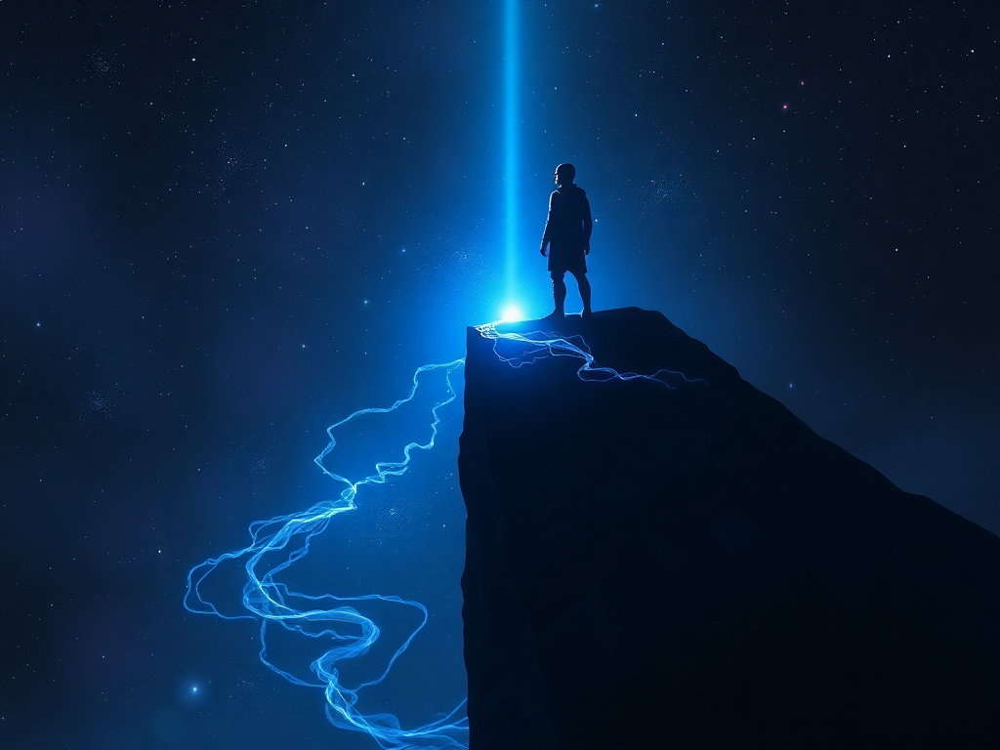

---

## **Storyteller** (05/23/2025 02:34:17)  

*1375300780327960628*

As he stares, a familiar montage begins, yet sharper tonight: the features of Marina appear superimposed over the glowing path – her face, her smile, then an image of her holding a swaddled infant. The images are suffused with warmth and love, a stark contrast to the cold void. Then, just as quickly, they are overlaid with the recurring vision of Clan Del-Fin, his father’s face grim and determined, Mandalorian armor glinting in a firefight against shadowy figures on that red, war-torn landscape – Raxus Prime. The desperation and danger are always palpable, a constant in these nightly visitations.

The pull towards the glowing pathway intensifies, almost painfully. It feels like a choice, a destination. But where does it lead? Safety? Or something else entirely? The harmonic hum deepens, resonating with the pull, urging him forward, more insistently than ever before.

With a start, Wes jolts awake in the narrow bunk. Marina stirs softly beside him, her breathing even. His heart is pounding, the phantom cold of the void still clinging to his skin, the resonant hum echoing in his ears. The dream – this vision – was more vivid, more insistent, more *demanding* than any he'd experienced in the past two months of these almost nightly disturbances. It is 0600 local ship time. The small cabin is quiet, save for the ever-present low thrum of the *Chu'unthor's* engines.

---

## **Storyteller** (05/23/2025 02:35:00)  

*1375300958904520766*

Two months. Two months of this haunted sleep, a counterpoint to days spent fighting for a fragile present. The *Chu'unthor II*, their wounded sanctuary, had limped into orbit around Karthos Prime, a world swathed in emerald jungles and shrouded in perpetual twilight beneath its dense, triple-canopy. The air here was thick with the scent of alien pollen and damp earth whenever the reclamation systems cycled, a constant reminder of the alien world below. The ancient, cyclopean ruins scattered across its surface, remnants of a civilization long turned to dust, offered a degree of sensor baffling, or so Master Astrogator Zylia Korta hoped. Captain Aris Thorne kept the ship in a cautious, high orbit, balancing the need for concealment with the ship's groaning reluctance to perform complex maneuvers.

The strain was telling. Chief Engineer Rorin Gaxx was a wraith of perpetual motion and grumbling, his Mon Calamari features etched with exhaustion as he and his teams, including Marina when her expertise was needed for less strenuous diagnostic work, battled failing systems with dwindling parts. Commander Lyra Heston, the ship's XO, maintained an iron grip on operations, her daily briefings with Quartermaster Boriv Tem a grim litany of depleting fuel, food, and medical stores. The Jedi Council, led by Master Altis, convened almost daily, their discussions in the main briefing room often overheard as hushed, urgent tones when passing by Deck 3.

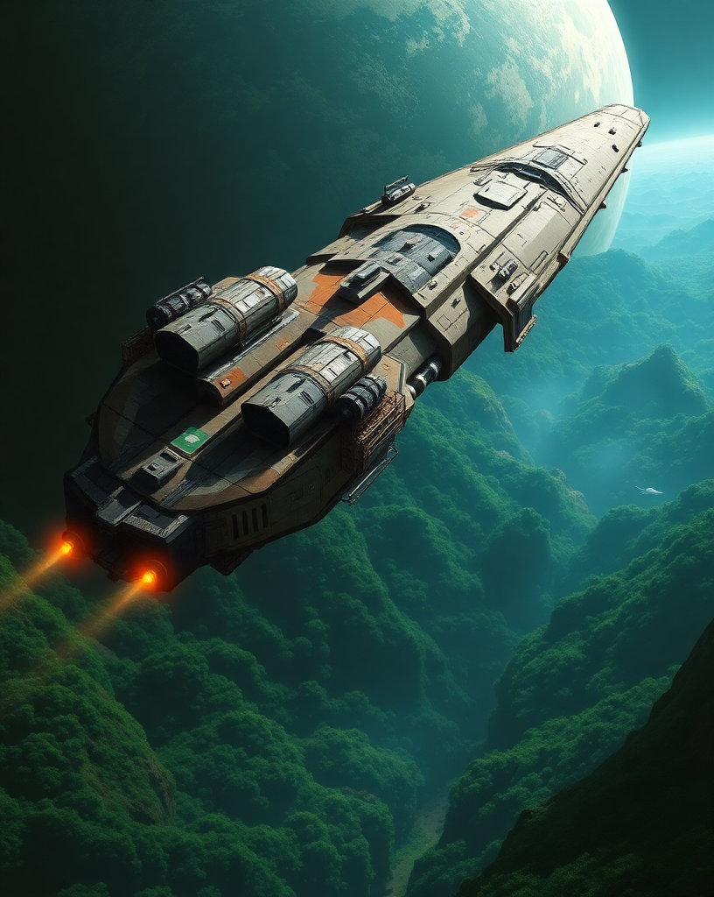

---

## **Storyteller** (05/23/2025 02:35:25)  

*1375301064538063002*

For Wes, the past two months had been a relentless cycle of vigilance and uneasy introspection. Master Davion's training in mindfulness and Force awareness, shared with Adalyn and the Zakeggs, provided a much-needed anchor. He'd learned to better center himself, his raw Force abilities slowly coming under a more measured control. When not in these sessions, his Mandalorian instincts and growing sense of responsibility found an outlet. Under the watchful eye of Security Chief Torvin Kress, Wes had taken on regular internal security patrols, his keen senses and combat readiness a welcome addition to Kress's thinly stretched teams. He’d also led several small, heavily armed resource-gathering expeditions down to Karthos Prime's perilous surface. These missions were fraught with danger: the jungle teemed with venomous insects the size of his fist, predatory stalkers with bioluminescent eyes that pierced the gloom, and sudden, treacherous sinkholes hidden beneath carpets of luminous fungi. The air itself, while breathable, carried spores that could induce vivid hallucinations if filters weren't meticulously maintained. Their hauls were often meager – patches of edible tubers, strange but apparently potable water from deep caverns, or occasionally, salvageable metallic fragments from the crumbling ruins that could be repurposed by Gaxx. Each return to the *Chu'unthor* was a small victory, a brief respite before the gnawing anxieties resurfaced.

The most constant of these was the silence, then the fragmented, desperate whispers from his father, Cal Del-Fin. Aided by the brilliant young Mirialan Comms Lead, Elara Vayne, and Master Davion's cautious oversight, Wes had managed to penetrate the blackout around Raxus Prime, only to receive coded messages that spoke of Clan Del-Fin’s desperate fight for survival against an increasingly dominant Imperial presence. Their original Republic contract was now a death sentence.

---

## **Storyteller** (05/23/2025 02:36:03)  

*1375301224521404436*

And always, in the quiet moments, in the stillness of their shared quarters on Deck 16 – a small, private cabin Davion had secured for them a few weeks ago, a step up from his old bunk room now filled with refugees – the Wayfinder pulsed in his mind. Its call, in dreams and waking thoughts, was a silent counterpoint to the immediate, crushing needs of the fugitive fleet, a future unknown beckoning from a past he couldn’t decipher.

---

## **Wes Del-Fin 80/80 CT 0 | FP 5 DP 5** (05/23/2025 23:17:50)  

*1375613730347417652*

Wes sat upright with a jolt.  The cool air of the newly assigned private cabin Master Davion had been able to get assigned for Marina and himself.   It was double the size of the small crew quarters they had originally shared when she surprisingly arrived aboard what they now call home.   

Cold sweat dripped down off his chin onto his bare chest.  The visions and intense dreams had returned once again.   Their nightly return had been constant visitation since his interaction with the Wayfinder.   That interaction had stirred something within him.  What that was and he didn’t know but he had increased his research on anything Wayfinder related.   The available info was sketchy and very lacking.   In fact he doesn't know much more than he had learned that afternoon just a couple months ago.  

This time the visions were different, stronger.  More urgent in nature and insistent.  It felt as if the Wayfinder was *lonely* if that was even possible.   It was the first time he had felt it.  Something was changing and what bothered him was that he had no idea what it was.   What did did know was that the Wayfinder was a part of it if not *the* part of it.   The pull he felt from it in the dream was becoming stronger and almost urgent in its calling.  Pulling him in a direction along the most brilliantly lit pathway into the darkness of the void.   He shook his head as he brought up a hand to wipe the sweat off his face.   He swung his feet off the side of the shared bed and let both hands rest on the mattress at his sides.

---

## **Wes Del-Fin 80/80 CT 0 | FP 5 DP 5** (05/23/2025 23:18:09)  

*1375613808294367355*

Then there was the nightly montage that always happened.  Tonight’s images  were sharper and more focused than ever.   Marina standing holding an infant swaddled in a blanket.  Her smile as beautiful as ever was there looking at him.    As quickly as she appeared she faced from view and the background changed to a war torn landscape tinted red.   Raxis Prime where his father and Clan Del-Fin were holding out.   His frustration rose causing him to take a deep breath to get it under control.   Quickly the frustration was replaced with a calm.   Letting the breath out slowly he looked over to where Marina laid on her side sleeping soundly.     Smiling at the now obvious belly bump he gently laid his hand on her stomach.   He reached out to the growing baby inside letting his presence encompass it with feelings of love and safety.  He smiled, finding it almost impossible to believe how his life had changed in less than six months and knowing that he wouldn’t change a thing.    

Standing he moved to the small kitchen area where he grabbed a glass and had a drink of water.  He looked over to where Marina slept.   She knew about his nightly dreams but he hadn’t told her that they were becoming more urgent, almost a desperate need for action.   He decided then and there that when she awoke he’d tell her.  Turning around he got the caf going.   It was a rationed commodity and they had decided that they would brew a small pot for the two of them when they woke.   He knew that the aroma would wake her.  Setting the two mug out for later he moved towards the refresher and the shower it contained.  He hoped that the running hot and cold water would help clear his mind and wash out the night's dreams.

---

## **Marina Cloudspinner** (05/24/2025 00:27:45)  

*1375631324370698344*

The rich scent of caf, a familiar comfort, gently pulls Marina from the depths of a sound sleep. She stirs, a soft sigh escaping her lips as consciousness returns. Her hand, which had been resting lightly on her own noticeably rounded belly, moves as she stretches languidly under the warmth of the blanket. Even in sleep, her body is attuned to the new life within her.

Her eyes flutter open, adjusting to the dim pre-dawn light filtering into the cabin. She sees Wes is already up, the faint sounds from the refresher indicating he's likely showering. The promise of caf and the thought of him are enough to coax her from the bed. Moving a little more carefully now, mindful of her changing center of gravity, Marina swings her legs over the side of the bunk. She pauses for a moment, her hand returning to rest on her stomach, a soft, almost unconscious smile touching her lips as she feels the faint, fluttering movements from within – a tiny, reassuring presence.

She reaches for the simple, practical robe she now favors, slipping it on against the slight chill of the cabin before the environmental controls fully adjust for the "day" cycle. Dressing quickly, she runs a hand through her sleep-tousled hair, the Padawan braid still impeccably maintained despite everything, and then makes her way towards the small kitchenette alcove, drawn by the aroma of the caf.

---

## **Wes Del-Fin 80/80 CT 0 | FP 5 DP 5** (05/24/2025 02:54:57)  

*1375668365519097978*

Turning the water off Wes thought about several things.  The upcoming expedition down to Karthos Prime.   The need for supplies was ever present.  Even though the runs were very dangerous it was something that helped the ship as a whole.   His father and the Clan holed up on Raxus Prime.  If it hadn’t been for the help from Elara Vayne the Mirilalan Comms lead and Master Davion Wes would have never been able to establish contact with his father.  Their position was perilous but they were holding out.   As with any group that was in league with the Old Republic and the Jedi they were being hunted down as traitors to the Emperor and the Empire.  Lastly, the Wayfinder.  It’s pull was ever present.   Wes felt that it would become necessary to pursue the hidden information it contained at some point.   He just hoped it would be soon.  

Stepping out of the shower he dried off and wrapped the towel around his middle.    Running his hand back and forth over his short hair he pushed it over to the side.  He could sense that Marina was awake.   The smell of the brewed caf had made its way into the refresher.   The low rumble of his stomach told him that he was indeed hungry.   He stepped out and saw Marina pouring caf into both of the mugs.   **”Mmmm thank you Rin.  I figured that the smell of the caf would wake you.”**  He walked closer and took the offered mug she held out to him.  He took a sip of the hot caf.   The warmth of the liquid spread from his mouth and throat all the way to his stomach and outward.   He looked at her and he could see the question in her eyes.  He didn’t need the bond, the connection that they shared to know what she was thinking.   He nodded slowly.   **”Yeah.  Again last night.  The dream and images were clearer.  The pull is getting stronger.  Like it’s calling out to me.”**

---

## **Marina Cloudspinner** (05/24/2025 03:50:55)  

*1375682452219105360*

Marina looks up as Wes emerges from the refresher, a towel slung low around his hips, his short hair still damp. She offers him a gentle smile, the warmth in her eyes reflecting the comfort she finds in his presence. She's already poured two mugs of the precious caf, and she extends one towards him as he approaches.

**"It usually does,"** she says softly, her voice still a little husky with sleep, referring to the caf's aroma. **"Good morning."**

She watches him take a sip, her gaze observant, picking up on the subtle cues that betray his restless night even before he speaks – the slight tension in his shoulders, the way his eyes, though meeting hers, seem to momentarily hold the echo of distant, troubling thoughts. She waits patiently, knowing he'll share when he's ready.

As he confirms the dream's return, her smile fades into an expression of quiet concern. She nods slowly, her fingers tracing the rim of her own mug. **"Clearer, you said? And the pull... stronger?"** She sets her mug down on the small counter, giving him her full attention. **"What did you see this time, Wes? Anything new? Or just... more intense?"** The ever-present worry for him, and for the unsettling mystery of the Wayfinder, is evident in her voice, even as she strives to maintain a calm demeanor for his sake, and perhaps for the little one stirring within her. She reaches out, her hand finding his, offering a steadying touch.

---

## **Wes Del-Fin 80/80 CT 0 | FP 5 DP 5** (05/24/2025 13:28:41)  

*1375827853480034405*

He nodded at her question.  **”All the same sights, sounds but more intense.   There was something new.”**  He shook his head and gave his shoulders a shrug that indicated he didn’t know why.   **”Stronger, insistent as if the Force was pulling me in a specific direction.  A brilliantly lit pathway from the precipice I described before out into the deepest, farthest point in the void.”**  He brought up the mug to take another sip.    He looked into her eyes.  They were an anchor for him.   A pivotal point for him to always return to.   **”That light felt inviting.   The rest was the same as it has been since this all started until the end.  The pull to that pathway intensified leading to a choice and or a destination.  The pull was the strongest it’s ever been.”** 

What it all meant he had no idea other than he was tied to the Wayfinder and it wanted him to go somewhere.   And by the way it felt last night, soon.    He saw the concern in her blue eyes as she stood there mug in hand.  He gave her a small smile.  **”I think I need to talk to Master Davion about all this.”**

---

## **Marina Cloudspinner** (05/24/2025 14:01:32)  

*1375836117407895675*

Marina listens intently, her brow furrowing slightly as Wes describes the increased intensity of the dream, the insistent pull towards that brilliantly lit pathway. Her hand tightens on his, a silent reassurance. The Wayfinder, a relic of immense power and unknown purpose, has clearly forged a deep and unsettling connection with him, a connection that seems to be growing more demanding.

**"A specific pathway... inviting, you said?"** she murmurs, her mind racing through the fragmented lore she knows, trying to find any parallel, any explanation for such a direct and powerful calling from an inanimate object, even one so deeply attuned to the Force. **"And it felt like a choice, or a destination?"** She shakes her head slowly, a mixture of awe and apprehension in her expression. **"The Force rarely offers such unambiguous guidance, Wes. For it to be this... insistent, through the Wayfinder..."**

The practical implications are not lost on her. Their lives are already precariously balanced, their small community struggling for survival in a hostile galaxy. The idea of Wes being drawn towards some unknown, distant point in the void, guided by an ancient, enigmatic artifact, adds another layer of profound uncertainty.

When he suggests speaking to Master Davion, a flicker of relief crosses her face. **"Yes,"** she agrees immediately, her voice firm despite the underlying worry. **"Yes, you absolutely should. Master Davion... he understood more about that device in a few hours than anyone else has in who knows how long. He needs to know the dreams are changing, that the pull is intensifying."**

---

## **Marina Cloudspinner** (05/24/2025 14:01:49)  

*1375836190183526472*

Her gaze drifts for a moment to the cabin's small, integrated chronometer display on the wall panel, its soft glow indicating the early morning hours. **"And soon,"** she adds, her focus returning to Wes, a practical edge to her tone now. **"We're due for that Council briefing in the main hangar at 0800, remember? About the... expeditions."** The word "expeditions" carries a weight of its own, another pressing concern for their immediate future. **"You should speak to him before then, if possible, or at least make him aware."**

She pauses, then adds, her voice a little softer, **"And perhaps... perhaps he can offer some guidance on what it might mean, or how to manage this connection without it... consuming you."** Her gaze is earnest, her concern for Wes paramount. The Wayfinder is a mystery, a potential hope, but also, undeniably, a new and growing burden on the man she loves.

---

## **Wes Del-Fin 80/80 CT 0 | FP 5 DP 5** (05/24/2025 15:41:15)  

*1375861211656229068*

Wes nodded at her statement about the Wayfinder being so insistent on a path.   **”I know.  Everyone and everything I've learned in the short time I've been aware of the Force says it doesn’t work like this and yet here we are.   I’ve been given a map to something and no one knows what it is.   For good or bad I’m being steered in a direction.”**  He saw the look in her eye and he nodded.   **”It bothers me as well.”**  

When he mentioned talking to Chase he felt through the Force the agreement within her.   He knew she was concerned for him and despite his own stubbornness he knew he was in over his head with the Wayfinder.  With the mention of the council briefing at 0800 he followed her gaze to the wall chronometer.   It was 0620 and that didn’t leave them a lot of time.  **”I’ll reach out to him now.  See if I or we can see him before 0800.”** He leaned down and gently kissed her lips.  The lingering kiss imparted all his love for her.   Standing straight again he took another sip of the rationed caf.  **”First caf and then get ready.”**  Seeing the questioning look in her eyes he smiled.   **”Okay, okay.   First caf and a message to Chase.”**  He gave her a wink as he walked to the terminal on the wall near the chrono.   Within a moment he had sent off a message to Master Davion.   In it he mentioned the change in his dreams and that he wanted to talk about it before the morning's council meeting.   **”Done.  I’ll finish getting ready in case he messages back quickly.  We both know he may have some idea or may have been expecting this to happen at some point.”**

---

## **Marina Cloudspinner** (05/24/2025 16:40:36)  

*1375876150634745967*

Marina watches Wes, a faint smile playing on her lips as he concedes to sending the message before fully finishing his caf. His dedication, even amidst his own anxieties, is something she deeply admires. The kiss, warm and reassuring, lingers pleasantly as he moves to the terminal.

She takes another slow sip of her own caf, the rich warmth a small comfort against the morning chill and the unsettling nature of their conversation. The Wayfinder... it felt like a slumbering giant they had accidentally prodded, and now it was slowly, inexorably, turning its attention towards Wes. Her own knowledge of such ancient Force artifacts was limited to dusty academic texts and cautionary tales from her former Masters – devices of immense power, often with unpredictable, sometimes dangerous, consequences for those who sought to wield or understand them.

The fact that this one seemed to be actively *calling* to Wes, guiding him with such insistent dream-visions, was beyond anything she had encountered. Her pragmatic mind cataloged the potential dangers, even as another part of her, the part deeply connected to Wes through the Force, felt the strange, almost magnetic pull he described, albeit as a distant echo.

She sets her mug down as Wes finishes his message and states his intention to get ready. **"Alright,"** she says softly, pushing aside her more esoteric concerns for the moment. **"Good. Talking to Master Davion is the right step."** She moves towards the small refresher herself, her own practical needs asserting themselves. **"I should get ready too. No telling what this 'Council briefing' will entail, besides the obvious."** The obvious being, of course, the dire state of their resources and the desperate need for the upcoming expeditions.

---

## **Wes Del-Fin 80/80 CT 0 | FP 5 DP 5** (05/24/2025 18:03:30)  

*1375897013459222689*

Wes nodded at her assessment of the council briefing.   It was probably just going to be more of the same.  Low on resources and they need more.   Which would entail more forays down to Karthon.   While the trips down to the planet's surface have been productive in getting supplies it was not a hospitable place.   Everything there was trying to kill you.   He moved to where his armor was neatly stored along with his clothes.  

As Marina disappeared into the refresher Wes set about the comforting ritual of putting his armor on.   It was a well rehearsed and practiced ritual that his father had taught him as a young boy.  The thought of his father brought forth the dream again of Raxus Prime and the perilous situation his *other* family was in.  

By the time he was finished the Marina had already turned off the water.  She had taken a quick shower, probably quicker than she wanted but he could feel that she wanted to be beside him.  He knew that his nightly dreams troubled her and rightly so.  They were disconcerting to him as well but it was something they would face together.  When she walked out he looked at her.   Her dried off hair, still wet hair, laid atop the robe she had taken in with her.   **”Nothing from Chase yet and that was a quick shower.”**

---

## **Marina Cloudspinner** (05/24/2025 19:39:34)  

*1375921188806590544*

Marina emerges from the refresher, a towel wrapped around her still-damp hair, the simple robe cinched at her waist. The quick shower had been more about function than comfort, a necessary step to face the day. She sees Wes, already partially armored, the familiar sight both reassuring and a stark reminder of the constant readiness their lives now demanded.

**"No point lingering,"** she says, her voice a little clearer after the steam. She gives him a small smile as she moves towards the small table, picking up her caf mug. She sits, taking a grateful sip of the lukewarm caf, the simple routine a small anchor. **"Any news from Master Davion while I was in there?"** She watches him, sensing the undercurrent of his thoughts, the familiar worry for his clan that always seemed to surface when he was in a reflective mood.

---

## **Storyteller** (05/24/2025 19:39:35)  

*1375921190782111895*

About fifteen minutes pass as Wes and Marina share the quiet of their cabin. Wes finishes donning the last pieces of his beskar'gam, the metallic clicks and hisses a familiar counterpoint to the ship's hum. Marina sips her caf, occasionally glancing at the chronometer, the briefing looming.

Just as Wes is making final adjustments to his vambraces, his bracer commlink chimes softly, and a new message notification appears on its display. Marina looks up expectantly.

---

## **Master Chase Davion** (05/24/2025 19:39:35)  

*1375921192103317664*

*(Via Commlink Text Message)*
**Initiate Del-Fin, I received your message. The urgency in your dreams regarding the Wayfinder is indeed concerning. We will speak. However, the Council briefing this morning is of critical importance to all personnel and will require my full attention beforehand. Meet me in my usual instruction chamber near Training Atrium Gamma immediately *after* the briefing concludes. We can discuss this then, before other duties resume. Master Davion.**

---

## **Wes Del-Fin 80/80 CT 0 | FP 5 DP 5** (05/24/2025 20:24:34)  

*1375932511737348270*

He shook his head at her question of a response from Master Davion.   **”No but I imagine he’s busy right now with the upcoming meeting.”**  He found himself drawn back to the images of his father from the night's dreams.  More than once he wished they could just go get them and bring them aboard the *Chu’unthor* but even he knew that was an impossibility.  Still the thought of a Mandalorian clan bolstering the defensive and offensive capabilities of the *Chu’unthor* was a sobering thought.  

As if on queue, as he was making the final adjustments to his vambraces to make sure they sat just right, his bracer comlink chimed.   Tapping the icon so the mesage would appear he looked down and read it aloud so Marina could hear it as well.   **”Well, there we go.   Council briefing first and then updating Master Davion.   I was hoping we could see him first but I had a feeling that wasn’t going to happen.”**  While Chase wasn’t *on* the masters council, he was a respected Master and was often entwined with the goings on aboard the *Chu’unthor.* 

He looked over at His love who was calmly sipping her cup.  While she may not have looked like she was worried about him, he knew she was.   Just like he worried for her.   The good thing was they both knew the other was capable and resilient and that they had each other to lean on if necessary.   **”Take your time getting ready as we don’t need to leave early.   It will give me time to go over the next planned excursion down to the planet.  I just hope they listened to my advice about giving me some more people to take down.  The more eyes when we’re down there the better.”**

---

## **Marina Cloudspinner** (05/24/2025 21:06:22)  

*1375943033463378041*

Marina nods slowly as Wes reads Master Davion's reply. There's a hint of disappointment in her eyes that they can't speak to him sooner, but also an understanding of the priorities. The Council briefing, detailing the upcoming resource expeditions, is undeniably critical for everyone's survival.

**"After the briefing then,"** she confirms, her voice calm. **"It's probably for the best. It will give you time to gather your thoughts properly, and perhaps the Council's announcements will... shed some light on our immediate future, which might affect what you discuss with him."** She takes another sip of her caf, her gaze thoughtful.

She watches as Wes turns his attention to his datapad, his focus shifting to the Karthos Prime excursions. She knows those missions weigh on him – the responsibility of leadership, the inherent dangers of the planet, the constant need to provide for their fledgling community. His desire for more personnel is practical, a testament to his caution despite his Mandalorian courage.

**"More eyes are always better on a hostile world,"** she agrees quietly, setting her mug down. **"Hopefully, Commander Heston or Captain Thorne will have considered your request. The last thing anyone needs is to lose a vital scouting party because they were undermanned."** She rises, stretching slightly, the simple robe falling smoothly around her. **"You're right, we have a little time. I'll finish getting ready. Try not to let the jungle chew you up in your simulations before breakfast, alright?"** A small, affectionate smile touches her lips as she heads back towards the refresher to complete her own preparations for the day and the looming briefing.

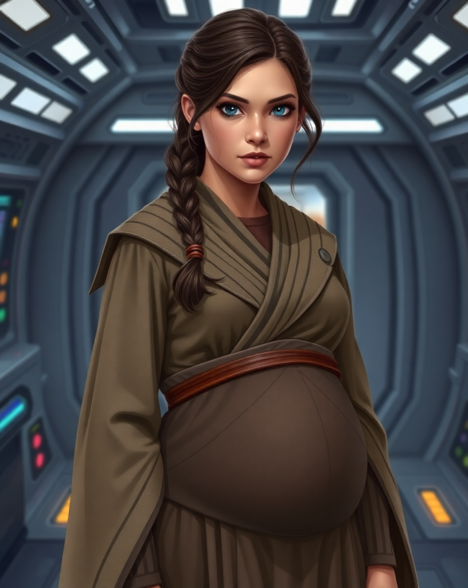

---

## **Wes Del-Fin 80/80 CT 0 | FP 5 DP 5** (05/24/2025 22:25:09)  

*1375962859250651167*

Wes returned her smile.   **”I hope that they do.   We’ve been lucky and prepared every time we go down there.   Now that we know what to expect the danger isn’t as bad but I’d still feel better with more.”**  Despite his young age losing a comrade wasn’t something new.  In battle it’s expected.  Outside of that proper preparation should mitigate most risks.  Yet one could not always be prepared for the unexpected.   It was a thin line they all followed.  

By the time Marina was ready Wes had finished the planning for the next outing.   They were going to try a different grid as scans pointed out some possible locations that could turn out to be good in scavenging the goods and materials they might need.   Looking at his love he smiled.  The Jedi and clothing almost hid the small bump that said she was expecting a child.  She was radiating beauty.    **”Ready Cyar’ika.”**  He said with a smile as he held out a hand ready to escort her as if she was royalty.   She was his needed distraction from the Wayfinder, the expeditions and the general chaos that was the galaxy even if it was only for a short time.

---

## **Marina Cloudspinner** (05/24/2025 23:11:13)  

*1375974452436664410*

Marina emerges from the refresher, her hair now mostly dry and neatly pulled back, her robes settled correctly. She catches Wes's appraising gaze and the offered hand, and a playful huff of mock exasperation escapes her lips, though her eyes sparkle with affection.

**"Oh, are we standing on ceremony now, Initiate Del-Fin?"** she teases, her voice light. Despite the jest, she takes his offered hand, her fingers lacing through his. The simple contact is grounding, a familiar comfort. **"Lead on then, my noble escort. Wouldn't want to be late for the Council's pronouncements of impending doom... or, you know, slightly less dire resource allocation strategies."** Her attempt at humor is a thin veil over the shared understanding of the seriousness of the upcoming briefing, but his gesture, and the love behind it, brings a genuine warmth to her.

---

## **Storyteller** (05/25/2025 14:40:41)  

*1376208357878268025*

The Main Briefing Room on Deck 3 is crowded, the usual hum of its advanced systems overlaid by the murmur of anxious voices and the subtle scent of stale caf and overworked machinery. Emergency lighting casts long, stark shadows, augmenting the standard illumination that flickers intermittently in some sections – a constant reminder of the *Chu'unthor II’s* precarious state. Though the worst of the direct battle damage from the clone attack two months prior has been contained, the ship now groans under the strain of dwindling resources, a slow attrition of failing components and thirsty engines.

Wes and Marina find places amidst the assembled personnel – a mix of robed Jedi, uniformed ship's crew, and a few rugged civilians who look like seasoned scavengers. Adalyn stands nearby, her expression composed but watchful. Around them, some twenty other individuals, likely candidates for the upcoming expeditions, shift restlessly or converse in low tones. The air is thick with a grim anticipation.

---

## **Storyteller** (05/25/2025 14:40:47)  

*1376208384453378121*

At the head of the room, before the large, central holographic display table (currently showing a worrying diagnostic of the ship’s power grid), stand the figures who carry the weight of their collective survival: Master Djinn Altis, his serene face etched with weariness but his eyes holding a steadfast resolve; Captain Aris Thorne, his posture reflecting the unyielding vigilance of a man commanding a ship on the brink; and Commander Lyra Heston, her datapad held ready, her expression stern and focused. Flanking them are other key figures: the ancient Master Astrogator Zylia Korta, her silver eyes seemingly fixed on distant star paths; the harried Quartermaster Boriv Tem, looking as if he carries the galaxy’s dwindling supplies on his own Duros shoulders; and the ever-grumpy Chief Engineer Rorin Gaxx, whose very presence seems to radiate frustration with every failing conduit and sputtering system. Masters Vantos, Sey, and Ta are also present, their expressions reflecting the gravity of the situation. Knight-Healer Jessa Wynn stands slightly apart, a quiet reminder of the medical crisis underpinning the operational one.

As the last few attendees find their places, a hush falls over the room. Master Djinn Altis steps forward slightly, his gaze sweeping over the assembled faces.

---

## **Master Djinn Altis** (05/25/2025 14:45:25)  

*1376209549299679342*

Master Djinn Altis's voice, though laced with a profound weariness, fills the tense silence of the briefing room, carrying the calm authority that has guided the Altisians through so many trials.

**"My brothers and sisters,"** he begins, his gaze encompassing Jedi, crew, and refugees alike. **"Fellow travelers on this difficult path. We gather today at a precipice. The shadow of the Empire lengthens, and our sanctuary, the *Chu'unthor*, strains under the weight of our flight and the scarcity that now plagues us."**

He pauses, letting the stark reality settle. **"For two months, we have endured. We have mourned. We have repaired what we could. But the Karthon Expanse, while offering concealment, offers little sustenance. Our resources dwindle at an alarming rate."**

His gaze sweeps the room again. **"The Council, in conjunction with Captain Thorne and our department heads, has deliberated long and hard. The path forward is fraught with peril, but inaction is a peril we can no longer afford. Therefore, we are initiating 'Operation: Karthon Gambit'."**

He gestures, and the holographic display shifts from the ship's failing power grid to showcase three distinct, hazardous-looking locations deep within the Expanse.

**"We will dispatch three small, independent expedition teams simultaneously. Each team will have specific objectives, critical to our survival. These are not missions of exploration for their own sake, but of necessity. The risks are substantial, but the potential rewards – fuel, essential parts, medical supplies – are vital."**

He nods towards Quartermaster Tem.

---

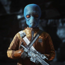

## **Boriv Tem** (05/25/2025 14:49:26)  

*1376210562140213308*

Quartermaster Boriv Tem steps forward, his Duros features looking even more drawn than usual. His datapad screen glows with grim charts. **"Masters, Captain, crew,"** he begins, his voice tight with the strain of his responsibilities. **"The numbers are stark. Fuel reserves for perhaps two short jumps, if we conserve power to a critical minimum. Food synthesizers are operating on emergency rations, outputting barely subsistence-level nutrient paste for all non-essential personnel. Medical supplies..."** He glances briefly at Knight-Healer Wynn, **"...are critically low, particularly advanced antibiotics and surgical disposables. We are cannibalizing non-essential systems for parts, but it's a losing battle. Without a significant influx of these core resources within the next standard cycle, our situation becomes... untenable."** He taps his datapad, and the grim projections flicker across a secondary screen, underscoring his words.

---

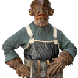

## **Rorin Gaxx** (05/25/2025 14:49:27)  

*1376210563855548627*

Chief Engineer Rorin Gaxx lets out a raspy sigh that sounds like grinding gears. **"Untenable is an understatement, Quartermaster,"** he grumbles, his large Mon Calamari eyes blinking slowly. **"The hyperdrive is stable *for now*, thanks to cannibalizing three sublight engine regulators, but she won't take much more strain. Life support is a patchwork of bypasses. Every cycle, another system screams for attention we don't have the parts for. We're not just running on fumes; we're running on wishes and whatever scrap Depik hasn't already tried to 'improve'."** Despite the grumble, there's a fierce determination in his voice. **"These expeditions *need* to find us compatible power converters, hypermatter regulators, and basic T-C grade plating, or this old girl won't see another sector."**

---

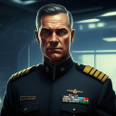

## **Aris Thorne** (05/25/2025 14:50:11)  

*1376210751072632853*

Captain Thorne steps forward, his voice steady and commanding. **"Commander Heston will now outline the operational details and team assignments for 'Operation: Karthon Gambit'."**

---

## **Lyra Heston** (05/25/2025 14:51:20)  

*1376211040039338016*

Commander Lyra Heston activates her datapad, her expression all business. **"Operation: Karthon Gambit will deploy three scout-class shuttles. Each team will consist of specialized personnel to maximize success chances. Strict communication silence will be maintained except for extreme emergencies or confirmed extraction signals. Each team will be equipped for self-sufficiency for a standard 72-hour operational window."**

She brings up the first target on the main holo-display – a cluster of what appear to be derelict mining barges. **"Team Alpha, designation 'Ore-Dredger', will investigate Site Alpha. Objective: Secure raw fuel ore, unrefined tibanna gas if possible, and any salvageable mining equipment or power cells. Knight Taria supervising."**

The display shifts to a ghostly, partially collapsed orbital station. **"Team Beta, 'Med-Stat Recovery', objective Site Beta. Priority: Medical supplies, functional diagnostic equipment, and any intact bacta reserves. Master Krell will lead this team, accompanied by Knight-Healer Jessa Wynn."** Jessa Wynn gives a solemn nod from her position.

Finally, the image changes to a colossal, ancient, and clearly derelict bulk freighter, its hull scarred and dark, drifting amidst a dense asteroid field. **"Team Gamma, 'Shadow Scavenge', will investigate Site Gamma: the derelict bulk freighter designated *Veiled Shadow*. Primary objectives: Locate and secure functional hyperdrive components, navigational systems parts, and any high-capacity power cores. Secondary: General technological salvage."**

---

## **Lyra Heston** (05/25/2025 14:53:03)  

*1376211471909781616*

Commander Heston then looks directly towards Wes, Marina, and then towards a female Zeltron and another human male. **"Team Gamma will be under the primary command of Initiate Wes Del-Fin."** A murmur might ripple through some of the more traditional Jedi present at an Initiate being given such a command, but Heston's tone brooks no argument. **"Your pilot will be Kaelen Varro. Technical assessment and salvage will be managed by Padawan Marina Cloudspinner. Security and systems access by Specialist Seraphina Nyx."**

She pauses, letting the assignments register. **"Further detailed briefings for each team leader will occur with myself, Captain Thorne, and relevant department heads following this general assembly. Master Astrogator Korta will provide final route calculations and hazard assessments for each team's assigned shuttle pilot."** Zylia Korta gives a slow, deliberate nod from her place near the Council members.

---

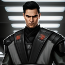

## **Torvin Kress** (05/25/2025 14:53:24)  

*1376211558824415344*

Security Chief Torvin Kress steps forward briefly. **"Each team will have a security contingent assigned from our remaining active personnel. Standard engagement protocols are in effect: avoid conflict if possible, prioritize objective completion and safe return. The *Chu'unthor* will maintain a defensive posture during your absence."**

---

## **Master Djinn Altis** (05/25/2025 14:53:24)  

*1376211561118433290*

Master Altis steps forward once more. **"These missions are not without extreme risk. The Karthon Expanse is treacherous, and what awaits at these derelict sites is unknown. Trust in your training, in your team, and in the Force. The survival of our community may well rest on your success."**

His gaze lingers on the assembled teams. **"May the Force be with you. Dismissed to your section leaders for detailed briefings."**

---

## **Wes Del-Fin 80/80 CT 0 | FP 5 DP 5** (05/25/2025 19:43:08)  

*1376284473917964388*

Wes sat alongside Marina near the center of the gathered personnel.   It was a. Is of Jedi, ships personnel and civilians that had joined up with them.  Looking over at Adalyn he gave her a nod and raised his eyebrows a little bit about the large gathering.  The mood was quiet and grim.   They all knew the current state was concerning.   What they didn’t know was that they were about to find out just how bad it was.    

Leaning over to Marina he spoke quietly as he gestured to the room, **”Bigger gathering than I was expecting.”**  Her only response was a quick nod as Master Altis stepped up and began to talk.  He was flanked by his command crew, so to speak.   Wes had a feeling that this was going to be a significant point in their future.  He quickly laid out the outline of the plan.   Three small teams were going to be sent out simultaneously.   Wes looked over at Marina and raised an eyebrow.  This was sounding like an all or nothing situation.   

One by one others stepped up to detail the situation and laid out the details of the three teams.  Teams Alpha and Beta made good sense.  They would round up the needed fuel and medical supplies that were sorely needed.   Both teams were being led by very capable people.   If what they were sent to fine was there he was sure they would be successful.

---

## **Wes Del-Fin 80/80 CT 0 | FP 5 DP 5** (05/25/2025 19:43:36)  

*1376284591245230101*

When it came to team Gamma and its exploration of a derelict freighter Wes was nodding to himself.  Scavenger hunt for parts.  **”That team is going to need a strong technical crew to go through that freighter.”**  He said quietly as he looked at Marina with a small nod.  When he looked back he saw Commander Heston looking right at the two of them and then at two others.  It was then Heston said who was leading the team that Wes raised his head a bit higher.   Giving Heston a small nod he looked at Varro and Nyx and did the same.  He also heard the slight murmurs among some of the other more traditional Jedi in the room.   With a small breath he looked at Marina.  **”This was unexpected.”**  Despite his words there was a level of confidence in his voice that could be heard and felt.  

He was already thinking about the upcoming briefings and logistics for this mission.  He nodded when Security Chief Kress added that each team would have a security contingent assigned and to follow standard engagement protocols.  As Master Altis dismissed them he gave the Jedi Master a nod and then looked at Marina.  **”Looks like we have some work cut out for us.  Varro and Nyx are good at what they do.   Good additions to the crew.”**  He stood looking at his love. **”Get me a list of what you will need.  I know you don’t need your hand held.”**  He gave her a nod letting her feel his confidence in her and the mission they were tasked with.

---

## **Marina Cloudspinner** (05/25/2025 20:26:17)  

*1376295330441859139*

Marina listens intently as the grim realities of their situation and the desperate "Operation: Karthon Gambit" are laid out. She returns Wes's initial raised eyebrow with a subtle, acknowledging nod – the large gathering speaks volumes about the seriousness of the moment. The dire reports from Quartermaster Tem and Chief Gaxx confirm her own observations from the engine decks: the *Chu'unthor II* is indeed on borrowed time.

When Team Gamma is announced, and Wes is named as its leader, she feels a complex mixture of emotions: pride in the Council's clear recognition of his capabilities, a surge of apprehension for the dangers they will undoubtedly face on the derelict *Veiled Shadow*, and a quiet affirmation of her own role as technical lead. She meets his gaze when he speaks to her after the dismissal, his confidence a reassuring current.

**"Unexpected, yes,"** she agrees softly, her eyes holding his, reflecting both the weight of the assignment and her trust in him. **"But not... unwelcome, to be working alongside you directly on something this critical."** She acknowledges his comment about Kael and Sera with a nod. **"They are. Varro's reputation as a pilot in hazardous space is solid, and Nyx's knack for getting into systems is exactly what we'll need if that freighter's still got any security active."**

A small, determined smile touches her lips as he asks for her list. **"I'll have a list of essential diagnostic tools, salvage gear, and potential component interfaces for you by the time we meet with Heston and Thorne,"** she assures him, her mind already shifting into practical, problem-solving mode. **"And I'll coordinate with Sera on any specific tech she might need for bypassing security on the *Veiled Shadow* itself. We should probably assume its internal systems, if any are active, will be ancient and non-standard."** She gives his hand a quick, supportive squeeze. **"We'll make it work, Wes. We always do."**

---

## **Adalyn Pallax 62/65 CT 0 | FP 6 DP 5** (05/25/2025 20:28:22)  

*1376295855145091092*

Adalyn, standing nearby, has listened to the entire briefing with a focused intensity. The gravity of their situation is undeniable, and the scope of "Operation: Karthon Gambit" underscores their desperation. When Wes is named leader of Team Gamma, she offers him a subtle, respectful nod. It's a significant responsibility for an Initiate, but she has witnessed his courage and growing command presence firsthand. Her gaze flickers briefly towards Marina, a silent acknowledgment of the shared burden and hope now resting on their team. As the briefing concludes and the larger group begins to disperse, Adalyn remains for a moment, her expression thoughtful, perhaps considering her own role in the ship's defense and the training of the younger Initiates while so many experienced Jedi are deployed.

---

## **Storyteller** (05/25/2025 20:29:01)  

*1376296020270649454*

As Commander Heston announces the assignments for Team Gamma, Wes's attention is drawn to the two individuals named alongside him and Marina. He's heard their names mentioned in passing among the crew and other Jedi – specialists who joined the Altisian fleet more recently, refugees bringing unique and valuable skills.

---

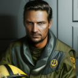

## **Kaelen Varro** (05/25/2025 20:30:27)  

*1376296380741718208*

The first is **Kaelen Varro**, or 'Kael' as he's apparently known. He stands a little apart from the main cluster of Jedi, his posture betraying a restless energy even in stillness. He's human, wiry and sharp-featured, his dark hair close-cropped in a way that might once have been military regulation but is now slightly unkempt. His ex-Republic Navy flight suit is heavily worn, patched in several places, with some insignia artfully removed or covered. His keen, observant grey eyes constantly scan the room, taking in details with a practiced, almost unnervingly focused gaze. He offers a curt, almost imperceptible nod when his name is called, his expression remaining pragmatic, perhaps even a touch cynical, betraying little of what he thinks of the assignment or his new team leader. His reputation as an exceptional pilot, particularly in hazardous, uncharted space, precedes him.

---

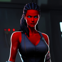

## **Seraphina Nyx** (05/25/2025 20:30:27)  

*1376296382423633921*

The other is **Seraphina Nyx**, 'Sera'. She’s a Zeltron, her vibrant crimson skin a striking contrast to the muted tones of the briefing room and the practical attire of most present. Her dark hair is styled practically for action, perhaps in tight braids or pulled back severely, but there’s an undeniable flair to her presence. Athletic and agile, she moves with a fluid grace. Her expressive, empathetic Zeltron eyes take in Wes and Marina with open curiosity when their team is announced. She wears dark, utilitarian clothing suited for stealth, though accented with personal touches – perhaps unique jewelry or a colorful sash. Subtly integrated into her gear are the tell-tale signs of a slicer: a sophisticated datapad, fine tools clipped to her belt. She offers a brief, confident smile towards Wes when her name is called, a silent acknowledgment of their shared task. Her skills in close-quarters combat and, more critically, her expertise in computer infiltration, are rumored to be formidable.

---

## **Storyteller** (05/25/2025 20:30:29)  

*1376296387922235444*

Both Kael and Sera now turn their attention more fully towards Wes, their new Initiate commander, their expressions a mixture of professional assessment and perhaps a touch of apprehension as they await further instructions or the team-specific briefing.

---

## **Wes Del-Fin 80/80 CT 0 | FP 5 DP 5** (05/26/2025 00:33:18)  

*1376357494968029185*

Wes caught the nod from Adalyn and gave her one back.   He wondered why she wasn’t chosen to be on a team.  She was as capable as any Padawan.  She was a friend and he knew how she felt about her physical status.   He had seen her training improve, mostly first hand when they spared, she was more than capable.   

______

With the meeting over, those assembled that didn’t have assignments stood and began to make their way out of the chamber.   He was happy to hear that Marina’s assessment of Varro and Nyx coincided with his and what he had heard.  As Marina shared her thoughts he nodded.  He was always amazed at how quickly her mind shifted into work mode.   He was thankful to have her along.  At her comment about making it work he smiled at her confidence.  **”Yes we will.”**  He said as he returned the hand squeeze she gave him before letting go to pick up his helmet.  **”Let's go meet Sera and Kael.”** 

Tucking his helmet under his left arm Wes walked alongside Marina to where Sera and Kael had gravitated towards each other.  When they walked up the pair had stopped talking.  Kael still had the same pragmatic and maybe aloof look he had before when his name had been called for the mission.  Sera on the other hand was the complete opposite of the human pilot.  Her smile and the light in her eyes was on key with what Wes knew of Zeltrons.   He had never worked with a Zeltron before but their reputation of hedonistic tendencies was well known galaxy wide as well as a level of natural empathy.   

Giving them both a nod and a small smile he held out his gloved hand to both.  **”Sera, Kael your reputations and skills precede you both.  Let me know of any concerns and what you both will need and I’ll do my best to make sure we have it available.   We’re all going to be working closely so we might as well get the pleasantries out of the way.”**

---

## **Kaelen Varro** (05/26/2025 01:44:05)  

*1376375309464764539*

Kaelen Varro watches Wes and Marina approach, his grey eyes assessing. He doesn't immediately return Wes's smile, his expression remaining guarded, almost appraising. When Wes extends his hand, Kael hesitates for only a fraction of a second before giving a firm, brief handshake, his grip surprisingly strong for his wiry frame. **"Initiate Del-Fin,"** he says, his voice clipped and direct, matching his demeanor. **"Varro. My concern is a shuttle that can handle the junk fields around that derelict without shaking itself apart. And enough fuel to get us there, do the job, and get back, preferably without resorting to 'creative' power rerouting mid-flight."** There's no warmth in his tone, just a statement of practical necessities. He glances at Marina, then back to Wes. **"As for what I need? A clear flight plan from Astrogation once Korta has it, accurate intel on the target's current drift and any known defensive systems, however ancient. The rest, I'll manage."**

---

## **Seraphina Nyx** (05/26/2025 01:44:09)  

*1376375325369438248*

Seraphina Nyx, in contrast, beams a warm, charismatic smile as Wes and Marina draw near. Her empathetic Zeltron nature seems to radiate a genuine openness. She takes Wes's offered hand with a light, confident grip. **"Initiate Del-Fin, Padawan Cloudspinner,"** she greets them, her voice melodious and engaging. **"A pleasure to be working with you both. I've heard good things about your resourcefulness."** She winks playfully before her expression turns more focused. **"Concerns? Only the usual when dealing with ancient, possibly booby-trapped, derelicts in uncharted space – outdated security protocols that might still pack a nasty surprise, unstable data cores, and the delightful possibility of encountering other 'entrepreneurs' who had the same bright idea as us."** Her smile returns, though this time with a sharper, more determined edge. **"What I'll need primarily is unfettered system access once we're on board the *Veiled Shadow*. My standard slicing kit is comprehensive, but if your technical lead,"** she nods respectfully towards Marina, **"identifies any truly archaic or unique interfaces from her initial scans, advance warning would be appreciated so I can prep any necessary custom intrusion scripts. And a reliable security escort,"** she adds, her gaze flicking to Wes's armored form with clear approval, **"is always a plus when you're elbows-deep in a hostile network."**

---

## **Wes Del-Fin 80/80 CT 0 | FP 5 DP 5** (05/26/2025 13:00:36)  

*1376545559652991016*

Wes shook both their hands. If there was a possible polar opposite in personalities he was looking at them.  Kael was standoffish.    Wes didn’t miss the microsecond hesitation when he offered his hand.  The pilot was also direct and all business.   Practical right down to the precise words needed to convey what he wanted.  Kael was not one to talk just to hear his own voice.  If he flew like he talked the flight was going to be crisp and sharp.  

On the opposite side of the spectrum was Sera.  Her warm and inviting smile was a stark contrast to Kael’s no nonsense look.   The playful wink played into what he knew about Zeltrons but when she got down to business Wes found her to be disciplined and on point.  Like Kael she had some priorities and needs as to what she wanted in order to be efficient and effective while on mission.  

Wes nodded as Sera finished.  **”Good Kael I’ll talk with astrogation and make sure that you have your flight plan as soon as they have it ready.  I don’t want any surprises either.  In and out.   Sera I’m sure you and Marina will have lots to talk about.  I think she will enjoy someone who can keep up with her on the tech side versus my blank stares.”**  He gave the Zeltron a smile as he looked at both of them.  **”One last thing.  Please, drop the ‘Initiate Del-Fin’ when it’s casual or when we’re on mission.   Wes will work.   I understand formalities have a time and place but we all know who we are and what we’re doing.  Does that work for you both?”**  Wes knew that many in the order still followed protocol and process right down to the way it’s always been done.  Wes didn’t grow up that way.  Things were always structured and they sometimes ran loose.  Yet  everyone he worked with knew their job and who had the lead.

---

## **Kaelen Varro** (05/26/2025 13:37:46)  

*1376554912703316018*

Kaelen Varro's handshake is firm, brief, and efficient, much like his demeanor. His grey eyes meet Wes's directly, assessing. When Wes mentions getting the flight plan from astrogation, Kael gives another curt nod. **"Good. The sooner the better. Less variables that way. And knowing the approach vectors, potential debris fields, and any gravitic anomalies *before* we're in them is preferable."** He doesn't smile, but there's a flicker of something akin to professional approval in his gaze. At Wes's request to drop the formal title, Kael's expression doesn't change much, but he replies, **"Understood. Wes."** The single word is clipped, devoid of any particular warmth but carrying a sense of straightforward acceptance.

---

## **Seraphina Nyx** (05/26/2025 13:37:46)  

*1376554914855256065*

Seraphina Nyx's handshake is warmer, her grip confident, and her smile widens genuinely as Wes speaks. When he mentions her working with Marina on the tech side, her bright eyes sparkle with enthusiasm. **"Excellent! I've heard Padawan Cloudspinner is brilliant with mechanics and systems. It'll be good to have another mind on the firewalls and any... unexpected 'welcoming committees' that old freighter might have left running."** She winks playfully again at the "blank stares" comment. When Wes requests the informal address, her smile becomes even more open. **"Works perfectly for me, Wes,"** she says, her tone friendly and engaging. **"Formalities can just slow things down when you need to move fast, right?"**

---

## **Marina Cloudspinner** (05/26/2025 13:37:49)  

*1376554926808895540*

Marina, who has been quietly observing the introductions and Wes's initial interactions with their new teammates, offers a small, appreciative smile as Wes addresses Kael and Sera. She catches Sera's enthusiastic glance and gives a slight nod of acknowledgment, a silent promise of future technical collaboration. When Wes requests the informality, and then extends it implicitly by his familiar use of 'Rin' for her in his earlier comment, she feels a sense of relief and warmth. While she understands and respects Jedi protocols, Wes's more direct, Mandalorian-influenced approach often feels more natural to her, especially in a team setting where quick understanding and trust are paramount. She gives a subtle nod of her own agreement to his request for informality amongst the team. **"And Marina is fine too, for me,"** she adds quietly, her gaze meeting Kael's and then Sera's, a small but significant gesture of trust and team cohesion. She feels the subtle shift in dynamics as they begin to coalesce as a unit, however new and untested.

---

## **Wes Del-Fin 80/80 CT 0 | FP 5 DP 5** (05/27/2025 02:46:18)  

*1376753355644342335*

Wes noticed the ever so small flicker of approval on Kael’s face.   The use of his name sans ‘initiate’ was a welcome one.   **”Thanks and like I said when I have that info you will be the first to know.”**  Wes liked him.   He was no nonsense.    If he flew how he presented himself, like ice, he should work out well.  

When it came to Sera it was like looking at a completely different ball of wax.   Her smile was inviting as well as her presence in the Force.  It sounded like she was going to work well with Marina.   They were both technical in scope.   And if the rumors were true, Sera was a capable hand-to-hand combatant.   Between the three of them and the security detail they were being assigned they were shaping up to be a well rounded unit. He smiled at her comment about formalities, happy that she was also accepting of operating on a first name basis.  Her tone was friendly and engaging to both him and Marina.   **”Fast and free Sera..”**  He looked from the crimsoned skinned tech to Marina and Kael.  **”We will all be keeping an eye out.”**   He was beginning to understand the reputation the Zeltrons had.  While she wasn’t overtly flirting with anyone, everyone, males and females, knew where she was.   

With Marina throwing in how she would like to be addressed Wes felt like it was coming together.    It was a solid beginning.  He knew that they would all be tested at some point.    What that test was and how they dealt with it was yet to be seen.   **”Alright lets share comm codes.  This way we can communicate easily and effectively.”**  When that was complete he looked at Marina.  **”I need to talk to Master Davion.  I won’t be long then I’ll see to getting that info and see if we can scrounge up what’s needed.”**

---

## **Kaelen Varro** (05/27/2025 03:28:39)  

*1376764010917138442*

Kael nods once, a flicker of acknowledgment in his grey eyes as Wes confirms the priority of the flight plan. He pulls out a rugged datapad, its casing scuffed from use, and efficiently shares his comm code, his movements precise and economical. **"Understood. Efficiency is key."** He makes no further comment, his gaze already drifting towards the hangar schematics visible on a nearby public display, likely assessing potential shuttle loadouts or exit vectors.

---

## **Seraphina Nyx** (05/27/2025 03:28:39)  

*1376764013144444928*

Sera grins broadly at Wes's "Fast and free" comment, her Zeltron charisma almost palpable. **"Exactly! Why get tangled in titles when you're trying to untangle a hostile network, right?"** She produces a sleek, almost jewel-like personal comm device and quickly exchanges codes with Wes and Marina, her fingers dancing over its surface. **"Looking forward to it, Marina. And Wes, anything I can do to help prep on the tech or security front before we're wheels up, just say the word."** She gives a confident nod to both of them.

---

## **Marina Cloudspinner** (05/27/2025 03:28:40)  

*1376764014142423061*

Marina returns Sera's smile, a genuine warmth in her own eyes. She efficiently shares her comm code as well. **"Sounds good, Sera. I'm sure we'll have plenty to coordinate."** She then turns to Wes as he mentions speaking with Master Davion. **"Alright, Wes. Take the time you need with him. I'll start compiling that initial gear list and maybe see if Quartermaster Tem has any of the more... specialized salvage tools available, or if we'll need to get creative."** She gives his arm a reassuring squeeze. **"We'll be ready."**

---

## **Storyteller** (05/27/2025 03:28:42)  

*1376764022967369858*

With comm codes exchanged and a general understanding established, a sense of purpose settles over the newly formed Team Gamma. Kael, ever practical, might already be mentally running pre-flight checklists. Sera seems energized by the prospect of the mission and the technical challenges ahead. Marina, despite her weariness, is focused and ready to contribute her expertise. They await Wes's return from his conversation with Master Davion before the more detailed team-specific briefing with Commander Heston and Captain Thorne.

---

## **Wes Del-Fin 80/80 CT 0 | FP 5 DP 5** (05/27/2025 16:30:31)  

*1376960774853103626*

With a nod to the newly formed team Wes stepped back, turned and moved away looking for Master Davion.  It only took a moment for Wes to lay eyes on the Jedi Master.  He didn’t have a lot of time but he wanted Chase to be in the know about the new details in his nightly dream that dealt with the Wayfinder.  The mission was now something to draw his thoughts away from the navigational cylinder.  This needed to happen as he couldn’t allow himself and his waking thoughts to be compromised on the mission.  There were others now under ihs command and they deserved from him to be at his best.  

Wes quickly moved From one Side of the chamber to the other.  Chase was now somewhat alone in a small alcoved section as those that had gathered had filtered on out or merged into other groups.  Muted conversations were popping up all around.  Coming to a stop he gave the Jedi, one who had managed to get him to look at the Force differently, a nod.  **”Master Chase.”**  Wes said as he waited for the first question.

---

## **Storyteller** (05/27/2025 18:14:45)  

*1376987004335820820*

Master Davion is indeed in a quieter alcove of the bustling briefing room, concluding a low-voiced conversation with Knight-Healer Jessa Wynn, likely discussing the medical support needed for the three simultaneous expeditions. As Wes approaches, Jessa Wynn offers Davion a respectful nod and moves off to join another group, leaving the Master free.

---

## **Master Chase Davion** (05/27/2025 18:14:45)  

*1376987006290362548*

Master Davion turns as Wes approaches, his calm hazel eyes acknowledging the Initiate. He offers a slight, understanding smile. **"Initiate Del-Fin,"** he greets him, his voice maintaining its usual gentle cadence despite the surrounding activity. He had, of course, anticipated Wes would seek him out. **"I trust the general briefing was... informative, if sobering."** He gestures subtly to a slightly more secluded corner of the alcove, inviting a degree of privacy. **"You wished to speak about the Wayfinder dreams, I presume? The change you mentioned in your message."** He doesn't rush, his demeanor patient, though the underlying schedule for the day is a silent pressure on them all. **"We can speak briefly now, or if you prefer a more focused setting, my offer to meet in the meditation chamber after this still stands. The choice is yours, Wes."**

---

## **Wes Del-Fin 80/80 CT 0 | FP 5 DP 5** (05/28/2025 22:47:32)  

*1377418042916475052*

Wes waited for Knight-Healer Wynn to finish her talk with Master Davion.  It wasn’t long before he was giving Jessa a nod in greeting as she walked away to take care of some duties.  When Master Davion addressed him he stepped closer.  His initial question had Wes shaking his head.  **”No.  going there will just soak up time I don’t have.   Here is fine.”** 

Wes stepped a little closer and began to tell him the differences in the dream.  How the images were sharper and clearer.    That the pull of the Wayfinder was becoming stronger, urgent and insistent.  The map that they all saw in that one split second.   The same one he saw every night since.  This time one path had shown brighter.  The loneliness he felt.   Whether it was from the Wayfinder or the presences held within.  He followed up with the clear images so Rin superimposed over the pathway holding their baby.   His father and Clan Del-Fin on Raxus-Prime.   It was all so vibrant and real looking.

**”Last night was the first time these changes appeared.   It had always been the same as before.  Since the first time I told you about my dreams.”**  He let out his breath.   **”It feels like something is waiting to happen and happen soon.”**

---

## **Master Chase Davion** (05/28/2025 23:55:49)  

*1377435226699206787*

Master Davion listens with unwavering attention as Wes recounts the intensified dream, his calm expression thoughtful. He nods slowly, absorbing the new details: the sharper images, the insistent pull, the singularly illuminated pathway, the unsettling feeling of loneliness from the Wayfinder, and the potent superimposition of Marina, their child, and Clan Del-Fin onto the dream's landscape.

When Wes finishes, his words heavy with the urgency of the experience, Davion remains silent for a moment, his gaze distant as if considering the intricate patterns of the Force Wes has described.

**"The Force often speaks in symbols and feelings, Wes, especially when interacting with artifacts as ancient and potent as the Wayfinder,"** he says finally, his voice still soft but carrying a considered weight. **"What you're experiencing... it suggests the Wayfinder is not merely a passive object. Its connection to you is deepening, and it seems to be reacting to the currents of your own life, your strongest bonds and deepest concerns – Marina, your child, your clan."**

He meets Wes's gaze directly. **"The illuminated pathway, the sense of urgency... this could indicate several things. Perhaps the artifact is sensing a window of opportunity, a specific alignment in the Force, or a critical juncture related to one of the destinations it might reveal. The feeling of 'loneliness' is intriguing; it might be an echo of its own long dormancy, or perhaps a reflection of its purpose – to connect, to guide *to* something, or *someone*."**

He strokes his chin thoughtfully. **"The superimposition of your loved ones onto this path is significant. The Force often uses our deepest emotional anchors to draw our attention, to highlight what is truly at stake, or where our true path may lie."**

---

## **Master Chase Davion** (05/28/2025 23:55:59)  

*1377435268357033986*

Davion pauses, considering the implications. **"This increase in intensity, this sense of impending development... it is a sign we must not ignore. While our immediate focus must be 'Operation: Karthon Gambit' for the survival of all aboard, your unique connection to the Wayfinder remains a critical factor in our longer-term hopes."**

He offers a reassuring look. **"For now, Wes, carry this new information with you. Observe. Be aware. The Force is clearly guiding you, even if the destination remains shrouded. During your mission to the *Veiled Shadow*, be particularly attuned to any shifts in the Wayfinder's pull, any resonance you might feel. The derelict freighter is ancient; there could be unforeseen connections."**

**"After these immediate expeditions,"** Davion concludes, his tone firm but gentle, **"we *will* revisit the Wayfinder with renewed focus, and with the Council's full attention. Your experiences will be paramount to that investigation. For now, channel your energy into the mission at hand. Your clarity and leadership will be vital. And know that I will be meditating on what you've shared."**

---

## **Wes Del-Fin 80/80 CT 0 | FP 5 DP 5** (05/29/2025 12:10:03)  

*1377620001741344778*

Wes looked at Chase as the Jedi Master spoke.  When Marina and their baby were mentioned, he looked over at her.  That the Wayfinder could be using his bond and concerns.   Could the connection to the Wayfinder be increasing in some unknown way.   Anything was possible with this ancient artifact.   His other thoughts about the illuminated pathways parallel his own idea.   It was pointing him in a direction.  

**”Something has just occurred to me just now.  It’s a convenient coincidence that the change in my nightly dream, that deals with an ancient artifact, coincides with my impending mission to the *Veiled Shadow.*  An ancient ship found in a nebula hidden for who knows how long.”**  He shook his head as he looked at Chase.  The look on his face hardened at the prospect of what was to come.  **”Will of the Force or not I don’t like being played with.  Especially when it comes to those I care about.  I want to find out more about that Wayfinder.   I’ll be mindful of any shifts or fluctuations in the Force.  If the *Veiled Shadow* is somehow connected to the Wayfinder perhaps I’ll feel it or it will make itself known.   Either way we *will* get to the bottom of this.  Like you said with the council's attention.  Or not.”**  

Wes held the hardened look as he looked at Chase.  He had come to trust the Jedi Master that had stepped in while Master Rukh healed from his wounds during the execution of Order 66.  He looked up to him and he had a feeling that he knew that.  **”Make sure that the council understands the significance of what’s going on here.  We need to make the connections and figure out what it’s trying to tell me.”**  Feeling some anxiety rise he quickly jumped on it and quelled the feeling.  It was quick enough that probably the only ones who felt it were Master Chase, due to being so close, and Marina.  The complexity of their bond allowed them to be very in tune with each other.

---

## **Master Chase Davion** (05/29/2025 14:50:56)  

*1377660490825859182*

Master Davion meets Wes's hardened gaze, a flicker of understanding in his calm eyes. He recognizes the Mandalorian warrior beneath the Jedi initiate's training – the fierce protectiveness, the intolerance for manipulation, the drive for direct answers.

**"Your observation about the timing, Wes, is astute,"** Davion acknowledges, his voice still even. **"The Force often weaves its threads in such a way that coincidences become signposts. Whether the *Veiled Shadow* holds a direct link to the Wayfinder, or if its ancient nature simply serves as a catalyst for your deepening connection to the artifact, remains to be seen. But your vigilance during the mission will be crucial."**

He notes the rising anxiety in Wes, and the swiftness with which the young man attempts to master it. **"It is natural to feel a sense of urgency, even frustration, when faced with such a profound mystery, especially one that touches upon those you care for so deeply. The desire to protect, to understand, is a powerful motivator."**

Davion's expression becomes a fraction more serious, a hint of the Jedi Master's resolve tempering his gentle demeanor. **"Rest assured, Wes, I grasp the potential significance of what you are experiencing, and I will convey the gravity of this to the Council. The Wayfinder is not merely a curiosity; your connection to it, and these evolving visions, suggest it could be a pivotal discovery for our future."**

---

## **Master Chase Davion** (05/29/2025 14:51:03)  

*1377660517497307299*

He holds Wes's gaze for another moment. **"However, remember that rushing towards answers, especially when dealing with ancient powers, can be as perilous as ignoring their call. Your strength lies in your resolve, yes, but also in the discipline you are cultivating. Trust that the Force will reveal what is necessary, when it is necessary. And trust that we – myself, the Council, Marina – will support you in unraveling this, when the time is right and our immediate survival is less precarious."**

He gives a slight, almost imperceptible nod. **"Now, your team will be assembling for the detailed mission briefing. Focus on the *Veiled Shadow*. Lead your team well. What you learn there may, in itself, shed light on these other mysteries."**

---

## **Wes Del-Fin 80/80 CT 0 | FP 5 DP 5** (05/30/2025 10:56:31)  

*1377963883351900251*

Wes gave Chase a small shallow nod.  He knew that the Jedi Master, who probably wanted the mystery of the Wayfinder unraveled as much as he did, was in a difficult spot.  If the *Chu’unthor’s* situation wasn’t so perilous this whole situation would be different.  Wes wasn't naive to think that he came before anyone else.  The Jedi survived just like a clans, together not broken.

His hardened look on his face softened as Chase mentioned the coming mission and the need for all of them to be focused.   **”The *Veiled Shadow* and what we can salvage is the main priority.   The safety of our home and everyone here is the main priority.  I know you will talk to the council.  Make sure they understand.   Ever since things changed for me I believe less and less in coincidences.   Knowing that I have all of you to help guide, support and push me is a comfort.”**  Wes took a step closer and held out his hand.   **”Thank you Master Davion.  We will get the mission done and keep an eye out for anything else that may help us.”**  Wes flashed a small yet serious smile as he let go of the Master's hand and backed up a step.  With a nod he  turned and made his way back to where Marina was gathered with the others.   The briefing was going to start soon and he needed to make sure that his team was coming together.   He had a feeling that they were going to be tested.   For them to be able to rely on and trust each other would only increase their chances for success.   

As he walked he centered himself focusing on the mission and what lay ahead.   As he walked up he waited for a break in the conversation.  **”The briefing should be starting soon, how’s things here?”**  His demeanor was the same as before.  Yet if anyone could sense the slight change in him it would be Marina.   She always could even if he tried to hide it.  It was a curse and a blessing that she knew and could read him so well.  He also knew he wouldn’t change a thing in that regard.

---

## **Storyteller** (05/30/2025 11:36:36)  

*1377973974084092006*

Wes approaches the small group – Marina, Kael, and Sera – who have been in a quiet, focused discussion near one of the auxiliary display screens, likely reviewing the general mission parameters visible there. The slight shift in Wes's demeanor as he rejoins them – a subtle increase in his resolve, the weight of his conversation with Master Davion now settled – is perhaps most apparent to Marina, who meets his gaze with a questioning but supportive look. Kael glances up, his expression neutral, while Sera offers a brief, perceptive smile.

---

## **Marina Cloudspinner** (05/30/2025 11:36:37)  

*1377973975602167920*

**"Just going over the initial parameters for Site Gamma,"** Marina replies, gesturing to the display. **"Comparing notes on potential system vulnerabilities we might exploit on a derelict that old. Sera has some interesting insights on archaic security protocols."**

---

## **Seraphina Nyx** (05/30/2025 11:36:37)  

*1377973976420192368*

**"Ancient tech has its own predictable flaws, if you know where to look,"** Sera adds with a confident glint in her eye. **"Less sophisticated than modern Republic systems, but often more... bluntly physical in their countermeasures. Should be an interesting challenge."**

---

## **Storyteller** (05/30/2025 11:36:37)  

*1377973978060292166*

Just as Sera finishes speaking, a young Ensign in a crisp utility uniform approaches the group. He looks harried but maintains a professional demeanor.

---

## **Ensign** (05/30/2025 11:36:38)  

*1377973979221852251*

**"Initiate Del-Fin? Commander Heston is ready for Team Gamma's detailed briefing. If you'll follow me, please. The others assigned to your team are already assembling."**

The Ensign gestures towards a nearby corridor leading away from the main briefing hall, presumably towards a smaller, more private briefing room.

---

## **Storyteller** (05/30/2025 11:47:04)  

*1377976606022172723*

The group follows the Ensign down a less crowded service corridor, the sounds of the main briefing hall fading behind them. After a short walk, the Ensign stops before a standard door, not unlike the one to Master Davion's meditation chamber. He announces them, and the door slides open.

The room beyond is smaller, more utilitarian than the grand briefing hall. A central holo-table, currently dark, dominates the space, surrounded by a few functional chairs. Standing near the table are Commander Lyra Heston, her expression as stern and efficient as ever, Chief Engineer Rorin Gaxx, who looks even more perpetually exhausted and grease-stained than usual, and Master Chase Davion, his calm presence a familiar anchor.

Already present in the room are two individuals Wes hasn't formally met but might recognize by sight from around the *Chu'unthor II*. They stand at ease but alert, their attire practical and clearly suited for action.

The first is a human male, stocky and weathered, likely in his late 30s or early 40s. His dark hair is short and streaked with grey, and his eyes are sharp and no-nonsense. A thin, faded scar crosses one cheek. He wears durable, dark utility clothing with scavenged light armor pieces – a shoulder pad, a chest plate – integrated over it. A well-maintained blaster rifle is slung across his back, and a heavy blaster pistol is holstered at his hip. He gives a curt nod as Wes's group enters.

The second is a human female, lean and agile, probably in her early to mid-twenties. Her dark hair is pulled into a tight, practical braid. Her perceptive eyes seem to take in every detail of the newcomers. She moves with a quiet quickness, her dark, close-fitting gear designed for mobility and discretion. A compact blaster carbine is her visible primary weapon, though other tools or smaller weapons might be concealed about her person. She offers a neutral, assessing glance.

---

## **Lyra Heston** (05/30/2025 11:50:10)  

*1377977384506232842*

Commander Heston steps forward as the door closes behind Team Gamma. **"Initiate Del-Fin, Padawan Cloudspinner, Varro, Nyx – welcome. These are the additional security personnel assigned to Team Gamma for the *Veiled Shadow* mission."**

She gestures to the man. **"This is Roric Jannsen. Veteran security operative. He'll be providing heavy fire support and general security."** Jannsen gives another brief, professional nod.

Then to the woman. **"And this is Tessa Raine, callsign 'Echo'. Scout and close-quarters security specialist."** Echo offers a quick, almost imperceptible nod, her gaze sharp.

**"Please, take a seat,"** Heston continues, indicating the chairs around the holo-table. As they settle, she distributes individual datapads to each of the six team members. **"These contain the detailed operational packets for Site Gamma: astrogation data from Master Korta, the communications plan from Lead Vayne, and relevant security and medical advisories. Review them thoroughly. Chief Gaxx will now detail the critical components we need you to prioritize and recover from the *Veiled Shadow*."**

She looks to the Mon Calamari engineer. Gaxx sighs, a sound like a leaky pressure valve, and activates the central holo-table.

---

## **DATA PACKET** (05/30/2025 11:54:22)  

*1377978443060482080*

**DATA PACKET: GAMMA-VS-001**
**FOR: Team Gamma - Expedition to Site Gamma (*Veiled Shadow*)**
**ISSUED: Commander Lyra Heston, COO, *Chu'unthor II***
**DATE:** 78840.7 (Current Day, ~09:30 Local Ship Time)
**SECURITY LEVEL:** Eyes Only - Expedition Leads (Del-Fin, Varro, Nyx, Cloudspinner)

---

## **ASTROGATION DATA** (05/30/2025 12:01:57)  

***Gamma Data Packet*** - *1377980352059932703*

*Prepared by Master Astrogator Zylia Korta*

*   **Target Designation:** Site Gamma - "Veiled Shadow" Derelict
*   **Karthon Expanse Sector Coordinates:** [REDACTED - Provided as Encrypted Navigational File: `GAMMA_NAV_7G.krt`]
*   **Calculated Hyperspace Entry Point (from *Chu'unthor II* current orbit):** Vector 77.4 by -12.9, Epsilon Quadrant (Local Charting).
*   **Jump Duration (Estimated):** 4.7 standard hours (contingent on stable jump window).
*   **Route Profile:**
    1.  Initial Micro-Jump (0.2 hours): Clear local planetary debris shadow (Karthos Prime).
    2.  Primary Hyperspace Leg (3.9 hours): Via "Korta's Passage" (a recently charted, narrow but relatively stable route through the Lesser Karthon Nebula). **Caution:** Route requires precise vector adherence; deviation risks encountering gravitic shearing zones or dense particle clouds.
    3.  Sublight Approach (0.6 hours): Through the "Graveyard Shallows" asteroid field. **High Hazard Rating.** Expect significant sensor interference, unpredictable debris trajectories, and potential gravitic eddies. Recommended approach speed: Quarter impulse, shields to maximum forward.
*   **Known Hazards - Graveyard Shallows (Site Gamma Vicinity):**
    *   **Dense Asteroid Cluster:** Variable sizes, high metallic content (sensor ghosting).
    *   **Unstable Gravitic Pockets:** Can cause sudden course deviations or stress on inertial dampeners.
    *   **Ionized Particle Streams:** Intermittent; can disrupt unshielded sensors and short-range comms.
    *   **Derelict Debris:** Numerous smaller wrecks; potential collision hazard. *Veiled Shadow* itself is likely embedded or partially obscured.

---

## **ASTROGATION DATA** (05/30/2025 12:02:03)  

***Gamma Data Packet*** - *1377980377116704789*

*   **Recommended Final Approach Vector to *Veiled Shadow*:** Vector 192.7 by +33.1 relative to dominant stellar body K-Alpha-793 (pulsar, faint). Approach from "shadow side" to minimize potential detection by any lingering automated systems or rival scavengers.
*   **Contingency Jump Points (Emergency Only - Encrypted):**
    *   Contingency Alpha: [REDACTED - Nav File Only]
    *   Contingency Beta: [REDACTED - Nav File Only]
    *   **Activation Protocol:** Voice Code "Altis's Hope," followed by manual vector input.

---

## **COMMUNICATIONS PLAN** (05/30/2025 12:09:55)  

***Gamma Data Packet*** - *1377982357792886804*

*Prepared by Comms Lead Elara Vayne*

*   **Primary Secure Channel (Team Internal):** Frequency 774.9 MHz (Encrypted: Cipher KAPPA-7).
    *   Short-range only (within shuttle / immediate vicinity of *Veiled Shadow*).
*   **Shuttle-to-*Chu'unthor II* (Long-Range):**
    *   **Primary Burst Transmitter Window:** Every 6 standard hours, commencing 1 hour post-arrival at Site Gamma. Duration: 90 seconds max.
    *   **Frequency:** 109.3 GHz (Tight-beam, Encrypted: Cipher SIGMA-12, rotating key `GAMMA_COMKEY_ROT.dat`).
    *   **Content:** Situation Report (SITREP) - concise, coded. Format: `GAMMA-STATUS-[OPERATIONAL/CAUTION/DISTRESS]-SALVAGE-[EST_PERCENT%]-PERSONNEL-[ALL_GREEN/CASUALTIES_NUM]-NEXT_WINDOW`.
*   **Emergency Distress Beacon (*Void Skimmer*):**
    *   **Activation:** Manual, triple confirmation required. Voice Code: "Varro-Mayday-Gamma."
    *   **Frequency:** Standard Galactic Distress Channel (Channel 1), with Altisian sub-channel encrypt.
    *   **Use ONLY in dire, life-threatening situations.** Activation will compromise operational silence.
*   **Comms Silence Protocol:** Strict comms silence to be maintained outside designated burst windows unless extreme emergency. No unsecured transmissions.
*   **Known Interference - Site Gamma:** Significant electromagnetic interference anticipated from metallic debris and potential active/decaying power sources within the *Veiled Shadow*. Short-range comms may be unreliable at distances over 500m from the shuttle.
*   **Data Uplink (Salvaged Data):** If secure data is retrieved, use one-time encryption key `VS_DATA_KEY_OMEGA.dat` for burst transmission during designated window. Priority: Navigational data, high-value tech schematics.

---

## **SECURITY ADDENDUM** (05/30/2025 12:11:00)  

***Gamma Data Packet*** - *1377982629281792042*

*Prepared by Security Chief Torvin Kress*

*   **Threat Assessment - Ancient Derelicts (General):**
    *   **Automated Defenses:** Expect potential for reactivated security droids, automated sentry guns, or internal traps (pressure plates, laser grids). Assume hostile until proven otherwise.
    *   **Structural Instability:** Hull breaches, failing deck plates, explosive decompression hazards. Move with caution.
    *   **Environmental Hazards:** Vacuum, radiation pockets (check personal dosimeters), toxic gas leaks from decaying systems.
    *   **Biological Contaminants:** Unknown ancient bacteria/viruses. Maintain suit integrity if atmosphere is compromised.
    *   **Rival Scavengers:** Derelicts are often contested. Be prepared for encounters with other salvagers. Standard ROE: Warn, then engage if threatened. Avoid escalating conflict if possible, but prioritize team safety and mission objectives.
*   ***Veiled Shadow* Specifics (Limited Intel):**
    *   Age: Estimated Pre-Old Republic (millennia old). Technology will be archaic, potentially alien.
    *   No known life signs detected on long-range passive scans (highly unreliable in Karthon Expanse).
    *   Source of last known signal: Unknown, centuries ago, logged by obscure Outer Rim survey.
*   **Team Gamma Security Protocol:**
    *   Establish secure perimeter upon boarding.
    *   Scout (Echo) to lead advances into new sections.
    *   Maintain pairs when moving through unsecured areas.
    *   Report any contacts or unusual findings immediately to Team Lead (Del-Fin).
    *   Prioritize non-lethal engagement if encountering unknown sentient life, unless directly attacked.

---

## **MEDICAL ADVISORY** (05/30/2025 12:13:30)  

***Gamma Data Packet*** - *1377983258230394890*

*Prepared by Knight-Healer Jessa Wynn (on behalf of Chief Healer Vokara)*

*   **Standard Expedition Kit Contents:**
    *   Medpacs (x4 standard, x1 advanced trauma)
    *   Broad-spectrum antitoxin hyposprays (x3)
    *   Radiation treatment hyposprays (x2)
    *   Emergency breath masks with limited O2 (x6)
    *   Portable biodiagnostic scanner (x1)
    *   Synthflesh applicators (x2)
    *   Pain relief hyposprays (x5)
    *   Standard Dosimeters (x6)
*   **Known Hazards - Derelict Vessels:**
    *   **Tetanus/Ancient Pathogens:** Risk from puncture wounds or exposure to decaying organic matter. Ensure all suits are sealed. Report any suit breaches immediately.
    *   **Radiation:** Shielding on ancient vessels may be compromised. Monitor dosimeter readings.
    *   **Psychological Stress:** Isolation and hazardous environment can induce stress. Monitor team morale.
*   **Special Note for Padawan Cloudspinner:** Given current condition, avoid direct exposure to unshielded radiation, heavy lifting, and unpressurized environments. Prioritize her safety for remote diagnostic tasks from the shuttle or secured areas if possible. Any injury or unusual symptom must be reported immediately.
*   **Emergency Medical Evacuation:** If severe casualties, use distress beacon. *Void Skimmer* is equipped with basic medical stasis capability for one.

---

## **Wes Del-Fin 80/80 CT 0 | FP 5 DP 5** (05/31/2025 20:12:01)  

*1378466070922530988*

Almost as soon as Wes had rejoined with Marina, Sera and Kael a young ensign appeared.   He quickly brought them into a smaller, more private briefing room that was off the larger chamber.   In the center of the room stood the central holo table that was flanked by Commander Heston, Chief Engineer Gaxx and the familiar face and calming presence of Master Davion.    Wes gave the three a nod before looking at the other two who were present.  Wes recognized them both but did not know them by name.   He could sense that they were both calm and collected.  He also knew that if they were part of his team, like Sera and Kael, they were both very good at what they did.  He could easily see that both were squared away.  Commander Heston was quick to introduce both.   Wes gave both a professional nod as each was introduced.   As expected no time was wasted as they were asked to sit.  Setting his helmet on the surface in front of where he sat he looked up at the projection that Chief Gaxx had brought up.   Wes reached for the datapad that Heston handed out.  The briefing had started.  

The plan was well detailed.  The associated teams and personnel that put it together were very well organized.  Astrogation data that Kael was looking for was on point.   Wes hoped that the pilot would be happy with what was given.  There was also the standard Communications, threat assessment and medical advisories.  They all knew that the *Veiled Shadow* had the potential for various pitfalls.   The more prepared they were the better off they would be.  He nodded as he read down.  He reread the special instructions about Marina twice.  He knew she wasn’t going to be happy about it but it made sense.  **”This looks good.”**  He said as he looked up and looked at his team.  **”Anyone have have any question before Chief Gaxx gives us the rundown on what we’re looking for on the *Shadow?*”**

---

## **Kaelen Varro** (05/31/2025 21:35:44)  

*1378487135618863125*

Kaelen Varro, who had accepted his datapad with a practiced efficiency and was already scrolling through the astrogation section, looks up briefly. His expression is neutral, focused. **"The approach through the Graveyard Shallows is tight,"** he comments, his voice flat and direct, more an observation than a question. **"Sensor ghosting will be an issue. I'll need precise telemetry from Master Korta's data on those gravitic eddies. If the *Void Skimmer's* inertial dampeners get hit unexpectedly in there, it'll be a rough ride."** He taps a section on his datapad. **"And I'll need confirmation on the *Veiled Shadow's* last known stable rotation, if any. Docking with a tumbling derelict of that size in a dense field isn't ideal."** He looks to Commander Heston, expecting clear, concise answers.

---

## **Seraphina Nyx** (05/31/2025 21:35:44)  

*1378487137623736321*

Sera Nyx, after quickly absorbing the comms plan, nods. **"Comms blackout protocols are standard for covert entry. Cipher Sigma-12 is robust enough, assuming Lead Vayne's key rotation is implemented correctly on our end."** She then looks at the security addendum. **"Automated defenses on a vessel that old... could be anything from clunky stun prods to surprisingly nasty particle emitters if any auxiliary power is still online. We'll need to be methodical on entry. Echo,"** she glances at Tessa Raine, **"your initial sweep will be critical."** Her tone is professional, already focused on the operational challenges.

---

## **Marina Cloudspinner** (05/31/2025 21:35:47)  

*1378487151456682185*

Marina, having quickly scanned the general packet, focuses intently on the medical advisory, specifically the note regarding her. A slight frown touches her lips, but she says nothing immediately, understanding the necessity even if it chafes at her desire to be fully involved in any technical challenges. She looks at Wes, then to Heston, a silent acknowledgment in her eyes.

---

## **Storyteller** (05/31/2025 21:35:48)  

*1378487152802795563*

The two new security personnel, Roric Jannsen and Tessa "Echo" Raine, remain silent for now, absorbing the information, their expressions attentive and professional. They look to Wes, their designated team leader, awaiting his direction or the continuation of the briefing.

---

## **Lyra Heston** (05/31/2025 21:35:48)  

*1378487154136711239*

Commander Heston meets Kael's gaze. **"Master Korta's full telemetry on the Graveyard Shallows, including eddy predictions, is embedded in your nav-file, Varro. As for the *Veiled Shadow's* rotation... long-range passive scans are inconclusive due to interference. Assume it has an unstable, slow tumble. You'll need to make a real-time assessment on approach. The *Void Skimmer* is equipped with grappling gear rated for this class of recovery, should a standard docking be impossible."** She then glances at Sera. **"Lead Vayne has personally overseen the comms encryption for all teams. It is secure."**

She looks back at the group, waiting to see if there are further immediate questions before Gaxx begins.

---

## **Wes Del-Fin 80/80 CT 0 | FP 5 DP 5** (06/01/2025 13:53:18)  

*1378733150225829918*

Wes nodded as Kael and Sera both voiced their thoughts.  That was a good thing in his opinion as it showed that they were able to think for themselves and not just be ‘yes men’ so to speak. This mission was going to need everyone focused.  

When he felt the subtle shift within Marina he looked at her.  He guessed she had read the special conditions set in place for her.  He saw the slight frown appear as she looked up and over at him.   He gave her a small nod as he reached out to her.   Their bond provided an easy window to send her support and understanding as the conditions for her were just as much a surprise to him.   ***’We’ll make it work.’***  He sent his thoughts out to her.   

As Heston responded to Kael and Sera he watched Jannsen and Echo.  Both sat impassively yet engaged and professional as the details were laid out.  They were calm and he could sense that they were feeling him out as much as the mission details.   As Heston finished he saw her looking at the team waiting for any questions.  Wes nodded.  **”Yes,”**  He looked at the team's heavy weapons support and scout.  **”What do you two think?   Questions?  Comments on what you’ve read?   Any observations or requests for needed equipment now is the time to ask.”**  He knew that they both needed to feel like they were a part of this team and that what they brought to the table was integral to its success.

---

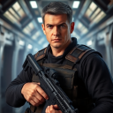

## **Roric "Ror" Jannsen** (06/01/2025 15:04:59)  

*1378751191441473546*

As Wes addresses them directly, Roric Jannsen, the stoic veteran, shifts slightly in his chair. His gaze, which had been fixed on Commander Heston, moves to Wes.**"The security addendum is... sparse on specifics for the *Veiled Shadow*,"** Roric states, his voice gruff and practical. **"Understandable, given its age and unknown status. Standard derelict protocols – unknown atmosphere, potential for dormant biologicals, structural collapse – are all noted."** He taps the datapad. **"My primary concern will be establishing a defensible beachhead at the point of entry and ensuring clear fields of fire for withdrawal if necessary. Request confirmation on our assigned shuttle's defensive armament and the expected Rules of Engagement if we encounter... less than cooperative rival scavengers. Chief Kress mentioned 'warn then engage,' but specifics on escalation would be useful."**

---

## **Tessa "Echo" Raine** (06/01/2025 15:05:00)  

*1378751193647415417*

Echo, who had been quietly observing everyone, leans forward almost imperceptibly. Her eyes, sharp and perceptive, meet Wes's.**"My main concern is intel on the *Veiled Shadow's* internal layout, if any exists beyond general freighter schematics of that forgotten era,"** Echo says, her voice quiet but clear, with a focused intensity. **"Knowing potential chokepoints, vent system access, or likely locations for command decks or primary engineering sections beforehand would significantly reduce our infiltration time and exposure. Also, any information on known energy signatures from the derelict? Even faint ones could indicate residual power to... unexpected systems."**

---

## **Lyra Heston** (06/01/2025 15:05:34)  

*1378751338028077058*

Commander Heston fields the questions from Roric and Echo with practiced efficiency. Addressing Roric first, she states, **"Jannsen, the *Void Skimmer* is a GAT-12 Skipray. Its standard armament includes twin heavy ion cannons and two proton torpedo launchers. Sufficient for deterring rival small craft or dealing with unexpected automated external defenses, but it's not a frontline combat vessel. Your primary defense will be Kael's piloting and the team's internal security."**

She continues, her gaze steady, **"Regarding Rules of Engagement with rival scavengers: The Karthon Expanse is lawless. If non-hostile contact is made, you are authorized to attempt a warning or disengagement. However, if they display hostile intent or attempt to interfere with your mission objectives or threaten the team, you are cleared to engage decisively to protect personnel and secure the objective. Prioritize team safety and mission completion. Capture of rival vessels is *not* an objective."**

---

## **Lyra Heston** (06/01/2025 15:05:41)  

*1378751367073759233*

Turning to Echo, Heston shakes her head slightly. **"Raine, detailed internal schematics for a vessel of the *Veiled Shadow's* age and unknown origin are non-existent in any database we possess. You'll be relying on standard bulk freighter layouts of the approximate (and very ancient) suspected era as a baseline, but expect significant deviation and decay. Lead Vayne's passive scans from the *Chu'unthor* picked up no discernible active energy signatures beyond background radiation consistent with a derelict of that mass. However, the density of the Graveyard Shallows severely limits long-range sensor acuity. Any internal power sources are likely too faint to detect until you are in close proximity or aboard. Your initial on-site reconnaissance will be paramount."**

She pauses, looking back at Wes and the team. **"Understood?"**

---

## **Wes Del-Fin 80/80 CT 0 | FP 5 DP 5** (06/01/2025 16:18:39)  

*1378769727228215352*

His question got them to open up a bit and ask some questions.  That was what he was looking for.   He wanted to know that they had bought into the mission.   Their questions were good and answered by the Commander.   **”We can prep for possibilities for when we get on site.   It’s impossible to be ready for everything but having plans set will help when things eventually go sideways.”**.  He looked at his team when no one else spoke up; he looked back at Commander Heston and nodded.

---

## **Lyra Heston** (06/01/2025 17:02:46)  

*1378780828405862511*

Commander Heston gives a curt nod in acknowledgment of Wes's assessment and the team's engagement. **"Prudent thinking, Initiate Del-Fin. Adaptability will be critical."** She then gestures towards Chief Engineer Gaxx.

---

## **Rorin Gaxx** (06/01/2025 17:03:01)  

*1378780891983249579*

The Mon Calamari engineer heaves another sigh that seems to rattle his jowls, his large eyes blinking slowly as he reluctantly takes center stage. The holo-table before him flickers to life, displaying a rotating series of complex, archaic-looking starship components – massive coils, crystalline arrays, and what look like heavily shielded conduits.

**"Alright, Team Shadow,"** Gaxx begins, his voice a gravelly rumble. **"The *Veiled Shadow*. Pre-Republic garbage scow by the looks of it, which means anything still functional will be a miracle wrapped in a nightmare of incompatible parts. But,"** he taps a clawed finger on one of the holographic components, a large, cylindrical device with intricate energy matrix patterns, **"miracles are what my engine room currently runs on."**

He points to it. **"Primary Objective: Hyperdrive Energizer Coils. We need at least two, preferably three, of these. Specifically, the Mark IV 'Star-Leap' series or anything with a compatible quantum flux rating. They'll look ancient, probably caked in centuries of void dust, but the core crystalline structure might still be viable. If you find any, Padawan Cloudspinner,"** he glances at Marina, **"your diagnostics will be key to assessing their integrity. Don't bring me back fried relics."**

---

## **Rorin Gaxx** (06/01/2025 17:03:10)  

*1378780931346792488*

The image shifts to a complex navigational computer core, looking more like a dense block of interwoven crystals than modern circuitry. **"Secondary: Navigational Matrix Stabilizers. The *Shadow* is old enough that it might predate standardized navicomputer blocks. Look for crystalline guidance arrays, astrogation alignment hubs... anything that looks like it was meant to plot a course through more than just a single sector. Our astrogators are desperate for anything that can help cross-reference Zylia's ancient charts."**

Another image: a bulky, heavily shielded power converter. **"Tertiary: High-Yield Power Converters. Type-Omega or older equivalents. Our main converters are on their last legs. Even one functional unit of this vintage would give us some breathing room for critical systems."**

Gaxx leans on the table, his expression grim. **"These are the priorities. Anything else – raw materials, useful tech of any kind – is a bonus, but don't risk the team or the primary objectives for spare piping, understood? And be warned,"** his voice drops, **"ships that old, if they had any power left, often had... *robust* automated defenses. Don't expect a quiet walk through a museum."** He gives a final, tired gurgle and gestures back to Commander Heston, his part of the briefing apparently concluded.

---

## **Marina Cloudspinner** (06/01/2025 17:05:39)  

*1378781556738490388*

Marina listens intently to Chief Gaxx's rundown, her gaze sharp and analytical as the holographic components are displayed. She makes a few quick notes on her own datapad, her brow furrowed in concentration. The prospect of dealing with such ancient and potentially incompatible technology is a significant challenge, but also one that clearly engages her technical expertise.

When Gaxx directly addresses her regarding the hyperdrive energizer coils and assessing their integrity, she nods decisively. **"Understood, Chief Gaxx,"** she replies, her voice clear and professional, any earlier weariness now overshadowed by focused engagement. **"I'll prioritize diagnostics on any potential 'Star-Leap' coils or equivalents. We'll need to be extremely careful with power-up sequences if they've been dormant for that long to avoid frying what might be left. I'll also look for any intact diagnostic ports, though on a vessel that old, we might need to interface directly with the core matrix if possible."**

She glances at the image of the crystalline navigational arrays. **"Those nav-matrix stabilizers... if they're crystalline based, their data integrity might be surprisingly high, even after centuries, provided there hasn't been severe physical trauma or energy discharge nearby. We'll need to shield them carefully during extraction if we find any."**

Her expression remains serious as Gaxx mentions the power converters and the potential for "robust" automated defenses. **"We'll proceed with caution, Chief. Assessing residual power signatures and potential system traps will be my first step before any attempt at component removal."** She gives a final, confident nod. **"If there are usable parts on that derelict, we'll find them and do our best to bring them back intact."**

---

## **Wes Del-Fin 80/80 CT 0 | FP 5 DP 5** (06/01/2025 23:58:42)  

*1378885503436324874*

Wes listened to Chief Gaxx lay out the three main objectives.   Hyperdrive Energizer Cell, Nav Matrix Stabilizers and High-Yield Power Converters.  All were critical for the continued operation of the *Chu’unthor II*  If they were any to be found they would get them home.   When Marina spoke up he listened to what she had to say.  She knew her business and he had a feeling that pregnancy or no pregnancy she was going to be all in.   When she spoke of the automated defenses and the steps she'd take to handle them he nodded.  **”I also like us to have some Ion weapons available.  If for some reason we can’t disable the automated security defenses ahead of time we can at least try and disrupt them as we find them.”**

---

## **Lyra Heston** (06/02/2025 01:07:16)  

*1378902759956414476*

Commander Heston gives a sharp nod at Wes's practical request and Marina's thorough assessment. **"Sensible addition, Initiate Del-Fin. Ion weaponry could indeed prove invaluable against automated systems of unknown origin."**

She consults her datapad briefly. **"I will authorize a requisition for Team Gamma from Quartermaster Tem: four standard-issue Ion Grenades and two E-5i Ion Blaster Rifles. Ensure your security team members are proficient. These will be in addition to your standard loadouts."**

She then looks around at the assembled team – Wes, Marina, Kael, Sera, Roric, and Echo. **"You have your primary objectives from Chief Gaxx, your astrogation data from Master Korta, and your communications and security protocols. This mission is critical. The *Veiled Shadow* represents a high-risk, potentially high-reward opportunity to secure components vital for this fleet's survival."**

Her gaze is firm. **"Your shuttle, the *Void Skimmer*, is prepped and fueled in Hangar Bay C-7. Expected departure window is 1400 hours, synchronized with Teams Alpha and Beta. You have approximately four hours for final gear checks, personnel preparations, and any last-minute consultations with relevant department heads if absolutely necessary – though keep such requests brief; everyone is under strain."**

**"Master Davion,"** she inclines her head slightly towards him, **"will offer any final words of guidance."** With that, she steps back, her part in the operational briefing largely concluded, leaving the floor for Master Davion.

---

## **Master Chase Davion** (06/02/2025 01:07:25)  

*1378902796262441121*

Master Davion steps forward slightly, his calm gaze moving over each member of Team Gamma. **"You embark on a task that requires not only skill and courage, but also acute awareness – of your surroundings, of each other, and of the subtle currents of the Force that flow even in the desolate places you seek."**

He looks at Wes. **"Initiate Del-Fin, your leadership will be tested. Trust your instincts, but also trust the expertise of your team. Each of you,"** his gaze now includes Marina, Kael, Sera, Roric, and Echo, **"brings vital skills. True strength will come from your cohesion."**

**"The *Veiled Shadow* is ancient, a relic of a forgotten time. Approach it with respect for the unknown, but also with the resolve to achieve your objectives. Remember that even in the darkest, most silent corners of the galaxy, the Force is present. Listen to it."**

He offers a final, encouraging nod. **"May your journey be guided by wisdom, and may you return safely with what our community so desperately needs. The Force be with you."**

---

## **Lyra Heston** (06/02/2025 01:07:25)  

*1378902798451867718*

Commander Heston steps forward again as Master Davion finishes. **"Team Gamma, you are dismissed to make your final preparations. Report to Hangar C-7 no later than 1345 hours for pre-flight. Good hunting."**

The formal briefing concludes. The holo-table display fades, and Chief Gaxx gives a final, weary gurgle before turning to leave, likely to harass some other unfortunate engineers.

---

## **Wes Del-Fin 80/80 CT 0 | FP 5 DP 5** (06/02/2025 11:10:16)  

*1379054509342326876*

Wes gave Commander Heston a nod as she added the Ion grenades and rifles to the team's load out.  He made a few taps on his datapad.  Having them available would be a good addition to their capability.   As Heston started wrapping up the briefing Wes looked at those who compromised the team.  While Marina was the only one he had experience working with the other four were all experienced operators.  From the looks of it they had a solid team. 

When the floor was given to Master Davion, Wes looked over to the Jedi Master that had been helping him and Marina since Order 66.  His words, as always, were calm and guiding.   As Commander Heston took over to dismiss them Wes looked to each of his teammates.  His dark eyes tracked each one for an instant as they finished up.   His eyes finished on Marina who happened to look over at him, she may have felt his feelings as he looked at her.  He gave her a small smile and let it drop as quickly as it had appeared.  He was glad she was coming on this mission.  He knew first hand how good she was at what she did.   

With the briefing concluding he stood with the others giving Heston, Gaxx and Master Davion a nod as they departed.   Looking at his team he motioned with his head for them to go back out into the larger briefing room they had all just been in.   When they had all filed out and moved off to the side Wes stopped and nodded at Roric and Echo.   He held out his hand to each.   **”Wes,”**  He said his name introducing himself to the two newest members.  **”It's good to have you both with us.  Is there anything you need or questions you have before we’re in the thick of it.”**

---

## **Roric "Ror" Jannsen** (06/02/2025 13:16:28)  

*1379086268188590162*

Jannsen meets Wes's offered hand with a firm, no-nonsense grip. **"Roric,"** he replies, his voice gruff but professional. He doesn't offer a smile, but his eyes hold a steady, appraising look. **"The loadout is clear. Standard procedure for derelicts is to assume the worst until proven otherwise. My primary concern is ensuring we have clear fallback positions and cover during entry and any salvage operations. If Echo can identify potential ambush points or structural weaknesses ahead of time, that'll make my job easier."** He glances towards Tessa. **"No immediate questions beyond what's in the packet. Ready when you are."**

---

## **Tessa "Echo" Raine** (06/02/2025 13:16:29)  

*1379086270315102261*

Raine's handshake is surprisingly strong for her lean frame, her grip brief and focused. Her perceptive eyes meet Wes's directly. **"Echo,"** she confirms her callsign. **"The lack of internal schematics for the *Veiled Shadow* is the main challenge from my perspective. I'll be relying on initial sensor sweeps from the *Void Skimmer* on approach, and then direct visual and auscultation once we're aboard. My priority will be identifying safe pathways, potential hazards, and any signs of unexpected activity – automated or otherwise."** She gives a slight nod. **"No specific equipment needs beyond what's standard for recon and infiltration. I trust my gear. I'm ready to move on your command, Wes."**

---

## **Kaelen Varro** (06/02/2025 13:16:29)  

*1379086271519129721*

Kael, who had been observing the exchange with his usual stoic neutrality, interjects, **"I'll get the *Void Skimmer* powered up and run pre-flight diagnostics in Hangar C-7. The astrogation data from Master Korta looks... challenging, but manageable. I'll need an hour to fully integrate it and run approach simulations for the Graveyard Shallows. Best to work out any kinks now."** He gives a curt nod to the group. **"Comms check once I'm in the cockpit."** Without waiting for a dismissal, he turns and heads purposefully towards the lifts, already focused on his part of the mission.

---

## **Seraphina Nyx** (06/02/2025 13:16:32)  

*1379086284328276068*

Sera, having listened to the security team's input, adds with a confident smile, **"While Echo's scouting and Roric is covering our backs, Marina and I can start identifying potential primary system access points based on standard freighter design of that approximate era. If there's anything still powered, or any data cores intact, we'll find them. The comms plan from Lead Vayne is straightforward; I'll have our internal channel secured before we leave orbit."** She looks at Wes, awaiting his overall direction.

---

## **Marina Cloudspinner** (06/02/2025 13:16:32)  

*1379086286245073036*

Marina watches the team interact, a sense of quiet competence settling over the group. She nods in agreement with Sera's assessment. **"I've already got a preliminary list of diagnostic tools and interface conjectures based on Chief Gaxx's component list,"** she says, addressing Wes. **"I'll run it by Sera to see if her slicing kit has any overlaps or if we need anything specialized from Quartermaster Tem's 'vintage collection'."** A faint smile touches her lips at her own jest. **"We should prioritize versatile energy readers and multi-spectrum scanners for assessing those ancient power sources before attempting any direct interface."**

---

## **Wes Del-Fin 80/80 CT 0 | FP 5 DP 5** (06/02/2025 16:57:10)  

*1379141810001281105*

Wes listened as they all gave input on the mission.   When Keal mentioned getting the *Void Skimmer* ready for departure he gave the pilot a nod.  **”We will meet you there.”**

He looked at Echo.  Her observation on having no schematics for the freighter was also a concern for him but he had an idea.  Looking at Sera and Marina he spoke.  **”When we get aboard and you two get a connection to the ship see if you can pull up some schematics of the *Shadow*.  If found, send them out to the team.  Then we can use them on the fly.  They may help us with any surprises and we can start setting up plans for advancing and falling back to the *Skimmer* if that need arises.   Run things through me if you’re able.  If not, I trust that you all know what you’re doing if and when it hits the fan.  Initially I can work with Roric on tactics.  With that said I can shift to be where needed with eyes and Force senses open for any surprises.  If there’s any pressing questions or suggestions now is the time.  We have a few hours.  Let’s all be at Hanger C-7 at 1330 hours.  I’ll make sure Quartermaster Tem gets those Ion weapons and grenades to the *Skimmer*.   Roric, Echo send Sera your comm details so we're all in the loop.”**

He paused as he looked over the team waiting to see if there were any questions.

---

## **Marina Cloudspinner** (06/02/2025 17:47:37)  

*1379154505928806541*

Marina nods, her expression focused and professional as Wes outlines his expectations. **"Understood, Wes. As soon as we can establish a secure interface with any of the *Veiled Shadow's* systems, recovering schematics will be a top priority. I'll work with Sera to get those distributed to the team's datapads immediately. And yes,"** she adds, a hint of reassurance in her voice, **"we'll keep you informed of any critical findings or unexpected system behavior as we encounter it."**

---

## **Seraphina Nyx** (06/02/2025 17:47:38)  

*1379154507795267728*

Sera gives a sharp, confident nod. **"Copy that, Wes. Marina and I will tag-team their systems. If there are schematics to be found, even fragmented or corrupted, we'll dig them out. And don't worry, if things get loud, we know how to adapt and keep critical comms flowing."** She taps her own sleek comm device. **"Roric, Echo, I'll set up a secure sub-channel for us now. Send me your primary comm IDs."**

---

## **Tessa "Echo" Raine** (06/02/2025 17:47:38)  

*1379154509414137886*

Raine also nods in acknowledgment of Wes's plan. **"Schematics would be invaluable for identifying optimal infiltration routes and potential ambush zones. I'll relay any structural anomalies or unusual sensor readings I pick up during my initial sweep to assist Marina and Sera in locating potential data access points."** She efficiently shares her comm ID with Sera. Once the codes are exchanged, Roric and Echo give a final nod to Wes, then turn and head off, presumably to check their gear and mentally prepare for the hazardous mission ahead. Their movements are economical and purposeful, the marks of seasoned operatives.

---

## **Storyteller** (06/02/2025 17:47:51)  

*1379154564200267778*

With their initial team coordination and comms established, and a clear understanding of their immediate next steps, Marina and Sera exchange a look, a silent acknowledgment of the technical challenges ahead. They move off together towards a quieter section of the briefing area and begin comparing notes, finalizing their list of required diagnostic and slicing tools, and strategizing their approach to tackling the ancient systems of the *Veiled Shadow*.

Wes is left for a moment, the weight of command settling more firmly on his shoulders, as his team begins to disperse for their final preparations.

---

## **Wes Del-Fin 80/80 CT 0 | FP 5 DP 5** (06/03/2025 00:50:51)  

*1379261013689372842*

Wes watched as the four who were still present, as Kael had already left to see to the ship, fell into step picking up and carrying plans and ideas for their upcoming mission.  Echo and Roric had set off first to go tend to whatever they needed to before the mission.    He smiled when he saw Marina and Sera exchange a look and it was like two techies sharing an unspoken thought.  Quickly they broke off to a quieter spot in the large room to go over plans.   

Wes looked around.  There were a half dozen or more small conversations going on.  He saw some of the others who were on the other two teams in hushed conversations.  Most likely going over details like Marina and Sera.   He took a deep calming breath and let it out slowly as the reality that five others would be his responsibility to get back safely.  He wasn’t foolish to think that this was going to be easy or that nothing would go sideways.   He knew Marina and from what he could see of the others they were all professional and good at what they do.   That just left him.  Leading others wasn’t new but this was different and the same all rolled into one.   Some would say that a leader is only as good as those under him.    From what he could see he was given a very good team.  He was lucky in more ways than one.   He looked over at Marina as a small smile grew upon his face.  Yes he was lucky. 

Looking at his chrono and noting the time he turned and headed for the exit.  He sent a message to the quartermaster letting her know he was on his way to her the Ion rifles and the grenades.

---

## **Storyteller** (06/03/2025 01:26:36)  

*1379270013659381880*

Wes departs the briefing room, the weight of his new command settling upon him, yet tempered by a quiet confidence in the team assembled. The corridors of the *Chu'unthor II* are a familiar labyrinth, and he navigates them with purpose, heading towards the quartermaster's stores. The ship around him hums with a mixture of strained effort and determined activity as various departments prepare for "Operation: Karthon Gambit."

Quartermaster Boriv Tem's office is located on one of the lower mid-ship decks, near the main cargo holds – a practical, no-nonsense space filled with datapads displaying fluctuating inventory levels and stacks of requisition forms. The Duros quartermaster himself looks even more harried than he did at the main briefing, likely juggling the immense logistical demands of outfitting three simultaneous, high-risk expeditions from their dwindling reserves.

---

## **Boriv Tem** (06/03/2025 01:26:39)  

*1379270025239724085*

As Wes enters, Quartermaster Tem glances up from a datapad displaying what looks like a critical fuel consumption projection, his large Duros eyes ringed with fatigue. He offers a curt, slightly impatient nod. **"Initiate Del-Fin. Your message received. Ion weaponry for Team Gamma, yes?"** His voice is weary but efficient. **"A significant expenditure from our limited ordnance stores, but Commander Heston's authorization is clear."**

He taps a few commands into his terminal. **"The E-5i rifles are older models, but reliable. We have two functional units remaining. Standard power cells. The Ion Grenades are Type-B, effective against droid and automated systems, less so against shielded emplacements, be aware. Four units."** He gestures towards a nearby secured locker. **"They'll be prepped and delivered directly to Hangar C-7, loaded onto the *Void Skimmer* within the hour. Ensure your team handles them with appropriate caution – they are not training charges."** His tone implies he has little patience for carelessness with such valuable, scarce resources. He then looks back down at his datapad, already moving on to the next pressing logistical nightmare. **"Anything else, Initiate?"**

---

## **Wes Del-Fin 80/80 CT 0 | FP 5 DP 5** (06/03/2025 10:36:25)  

*1379408378325110854*

Upon entering the office Wes was assaulted by the organized chaos that was Quartermasters Tem’s office.  The Duros looked tired and Wes did not miss the curtness in the nod that he was given.   Wes noticed the details on the data pace he was looking at.  Fuel consumption leveled were critical and it made the Mandalorian wonder if things could actually be a little worse than what was being said.   

Before even saying anything Tem was givingnhimmtheninfo he needed.   The equipment would be delivered within the hour and that they were all that he had to give out.   Wes nodded in thanks as the no nonsense.   It was clear that if anyone knew how tenuous things were it would be Tem.   When asked if there was anything else Wes nodded.  **”Thank you for the ion gear.  I’m hoping that we won’t need it and can bring it all back.  I do have a question.  Is there anything in particular that’s needed outside of what was mentioned in the briefings?  Anything to keep an eye out for?”**

---

## **Boriv Tem** (06/03/2025 12:10:25)  

*1379432035298312304*

Quartermaster Tem looks up from his datapad again, his large eyes focusing on Wes, perhaps a fraction less impatient now that the immediate business of the ion weapons is concluded. He considers Wes's question for a long moment, the ever-present hum of the ship seeming to fill the silence of his cluttered office.

**"Outside of Chief Gaxx's critical list and the general call for salvageable tech?"** Tem lets out a sigh that seems to carry the weight of every missing ration pack and depleted power cell on the ship. **"Initiate, at this stage, *everything* is needed."**

He leans back slightly, rubbing his temples. **"But if you're asking for specifics that might not have been on the primary lists... high-density nutrient paste concentrate. Unprocessed, raw. Our food synthesizers are struggling with complex reconstitution; raw concentrate is easier to process and stretches further. Any intact medical diagnostic units, even older models, would be a boon to Knight-Healer Wynn – our primary scanners are failing. And frankly,"** his voice drops a little, a note of deeper weariness creeping in, **"any sealed containers of uncontaminated water. Our recyclers are overtaxed and losing efficiency daily."**

He gives Wes a direct, tired look. **"The *Veiled Shadow* is ancient. What you find might be too degraded to be of use, or too alien to interface with our systems. But keep your eyes open for the basics, Initiate. Sometimes the most mundane salvage – food, water, simple medical supplies – can be the difference between one more cycle of operation and... less."** He taps his datapad again, a new list of critical shortages already demanding his attention. **"Just... bring back anything that looks like it might keep us going a little longer. That's all I can ask."**

---

## **Wes Del-Fin 80/80 CT 0 | FP 5 DP 5** (06/03/2025 17:08:33)  

*1379507061544456255*

Wes saw the aliens' eyes soften ever so slightly.  He didn’t need the Force to sense that the Quartermaster was tired and stressed.  Tem was doing all he could to make things stretch as best as they could.  Being outlawed by the Empire has placed such a strain on the ship and all who inhabit it.   When Tem laid out some of the basics that he could really use, Wes nodded.  It was a bit of a shock to hear that things were stretched so thin that it was so perilous.  It boiled down to food, water and medical supplies.  Wes noticed that he was tapping on the datapad again as it chimed with another new request.   **”We’ll keep an eye out for anything that can help the day to day operations. Our primary objectives will come first of course but rest assured we will take everything we can that's useful and not nailed down.  I’ll talk to the other team's leads and see if they can also keep an eye out for that stuff as well.”**  He gave the Quartermaster a nod.  **”Thank you again for the Ion weapons.”**  With that he turned and walked away from the area passing some personnel who were heading to see Tem as well. 

The chat was a wake up call for Wes.  These missions just became that much more important for the continued operation and safety of the Jedi Enclave and all who call the Chu’unthor home.  Wes made his way back to his shared quarters with Marina.  He already had everything he needed but figured his jet pack could come in useful.  

He arrived at Hanger C-7 well ahead of the planned time of 1330 and walked towards the *Void Skimmer.*

---

## **Storyteller** (06/03/2025 18:27:34)  

*1379526945305526393*

Quartermaster Tem gives a weary, almost imperceptible nod as Wes departs, his attention already consumed by the next demanding list on his datapad and the approaching personnel. The weight of the fleet's survival presses heavily on his Duros shoulders.

Wes navigates the familiar corridors back towards Deck 15 and the quarters he shares with Marina. The conversation with Tem has indeed been a sobering reminder of just how thin their lifeline has become. The "Operation: Karthon Gambit" missions are not just about acquiring parts; they are about buying time, buying hope. He considers the jetpack – a versatile tool that could certainly prove useful in the unknown environment of a derelict freighter.

When Wes reaches their cabin, the door slides open to reveal Marina already inside. She's kneeling on the deck beside her duffel bag, which is open, its contents partially spread out. Her specialized mechanic's interface visor is in her lap, and she seems to be carefully checking the connections on a set of delicate diagnostic probes, her brow furrowed in concentration. She looks up as he enters, a brief, focused smile touching her lips before she returns to her task. It's clear she's been using the time to meticulously prepare her own essential gear for the mission.

---

## **Wes Del-Fin 80/80 CT 0 | FP 5 DP 5** (06/03/2025 23:42:58)  

*1379606318498840607*

Wes stepped up to the door to his quarters as thoughts of what needed to be done ran through his thoughts.   It was a last minute decision but he had decided to grab his jet pack.  With the unknowns about the freighter far outweighing what they did know Wes figured it was a good idea to have it and not need it versus the opposite.   Entering the access code the door opened and to his surprise he saw Marina kneeling on the deck.  Her duffel bag was open and several pieces of equipment were out.   

He smiled as he stepped in.  **”Last minute stop to check on things and grab anything we might need huh?”**  The comment was lighthearted as he walked to where he kept the jet pack.   Picking it up he set it on the table giving it a once over.    Fuel was topped off and it was ready to go.  Picking it up he lifted it higher and then lowered it slowly behind his head and down his back.   It took two tries but he was rewarded with the tell tail ‘click’ as it slid home.  With a tug he felt that it was secure.  Looking at his bracer he could see that it was linked in and that it would show up on the HUD of his helmet when he next put it on.      

He removed his heavy blaster pistol from its holster and looked it over.   The power cell was fully charged and it was in good working order.  One thing he was always proud of was how he kept his equipment and weapons.  Mandalorians lived and died by their equipment.   To keep them in working order was as much of an instinct as breathing was.

---

## **Marina Cloudspinner** (06/04/2025 00:11:54)  

*1379613603237462091*

Marina looks up from her diagnostic probes as Wes enters, the sound of the door and his voice pulling her from her focused preparations. She offers a more relaxed smile this time, seeing him.

**"Something like that,"** she agrees, gesturing to her arrayed tools. **"Just wanted to double-check the calibration on these. Ancient systems can be finicky, and the last thing we need is a faulty reader giving us bad data when we're trying to assess if a power core is stable or about to go critical."**

She watches him retrieve and don his jetpack, her eyebrows rising slightly. **"Jetpack, huh? Expecting some zero-G acrobatics on the *Veiled Shadow*?"** There's a hint of teasing in her tone, but also a note of genuine curiosity. It's a significant piece of equipment, not something one brings along lightly for a simple salvage run.

Her gaze follows his movements as he meticulously checks his heavy blaster pistol. She nods in silent approval at his diligence. **"Good to see some things don't change,"** she remarks softly, a subtle acknowledgment of his Mandalorian dedication to his gear. **"Everything on my end is about ready. Just running a final check on the interface protocols for unfamiliar system architecture."** She picks up her interface visor, turning it over in her hands, her expression thoughtful. **"Hopefully, we find something compatible. Or at least something Sera or I can crack without too much... explosive feedback."**

---

## **Marina Cloudspinner** (06/04/2025 00:12:53)  

*1379613850495750265*

Marina slips the specialized mechanic's interface visor over her eyes. The lenses flare with a soft internal light, and her gaze becomes distant for a moment as data streams across her vision. Her fingers make a few almost imperceptible gestures in the air, likely interacting with a projected interface only she can see, subtly controlling the data flow.

After a few moments of this silent review, she raises the visor slightly, perching it on her forehead. **"The standard schematics for bulk freighters of the presumed pre-Republic era are... generalized, to say the least,"** she comments, a slight frown of concentration on her face. **"Hull classifications, primary drive layouts, general cargo bay configurations... but nothing specific enough to give us a real edge on the *Veiled Shadow's* unique systems, especially if it's as old as its energy signature indicates."**

She sighs softly. **"I'm going to stop by the Main Archives before we head to the hangar. Archivist Ree or Master Vantos might have some uncatalogued fragments, deep-core historical data, or even just theoretical papers on truly archaic ship designs that could give us a better idea of what to expect. Even a partial schematic of a similar *class* of vessel from that era would be better than going in completely blind on the internal layout."** She looks at Wes, a silent question in her eyes, seeking his input on the potential detour. **"It might save us valuable time, or prevent a nasty surprise, once we're aboard."**

---

## **Wes Del-Fin 80/80 CT 0 | FP 5 DP 5** (06/04/2025 01:00:43)  

*1379625885610545193*

At her comment about the jet pack he gave her a small nod.  **”Something like that.  I spoke with Quartermaster Tem.  Supplies are worse off than thought.”**  He didn’t sugar coat it.  He saw the questioning look she gave him and he continued.   **”Yeah I was surprised as well but it makes sense.  No one expected the Empire and its betrayal to the Republic.  No opportunity to stockpile critical and needed supplies.  I asked if there was anything else other than the three primary objectives.   Tem mentioned water, food in any form and basic medical supplies.  I'm going to fill in the team to keep an eye out for those things as well.   If we can grab them great but the primary will be the big three from the briefing.”**  Setting his blaster down he looked at her.  There was a look in his eyes that matched the feeling in his presence.  Their situation was very serious.   **”I’m also going to reach out to the other team leads and give them a heads up in case they don't know.  With three teams keeping an eye out for those things it will hopefully increase the odds of finding something.”**

When she mentioned checking the Main Archives he nodded.  It was a very good idea.  One that may prove somewhat fruitful.  If some schematics could be found, even if it was from a similar ship, they could point out where to look.   **”If you do find schematics, look for cargo bays or storage off the galleys.  Maybe we’ll get lucky.  If we can grab some extra supplies while we’re there all the better.”**

---

## **Marina Cloudspinner** (06/04/2025 01:32:57)  

*1379633999894282272*

Marina nods slowly as Wes outlines the grim reality of their supply situation and his conversation with Quartermaster Tem.  **"Water and nutrient concentrate..."** she says, her own expression becoming more somber. **"We'll absolutely keep an eye out for any viable stores, Wes. Every little bit will help. Good thinking on coordinating with the other team leads."**

She takes a deep breath, then lowers her specialized visor back over her eyes for another moment, her gaze flicking rapidly as she likely makes a mental note or flags potential search parameters related to cargo manifests or galley storage in the archaic freighter schematics she's reviewing. The data streams across the internal lenses, invisible to Wes.

After a moment, she lifts the visor again, her movements careful as she detaches a small data-cable connecting it to a port on her bracer computer. She meticulously wipes the lenses with a soft cloth from her kit before placing the delicate interface visor into a padded pouch on her utility belt, securing it with practiced care. 

She shifts slightly as if preparing to rise,  then stops and remains kneeling on the deck. The effort of rising with her changing balance making her hesitate. After a brief internal debate, a faint blush touches her cheeks. She looks up at Wes and extends her hand towards him, a silent request for assistance. Her usual easy grace is subtly hampered, a vulnerability she's still adjusting to sharing, even with him. **"Little help?"** she murmurs, a small, slightly sheepish smile on her lips. Her Jedi robes, while not tight, subtly shift around her midsection as she moves, hinting at the gentle curve of her pregnancy, a curve that would be barely noticeable to a casual observer but one Wes is keenly aware of.

---

## **Wes Del-Fin 80/80 CT 0 | FP 5 DP 5** (06/04/2025 10:47:18)  

*1379773506199359499*

He nodded as he felt her support with the supplies situation.   Knowing that the team would help with keeping eyes open for possible operational sustainable supplies was an added bonus.   Letting his hand go to his utility belt he unhooked his lightsaber.  A new weapon that he had been carrying and using for months now.  He was becoming proficient with it.  Turning it over in his hands he ran his eyes over it.  Like his blaster the energy cell was fully charged.  He took a comfortable grip with it pointing the business end away from Marina and activated it.  The green blade landed out with the familiar *snap-hiss* followed by the low hum of the energy blade.  It was the weapon of a Jedi and it still amazed him that less than a year ago this path he was on wasn’t even a remote possibility.   Closing the weapon down the blade disappeared and he reattached the hilt to its place where it hung freely.  

Quickly and efficiently he picked up his blaster and a few other things as Marina was also packing things away.  He watched as she moved and shifted her weight.  She stopped twice before giving up.  He saw the rising color in her cheeks as she resigned herself to needing a little help.   He knew her body was changing, throwing off what was a finely tuned athleticism.

---

## **Wes Del-Fin 80/80 CT 0 | FP 5 DP 5** (06/04/2025 10:47:42)  

*1379773605944098868*

With a small smile he reached out and took her offered hand and gently helped her to her feet.  Instead of letting go he pulled her closer into an embrace.   He let out a sigh as his arms held her gently. He could feel the baby bump against him.   It made him smile.   **”Cyar’ika I know we both read the mission details and what they put in regarding your activity.   I also know that no amount of mission guidelines will keep you from doing what you believe needs to be done.  You have my support no matter what.”**  His words were soft in the quietness of their quarters.   This was probably going to be the last bit of time they would have to themselves until they were back from the mission.  He bent down and kissed her.   The simple act, as always, brought forth a surge of love and commitment.   **”I’m happy we will be together on this.”**

---

## **Marina Cloudspinner** (06/04/2025 11:35:18)  

*1379785585140432909*

Marina's breath catches softly as Wes, clad in his beskar'gam, ignites his lightsaber, the green blade casting a vibrant glow in the confines of their quarters. The familiar *snap-hiss* and hum fill the small space, a sound that is both the emblem of her Jedi heritage and now, increasingly, a part of his. She watches him check it with the same meticulous care he gives his blaster, a warrior through and through, now wielding the weapon of a peacekeeper. The juxtaposition is still striking, a testament to the extraordinary path he walks.

Marina accepts Wes's offered hand gratefully, her fingers lacing through his. The solid strength of his grip is reassuring as he gently helps her to her feet. She feels the familiar, comforting pressure of his beskar armor as he pulls her into an embrace, the cool metal a contrast to the warmth of his body and the love radiating through their bond. She rests her head against his armored shoulder for a moment, letting out a soft sigh, the slight awkwardness of needing assistance forgotten in the simple comfort of his hold. His hand on her back, the subtle pressure of their shared child between them, is an anchor.

She listens to his soft words, her heart swelling at his understanding and unwavering support. The "mission guidelines" regarding her activity – likely cautioning against strenuous tasks or hazardous environments due to her pregnancy – had been an expected, if slightly irksome, formality. But Wes's immediate reassurance, his trust in her judgment and capability, means more than any official directive.

---

## **Marina Cloudspinner** (06/04/2025 11:35:22)  

*1379785601892487228*

**"Thank you, Wes,"** she murmurs against his chest plate, her voice thick with emotion. **"I... I'll be careful. I promise. But you're right, if there's something critical that needs doing, something only I can handle on the tech side..."** She doesn't need to finish the sentence. He knows her.

She tilts her head back to meet his gaze as he kisses her, the simple act filled with a depth of feeling that transcends words. The surge of love and commitment he projects through their bond washes over her, a powerful reassurance against the uncertainties ahead. **"Me too,"** she whispers back, her blue eyes shining with affection. **"Being together on this... it makes all the difference."** She knows the *Veiled Shadow* will be dangerous, the mission critical. But facing it with Wes by her side, his strength and love her constant anchor, makes even the most daunting challenges feel surmountable. 

She rests her cheek against his armor for another moment, drawing strength from his presence before the demands of the mission pull them apart. With a heavy, reluctant sigh, she says, **"Alright. Archives for me, then. You'll head to the hangar to meet Kael?"**

---

## **Wes Del-Fin 80/80 CT 0 | FP 5 DP 5** (06/05/2025 01:44:23)  

*1379999264112902218*

He held Marina tight.  The intimacy of the shared closeness combined with their bond was a solid rock that he knew they both drew upon.  He wished he could feel the warmth of her body but his beskar armor, that protected him from harm, also blocked the physical sensation of her touch.   Thankfully physical touch and sensation wasn’t the only form of connection as he felt her presence in the Force and let his intertwine with hers.   He knew she would be as safe as possible.   He was happy to know that she wouldn’t take any unnecessary risks unless there was no one else who could do it.   He understood the unspoken words.   They had a job to do.   Many were counting on them.  The needs of the many…

At her mentioning of where they were going next he nodded as he held her just a bit tighter as his thoughts focused on what he was about to tell her.   Through their bond Marina felt a subtle shift.  **”Yeah I’ll be headed to the hangar bay to see Kael and the other team leads.  Before we go I want to mention something that I also mentioned to Chase.  Thinking about the mission pointed me in a direction to line up a couple things.   I know that coincidences can happen but this…”**  His voice trailed on for a second.  **”It's interesting how my dreams changed last night.  Dreams influenced by an ancient Wayfinder tied to the Force that’s wanting to lead me somewhere.”**  He paused for a second.   **”Only to find out today that I’m leading a team to an ancient freighter from who knows when and where.”**   He pulled back a bit so he could look into her eyes.  The unspoken question was in his eyes.   Could the Wayfinder and the *Veiled Shadow* somehow be linked?

---

## **Marina Cloudspinner** (06/05/2025 02:34:38)  

*1380011907523678279*

Marina listens intently, her hand still resting on his armored chest, feeling the subtle shift in his emotions through their bond as he speaks of his dreams and the upcoming mission. She tilts her head slightly, her blue eyes searching his, absorbing his words and the unspoken weight behind them. The Wayfinder's influence, the sudden assignment to the *Veiled Shadow* – she can see the connection he's drawing, the almost unsettling synchronicity of it all.

She doesn't immediately jump to conclusions. Her mind, analytical and grounded by her technical training, processes the information carefully. The Wayfinder is ancient, potent, and clearly attuned to Wes in a way no one fully understands. The *Veiled Shadow* is a derelict of unknown origin, a mystery in itself. Could they be linked? It's a tantalizing possibility, the kind of Force-woven tapestry that Jedi lore often hinted at, but she also knows the dangers of seeing patterns where none exist, especially when under duress.

**"It *is*... a significant alignment of circumstances, Wes,"** she concedes, her voice thoughtful and measured. **"The Wayfinder stirring, showing you more urgent visions, and now this mission to an ancient, unknown vessel."** She pauses, choosing her words with care. **"The Force can work in direct ways, but it can also test us, or guide us through less obvious paths. It's possible the *Veiled Shadow* is simply the immediate, practical challenge before us – a desperate need for resources that the Force is allowing us an opportunity to meet. Your connection to the Wayfinder... perhaps it's being heightened by the overall intensity of our situation, by the focus and energy everyone is pouring into survival right now."**

---

## **Marina Cloudspinner** (06/05/2025 02:34:45)  

*1380011938951729294*

She searches his eyes, offering a steady, rational counterpoint to the more mystical possibilities, though a flicker of intrigue is evident in her own gaze. **"Or,"** she allows, a touch of caution in her tone, **"perhaps you're right, and there *is* a deeper connection we can't yet perceive. The *Veiled Shadow* is an unknown. It could hold echoes of the past, energies, or even technologies that resonate with an artifact like the Wayfinder. We'll need to be incredibly observant once we're aboard."**

She squeezes his hand. **"What did Master Davion say when you mentioned this to him? Does he suspect a direct link?"** Her question is practical, seeking the wisdom of a more experienced Master to help frame Wes's unsettling intuitions.

---

## **Wes Del-Fin 80/80 CT 0 | FP 5 DP 5** (06/05/2025 10:59:47)  

*1380139033073553428*

A small frustrated sigh escaped him as his hand gently rubbed up and down her back.  He wanted to tell her that Master Davion had grand words of wisdom and insight but that wasn’t quite the case.   Not that what was said didn’t help but it was always the same and it was slightly frustrating as Marina could feel the emotion within him.   **”His words were much the same as what you had just said.   It’s a possibility but jumping to conclusions could be…problematic.   So keep eyes and senses open and be mindful of the Force and trust that he, the council and you will support the unraveling of the mystery of the Wayfinder.”**  Even though the words were spoken softly and calmly Marina could sense some frustration in the Mandalorians voice.  

He took a deep breath.  His chest rising against her.  **”In other words we wait for something to rear its head so we can react instead of act.”**  He made a small face as if being perturbed as he raised an eyebrow.  **”I know Rin,”**  He said softly as he gave her a quick kiss before pulling slowly away.  The loving gesture left a lingering electric tingle upon his lips.   **”The Force doesn’t always reveal what it wants in a timely manner.”**

---

## **Marina Cloudspinner** (06/05/2025 12:36:17)  

*1380163318123335723*

Marina nods slowly, understanding Wes's lingering frustration despite Master Davion's counsel. She feels it ripple through their bond – that Mandalorian impatience, the desire for direct action and clear answers clashing with the often enigmatic and maddeningly indirect ways of the Force. She rests her cheek against his beskar chestplate for another moment, offering silent comfort.

**"Patience was never a Jedi's easiest virtue, let alone a Mandalorian's, I imagine,"** she murmurs, a hint of gentle teasing in her voice, trying to lighten his mood. She pulls back just enough to meet his gaze, her blue eyes soft with affection and understanding. **"Master Davion is wise, Wes. And he's right. Forcing answers from something as ancient and powerful as that Wayfinder... or from the Force itself... rarely ends well."**

She traces a finger lightly over one of the seams in his armor. **"It's not just about waiting to *react*,"** she continues thoughtfully. **"It's about being *prepared* to act when the moment is right, when the Force *does* reveal the next step. And that requires observation, awareness, and yes, a great deal of patience."**

She offers him a small, reassuring smile. **"We *will* keep our eyes and senses open on the *Veiled Shadow*. If there's a connection to be found, or a clue to be uncovered, we'll find it. And if not, we'll secure the resources our people desperately need, and that will be a victory in itself."**

The kiss he gives her is a welcome anchor, the familiar tingle a reminder of their own powerful, undeniable connection. She returns it softly before he pulls away.

**"No,"** she agrees, her smile lingering. **"The Force rarely adheres to our schedules. But it hasn't led us astray yet, has it?"** She gives his hand a final squeeze. **"Go. Talk to Kael. Get the *Void Skimmer* ready. I'll head to the Archives and see if the past has any whispers for us. We'll meet at the hangar."**

---

## **Wes Del-Fin 80/80 CT 0 | FP 5 DP 5** (06/06/2025 10:57:51)  

*1380500934307741748*

Wes smiled as Marina said that the Force hadn’t led them astray.  He gave her a nod knowing that was an accurate assessment.   Yet still he wished it would maybe not be so stingy on what it decided to give out.   He returned the squeeze of his hand.  Grateful that she was going to be on the mission.  **”No, it hasn’t led us astray.   It’s done quite the opposite for you and I.”**  He gave her a  nod and the small smile he used only for her.  **”Yes, go to the archives and see what you can find.   I’ll be in the hangar bay.”**  

Wes took a step back letting go of her hand allowing them both ro retrieve the gear they had been going over.  He waited a moment as he looked around the quarters they called home.  A feeling of calm slowly washed over him.  This was their place of safety where they would bring their baby home.   Reaching for his helmet he lifted it up and put it on.  Pulling it down he let it shift into place until it was secure.  **”I’ll see you at the *Void Skimmer Cyar’ika.”**  With his helmet now on that persona he put in place when “working” slid into place.  

The door to his quarters slid closed leaving Marina there to finish gathering her equipment.  He knew she would be out in a moment but they both had responsibilities to tend to.  

The hanger bay was bustling with activity.  All three shuttles were crawling with technical teams making sure that all was in order.  Looking around Wes didn’t see the other two team leads.   It didn’t mean they weren’t in the bay but they weren’t here yet or they were already occupied with something pressing.  Making a beeline for the *Shadow* Wes crossed the hanger bay designated as C-7 as quickly as possible.  The shuttle was looking well prepped with the technical team tending to it and the voice of Kael rising about the noises of the hanger as he tended to the craft.

---

## **Storyteller** (06/06/2025 14:23:48)  

*1380552762525356142*

As Wes strides across the bustling expanse of Hangar Bay C-7, the air thrums with activity. Tech crews swarm over the three designated expedition shuttles – the *Void Skimmer* among them – their movements urgent but precise. The clang of tools, the hiss of hydraulic lifts, and the murmur of countless hurried conversations create a cacophony that speaks of a fleet preparing for a desperate venture. Emergency lights cast long, stark shadows, supplementing the bay's standard illumination, much of which is likely rerouted to conserve power or is simply non-functional.

The *Void Skimmer*, a GAT-12 Skipray Blastboat, sits prepped on its landing struts. Its angular, aggressive silhouette shows signs of hard use – patched hull plating, carbon scoring around the engine cowlings – but its twin heavy ion cannons flanking the reinforced cockpit look well-maintained, a clear statement of its intended purpose.

---

## **Kaelen Varro** (06/06/2025 14:23:52)  

*1380552781756370944*

Kaelen Varro is a whirlwind of focused energy around the shuttle. He's currently perched precariously on a maintenance gantry near one of the *Void Skimmer's* primary thrusters, his voice, sharp and direct, cutting through the hangar noise as he barks instructions at a pair of weary-looking junior technicians.

**"No, no, that coupling needs to be torqued to spec, not 'good enough'!"** he calls out, pointing with a hydrospanner. **"And double-check the fuel line seals again! I don't want any surprises when we're trying to outrun whatever's nesting in that oversized coffin."** He spots Wes approaching and gives a curt nod, his expression all business. **"Del-Fin. Good. Was just about to run the primary ignition sequence. Master Korta's astrogation data is uploading now, but I want to check for any system conflicts with the *Skimmer's* older navicomputer before we're committed."** He gestures towards the open cockpit hatch. **"Give me another twenty, then we can do a full systems check together if you want. The ion gear you requisitioned is already stowed and secured in the aft compartment."**

---

## **Wes Del-Fin 80/80 CT 0 | FP 5 DP 5** (06/06/2025 23:05:00)  

*1380683927664070809*

As Wes drew closer to the *Void Skimmer* he could hear the voice of Kael ordering some weary looking technicians to do what he asked, not what they felt was ‘okay’.   Wes nodded his approval as Kael spotted him giving him a run down and a potential startup sequence in about twenty minutes.   Upon hearing that the ion gear had been delivered and stored away he gave the pilot a thumbs up.   **”Twenty minutes.   Copy that. I’ll check the Ion gear.   I also need to message the other two team leads.   I’ll find you in twenty.”**

Wes turned away and headed for the ship's gangplank as Kael once again started talking to the two techs. Entering the *Skimmer* Wes looked around.   She had been well used but she looked like she had been well looked after and kept up.   Turning towards the aft compartment he made his way to the newly stored gear.   Opening the crate he smiled beneath his helmet.  Inside were the two ion rifles and 4 ion grenades that the Quartermaster had promised.  Wes picked up the two rifles and looked them over.   Each one had a full energy cell and two spare cells beside it.  **”Very good.”** He said aloud to himself.  As he secured the rifle back into its crate and then secured the crate.

---

## **Wes Del-Fin 80/80 CT 0 | FP 5 DP 5** (06/06/2025 23:05:16)  

*1380683994794033204*

Deciding to do the message now he raised his bracer computer and prepared a voice message.  Taking a few seconds he prepared what he wanted to say and then hit record.   **”Knight Traia, Master Kael. I spoke with Quartermaster Tem a for a few moments.   I had asked if there was anything to keep an eye out that wasn’t in our mission parameters.  And there were a few things.   First two were food and water.   High density nutrient paste concentrate.   Unprocessed, raw and any containers of uncontaminated water.  Team Beta  is already looking for medical supplies but I figure teams Alpha and Gamma can also keep an eye out for any medical supplies as well.  Obviously our main mission objectives will take priority but we never know what we may come across.  Good luck to you both and your teams.   See you when we all get back.  May the Force be with you.  Del-Fin out.”**

Hitting send on his message he headed out of the aft storage area and up towards the cockpit.

---

## **Storyteller** (06/06/2025 23:58:50)  

*1380697477488967681*

Wes stands in the aft section of the *Void Skimmer*, near the primary ramp. The area is cramped and functional, dominated by the loading mechanism and access to the shuttle's rear systems. A small, reinforced compartment, likely serving as a tiny armory or secure storage, is built into one bulkhead. Tucked away nearby is the purely functional, compact head. The metallic tang of old hydraulic fluid and the faint scent of ozone are noticeable here. It's from this utilitarian space that Wes raises his bracer and records his message to Knight Taria and Master Krell, his voice calm and professional as he details the secondary resource objectives.

Message sent, Wes moves forward, passing through the main hold. This is the largest single space within the blastboat, but "large" is a distinctly relative term. The area feels utilitarian and lived-in, clearly a working space more than a comfort zone. Fold-down acceleration couches and sections of crash webbing are secured along the bulkheads, promising little comfort for the multi-day mission ahead for the six-person team. He can see where two, perhaps three, very compact fold-out bunks might be deployed from a recessed alcove, offering minimal privacy. A small, extremely rudimentary galley consisting of a nutrient paste dispenser, a water recycler, and a tiny heating unit is tucked into one corner, a fold-down table nearby serving as the only communal surface. Lockers and storage compartments are integrated wherever possible, already looking full. Panels in the floor and walls hint at the engineering access points Marina would be interested in. The air is noticeably recycled, and the constant, low hum and vibration of dormant engines and ship systems are a permanent backdrop.

---

## **Storyteller** (06/07/2025 00:02:39)  

*1380698434851573760*

He continues forward, likely ducking slightly to avoid low-hanging conduits, until he reaches the narrow ladder or crawlway leading up to the cockpit. Ascending, he finds himself in the tight confines designed for a pilot and co-pilot. The viewports, crisscrossed with reinforcing struts, offer a decent forward arc out into the busy hangar. The consoles are packed with readouts – many of them older Corellian Engineering Corporation standard, though some panels show signs of non-standard upgrades or hasty field repairs. The pilot's and co-pilot's chairs are currently vacant, the myriad of screens and indicators dark, awaiting Kael and the full power-up sequence. There's barely enough space behind the seats for a third person to stand and observe uncomfortably.

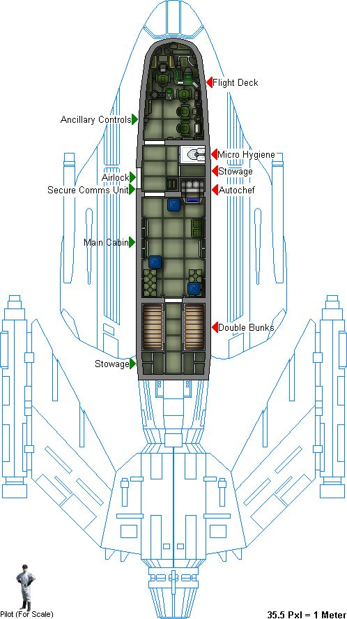

---

## **Kaelen Varro** (06/07/2025 00:03:09)  

*1380698563033567333*

As Wes settles into the still-dark cockpit, he can hear Kael still outside, his voice carrying clearly as he finishes with the technicians on the gantry. **"...Alright, that's better! Now cycle the auxiliary power again and let me see those readings. And if anyone touches that calibration without my say-so, they'll be scrubbing exhaust ports with a nutrient bar wrapper!"** There's a final metallic clang, and then the sound of Kael's boots on the gantry as he presumably makes his way towards the shuttle's main hatch or ramp, his external checks apparently concluding.

---

## **Wes Del-Fin 80/80 CT 0 | FP 5 DP 5** (06/07/2025 10:39:16)  

*1380858645985890375*

Moving slowly through the blastboat wes looked around at the sparse accommodations.   This wasn’t going to be a mission in the lap of luxurious accommodations.  The *Void Skimmer* had one purpose and that was to do a job, whatever that may be.   It was going to be tight quarters for the six of them for the duration.  

Stepping into the cockpit Wes remembered the cramped conditions from being on a blastboat for years earlier.  He was younger and remembered just how tight the cockpit could be with two armored Mandalorians in the already cramped area.   A smile crossed his face as he remembered his father sitting in the pilots chair.  

Reaching out he laid a hand on the co-pilot’s chair.   Spinning it towards him he turned and sat down as he ran his hands over the controls familiarizing himself with them.  He was the only other pilot on the mission and whatever other functions he could do to leave the piloting to Kael he would see to it.   The memory of his father faded away as he heard Kael’s voice carry up to the cockpit, apparently he had the calibrations he had been working on.   Wes settled into the co-pilots chair making sure the added bulk of his jet pack wasn’t in the way. 

Reaching out he activated a display of the ships systems and nodded as they ticked off one by one as green and good to go.   As Kael’s booted steps entered the cockpit he could see Wes nodding at the display.   **”She looks good, Kael.”**

---

## **Kaelen Varro** (06/07/2025 11:57:54)  

*1380878435399897121*

Kaelen Varro swings himself up the short ladder and into the cramped cockpit, his movements economical and practiced despite the tight space. He gives Wes a quick, appraising glance, noting him already in the co-pilot's seat and familiarizing himself with the controls.

**"She'll fly,"** Kael grunts, settling into the pilot's chair and immediately bringing several key systems online with a few deft flicks of switches. The consoles around them flicker to life, bathing the small space in the glow of various readouts and targeting displays. **"Old bird, but CEC built these Skiprays tough. Most of the core systems are green, as you saw. Just had to reroute a secondary power conduit to the port engine starter – Gaxx's techs used a bypass that was... optimistic."** He doesn't elaborate, his focus already on the pre-flight sequence.

He taps a few commands into his own console. **"Astrogation data from Master Korta is loaded. Running a diagnostic against the *Skimmer's* navi-comp now. Don't want any surprises when we hit that Graveyard Shallows."** His fingers fly across the controls, his expression intent. **"Shields are charging. Weapons systems are cold but responsive. Life support cycling nominal, for now."**

He glances at Wes. **"You familiar with the GAT-12's sensor suite? It's archaic by Navy standards, but the long-range scanners are surprisingly robust if you know how to filter the noise. Might need you on passive scans once we're in the Expanse proper, looking for anything that doesn't belong, while I wrestle with Korta's 'passage'."** There's a hint of dry skepticism in his voice when he mentions the charted route.
